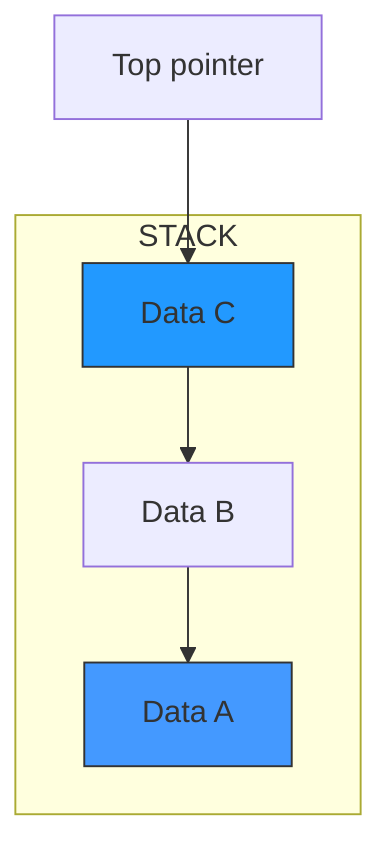
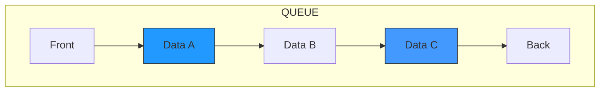
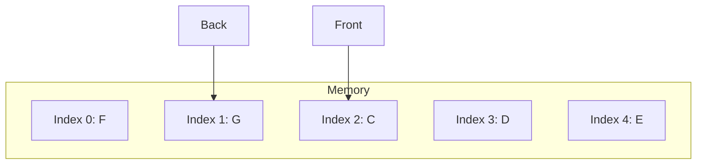
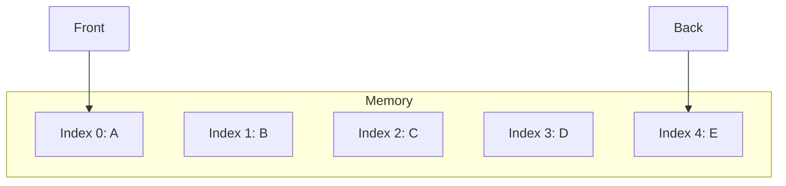
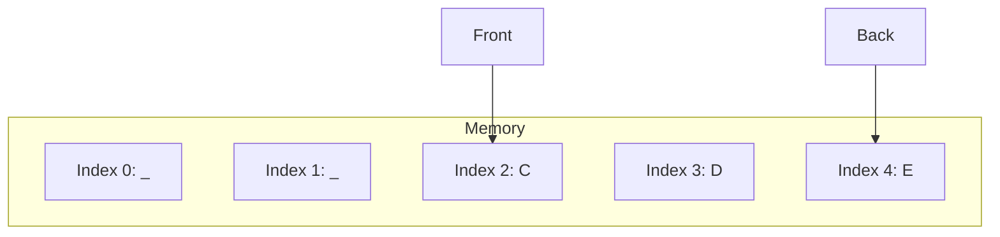
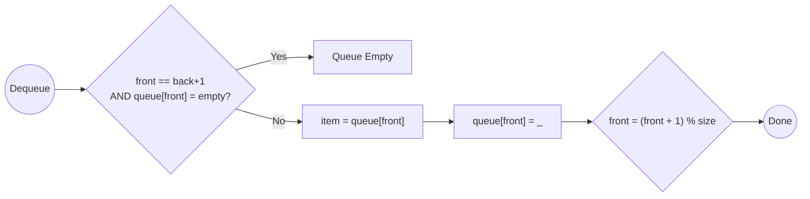
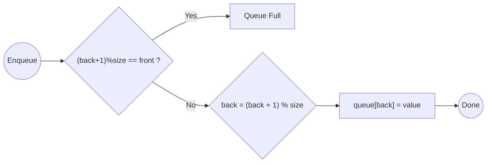
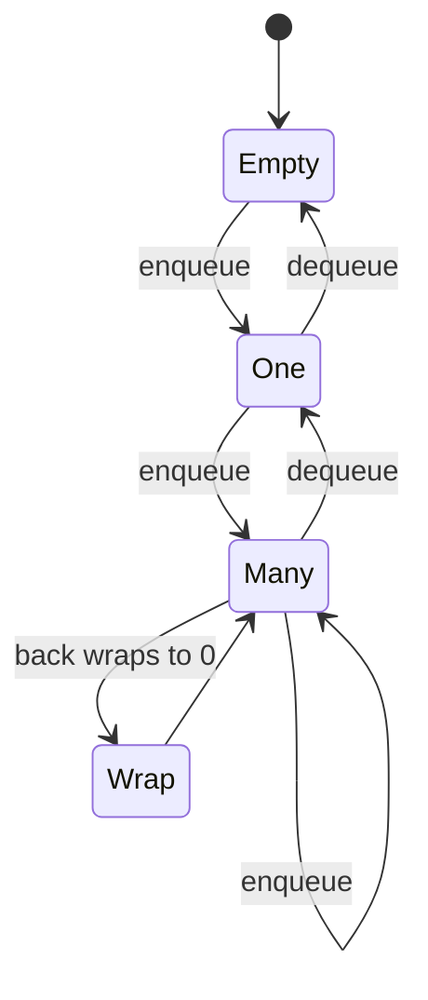
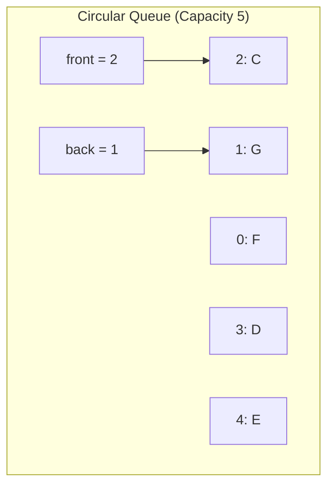

# 🎯 WEEK 2 DAY 4: STACKS & QUEUES — COMPLETE GUIDE

**Category:** Data Structures / Foundations  
**Difficulty:** 🟢 Foundation  
**Prerequisites:** Week 2 Day 3 (Linked Lists), Week 2 Day 2 (Dynamic Arrays)  
**Interview Frequency:** ~95% (Used directly or as helper structures in Trees/Graphs)  
**Real-World Impact:** Powering undo buttons, browser history, CPU scheduling, and breadth-first search.

---

## 🎓 LEARNING OBJECTIVES

By the end of this topic, you will be able to:

- ✅ Explain the LIFO (Last-In-First-Out) and FIFO (First-In-First-Out) principles.
- ✅ Implement Stacks and Queues using both Arrays and Linked Lists.
- ✅ Understand the **Circular Buffer** optimization for array-based queues.
- ✅ Recognize patterns where Stacks (parsing, backtracking) and Queues (buffering, BFS) are required.
- ✅ Analyze the trade-offs between array-based and list-based implementations.

---

## 🤔 SECTION 1: THE WHY — Engineering Motivation

**Purpose:** Motivate stacks and queues with concrete engineering problems and trade-offs.

### 🎯 Real-World Problems This Solves

#### **Problem 1: The "Undo/Redo" Problem (Stack)**
- 🌍 **Where:** Text Editors, Photoshop, Browser History
- 💼 **Why it matters:** Users make mistakes. They want to reverse the *most recent* action, then the one before that.
- 🔧 **Solution:** A **Stack**. Push every action. Pop to undo. The "Last" action done is the "First" one undone.

#### **Problem 2: The "Printer Spooler" Problem (Queue)**
- 🌍 **Where:** Operating Systems, Web Servers
- 💼 **Why it matters:** 50 people send print jobs to one printer. The printer can only print one at a time. It must print them in the order they arrived.
- 🔧 **Solution:** A **Queue**. Enqueue jobs as they arrive. Dequeue them when the printer is ready. "First" come, "First" served.

#### **Problem 3: Parsing Code (Stack)**
- 🌍 **Where:** Compilers, JSON Parsers, Calculators
- 💼 **Why it matters:** Code like `{{[]}}` requires matching brackets. You need to remember "I am inside a curly brace" while checking nested brackets.
- 🔧 **Solution:** Push opening brackets. Pop when closing. If mismatch, syntax error.

### ⚖ Design Problem & Trade-offs

**Core Design Problem:** How do we restrict access to a collection to enforce a specific processing order?

**The Challenge:**
- **Restricted Access:** We don't want random access (index 5). We only want the "next" item.
- **Efficiency:** Adding and removing must be O(1).

**Main Goals:**
- **Order Preservation:** LIFO or FIFO.
- **Speed:** Constant time push/pop or enqueue/dequeue.

**What We Give Up:**
- **Flexibility:** No random access. You can't peek at the 3rd item without removing the top 2.
- **Search:** Finding an item takes O(n) and destroys the order (unless you rebuild it).

### 💼 Interview Relevance

- **The Helper Structure:** BFS uses a Queue. DFS uses a Stack. You cannot master Graphs without these.
- **The "Valid Parentheses" Question:** A classic Stack problem.
- **System Design:** "How would you design a message queue?" (Kafka/RabbitMQ are just giant Queues).

---

## 📌 SECTION 2: THE WHAT — Mental Model & Core Concepts

**Purpose:** Build a mental picture: analogy, shape, invariants, and key variations.

### 🧠 Core Analogy

#### **Stack: The Stack of Plates**
> "Think of a **cafeteria tray dispenser** or a **stack of dirty plates**."
>
> - **Push:** You put a new plate on **top**.
> - **Pop:** You can only take the plate from the **top**.
> - **LIFO:** The Last plate you put on is the First one you take off.
> - **Bottom:** The first plate you put down is trapped until all others are removed.

#### **Queue: The Ticket Line**
> "Think of a **line at a grocery store** or a **bus stop**."
>
> - **Enqueue:** New people join at the **back** of the line.
> - **Dequeue:** The person at the **front** gets served/boards the bus.
> - **FIFO:** The First person to arrive is the First to leave.

### 🖼 Visual Representation

**Stack (LIFO)**

*Note: You can only touch C.*

**Queue (FIFO)**

*Note: Enter at Back, Leave at Front.*

### 🔑 Core Invariants

1. **Stack Invariant:** Access is restricted to the **Top**.
2. **Queue Invariant:** Insert at **Back**, Remove from **Front**.
3. **Capacity:** Both can be bounded (fixed size) or unbounded (dynamic).
4. **Underflow:** Trying to Pop/Dequeue from an empty structure is an error.

### 📋 Core Concepts & Variations (List All)

#### 1. **Stack**
- **Operations:** Push, Pop, Peek (Top), IsEmpty.
- **Implementation:** Dynamic Array (append/remove end) or Linked List (insert/remove head).

#### 2. **Queue**
- **Operations:** Enqueue (Add), Dequeue (Remove), Peek (Front).
- **Implementation:** Linked List (Head/Tail pointers) or Circular Array.

#### 3. **Deque (Double-Ended Queue)**
- **Definition:** Can insert/delete from **both** ends.
- **Usage:** Sliding Window Maximum, Palindrome checking.

#### 4. **Monotonic Stack/Queue**
- **Advanced Pattern:** Elements inside are always sorted (increasing or decreasing).
- **Usage:** Next Greater Element, Sliding Window Max.

#### 📊 Concept Summary Table

| # | 🧩 Structure | ✏️ Order | ⏱ Insert | ⏱ Remove | 💾 Underlying DS |
|---|-------------|----------|----------|----------|------------------|
| 1 | **Stack** | LIFO | O(1) | O(1) | Array or List |
| 2 | **Queue** | FIFO | O(1) | O(1) | List or Circular Array |
| 3 | **Deque** | Hybrid | O(1) | O(1) | Doubly Linked List |
| 4 | **Priority Queue** | Sorted | O(log n) | O(log n) | Heap (Week 3) |

---

## ⚙ SECTION 3: THE HOW — Mechanical Walkthrough

**Purpose:** Show how operations work mechanically.

### 🧱 State / Data Structure

**Stack (Array Implementation):**
```csharp
int[] arr;
int topIndex = -1;
```

**Queue (Linked List Implementation):**
```csharp
Node head; // Front (Remove here)
Node tail; // Back (Add here)
```

### 🔧 Operation 1: Stack Push (Array)

**Logic:**
```text
Input: Value X
Step 1: Check overflow (if topIndex == capacity).
Step 2: topIndex++
Step 3: arr[topIndex] = X
```
- **Time:** O(1).

### 🔧 Operation 2: Stack Pop (Array)

**Logic:**
```text
Output: Value X
Step 1: Check underflow (if topIndex == -1).
Step 2: X = arr[topIndex]
Step 3: topIndex--
Step 4: Return X
```
- **Time:** O(1).

### 🔧 Operation 3: Queue Enqueue (Linked List)

**Logic:**
```text
Input: Value X
Step 1: Node newNode = new Node(X)
Step 2: If Queue is Empty:
           head = tail = newNode
        Else:
           tail.Next = newNode
           tail = newNode
```
- **Time:** O(1).

### 🔧 Operation 4: Queue Dequeue (Linked List)

**Logic:**
```text
Output: Value X
Step 1: Check underflow.
Step 2: X = head.Value
Step 3: head = head.Next
Step 4: If head is NULL (Queue became empty), set tail = NULL.
Step 5: Return X
```
- **Time:** O(1).

### 💾 Memory Behavior

- **Array Stack:** Excellent cache locality. Pre-allocated.
- **List Stack:** Poor locality. Dynamic allocation per push.
- **Array Queue:** Needs "Circular" logic to reuse empty space at the front.
- **List Queue:** Handles dynamic growth easily but has pointer overhead.

### 🛡 Edge Cases

1. **Stack Overflow:** Pushing to a full stack (fixed size). Recursion causes this physically.
2. **Stack Underflow:** Popping an empty stack. Crash or Exception.
3. **Queue Wraparound:** In Array Queues, `Back` index might wrap to 0.

---

## 🎨 SECTION 4: VISUALIZATION — Simulation & Examples

**Purpose:** Visualize the data flow.

### 🧊 Example 1: Valid Parentheses (Stack)

**Input:** `{[()]}`

| Step | Char | Action | Stack State | Note |
|------|------|--------|-------------|------|
| 1 | `{` | Push | `[{]` | Open brace |
| 2 | `[` | Push | `[{, []` | Open bracket |
| 3 | `(` | Push | `[{, [, (]` | Open paren |
| 4 | `)` | Match? | `[{, []` | Matches `(`? Yes. Pop. |
| 5 | `]` | Match? | `[{]` | Matches `[`? Yes. Pop. |
| 6 | `}` | Match? | `[]` | Matches `{`? Yes. Pop. |
| End | - | Empty? | `[]` | Valid! |

### 📈 Example 2: Circular Queue (Array)

**Capacity:** 5. **Front:** 0, **Back:** 4.
**Array:** `[A, B, C, D, E]`

**Action:** Dequeue A, B.
**Front:** 2.
**Array:** `[_, _, C, D, E]`

**Action:** Enqueue F, G.
**Back:** Wraps to 0, 1.
**Array:** `[F, G, C, D, E]`
**Visual:**


### Step representation
**1. INITIAL STATE (Before Any Dequeue)**  
Capacity = 5  
Front = 0  
Back = 4  
Array = `[A, B, C, D, E]`



**2. After Dequeue A, B**  
Front moves from 0 → 2  
Array becomes `[_, _, C, D, E]`  



**3. After Enqueue F, G (Wrap‑around)**  
Back was at 4 → wraps to 0 → then to 1  
Array = `[F, G, C, D, E]`  


**4. Circular Queue — Operation Steps**  

### **Dequeue Operation**


### **Enqueue Operation**


**5. Circular Queue Interactive State Machine**  
A clean state diagram showing buffer stages.



**6. Full Circular Queue Visualization (Pointers + Wrap Logic)**  


### 🔥 Example 3: Monotonic Stack (Next Greater Element)

**Input:** `[2, 1, 5]`
**Goal:** Find next greater for each.

1. **Push 2:** Stack `[2]`
2. **Push 1:** 1 < 2. Stack `[2, 1]` (Decreasing).
3. **Process 5:**
   - 5 > 1? Yes. Pop 1. Next greater for 1 is 5.
   - 5 > 2? Yes. Pop 2. Next greater for 2 is 5.
   - Push 5. Stack `[5]`.

---

## 📊 SECTION 5: CRITICAL ANALYSIS — Performance & Robustness

**Purpose:** Summarize performance beyond Big-O.

### 📈 Complexity Table

| 📌 Operation | ⏱ Time | 💾 Space | 📝 Notes |
|--------------|--------|---------|----------|
| **Stack Push** | O(1) | O(1) | |
| **Stack Pop** | O(1) | O(1) | |
| **Queue Enqueue** | O(1) | O(1) | |
| **Queue Dequeue** | O(1) | O(1) | |
| **Search** | O(n) | O(1) | Must empty structure to find item. |
| **Access Kth** | O(n) | O(1) | Not supported directly. |

### 🤔 Why Big-O Might Mislead Here

- **Array Resizing:** An Array Stack/Queue is Amortized O(1). Occasionally O(n) to resize. Linked List is strict O(1) but has higher constant overhead (allocations).
- **False Sharing:** In multi-threaded queues, if Head and Tail are on the same cache line, cores fight (cache thrashing). Padding is needed.

### ⚠ Edge Cases & Failure Modes

- **Memory Leak (Stack):** In Java/C#, popping an array stack (`top--`) leaves the reference in `arr[oldTop]`. GC cannot collect it. **Fix:** Set `arr[top] = null`.
- **ABA Problem:** In lock-free concurrent stacks, a node can be popped and re-pushed, confusing other threads.

---

## 🏭 SECTION 6: REAL SYSTEMS — Integration in Production

**Purpose:** Make stacks and queues feel real and relevant.

### 🏭 Real System 1: CPU Call Stack
- 🎯 **Problem:** Function calls.
- 🔧 **Implementation:** Hardware Stack Pointer (ESP register).
- 📊 **Impact:** Enables recursion and local variables.

### 🏭 Real System 2: Web Server Request Queue (Nginx)
- 🎯 **Problem:** Handling 10,000 requests/sec.
- 🔧 **Implementation:** FIFO Queue (often Ring Buffer) to hold connections waiting for a worker thread.
- 📊 **Impact:** Load balancing and burst handling.

### 🏭 Real System 3: Browser History (Back/Forward)
- 🎯 **Problem:** Navigation.
- 🔧 **Implementation:** Two Stacks.
  - Stack A: Back history.
  - Stack B: Forward history.
- 📊 **Impact:** O(1) navigation.

### 🏭 Real System 4: Syntax Highlighters (VS Code)
- 🎯 **Problem:** Coloring matching brackets.
- 🔧 **Implementation:** Stack-based parsing.
- 📊 **Impact:** Real-time feedback on syntax errors.

### 🏭 Real System 5: Breadth-First Search (Social Networks)
- 🎯 **Problem:** Find shortest path "Friends of Friends".
- 🔧 **Implementation:** Queue to explore neighbors layer by layer.
- 📊 **Impact:** Core of networking routing and recommendation algorithms.

---

## 🔗 SECTION 7: CONCEPT CROSSOVERS — Connections & Comparisons

### 📚 What It Builds On (Prerequisites)
- **Arrays/Linked Lists:** The raw materials used to build Stacks/Queues.

### 🚀 What Builds On It (Successors)
- **Trees (DFS/BFS):** DFS = Stack. BFS = Queue.
- **Graph Algorithms:** Dijkstra (Priority Queue), Topological Sort (Queue).

### 🔄 Comparison with Alternatives

| 📌 Structure | ⏱ Order | ✅ Best For |
|-------------|---------|-------------|
| **Stack** | LIFO | Recursion, undo, parsing, DFS. |
| **Queue** | FIFO | Buffering, BFS, fairness. |
| **Deque** | Both | Sliding windows. |
| **Array** | Random | Random access. |

---

## 📐 SECTION 8: MATHEMATICAL & THEORETICAL PERSPECTIVE

**Purpose:** Provide formalism.

### 📋 Formal Definition
- **Stack:** An abstract data type supporting `push(x)` and `pop()` such that if `push(x)` happens after `push(y)`, `pop()` returns `x` before `y`.
- **Queue:** An ADT supporting `enqueue(x)` and `dequeue()` such that if `enqueue(x)` happens before `enqueue(y)`, `dequeue()` returns `x` before `y`.

### 📐 Key Property: Duals
Stack and Queue are duals.
- Reversing a Queue using a Stack is common.
- Implementing a Queue using 2 Stacks is a classic interview problem.

---

## 💡 SECTION 9: ALGORITHMIC DESIGN INTUITION

**Purpose:** Teach "when and how to use".

### 🎯 Decision Framework

| Scenario | 🛠 Use Structure |
|----------|------------------|
| **Most Recent Item Needed** | ✅ Stack (LIFO) |
| **Fairness / Arrival Order** | ✅ Queue (FIFO) |
| **Tree Traversal (Deep)** | ✅ Stack (DFS) |
| **Tree Traversal (Level)** | ✅ Queue (BFS) |
| **Matching Pairs (Logic)** | ✅ Stack |

### 🔍 Interview Pattern Recognition

- 🔴 **Red Flag:** "Nested...", "Parentheses", "Reverse polish notation", "Undo".
  - *Pattern:* **Stack**.
- 🔴 **Red Flag:** "Level order", "Shortest path (unweighted)", "Buffer", "Stream".
  - *Pattern:* **Queue**.
- 🔵 **Blue Flag:** "Next Greater Element", "Histogram Area".
  - *Pattern:* **Monotonic Stack**.

---

## ❓ SECTION 10: KNOWLEDGE CHECK — Socratic Reasoning

1. **Can you implement a Stack using a Queue?** If so, what is the cost of Push?
2. **Why is a Circular Array preferred over a simple Array for Queues?** What happens if you just increment `front` and `back` indices without modulo?
3. **If you have a Recursive function, where is the Stack?** Is it in the Heap?
4. **Why is Deque (Double Ended Queue) useful for checking Palindromes?**
5. **How does a Priority Queue differ from a regular Queue?** Is it FIFO?

---

## 🎯 SECTION 11: RETENTION HOOK — Memory Anchors

### 💎 One-Liner Essence
> **"Stack is a pile of plates (Top only); Queue is a checkout line (Front to Back)."**

### 🧠 Mnemonic Device
**"LIFO - FIFO"**
- **L**ast **I**n **F**irst **O**ut (Stack)
- **F**irst **I**n **F**irst **O**ut (Queue)

### 🖼 Visual Cue
**Pringles Can vs Pipe:**
- **Stack:** Pringles Can. You can only reach the top chip.
- **Queue:** Water Pipe. Water enters one end, leaves the other.

### 💼 Real Interview Story
**Context:** Candidate asked "Implement a Queue using Stacks."
**Approach:** Used one stack. Failed because order was reversed.
**Correction:** Realized need **Two Stacks**.
  - `InStack` for Enqueue.
  - `OutStack` for Dequeue.
  - When `OutStack` empty, pour `InStack` into it (reverses order twice = FIFO).
**Outcome:** Hired. Standard pattern.

---

## 🧩 5 COGNITIVE LENSES

### 🖥 Computational Lens
- **Hardware Stack:** The CPU has essentially hardware support for Stacks (`PUSH`/`POP` instructions). It has NO hardware support for Queues. Stacks are "native" to computing; Queues are software constructs.

### 🧠 Psychological Lens
- **Recency Bias:** Stacks model human thought often—we get interrupted (Push context), handle it, then resume (Pop).
- **Fairness:** Queues model social fairness. First come, first served.

### 🔄 Design Trade-off Lens
- **Blocking vs Non-Blocking:** In concurrent systems, Queues are central. Do we block the producer if the queue is full? (Bounded Queue trade-offs).

### 🤖 AI/ML Analogy Lens
- **Experience Replay Buffer:** In Reinforcement Learning, the agent stores past experiences in a (Circular) Queue to sample from later.

### 📚 Historical Context Lens
- **Turing Machine:** The Stack (Tape) was the original memory model. Reverse Polish Notation (Stack based math) was used in calculators (HP) for decades before modern UIs.

---

## ⚔ SUPPLEMENTARY OUTCOMES

### ⚔ Practice Problems (10)

1. **⚔ Valid Parentheses** (Source: LeetCode 20 - 🟢)
   - 🎯 Concepts: Basic Stack matching.
   - 📌 Constraints: O(n) time.
2. **⚔ Implement Queue using Stacks** (Source: LeetCode 232 - 🟢)
   - 🎯 Concepts: 2-Stack pattern.
   - 📌 Constraints: Amortized O(1).
3. **⚔ Min Stack** (Source: LeetCode 155 - 🟡)
   - 🎯 Concepts: Auxiliary stack for metadata.
   - 📌 Constraints: O(1) getMin.
4. **⚔ Evaluate Reverse Polish Notation** (Source: LeetCode 150 - 🟡)
   - 🎯 Concepts: Postfix evaluation.
   - 📌 Constraints: Operations.
5. **⚔ Daily Temperatures** (Source: LeetCode 739 - 🟡)
   - 🎯 Concepts: Monotonic Stack.
   - 📌 Constraints: O(n).
6. **⚔ Design Circular Queue** (Source: LeetCode 622 - 🟡)
   - 🎯 Concepts: Array wrapping with Modulo.
   - 📌 Constraints: Fixed size.
7. **⚔ Sliding Window Maximum** (Source: LeetCode 239 - 🔴)
   - 🎯 Concepts: Monotonic Deque.
   - 📌 Constraints: O(n).
8. **⚔ Basic Calculator II** (Source: LeetCode 227 - 🟡)
   - 🎯 Concepts: Stack for operator precedence.
   - 📌 Constraints: No eval().
9. **⚔ Asteroid Collision** (Source: LeetCode 735 - 🟡)
   - 🎯 Concepts: Stack processing logic.
   - 📌 Constraints: Handling collisions.
10. **⚔ Largest Rectangle in Histogram** (Source: LeetCode 84 - 🔴)
    - 🎯 Concepts: Advanced Monotonic Stack.
    - 📌 Constraints: O(n).

### 🎙 Interview Questions (8)

1. **Q: Difference between Stack and Heap memory?** (Don't confuse with Stack Data Structure!).
   - 🔀 *Follow-up:* Does a Stack Data Structure live on the Stack or Heap? (Answer: Heap usually).
2. **Q: How to implement a Queue using an Array efficiently?**
   - 🔀 *Follow-up:* Explain the "Circular" logic.
3. **Q: What is a Monotonic Stack?**
   - 🔀 *Follow-up:* Give an example use case.
4. **Q: Explain how recursion uses the Stack.**
   - 🔀 *Follow-up:* What is Stack Overflow?
5. **Q: Implement a Stack that supports `max()` in O(1).**
   - 🔀 *Follow-up:* Space complexity tradeoff?
6. **Q: What is the ABA problem in concurrent stacks?**
   - 🔀 *Follow-up:* How to fix it? (Versioning).
7. **Q: Why use Deque for Palindrome check?**
   - 🔀 *Follow-up:* Compare to Two Pointers approach.
8. **Q: Design a Blocking Queue.**
   - 🔀 *Follow-up:* How to handle thread waiting?

### ⚠ Common Misconceptions (4)

1. **❌ Misconception:** "Stack is always fast."
   - ✅ **Reality:** Array Stacks resize (O(n)). Linked List Stacks allocate (overhead).
   - 🧠 **Memory Aid:** "Even stacks pay rent."
2. **❌ Misconception:** "Queue can be implemented with a simple array."
   - ✅ **Reality:** Without circular logic, you run out of space or have O(n) dequeue.
   - 🧠 **Memory Aid:** "Don't walk off the edge; circle back."
3. **❌ Misconception:** "Recursion is different from Stack."
   - ✅ **Reality:** Recursion IS a Stack (Call Stack).
   - 🧠 **Memory Aid:** "Invisible Stack."
4. **❌ Misconception:** "Priority Queue is a Queue."
   - ✅ **Reality:** It's usually a Heap (Tree). Order is sorted, not FIFO.
   - 🧠 **Memory Aid:** "Priority breaks the line."

### 📈 Advanced Concepts (3)

1. **Lock-Free Stacks/Queues:**
   - 🎓 Prerequisite: Atomics / CAS.
   - 🔗 Relation: Implementing push/pop without mutexes for high concurrency.
   - 💼 Use case: High-frequency trading, OS schedulers.
2. **Work Stealing Deque:**
   - 🎓 Prerequisite: Task Parallelism.
   - 🔗 Relation: A thread processes its own tasks (Stack LIFO) but "steals" from others' back (Queue FIFO).
   - 💼 Use case: .NET Task Scheduler, Go Runtime.
3. **Ring Buffer (Hardware):**
   - 🎓 Prerequisite: DMA / Drivers.
   - 🔗 Relation: Fixed-size circular queue used for network cards/audio to prevent allocation.
   - 💼 Use case: Audio streaming (prevents glitches).

### 🔗 External Resources (3)

1. **VisualAlgo - Stack/Queue**
   - 🛠 Tool
   - 🎯 Why useful: Animation of Push/Pop/Enqueue/Dequeue.
   - 🔗 Link: https://visualgo.net/en/list
2. **"Queueing Theory Basics"**
   - 📝 Article
   - 🎯 Why useful: Mathematical analysis of queues (waiting times, throughput).
   - 🔗 Link: Wikipedia
3. **LeetCode Stack Explore Card**
   - 🎓 Course
   - 🎯 Why useful: Structured practice.
   - 🔗 Link: LeetCode

---
*End of Week 2 Day 4 Instructional File*
