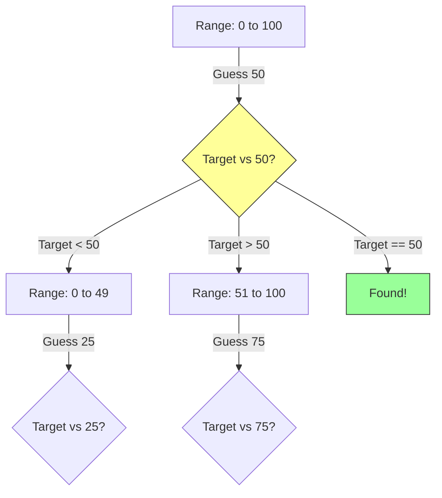

# 🎯 WEEK 2 DAY 5: BINARY SEARCH — COMPLETE GUIDE

**Category:** Algorithms / Search  
**Difficulty:** 🟢 Foundation  
**Prerequisites:** Week 2 Day 1 (Arrays), Week 1 Day 2 (Big-O)  
**Interview Frequency:** ~100% (The single most important algorithm to master perfectly)  
**Real-World Impact:** Powering database indices, debuggers, version control, and any system that needs to find "a needle in a sorted haystack."

---

## 🎓 LEARNING OBJECTIVES

By the end of this topic, you will be able to:

- ✅ Explain the **Divide and Conquer** mechanism of Binary Search.
- ✅ Implement Binary Search iteratively and recursively without **off-by-one errors**.
- ✅ Identify the **Search Space** invariant (Sorted Array or Monotonic Function).
- ✅ Apply Binary Search to non-array problems (Search on Answer).
- ✅ Differentiate between finding **exact value** vs **lower bound** vs **upper bound**.

---

## 🤔 SECTION 1: THE WHY — Engineering Motivation

**Purpose:** Motivate binary search with concrete engineering problems and trade-offs.

### 🎯 Real-World Problems This Solves

#### **Problem 1: The "Phonebook" Problem**
- 🌍 **Where:** Database Indices (B-Trees), Dictionary Lookups
- 💼 **Why it matters:** You have 1 billion users sorted by ID. Finding one user sequentially (Linear Search) takes O(n) = 1 billion checks. Too slow.
- 🔧 **Solution:** Binary Search cuts the search space in half every step. 1 billion checks becomes ~30 checks. Speedup factor: 33,000,000x.

#### **Problem 2: The "Bad Commit" Problem (Git Bisect)**
- 🌍 **Where:** Software Development (Git)
- 💼 **Why it matters:** A bug was introduced sometime in the last 10,000 commits. You don't know which one. Testing every commit takes hours.
- 🔧 **Solution:** Test the middle commit. If broken, the bug is in the first half. If working, it's in the second half. Finds the bug in ~14 steps.

#### **Problem 3: The "Factory Optimization" Problem (Search on Answer)**
- 🌍 **Where:** Manufacturing, Cloud Resource Allocation
- 💼 **Why it matters:** "What is the minimum fuel needed to fly 1000km?" You can't iterate every fuel amount.
- 🔧 **Solution:** Guess a fuel amount. If it flies, try less. If it crashes, try more. You are binary searching the *answer*.

### ⚖ Design Problem & Trade-offs

**Core Design Problem:** How do we find an item efficiently in a collection?

**The Challenge:**
- **Linear Search:** Simple but slow (O(n)).
- **Constraint:** We need speed (O(log n)).

**Main Goals:**
- **Efficiency:** Minimize comparisons.
- **Coverage:** Work for arrays, math functions, and decision boundaries.

**What We Give Up:**
- **Pre-processing:** The data MUST be sorted. Sorting takes O(n log n). Binary search is only worth it if you search many times or if the data is already sorted.
- **Complexity:** Harder to implement correctly (infinite loops, boundary bugs).

### 💼 Interview Relevance

- **The Standard:** "Implement Binary Search" is a litmus test. If you can't write it bug-free in 5 minutes, you fail.
- **The Twist:** "Find the rotation point", "Find the peak element", "Find the square root". All are Binary Search variants.
- **The "Invisible" Array:** Searching on an answer range (e.g., Koko Eating Bananas) is a Tier 1 pattern.

---

## 📌 SECTION 2: THE WHAT — Mental Model & Core Concepts

**Purpose:** Build a mental picture: analogy, shape, invariants, and key variations.

### 🧠 Core Analogy

> **"Binary Search is like the 'Higher-Lower' Number Game."**
>
> 1. **Setup:** I pick a number between 1 and 100.
> 2. **Guess 1:** You guess 50.
> 3. **Feedback:** I say "Higher".
> 4. **Elimination:** You instantly know 1-50 are useless. You rip those pages out of the book. The new range is 51-100.
> 5. **Guess 2:** You guess 75.
> 6. **Repeat:** Keep halving until you win.

### 🖼 Visual Representation

**Search Space Reduction**



### 🔑 Core Invariants

1. **Monotonicity:** The search space must be sorted or monotonic (TTTFFF or FFFTTT). If it's random (5, 2, 9, 1), Binary Search fails.
2. **Reduction:** In every step, the search space MUST shrink. If `low` and `high` don't change, you get an infinite loop.
3. **Bracketing:** The target (if it exists) must be within `[low, high]`.

### 📋 Core Concepts & Variations (List All)

#### 1. **Standard Binary Search**
- **Goal:** Find exact index of target.
- **Returns:** Index or -1.
- **Logic:** `if arr[mid] == target` return mid.

#### 2. **Lower Bound (First Occurrence)**
- **Goal:** Find first index where `arr[i] >= target`.
- **Logic:** If found, don't stop. Record it and keep searching *left*.

#### 3. **Upper Bound (Last Occurrence)**
- **Goal:** Find first index where `arr[i] > target`.
- **Logic:** If found, don't stop. Record it and keep searching *right*.

#### 4. **Search on Answer (Discrete)**
- **Goal:** Find min/max value `X` that satisfies a condition `Check(X)`.
- **Space:** The range of possible answers (e.g., 1 to 1,000,000).

#### 📊 Concept Summary Table

| # | 🧩 Variant | ✏️ Goal | ⏱ Complexity | 🛡 Invariant |
|---|-----------|---------|--------------|--------------|
| 1 | **Exact Match** | Find `k` such that `arr[k] == T` | O(log n) | `low <= high` |
| 2 | **Lower Bound** | First `k` such that `arr[k] >= T` | O(log n) | `low < high` (often) |
| 3 | **Upper Bound** | First `k` such that `arr[k] > T` | O(log n) | `low < high` (often) |
| 4 | **Answer Search** | Min `X` where `IsPossible(X)` | O(log Range) * O(Check) | `low <= high` |

---

## ⚙ SECTION 3: THE HOW — Mechanical Walkthrough

**Purpose:** Show how the pointers move step-by-step.

### 🧱 State / Data Structure

```csharp
int[] arr = {10, 20, 30, 40, 50, 60, 70};
int target = 30;
int low = 0;
int high = arr.Length - 1; // 6
```

### 🔧 Operation 1: Iterative Search

**Logic:**
```text
Loop while low <= high:
    1. mid = low + (high - low) / 2
    2. If arr[mid] == target: Return mid
    3. If arr[mid] < target:  low = mid + 1  (Target is right)
    4. If arr[mid] > target:  high = mid - 1 (Target is left)
Return -1 (Not found)
```

**Trace (Target 30):**
1. **Init:** `low=0`, `high=6`.
2. **Step 1:** `mid = 3`. `arr[3] = 40`.
   - `40 > 30`. Too big. Go Left.
   - `high = mid - 1 = 2`.
3. **Step 2:** `low=0`, `high=2`.
   - `mid = 1`. `arr[1] = 20`.
   - `20 < 30`. Too small. Go Right.
   - `low = mid + 1 = 2`.
4. **Step 3:** `low=2`, `high=2`.
   - `mid = 2`. `arr[2] = 30`.
   - `30 == 30`. Found! Return 2.

### 🔧 Operation 2: Safe Mid Calculation

**Problem:** `(low + high) / 2` can overflow if `low` and `high` are huge integers (near 2 billion).
**Fix:** `mid = low + (high - low) / 2`.
**Why:** `high - low` is small. Adding it to `low` is safe.

### 💾 Memory Behavior

- **Iterative:** O(1) space. Just 3 variables (`low`, `high`, `mid`).
- **Recursive:** O(log n) stack space.
- **Cache:** Access pattern is "jumping". First jump is huge (bad locality), then jumps get smaller. Better than Linked List, worse than Linear Scan for small arrays.

### 🛡 Edge Cases

1. **Empty Array:** `low > high` immediately. Returns -1. Correct.
2. **Target Not Found:** Loop finishes. Returns -1. Correct.
3. **Array with Duplicates:** Standard BS returns *any* of the matches, not necessarily the first. Use Lower Bound for first.
4. **Single Element:** `low=0, high=0`. Works.

---

## 🎨 SECTION 4: VISUALIZATION — Simulation & Examples

**Purpose:** Visualize the shrinking window.

### 🧊 Example 1: Standard Search

**Array:** `[2, 5, 8, 12, 16, 23, 38, 56, 72, 91]`
**Target:** 23

```text
[L-----------------------H]  Range: 0-9. Mid: 4 (16). 16 < 23. Go Right.
             [L----------H]  Range: 5-9. Mid: 7 (56). 56 > 23. Go Left.
             [L----H]        Range: 5-6. Mid: 5 (23). 23 == 23. FOUND.
```

### 📈 Example 2: Search on Answer (Koko Eating Bananas)

**Problem:** Find min speed `K` to eat all piles in `H` hours.
**Monotonicity:**
- If speed 10 works, speed 11, 12... also work (True).
- If speed 3 fails, speed 2, 1... also fail (False).
- Pattern: `F F F F T T T T`
- Goal: Find the *first* T.

**Trace:**
- Search Range: `[1, MaxPile]`.
- Check `mid`.
- If `CanEat(mid)`: Store answer, try slower (`high = mid - 1`).
- If `!CanEat(mid)`: Must eat faster (`low = mid + 1`).

### 🔥 Example 3: Finding Pivot in Rotated Array

**Array:** `[4, 5, 6, 7, 0, 1, 2]`
**Goal:** Find min element (0).

**Visualization:**
```text
Value: 4 5 6 7 0 1 2
Line:  / / / / | / /
               ^ Break point
```
**Logic:**
- Compare `mid` with `right`.
- If `arr[mid] > arr[right]`: We are in left sorted portion (4,5,6,7). Pivot is to the RIGHT.
- If `arr[mid] < arr[right]`: We are in right sorted portion (0,1,2) OR pivot is mid. Pivot is LEFT or MID.

---

## 📊 SECTION 5: CRITICAL ANALYSIS — Performance & Robustness

**Purpose:** Summarize performance beyond Big-O.

### 📈 Complexity Table

| 📌 Algorithm | ⏱ Time | 💾 Space | 📝 Notes |
|--------------|--------|---------|----------|
| **Linear Search** | O(n) | O(1) | Works on unsorted data. |
| **Binary Search** | O(log n) | O(1) | Requires sorted data. |
| **Interpolation Search** | O(log log n) | O(1) | Works if distribution is uniform. |
| **Exponential Search** | O(log i) | O(1) | Good for unbounded lists. |

### 🤔 Why Big-O Might Mislead Here

- **Branch Prediction:** The `if arr[mid] < target` branch is random (50% chance). CPUs hate unpredictable branches. Linear search is sometimes faster for small arrays (N < 64) due to pipelining and prefetching.
- **Memory Latency:** Jumping around memory causes cache misses. In huge arrays (GBs), the bottleneck is RAM latency, not CPU comparisons.

### ⚠ Edge Cases & Failure Modes

- **Overflow:** `(low + high) / 2` bug.
- **Infinite Loop:** `low = mid` vs `low = mid + 1`. If range is 2 elements, `mid` might equal `low`, causing no progress.
  - *Fix:* Always change boundary by at least 1 (`mid+1` or `mid-1`) OR use `while(high - low > 1)`.

---

## 🏭 SECTION 6: REAL SYSTEMS — Integration in Production

**Purpose:** Make binary search feel real and relevant.

### 🏭 Real System 1: Databases (B-Trees / LSM Trees)
- 🎯 **Problem:** Find a record with ID=12345 in 1TB of data.
- 🔧 **Implementation:** B-Trees are generalized binary search trees. Each node has sorted keys. We binary search inside the node to find the child pointer.
- 📊 **Impact:** Reduces disk reads from millions to ~3-4.

### 🏭 Real System 2: Debugging (Git Bisect)
- 🎯 **Problem:** Identifying a regression.
- 🔧 **Implementation:** Binary search over the commit history graph.
- 📊 **Impact:** Finds the bad commit in minutes instead of hours of manual testing.

### 🏭 Real System 3: Java/C# Libraries
- 🎯 **Problem:** `Arrays.binarySearch` / `List.BinarySearch`.
- 🔧 **Implementation:** Standard iterative binary search.
- 📊 **Impact:** Provides O(log n) lookup for developers. Returns `~index` if not found (bitwise complement of insertion point) to allow easy insertion.

### 🏭 Real System 4: TCP Congestion Control
- 🎯 **Problem:** Finding optimal window size.
- 🔧 **Implementation:** Variation of binary search (Additive Increase Multiplicative Decrease) to find the bandwidth limit.
- 📊 **Impact:** Maximizes internet speed without packet loss.

### 🏭 Real System 5: Spell Checkers
- 🎯 **Problem:** Is the word "helo" valid?
- 🔧 **Implementation:** Keep dictionary words sorted. Binary search to verify existence.
- 📊 **Impact:** Instant spell checking.

---

## 🔗 SECTION 7: CONCEPT CROSSOVERS — Connections & Comparisons

### 📚 What It Builds On (Prerequisites)
- **Arrays:** Random access is required. You can't binary search a Linked List efficiently (O(n)).
- **Sorting:** Data must be sorted first.

### 🚀 What Builds On It (Successors)
- **Binary Search Trees (BST):** Binary Search made dynamic.
- **Segment Trees:** Advanced range queries.
- **Skip Lists:** Binary search logic applied to linked lists (probabilistic).

### 🔄 Comparison with Alternatives

| 📌 Algo | ⏱ Time | 💾 Sorted? | ✅ Best For |
|---------|--------|------------|-------------|
| **Linear Search** | O(n) | No | Unsorted, small arrays. |
| **Binary Search** | O(log n) | Yes | Sorted arrays, answer ranges. |
| **Hash Set** | O(1) | No | Exact lookups (no range queries). |
| **BST** | O(log n) | Yes (Tree) | Dynamic inserts + search. |

---

## 📐 SECTION 8: MATHEMATICAL & THEORETICAL PERSPECTIVE

**Purpose:** Provide formalism.

### 📋 Formal Definition
For a sorted array A and target T, find i such that A[i] = T.
Step k: Search space size is N / 2^k.
Stop when N / 2^k = 1 => 2^k = N => k = log_2(N).

### 📐 Key Theorem: Master Theorem Case
Binary Search recurrence: T(n) = T(n/2) + O(1).
- a = 1 (1 subproblem)
- b = 2 (half size)
- d = 0 (constant work)
log_b(a) = log_2(1) = 0 = d.
Case 2 applies: T(n) = O(n^d * log n) = O(log n).

---

## 💡 SECTION 9: ALGORITHMIC DESIGN INTUITION

**Purpose:** Teach "when and how to use".

### 🎯 Decision Framework

| Scenario | 🛠 Strategy |
|----------|------------|
| **Sorted Array + Search** | ✅ Binary Search |
| **"Find Min/Max X that satisfies..."** | ✅ Binary Search on Answer |
| **Unsorted Array** | ❌ Linear Search or Sort+BS |
| **Linked List** | ❌ Linear Search |
| **Range [0, 10^18]** | ✅ Binary Search (O(60) steps) |

### 🔍 Interview Pattern Recognition

- 🔴 **Red Flag:** "Sorted", "Monotonic", "Increasing".
  - *Pattern:* **Binary Search**.
- 🔴 **Red Flag:** "O(log n) time".
  - *Pattern:* **Binary Search**.
- 🔵 **Blue Flag:** "Find the First Bad Version", "Minimum Capacity to Ship".
  - *Pattern:* **Binary Search on Answer**.

---

## ❓ SECTION 10: KNOWLEDGE CHECK — Socratic Reasoning

1.  **Why does Binary Search require random access?** What happens if you try it on a Linked List?
2.  **Explain why `mid = (low + high) / 2` is dangerous.** What inputs trigger the bug?
3.  **If you have an array of 1 trillion elements, how many steps does Binary Search take?** (Hint: 2^10 is approximately 10^3, so 2^40 is approximately 10^12).
4.  **Can you perform Binary Search on an unsorted array if you know something else about it?** (Rotated Sorted Array).
5.  **Does Binary Search work for finding a value in a monotonic math function f(x)?**

---

## 🎯 SECTION 11: RETENTION HOOK — Memory Anchors

### 💎 One-Liner Essence
> **"Binary Search is the art of throwing away half the haystack at every step."**

### 🧠 Mnemonic Device
**"HAVOC"**
- **H**igh and Low pointers
- **A**verage (Mid calculation)
- **V**erify match
- **O**verflow check
- **C**ut range in half

### 🖼 Visual Cue
**The Dictionary:**
- You never read page-by-page.
- You flip to the middle. "Apple"? No, "Zebra".
- Flip to the middle of the second half.
- Repeat.

### 💼 Real Interview Story
**Context:** Candidate asked "Find the square root of X to 5 decimal places."
**Approach:** "I'll loop from 0.00001 to X..." (Linear Search).
**Interviewer:** "X is 1,000,000. That loop will run forever."
**Pivot:** "Ah! The square function f(y) = y^2 is monotonic. I can Binary Search the range [0, X]!"
**Outcome:** Hired. Recognized monotonicity = Binary Search.

---

## 🧩 5 COGNITIVE LENSES

### 🖥 Computational Lens
- **Branch Misprediction:** Binary search is a worst-case scenario for branch predictors (50/50 chance left/right). For small N (< 64), a branch-less implementation (using conditional moves) or linear search is often faster.

### 🧠 Psychological Lens
- **The Off-By-One Fear:** Everyone hates `low <= high` vs `low < high`.
- **Correction:** Stick to ONE template (e.g., `low <= high` + `mid-1`/`mid+1`) and master it. Don't improvise.

### 🔄 Design Trade-off Lens
- **Sort Time vs Search Time:** If you search once, Linear (O(n)) is better than Sort+BS (O(n log n)). If you search 1000 times, Sort+BS wins.

### 🤖 AI/ML Analogy Lens
- **Gradient Descent:** Binary search is 1D optimization. Gradient descent is n-D optimization. Both "slide down" towards the target using local information (slope vs comparison).

### 📚 Historical Context Lens
- **Earliest Use:** Used in Babylon (200BC) for math tables.
- **First Computer Impl:** 1946 (John Mauchly).
- **First Correct Impl:** 1962. It took 16 years for professors to publish a bug-free version!

---

## ⚔ SUPPLEMENTARY OUTCOMES

### ⚔ Practice Problems (10)

1. **⚔ Binary Search** (Source: LeetCode 704 - 🟢)
   - 🎯 Concepts: Basic implementation.
   - 📌 Constraints: Exact match.
2. **⚔ Search Insert Position** (Source: LeetCode 35 - 🟢)
   - 🎯 Concepts: Lower Bound pattern.
   - 📌 Constraints: Return index where it *should* be.
3. **⚔ First Bad Version** (Source: LeetCode 278 - 🟢)
   - 🎯 Concepts: Boundary finding (FFFTTT).
   - 📌 Constraints: API minimization.
4. **⚔ Find First and Last Position** (Source: LeetCode 34 - 🟡)
   - 🎯 Concepts: Double binary search.
   - 📌 Constraints: O(log n).
5. **⚔ Search in Rotated Sorted Array** (Source: LeetCode 33 - 🟡)
   - 🎯 Concepts: Condition logic `arr[mid] > arr[left]`.
   - 📌 Constraints: O(log n).
6. **⚔ Find Minimum in Rotated Sorted Array** (Source: LeetCode 153 - 🟡)
   - 🎯 Concepts: Discarding the sorted half.
   - 📌 Constraints: Unique elements.
7. **⚔ Peak Element** (Source: LeetCode 162 - 🟡)
   - 🎯 Concepts: Local slope climbing.
   - 📌 Constraints: Unsorted array!
8. **⚔ Koko Eating Bananas** (Source: LeetCode 875 - 🟡)
   - 🎯 Concepts: Search on Answer.
   - 📌 Constraints: Range [1, 10^9].
9. **⚔ Median of Two Sorted Arrays** (Source: LeetCode 4 - 🔴)
   - 🎯 Concepts: Partitioning two arrays.
   - 📌 Constraints: O(log(m+n)).
10. **⚔ Aggressive Cows** (Source: SPOJ/Classic - 🟡)
    - 🎯 Concepts: Maximize the Minimum distance (Search on Answer).
    - 📌 Constraints: Greedy check function.

### 🎙 Interview Questions (8)

1. **Q: Why do we calculate mid as `low + (high - low) / 2`?**
   - 🔀 *Follow-up:* Show an example where `(low + high) / 2` fails.
2. **Q: Can Binary Search be used on an unsorted array?**
   - 🔀 *Follow-up:* What if the array is "Bitonic" (increases then decreases)?
3. **Q: Explain "Binary Search on Answer".**
   - 🔀 *Follow-up:* When do you use it? (When inverse function is monotonic).
4. **Q: What is the space complexity of Recursive Binary Search?**
   - 🔀 *Follow-up:* How to make it O(1)?
5. **Q: Search for a value in a 2D Matrix where rows/cols are sorted.**
   - 🔀 *Follow-up:* Is it O(log(nm)) or O(n+m)?
6. **Q: Find the square root of integer X.**
   - 🔀 *Follow-up:* Handle overflow when squaring `mid`.
7. **Q: Upper Bound vs Lower Bound.**
   - 🔀 *Follow-up:* Implement `std::upper_bound` logic.
8. **Q: How does git bisect work?**
   - 🔀 *Follow-up:* Complexity?

### ⚠ Common Misconceptions (4)

1. **❌ Misconception:** "Binary Search only works for numbers."
   - ✅ **Reality:** Works for anything Monotonic (Dates, Versions, Strings).
   - 🧠 **Memory Aid:** "If it's sorted, you can search it."
2. **❌ Misconception:** "It's always faster than linear search."
   - ✅ **Reality:** For N < 50, Linear search is often faster due to Branch Prediction/Cache.
   - 🧠 **Memory Aid:** "Small is simple."
3. **❌ Misconception:** "Mid is always `(L+H)/2`."
   - ✅ **Reality:** That overflows.
   - 🧠 **Memory Aid:** "Safety First: L + (H-L)/2."
4. **❌ Misconception:** "Binary search requires an array."
   - ✅ **Reality:** Works on abstract ranges (Search on Answer).
   - 🧠 **Memory Aid:** "Search the concept, not just the container."

### 📈 Advanced Concepts (3)

1. **Fractional Cascading:**
   - 🎓 Prerequisite: Multiple Binary Searches.
   - 🔗 Relation: Optimizing lookups in a series of sorted arrays (e.g., Segment Trees).
   - 💼 Use case: Computational Geometry.
2. **Interpolation Search:**
   - 🎓 Prerequisite: Uniform Distribution.
   - 🔗 Relation: Guessing mid based on value: `mid = low + (target - arr[low]) * ...`. O(log log n).
   - 💼 Use case: Searching Phone Books (Uniformly distributed names).
3. **Ternary Search:**
   - 🎓 Prerequisite: Unimodal Functions.
   - 🔗 Relation: Splitting into 3 parts to find max/min of a curve (up then down).
   - 💼 Use case: Optimization problems.

### 🔗 External Resources (3)

1. **VisualAlgo - Binary Search**
   - 🛠 Tool
   - 🎯 Why useful: Visualize the pointers moving.
   - 🔗 Link: https://visualgo.net/en/sorting
2. **"Nearly All Binary Searches and Mergesorts are Broken" (Google Blog)**
   - 📝 Article
   - 🎯 Why useful: History of the overflow bug.
   - 🔗 Link: Google AI Blog
3. **LeetCode Binary Search Explore Card**
   - 🎓 Course
   - 🎯 Why useful: Dedicated module for variants.
   - 🔗 Link: LeetCode

---
*End of Week 2 Day 5 Instructional File*
