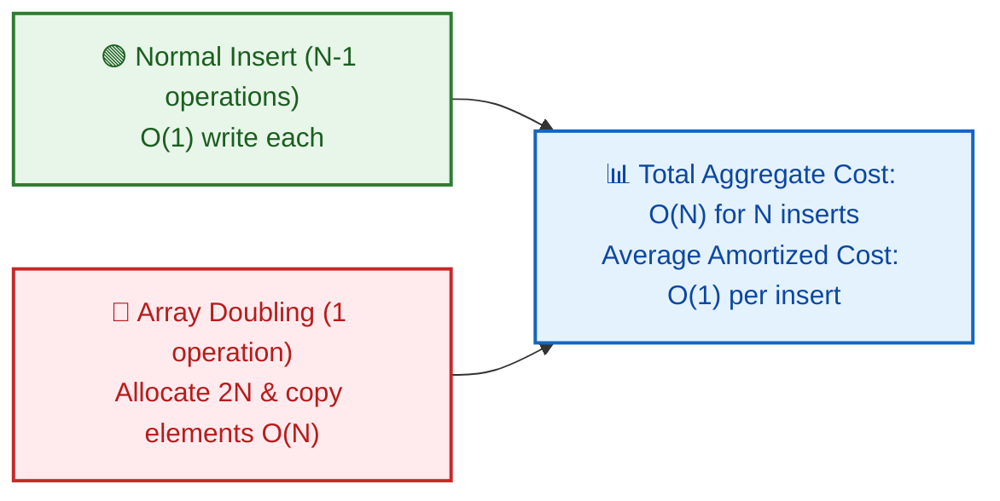
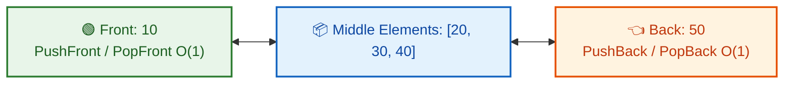
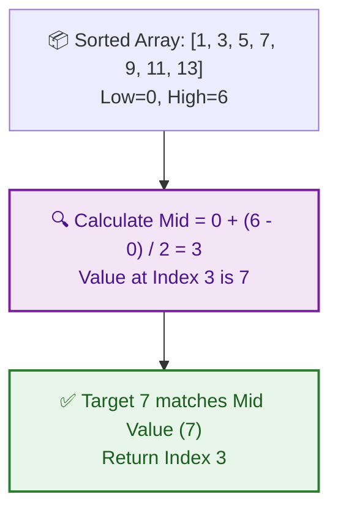

# 📊 WEEK 02 VISUAL CONCEPTS PLAYBOOK (HYBRID)

> 🧭 **Navigation:** [🏠 Week Overview](README.md) • [📘 Curriculum Syllabus](../COMPLETE_SYLLABUS.md)
> 
> 💡 **Instructor Note:** *This Visual Playbook provides a high-density, integrated synthesis. Not all sections are mandatory; use it as a modular reference to solidify invariants and review pattern transitions.*

---

**Theme:** Static/Dynamic Arrays, Linked Lists, Stacks/Queues/Deques, Binary Search Invariants  
**Format:** Hybrid (Enhanced ASCII + Web Resource Links + Reference Tools)  
**Purpose:** Visual-first concept explanation with embedded professional resources

---

## 🎨 VISUAL LEGEND & RESOURCE GUIDE

### Symbol Reference
| Symbol | Meaning |
|--------|---------|
| `[n]` | Array element or cell |
| `→` | Pointer or next reference |
| `i`, `j` | Index pointers |
| `lo`, `hi`, `mid` | Binary search bounds |
| `[]` | Node or memory cell |
| `███` | Allocated/active memory |
| `░░░` | Unallocated/empty |
| `⇄` | Operation or transition |
| `✓` | Valid state |
| `✗` | Invalid state |
| 🔗 | Link to interactive visualization |

### Professional Visualization Resources

| Tool | Resource | Best For |
|------|----------|----------|
| **VisuAlgo Arrays** | https://visualgo.net/en/list | Array/List visualizations |
| **VisuAlgo Binary Search** | https://visualgo.net/en/bst | Binary search trees + search |
| **Linked List Visualizer** | https://www.cs.usfca.edu/~galles/visualization/LinkedList.html | Linked list operations |
| **GeeksforGeeks Arrays** | https://www.geeksforgeeks.org/array-data-structure/ | Array concepts & problems |
| **GeeksforGeeks Linked Lists** | https://www.geeksforgeeks.org/linked-list-set-1-introduction/ | Linked list operations |
| **GeeksforGeeks Binary Search** | https://www.geeksforgeeks.org/binary-search/ | Binary search guide |

---

## 📅 DAY 1: STATIC ARRAYS & MEMORY LAYOUT

### Pattern Map: Array Family Tree


### 📌 ARRAY STRUCTURES

- **Static Arrays (Fixed Size)**
  - Contiguous memory
  - O(1) random access
  - O(n) for insert/delete
- **Dynamic Arrays (Resizable)**
  - Doubling strategy
  - Amortized O(1) append
  - O(n) for reallocation
- **Multi-Dimensional**
  - Row-major layout
  - Column-major layout
  - Cache implications


---

### Pattern 1.1: Static Array Memory Layout

**Interactive Resource:** 🔗 [VisuAlgo Arrays](https://visualgo.net/en/list)

#### Visual 1: Contiguous Memory Representation


| Address | Value | Index |
| :--- | :--- | :--- |
| 1000 | 10 | [0] |
| 1004 | 20 | [1] |
| 1008 | 30 | [2] |
| 1012 | 40 | [3] |
| 1016 | 50 | [4] |


---

### Pattern 1.2: Row-Major vs Column-Major Layout

#### Visual 1: Matrix Memory Ordering


### 📌 📊 2D Matrix (3x3 Rows & Columns)

- Row 0: [1, 2, 3]
- Row 1: [4, 5, 6]
- **Row 2: [7, 8, 9]**
  - ⚙️ Row-Major Flat Array: [1, 2, 3, 4, 5, 6, 7, 8, 9]<br/>Address = Base + (row * cols + col) * elementSize


---

## 📈 DAY 2: DYNAMIC ARRAYS & AMORTIZED ANALYSIS

### Pattern Map: Dynamic Array Growth


### 📌 DYNAMIC ARRAY PATTERNS

- **Capacity vs Size**
  - Logical size (elements)
  - Physical capacity (allocated)
  - Load factor (size/capacity)
- **Resize Strategy**
  - Doubling (2×)
  - Linear growth (+ constant)
  - Fibonacci growth
- **Amortized Cost**
  - Average per operation
  - Expensive reallocation rare
  - O(1) amortized append


---

### Pattern 2.1: Doubling Strategy & Reallocation

**Interactive Resource:** 🔗 [VisuAlgo Arrays - Resize](https://visualgo.net/en/list)

#### Visual 1: Capacity Growing Process


**📦 Dynamic Array Resizing Evolution**

```text
• Size: 1, Capacity: 1 → Full!
```


---

### Pattern 2.2: Amortized Cost Intuition

#### Visual 1: Accumulator Model





---

## 🔗 DAY 3: LINKED LISTS

### Pattern Map: Linked List Variants


### 📌 LINKED LIST PATTERNS

- **Singly Linked List**
  - One directional link
  - Forward traversal only
  - O(n) search, O(1) insert/delete
- **Doubly Linked List**
  - Bidirectional links
  - Forward & backward traversal
  - More memory, flexible
- **Circular Linked List**
  - Last node points to first
  - No null terminator
  - Use case: round-robin


---

### Pattern 3.1: Node Structure & Pointer Chaining

**Interactive Resource:** 🔗 [Linked List Visualizer](https://www.cs.usfca.edu/~galles/visualization/LinkedList.html)

#### Visual 1: Singly Linked List in Heap


---

### Pattern 3.2: Insert at Head vs Middle

#### Visual 1: Pointer Manipulation


---

## 📚 DAY 4: STACKS, QUEUES & DEQUES

### Pattern Map: Linear Structures


### 📌 STACK/QUEUE/DEQUE PATTERNS

- **Stack (LIFO)**
  - Last-In-First-Out
  - Push/Pop from end
  - Use: DFS, undo/redo, parsing
- **Queue (FIFO)**
  - First-In-First-Out
  - Enqueue/Dequeue
  - Use: BFS, task scheduling
- **Deque (Double-Ended)**
  - Both ends operations
  - Push/pop front & back
  - Use: Sliding window, rotate


---

### Pattern 4.1: Stack Operations (LIFO)

#### Visual 1: Push/Pop Storyboard


| 10 | ← Top |
| :--- | :--- |
| 20 | ← Top |
| 30 | ← Top |
| 20 | ← Top |
| 10 | ← Top |


---

### Pattern 4.2: Queue Operations (FIFO) & Circular Buffer

#### Visual 1: Enqueue/Dequeue with Circular Buffer

```
QUEUE (Array-based, Circular):
------------------------------

Array: [_, _, _, _, _]  (capacity 5)
Front: 0, Back: 0 (empty)

ENQUEUE 10:
Array: [10, _, _, _, _]
Front: 0, Back: 1

ENQUEUE 20:
Array: [10, 20, _, _, _]
Front: 0, Back: 2

ENQUEUE 30:
Array: [10, 20, 30, _, _]
Front: 0, Back: 3

DEQUEUE (remove 10):
Array: [X, 20, 30, _, _]
Front: 1, Back: 3

DEQUEUE (remove 20):
Array: [X, X, 30, _, _]
Front: 2, Back: 3

ENQUEUE 40, 50, 60 (wrap around!):
Array: [60, X, 30, 40, 50]
Front: 2, Back: 1 (wrapped)

CIRCULAR CALCULATION:
Back = (Back + 1) % Capacity
Front = (Front + 1) % Capacity

BENEFIT:
Normal array queue:        Circular queue:
Dequeue shifts everything  Just move front pointer
O(n) expensive!            O(1) efficient!

TIME: O(1) for enqueue/dequeue
SPACE: O(n) for capacity items
```

---

### Pattern 4.3: Deque (Double-Ended Queue)

#### Visual 1: Deque Operations from Both Ends





---

## 🔍 DAY 5: BINARY SEARCH & INVARIANTS

### Pattern Map: Binary Search Variants


### 📌 BINARY SEARCH PATTERNS

- **Classic Search**
  - Standard target find
  - First occurrence
  - Last occurrence
- **Bounded Search**
  - Lower bound
  - Upper bound
  - Range queries
- **Answer Space Search**
  - Feasibility check
  - Minimize/maximize
  - Continuous search


---

### Pattern 5.1: Invariant & Mid Calculation

**Interactive Resource:** 🔗 [VisuAlgo Binary Search](https://visualgo.net/en/bst)

#### Visual 1: Search Range Halving





---

### Pattern 5.2: First & Last Occurrence

#### Visual 1: Find Boundaries


### 📌 🔍 Find First (Leftmost) Occurrence of Target 5

- **Mid matches target: arr[mid] == 5<br/>Record candidate answer: result = mid**
  - **👈 Continue Search in Left Half: hi = mid - 1<br/>Why? An earlier matching element might exist at index < mid**
    - Loop continues until lo > hi<br/>🎯 Final recorded candidate is the guaranteed leftmost occurrence!


---

### Common Failure Modes (Day 5)

#### Failure 1: Infinite Loop from Bad Update

```
❌ WRONG:
while lo <= hi:
  mid = (lo + hi) / 2
  if arr[mid] == target:
    return mid
  elif arr[mid] < target:
    lo = mid  ← NO PROGRESS! lo stays same

Result: Infinite loop if mid = lo!

✓ CORRECT:
elif arr[mid] < target:
  lo = mid + 1  ← Always advance lo

Result: Guaranteed progress, terminates
```

#### Failure 2: Off-by-One in Boundaries

```
❌ WRONG (checking last element):
while lo < hi:  ← Stops before last element!
  mid = lo + (hi - lo) / 2
  ...

Result: Never checks if arr[n-1] is target!

✓ CORRECT:
while lo <= hi:  ← Includes last element

Result: All elements checked
```

---

## 💾 DAY 6: STRINGS, NUMBERS & REPRESENTATIONS

### Pattern 6.1: String Immutability heap copy cost (Conconcatenation)

#### Visual 1: Naive String Concatenation heap mutations


| Address 0x1000: "Hi" | ← Still allocated in heap (garbage until GC collects) |
| :--- | :--- |
| Address 0x2000: "!!!" | ← Still allocated in heap (garbage until GC collects) |
| Address 0x3000: "Hi!!!" | ← New string object created |


---

### Pattern 6.2: Signed Integer Numbers representations (Two's Complement)

#### Visual 2: 8-bit Two's Complement Scale negations

To logically negate value (from 5 to -5) at the hardware register level:
1. Flip all bit configurations (the NOT operator `~`).
2. Add 1 to the flipped bit result.

```
Positive 5 bits layout:
  [ 0 | 0 | 0 | 0 | 0 | 1 | 0 | 1 ]   - Value 5

Step 1: Flip all bits (NOT ~5):
  [ 1 | 1 | 1 | 1 | 1 | 0 | 1 | 0 ]   - Value -6 (Two's complement placeholder)

Step 2: Add 1:
  [ 1 | 1 | 1 | 1 | 1 | 0 | 1 | 1 ]   - Value -5 (MSB bit 7 represents negation flag)
```

---

## 🎯 WEEK 02 VISUAL SUMMARY TABLE


| DAY | TOPIC | Complexity | Key Feature |
| :--- | :--- | :--- | :--- |
| 1 | Static Arrays | O(1) access | Contiguous |
|  | Memory Layout | O(n) insert | memory |
|  |  | O(1) space |  |
|  |  |  |  |
| 2 | Dynamic Array | O(1) amortiz. | Doubling |
|  | Amortized | O(n) reallocate | strategy |
|  | Analysis | O(n) capacity |  |
|  |  |  |  |
| 3 | Linked Lists | O(n) search | Pointer |
|  | Pointer Chain | O(1) insert | chaining |
|  |  | O(n) space | at head |
|  |  |  |  |
| 4 | Stack/Queue | O(1) ops | LIFO/FIFO |
|  | Deques | O(1) space | circular |
|  |  |  | buffer |
|  |  |  |  |
| 5 | Binary Search | O(log n) | Invariant |
|  | Invariants | O(1) space | halving |
|  |  |  |  |
| 6 | Strings/Nums | Conversions O(N) | Encoding & |
|  | Representations | StringBuilder O(N) | Immutability |


---

## 📋 COMMON PATTERNS QUICK REFERENCE


| Structure | Access | Insert | Delete | Space | Use Case |
| :--- | :--- | :--- | :--- | :--- | :--- |
| Array (Static) | O(1) | O(n) | O(n) | O(n) | Fixed |
| Array (Dynamic) | O(1) | O(1)* | O(n) | O(n) | Growing |
| Linked List | O(n) | O(1)† | O(1)† | O(n) | Insert/Del |
| Stack | Top | O(1) | O(1) | O(n) | LIFO |
| Queue | Front | O(1) | O(1) | O(n) | FIFO |
| Deque | Both | O(1) | O(1) | O(n) | Flexible |
| Binary Search Tree | O(logn) | O(logn) | O(logn) | O(n) | Ordered |


---

## 🔗 RECOMMENDED LEARNING RESOURCES

### Interactive Visualizations
1. **VisuAlgo Arrays** (https://visualgo.net/en/list) — Array/List operations
2. **VisuAlgo Binary Search** (https://visualgo.net/en/bst) — Search and traversal
3. **Linked List Visualizer** (https://www.cs.usfca.edu/~galles/visualization/LinkedList.html) — Node operations
4. **GeeksforGeeks Arrays** (https://www.geeksforgeeks.org/array-data-structure/) — Array reference
5. **GeeksforGeeks Linked Lists** (https://www.geeksforgeeks.org/linked-list-set-1-introduction/) — List operations
6. **GeeksforGeeks Binary Search** (https://www.geeksforgeeks.org/binary-search/) — Search patterns

### Video Tutorials
- "Arrays vs Linked Lists" — Trade-offs and when to use each
- "Binary Search Explained" — Invariant-based thinking
- "Stack and Queue" — LIFO/FIFO operations visualized

---

## 📝 HOW TO USE THIS PLAYBOOK

### Quick Revision (30 mins)
1. Scan pattern maps (5 mins)
2. Read one day's main visuals (5 mins per day)
3. Answer mini quiz (3 mins)
4. Review failure modes (2 mins)

### Deep Learning (2-3 hours)
1. Read playbook + extended subtopics
2. Visit web resource links for interactive animations
3. Implement each data structure yourself
4. Trace operations using playbook visuals

### Interview Prep (1 hour)
1. Quick reference table for complexity
2. Review failure modes
3. Mentally implement each structure
4. Code without looking at reference

---

**Use web resource links for interactive visualizations while studying!**

---

> 🧭 **Navigation:** [🏠 Week Overview](README.md) • [📘 Curriculum Syllabus](../COMPLETE_SYLLABUS.md)
