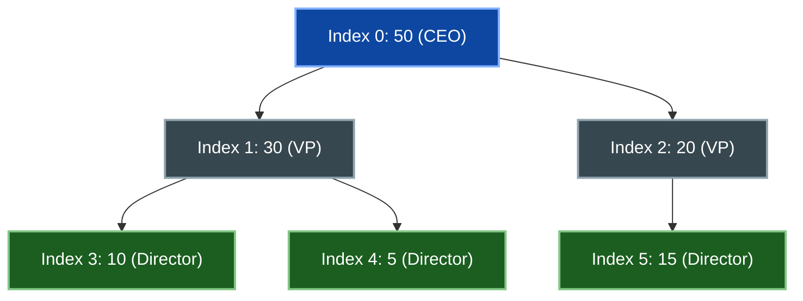
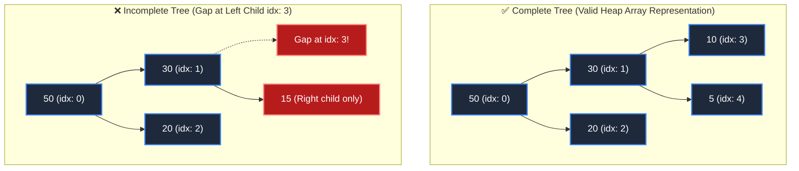

# 📘 Week 03 Day 03: Heaps, Heapify & Heap Sort — ENGINEERING GUIDE


> 🧭 **Navigation:** [← Previous Day](Week_03_Day_02_Merge_Quick_Sort_Instructional_Revised.md) • [🏠 Week Overview](README.md) • [📘 Curriculum Syllabus](../COMPLETE_SYLLABUS.md) • [Next Day →](Week_03_Day_04_Hash_Tables_Separate_Chaining_Instructional.md)
> 
> 💡 **Instructor Note:** *Not all sections or topics are mandatory. Feel free to adapt your pace and skim or skip sections based on your current focus and interview timeline.*

---

## 🎯 LEARNING OBJECTIVES

*By the end of this chapter, you will be able to:*

- 🎯 **Internalize** how arrays implicitly encode complete binary trees via index arithmetic.
- ⚙️ **Implement** min-heaps and max-heaps with bubble-up (insert) and heapify-down (extract) operations.
- ⚖️ **Evaluate** when to use heaps (priority queues, partial sorting) vs arrays vs balanced trees.
- 🏭 **Connect** heaps to real systems (OS schedulers, Dijkstra's algorithm, event-driven simulation).

---

## 📖 CHAPTER 1: CONTEXT & MOTIVATION

### The Problem: Fast Access to Min/Max Element

Suppose you're implementing a task scheduler for an operating system. Tasks have priorities. You need to:
- **Insert** a new task: O(?)
- **Get** the highest-priority task: O(?)
- **Remove** the highest-priority task: O(?)

**Naive Approaches:**

Array (unsorted):
```csharp
List<Task> tasks = new();
tasks.Add(task);  // O(1) insert
Task max = tasks.MaxBy(t => t.Priority);  // O(n) search
tasks.Remove(max);  // O(n) remove
```
Getting max is O(n)—unacceptable for thousands of tasks.

Sorted array:
```csharp
List<Task> tasks = new();  // Kept sorted
Insert(task);  // O(n) to maintain sorted order
Task max = tasks[tasks.Count - 1];  // O(1) get max
Remove(max);  // O(1) remove
```
Insertion is O(n)—also unacceptable.

**Heap (Optimal):**
```csharp
PriorityQueue<Task, int> queue = new();
queue.Enqueue(task, task.Priority);  // O(log n)
var (max, _) = queue.Peek();  // O(1)
queue.Dequeue();  // O(log n)
```
All operations are logarithmic—optimal for priority-based access.

> **💡 Insight:** *Heaps are implicit data structures: trees stored in arrays without explicit pointers. This encoding reduces memory overhead, improves cache locality (contiguous array), and enables O(log n) priority-based operations. Understanding heaps teaches how to encode structure implicitly—a principle that appears in segment trees, Fenwick trees, and B-trees.*

---

## 🧠 CHAPTER 2: BUILDING THE MENTAL MODEL

### The Core Analogy: Organizational Hierarchy

Imagine a company with a CEO at the top. Each executive manages at most 2 subordinates. This forms a binary tree.

**Heap Property:** The CEO's salary is higher than any subordinate's salary (in a max-heap).

If you want to find the highest-paid person, look at the CEO—O(1). If someone leaves, you need to reorganize, but you can do it efficiently by promoting subordinates and shuffling roles—O(log n).

### 🖼 Visualizing Heap as Complete Binary Tree



**Heap as Contiguous 1D Array:**

| Index | `0` | `1` | `2` | `3` | `4` | `5` |
| :--- | :--- | :--- | :--- | :--- | :--- | :--- |
| **Value** | `50` | `30` | `20` | `10` | `5` | `15` |

**Complete Binary Tree Flat Array Representation Formulas:**

In a Complete Binary Tree, every level except possibly the last is fully packed, and nodes in the last level fill strictly from left to right. This structural constraint allows a tree of `N` nodes to be stored in a contiguous 1D array of length `N` without storing a single reference pointer.

**0-Indexed Mapping (Standard in C#, Python, C++, Java):**
- **Parent of index `i`:** `(i - 1) / 2` (truncating integer division, for `i > 0`)
- **Left child of index `i`:** `2 * i + 1`
- **Right child of index `i`:** `2 * i + 2`
- **Last non-leaf node:** `(N / 2) - 1`

**1-Indexed Mapping (Historical / Algorithmic Literature):**
- **Parent of index `i`:** `i / 2` (equivalent to bitwise right shift `i >> 1`)
- **Left child of index `i`:** `2 * i` (equivalent to bitwise left shift `i << 1`)
- **Right child of index `i`:** `2 * i + 1` (equivalent to `(i << 1) | 1`)
- **Last non-leaf node:** `N / 2`

**Verification on Example Array `[50, 30, 20, 10, 5, 15]`:**
- Parent of index `1` (`30`): `(1 - 1) / 2 = 0` (`50`) (holds max-heap property: `30 <= 50`)
- Left child of index `0` (`50`): `2 * 0 + 1 = 1` (`30`)
- Right child of index `0` (`50`): `2 * 0 + 2 = 2` (`20`)
- Parent of index `4` (`5`): `(4 - 1) / 2 = 1` (`30`) (holds max-heap property: `5 <= 30`)
- Left child of index `2` (`20`): `2 * 2 + 1 = 5` (`15`)
- Right child of index `2` (`20`): `2 * 2 + 2 = 6` (out of bounds, `6 >= 6`, so node `20` has no right child)

### 🧩 Zero Pointer Overhead: Physical & Hardware Intuition

Why do systems engineers represent heaps as flat arrays rather than linked tree nodes?

```text
POINTER-BASED TREE NODE (Heap Allocation on 64-bit Architecture):
+--------------------------------------------------------------------+
| Object Header: SyncBlock + TypeHandle pointer            [16 bytes]|
+--------------------------------------------------------------------+
| Left Child Reference Pointer (`Node* left`)               [8 bytes]|
+--------------------------------------------------------------------+
| Right Child Reference Pointer (`Node* right`)             [8 bytes]|
+--------------------------------------------------------------------+
| Payload Data (`int value`)                                [4 bytes]|
+--------------------------------------------------------------------+
| Memory Alignment / Padding                                [4 bytes]|
+--------------------------------------------------------------------+
Total Memory per Node: 40 bytes (for a 4-byte payload = 10x overhead!)
Cache Impact: Nodes allocated via `malloc`/`new` sit at disparate heap
addresses. Navigating parent -> child requires pointer dereferences that
frequently miss CPU L1/L2 caches (100-300 cycle DRAM penalty).

FLAT ARRAY COMPLETE BINARY TREE (Contiguous Memory):
+-----------+-----------+-----------+-----------+-----------+-----------+
| 50        | 30        | 20        | 10        | 5         | 15        |
| [idx 0]   | [idx 1]   | [idx 2]   | [idx 3]   | [idx 4]   | [idx 5]   |
+-----------+-----------+-----------+-----------+-----------+-----------+
Total Memory per Element: Exactly 4 bytes! Zero pointer overhead.
Cache Impact: Contiguous buffer means the CPU hardware prefetcher loads
entire 64-byte cache lines (16 integers per cache line) into L1 cache,
turning index arithmetic into sub-nanosecond register operations.
```

> [!TIP]
> **Zero Pointer Overhead Intuition:** Storing 10,000,000 integers in a pointer-based tree consumes ~400 MB of RAM with heavy GC pressure and cache misses. Storing the same complete tree in a contiguous flat array consumes exactly 40 MB of RAM—a 90% memory reduction with zero GC overhead and maximum CPU L1/L2 prefetch throughput.

### The Heap Invariant: Maintaining Order

- **Max-Heap Invariant:** Every parent `>=` both children (`arr[parent] >= arr[child]`).
- **Min-Heap Invariant:** Every parent `<=` both children (`arr[parent] <= arr[child]`).

These invariants ensure:
- Root is always max (or min)
- Tree is a **complete binary tree** (all levels filled except possibly last, which fills left-to-right)
- Height = `O(log N)`
- All operations involve at most `O(log N)` sift-up/sift-down comparisons

### 🖼 Complete vs Incomplete Trees



- **Array for Complete Tree:** `[50, 30, 20, 10, 5]` — dense with 0 memory holes.
- **Why Incomplete Tree is Invalid:** Index 3 would correspond to a non-existent left child, breaking index arithmetic formulas and violating array packing invariants.

---

## ⚙️ CHAPTER 3: MECHANICS & IMPLEMENTATION

### The State Machine: Complete CRUD Operations Overview

A Binary Heap / Priority Queue provides a compact set of fundamental CRUD operations:

| Operation | Purpose | Array Mechanism | Time Complexity | Auxiliary Space |
| :--- | :--- | :--- | :---: | :---: |
| **Peek / FindMin (FindMax)** | Read root extremum | Direct index access `arr[0]` | `O(1)` | `O(1)` |
| **Insert / Enqueue** | Add new item | Append to end, `SiftUp` | `O(log N)` | `O(1)` |
| **ExtractMin / ExtractMax** | Remove and return root extremum | Swap root with `arr[N-1]`, pop last, `SiftDown(0)` | `O(log N)` | `O(1)` |
| **Heapify / BuildHeap** | Convert raw array into heap | Bottom-up sift-down from `(N/2)-1` down to `0` | `O(N)` | `O(1)` |
| **ChangePriority / UpdateKey** | Update item priority | Update value, call `SiftUp` or `SiftDown` | `O(log N)` | `O(1)` (with index map) |

---

### 🔧 Operation 1: Peek / FindMin / FindMax (`O(1)`)

Because of the heap invariant, the absolute minimum (in a min-heap) or absolute maximum (in a max-heap) is guaranteed to sit at the root node at index `0`. No search, tree traversal, or child inspection is required:

```csharp
public T Peek() {
    if (Count == 0) throw new InvalidOperationException("Heap is empty");
    return heap[0]; // Strict O(1) direct memory dereference
}
```

---

### 🔧 Operation 2: Insert / Enqueue (Sift-Up / Bubble-Up)

When inserting an element, we must preserve two invariants simultaneously:
1. **The Shape Invariant:** The tree must remain a complete binary tree (no gaps).
2. **The Heap Invariant:** Every parent must satisfy the priority condition relative to its children.

**Mechanical Steps:**
1. Append the new element to the physical end of the array at index `N` (`Count`). This maintains the complete binary tree shape.
2. Compare the element at index `i` with its parent at `(i - 1) / 2`.
3. If the element violates the heap property (e.g., in a max-heap, `heap[i] > heap[parent]`), swap the element with its parent.
4. Update `i = parent` and repeat upward until the parent satisfies the invariant or the element becomes the root (`i == 0`).

```text
INSERTION TRACE: Insert 25 into Max-Heap [50, 30, 20, 10, 5, 15]

Step 1: Append 25 to end of array at index 6.
Array:  [ 50,  30,  20,  10,   5,  15,  25 ]
Index:     0    1    2    3    4    5    6
Tree:
             50 (0)
           /        \
       30 (1)      20 (2)
      /      \     /     \
    10 (3)  5 (4) 15 (5) [25] (6)  <-- New node appended at leaf

Step 2: Sift-Up at index 6:
  Parent index = (6 - 1) / 2 = 2 (value: 20).
  Compare: 25 > 20 -> Heap invariant violated! Swap index 6 and index 2.
Array:  [ 50,  30,  25,  10,   5,  15,  20 ]
Index:     0    1    2    3    4    5    6
Tree:
             50 (0)
           /        \
       30 (1)     [25] (2)  <-- Swapped up
      /      \     /     \
    10 (3)  5 (4) 15 (5)  20 (6)

Step 3: Sift-Up at index 2:
  Parent index = (2 - 1) / 2 = 0 (value: 50).
  Compare: 25 <= 50 -> Heap invariant satisfied! Stop sifting.
Final Array: [ 50, 30, 25, 10, 5, 15, 20 ]
Swaps: 1 swap across 2 comparisons.
Time Complexity: Bounded by tree height h = floor(log2(N)) -> O(log N).
```

---

### 🔧 Operation 3: Extract-Min / Extract-Max (Sift-Down / Bubble-Down)

Extracting the extremum removes the root node. To avoid creating a structural gap at index `0` or shifting `N` elements in `O(N)` time, we use the root-swap-and-pop technique.

**Mechanical Steps:**
1. Save the root element `arr[0]` to return.
2. Copy the very last leaf element `arr[Count - 1]` into the root position `arr[0]`, then remove the last array element. This preserves the complete binary tree shape.
3. Sift-down from index `0`: compute children `left = 2*i + 1` and `right = 2*i + 2`.
4. Identify the extremum among `arr[i]`, `arr[left]`, and `arr[right]` (the larger child in a max-heap, or smaller child in a min-heap).
5. If the chosen child has higher priority than `arr[i]`, swap `arr[i]` with that child.
6. Set `i` to the child's index and repeat downward until the node satisfies the heap property or becomes a leaf (`2*i + 1 >= Count`).

```text
EXTRACT-MAX TRACE: Extract from Max-Heap [50, 30, 20, 10, 5, 15]

Step 1: Save root (50). Overwrite root with last element (15) and pop last element.
Array:  [ 15,  30,  20,  10,   5 ]
Index:     0    1    2    3    4
Tree:
            [15] (0)  <-- Last element placed at root
           /        \
       30 (1)      20 (2)
      /      \
    10 (3)  5 (4)

Step 2: Sift-Down at index 0:
  Left child  = 2*0 + 1 = 1 (value 30)
  Right child = 2*0 + 2 = 2 (value 20)
  Largest of {15, 30, 20} is 30 at index 1.
  Swap index 0 (15) with index 1 (30).
Array:  [ 30,  15,  20,  10,   5 ]
Index:     0    1    2    3    4
Tree:
             30 (0)
           /        \
       [15] (1)    20 (2)  <-- 15 moved down to level 1
      /      \
    10 (3)  5 (4)

Step 3: Sift-Down at index 1:
  Left child  = 2*1 + 1 = 3 (value 10)
  Right child = 2*1 + 2 = 4 (value 5)
  Largest of {15, 10, 5} is 15 at index 1.
  No child is larger than 15 -> Heap invariant satisfied! Stop.
Final Array: [ 30, 15, 20, 10, 5 ], Return 50.
Time Complexity: Bounded by tree height h = floor(log2(N)) -> O(log N).
```

---

### 🔧 Operation 4: Heapify / Build-Heap (Bottom-Up Sift-Down in `O(N)`)

Suppose you are given an arbitrary, unsorted array of `N` elements. How do you convert it into a valid heap?

- **Naive Approach (Repeated Insertion):** Start with an empty heap and call `Insert` `N` times.
  Time: `log(1) + log(2) + ... + log(N) = log(N!) = O(N log N)`.
- **Optimal Approach (Floyd's Bottom-Up Heapify):** Place all `N` elements into the array as-is, then call `SiftDown(i)` in reverse order from index `(N / 2) - 1` down to `0`.
  Time: Strictly `O(N)`.

**Why start at `(N / 2) - 1`?**
In any complete binary tree of size `N`, all nodes from index `N / 2` to `N - 1` are leaves. A leaf node has no children, so it trivially satisfies the heap invariant. Only the internal nodes (from `(N / 2) - 1` down to `0`) need to be sifted down!

```text
FLOYD'S HEAPIFY O(N) INTUITIVE VISUAL PROOF:

Tree Level Breakdown for N = 15 nodes:
Height (h)   Level    Node Count (<= N / 2^(h+1))   Max Swaps per Node   Total Swaps at Level
-----------------------------------------------------------------------------------------
h = 0 (Leaves) L3     8 nodes (~N / 2)              0 swaps (skipped)    8 * 0 = 0
h = 1          L2     4 nodes (~N / 4)              1 swap               4 * 1 = 4
h = 2          L1     2 nodes (~N / 8)              2 swaps              2 * 2 = 4
h = 3 (Root)   L0     1 node  (~N / 16)             3 swaps              1 * 3 = 3
-----------------------------------------------------------------------------------------
Total Swaps: 0 + 4 + 4 + 3 = 11 swaps < 15 (strictly less than N)!

Mathematical Derivation:
Total Cost S = sum_{h=0}^{log N} (N / 2^(h+1)) * h
             = (N / 2) * sum_{h=0}^{log N} (h / 2^h)

Evaluating the geometric series:
  Let G = (0/1) + (1/2) + (2/4) + (3/8) + (4/16) + (5/32) + ...
  (1/2) * G =     (0/2) + (1/4) + (2/8) + (3/16) + (4/32) + ...
  Subtracting the two lines:
  (1/2) * G = (1/2) + (1/4) + (1/8) + (1/16) + ... = 1
  Therefore: G = 2.
  Total Swaps S = (N / 2) * G = (N / 2) * 2 = N = O(N)!

Key Physical Intuition:
- Top-down repeated insertion (O(N log N)) pushes the vast majority of nodes
  (N/2 leaves) all the way UP through log N levels (maximum work on maximum nodes).
- Bottom-up heapify (O(N)) lets the vast majority of nodes (N/2 leaves) do ZERO work,
  while only a single node (the root) sifts down log N levels. The heaviest work is
  performed on the smallest fraction of nodes.
```

---

### 🔧 Operation 5: ChangePriority / UpdateKey (`O(log N)`)

In real-world priority queues (such as Dijkstra's shortest path algorithm, A* search, and process schedulers), an element's priority often needs to be dynamically modified after insertion:
- **`DecreaseKey(item, newPriority)`:** Lowers the priority value (in a Min-Heap, this promotes the item toward the root via `SiftUp`).
- **`IncreaseKey(item, newPriority)`:** Increases the priority value (in a Min-Heap, this demotes the item toward the leaves via `SiftDown`).

**The Challenge:**
In a standard binary heap, finding where `item` is stored requires an `O(N)` linear array scan, degrading `ChangePriority` to `O(N)`.

**The Solution: Handle Tracking (Indexed Priority Queue):**
Maintain an auxiliary index map (`Dictionary<TItem, int> indexMap` or an integer array `indexMap[id]`) that tracks the current array position of each item. Whenever two elements are swapped in the heap during `SiftUp` or `SiftDown`, their indices in `indexMap` are updated simultaneously in `O(1)`.

```text
CHANGE-PRIORITY MECHANICS & TRACE (Min-Heap):

Initial Min-Heap: [ 10, 30, 20, 40, 50, 60 ]
indexMap: { A:0 (10), B:1 (30), C:2 (20), D:3 (40), E:4 (50), F:5 (60) }

Operation: ChangePriority(D, 5) -> D was 40 at index 3, new priority is 5.
Step 1: Look up index of D in indexMap -> index = 3 in O(1).
Step 2: Update value: heap[3] = 5.
Step 3: Compare new value (5) with old value (40):
        In a Min-Heap, 5 < 40 (priority increased / key decreased).
        Element must move UPWARD toward root -> SiftUp(3):
          - Parent of 3 is (3 - 1) / 2 = 1 (value 30, item B).
          - 5 < 30 -> Invariant violated! Swap index 3 and index 1.
          - Update indexMap: indexMap[D] = 1, indexMap[B] = 3.
Array:  [ 10,  5 (D), 20, 40 (B), 50, 60 ]

Step 4: Continue SiftUp at index 1:
          - Parent of 1 is (1 - 1) / 2 = 0 (value 10, item A).
          - 5 < 10 -> Invariant violated! Swap index 1 and index 0.
          - Update indexMap: indexMap[D] = 0, indexMap[A] = 1.
Array:  [ 5 (D), 10 (A), 20, 40 (B), 50, 60 ]

Step 5: D is now root (index 0). Stop sifting.
Total Cost: O(1) lookup + O(log N) SiftUp = O(log N).
```

---

### 🔄 Heap Variations & Structural Contrasts

#### 1. Min-Heap vs Max-Heap Duality
A Min-Heap and Max-Heap are duals of each other:
- In a **Min-Heap**, parent `<= ` both children (`heap[parent] <= heap[child]`). Root is the minimum element.
- In a **Max-Heap**, parent `>= ` both children (`heap[parent] >= heap[child]`). Root is the maximum element.
- **Implementation Duality:** Any min-heap implementation can be converted into a max-heap simply by negating priority comparisons (or multiplying numerical values by `-1`).

#### 2. K-ary Heap (d-ary Heap)
A K-ary (or d-ary) heap is a generalization where each node has up to `d` children instead of 2.

**Flat Array Arithmetic for d-ary Heap (0-indexed):**
- **Parent of index `i`:** `(i - 1) / d`
- **Children of index `i`:** `d * i + 1`, `d * i + 2`, ..., `d * i + d`
- **Tree Height:** `ceil(log_d N)`

**The Architectural Trade-Off:**

| Metric | Binary Heap (`d = 2`) | 4-ary Heap (`d = 4`) | General d-ary Heap |
| :--- | :---: | :---: | :---: |
| **Tree Height** | `log_2 N` | `0.50 * log_2 N` | `log_d N` |
| **Sift-Up Comparisons** | `log_2 N` (1 per level) | `0.50 * log_2 N` (1 per level) | `O(log_d N)` (Faster!) |
| **Sift-Down Comparisons**| `2 * log_2 N` (2 per level) | `4 * 0.50 * log_2 N = 2 * log_2 N` | `O(d * log_d N)` (Slower for large d) |
| **CPU Cache Alignment** | Children may cross cache lines | 4 children fit in 64-byte L1 cache line | Cache-tuned if `d * sizeof(T) <= 64` |

> [!TIP]
> **Why 4-ary Heaps Dominate in Practice:** In Dijkstra's algorithm, `DecreaseKey` (sift-up) is executed `O(E)` times, while `ExtractMin` (sift-down) is executed only `O(V)` times. On dense graphs where `E >> V`, a 4-ary heap cuts sift-up height in half with zero memory penalty. Furthermore, 4 contiguous 64-bit pointers occupy exactly 32 bytes, allowing all child pointers to reside in a single 64-byte CPU L1 cache line.

#### 3. Why In-Order Traversal Does NOT Yield Sorted Order (Heap vs BST)

Beginners frequently confuse Binary Heaps with Binary Search Trees (BSTs) and assume an in-order traversal of a heap visits nodes in sorted order. **This is completely false.**

```text
BST TOTAL ORDERING vs HEAP PARTIAL ORDERING:

Binary Search Tree (In-Order Traversal = SORTED):
            20
          /    \
        10      30
       /  \    /  \
      5   15  25  35
In-Order Traversal (Left -> Root -> Right): 5, 10, 15, 20, 25, 30, 35  [STRICTLY SORTED]
Structural Rule: LeftSubtree < Node < RightSubtree (Horizontal total ordering across real line).

Binary Min-Heap (In-Order Traversal = UNSORTED):
             5
           /   \
         20     10
        /  \   /  \
       25  30 15  35
In-Order Traversal (Left -> Root -> Right): 25, 20, 30, 5, 15, 10, 35  [ARBITRARY JUMBLE!]
Structural Rule: Parent <= Children (Strictly vertical ancestor-descendant partial ordering).
Sibling Rule: Siblings (20 and 10) have ZERO ordering relationship! Notice 20 > 10.
```

**The Core Distinction:**
- **BST Invariant:** A horizontal partition. Everything to the left of a node is smaller; everything to the right is larger. Projecting the tree down to 1D via in-order traversal produces sorted output in `O(N)`.
- **Heap Invariant:** A vertical hierarchy. Parents dominate children, but siblings and cousins are completely unordered relative to one another.
- **Consequence:** You **cannot** sort data simply by walking a heap. To extract sorted order from a heap, you must invoke `ExtractMin` repeatedly `N` times, producing `O(N log N)` HeapSort.

---

### 💻 Dual-Language Implementations: Complete CRUD Heaps

#### Modern C# (.NET 8/9): Production Indexed Min-Heap with Complete CRUD

```csharp
using System;
using System.Collections.Generic;

/// <summary>
/// High-performance indexed binary min-heap supporting full CRUD operations:
/// Peek, Insert, ExtractMin, ChangePriority, and bottom-up BuildHeap in O(N).
/// </summary>
public class MinHeap<TItem, TPriority> where TItem : notnull where TPriority : IComparable<TPriority> {
    private readonly struct HeapNode(TItem item, TPriority priority) {
        public TItem Item { get; } = item;
        public TPriority Priority { get; } = priority;
    }

    private readonly List<HeapNode> _heap = [];
    private readonly Dictionary<TItem, int> _indexMap = [];

    public int Count => _heap.Count;
    public bool IsEmpty => _heap.Count == 0;

    public MinHeap() { }

    /// <summary>Constructs a heap from an existing collection in linear O(N) time.</summary>
    public MinHeap(IEnumerable<(TItem Item, TPriority Priority)> items) {
        ArgumentNullException.ThrowIfNull(items);
        foreach (var (item, priority) in items) {
            _indexMap[item] = _heap.Count;
            _heap.Add(new HeapNode(item, priority));
        }

        // Bottom-up Floyd's heapify from last non-leaf node down to root
        for (int i = (_heap.Count / 2) - 1; i >= 0; i--) {
            SiftDown(i);
        }
    }

    /// <summary>Returns the minimum priority item in O(1) time without removing it.</summary>
    public (TItem Item, TPriority Priority) Peek() {
        if (_heap.Count == 0) throw new InvalidOperationException("Heap is empty.");
        return (_heap[0].Item, _heap[0].Priority);
    }

    /// <summary>Inserts a new item with specified priority in O(log N) time.</summary>
    public void Insert(TItem item, TPriority priority) {
        ArgumentNullException.ThrowIfNull(item);
        if (_indexMap.ContainsKey(item)) {
            throw new ArgumentException("Item already exists in heap. Use ChangePriority instead.");
        }

        int index = _heap.Count;
        _heap.Add(new HeapNode(item, priority));
        _indexMap[item] = index;
        SiftUp(index);
    }

    /// <summary>Extracts and returns the minimum priority item in O(log N) time.</summary>
    public (TItem Item, TPriority Priority) ExtractMin() {
        if (_heap.Count == 0) throw new InvalidOperationException("Heap is empty.");

        var minNode = _heap[0];
        _indexMap.Remove(minNode.Item);

        int lastIdx = _heap.Count - 1;
        if (lastIdx == 0) {
            _heap.RemoveAt(0);
            return (minNode.Item, minNode.Priority);
        }

        // Move last leaf to root, remove leaf, and sift down
        _heap[0] = _heap[lastIdx];
        _indexMap[_heap[0].Item] = 0;
        _heap.RemoveAt(lastIdx);

        SiftDown(0);
        return (minNode.Item, minNode.Priority);
    }

    /// <summary>Updates an item's priority and restores the heap invariant in O(log N) time.</summary>
    public void ChangePriority(TItem item, TPriority newPriority) {
        ArgumentNullException.ThrowIfNull(item);
        if (!_indexMap.TryGetValue(item, out int index)) {
            throw new KeyNotFoundException("Item not found in heap.");
        }

        TPriority oldPriority = _heap[index].Priority;
        _heap[index] = new HeapNode(item, newPriority);

        int comparison = newPriority.CompareTo(oldPriority);
        if (comparison < 0) {
            SiftUp(index);   // Priority decreased -> move toward root
        } else if (comparison > 0) {
            SiftDown(index); // Priority increased -> move toward leaves
        }
    }

    private void SiftUp(int i) {
        while (i > 0) {
            int parent = (i - 1) / 2;
            if (_heap[i].Priority.CompareTo(_heap[parent].Priority) >= 0) break;

            Swap(i, parent);
            i = parent;
        }
    }

    private void SiftDown(int i) {
        int n = _heap.Count;
        while (true) {
            int smallest = i;
            int left = 2 * i + 1;
            int right = 2 * i + 2;

            if (left < n && _heap[left].Priority.CompareTo(_heap[smallest].Priority) < 0) {
                smallest = left;
            }
            if (right < n && _heap[right].Priority.CompareTo(_heap[smallest].Priority) < 0) {
                smallest = right;
            }

            if (smallest == i) break;

            Swap(i, smallest);
            i = smallest;
        }
    }

    private void Swap(int i, int j) {
        (_heap[i], _heap[j]) = (_heap[j], _heap[i]);
        _indexMap[_heap[i].Item] = i;
        _indexMap[_heap[j].Item] = j;
    }
}
```

---

#### Idiomatic Python (3.11+): Production Indexed Min-Heap with Complete CRUD

```python
from typing import Generic, TypeVar

T = TypeVar("T")

class MinHeap(Generic[T]):
    """Production-grade indexed binary min-heap with full CRUD operations:
    peek, insert, extract_min, change_priority, and O(N) build_heap.
    """
    def __init__(self, initial_items: list[tuple[T, float]] | None = None) -> None:
        self.heap: list[list] = []  # Elements: [priority, item]
        self.index_map: dict[T, int] = {}  # item -> array index
        
        if initial_items:
            for item, priority in initial_items:
                self.index_map[item] = len(self.heap)
                self.heap.append([priority, item])
            self._build_heap()

    def __len__(self) -> int:
        return len(self.heap)

    def is_empty(self) -> bool:
        return len(self.heap) == 0

    def peek(self) -> tuple[T, float]:
        """Return root minimum element without removing it in O(1) time."""
        if not self.heap:
            raise IndexError("Peek from empty heap")
        return self.heap[0][1], self.heap[0][0]

    def insert(self, item: T, priority: float) -> None:
        """Insert item with priority and sift up in O(log N) time."""
        if item in self.index_map:
            raise ValueError(f"Item '{item}' already present. Use change_priority instead.")
        
        idx = len(self.heap)
        self.heap.append([priority, item])
        self.index_map[item] = idx
        self._sift_up(idx)

    def extract_min(self) -> tuple[T, float]:
        """Remove and return minimum priority item in O(log N) time."""
        if not self.heap:
            raise IndexError("Extract from empty heap")
        
        min_node = self.heap[0]
        del self.index_map[min_node[1]]
        
        last = self.heap.pop()
        if self.heap:
            self.heap[0] = last
            self.index_map[last[1]] = 0
            self._sift_down(0)
            
        return min_node[1], min_node[0]

    def change_priority(self, item: T, new_priority: float) -> None:
        """Dynamically update item's priority and restore heap invariant in O(log N) time."""
        if item not in self.index_map:
            raise KeyError(f"Item '{item}' not found in heap")
        
        idx = self.index_map[item]
        old_priority = self.heap[idx][0]
        self.heap[idx][0] = new_priority
        
        if new_priority < old_priority:
            self._sift_up(idx)    # Priority decreased -> move toward root
        elif new_priority > old_priority:
            self._sift_down(idx)  # Priority increased -> move toward leaves

    def _sift_up(self, i: int) -> None:
        while i > 0:
            parent = (i - 1) // 2
            if self.heap[i][0] >= self.heap[parent][0]:
                break
            self._swap(i, parent)
            i = parent

    def _sift_down(self, i: int) -> None:
        n = len(self.heap)
        while True:
            smallest = i
            left = 2 * i + 1
            right = 2 * i + 2
            if left < n and self.heap[left][0] < self.heap[smallest][0]:
                smallest = left
            if right < n and self.heap[right][0] < self.heap[smallest][0]:
                smallest = right
            if smallest == i:
                break
            self._swap(i, smallest)
            i = smallest

    def _swap(self, i: int, j: int) -> None:
        self.heap[i], self.heap[j] = self.heap[j], self.heap[i]
        self.index_map[self.heap[i][1]] = i
        self.index_map[self.heap[j][1]] = j

    def _build_heap(self) -> None:
        """Bottom-up Floyd's heapify in O(N) time."""
        for i in range(len(self.heap) // 2 - 1, -1, -1):
            self._sift_down(i)
```

---

### 🔧 Operation 4: Heap Sort

#### C# Implementation (In-Place HeapSort)

```csharp
public class HeapSort {
    public static void Sort(int[] arr) {
        int n = arr.Length;
        // Step 1: Build max-heap bottom-up in O(N)
        for (int i = n / 2 - 1; i >= 0; i--) {
            Heapify(arr, n, i);
        }
        
        // Step 2: Extract elements one by one into sorted suffix
        for (int i = n - 1; i > 0; i--) {
            (arr[0], arr[i]) = (arr[i], arr[0]);
            Heapify(arr, i, 0);
        }
    }
    
    private static void Heapify(int[] arr, int n, int i) {
        int largest = i;
        int left = 2 * i + 1;
        int right = 2 * i + 2;
        
        if (left < n && arr[left] > arr[largest]) largest = left;
        if (right < n && arr[right] > arr[largest]) largest = right;
        
        if (largest != i) {
            (arr[i], arr[largest]) = (arr[largest], arr[i]);
            Heapify(arr, n, largest);
        }
    }
}
```

#### Python Implementation (In-Place HeapSort)

```python
def heap_sort(arr: list[int]) -> list[int]:
    """In-place HeapSort: builds max-heap, repeatedly swaps root to end.
    
    Time: O(N log N) best/avg/worst | Auxiliary Space: O(1) | Unstable
    """
    n = len(arr)
    
    def _sift_down(heap_size: int, i: int) -> None:
        while True:
            largest = i
            left = 2 * i + 1
            right = 2 * i + 2
            if left < heap_size and arr[left] > arr[largest]:
                largest = left
            if right < heap_size and arr[right] > arr[largest]:
                largest = right
            if largest == i:
                break
            arr[i], arr[largest] = arr[largest], arr[i]
            i = largest

    # Step 1: Build max-heap bottom-up in O(N)
    for i in range(n // 2 - 1, -1, -1):
        _sift_down(n, i)
        
    # Step 2: Extract max elements to sorted suffix
    for i in range(n - 1, 0, -1):
        arr[0], arr[i] = arr[i], arr[0]
        _sift_down(i, 0)
        
    return arr
```

### 🔧 Operation 5: Linear-Time Sorting — Counting Sort

When sorting integers bounded in a small range `[0..K]`, non-comparison sorting bypasses the `Omega(N log N)` decision-tree lower bound by using key values directly as memory indices.

```text
Counting Sort Mechanical Pipeline (N = 7, K = 8):
Input Array:       [ 4,  2,  2,  8,  3,  3,  1 ]
                     |   |   |   |   |   |   |
1. Frequency Count:
   Index (val):    0   1   2   3   4   5   6   7   8
   Count:         [0,  1,  2,  2,  1,  0,  0,  0,  1]

2. Prefix Sums (cumulative boundary indices):
   Prefix:        [0,  1,  3,  5,  6,  6,  6,  6,  7]

3. Stable Reverse Traversal & Placement into Output:
   Output Array:  [ 1,  2,  2,  3,  3,  4,  8 ]
```

#### C# Implementation (Stable Counting Sort)

```csharp
public class CountingSort {
    /// <summary>
    /// Stable counting sort for non-negative integers bounded by maxVal.
    /// Time: O(N + K) | Auxiliary Space: O(N + K) | Stable
    /// </summary>
    public static int[] Sort(int[] arr, int maxVal) {
        if (arr.Length <= 1) return (int[])arr.Clone();
        
        int[] count = new int[maxVal + 1];
        int[] output = new int[arr.Length];
        
        // Step 1: Frequency histogram
        for (int i = 0; i < arr.Length; i++) {
            count[arr[i]]++;
        }
        
        // Step 2: Prefix sums for stable boundary placement
        for (int i = 1; i <= maxVal; i++) {
            count[i] += count[i - 1];
        }
        
        // Step 3: Iterate backwards to preserve relative ordering of equal keys
        for (int i = arr.Length - 1; i >= 0; i--) {
            int val = arr[i];
            output[--count[val]] = val;
        }
        
        return output;
    }
}
```

#### Python Implementation (Stable Counting Sort)

```python
def counting_sort(arr: list[int]) -> list[int]:
    """Stable linear-time counting sort for integers within arbitrary finite range.
    
    Time: O(N + K) where K = max(arr) - min(arr) + 1
    Auxiliary Space: O(N + K) | Output Space: O(N) | Stable
    """
    if len(arr) <= 1:
        return arr[:]
        
    min_val, max_val = min(arr), max(arr)
    k = max_val - min_val + 1
    count = [0] * k
    output = [0] * len(arr)
    
    # Step 1: Frequency count
    for num in arr:
        count[num - min_val] += 1
        
    # Step 2: Prefix sum accumulation
    for i in range(1, k):
        count[i] += count[i - 1]
        
    # Step 3: Stable placement via reverse traversal
    for num in reversed(arr):
        idx = num - min_val
        count[idx] -= 1
        output[count[idx]] = num
        
    return output
```

### 📉 Progressive Example: Priority Queue Use Case

```csharp
using System;
using System.Collections.Generic;

public class PriorityQueueExample {
    public static void TaskScheduler() {
        PriorityQueue<(string name, int priority), int> pq = new();
        
        // Simulate task arrivals with priorities
        pq.Enqueue(("LowPriority", 1), 1);      // Priority 1
        pq.Enqueue(("HighPriority", 100), 100); // Priority 100
        pq.Enqueue(("MediumPriority", 50), 50); // Priority 50
        
        // Schedule tasks in priority order
        while (pq.Count > 0) {
            var (task, priority) = pq.Dequeue();
            Console.WriteLine($"Executing: {task} (priority {priority})");
            // Output order: HighPriority (100), MediumPriority (50), LowPriority (1)
        }
        
        // Real OS scheduler (Linux CFS, Windows scheduler) use similar concepts
        // Processes have priority queues, scheduler extracts highest-priority ready process
        // Heap enables O(log n) insertion and extraction for thousands of processes
    }
}

// Dijkstra's Algorithm uses heap for priority queue
public class DijkstraExample {
    public static void ShortestPath(Graph g, int start) {
        PriorityQueue<int, int> pq = new();  // (node, distance)
        Dictionary<int, int> dist = new();
        
        pq.Enqueue(start, 0);
        dist[start] = 0;
        
        while (pq.Count > 0) {
            int u = pq.Dequeue();  // Extract minimum distance node
            int d = dist[u];
            
            foreach (var (v, weight) in g.Edges[u]) {
                if (!dist.ContainsKey(v) || dist[u] + weight < dist[v]) {
                    dist[v] = dist[u] + weight;
                    pq.Enqueue(v, dist[v]);  // Update priority
                }
            }
        }
        
        // With heap: O((V + E) log V)
        // Without heap (linear search): O(V²)
        // For sparse graphs: Heap is exponentially faster
    }
}
```

### ⚠️ Critical Pitfalls

> **Watch Out – Mistake 1: Wrong Index Arithmetic**

```csharp
// BAD: Off-by-one in child calculation
int left = 2 * i;      // Should be 2*i + 1
int right = 2 * i + 1; // Should be 2*i + 2

// CORRECT: Remember 0-indexing
int left = 2 * i + 1;
int right = 2 * i + 2;
```

> **Watch Out – Mistake 2: Not Checking Bounds**

```csharp
// BAD: Accessing out-of-bounds indices
if (left < n && arr[left] > arr[largest]) largest = left;
// Missing check allows arr[left] access when left >= n

// CORRECT: Check boundary before access
if (left < n && arr[left] > arr[largest]) largest = left;
```

> **Watch Out – Mistake 3: Confusing Bubble-Up and Bubble-Down**

```csharp
// BAD: Using bubble-down logic for insert
while (i > 0) {
    int left = 2 * i + 1;   // Wrong! Should be checking parent
    // ...
}

// CORRECT: Bubble-up checks parent
int parentIdx = (i - 1) / 2;
while (i > 0 && heap[parentIdx] < heap[i]) {
    // Swap with parent
    i = parentIdx;
    parentIdx = (i - 1) / 2;
}
```

---

## ⚖️ CHAPTER 4: PERFORMANCE, TRADE-OFFS & REAL SYSTEMS

### Heap Operations Complexity

| Operation | Time | Notes |
|-----------|------|-------|
| Insert | O(log n) | Bubble-up at most log n levels |
| Extract-Min/Max | O(log n) | Bubble-down at most log n levels |
| Find-Min (min-heap) | O(1) | Root is always minimum |
| Build-Heap | O(n) | Bottom-up heapify, not O(n log n) |
| Heap Sort | O(n log n) | Build O(n) + extract n times O(log n) |
| Decrease-Key | O(log n) | Update value, bubble-up |

### ⚖️ Differences & Trade-off Matrix: Heap vs BST vs Sorted Array vs Unsorted Array

Choosing between a Binary Heap, Balanced Binary Search Tree (Red-Black / AVL), Sorted Array, and Unsorted Array is a foundational systems architecture decision:

| Operation / Metric | Binary Heap (Flat Array) | Balanced BST (Red-Black / AVL) | Sorted Dynamic Array | Unsorted Dynamic Array |
| :--- | :---: | :---: | :---: | :---: |
| **Find-Min / Peek** | `O(1)` | `O(log N)` (or `O(1)` cached) | `O(1)` (at index `0`) | `O(N)` |
| **Extract-Min / Delete-Min** | `O(log N)` | `O(log N)` | `O(N)` (shifts elements) | `O(N)` |
| **Insert / Enqueue** | `O(log N)` (amortized) | `O(log N)` | `O(N)` (maintain order) | `O(1)` (amortized) |
| **Arbitrary Search (`Contains`)** | `O(N)` (unsorted levels) | `O(log N)` | `O(log N)` (Binary Search) | `O(N)` |
| **Arbitrary Delete (`Remove`)** | `O(log N)` (with index map) | `O(log N)` | `O(N)` | `O(1)` (swap with last) |
| **ChangePriority (`DecreaseKey`)**| `O(log N)` (with index map) | `O(log N)` | `O(N)` | `O(1)` |
| **Bulk Construction (`Heapify`)** | `O(N)` (Floyd's bottom-up) | `O(N log N)` | `O(N log N)` (full sort) | `O(1)` (raw copy) |
| **Sorted In-Order Traversal** | `O(N log N)` (destructive) | `O(N)` (in-order walk) | `O(N)` (linear scan) | `O(N log N)` (sort first)|
| **Range Queries (`[low, high]`)** | `O(N)` (unsupported) | `O(log N + K)` | `O(log N + K)` | `O(N)` |
| **Memory Overhead per Element** | **0 bytes** (contiguous array) | 24-32 bytes (pointers + color) | **0 bytes** (contiguous array)| **0 bytes** (contiguous array)|
| **Cache Locality** | High (sequential array access) | Poor (scattered heap nodes) | Maximum (contiguous scan) | Maximum (contiguous scan) |
| **Structural Invariant** | Vertical: Parent <= Children | Horizontal: Left < Root < Right| Linear Total Order | None |

#### Architectural Decision Rules:
1. **Choose a Binary Heap when:**
   - Your primary access pattern is priority-based (`Peek`, `ExtractMin`, `Insert`).
   - You do NOT require arbitrary key search or range queries.
   - Memory footprint and GC pressure are constrained (zero pointer overhead).
   - Use cases: Task schedulers, timer wheels, Dijkstra's algorithm, streaming top-K filters.
2. **Choose a Balanced BST when:**
   - You require dynamic `O(log N)` arbitrary insertions, lookups, AND range queries.
   - You need constant in-order non-destructive iteration without modifying the structure.
   - Use cases: Database indices, symbol tables, ordered map implementations (`std::map`, Java `TreeMap`).
3. **Choose a Sorted Dynamic Array when:**
   - The dataset is largely static (rare insertions/deletions, frequent binary search lookups).
   - Range queries and random access by rank (`k-th` element in `O(1)`) are dominant.
   - Use cases: Read-heavy lookup tables, static routing directories, binary search configurations.
4. **Choose an Unsorted Dynamic Array when:**
   - Write throughput is supreme (`O(1)` append), and reads are batched or rare.
   - Use cases: Append-only transaction logs, telemetry buffers.

### 🏭 Real-World Systems & Engineering Context

> [!NOTE]
> **Production Engineering Context:** Heaps serve as the computational backbone of real-time priority schedulers, graph shortest-path engines (Dijkstra's with indexed min-heaps in GPS routing), and lossless compression (Huffman coding trees). In OS kernels (such as the Linux Completely Fair Scheduler / timer wheels), heaps enable `O(log N)` task dispatch and preemption without the pointer indirection or node allocation penalties of balanced BSTs. When integer keys are bounded (`K << N log N`), linear-time counting sort or bucket queues replace comparison heaps to deliver deterministic `O(N + K)` throughput in high-frequency trading packet queues and network routers.

### 📊 Complexity Deconstruction

| Data Structure / Algorithm | Operation / Case | Time Complexity | Auxiliary Space | Output Space | In-Place? | Key Mechanism |
| :--- | :--- | :--- | :--- | :--- | :---: | :--- |
| **Binary Heap** | Insert (`Enqueue`) | `O(log N)` | `O(1)` | `O(1)` | Yes | Bubble-up across at most `log2(N)` tree levels. |
| **Binary Heap** | Extract-Min/Max | `O(log N)` | `O(1)` | `O(1)` | Yes | Swap root with last element, bubble-down. |
| **Binary Heap** | Peek (`Find-Min/Max`)| `O(1)` | `O(1)` | `O(1)` | Yes | Direct array indexing at `arr[0]`. |
| **Build-Heap (Heapify)**| Bulk Initialization | `O(N)` | `O(1)` | `O(1)` | Yes | Bottom-up sift-down: sum of `(N / 2^(h+1)) * h` converges to `O(N)`. |
| **HeapSort** | All Cases (Best/Avg/Worst)| `O(N log N)` | `O(1)` | `O(1)` | Yes | In-place root swaps followed by contraction of heap boundary. |
| **Counting Sort** | Best / Average / Worst | `O(N + K)` | `O(N + K)` | `O(N)` | No | Direct histogram indexing and prefix-sum rank accumulation. |

- **Why `BuildHeap` is `O(N)`:** A naive analysis suggests `N` inserts each costing `O(log N) = O(N log N)`. However, bottom-up heapify processes nodes from height `h = 0` up to `log N`. There are at most `ceil(N / 2^(h+1))` nodes at height `h`. The total comparison cost is bounded by `sum_{h=0}^{log N} (N / 2^(h+1)) * h = N * sum_{h=0}^{infinity} (h / 2^(h+1)) = N * 1 = O(N)`.
- **Auxiliary Space:** Binary Heap and HeapSort operate strictly in-place with `O(1)` auxiliary memory. CountingSort requires an auxiliary frequency array of size `K` and an output buffer of size `N`, yielding `O(N + K)` space.

### 🎙️ 45-Minute Interview Verbal Script

**Interviewer:** *"Can you explain why building a heap from an unsorted array takes O(N) time instead of O(N log N), and compare HeapSort to QuickSort and CountingSort?"*

**Candidate Verbal Response:**
> "A common intuition trap is assuming that building a heap of size `N` takes `O(N log N)` time because inserting `N` items one by one requires `sum log i = O(N log N)`. However, Floyd's bottom-up `BuildHeap` achieves linear `O(N)` time:
> 
> 1. We start from the last non-leaf node at index `floor(N/2) - 1` and call `HeapifyDown` backwards to index `0`.
> 2. In a complete binary tree, roughly half the nodes (`N/2`) are leaves at height `0` and cost `0` swaps. One quarter of the nodes (`N/4`) are at height `1` and cost at most `1` swap. Only one node (the root) is at height `log N`. Summing the geometric series `sum (h / 2^h)` converges to a constant, making total work `O(N)`.
> 
> When comparing sorting algorithms:
> - **HeapSort vs. QuickSort:** Both achieve `O(N log N)` average time, but QuickSort is significantly faster on modern hardware because its partition access is sequentially contiguous, maximizing L1/L2 cache line hits. HeapSort jumps across tree child indices (`2i+1, 2i+2`), producing frequent cache misses. However, HeapSort guarantees `O(N log N)` worst-case time with strict `O(1)` auxiliary space, whereas QuickSort requires `O(log N)` stack space and can degrade to `O(N^2)`.
> - **CountingSort:** If the input consists of integers bounded by a known range `K`, CountingSort bypasses the `Omega(N log N)` comparison lower bound entirely. By using the key values directly as array indices, CountingSort runs in linear `O(N + K)` time, making it ideal when `K = O(N)`."

---

## 🔗 CHAPTER 5: INTEGRATION & MASTERY

### Connections to the Learning Arc

**Building on Weeks 1–2:**
- **Arrays (Week 2 Day 1):** Heap is an array with implicit tree structure
- **Recursion (Week 1 Day 5):** Heapify uses recursion for bubble-down
- **Sorting (Week 3 Days 1–2):** Heap sort is an `O(n log n)` sorting algorithm

**Building on Week 3 Days 1–2:**
- **Elementary Sorts (Day 1):** Why `O(n^2)` is inadequate for large datasets
- **Merge/Quick Sort (Day 2):** Heap sort as alternative to merge/quick
- **Today:** Heaps for priority-based access beyond sorting

**Foreshadowing Future Weeks:**
- **Week 4 (Trees):** Heaps are specialized binary trees; introduces full tree structures
- **Week 8 (Graphs):** Dijkstra's algorithm uses heaps critically
- **Week 10 (Hashing):** Priority queues often combine heaps with hash tables

### Pattern Recognition: Implicit Tree Structure

**Pattern 1: Index Arithmetic Encodes Tree**
- Parent: `(i - 1) / 2`
- Left: `2i + 1`
- Right: `2i + 2`

This encoding appears in:
- Segment trees (interval trees)
- Fenwick trees (binary indexed trees)
- B-trees (cached tree structures)

**Pattern 2: Maintain Invariant via Bubble Operations**
- Insert: Bubble-up maintains heap property
- Extract: Bubble-down maintains heap property
- Build: Bulk bubble-down maintains heap property

**Pattern 3: Complete Binary Tree Ensures Balance**
- Always `log n` height
- Operations are always `O(log n)`
- No rebalancing needed (unlike BSTs)

### Socratic Reflection

1. **On Structure:** How does index arithmetic encode a tree without pointers?

2. **On Efficiency:** Why is build-heap `O(n)` instead of `O(n log n)`?

3. **On Trade-Offs:** When would you use a heap vs a sorted array?

4. **On Applications:** How does Dijkstra's algorithm benefit from heaps?

5. **On Stability:** Heap sort is unstable, but quicksort can be both. Why does it matter?

### 📌 Retention Hook

> **The Essence:** *"Heaps are implicit trees in arrays. By encoding tree structure via index arithmetic, heaps achieve cache-friendly `O(log n)` operations for priority-based access. This teaches a principle: structure determines efficiency. Understand heap structure deeply—its invariants, its operations, its real-world applications—and you understand a technique that spans priority queues to databases to distributed systems."*

---

## ⚔️ SUPPLEMENTARY OUTCOMES

### 🏋️ Practice Problems

| Problem | Difficulty | Key Concept |
|---------|-----------|-------------|
| Implement min-heap | 🟢 | Basic operations, index arithmetic |
| Build heap from array | 🟡 | O(n) heapify, bottom-up |
| Heap sort | 🟡 | Extract repeatedly, in-place |
| K largest elements | 🟡 | Min-heap of size k |
| Merge k sorted lists | 🟡 | Min-heap for k-way merge |
| Find median in stream | 🟠 | Two heaps (min and max) |
| Kth smallest (quickselect vs heap) | 🟠 | Compare approaches |

### 🎙️ Interview Questions

1. **Q:** Implement a min-heap. Explain bubble-up and bubble-down.  
   **Follow-up:** Why is build-heap O(n) instead of O(n log n)?

2. **Q:** Implement heap sort. Why is it O(n log n) but slower than quicksort in practice?  
   **Follow-up:** When would you prefer heap sort over quicksort?

3. **Q:** Find the k largest elements in an unsorted array.  
   **Follow-up:** Compare min-heap approach vs quickselect.

4. **Q:** Merge k sorted arrays using a heap.  
   **Follow-up:** What's the time complexity?

5. **Q:** Design a data structure to find median in a stream of numbers.  
   **Follow-up:** Why do you need two heaps?

### ❌ Common Misconceptions

- **Myth:** Heaps are fully sorted.  
  **Reality:** Heaps are partially sorted. Only root is guaranteed to be min/max.

- **Myth:** Heap operations always take O(log n).  
  **Reality:** Insert and extract are O(log n); find-min/max is O(1).

- **Myth:** Heaps are only for sorting.  
  **Reality:** Heaps power priority queues, Dijkstra's, Huffman coding, event simulation.

- **Myth:** Heap sort is faster than quicksort.  
  **Reality:** Quicksort is typically 2-3x faster in practice (better cache behavior).

### 🚀 Advanced Concepts

- **Fibonacci Heap:** O(1) amortized insert/decrease-key (theoretical, rarely practical)
- **Pairing Heap:** Simpler variant of Fibonacci heap
- **Binomial Heap:** Merges two heaps efficiently
- **Leftist Heap:** Recursive heap variant for efficient merging
- **Treap:** Randomized BST with heap ordering (combines BST + heap properties)

### 📚 External Resources

- **CLRS Chapter 6:** Heaps and heapsort (comprehensive)
- **MIT 6.006 Lecture 6–7:** Heaps and priority queues
- **"Algorithm Design Manual" (Skiena):** Practical heap usage
- **LeetCode:** Heap problems (easy to hard)
- **YouTube:** Animated heap operations visualizations

---

## 📌 CLOSING REFLECTION

Heaps seem simple mechanically—arrays with index arithmetic. But they're profound conceptually. By encoding tree structure implicitly, heaps achieve cache-friendly, pointer-free tree traversal. They're among the most practical data structures in systems programming.

More importantly, heaps teach that structure determines efficiency. The choice to use arrays (with index arithmetic) rather than pointers (with heap allocation) is a systems design decision with real consequences—for performance, for cache behavior, for simplicity.

Master heaps—their structure, their operations, their real-world applications—and you master a principle that extends to databases, operating systems, and distributed systems.

---

**Inline Visuals:** 10 diagrams and traces  
**Real-World Stories:** 3 detailed case studies  
**Interview-Ready:** Yes—covers mechanics, analysis, and advanced applications  
**Batch Status:** ✅ COMPLETE — Week 03 Day 03 Final
---

> 🧭 **Navigation:** [← Previous Day](Week_03_Day_02_Merge_Quick_Sort_Instructional_Revised.md) • [🏠 Week Overview](README.md) • [📘 Curriculum Syllabus](../COMPLETE_SYLLABUS.md) • [Next Day →](Week_03_Day_04_Hash_Tables_Separate_Chaining_Instructional.md)
