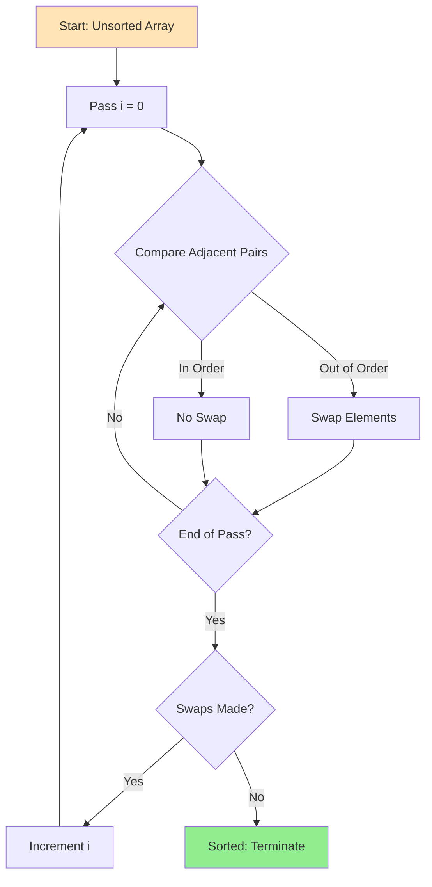
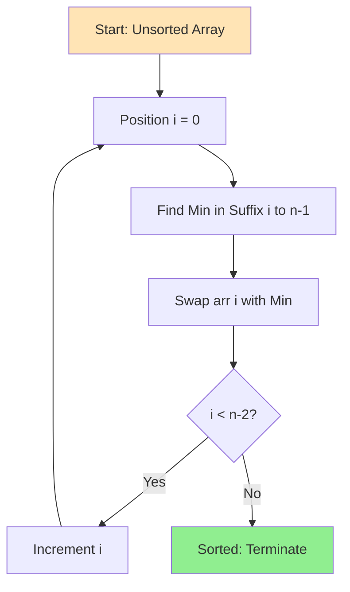
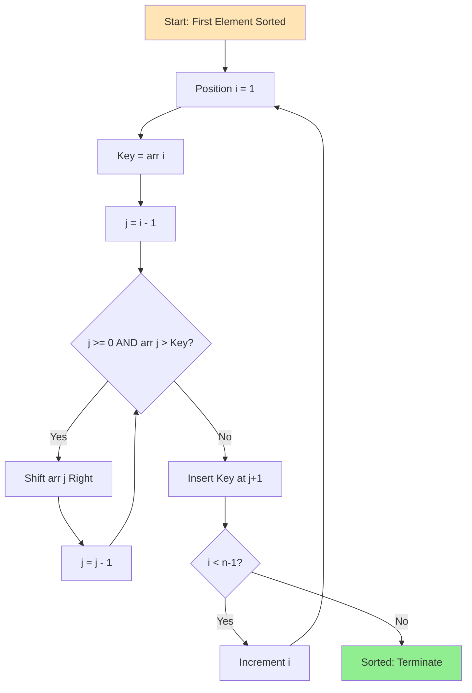

# Week 3 — Day 1: Elementary Sorts — Bubble, Selection, Insertion

**Week:** 3  
**Day:** 1  
**Topic:** Elementary Sorts — Bubble, Selection, Insertion  
**Category:** Foundations III — Sorting & Hashing  
**Difficulty:** 🟢 Easy to 🟡 Medium  
**Prerequisites:** Week 2 (Arrays, Linked Lists), Week 1 (Asymptotic Analysis)  
**Interview Frequency:** Medium (understanding principles is critical for advanced sorts)  
**Real-World Impact:** Foundation for understanding all sorting algorithms; used in hybrid algorithms and small data sets

---

## 🤔 The Why — Engineering Motivation

### The Sorting Problem

Sorting is one of the most fundamental operations in computer science. Given a collection of elements with a comparison operation, arrange them in non-decreasing (or non-increasing) order. This seemingly simple task underlies countless real-world applications:

- **Database Query Optimization:** ORDER BY clauses rely on efficient sorting
- **File Systems:** Directory listings sorted by name, date, or size
- **Search Engines:** Results ranked by relevance scores
- **Operating Systems:** Process scheduling based on priority
- **Graphics Rendering:** Z-buffer sorting for depth ordering
- **Data Analysis:** Quantiles, medians, and statistical operations

### Why Study Elementary Sorts?

You might wonder: "If we have efficient O(n log n) algorithms like merge sort and quicksort, why study O(n squared) algorithms at all?"

**Pedagogical Value:**
- Elementary sorts illustrate core algorithmic concepts: invariants, loop structures, comparison-based reasoning
- They are intuitive and map directly to human sorting strategies (like organizing a hand of playing cards)
- Understanding why they are slow teaches you what makes faster algorithms fast

**Practical Value:**
- **Small Datasets:** For n less than 10-20, elementary sorts can be faster than complex algorithms due to lower constant factors and no recursion overhead
- **Nearly Sorted Data:** Insertion sort achieves O(n) on nearly sorted arrays, making it ideal for incremental updates
- **Hybrid Algorithms:** Modern sorting implementations (like Timsort in Python and Java) use insertion sort for small subarrays
- **Embedded Systems:** Memory-constrained environments benefit from in-place, simple algorithms
- **Teaching Stability:** Understanding which elementary sorts are stable vs unstable prepares you for advanced sorting discussions

### The Trade-Off Landscape

Elementary sorts occupy a specific niche in the sorting trade-off space:

- **Time Complexity:** O(n squared) worst-case and average-case (except best-case scenarios)
- **Space Complexity:** O(1) — they sort in-place with no extra memory
- **Simplicity:** Minimal code, easy to implement correctly
- **Stability:** Some (bubble, insertion) preserve relative order of equal elements; selection does not
- **Adaptivity:** Insertion sort adapts to pre-sorted or partially sorted input

Modern sorting algorithms combine the best of both worlds: they use elementary sorts on small subarrays within a divide-and-conquer framework to minimize overhead.

---

## 📌 The What — Mental Model & Core Concepts

### Core Concepts Overview

This day covers **three elementary comparison-based sorting algorithms:**

1. **Bubble Sort** — Repeatedly swap adjacent out-of-order pairs
2. **Selection Sort** — Repeatedly select the minimum (or maximum) and place it in the correct position
3. **Insertion Sort** — Insert each element into its correct position within a sorted prefix

All three share common properties:
- **Comparison-based:** They only use element comparisons (less than, greater than, equal)
- **In-place:** They require O(1) extra space (aside from a few temporary variables)
- **O(n squared) average complexity:** They perform approximately n squared divided by 2 comparisons and swaps on random input

### Mental Model 1: Bubble Sort — Bubbling Up the Heaviest

**Analogy:** Imagine bubbles in a liquid rising to the surface. Heavier elements "sink" to the end while lighter elements "bubble up" to the beginning.

**Core Idea:**
- Compare adjacent pairs from left to right
- Swap them if they are out of order
- After each full pass, the largest unsorted element "bubbles" to its final position
- Repeat until no swaps are needed

**Invariant:**
- After pass i, the last i elements are in their final sorted positions
- The unsorted portion shrinks by 1 each pass

**Visualization (Pass-by-Pass):**

```
Initial: [5, 3, 8, 4, 2]

Pass 1: Compare and swap adjacent pairs
  [5, 3, 8, 4, 2] → [3, 5, 8, 4, 2]  (swap 5,3)
  [3, 5, 8, 4, 2] → [3, 5, 8, 4, 2]  (no swap)
  [3, 5, 8, 4, 2] → [3, 5, 4, 8, 2]  (swap 8,4)
  [3, 5, 4, 8, 2] → [3, 5, 4, 2, 8]  (swap 8,2)
  Result: [3, 5, 4, 2, |8|]  ← 8 in final position

Pass 2:
  [3, 5, 4, 2] → [3, 5, 4, 2]  (no swap)
  [3, 5, 4, 2] → [3, 4, 5, 2]  (swap 5,4)
  [3, 4, 5, 2] → [3, 4, 2, 5]  (swap 5,2)
  Result: [3, 4, 2, |5, 8|]  ← 5 now in final position

Pass 3:
  [3, 4, 2] → [3, 4, 2]  (no swap)
  [3, 4, 2] → [3, 2, 4]  (swap 4,2)
  Result: [3, 2, |4, 5, 8|]

Pass 4:
  [3, 2] → [2, 3]  (swap 3,2)
  Result: [|2, 3, 4, 5, 8|]  ← Fully sorted
```

**Key Operations:**
- Comparisons: approximately n squared divided by 2
- Swaps: approximately n squared divided by 2 in worst case
- Best case (already sorted): n comparisons, 0 swaps if optimized with a "swapped" flag

---

### Mental Model 2: Selection Sort — Repeatedly Pick the Champion

**Analogy:** Imagine organizing a tournament where you repeatedly select the "champion" (minimum element) from the remaining unsorted players and place them in the winner's bracket.

**Core Idea:**
- Divide array into sorted prefix and unsorted suffix
- Find the minimum element in the unsorted suffix
- Swap it with the first element of the unsorted suffix
- Extend the sorted prefix by 1
- Repeat until entire array is sorted

**Invariant:**
- After pass i, the first i elements are the i smallest elements in sorted order
- The unsorted suffix contains the remaining elements

**Visualization (Pass-by-Pass):**

```
Initial: [5, 3, 8, 4, 2]
         ^ sorted | unsorted →

Pass 1: Find min in [5,3,8,4,2] → min=2 at index 4
  Swap index 0 and 4: [2, 3, 8, 4, 5]
                      |2| sorted

Pass 2: Find min in [3,8,4,5] → min=3 at index 1
  No swap needed: [2, 3, 8, 4, 5]
                  |2, 3| sorted

Pass 3: Find min in [8,4,5] → min=4 at index 3
  Swap index 2 and 3: [2, 3, 4, 8, 5]
                      |2, 3, 4| sorted

Pass 4: Find min in [8,5] → min=5 at index 4
  Swap index 3 and 4: [2, 3, 4, 5, 8]
                      |2, 3, 4, 5| sorted

Pass 5: Only one element left → [2, 3, 4, 5, 8]
                                 |2, 3, 4, 5, 8| ← Fully sorted
```

**Key Operations:**
- Comparisons: exactly n times (n minus 1) divided by 2 (always, regardless of input)
- Swaps: at most n minus 1 (one per pass)
- Number of swaps is minimized compared to bubble sort

---

### Mental Model 3: Insertion Sort — Building a Sorted Hand of Cards

**Analogy:** Imagine sorting a hand of playing cards. You pick up one card at a time and insert it into its correct position among the cards you have already sorted.

**Core Idea:**
- Maintain a sorted prefix at the beginning of the array
- Take the next unsorted element (the "key")
- Shift all larger elements in the sorted prefix one position to the right
- Insert the key into the gap created
- Repeat until all elements are inserted

**Invariant:**
- After pass i, the first i plus 1 elements form a sorted sequence (though not necessarily the i plus 1 smallest elements overall)
- Elements to the right of position i are unsorted

**Visualization (Pass-by-Pass):**

```
Initial: [5, 3, 8, 4, 2]

Pass 1: Insert 3 into sorted [5]
  Key = 3, compare with 5 → 5 > 3, shift 5 right
  [_, 5, 8, 4, 2] → insert 3 at index 0
  [3, 5, 8, 4, 2]  ← Sorted prefix: [3, 5]

Pass 2: Insert 8 into sorted [3, 5]
  Key = 8, compare with 5 → 5 < 8, no shift needed
  [3, 5, 8, 4, 2]  ← Sorted prefix: [3, 5, 8]

Pass 3: Insert 4 into sorted [3, 5, 8]
  Key = 4, compare with 8 → 8 > 4, shift 8 right
  [3, 5, _, 8, 2] → compare with 5 → 5 > 4, shift 5 right
  [3, _, 5, 8, 2] → compare with 3 → 3 < 4, insert at index 1
  [3, 4, 5, 8, 2]  ← Sorted prefix: [3, 4, 5, 8]

Pass 4: Insert 2 into sorted [3, 4, 5, 8]
  Key = 2, shift all elements right
  [_, 3, 4, 5, 8] → insert 2 at index 0
  [2, 3, 4, 5, 8]  ← Fully sorted
```

**Key Operations:**
- Comparisons: O(n squared) worst case (reverse-sorted input), O(n) best case (already sorted)
- Shifts (similar to swaps): O(n squared) worst case, O(n) best case
- **Adaptive:** Performance improves dramatically on nearly sorted data

---

### Comparison Table: Bubble vs Selection vs Insertion

| Property | Bubble Sort | Selection Sort | Insertion Sort |
|----------|-------------|----------------|----------------|
| **Time (Best)** | O(n) with flag | O(n squared) | O(n) |
| **Time (Average)** | O(n squared) | O(n squared) | O(n squared) |
| **Time (Worst)** | O(n squared) | O(n squared) | O(n squared) |
| **Space** | O(1) | O(1) | O(1) |
| **Stable** | ✅ Yes | ❌ No | ✅ Yes |
| **Adaptive** | ✅ Yes (with flag) | ❌ No | ✅ Yes |
| **Comparisons** | ~n squared / 2 | n × (n-1) / 2 | Variable |
| **Swaps/Shifts** | ~n squared / 2 | At most n-1 | Variable |
| **Best Use Case** | Teaching, small n | Minimizing swaps | Nearly sorted, online |
| **In-Place** | ✅ Yes | ✅ Yes | ✅ Yes |

---

### When Are Elementary Sorts Acceptable?

**Small Arrays (n less than 10-20):**
- Constant factor overhead of advanced algorithms dominates
- No recursion stack or merge buffer overhead
- Simple loop structures are cache-friendly

**Nearly Sorted Data:**
- Insertion sort achieves O(n) when at most k inversions exist
- Bubble sort with early termination also benefits
- Common in real-time systems with incremental updates

**Embedded Systems:**
- Memory constraints make in-place algorithms essential
- Code simplicity reduces bug surface area
- Predictable performance characteristics

**Hybrid Sorting Algorithms:**
- Timsort (Python, Java): Uses insertion sort for runs less than 64 elements
- Introsort (C++ STL): Switches to insertion sort for small partitions
- Pattern-defeating quicksort: Falls back to insertion sort

---

### Stability: A Critical Property

**Definition:** A sorting algorithm is **stable** if it preserves the relative order of elements with equal keys.

**Example:**
```
Input: [(3, A), (1, B), (3, C), (2, D)]
       (number, label)

Stable sort:   [(1, B), (2, D), (3, A), (3, C)]  ← A before C
Unstable sort: [(1, B), (2, D), (3, C), (3, A)]  ← C before A (order changed)
```

**Why Stability Matters:**
- **Multi-level sorting:** Sort by secondary key, then by primary key (e.g., sort employees by department, then by salary within each department)
- **Database ORDER BY:** Multiple columns in SQL queries
- **UI Components:** Sorting tables by different columns while preserving previous sort order

**Stability of Elementary Sorts:**
- **Bubble Sort:** Stable (only swaps when strictly greater)
- **Selection Sort:** Unstable (long-distance swaps can move equal elements past each other)
- **Insertion Sort:** Stable (shifts elements only when strictly greater)

---

## ⚙ The How — Mechanical Walkthrough

### Bubble Sort: Step-by-Step Mechanics

**Algorithm Structure:**
```
For each pass i from 0 to n-2:
    For each position j from 0 to n-i-2:
        If array[j] > array[j+1]:
            Swap array[j] and array[j+1]
```

**Detailed Walkthrough on [5, 1, 4, 2, 8]:**

**Pass 1 (i = 0, unsorted range: 0 to 4):**
```
j=0: [5, 1, 4, 2, 8] → 5 > 1? Yes → Swap → [1, 5, 4, 2, 8]
j=1: [1, 5, 4, 2, 8] → 5 > 4? Yes → Swap → [1, 4, 5, 2, 8]
j=2: [1, 4, 5, 2, 8] → 5 > 2? Yes → Swap → [1, 4, 2, 5, 8]
j=3: [1, 4, 2, 5, 8] → 5 > 8? No → No swap → [1, 4, 2, 5, 8]
After Pass 1: [1, 4, 2, 5, |8|]  ← Largest element in place
```

**Pass 2 (i = 1, unsorted range: 0 to 3):**
```
j=0: [1, 4, 2, 5] → 1 > 4? No → No swap
j=1: [1, 4, 2, 5] → 4 > 2? Yes → Swap → [1, 2, 4, 5]
j=2: [1, 2, 4, 5] → 4 > 5? No → No swap
After Pass 2: [1, 2, 4, |5, 8|]
```

**Pass 3 (i = 2, unsorted range: 0 to 2):**
```
j=0: [1, 2, 4] → 1 > 2? No → No swap
j=1: [1, 2, 4] → 2 > 4? No → No swap
After Pass 3: [1, 2, |4, 5, 8|]
```

**Pass 4 (i = 3, unsorted range: 0 to 1):**
```
j=0: [1, 2] → 1 > 2? No → No swap
After Pass 4: [1, |2, 4, 5, 8|]  ← Fully sorted
```

**Total:** 4 passes, 10 comparisons, 3 swaps

**Optimization: Early Termination Flag**
```
swapped = false
For each pass i from 0 to n-2:
    swapped = false
    For each position j from 0 to n-i-2:
        If array[j] > array[j+1]:
            Swap array[j] and array[j+1]
            swapped = true
    If swapped == false:
        Break  // Array is sorted
```

On already-sorted input, this achieves O(n) with only one pass.

---

### Selection Sort: Step-by-Step Mechanics

**Algorithm Structure:**
```
For each position i from 0 to n-2:
    minIndex = i
    For each position j from i+1 to n-1:
        If array[j] < array[minIndex]:
            minIndex = j
    Swap array[i] with array[minIndex]
```

**Detailed Walkthrough on [5, 1, 4, 2, 8]:**

**Pass 1 (i = 0):**
```
Search range: [5, 1, 4, 2, 8] (indices 0-4)
  minIndex starts at 0 (value 5)
  j=1: 1 < 5? Yes → minIndex = 1
  j=2: 4 < 1? No
  j=3: 2 < 1? No
  j=4: 8 < 1? No
  minIndex = 1 (value 1)
Swap index 0 and 1: [1, 5, 4, 2, 8]
```

**Pass 2 (i = 1):**
```
Search range: [5, 4, 2, 8] (indices 1-4)
  minIndex starts at 1 (value 5)
  j=2: 4 < 5? Yes → minIndex = 2
  j=3: 2 < 4? Yes → minIndex = 3
  j=4: 8 < 2? No
  minIndex = 3 (value 2)
Swap index 1 and 3: [1, 2, 4, 5, 8]
```

**Pass 3 (i = 2):**
```
Search range: [4, 5, 8] (indices 2-4)
  minIndex starts at 2 (value 4)
  j=3: 5 < 4? No
  j=4: 8 < 4? No
  minIndex = 2 (value 4) — no swap needed
Array: [1, 2, 4, 5, 8]
```

**Pass 4 (i = 3):**
```
Search range: [5, 8] (indices 3-4)
  minIndex starts at 3 (value 5)
  j=4: 8 < 5? No
  minIndex = 3 (value 5) — no swap needed
Array: [1, 2, 4, 5, 8]  ← Fully sorted
```

**Total:** 4 passes, 10 comparisons (always), 2 swaps

**Key Insight:** Number of comparisons is always n times (n minus 1) divided by 2, regardless of input order. This makes selection sort **non-adaptive**.

---

### Insertion Sort: Step-by-Step Mechanics

**Algorithm Structure:**
```
For each position i from 1 to n-1:
    key = array[i]
    j = i - 1
    While j >= 0 AND array[j] > key:
        array[j+1] = array[j]  // Shift right
        j = j - 1
    array[j+1] = key  // Insert key
```

**Detailed Walkthrough on [5, 1, 4, 2, 8]:**

**Initial:** [5 | 1, 4, 2, 8]  (position 0 is "sorted")

**Pass 1 (i = 1, key = 1):**
```
Sorted prefix: [5], key = 1
  j=0: 5 > 1? Yes → Shift 5 right
  [_, 5, 4, 2, 8]
  j=-1 (stop), insert 1 at index 0
Result: [1, 5 | 4, 2, 8]
```

**Pass 2 (i = 2, key = 4):**
```
Sorted prefix: [1, 5], key = 4
  j=1: 5 > 4? Yes → Shift 5 right
  [1, _, 5, 2, 8]
  j=0: 1 > 4? No (stop), insert 4 at index 1
Result: [1, 4, 5 | 2, 8]
```

**Pass 3 (i = 3, key = 2):**
```
Sorted prefix: [1, 4, 5], key = 2
  j=2: 5 > 2? Yes → Shift 5 right
  [1, 4, _, 5, 8]
  j=1: 4 > 2? Yes → Shift 4 right
  [1, _, 4, 5, 8]
  j=0: 1 > 2? No (stop), insert 2 at index 1
Result: [1, 2, 4, 5 | 8]
```

**Pass 4 (i = 4, key = 8):**
```
Sorted prefix: [1, 2, 4, 5], key = 8
  j=3: 5 > 8? No (stop immediately)
  Insert 8 at index 4 (no shift needed)
Result: [1, 2, 4, 5, 8]  ← Fully sorted
```

**Total:** 4 passes, 6 comparisons, 5 shifts

**Best Case (Already Sorted):** [1, 2, 4, 5, 8]
- Each pass: 1 comparison, 0 shifts
- Total: 4 comparisons, 0 shifts → O(n)

---

### ASCII Diagram: Comparison of All Three Algorithms

```
Input: [5, 3, 8, 4, 2]

BUBBLE SORT (Largest bubbles to end):
Pass 1: [3, 5, 4, 2, |8|]     ← 8 settles
Pass 2: [3, 4, 2, |5, 8|]     ← 5 settles
Pass 3: [3, 2, |4, 5, 8|]     ← 4 settles
Pass 4: [2, |3, 4, 5, 8|]     ← 3 settles
Done:   [|2, 3, 4, 5, 8|]

SELECTION SORT (Select minimum repeatedly):
Pass 1: [2, 3, 8, 4, 5]  ← min=2 selected, swapped with index 0
Pass 2: [2, 3, 8, 4, 5]  ← min=3 already at index 1
Pass 3: [2, 3, 4, 8, 5]  ← min=4 selected, swapped with index 2
Pass 4: [2, 3, 4, 5, 8]  ← min=5 selected, swapped with index 3
Done:   [2, 3, 4, 5, 8]

INSERTION SORT (Insert into sorted prefix):
Pass 1: [3, 5, 8, 4, 2]  ← Insert 3 into [5]
Pass 2: [3, 5, 8, 4, 2]  ← Insert 8 into [3,5] (no move)
Pass 3: [3, 4, 5, 8, 2]  ← Insert 4 into [3,5,8]
Pass 4: [2, 3, 4, 5, 8]  ← Insert 2 into [3,4,5,8]
Done:   [2, 3, 4, 5, 8]
```

---

## 🎨 Visualization — Simulation & Examples

### Example 1: Sorting Small Array [8, 3, 5, 1]

**Bubble Sort Trace:**
```
Initial:  [8, 3, 5, 1]

Pass 1:
  Compare 8,3 → Swap → [3, 8, 5, 1]
  Compare 8,5 → Swap → [3, 5, 8, 1]
  Compare 8,1 → Swap → [3, 5, 1, |8|]

Pass 2:
  Compare 3,5 → No swap → [3, 5, 1, 8]
  Compare 5,1 → Swap → [3, 1, |5, 8|]

Pass 3:
  Compare 3,1 → Swap → [1, |3, 5, 8|]

Done: [1, 3, 5, 8]
Comparisons: 6, Swaps: 4
```

**Selection Sort Trace:**
```
Initial:  [8, 3, 5, 1]

Pass 1: Find min in [8,3,5,1] → min=1 at index 3
  Swap 8↔1 → [1, 3, 5, 8]

Pass 2: Find min in [3,5,8] → min=3 at index 1
  No swap → [1, 3, 5, 8]

Pass 3: Find min in [5,8] → min=5 at index 2
  No swap → [1, 3, 5, 8]

Done: [1, 3, 5, 8]
Comparisons: 6, Swaps: 1
```

**Insertion Sort Trace:**
```
Initial:  [8 | 3, 5, 1]

Pass 1: Insert 3 into [8]
  3 < 8 → Shift 8 → [3, 8 | 5, 1]

Pass 2: Insert 5 into [3, 8]
  5 < 8 → Shift 8 → [3, 5, 8 | 1]

Pass 3: Insert 1 into [3, 5, 8]
  1 < 8 → Shift 8 → [3, 5, 1, 8]
  1 < 5 → Shift 5 → [3, 1, 5, 8]
  1 < 3 → Shift 3 → [1, 3, 5, 8]

Done: [1, 3, 5, 8]
Comparisons: 6, Shifts: 5
```

---

### Example 2: Nearly Sorted Array [1, 2, 5, 3, 4]

**Insertion Sort (Best Performer):**
```
Initial: [1 | 2, 5, 3, 4]

Pass 1: Insert 2 → 2 > 1, no move → [1, 2 | 5, 3, 4]
Pass 2: Insert 5 → 5 > 2, no move → [1, 2, 5 | 3, 4]
Pass 3: Insert 3 → 3 < 5, shift 5 → [1, 2, 3, 5 | 4]
Pass 4: Insert 4 → 4 < 5, shift 5 → [1, 2, 3, 4, 5]

Total: 5 comparisons, 2 shifts
```

**Bubble Sort (with early termination):**
```
Pass 1: [1, 2, 5, 3, 4] → [1, 2, 3, 4, 5]  (2 swaps)
Pass 2: No swaps detected → Early termination

Total: 8 comparisons (partial pass 2), 2 swaps
```

**Selection Sort (No Benefit):**
```
Still performs 10 comparisons regardless of input order
```

---

### Example 3: Reverse-Sorted Array [5, 4, 3, 2, 1] (Worst Case)

**All Algorithms Perform Poorly:**

| Algorithm | Comparisons | Swaps/Shifts | Passes |
|-----------|-------------|--------------|--------|
| Bubble | 10 | 10 | 4 |
| Selection | 10 | 4 | 4 |
| Insertion | 10 | 10 | 4 |

Insertion sort degrades to moving every element all the way from the right to the left, equivalent to bubble sort in operations.

---

### Mermaid Diagram: Bubble Sort State Flow



---

### Mermaid Diagram: Selection Sort State Flow



---

### Mermaid Diagram: Insertion Sort State Flow



---

## 📊 Critical Analysis — Performance & Robustness

### Time Complexity Analysis

**Bubble Sort:**
- **Best Case:** O(n) — Already sorted, with early termination flag
  - One pass, n minus 1 comparisons, 0 swaps
- **Average Case:** O(n squared) — Random input
  - Approximately n squared divided by 4 comparisons and swaps
- **Worst Case:** O(n squared) — Reverse sorted
  - n times (n minus 1) divided by 2 comparisons and swaps

**Selection Sort:**
- **Best Case:** O(n squared) — Already sorted (no optimization possible)
- **Average Case:** O(n squared) — Random input
- **Worst Case:** O(n squared) — Reverse sorted
- **Always:** Exactly n times (n minus 1) divided by 2 comparisons, at most n minus 1 swaps

**Insertion Sort:**
- **Best Case:** O(n) — Already sorted
  - n minus 1 comparisons, 0 shifts
- **Average Case:** O(n squared) — Random input
  - Approximately n squared divided by 4 comparisons and shifts
- **Worst Case:** O(n squared) — Reverse sorted
  - n times (n minus 1) divided by 2 comparisons and shifts

---

### Space Complexity Analysis

**All Three Algorithms:** O(1) auxiliary space

- Only a few temporary variables needed (loop counters, key, minIndex)
- No recursion (no call stack)
- No auxiliary arrays or buffers
- In-place sorting: elements are rearranged within the original array

---

### Detailed Comparison Table

| Metric | Bubble Sort | Selection Sort | Insertion Sort |
|--------|-------------|----------------|----------------|
| **Comparisons (Best)** | n-1 | n(n-1)/2 | n-1 |
| **Comparisons (Avg)** | n squared/2 | n(n-1)/2 | n squared/4 |
| **Comparisons (Worst)** | n(n-1)/2 | n(n-1)/2 | n(n-1)/2 |
| **Swaps (Best)** | 0 | 0-n | 0 |
| **Swaps (Avg)** | n squared/4 | n/2 | n squared/4 |
| **Swaps (Worst)** | n(n-1)/2 | n-1 | n(n-1)/2 |
| **Adaptive** | ✅ Yes (flag) | ❌ No | ✅ Yes |
| **Stable** | ✅ Yes | ❌ No | ✅ Yes |
| **Online** | ❌ No | ❌ No | ✅ Yes |
| **Cache-Friendly** | 🟡 Moderate | 🟡 Moderate | ✅ Yes |

**Definitions:**
- **Adaptive:** Performance improves on nearly sorted input
- **Stable:** Preserves relative order of equal elements
- **Online:** Can sort a list as it receives it (streaming data)
- **Cache-Friendly:** Sequential access pattern, good locality

---

### When to Use Each Algorithm

**Bubble Sort:**
- ✅ Teaching and learning algorithmic concepts
- ✅ Detecting if array is already sorted (with flag)
- ❌ Rarely used in production

**Selection Sort:**
- ✅ Minimizing number of swaps (expensive write operations, e.g., flash memory)
- ✅ Small arrays where simplicity matters
- ❌ When stability is required

**Insertion Sort:**
- ✅ Small arrays (n less than 10-20) in hybrid algorithms
- ✅ Nearly sorted arrays
- ✅ Online algorithms (sorting data as it arrives)
- ✅ When stability is required
- ✅ Linked lists (no random access needed)

---

### Robustness and Edge Cases

**All Algorithms Handle:**
- Empty arrays (n = 0): No operations, return immediately
- Single element (n = 1): Already sorted
- All equal elements: Stable algorithms preserve order, selection sort makes unnecessary swaps
- Duplicates: Handled correctly, stable algorithms preserve relative order

**Potential Issues:**
- **Integer Overflow:** If array size n is very large, n squared can overflow
- **Comparison Function:** Must implement consistent total order (reflexive, antisymmetric, transitive)
- **Generic Types:** Need proper comparison operators or comparator functions

---

## 🏭 Real Systems — Integration in Production

### System 1: Python's Timsort — Hybrid Algorithm

**Context:** Python's built-in `sort()` and `sorted()` functions use Timsort, invented by Tim Peters in 2002.

**How Elementary Sorts Are Used:**
- Timsort divides the array into **runs** (monotonic sequences)
- For runs shorter than 64 elements, Timsort uses **binary insertion sort**
- Binary insertion sort is insertion sort with binary search to find insertion position
- This exploits insertion sort's O(n) performance on small, partially sorted data

**Impact:**
- Best-case O(n) on nearly sorted data
- Stable sorting guaranteed
- Excellent performance on real-world data (which often has pre-sorted runs)

**Production Scale:**
- Used in billions of Python programs daily
- CPython, PyPy, and other implementations
- Foundation of pandas DataFrame sorting

---

### System 2: Java's Arrays.sort() — Dual-Pivot Quicksort with Insertion Sort

**Context:** Java's `Arrays.sort()` for primitives uses dual-pivot quicksort (since Java 7).

**How Elementary Sorts Are Used:**
- When a partition size falls below 47 elements, the algorithm switches to **insertion sort**
- Insertion sort's low overhead and O(n) best case make it faster than recursive quicksort for small n
- The threshold of 47 was empirically determined through benchmarking

**Impact:**
- Faster sorting for arrays of all sizes
- Reduced recursion depth
- Better cache performance on small subarrays

**Production Scale:**
- Java standard library used by millions of applications
- Android OS sorting operations
- Enterprise applications processing large datasets

---

### System 3: Linux Kernel's list_sort() — Merge Sort with Insertion Sort

**Context:** The Linux kernel provides `list_sort()` for sorting linked lists (used in scheduler, filesystem, networking).

**How Elementary Sorts Are Used:**
- For linked lists with fewer than a threshold number of elements (typically 8-16), the kernel uses **insertion sort**
- Insertion sort on linked lists is efficient: no element shifting, just pointer rewiring
- Insertion sort is also used as a final pass to clean up small unsorted segments

**Impact:**
- Efficient sorting of kernel data structures
- Minimal memory overhead (in-place for linked lists)
- Critical for real-time scheduling decisions

**Production Scale:**
- Billions of Linux servers worldwide
- Android devices (Linux kernel)
- Embedded systems and IoT devices

---

### System 4: C++ STL sort() — Introsort with Insertion Sort

**Context:** The C++ Standard Template Library's `std::sort()` uses introsort (introspective sort), a hybrid of quicksort, heapsort, and insertion sort.

**How Elementary Sorts Are Used:**
- When partition size drops below 16 elements, introsort switches to **insertion sort**
- Insertion sort is faster for small subarrays due to low constant factors
- Final pass: one insertion sort over entire array to fix small unsorted regions

**Impact:**
- O(n log n) worst-case guarantee (via heapsort fallback)
- Fast average-case performance (via quicksort)
- Efficient handling of small subarrays (via insertion sort)

**Production Scale:**
- Backbone of C++ applications worldwide
- Game engines, high-frequency trading systems, scientific computing
- Performance-critical applications

---

### System 5: Embedded Systems and Microcontrollers

**Context:** Memory-constrained devices (Arduino, IoT sensors, automotive ECUs) often use elementary sorts.

**How Elementary Sorts Are Used:**
- **Insertion sort** for small sensor data arrays (temperature readings, accelerometer data)
- **Selection sort** when swap operations are expensive (writing to EEPROM/flash memory)
- Simple code minimizes program memory footprint

**Impact:**
- Minimal RAM and code size
- Predictable performance for real-time systems
- Easy to verify correctness (safety-critical systems like automotive)

**Production Scale:**
- Billions of IoT devices
- Automotive ECUs (engine control, ABS, airbags)
- Medical devices (pacemakers, insulin pumps)

---

### System 6: Database Query Execution — Small Joins

**Context:** Databases like PostgreSQL and MySQL use various sorting algorithms for ORDER BY, JOIN, and aggregation operations.

**How Elementary Sorts Are Used:**
- For small result sets (fewer than 100 rows), some databases use **insertion sort** directly
- Selection sort occasionally used when minimizing swaps (large row sizes)
- Larger result sets use external merge sort or quicksort variants

**Impact:**
- Faster query execution for small tables
- Reduced memory allocation overhead
- Simpler code paths for edge cases

**Production Scale:**
- PostgreSQL, MySQL, SQLite used by millions of applications
- Web applications, mobile apps, embedded databases

---

### System 7: Excel and Spreadsheet Applications

**Context:** Microsoft Excel and Google Sheets sort data ranges.

**How Elementary Sorts Are Used:**
- For very small ranges (fewer than 10 cells), use **insertion sort** due to simplicity
- Hybrid algorithms switch to advanced sorts for larger ranges
- Stability is critical for maintaining row integrity in multi-column data

**Impact:**
- Fast sorting of small data ranges
- Stable sorting preserves row relationships
- User-visible performance on interactive operations

**Production Scale:**
- Microsoft Excel: 1 billion+ users
- Google Sheets: hundreds of millions of users

---

### System 8: Git Version Control — Sorting Commit History

**Context:** Git internally sorts commit references, file paths, and directory entries.

**How Elementary Sorts Are Used:**
- For small arrays of references (fewer than 32 items), Git uses **insertion sort**
- Insertion sort maintains stability for deterministic output
- Simple code reduces git binary size

**Impact:**
- Fast sorting of small object lists
- Stable output for reproducible builds
- Minimal overhead in core git operations

**Production Scale:**
- Git used by virtually all software development teams worldwide
- GitHub, GitLab, Bitbucket infrastructure

---

### System 9: Redis In-Memory Database — Sorted Sets

**Context:** Redis sorted sets maintain elements in sorted order by score.

**How Elementary Sorts Are Used:**
- For small sorted sets (fewer than 128 elements by default), Redis uses a **simple linear insertion** (similar to insertion sort)
- Larger sorted sets use skip lists
- Trade-off between simplicity and O(log n) operations

**Impact:**
- Faster operations for small sorted sets
- Reduced memory overhead (no skip list pointers)
- Critical for leaderboards, priority queues

**Production Scale:**
- Redis used by major platforms (Twitter, GitHub, Stack Overflow)
- Millions of requests per second

---

### System 10: Video Game Engines — Sorting Draw Calls

**Context:** Game engines must sort thousands of draw calls per frame for rendering (transparent objects sorted back-to-front).

**How Elementary Sorts Are Used:**
- For small batches of objects (fewer than 16), use **insertion sort** for cache efficiency
- Frame coherence: objects are nearly sorted frame-to-frame, insertion sort achieves O(n)
- Larger batches use radix sort or other specialized algorithms

**Impact:**
- Real-time 60 FPS rendering
- Minimal CPU overhead in render loop
- Leverages temporal coherence

**Production Scale:**
- Unreal Engine, Unity, proprietary AAA engines
- Billions of gaming hours annually

---

## 🔗 Concept Crossovers — Connections & Comparisons

### Connection to Advanced Sorting Algorithms

**Merge Sort:**
- Uses divide-and-conquer (unlike elementary sorts' simple loops)
- Guaranteed O(n log n) time
- Not in-place (requires O(n) extra space)
- Often uses **insertion sort** for small subarrays in hybrid implementations

**Quick Sort:**
- Also uses divide-and-conquer via partitioning
- Average O(n log n), worst O(n squared)
- In-place like elementary sorts
- Falls back to **insertion sort** for small partitions in introsort

**Heap Sort:**
- Uses a binary heap data structure
- Guaranteed O(n log n) time
- In-place, but not stable
- More complex than elementary sorts, used when O(n log n) guarantee is needed

---

### Elementary Sorts vs Hash Tables

Both are fundamental techniques, but serve different purposes:

| Aspect | Elementary Sorts | Hash Tables |
|--------|------------------|-------------|
| **Purpose** | Order elements | Fast lookup |
| **Time** | O(n squared) | O(1) average |
| **Space** | O(1) extra | O(n) extra |
| **Use Case** | Ordered output | Membership tests |
| **Stability** | Some are stable | N/A |

**When Sorting Beats Hashing:**
- Need ordered output (ORDER BY in SQL)
- Range queries (elements between a and b)
- Finding kth smallest element

**When Hashing Beats Sorting:**
- Membership tests (is x in the set?)
- Counting distinct elements
- Finding duplicates (no need to sort)

---

### Elementary Sorts vs Binary Search Trees (BSTs)

Both can produce sorted output:

| Aspect | Elementary Sorts | BSTs |
|--------|------------------|------|
| **Time to Sort** | O(n squared) | O(n log n) avg |
| **Space** | O(1) extra | O(n) nodes |
| **In-Order Traversal** | N/A | Gives sorted output |
| **Modification** | Re-sort from scratch | Insert in O(log n) |

**When Elementary Sorts Win:**
- Static data (no insertions after sorting)
- Memory constraints (O(1) space)
- Small n

**When BSTs Win:**
- Dynamic data (frequent insertions/deletions)
- Need to maintain sorted order online
- Larger datasets

---

### Stability: Why It Matters

**Stable Sorts:** Bubble, Insertion
**Unstable Sorts:** Selection

**Example: Sorting Students by Grade, Then by Name**

```
Original (sorted by name):
  (Alice, B), (Bob, A), (Charlie, B)

Sort by grade (stable):
  (Bob, A), (Alice, B), (Charlie, B)  ← Alice before Charlie (both B)

Sort by grade (unstable):
  (Bob, A), (Charlie, B), (Alice, B)  ← Order of B's changed
```

**Real-World Impact:**
- **Database ORDER BY:** Multiple columns require stable intermediate sorts
- **UI Tables:** Sorting by one column, then another, users expect previous order preserved
- **Data Pipelines:** Multi-stage sorting transformations

---

### Adaptivity: Insertion Sort vs Others

**Adaptive Algorithms:** Bubble (with flag), Insertion
**Non-Adaptive:** Selection

**Example: Nearly Sorted Array [1, 2, 3, 5, 4]**

```
Insertion Sort: 5 comparisons, 1 shift → O(n)
Selection Sort: 10 comparisons, 1 swap → O(n squared)
```

**Real-World Scenarios:**
- **Incremental Updates:** Adding new elements to an already sorted list
- **Database Indexes:** Maintaining sorted indexes with occasional insertions
- **Real-Time Systems:** Processing time-series data with mostly ordered timestamps

---

### Elementary Sorts vs Counting Sort (Non-Comparison)

**Counting Sort:**
- Not comparison-based (counts occurrences of each value)
- O(n + k) time where k is the range of input values
- Only works for integers in a known, small range

**When Counting Sort Wins:**
- Integer keys with small range (e.g., sorting ages 0-120)
- Stable sorting required
- O(n) time needed

**When Elementary Sorts Win:**
- Arbitrary comparison-based sorting (strings, custom objects)
- Unknown or large range of values
- Memory constraints (counting sort needs O(k) extra space)

---

## 📐 Mathematical & Theoretical Perspective

### Formal Complexity Proofs

**Theorem: Bubble Sort Worst-Case Complexity is O(n squared)**

**Proof:**
- In the worst case (reverse-sorted array), every pair is out of order
- Total number of adjacent pairs: (n-1) + (n-2) + ... + 1
- Sum of first (n-1) integers: n times (n-1) divided by 2
- Therefore, worst-case comparisons and swaps: n times (n-1) divided by 2 which is in O(n squared)

**Theorem: Selection Sort Always Performs n times (n-1) divided by 2 Comparisons**

**Proof:**
- Pass i examines (n - i) elements to find the minimum
- Total comparisons: sum from i=1 to n-1 of (n - i)
- This equals (n-1) + (n-2) + ... + 1 = n times (n-1) divided by 2
- Independent of input order (no early termination possible)

**Theorem: Insertion Sort Best-Case Complexity is O(n)**

**Proof:**
- If array is already sorted, each insertion requires exactly 1 comparison (key compared with last element of sorted prefix)
- No shifts needed
- Total comparisons: n-1
- Total shifts: 0
- Therefore, best-case is Theta(n)

---

### Lower Bound for Comparison-Based Sorting

**Theorem: Any comparison-based sorting algorithm requires Omega(n log n) comparisons in the worst case.**

**Proof Sketch:**
- There are n factorial (n!) possible permutations of n elements
- A comparison-based algorithm builds a decision tree with n! leaves
- Each comparison partitions the possible permutations
- A binary tree with n! leaves has height at least log base 2 of (n!)
- By Stirling's approximation: log(n!) is approximately n log n minus n log e
- Therefore, height is Omega(n log n)

**Implication:**
- Elementary sorts are suboptimal (O(n squared) versus lower bound of Omega(n log n))
- Optimal comparison-based sorts (merge sort, heap sort) achieve O(n log n)
- Non-comparison sorts (counting, radix) can beat this lower bound for specific input types

---

### Inversions and Sorting

**Definition:** An **inversion** in an array is a pair of indices (i, j) where i < j but array[i] > array[j].

**Example:**
```
Array: [3, 1, 4, 2]
Inversions: (3,1), (3,2), (4,2)  → 3 inversions
```

**Theorem: The number of swaps performed by insertion sort equals the number of inversions in the input.**

**Proof:**
- Each shift in insertion sort corrects exactly one inversion
- When key is inserted at position p, it shifts past all elements greater than key
- Each shifted element was an inversion with key
- Therefore, total shifts = total inversions

**Implications:**
- Best case (sorted): 0 inversions, O(n) time
- Worst case (reverse sorted): n times (n-1) divided by 2 inversions, O(n squared) time
- Insertion sort is optimal for inputs with few inversions

---

### Stability and Permutations

**Definition:** A sorting algorithm is **stable** if equal elements retain their relative order.

**Why Selection Sort Is Unstable:**

```
Example: [3a, 2, 3b, 1]  (subscripts distinguish equal elements)

Pass 1: Find min=1, swap with 3a → [1, 2, 3b, 3a]
  → 3a moved past 3b, violating stability
```

**Why Insertion/Bubble Are Stable:**
- Only swap when strictly greater (not greater-or-equal)
- Equal elements never swap positions
- Relative order preserved

---

### Amortized Analysis: Bubble Sort with Flag

**Claim:** Bubble sort with early termination flag has O(n) best-case time.

**Analysis:**
- If array is already sorted, first pass makes n-1 comparisons, 0 swaps
- Flag remains false, algorithm terminates after 1 pass
- Total time: Theta(n)

**Amortized Analysis for Insertion on Nearly Sorted:**
- If each element is at most k positions from its final position
- Each insertion performs at most k comparisons and shifts
- Total time: O(n times k)
- For k = O(1) (constant displacement), time is O(n)

---

## 💡 Algorithmic Design Intuition

### Why Do Elementary Sorts Have Nested Loops?

**Outer Loop:** Determines how many elements are in their final position
**Inner Loop:** Performs comparisons and swaps to extend the sorted region

**Bubble Sort Intuition:**
- Outer loop: "How many passes do we need?" → n-1 passes
- Inner loop: "Compare all adjacent pairs in the unsorted region"

**Selection Sort Intuition:**
- Outer loop: "How many positions to fill?" → n-1 positions
- Inner loop: "Find the minimum in the remaining unsorted region"

**Insertion Sort Intuition:**
- Outer loop: "How many elements to insert?" → n-1 insertions
- Inner loop: "Shift elements until the correct position is found"

**General Pattern:**
- Elementary sorts inherently require examining O(n squared) pairs
- Without divide-and-conquer or auxiliary structures, cannot reduce this

---

### Design Decision: In-Place vs Extra Space

**Elementary Sorts Choose In-Place:**
- Pros: O(1) space, simple memory management
- Cons: Cannot parallelize easily, must modify original array

**Advanced Sorts (Merge Sort) Choose Extra Space:**
- Pros: Easier to parallelize, can keep original array intact
- Cons: O(n) extra space, more memory allocations

**Hybrid Approach:**
- Use in-place sorts (insertion) for small subarrays
- Use extra-space sorts (merge) for large subarrays
- Balance space and time complexity

---

### Designing for Stability

**Key Principle:** Use strict inequality in comparison

**Example: Stable Bubble Sort**
```
if (array[j] > array[j+1]):  // strict >
    swap
```

**Unstable if written as:**
```
if (array[j] >= array[j+1]):  // >= causes instability
    swap
```

Equal elements would swap, violating stability.

---

### Recognizing When to Use Elementary Sorts

**Pattern Recognition:**
1. **Size of input:** n less than 10-20 → Consider insertion sort
2. **Initial order:** Nearly sorted → Insertion sort
3. **Swap cost:** Expensive writes → Selection sort (minimizes swaps)
4. **Stability required:** Use bubble or insertion, avoid selection
5. **Memory constraints:** All elementary sorts are O(1) space

**Decision Tree:**
```
Is n < 20?
  ├─ Yes → Use insertion sort (or selection if swaps expensive)
  └─ No → Is data nearly sorted?
         ├─ Yes → Use insertion sort
         └─ No → Use advanced sort (quicksort, mergesort, etc.)
```

---

## ❓ Knowledge Check — Socratic Reasoning

### Question 1: Why does selection sort always perform the same number of comparisons?

**Reasoning:**
- Selection sort searches the entire unsorted region to find the minimum
- It does not "learn" from the input structure (unlike insertion sort)
- Even if the array is sorted, selection sort still scans each position
- The inner loop always runs from i+1 to n-1, independent of element values

**Conclusion:** Selection sort is non-adaptive by design; its comparison count is input-independent.

---

### Question 2: When would you prefer selection sort over insertion sort?

**Key Trade-Off:** Number of swaps vs adaptivity

**Reasoning:**
- Selection sort: at most n-1 swaps, O(n squared) comparisons always
- Insertion sort: O(n squared) shifts, but O(n) best-case on sorted data

**Answer:** Use selection sort when:
- **Swap operations are extremely expensive** (writing to flash memory, moving large objects)
- Data is random (so insertion sort offers no adaptivity advantage)
- Predictable worst-case comparison count is important

---

### Question 3: Can you make bubble sort stable? Can you make selection sort stable?

**Bubble Sort Stability:**
- Already stable by default if using strict greater-than comparison
- Equal elements are never swapped (only when strictly greater)

**Selection Sort Stability Challenge:**
- Traditional selection sort swaps the minimum with the current position
- This long-distance swap can move equal elements past each other

**Making Selection Sort Stable:**
- Instead of swapping, **shift elements** like insertion sort
- Find minimum, then shift all elements between current position and minimum right
- Insert minimum at current position
- This makes it O(n squared) shifts, losing the advantage of selection sort

**Conclusion:** Bubble and insertion are naturally stable; selection sort requires modification that negates its benefit.

---

### Question 4: Why is insertion sort optimal for nearly sorted data?

**Reasoning:**
- Insertion sort performs at most k comparisons per element if each element is at most k positions from its final place
- Total time: O(n times k)
- For k = O(1) (constant displacement), time is O(n)

**Conclusion:** Insertion sort's adaptivity makes it optimal for inputs with few inversions.

---

### Question 5: Can you parallelize elementary sorts?

**Bubble Sort Parallelization:**
- Odd-even transposition sort: alternate between odd and even phases
- Each phase can swap independent pairs in parallel
- Still O(n squared) but with parallel speedup

**Selection Sort Parallelization:**
- Find minimum in parallel (parallel reduction)
- Still requires sequential swaps

**Insertion Sort Parallelization:**
- Difficult to parallelize due to sequential dependency (each insertion depends on previous)
- Can use parallel binary search for insertion point

**Conclusion:** Elementary sorts are inherently sequential; advanced sorts (merge, quick) parallelize better.

---

## 🎯 Retention Hook — Memory Anchors

### Mnemonic: "BSI" — Bubble, Selection, Insertion

**B** — **Bubbles rise to the top** (largest elements bubble to the end)  
**S** — **Select the champion** (repeatedly select the minimum)  
**I** — **Insert cards into a hand** (insert each element into sorted prefix)

---

### Visual Anchor: The Three Sorting Hands

**Bubble Sort Hand:**
- Imagine holding a hand of cards, repeatedly swapping adjacent cards until the largest card reaches the right end

**Selection Sort Hand:**
- Imagine repeatedly picking the smallest card from the unsorted pile and placing it at the end of a growing sorted pile

**Insertion Sort Hand:**
- Imagine picking up one card at a time and inserting it into the correct position in your already sorted hand

---

### Key Takeaway: When Elementary Sorts Shine

**Remember the 3 S's:**
1. **Small** — Arrays with fewer than 10-20 elements
2. **Sorted** — Nearly sorted or sorted data (insertion sort)
3. **Swaps** — When minimizing swaps matters (selection sort)

**Everything else:** Use O(n log n) algorithms (merge, quick, heap sort)

---

## 🧩 Five Cognitive Lenses

### 🖥 Computational Lens — Hardware Reality

**Cache Behavior:**
- All three algorithms have sequential access patterns (good cache locality)
- Insertion sort's inner loop is a tight, cache-friendly loop
- Selection sort's minimum-finding scan is also cache-friendly

**Branch Prediction:**
- Bubble sort: comparison-dependent branches (swap or not)
- Insertion sort: while loop depends on comparison outcomes
- Modern CPUs struggle with unpredictable branches in random data

**Memory Writes:**
- Selection sort minimizes writes (at most n-1 swaps)
- Critical for flash/SSD longevity (limited write cycles)
- Insertion and bubble perform O(n squared) writes in worst case

---

### 🧠 Psychological Lens — Human Intuition

**Why Bubble Sort Feels Intuitive:**
- Mimics physical bubbles rising in a liquid
- "Fix local disorder" is a natural human strategy

**Why Insertion Sort Feels Natural:**
- Maps directly to sorting playing cards in your hand
- Humans naturally maintain a sorted prefix

**Why Selection Sort Is Less Intuitive:**
- Humans don't naturally "find global minimum repeatedly"
- Requires explicit search strategy

**Common Misconception:**
- "Elementary sorts are always slow" → False for small n or nearly sorted data
- "Bubble sort is useless" → False; it's pedagogically valuable and useful in hybrid algorithms

---

### 🔄 Design Trade-Off Lens — Engineering Decisions

**Time vs Space:**
- Elementary sorts sacrifice time (O(n squared)) for space (O(1))
- Advanced sorts sacrifice space (O(n) for merge sort) for time (O(n log n))

**Simplicity vs Performance:**
- Elementary sorts: 10-20 lines of code, easy to verify
- Advanced sorts: 100+ lines with edge cases, harder to debug

**Stability vs Swaps:**
- Bubble/insertion: stable but more swaps
- Selection: fewer swaps but unstable

**Adaptivity vs Predictability:**
- Insertion/bubble: fast on sorted data, slow on random
- Selection: always O(n squared), predictable performance

---

### 🤖 AI/ML Analogy Lens — Modern Connections

**Gradient Descent Analogy:**
- Insertion sort: iteratively "insert" each element into its correct position
- Gradient descent: iteratively "adjust" parameters toward optimal values
- Both are greedy, local optimization strategies

**Sorting as Feature Engineering:**
- Sorting is a preprocessing step in many ML pipelines
- Nearest-neighbor algorithms require sorted distances
- Decision trees benefit from sorted features

**Bubble Sort and Iterative Refinement:**
- Each pass refines the solution (moves largest element to end)
- Similar to iterative algorithms in ML (boosting, EM algorithm)

---

### 📚 Historical Context Lens — Evolution

**Origins:**
- Bubble sort: Known since at least the 1950s (possibly earlier)
- Selection sort: Natural algorithm, likely used informally for decades
- Insertion sort: Predates computers (manual card sorting)

**Donald Knuth's Analysis:**
- "The Art of Computer Programming Vol 3: Sorting and Searching" (1973)
- Formalized complexity analysis of elementary sorts
- Showed why O(n squared) is fundamentally limiting

**Evolution to Modern Sorts:**
- 1945: Merge sort (John von Neumann)
- 1960: Quicksort (Tony Hoare)
- 1991: Smoothsort (Edsger Dijkstra)
- 2002: Timsort (Tim Peters) — hybrid using insertion sort

**Legacy:**
- Elementary sorts remain in modern implementations (hybrid algorithms)
- Teaching value: every CS student learns these first
- Simplicity wins in constrained environments (embedded, IoT)

---

## ⚔ Supplementary Outcomes

### Practice Problems (8+ Problems)

1. **LeetCode 912: Sort an Array**
   - Implement bubble, selection, and insertion sort
   - Compare performance on various inputs

2. **LeetCode 75: Sort Colors (Dutch National Flag)**
   - Three-way partitioning problem
   - Can be solved with a selection-sort-like approach

3. **LeetCode 147: Insertion Sort List**
   - Insertion sort on a singly linked list
   - Practice pointer manipulation

4. **LeetCode 148: Sort List**
   - Sort a linked list (typically uses merge sort, but try insertion sort for small lists)

5. **LeetCode 242: Valid Anagram**
   - Can be solved by sorting both strings and comparing
   - Practice applying elementary sorts

6. **LeetCode 349: Intersection of Two Arrays**
   - Sort both arrays, then use two pointers
   - Alternative to hash set approach

7. **LeetCode 1636: Sort Array by Increasing Frequency**
   - Custom sorting problem
   - Practice stable sorting

8. **LeetCode 2164: Sort Even and Odd Indices Independently**
   - Partition array, sort each partition
   - Practice applying sorting to subarrays

9. **LeetCode 1051: Height Checker**
   - Compare original with sorted version
   - Practice recognizing when sorting helps

10. **Custom: Count Inversions**
    - Count the number of inversions in an array
    - Relate to insertion sort's shift count

---

### Interview Questions (6+ with Follow-Ups)

**Question 1: Explain how bubble sort works. What is its time complexity?**
- Follow-up: How can you optimize bubble sort to detect if the array is already sorted?
- Follow-up: Is bubble sort stable? Why or why not?

**Question 2: Why would you use selection sort instead of insertion sort?**
- Follow-up: Give a real-world scenario where minimizing swaps is critical.
- Follow-up: Can selection sort be made stable without sacrificing its advantage?

**Question 3: When does insertion sort achieve O(n) time complexity?**
- Follow-up: Explain the relationship between inversions and insertion sort's running time.
- Follow-up: Why is insertion sort used in hybrid sorting algorithms like Timsort?

**Question 4: Compare the number of comparisons and swaps for bubble, selection, and insertion sort on a reverse-sorted array of size n.**
- Follow-up: Which algorithm would you choose if comparisons are cheap but swaps are expensive?
- Follow-up: What if the array is nearly sorted?

**Question 5: You have an array of 10 elements. Which elementary sort would you use and why?**
- Follow-up: What if the array has 10,000 elements?
- Follow-up: What if the array is a linked list?

**Question 6: How does insertion sort behave on a linked list compared to an array?**
- Follow-up: What is the time complexity of insertion sort on a linked list?
- Follow-up: Why don't we use bubble sort on linked lists?

**Question 7: Design a stable sorting algorithm using only selection sort's idea of finding the minimum.**
- Follow-up: What is the time and space complexity of your approach?
- Follow-up: Why is the original selection sort unstable?

---

### Common Misconceptions (3-5)

**Misconception 1:**
- **Stated:** "Bubble sort is the worst sorting algorithm and should never be used."
- **Why Plausible:** Bubble sort has O(n squared) worst-case complexity and is often taught as a "bad example."
- **Correction:** Bubble sort with early termination can detect sorted arrays in O(n) and is useful in hybrid algorithms or for teaching. It's stable and in-place.
- **Memory Aid:** "Bubble sort bubbles to the surface only when needed — it can terminate early on sorted data."
- **Impact:** Dismissing bubble sort entirely ignores its pedagogical value and niche use cases.

**Misconception 2:**
- **Stated:** "Selection sort is faster than insertion sort because it makes fewer swaps."
- **Why Plausible:** Selection sort indeed makes at most n-1 swaps, far fewer than insertion sort's O(n squared) shifts.
- **Correction:** On nearly sorted data, insertion sort achieves O(n) time, vastly outperforming selection sort's always-O(n squared) behavior. Fewer swaps don't always mean faster overall time.
- **Memory Aid:** "Fewer swaps don't win the race if you still make n squared comparisons."
- **Impact:** Choosing selection sort for nearly sorted data is a poor decision; insertion sort is adaptive.

**Misconception 3:**
- **Stated:** "All O(n squared) algorithms are equally bad."
- **Why Plausible:** They all have quadratic growth, so they seem equivalent.
- **Correction:** Constant factors, best-case behavior, and adaptivity differ significantly. Insertion sort's O(n) best case makes it practical for small or nearly sorted arrays.
- **Memory Aid:** "Big-O hides constants and best-case magic — don't ignore them."
- **Impact:** Leads to suboptimal algorithm choice in hybrid sorting systems.

**Misconception 4:**
- **Stated:** "Elementary sorts are useless in modern computing."
- **Why Plausible:** We have O(n log n) algorithms that are far superior.
- **Correction:** Elementary sorts are used extensively in hybrid algorithms (Timsort, introsort), embedded systems, and small-data scenarios. They remain production workhorses.
- **Memory Aid:** "Small and simple algorithms thrive in small and simple contexts."
- **Impact:** Undervaluing elementary sorts leads to over-engineering solutions for small problems.

**Misconception 5:**
- **Stated:** "Insertion sort is always better than bubble sort."
- **Why Plausible:** Both are O(n squared), but insertion sort is typically faster in practice.
- **Correction:** Bubble sort with early termination can detect sorted arrays in one pass, while insertion sort still performs n-1 comparisons. For detecting sorted status, bubble sort can be superior.
- **Memory Aid:** "Bubble sort's early exit beats insertion sort's full scan when already sorted."
- **Impact:** Choosing insertion sort for sorted-detection tasks is inefficient.

---

### Advanced Concepts (3-5)

**1. Shell Sort: An Extension of Insertion Sort**
- Uses gap sequences to sort elements far apart first, then gradually reduces gaps
- Achieves sub-quadratic time (O(n log squared n) with best gap sequences)
- Still in-place and relatively simple

**2. Odd-Even Sort: Parallel Bubble Sort**
- Alternates between odd and even phases of bubble sort
- Allows parallel swapping of independent pairs
- Useful in parallel and distributed sorting

**3. Cocktail Shaker Sort: Bidirectional Bubble Sort**
- Bubble sort that alternates directions (left-to-right, then right-to-left)
- Slightly faster than bubble sort on certain inputs (better handling of "turtles" — small elements at the end)

**4. Cycle Sort: Minimizing Writes**
- Places each element in its final position with at most one write per element
- Optimal when write operations are extremely expensive
- More complex than selection sort but even fewer writes

**5. Library Sort: Insertion Sort with Gaps**
- Maintains gaps between elements to reduce shifts
- Achieves O(n log n) expected time with high probability
- Trade-off: uses O(n) extra space

---

### External Resources (3-5)

**1. Visualizations:**
- **VisuAlgo:** https://visualgo.net/en/sorting
  - Interactive visualizations of bubble, selection, and insertion sort
  - Step-by-step animations with control over speed

**2. Academic Papers:**
- **Knuth, Donald E.** "The Art of Computer Programming, Volume 3: Sorting and Searching" (1973)
  - Definitive reference on sorting algorithms
  - Detailed analysis of elementary sorts

**3. Video Lectures:**
- **MIT OpenCourseWare — Introduction to Algorithms (Lecture on Sorting)**
  - Comprehensive coverage of sorting fundamentals
  - Analysis of elementary and advanced sorts

**4. Interactive Tools:**
- **Sorting Algorithms Animations:** https://www.toptal.com/developers/sorting-algorithms
  - Side-by-side comparison of sorting algorithms
  - Performance metrics on various inputs

**5. Books:**
- **"Algorithms" by Robert Sedgewick and Kevin Wayne**
  - Practical implementations in Java
  - Excellent exercises and visualizations

---

*End of Week_03_Day_1_Elementary_Sorts_Bubble_Selection_Insertion_Instructional.md*
