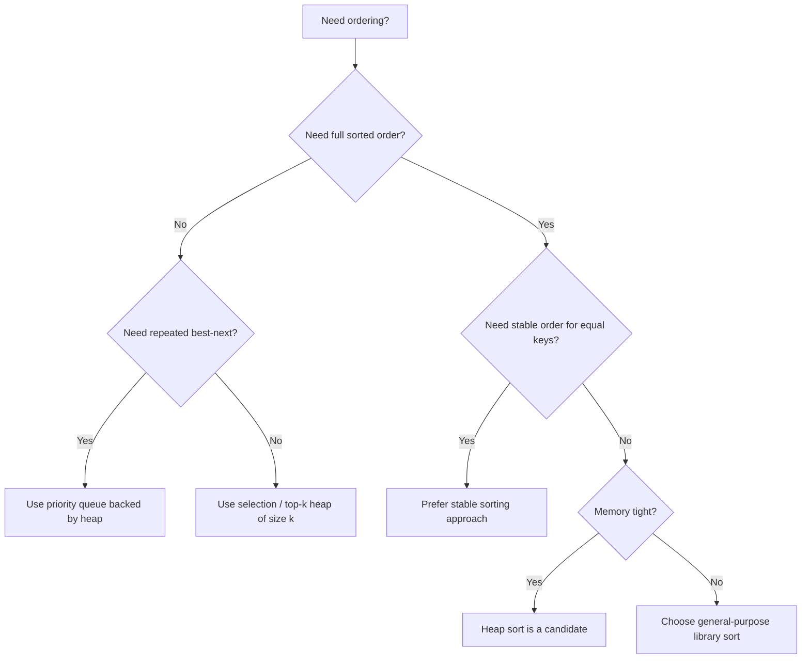

# 🎯 WEEK 3 DAY 3: HEAP SORT AND PRIORITY QUEUES — COMPLETE GUIDE

**Category:** Foundations III — Sorting & Hashing  
**Difficulty:** 🟡 Medium (Foundations with deep systems impact)  
**Prerequisites:**  
- Understanding of arrays as contiguous memory  
- Big-O and basic recurrence intuition  
- Week 3 Day 1 (elementary sorting) and Week 3 Day 2 (merge sort and quick sort) concepts  
**Interview Frequency:** 80% (priority queues and heap mechanics show up extremely often; heap sort appears moderately often but its heap mechanics are foundational)  
**Real-World Impact:** Priority queues built on binary heaps power scheduling, shortest path routing, event simulation, and streaming “top-k” analytics in production systems.

***

## 🎓 LEARNING OBJECTIVES

By the end of this topic, you will be able to:

- ✅ Understand the **binary heap** as a complete binary tree stored inside an array  
- ✅ Explain the **heap property** (minimum-heap and maximum-heap) using invariants  
- ✅ Mechanically simulate **insert**, **remove-minimum / remove-maximum**, and **heapify** operations  
- ✅ Understand why **building a heap is O(n)** (not O(n log n))  
- ✅ Understand **heap sort** and why it is **in-place**, **O(n log n)**, and **not stable**  
- ✅ Recognize where **priority queues** appear in real systems (scheduling, routing, event loops, compression)

Optional mapping (objectives → where to focus):

| 🎯 Objective | Best Section(s) |
|---|---|
| Heap mental model + invariants | Section 2 |
| Heap operations step-by-step | Section 3 |
| Build-heap and heap sort tracing | Section 4 |
| Complexity and trade-offs | Section 5 |
| Real systems that use priority queues | Section 6 |
| When to choose heap sort / priority queue | Section 9 |

***

## 🤔 SECTION 1: THE WHY — Engineering Motivation

### 🎯 Real-World Problems This Solves

**Problem 1: “Always process the most urgent thing next”**
- 🌍 Where: operating system scheduling, job queues, distributed task runners
- 💼 Why it matters: responsiveness and fairness depend on quickly selecting the highest-priority job among thousands or millions
- 🏭 Example system: container scheduling systems that decide which workload to schedule next based on priority and resource constraints

**Problem 2: “Find the next soonest event”**
- 🌍 Where: timer management, simulation systems, game servers, network retransmission timers
- 💼 Why it matters: systems must handle many future events and always pop the earliest timestamp efficiently
- 🏭 Example system: event-driven servers managing large sets of time-based callbacks (the earliest timer must fire next)

**Problem 3: “Find top-k items continuously”**
- 🌍 Where: search ranking, recommendations, monitoring alerts, finance dashboards
- 💼 Why it matters: you want the top 10 or top 100 items without sorting everything repeatedly
- 🏭 Example system: streaming analytics pipeline maintaining the top-k “most expensive” or “highest latency” records per minute

### ⚖ Design Problem & Trade-offs

The design problem is:

**How can a system repeatedly find the minimum or maximum element quickly, while still supporting frequent insertions and removals?**

A priority queue is the abstraction:
- Insert(item, priority)
- Remove-highest-priority (or remove-lowest-priority)
- Peek-highest-priority (or peek-lowest-priority)

A binary heap is the most common implementation because it balances:
- Fast inserts and deletes: O(log n)
- Fast peek: O(1)
- Compact storage: array-backed, cache-friendly compared to pointer-heavy trees

Heap sort is a sorting algorithm that:
- Uses the heap property to repeatedly select the next extreme (maximum or minimum)
- Achieves O(n log n) worst-case time
- Works in-place (no extra array needed beyond constant overhead)
- Is not stable (equal keys may reorder)

### 💼 Interview Relevance

Heap concepts show up in interviews as:
- “Top k frequent elements”
- “Find median from data stream”
- “Merge k sorted lists”
- “Kth largest element”
- “Schedule tasks by priority”
- “Shortest path / minimum cost expansions” (priority queue behavior)

Interviewers usually test:
- Mechanical understanding (bubble up / bubble down)
- Invariants (shape + heap property)
- Complexity reasoning (why build-heap is O(n))
- Choosing data structures (priority queue versus sorting versus balanced tree)

***

## 📌 SECTION 2: THE WHAT — Mental Model & Core Concepts

### 🧠 Core Analogy

**Binary heap as a “mountain slope” of priorities:**
- The root is the “peak” of importance (for a maximum-heap) or the “deepest valley” (for a minimum-heap).
- When a new element arrives, it starts at the bottom and “climbs up” if it is more important than its parent.
- When the root is removed, the last element is moved to the top and “slides down” until the slope property is restored.

### 🖼 Visual Representation

#### 1) Binary heap as a complete binary tree

Example maximum-heap (parent is always greater than or equal to children):

```text
            90
          /    \
        70      80
       / \     / \
     40  60  50  30

Legend:
- Parent node value >= each child node value  (maximum-heap property)
- Tree is complete: filled level by level, left to right
```

#### 2) Same heap stored in an array (implicit tree)

```text
Index:  0   1   2   3   4   5   6
Value: [90, 70, 80, 40, 60, 50, 30]

Child/parent mapping (0-indexed array):
- Parent(i)      = (i - 1) / 2   (integer division)
- LeftChild(i)   = 2*i + 1
- RightChild(i)  = 2*i + 2
```

ASCII mapping:

```text
Array indices:
              (0)
             90
           /    \
        (1)      (2)
        70       80
       /  \     /  \
    (3)  (4) (5)  (6)
    40   60  50   30
```

### 🔑 Core Invariants

A **binary heap** has two independent invariants.

1) **Shape invariant (completeness)**
- The tree is complete: every level is filled except possibly the last
- The last level is filled from left to right
- This is why it can be stored compactly in an array

2) **Heap property invariant**
- **Minimum-heap:** parent value <= child value  
- **Maximum-heap:** parent value >= child value

Important: the heap property does **not** mean the array is sorted.
- Only local ordering (parent-child) is guaranteed.
- Siblings are not ordered.
- The left subtree is not necessarily all smaller than the right subtree.

### 📋 Core Concepts & Variations (List All)

1) **Binary heap (array-backed implicit tree)**
- What it is: complete binary tree stored in array
- When used: default choice for priority queue
- Complexity: insert O(log n), remove-root O(log n), peek-root O(1)

2) **Minimum-heap**
- Root is smallest element
- Used for “next smallest / earliest deadline / shortest distance first”

3) **Maximum-heap**
- Root is largest element
- Used for “top scores / highest priority / largest value first”

4) **Insert operation (bubble up / sift up)**
- Place element at end (preserve completeness)
- Swap upwards until heap property holds

5) **Remove-root operation (bubble down / sift down)**
- Replace root with last element (preserve completeness)
- Swap downwards until heap property holds

6) **Heapify-down operation**
- The primitive used inside remove-root and build-heap

7) **Heapify-up operation**
- The primitive used inside insert

8) **Build-heap (bottom-up heap construction)**
- Convert an arbitrary array into a heap in O(n)
- Heapify-down from last parent to root

9) **Heap sort**
- Build a maximum-heap
- Repeatedly swap root with last element and shrink heap
- Time O(n log n), space O(1) extra, not stable

10) **Priority queue abstraction**
- A container supporting:
  - Insert(element, priority)
  - Peek-highest-priority or peek-lowest-priority
  - Remove-highest-priority or remove-lowest-priority

#### 📊 Concept Summary Table

| # | 🧩 Concept / Variation | ✏️ Brief Description | ⏱ Time (Key Ops) | 💾 Space (Key) |
|---|---|---|---|---|
| 1 | Binary heap | Implicit complete tree stored in array | Insert O(log n), Remove-root O(log n), Peek O(1) | O(n) |
| 2 | Minimum-heap | Root is minimum | Same as heap | O(n) |
| 3 | Maximum-heap | Root is maximum | Same as heap | O(n) |
| 4 | Bubble up | Restore heap after insert | O(log n) | O(1) |
| 5 | Bubble down | Restore heap after remove-root | O(log n) | O(1) |
| 6 | Build-heap (bottom-up) | Convert array to heap efficiently | O(n) | O(1) extra |
| 7 | Heap sort | Sort using maximum-heap selection | O(n log n) | O(1) extra |
| 8 | Priority queue | Always remove “best” next | Depends on backing structure | Depends |

***

## ⚙ SECTION 3: THE HOW — Mechanical Walkthrough

### 🧱 State / Data Structure

The heap state is:
- `array` holding elements
- `heapSize` indicating the active heap region (important for heap sort)
- “heap order” rule: minimum-heap or maximum-heap

Key index math (0-indexed):
- Parent index = (childIndex - 1) / 2
- Left child index = 2 * parentIndex + 1
- Right child index = 2 * parentIndex + 2

### 🔧 Operation 1: Insert into a Heap (Bubble Up)

```text
Operation: Insert(element)
Input: element
Output: heap updated with element inserted

Step 1: Put element at end of array (index = heapSize)
Step 2: Increase heapSize by 1
Step 3: While element violates heap property with its parent:
  - Swap element with parent
  - Move upward to parent's index
Result: heap property restored
```

**Why this works:**  
Only the path from the inserted node to the root can violate the heap property. Everything else remains valid.

- Time: O(log n) (height of heap)
- Space: O(1)

### 🔧 Operation 2: Remove Root (Remove-Minimum / Remove-Maximum)

```text
Operation: RemoveRoot()
Input: heap
Output: removed root element + heap updated

Step 1: Save root value (this is the min or max)
Step 2: Move last element in the heap to the root position
Step 3: Decrease heapSize by 1
Step 4: Bubble down:
  - Compare the moved element with its children
  - Swap with the “better child” (smaller for minimum-heap, larger for maximum-heap)
  - Continue until heap property holds
Result: heap property restored, root removed
```

- Time: O(log n)
- Space: O(1)

### 🔧 Operation 3: Heapify Down (Bubble Down Primitive)

```text
Operation: HeapifyDown(index)
Input: starting index where heap property may be violated
Output: heap property restored in subtree rooted at index

Step 1: Let current = index
Step 2: While current has at least one child:
  - choose candidate child:
      for maximum-heap: child with larger value
      for minimum-heap: child with smaller value
  - if heap property holds with candidate child: stop
  - else swap current with candidate child
  - set current = candidate child index
Result: heap fixed on that path
```

### 🔧 Operation 4: Build-Heap (Bottom-Up)

```text
Operation: BuildHeap(array)
Input: arbitrary array
Output: same array rearranged into a heap

Step 1: Identify last parent index:
  lastParent = (n - 2) / 2
Step 2: For i from lastParent down to 0:
  HeapifyDown(i)
Result: entire array becomes a valid heap
```

Why start from last parent?
- Leaves are already heaps of size 1.
- Fixing parents bottom-up ensures each subtree is a heap before higher levels depend on it.

### 🔧 Operation 5: Heap Sort (Ascending Using Maximum-Heap)

```text
Operation: HeapSort(array)
Input: array of n elements
Output: array sorted ascending

Step 1: Build a maximum-heap over the array (heapSize = n)
Step 2: Repeat until heapSize == 1:
  - Swap array[0] (max) with array[heapSize - 1] (end)
  - Reduce heapSize by 1 (max is now locked in final position)
  - HeapifyDown(0) to restore maximum-heap in remaining region
Result: array sorted ascending
```

### 💾 Memory Behavior

- Binary heap stored in an array has strong locality:
  - Parent and children are close in memory
  - Heap operations touch O(log n) nodes, often within cache
- Heap sort is in-place:
  - no auxiliary array
  - only swaps inside the original array
- Priority queue operations are branch-heavy:
  - repeated comparisons
  - branch prediction cost can matter in tight loops

### 🛡 Edge Cases

| Edge Case | What Should Happen |
|---|---|
| Empty heap | Remove-root should be rejected or handled gracefully |
| Heap with one element | Remove-root returns that element, heap becomes empty |
| Many equal priorities | Heap property allows equal; order among equals is not preserved |
| Wrong heap type | Using minimum-heap logic inside maximum-heap breaks correctness |
| Heap sort with duplicates | Correct sorting but not stable |

***

## 🎨 SECTION 4: VISUALIZATION — Simulation & Examples

### 🧊 Example 1: Build a Maximum-Heap from an Array (Bottom-Up)

**Input array:** `[3, 1, 6, 5, 2, 4]`

Index view:

```text
Index:  0  1  2  3  4  5
Value: [3, 1, 6, 5, 2, 4]
```

Tree view:

```text
          3
        /   \
       1     6
      / \   /
     5  2  4
```

Compute last parent:
- n = 6
- lastParent = (6 - 2) / 2 = 2

So heapify-down in order: 2, 1, 0

Trace table:

| ⏱ Step | 📥 Action | 📦 Array State | 📝 Notes |
|---|---|---|---|
| 0 | Start | [1][2][3][4][5][6] | Not a heap |
| 1 | HeapifyDown(2) | [1][2][3][4][5][6] | Node 6 has child 4; already satisfies maximum-heap |
| 2 | HeapifyDown(1) | [1][4][3][2][5][6] | Node 1 swaps with child 5 |
| 3 | HeapifyDown(0) | [3][4][6][2][5][1] | Node 3 swaps with 6, then 3 swaps with 4 |

Final maximum-heap:

```text
          6
        /   \
       5     4
      / \   /
     1  2  3
```

### 📈 Example 2: Heap Sort (Ascending) on[1][4][6][2]

**Input:** `[4, 10, 3, 5, 1]`

Step 1: Build maximum-heap:

```text
After build-heap (one valid result):
[10, 5, 3, 4, 1]
```

Now repeatedly swap root with end and reduce heap size.

Trace table:

| ⏱ Step | 📥 Action | 📦 Heap Region | 🔒 Sorted Tail Region |
|---|---|---|---|
| 0 | Start | [4][1][6][2] | [] |
| 1 | Swap root with last | [2][4][1][6] |  |
| 2 | HeapifyDown(0) | [4][6][1][2] |  |
| 3 | Swap root with last | [2][6][1] | [4] |
| 4 | HeapifyDown(0) | [6][2][1] | [4] |
| 5 | Swap root with last | [1][2] | [6][4] |
| 6 | HeapifyDown(0) | [1][2] | [6][4] |
| 7 | Swap root with last | [2] | [1][6][4] |

Final sorted array: `[1, 3, 4, 5, 10]`

**Visual intuition:** the sorted region grows from the end, one maximum at a time.

### 🔥 Example 3: Priority Queue for Task Scheduling (Minimum-Heap by Deadline)

Scenario: tasks have deadlines; you always want the earliest deadline next.

Tasks:
- Task A deadline 12
- Task B deadline 3
- Task C deadline 7
- Task D deadline 1

Insert tasks into a minimum-heap keyed by deadline.

One possible heap array after inserts:

```text
Index:  0        1        2        3
Value: [D(1),  B(3),   C(7),   A(12)]

Meaning:
- Peek gives D(1)
- Remove-root gives D(1), then next is B(3), then C(7), then A(12)
```

Remove-root sequence:

| Pop Order | Removed Task | Next Peek |
|---|---|---|
| 1 | D(1) | B(3) |
| 2 | B(3) | C(7) |
| 3 | C(7) | A(12) |
| 4 | A(12) | (empty) |

### ❌ Counter-Example: Treating a Sorted Array as a Priority Queue

A common incorrect approach:
- Keep tasks in a sorted array by priority.
- Then remove from the front.

Why it fails operationally:
- Insert requires shifting elements: O(n)
- Remove-front also shifts: O(n)
- Under frequent inserts and removals, performance collapses.

Comparison:

| Data Structure | Insert | Remove-minimum | Best Use Case |
|---|---:|---:|---|
| Sorted array | O(n) | O(1) (if remove from end) or O(n) (if remove from front) | Mostly static data |
| Unsorted array | O(1) | O(n) | Very few removals |
| Binary heap | O(log n) | O(log n) | Frequent inserts + frequent removes |

***

## 📊 SECTION 5: CRITICAL ANALYSIS — Performance & Robustness

### 📈 Complexity Table

| 📌 Operation / Variant | 🟢 Best ⏱ | 🟡 Avg ⏱ | 🔴 Worst ⏱ | 💾 Space | 📝 Notes |
|---|---:|---:|---:|---:|---|
| Peek root (min or max) | O(1) | O(1) | O(1) | O(1) | Root always available |
| Insert (bubble up) | O(1) | O(log n) | O(log n) | O(1) | Best case: new element is not better than parent |
| Remove root (bubble down) | O(1) | O(log n) | O(log n) | O(1) | Best case: last element already fits at root |
| Build-heap bottom-up | O(n) | O(n) | O(n) | O(1) extra | Surprising but true |
| Heap sort | O(n log n) | O(n log n) | O(n log n) | O(1) extra | In-place, not stable |
| Cache locality aspect | – | – | – | – | Array storage is cache-friendly |
| Practical throughput | – | – | – | – | Comparisons + swaps dominate; branch-heavy loops |

### 🤔 Why Big-O Might Mislead Here

1) **Heap sort and merge sort are both O(n log n), but feel different**
- Merge sort moves elements sequentially (good for locality) but uses extra memory
- Heap sort does many swaps and comparisons (branch-heavy) but is in-place
- On modern hardware, memory bandwidth and branch prediction can dominate

2) **Build-heap is O(n), not O(n log n)**
- Many people assume: “n nodes × log n heapify = O(n log n)”
- But most nodes are near leaves and require almost no work
- The total “bubble-down distance” across all nodes sums to O(n)

3) **Priority queues are more about repeated operations than full sorting**
- If you only need the top-k items, a priority queue often beats full sorting
- Sorting does extra work when you do not need full order

### ⚠ Edge Cases & Failure Modes

1) **Mixing minimum-heap and maximum-heap logic**
- ❌ Problem: bubble-down chooses smaller child in a maximum-heap
- 💥 Effect: heap property breaks silently and later pops are wrong
- ✅ Fix: define the “better child” rule explicitly for each heap type

2) **Forgetting to shrink heap size during heap sort**
- ❌ Problem: keep heapSize as n, so you re-heapify into the “sorted tail”
- 💥 Effect: sorted tail becomes unsorted
- ✅ Fix: treat array as two regions: heap region and sorted region

3) **Off-by-one errors in parent/child indices**
- ❌ Problem: wrong formulas lead to skipping child or reading out of bounds
- ✅ Fix: always check child indices < heapSize before comparing

4) **Assuming stability**
- ❌ Problem: expecting equal elements to keep original order
- 💥 Effect: multi-key sorting breaks if heap sort is used
- ✅ Fix: use stable sorting algorithms when stable behavior matters

5) **Priority inversion (systems-level pitfall)**
- The data structure can produce correct “highest priority next”
- But system policies can still cause a low-priority job to block a high-priority job (resource contention)
- Fix requires scheduling policy and resource management, not just a heap

***

## 🏭 SECTION 6: REAL SYSTEMS — Integration in Production

Below are concrete places where heaps / priority queues appear.

### 🏭 Real System: Shortest Path Routing (Network Routing Protocol Implementations)

- 🎯 Problem solved: repeatedly choose the node with smallest tentative distance next
- 🔧 Implementation: a priority queue keyed by current distance
- 📊 Impact: reduces repeated scanning from O(number of nodes²) to near O((edges + nodes) log nodes) in common implementations

### 🏭 Real System: Navigation and Pathfinding (Game Engines)

- 🎯 Problem solved: choose next most promising state to explore
- 🔧 Implementation: priority queue keyed by estimated total cost (current cost + heuristic)
- 📊 Impact: efficient real-time pathfinding for non-player characters in large maps

### 🏭 Real System: Event Simulation Engines (Discrete Event Simulation)

- 🎯 Problem solved: always process the earliest event next by timestamp
- 🔧 Implementation: minimum-heap keyed by event time
- 📊 Impact: enables large-scale simulation (traffic, queues, network simulation) with predictable performance

### 🏭 Real System: Timer Management in Event Loops

- 🎯 Problem solved: manage many timers and fire the nearest deadline next
- 🔧 Implementation: minimum-heap keyed by deadline time
- 📊 Impact: efficient timer scheduling in high-throughput servers

### 🏭 Real System: Streaming Top-k Analytics (Monitoring / Observability)

- 🎯 Problem solved: keep top-k highest latencies / largest values without sorting everything
- 🔧 Implementation: minimum-heap of size k (keep k best; evict smallest among them)
- 📊 Impact: reduces memory and time; supports near-real-time dashboards

### 🏭 Real System: Data Compression (Huffman Coding)

- 🎯 Problem solved: repeatedly combine two smallest-frequency symbols
- 🔧 Implementation: minimum-priority queue keyed by frequency
- 📊 Impact: foundational for compression formats and many encoding schemes

### 🏭 Real System: Build Systems and Job Orchestrators

- 🎯 Problem solved: pick next job based on priority and dependency readiness
- 🔧 Implementation: priority queue for ready tasks; other structures for dependency graph
- 📊 Impact: improves throughput and reduces latency for critical tasks

### 🏭 Real System: Language Runtime Libraries (Standard Priority Queue)

- 🎯 Problem solved: provide a general-purpose priority queue for application developers
- 🔧 Implementation: binary heap stored in array
- 📊 Impact: makes top-k, scheduling, merging, and shortest path tasks simpler to implement

***

## 🔗 SECTION 7: CONCEPT CROSSOVERS — Connections & Comparisons

### 📚 What It Builds On (Prerequisites)

- **Arrays and index arithmetic:** heap is an implicit tree inside an array
- **Complete binary tree concept:** shape invariant is exactly completeness
- **Comparisons and swaps:** heap operations are systematic compare-and-swap sequences
- **Divide-and-conquer intuition:** heap sort repeatedly reduces heap region (like controlled shrinking)

### 🚀 What Builds On It (Successors)

- **Graph algorithms:** shortest path and minimum spanning tree algorithms often rely on priority queues
- **Greedy algorithms:** Huffman coding and many scheduling optimizations use priority queues
- **Top-k patterns:** frequent in analytics and data processing
- **Advanced heaps:** multi-ary heaps, indexed priority queues, Fibonacci heaps (theoretical)

### 🔄 Comparison with Alternatives

| 📌 Concept / Alternative | ⏱ Time (Key Op) | 💾 Space | ✅ Best For | 🔀 vs Heap / Priority Queue |
|---|---:|---:|---|---|
| Binary heap priority queue | Insert O(log n), Remove-root O(log n), Peek O(1) | O(n) | general-purpose “best next” | balanced operations |
| Balanced binary search tree | Insert O(log n), Delete O(log n), Min/Max O(log n) | O(n) | need ordered iteration + removals | supports full ordered traversal |
| Unsorted array as priority queue | Insert O(1), Remove-min O(n) | O(n) | many inserts, few removals | removal is expensive |
| Sorted array as priority queue | Insert O(n), Remove-min O(1) | O(n) | few inserts, many queries | insert is expensive |
| Bucket queue | Insert O(1), Remove-min O(1) amortized | O(range) | integer priorities in small range | requires bounded priorities |

***

## 📐 SECTION 8: MATHEMATICAL & THEORETICAL PERSPECTIVE

### 📋 Formal Definition

A **binary heap** is:
- a complete binary tree
- with the heap property:
  - minimum-heap: each parent <= its children
  - maximum-heap: each parent >= its children

Stored in an array such that:
- parent(i) = (i - 1) / 2
- leftChild(i) = 2*i + 1
- rightChild(i) = 2*i + 2

### 📐 Key Property: Why Build-Heap is O(n)

**Property:** Building a heap bottom-up is O(n).

**Proof sketch (intuitive):**
- Heapify-down cost is proportional to “how far an element can fall”
- Elements near the bottom can fall very little (0 or 1 levels)
- Only a few elements near the top can fall many levels
- When you add up “maximum fall distance” across all nodes, the total is O(n)

A useful mental image:

```text
Heap levels (height h):
- Level h (leaves): many nodes, cost ~0
- Level h-1: many nodes, cost ~1
- Level h-2: fewer nodes, cost ~2
...
- Root level: 1 node, cost ~h

Total work looks like:
(n/2)*1 + (n/4)*2 + (n/8)*3 + ...  <  2n
So O(n)
```

This is why heaps can be built faster than “insert n elements one by one”.

***

## 💡 SECTION 9: ALGORITHMIC DESIGN INTUITION

### 🎯 Decision Framework

**When to use a priority queue (heap-backed):**
- You repeatedly need “best next” (minimum or maximum) while data changes
- You need top-k from a stream
- You need efficient merges of choices where you only need the next best item, not full sorting

**When to use heap sort:**
- You need guaranteed O(n log n) worst-case sorting
- You want in-place sorting and can accept instability
- You cannot afford extra memory for merge sort

**When NOT to use heap sort:**
- Stability is required (multi-key sorts)
- You want best practical speed for general sorting in application code (many libraries use hybrid sorts)
- You only need top-k (priority queue is better)

Decision flow:



### 🔍 Interview Pattern Recognition

🔴 **Red flags (obvious signals):**
- “Top k”
- “Kth largest / smallest”
- “Merge k sorted lists”
- “Always choose next smallest distance / next earliest time”
- “Schedule tasks by priority”

🔵 **Blue flags (subtle clues):**
- “Streaming input; cannot store everything sorted”
- “Need incremental results; not all at once”
- “Many inserts and removals interleaved”
- “Need fast peek of min or max”

***

## ❓ SECTION 10: KNOWLEDGE CHECK — Socratic Reasoning

1) Why does a heap not guarantee that the left subtree is entirely smaller than the right subtree (or vice versa)?  
2) In heap sort, why does the sorted region grow at the end of the array?  
3) What are the two independent invariants of a binary heap, and what breaks if either is violated?  
4) Why is build-heap bottom-up O(n), but inserting n elements one by one is O(n log n)?  
5) Why is heap sort not stable? What would stability even mean for equal keys?  
6) If you only need the largest 100 elements from 10 million elements, why is sorting the entire array wasteful?  
7) What is the difference between “priority queue” (abstraction) and “heap” (implementation)?  
8) What happens if you remove the root but forget to bubble down? How would the next peek be wrong?  

**No answers provided.**

***

## 🎯 SECTION 11: RETENTION HOOK — Memory Anchors

### 💎 One-Liner Essence

> **“A heap is a complete tree stored in an array that keeps the best element at the root; heap sort repeatedly moves that root into its final position.”**

### 🧠 Mnemonic Device

**H.E.A.P.**
- **H**: Head (root) is always best
- **E**: Embedded in an array (implicit tree)
- **A**: Always complete (shape invariant)
- **P**: Parent-child order (heap property)

### 🖼 Visual Cue

```text
Priority queue feeling:

      BEST
       |
    [ root ]
     /   \
   ok     ok
  / \     / \
 ok ok   ok ok

Not sorted. Just “best is easy to grab”.
```

### 💼 Real Interview Story

A candidate is asked: “Design a system that receives millions of latency measurements per minute and must always show the top 100 worst latencies.”

A correct direction:
- Use a **minimum-heap of size 100**
- Keep the 100 worst values seen so far
- If a new value is worse than the heap’s minimum, replace it and bubble down/up
This avoids sorting millions of values and keeps updates efficient.

***

## 🧩 5 COGNITIVE LENSES

### 🖥 Computational Lens
Array-backed heaps are cache-friendly because parent and children indices are close in memory. Heap operations touch O(log n) elements, but they involve repeated comparisons and conditional branches. Performance is often dominated by branch prediction and memory writes from swaps.

### 🧠 Psychological Lens
Heaps confuse people because “tree” suggests pointer structure, but the heap is primarily an array trick. The second trap is thinking heaps are “nearly sorted arrays” — they are not. Only parent-child relations are ordered.

### 🔄 Design Trade-off Lens
Heaps balance dynamic operations (insert and remove-root) with logarithmic cost. This makes them ideal for priority queues. Heap sort gives worst-case O(n log n) and in-place sorting, but it sacrifices stability and often loses in practical speed to well-engineered hybrid sorts.

### 🤖 AI/ML Analogy Lens
A priority queue is like a “beam” of candidate states: always expand the currently best-scoring candidate next. Many search strategies and ranking pipelines behave like this: keep a set of candidates, repeatedly pop the best, push new candidates.

### 📚 Historical Context Lens
Binary heaps were introduced to support heap sort (1960s era). The priority queue abstraction became central as scheduling and graph problems became mainstream. Modern systems still choose binary heaps because they are simple and fast in practice, even if more complex heaps have better theoretical bounds.

***

## ⚔ SUPPLEMENTARY OUTCOMES

### ⚔ Practice Problems (10)

1) **⚔ Kth Largest Element in an Array** (Source: LeetCode #215 — Difficulty: 🟡)  
   - 🎯 Concepts: maximum-heap, minimum-heap of size k  
   - 📌 Constraints: large n; avoid full sorting

2) **⚔ Top K Frequent Elements** (Source: LeetCode #347 — Difficulty: 🟡)  
   - 🎯 Concepts: priority queue, frequency counting  
   - 📌 Constraints: output size k

3) **⚔ Find Median from Data Stream** (Source: LeetCode #295 — Difficulty: 🔴)  
   - 🎯 Concepts: two heaps (maximum-heap + minimum-heap) balancing  
   - 📌 Constraints: stream updates and median query

4) **⚔ Merge k Sorted Lists** (Source: LeetCode #23 — Difficulty: 🔴)  
   - 🎯 Concepts: minimum-heap k-way merge  
   - 📌 Constraints: total nodes large

5) **⚔ Sliding Window Maximum** (Source: LeetCode #239 — Difficulty: 🔴)  
   - 🎯 Concepts: heap with lazy deletion or alternative monotonic queue  
   - 📌 Constraints: large windows

6) **⚔ Last Stone Weight** (Source: LeetCode #1046 — Difficulty: 🟢)  
   - 🎯 Concepts: maximum-heap  
   - 📌 Constraints: repeated remove-maximum

7) **⚔ K Closest Points to Origin** (Source: LeetCode #973 — Difficulty: 🟡)  
   - 🎯 Concepts: maximum-heap of size k  
   - 📌 Constraints: large number of points

8) **⚔ Task Scheduler** (Source: LeetCode #621 — Difficulty: 🟡)  
   - 🎯 Concepts: maximum-heap scheduling by remaining frequency  
   - 📌 Constraints: cooldown behavior

9) **⚔ IPO** (Source: LeetCode #502 — Difficulty: 🔴)  
   - 🎯 Concepts: two heaps, greedy selection  
   - 📌 Constraints: pick up to k projects

10) **⚔ Sort Characters By Frequency** (Source: LeetCode #451 — Difficulty: 🟡)  
   - 🎯 Concepts: heap ordered by frequency  
   - 📌 Constraints: string length large

*(No solutions provided.)*

### 🎙 Interview Questions (8+)

**Q1:** Explain the two invariants of a binary heap and how an array represents the tree.  
- 🔀 Follow-up 1: What breaks if the shape invariant is violated?  
- 🔀 Follow-up 2: What breaks if the heap property is violated?

**Q2:** Walk through inserting an element into a heap.  
- 🔀 Follow-up 1: Why is the path length bounded by O(log n)?  
- 🔀 Follow-up 2: What is the best case and why?

**Q3:** Walk through removing the root from a heap.  
- 🔀 Follow-up 1: Why do we move the last element to the root first?  
- 🔀 Follow-up 2: Why do we bubble down instead of bubble up?

**Q4:** Explain why build-heap bottom-up is O(n).  
- 🔀 Follow-up 1: Why is inserting n elements one-by-one O(n log n)?  
- 🔀 Follow-up 2: Give an intuition using levels.

**Q5:** Compare heap sort with merge sort and quick sort.  
- 🔀 Follow-up 1: Which are stable and which are not?  
- 🔀 Follow-up 2: Which need extra memory?

**Q6:** Design a system to maintain the top 100 values from a stream.  
- 🔀 Follow-up 1: What data structure do you use and why?  
- 🔀 Follow-up 2: What is the time cost per new value?

**Q7:** Why are priority queues useful in shortest path algorithms?  
- 🔀 Follow-up 1: What happens if you use a normal queue for weighted edges?  
- 🔀 Follow-up 2: What does “extract next smallest distance” mean mechanically?

**Q8:** Explain why heap sort is not stable.  
- 🔀 Follow-up 1: Give a situation where stability matters.  
- 🔀 Follow-up 2: How would you preserve stability if required?

*(No answers provided.)*

### ⚠ Common Misconceptions (5)

1) ❌ **Misconception:** “A heap is a sorted array.”  
- 🧠 Why it seems plausible: the root is always the best element.  
- ✅ Reality: only parent-child ordering exists; siblings and subtrees are not globally sorted.  
- 💡 Memory aid: “Heap = local order, not global order.”  
- 💥 Impact: wrong assumptions when searching inside the heap.

2) ❌ **Misconception:** “Heap sort is stable because it compares values carefully.”  
- 🧠 Why it seems plausible: sorting feels like it should preserve equals.  
- ✅ Reality: swaps move equal elements across the array; order among equals can change.  
- 💡 Memory aid: “Heap sort swaps far apart, stability dies.”  
- 💥 Impact: multi-key sorting breaks.

3) ❌ **Misconception:** “Build-heap is O(n log n).”  
- 🧠 Why it seems plausible: heapify is O(log n), repeated many times.  
- ✅ Reality: most heapify operations are near leaves and cost almost nothing; total is O(n).  
- 💡 Memory aid: “Many cheap fixes near bottom, few expensive fixes near top.”  
- 💥 Impact: incorrect performance reasoning and wrong algorithm choice.

4) ❌ **Misconception:** “In-place means O(1) total space always.”  
- 🧠 Why it seems plausible: no extra arrays are allocated.  
- ✅ Reality: recursion-based heapify could use stack space; iterative versions avoid it. Heap sort can be O(1) extra if iterative.  
- 💡 Memory aid: “No extra array ≠ no extra memory.”  
- 💥 Impact: stack overflow risk in constrained environments.

5) ❌ **Misconception:** “Priority queue is the same thing as a heap.”  
- 🧠 Why it seems plausible: people implement priority queues using heaps most often.  
- ✅ Reality: priority queue is an abstract behavior; heaps are one implementation.  
- 💡 Memory aid: “Priority queue is what; heap is how.”  
- 💥 Impact: inability to choose better implementations when constraints change.

### 🚀 Advanced Concepts (5)

1) 📈 **Multi-ary heap (d-ary heap)**  
- 🎓 Prerequisite: binary heap mechanics  
- 🔗 Relation: each node has d children instead of 2  
- 💼 Use when: reduce heap height (fewer levels), potentially fewer comparisons in some workloads

2) 📈 **Indexed priority queue (supports decrease-key efficiently)**  
- 🎓 Prerequisite: heap + position tracking  
- 🔗 Relation: stores an index map from element to its heap position  
- 💼 Use when: shortest path algorithms where priorities update frequently

3) 📈 **Binomial heap (mergeable heap)**  
- 🎓 Prerequisite: tree-based heap structures  
- 🔗 Relation: supports merging heaps more efficiently than binary heap  
- 💼 Use when: frequent heap merges matter

4) 📈 **Fibonacci heap (amortized improvements)**  
- 🎓 Prerequisite: amortized analysis  
- 🔗 Relation: improves theoretical bounds for decrease-key and merge  
- 💼 Use when: many decrease-key operations (theoretical interest; complex in practice)

5) 📈 **Tournament tree and selection algorithms**  
- 🎓 Prerequisite: comparison trees  
- 🔗 Relation: alternative way to track winners and second-best  
- 💼 Use when: repeated selection and tracking near-best candidates

### 🔗 External Resources (5)

1) **Binary Heap — Wikipedia**  
- 📖 Type: Reference  
- 👤 Author / Source: Wikipedia contributors  
- 🎯 Why useful: clear definition of shape and heap property; typical operations overview  
- 🎚 Difficulty: Beginner to Intermediate  
- 🔗 Link / Reference: https://en.wikipedia.org/wiki/Binary_heap

2) **Heap Sort — GeeksforGeeks**  
- 📖 Type: Tutorial  
- 👤 Author / Source: GeeksforGeeks  
- 🎯 Why useful: step-by-step explanation and complexity discussion  
- 🎚 Difficulty: Beginner  
- 🔗 Link / Reference: https://www.geeksforgeeks.org/heap-sort/

3) **Binary Heap — GeeksforGeeks**  
- 📖 Type: Tutorial  
- 👤 Author / Source: GeeksforGeeks  
- 🎯 Why useful: array index formulas and heap operations overview  
- 🎚 Difficulty: Beginner  
- 🔗 Link / Reference: https://www.geeksforgeeks.org/binary-heap/

4) **Algorithms (Princeton) — Priority Queues**  
- 📖 Type: Course notes  
- 👤 Author / Source: Princeton University (Sedgewick / Wayne materials)  
- 🎯 Why useful: strong mental model, typical interview patterns, deeper analysis  
- 🎚 Difficulty: Intermediate  
- 🔗 Link / Reference: https://algs4.cs.princeton.edu/

5) **Introduction to Algorithms (CLRS) — Heaps and Heap Sort**  
- 📖 Type: Textbook  
- 👤 Author / Source: Cormen, Leiserson, Rivest, Stein  
- 🎯 Why useful: canonical correctness and complexity proofs, including build-heap O(n) proof  
- 🎚 Difficulty: Intermediate to Advanced  
- 🔗 Link / Reference: https://mitpress.mit.edu/9780262046305/introduction-to-algorithms/

***