# 📊 WEEK 03 VISUAL CONCEPTS PLAYBOOK (HYBRID)

> 🧭 **Navigation:** [🏠 Week Overview](README.md) • [📘 Curriculum Syllabus](../COMPLETE_SYLLABUS_v13.md)
> 
> 💡 **Instructor Note:** *This Visual Playbook provides a high-density, integrated synthesis. Not all sections are mandatory; use it as a modular reference to solidify invariants and review pattern transitions.*

---

**Week:** 3 | **Tier:** Foundations III – Sorting, Heaps, Hashing  
**Theme:** Elementary Sorts, Merge/Quick Sort, Heaps, Hash Tables, String Hashing  
**Format:** Hybrid (Enhanced ASCII + Web Resource Links + Reference Tools)  
**Purpose:** Visual-first concept explanation with embedded professional resources

---

## 🎨 VISUAL LEGEND & RESOURCE GUIDE

### Symbol Reference
| Symbol | Meaning |
|--------|---------|
| `i` / `j` | Index pointers (array position) |
| `[]` | Array element or cell |
| `█` | Sorted element |
| `░` | Unsorted element |
| `▶` | Direction of movement |
| `⇄` | Swap operation |
| `✓` | Valid state |
| `✗` | Invalid state |
| 🔗 | Link to interactive visualization |

### Professional Visualization Resources

| Tool | Resource | Best For |
|------|----------|----------|
| **VisuAlgo** | https://visualgo.net/en/sorting | Sorting algorithm animations |
| **Sorting Visualizer** | https://www.toptal.com/developers/sorting-visualizer | Side-by-side sort comparison |
| **Heap Visualizer** | https://www.cs.usfca.edu/~galles/visualization/Heap.html | Heap operations step-by-step |
| **GeeksforGeeks Sorting** | https://www.geeksforgeeks.org/sorting-algorithms/ | Comprehensive sorting guide |
| **GeeksforGeeks Heaps** | https://www.geeksforgeeks.org/heap-data-structure/ | Heap operations and problems |
| **GeeksforGeeks Hashing** | https://www.geeksforgeeks.org/hashing-data-structure/ | Hash tables and functions |

---

## 📅 DAY 1: ELEMENTARY SORTS

### Pattern Map: Elementary Sorts Family Tree


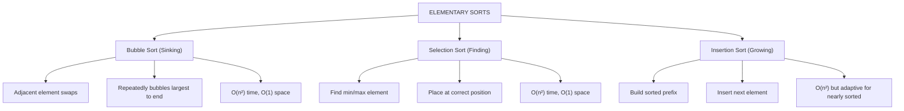


---

### Pattern 1.1: Bubble Sort - Adjacent Comparisons

**Interactive Resource:** 🔗 [VisuAlgo Sorting Visualization](https://visualgo.net/en/sorting)

#### Visual 1: Pass-by-Pass Evolution


| 5 | 2 | 8 | 1 | 9 |
| :--- | :--- | :--- | :--- | :--- |
| 2 | 5 | 8 | 1 | 9 |
| 2 | 5 | 8 | 1 | 9 |
| 2 | 5 | 1 | 8 | 9 |
| [unsorted] | [k largest sorted] |  |  |  |


---

### Pattern 1.2: Selection Sort - Find and Place

#### Visual 1: Selection Process


| [1, | 2, 8, 5, 9 | ] |
| :--- | :--- | :--- |
| [1, 2, | 8, 5, 9 | ] |
|  |  |  |


---

### Pattern 1.3: Insertion Sort - Growing Sorted Prefix

#### Visual 1: Insert into Sorted Prefix


| Before: [ | 5 | 2  8  1  9] |
| :--- | :--- | :--- |
| [ | 2, 5 | 8  1  9] |
| Before: [ | 2, 5 | 8  1  9] |
| [ | 2, 5, 8 | 1  9] |
| Before: [ | 2, 5, 8 | 1  9] |
| [ | 1, 2, 5, 8 | 9] |
| Before: [ | 1, 2, 5, 8 | 9] |
| [ | 1, 2, 5, 8, 9 | ] |


---

### Common Failure Modes (Day 1)

#### Failure 1: Comparing Already Sorted Elements

```
❌ WRONG (Bubble Sort):
for i in range(n):
  for j in range(n-1):    ← Rechecks sorted elements!
    if arr[j] > arr[j+1]:
      swap

Result: Unnecessarily compares already-sorted portion

✓ CORRECT:
for i in range(n):
  for j in range(n-1-i):  ← Exclude sorted suffix
    if arr[j] > arr[j+1]:
      swap

Result: Each pass ignores already-placed elements
```

#### Failure 2: Off-by-One in Insertion Sort

```
❌ WRONG:
for i in range(n):
  key = arr[i]
  j = i - 1
  while j >= 0 and arr[j] > key:
    arr[j+1] = arr[j]
    j--
  arr[j+1] = key  ← May write beyond if j=-1

❌ Issue: When j becomes -1, arr[0] = key still works
         But is susceptible to boundary bugs

✓ CORRECT (same logic, clearer):
for i in range(1, n):  ← Start from index 1
  key = arr[i]
  j = i - 1
  while j >= 0 and arr[j] > key:
    arr[j+1] = arr[j]
    j--
  arr[j+1] = key  ← j+1 always in range [0, i]
```

---

### Mini Review Quiz (Day 1)

**Q1:** Why is Insertion Sort adaptive but Bubble Sort is not?

```
A) Bubble Sort is faster on nearly sorted arrays
B) Insertion Sort stops early if array is sorted
C) Bubble Sort doesn't compare neighbors
D) Insertion Sort inherently skips sorted elements
```
**✅ Answer:** B (Best case O(n) for mostly sorted, vs O(n²) for bubble)

**Q2:** Which sort is stable?

```
A) Bubble Sort only
B) All three (bubble, selection, insertion)
C) Bubble and Insertion, but not Selection
D) None are stable
```
**✅ Answer:** C (Selection breaks stability by direct placement)

**Q3:** For nearly sorted array with k inversions (k << n), which is best?

```
A) Bubble Sort O(n + k) passes
B) Selection Sort O(n²) always
C) Insertion Sort O(n + k) shifts
D) All equally bad
```
**✅ Answer:** C (Insertion adapts to inversions, others don't)

---

## ⚙️ DAY 2: MERGE SORT & QUICK SORT

### Pattern Map: Advanced Sorting Family Tree


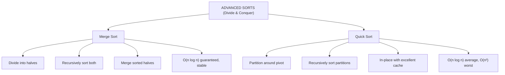


---

### Pattern 2.1: Merge Sort Tree Structure

**Interactive Resource:** 🔗 [VisuAlgo Merge Sort](https://visualgo.net/en/sorting)

#### Visual 1: Recursion Tree with Merges


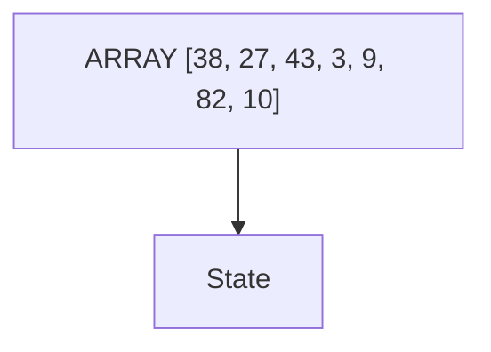


---

### Pattern 2.2: Quick Sort Partitioning

#### Visual 1: Partition Around Pivot


| 3 | 7 | 8 | 5 | 2 | 1 | 9 | 5 | 4 |
| :--- | :--- | :--- | :--- | :--- | :--- | :--- | :--- | :--- |
| [3 | 7 | 8 | 5 | 2 | 1 | 9 | 5 | 4] |
| [3 | 2 | 8 | 5 | 7 | 1 | 9 | 5 | 4] |
| [3 | 2 | 1 | 5 | 7 | 8 | 9 | 5 | 4] |
| [3 | 2 | 1 | 4 | 7 | 8 | 9 | 5 | 8] |


---

### Common Failure Modes (Day 2)

#### Failure 1: Forgetting Merge Space

```
❌ WRONG (Merge Sort claiming O(1) space):
void mergeSort(arr):
  if n <= 1: return
  mid = n/2
  mergeSort(arr[0..mid-1])
  mergeSort(arr[mid..n-1])
  merge(arr, 0, mid, n-1)  ← Where does merge temp go?

Result: No space for temporary array, corrupts data

✓ CORRECT:
void mergeSort(arr, l, r, temp):
  if l < r:
    mid = (l + r) / 2
    mergeSort(arr, l, mid, temp)
    mergeSort(arr, mid+1, r, temp)
    merge(arr, l, mid, r, temp)  ← Use temp array

Merge fills temp[], then copies back to arr[]
Result: O(n) space used properly
```

#### Failure 2: Bad Pivot Choice in Quick Sort

```
❌ WRONG:
Always choose first/last element as pivot

For already sorted array [1,2,3,4,5]:
Pivot = 5
Partition: [1,2,3,4] | [5]
Recurse left: Pivot = 4
Partition: [1,2,3] | [4]
...
Result: O(n²) degenerate behavior!

✓ CORRECT (Randomized Pivot):
Random pivot selection
Or: Median-of-three pivot
Or: Randomized quick select

Expected: O(n log n) even for sorted arrays
Probability of bad pivot decreases exponentially
```

---

## 📦 DAY 3: HEAPS, HEAPIFY & HEAP SORT

### Pattern Map: Heap Operations Family


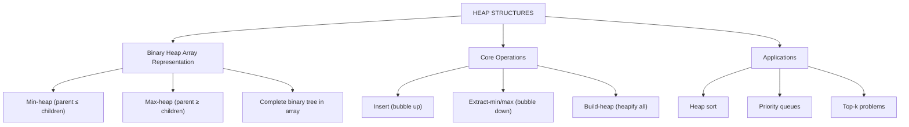


---

### Pattern 3.1: Array Representation & Parent-Child

**Interactive Resource:** 🔗 [Heap Visualizer](https://www.cs.usfca.edu/~galles/visualization/Heap.html)

#### Visual 1: Array Index Mapping


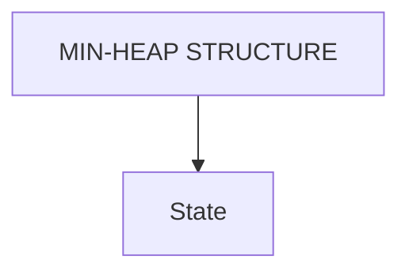


---

### Pattern 3.2: Insert Operation (Bubble Up)

#### Visual 1: Maintain Heap Property During Insert


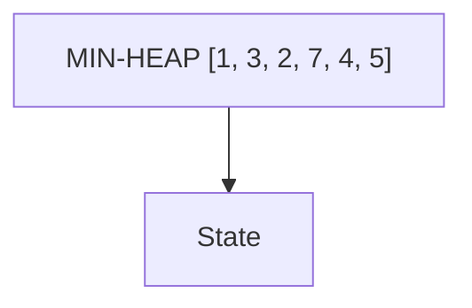


---

### Pattern 3.3: Extract-Min (Bubble Down)

#### Visual 1: Remove Root and Restore

```
MIN-HEAP: [1, 3, 2, 7, 4, 5]
EXTRACT MIN (remove root = 1):

STEP 1: Save root
min_value = arr[0] = 1  ← To return

STEP 2: Move last to root
[5, 3, 2, 7, 4, 5]  ← Move arr[5] to arr[0]
 ↑
 5 is now root (may violate heap property)

STEP 3: Bubble down (sink to correct position)

Node at index 0 (value=5):
Children:
  Left: index 1 → arr[1] = 3
  Right: index 2 → arr[2] = 2

Find smaller child: min(3, 2) = 2 at index 2
5 > 2? YES, swap with smaller child:
[2, 3, 5, 7, 4]
 ↑     ↑
swapped

Node now at index 2 (value=5):
Children:
  Left: index 5 → out of bounds
  Right: index 6 → out of bounds

No children, STOP

RESULT: [2, 3, 5, 7, 4] ✓ Heap maintained
Returned: 1

TREE VIEW:
        2            (was 5)
       / \
      3   5          (was 2)
     / \
    7   4

TIME: O(log n) - height of heap
SPACE: O(1) just swaps
```

---

### Pattern 3.4: Heap Sort

#### Visual 1: Build-Heap then Extract


---

## #️⃣ DAY 4: HASH TABLES (SEPARATE CHAINING)

### Pattern Map: Hash Table Design


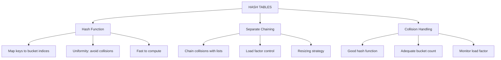


---

### Pattern 4.1: Hash Function & Collisions

**Interactive Resource:** 🔗 [GeeksforGeeks Hashing](https://www.geeksforgeeks.org/hashing-data-structure/)

#### Visual 1: Bucket Distribution


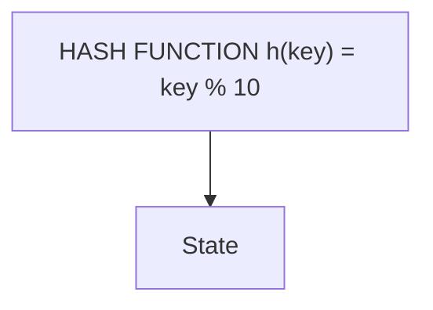


---

### Pattern 4.2: Resizing Strategy

#### Visual 1: Rehashing Process


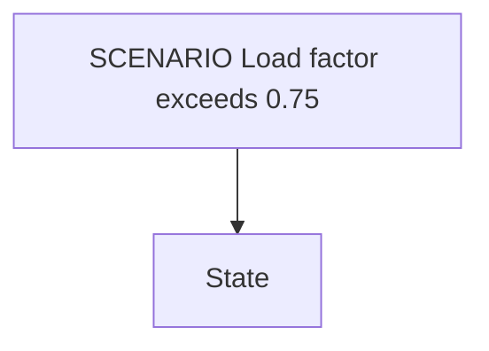


---

## 🔐 DAY 5: ROLLING HASH & RABIN-KARP

### Pattern Map: String Hashing


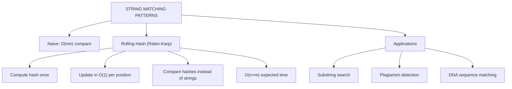


---

### Pattern 5.1: Rolling Hash Window

**Interactive Resource:** 🔗 [GeeksforGeeks Rabin-Karp](https://www.geeksforgeeks.org/rabin-karp-algorithm-for-pattern-searching/)

#### Visual 1: Hash Update Formula


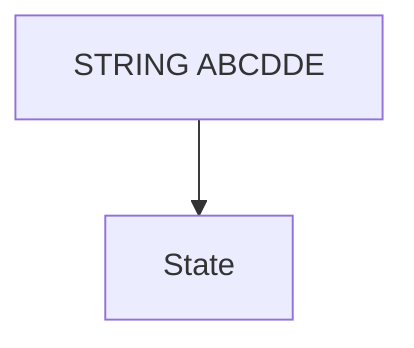


---

### Common Failure Modes (Day 5)

#### Failure 1: Overflow in Hash Calculation

```
❌ WRONG:
hash = 0
for char in string:
  hash = hash × p + ord(char)

For large strings, hash overflows integer!

✓ CORRECT:
hash = 0
for char in string:
  hash = (hash × p + ord(char)) % q

Keep intermediate results modulo q (prime)
Prevents overflow while maintaining equivalence
```

#### Failure 2: Not Handling Modular Arithmetic

```
❌ WRONG (Rolling update):
new_hash = (old_hash - first_char × p^(m-1)) × p + last_char

If (old_hash - first_char×p^(m-1)) is negative:
  Result may be negative!

✓ CORRECT:
new_hash = ((old_hash - first_char × p^(m-1)) × p + last_char) % q
         = ((old_hash - first_char × p^(m-1)) % q × p + last_char) % q

If negative:  new_hash = (new_hash + q) % q

Ensures result always in range [0, q-1]
```

---

## 🎯 WEEK 03 VISUAL SUMMARY TABLE


| DAY | PATTERN | Complexity | Best/Worst Use |
| :--- | :--- | :--- | :--- |
| 1 | Elementary Sorts | O(n²) / O(1) | Small n, |
|  | (Bubble, Select, | stable vary | nearly sorted |
|  | Insertion) |  | (Insertion) |
|  |  |  |  |
| 2 | Merge Sort | O(n log n) / | Stability |
|  | Quick Sort | O(n log n) av | needed / cache |
|  |  | O(n²) worst | efficiency |
|  |  |  |  |
| 3 | Heaps & Heap | O(log n) each | Priority |
|  | Sort | O(n log n) | queues, top-k |
|  |  | sort, O(1) sp |  |
|  |  |  |  |
| 4 | Hash Tables | O(1) avg / | O(1) lookup, |
|  | (Chaining) | O(n) worst | dynamic sets |
|  |  |  |  |
| 5 | Rolling Hash | O(n+m) exp / | Substring |
|  | (Rabin-Karp) | O(nm) worst | search, pattern |
|  |  |  | matching |


---

## 📋 COMMON PATTERNS QUICK REFERENCE


| Pattern | When to Use | Time/Space |
| :--- | :--- | :--- |
| Bubble Sort | Educational, tiny n | O(n²) / O(1) |
| Insertion Sort | Nearly sorted, small n | O(n²) O(n) best/O(1) |
| Merge Sort | Need stable sort | O(n log n) / O(n) |
| Quick Sort | Cache efficiency needed | O(n log n) avg / O(1) |
| Heap Sort | In-place, no extra mem | O(n log n) / O(1) |
| Hash Table (chain) | Fast lookup/insert | O(1) avg / O(n) chain |
| Priority Queue (heap) | Extract min/max quickly | O(log n) / O(1) |
| Rabin-Karp | Substring patterns | O(n+m) / O(1) |


---

## 🔗 RECOMMENDED LEARNING RESOURCES

### Interactive Visualizations
1. **VisuAlgo Sorting** (https://visualgo.net/en/sorting) — Compare all algorithms side-by-side
2. **Toptal Sorting Visualizer** (https://www.toptal.com/developers/sorting-visualizer) — Hear the sorts!
3. **Heap Visualizer** (https://www.cs.usfca.edu/~galles/visualization/Heap.html) — Step through heap ops
4. **GeeksforGeeks Sorting** (https://www.geeksforgeeks.org/sorting-algorithms/) — Complete reference
5. **GeeksforGeeks Heaps** (https://www.geeksforgeeks.org/heap-data-structure/) — Heap deep dive
6. **GeeksforGeeks Hashing** (https://www.geeksforgeeks.org/hashing-data-structure/) — Hash concepts

### Video Tutorials
- "Sorting Algorithms Explained" — Visual walkthrough of all sorts
- "Heap and Priority Queue" — Animations and use cases
- "Hash Tables Explained" — Collision handling strategies

---

## 📝 HOW TO USE THIS PLAYBOOK

### Quick Revision (30 mins)
1. Scan pattern maps (5 mins)
2. Read one day's main visuals (5 mins per day)
3. Answer mini quiz (3 mins per day)
4. Review failure modes (2 mins per day)

### Deep Learning (2-3 hours)
1. Read playbook + extended subtopics guide
2. Visit web resource links for interactive animations
3. Implement code from main instructional files
4. Solve practice problems using visuals as reference

### Interview Prep
1. Open playbook for quick pattern reminders
2. Use resource links for visual refresh
3. Mentally trace algorithm using playbook diagrams
4. Code from memory with confidence

---

**Use web resource links for interactive visualizations while studying!**

---

> 🧭 **Navigation:** [🏠 Week Overview](README.md) • [📘 Curriculum Syllabus](../COMPLETE_SYLLABUS_v13.md)
