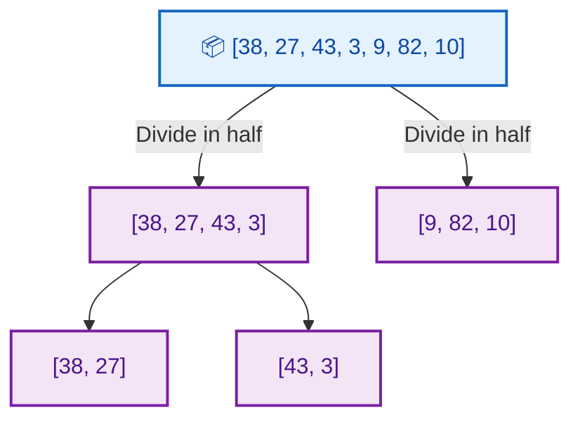
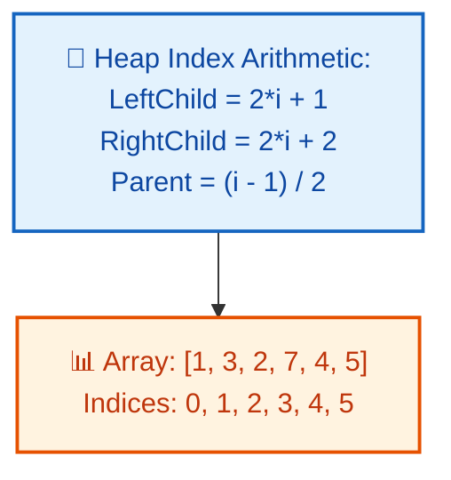
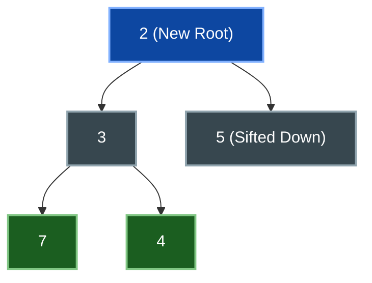
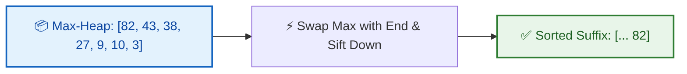
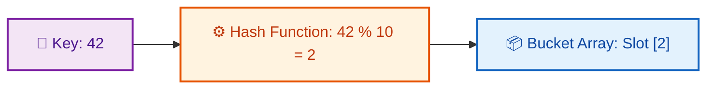
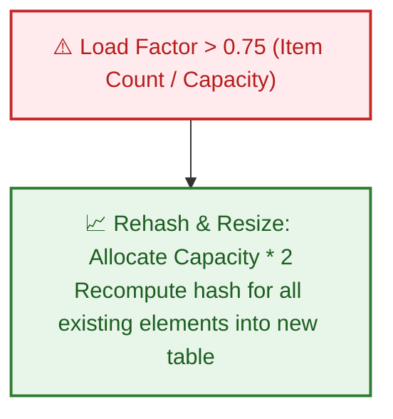
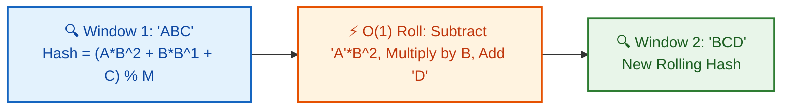

# 📊 WEEK 03 VISUAL CONCEPTS PLAYBOOK (HYBRID)

> 🧭 **Navigation:** [🏠 Week Overview](README.md) • [📘 Curriculum Syllabus](../COMPLETE_SYLLABUS.md)
> 
> 💡 **Instructor Note:** *This Visual Playbook provides a high-density, integrated synthesis. Not all sections are mandatory; use it as a modular reference to solidify invariants and review pattern transitions.*

---

**Theme:** Elementary Sorts, Merge/Quick Sort, Heaps, Hash Tables, String Hashing  
**Format:** Hybrid (Enhanced ASCII + Architecture & State Diagrams)  
**Purpose:** Visual-first concept explanation and deep algorithmic intuition

---

## 🎨 VISUAL LEGEND & RESOURCE GUIDE

### Symbol Reference
| Symbol | Meaning |
|--------|---------|
| `i` / `j` | Index pointers (array position) |
| `[]` | Array element or cell |
| `█` | Sorted element |
| `░` | Unsorted element |
| `▶` | Direction of movement |
| `⇄` | Swap operation |
| `✓` | Valid state |
| `✗` | Invalid state |

---

## 📅 DAY 1: ELEMENTARY SORTS

### Pattern Map: Elementary Sorts Family Tree


### 📌 ELEMENTARY SORTS

- **Bubble Sort (Sinking)**
  - Adjacent element swaps
  - Repeatedly bubbles largest to end
  - O(n²) time, O(1) space
- **Selection Sort (Finding)**
  - Find min/max element
  - Place at correct position
  - O(n²) time, O(1) space
- **Insertion Sort (Growing)**
  - Build sorted prefix
  - Insert next element
  - O(n²) but adaptive for nearly sorted


---

### Pattern 1.1: Bubble Sort - Adjacent Comparisons

#### Visual 1: Pass-by-Pass Evolution

```text
Initial:  [ 5, 2, 8, 1, 9 ]
Pass 1:   swap(5,2) -> [ 2, 5, 8, 1, 9 ]
          ok(5,8)   -> [ 2, 5, 8, 1, 9 ]
          swap(8,1) -> [ 2, 5, 1, 8, 9 ]
          ok(8,9)   -> [ 2, 5, 1, 8 | 9 ]  (9 locked at end)
          |--- unsorted ---|   |-sorted-|

Pass 2:   swap(5,1) -> [ 2, 1, 5 | 8, 9 ]  (8 locked at end)
Pass 3:   swap(2,1) -> [ 1 | 2, 5, 8, 9 ]  (Complete)
```


---

### Pattern 1.2: Selection Sort - Find and Place

#### Visual 1: Selection Process

```text
Initial:  [ 5,  2,  8,  1,  9 ]  -> min in [0..4] is 1 (idx 3) -> swap(0, 3)
Step 1:   [ 1 | 2,  8,  5,  9 ]  -> min in [1..4] is 2 (idx 1) -> in place
Step 2:   [ 1,  2 | 8,  5,  9 ]  -> min in [2..4] is 5 (idx 3) -> swap(2, 3)
Step 3:   [ 1,  2,  5 | 8,  9 ]  -> min in [3..4] is 8 (idx 3) -> in place
Step 4:   [ 1,  2,  5,  8 | 9 ]  -> sorted
          |-- sorted -|--rest-|
```


---

### Pattern 1.3: Insertion Sort - Growing Sorted Prefix

#### Visual 1: Insert into Sorted Prefix

```text
Initial:   [ 5 | 2, 8, 1, 9 ]
Insert 2:  shift 5 -> [ 2, 5 | 8, 1, 9 ]
Insert 8:  in place-> [ 2, 5, 8 | 1, 9 ]
Insert 1:  shift 8,5,2 -> [ 1, 2, 5, 8 | 9 ]
Insert 9:  in place-> [ 1, 2, 5, 8, 9 ]  (Complete)
           |-- sorted prefix --|--unsorted--|
```


---

### Common Failure Modes (Day 1)

#### Failure 1: Comparing Already Sorted Elements

```
❌ WRONG (Bubble Sort):
for i in range(n):
  for j in range(n-1):    ← Rechecks sorted elements!
    if arr[j] > arr[j+1]:
      swap

Result: Unnecessarily compares already-sorted portion

✓ CORRECT:
for i in range(n):
  for j in range(n-1-i):  ← Exclude sorted suffix
    if arr[j] > arr[j+1]:
      swap

Result: Each pass ignores already-placed elements
```

#### Failure 2: Off-by-One in Insertion Sort

```
❌ WRONG:
for i in range(n):
  key = arr[i]
  j = i - 1
  while j >= 0 and arr[j] > key:
    arr[j+1] = arr[j]
    j--
  arr[j+1] = key  ← May write beyond if j=-1

❌ Issue: When j becomes -1, arr[0] = key still works
         But is susceptible to boundary bugs

✓ CORRECT (same logic, clearer):
for i in range(1, n):  ← Start from index 1
  key = arr[i]
  j = i - 1
  while j >= 0 and arr[j] > key:
    arr[j+1] = arr[j]
    j--
  arr[j+1] = key  ← j+1 always in range [0, i]
```

---

### Mini Review Quiz (Day 1)

**Q1:** Why is Insertion Sort adaptive but Bubble Sort is not?

```
A) Bubble Sort is faster on nearly sorted arrays
B) Insertion Sort stops early if array is sorted
C) Bubble Sort doesn't compare neighbors
D) Insertion Sort inherently skips sorted elements
```
**✅ Answer:** B (Best case O(n) for mostly sorted, vs O(n²) for bubble)

**Q2:** Which sort is stable?

```
A) Bubble Sort only
B) All three (bubble, selection, insertion)
C) Bubble and Insertion, but not Selection
D) None are stable
```
**✅ Answer:** C (Selection breaks stability by direct placement)

**Q3:** For nearly sorted array with k inversions (k << n), which is best?

```
A) Bubble Sort O(n + k) passes
B) Selection Sort O(n²) always
C) Insertion Sort O(n + k) shifts
D) All equally bad
```
**✅ Answer:** C (Insertion adapts to inversions, others don't)

---

## ⚙️ DAY 2: MERGE SORT & QUICK SORT

### Pattern Map: Advanced Sorting Family Tree


### 📌 ADVANCED SORTS (Divide & Conquer)

- **Merge Sort**
  - Divide into halves
  - Recursively sort both
  - Merge sorted halves
  - O(n log n) guaranteed, stable
- **Quick Sort**
  - Partition around pivot
  - Recursively sort partitions
  - In-place with excellent cache
  - O(n log n) average, O(n²) worst


---

### Pattern 2.1: Merge Sort Tree Structure

#### Visual 1: Recursion Tree with Merges





---

### Pattern 2.2: Quick Sort Partitioning

#### Visual 1: Partition Around Pivot


| 3 | 7 | 8 | 5 | 2 | 1 | 9 | 5 | 4 |
| :--- | :--- | :--- | :--- | :--- | :--- | :--- | :--- | :--- |
| [3 | 7 | 8 | 5 | 2 | 1 | 9 | 5 | 4] |
| [3 | 2 | 8 | 5 | 7 | 1 | 9 | 5 | 4] |
| [3 | 2 | 1 | 5 | 7 | 8 | 9 | 5 | 4] |
| [3 | 2 | 1 | 4 | 7 | 8 | 9 | 5 | 8] |


---

### Common Failure Modes (Day 2)

#### Failure 1: Forgetting Merge Space

```
❌ WRONG (Merge Sort claiming O(1) space):
void mergeSort(arr):
  if n <= 1: return
  mid = n/2
  mergeSort(arr[0..mid-1])
  mergeSort(arr[mid..n-1])
  merge(arr, 0, mid, n-1)  ← Where does merge temp go?

Result: No space for temporary array, corrupts data

✓ CORRECT:
void mergeSort(arr, l, r, temp):
  if l < r:
    mid = (l + r) / 2
    mergeSort(arr, l, mid, temp)
    mergeSort(arr, mid+1, r, temp)
    merge(arr, l, mid, r, temp)  ← Use temp array

Merge fills temp[], then copies back to arr[]
Result: O(n) space used properly
```

#### Failure 2: Bad Pivot Choice in Quick Sort

```
❌ WRONG:
Always choose first/last element as pivot

For already sorted array [1,2,3,4,5]:
Pivot = 5
Partition: [1,2,3,4] | [5]
Recurse left: Pivot = 4
Partition: [1,2,3] | [4]
...
Result: O(n²) degenerate behavior!

✓ CORRECT (Randomized Pivot):
Random pivot selection
Or: Median-of-three pivot
Or: Randomized quick select

Expected: O(n log n) even for sorted arrays
Probability of bad pivot decreases exponentially
```

---

## 📦 DAY 3: HEAPS, HEAPIFY & HEAP SORT

### Pattern Map: Heap Operations Family


### 📌 HEAP STRUCTURES

- **Binary Heap Array Representation**
  - Min-heap (parent ≤ children)
  - Max-heap (parent ≥ children)
  - Complete binary tree in array
- **Core Operations**
  - Insert (bubble up)
  - Extract-min/max (bubble down)
  - Build-heap (heapify all)
- **Applications**
  - Heap sort
  - Priority queues
  - Top-k problems


---

### Pattern 3.1: Array Representation & Parent-Child

#### Visual 1: Array Index Mapping


### 📌 🟢 Root: Min Element (1)

- **📦 Left: 3**
  - 7


---

### Pattern 3.2: Insert Operation (Bubble Up)

#### Visual 1: Maintain Heap Property During Insert





---

### Pattern 3.3: Extract-Min (Bubble Down)

#### Visual 1: Remove Root and Restore

```
MIN-HEAP: [1, 3, 2, 7, 4, 5]
EXTRACT MIN (remove root = 1):

STEP 1: Save root
min_value = arr[0] = 1  ← To return

STEP 2: Move last to root
[5, 3, 2, 7, 4, 5]  ← Move arr[5] to arr[0]
 ↑
 5 is now root (may violate heap property)

STEP 3: Bubble down (sink to correct position)

Node at index 0 (value=5):
Children:
  Left: index 1 → arr[1] = 3
  Right: index 2 → arr[2] = 2

Find smaller child: min(3, 2) = 2 at index 2
5 > 2? YES, swap with smaller child:
[2, 3, 5, 7, 4]
 ↑     ↑
swapped

Node now at index 2 (value=5):
Children:
  Left: index 5 → out of bounds
  Right: index 6 → out of bounds

No children, STOP

RESULT: [2, 3, 5, 7, 4] (Heap property restored)
Returned: 1
```



- **Time Complexity:** `O(log N)` (bounded by tree height)
- **Space Complexity:** `O(1)` (in-place index swaps)

---

### Pattern 3.4: Heap Sort

#### Visual 1: Build-Heap then Extract





---

## #️⃣ DAY 4: HASH TABLES (SEPARATE CHAINING)

### Pattern Map: Hash Table Design


### 📌 HASH TABLES

- **Hash Function**
  - Map keys to bucket indices
  - Uniformity: avoid collisions
  - Fast to compute
- **Separate Chaining**
  - Chain collisions with lists
  - Load factor control
  - Resizing strategy
- **Collision Handling**
  - Good hash function
  - Adequate bucket count
  - Monitor load factor


---

### Pattern 4.1: Hash Function & Collisions

#### Visual 1: Bucket Distribution





---

### Pattern 4.2: Resizing Strategy

#### Visual 1: Rehashing Process





---

## 🔐 DAY 5: ROLLING HASH & RABIN-KARP

### Pattern Map: String Hashing


### 📌 STRING MATCHING PATTERNS

- Naive: O(nm) compare
- **Rolling Hash (Rabin-Karp)**
  - Compute hash once
  - Update in O(1) per position
  - Compare hashes instead of strings
  - O(n+m) expected time
- **Applications**
  - Substring search
  - Plagiarism detection
  - DNA sequence matching


---

### Pattern 5.1: Rolling Hash Window

#### Visual 1: Hash Update Formula





---

### Common Failure Modes (Day 5)

#### Failure 1: Overflow in Hash Calculation

```
❌ WRONG:
hash = 0
for char in string:
  hash = hash × p + ord(char)

For large strings, hash overflows integer!

✓ CORRECT:
hash = 0
for char in string:
  hash = (hash × p + ord(char)) % q

Keep intermediate results modulo q (prime)
Prevents overflow while maintaining equivalence
```

#### Failure 2: Not Handling Modular Arithmetic

```
❌ WRONG (Rolling update):
new_hash = (old_hash - first_char × p^(m-1)) × p + last_char

If (old_hash - first_char×p^(m-1)) is negative:
  Result may be negative!

✓ CORRECT:
new_hash = ((old_hash - first_char × p^(m-1)) × p + last_char) % q
         = ((old_hash - first_char × p^(m-1)) % q × p + last_char) % q

If negative:  new_hash = (new_hash + q) % q

Ensures result always in range [0, q-1]
```

---

## 🎯 WEEK 03 VISUAL SUMMARY TABLE


| Day | Pattern | Complexity | Best/Worst Use |
| :--- | :--- | :--- | :--- |
| **Day 1** | Elementary Sorts (Bubble, Selection, Insertion) | `O(N^2)` time / `O(1)` space | Small `N`; Insertion is optimal `O(N)` for nearly sorted |
| **Day 2** | Merge Sort & Quick Sort | `O(N log N)` time / `O(N)` or `O(log N)` space | Merge Sort for stability; Quick Sort for in-place cache locality |
| **Day 3** | Heaps & Heap Sort | `O(log N)` push/pop, `O(N)` heapify | Priority queues, streaming top-k, `O(1)` extra space sort |
| **Day 4** | Hash Tables (Separate Chaining) | `O(1)` average lookup, `O(N)` worst | Fast key-value association, load factor resizing |
| **Day 5** | Rolling Hash (Rabin-Karp) | `O(N + M)` average, `O(N * M)` worst | Substring search & sliding window fingerprinting |


---

## 📋 COMMON PATTERNS QUICK REFERENCE


| Pattern | When to Use | Time/Space |
| :--- | :--- | :--- |
| Bubble Sort | Educational, tiny n | O(n²) / O(1) |
| Insertion Sort | Nearly sorted, small n | O(n²) O(n) best/O(1) |
| Merge Sort | Need stable sort | O(n log n) / O(n) |
| Quick Sort | Cache efficiency needed | O(n log n) avg / O(1) |
| Heap Sort | In-place, no extra mem | O(n log n) / O(1) |
| Hash Table (chain) | Fast lookup/insert | O(1) avg / O(n) chain |
| Priority Queue (heap) | Extract min/max quickly | O(log n) / O(1) |
| Rabin-Karp | Substring patterns | O(n+m) / O(1) |


---

## 📚 CORE CONCEPT WALKTHROUGHS

### Core Visualizations & Step Traces
- **Comparison Sort Invariants:** Sinking bubble passes, selection minimum swaps, and insertion prefix shifting.
- **Divide-and-Conquer Merge/Partition:** Tree recursion, auxiliary array merging, and Lomuto/Hoare pivots.
- **Heap Tree Array Mapping:** Complete binary tree index invariants `2i+1` / `2i+2` and sift-down mechanics.
- **Rabin-Karp Rolling Hash:** Polynomial rolling hash window sliding with Horner's rule.

### Conceptual Lecture Alignment
- "Sorting Algorithms Explained" — Stability, adaptivity, and worst-case bounds
- "Heap and Priority Queue" — Sift-down vs sift-up dynamics and array storage
- "Hash Tables Explained" — Collision resolution, bucket distributions, and prime modulus selection

---

## 📝 HOW TO USE THIS PLAYBOOK

### Quick Revision (30 mins)
1. Scan pattern maps (5 mins)
2. Read one day's main visuals (5 mins per day)
3. Answer mini quiz (3 mins per day)
4. Review failure modes (2 mins per day)

### Deep Learning (2-3 hours)
1. Read playbook + extended subtopics guide
2. Hand-trace state transitions using visual diagrams
3. Implement code from main instructional files
4. Solve practice problems using visuals as reference

### Interview Prep
1. Open playbook for quick pattern reminders
2. Review visual diagrams for structural refresh
3. Mentally trace algorithm using playbook diagrams
4. Code from memory with confidence

---

**Review sorting passes and hash bucket diagrams visually while practicing!**

---

> 🧭 **Navigation:** [🏠 Week Overview](README.md) • [📘 Curriculum Syllabus](../COMPLETE_SYLLABUS.md)
