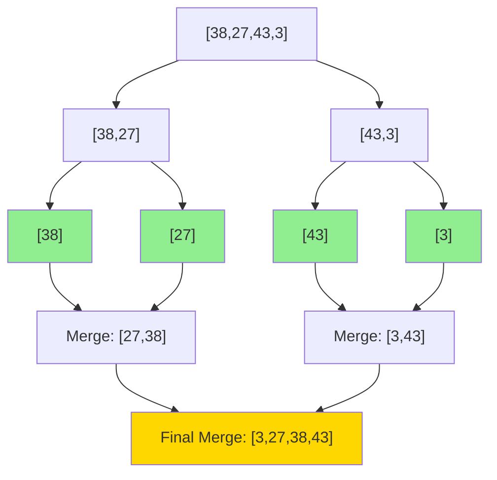

# Week 3 — Day 2: Merge Sort & Quick Sort

**Week:** 3  
**Day:** 2  
**Topic:** Merge Sort & Quick Sort  
**Category:** Foundations III — Sorting & Hashing  
**Difficulty:** 🟡 Medium  
**Prerequisites:** Week 3 Day 1 (Elementary Sorts), Week 1 Day 2 (Asymptotic Analysis), Week 1 Day 4-5 (Recursion)  
**Interview Frequency:** Very High (fundamental divide-and-conquer algorithms)  
**Real-World Impact:** Foundation of most production sorting implementations; critical for understanding algorithm design paradigms

---

## 🤔 The Why — Engineering Motivation

### The Quest for O(n log n) Sorting

Elementary sorts (bubble, selection, insertion) achieve O(n squared) time complexity, which becomes prohibitively expensive for large datasets. A million-element array would require roughly one trillion operations with bubble sort — unacceptable for modern applications.

**The Breakthrough:** Divide-and-conquer algorithms achieve O(n log n) complexity by:
- Breaking problems into smaller subproblems
- Solving subproblems recursively
- Combining solutions efficiently

This single paradigm shift reduced sorting time from hours to seconds for large datasets.

### Real-World Necessity

**Database Systems:**
- ORDER BY clauses on millions of rows
- JOIN operations requiring sorted inputs
- Index building and maintenance

**Search Engines:**
- Ranking billions of search results
- Merging inverted index lists
- Real-time query processing

**Operating Systems:**
- Process scheduling by priority
- File system directory sorting
- Memory page management

**Big Data Processing:**
- MapReduce shuffle phase
- Distributed sorting across clusters
- Log aggregation and analysis

### Why Two Algorithms?

Merge sort and quick sort represent different trade-offs:

**Merge Sort:**
- **Guaranteed** O(n log n) time (no worst case degradation)
- **Stable** sorting (preserves relative order)
- **External sorting** friendly (works on disk-based data)
- **Cost:** Requires O(n) extra space for merging

**Quick Sort:**
- **Average** O(n log n) with excellent constants (fast in practice)
- **In-place** sorting (O(log n) stack space only)
- **Cache-friendly** (good locality of reference)
- **Risk:** O(n squared) worst case (rare with good pivot selection)

Modern production systems use **hybrid approaches** combining both with elementary sorts for small subarrays.

---

## 📌 The What — Mental Model & Core Concepts

### Core Concepts Overview

**Divide-and-Conquer Paradigm:**
1. **Divide:** Split problem into smaller subproblems
2. **Conquer:** Solve subproblems recursively
3. **Combine:** Merge solutions into final result

**Merge Sort and Quick Sort differ in where the work happens:**
- **Merge Sort:** Easy divide, hard combine (merge operation)
- **Quick Sort:** Hard divide (partitioning), trivial combine

---

### Mental Model 1: Merge Sort — The Systematic Divider

**Analogy:** Imagine organizing a messy deck of cards by:
1. Splitting the deck into two halves
2. Recursively splitting each half until you have individual cards
3. Merging pairs of sorted mini-decks back together, maintaining order
4. Eventually merging all the way back to a fully sorted deck

**Core Idea:**
- Recursively divide array into two halves until base case (single element)
- Single elements are trivially sorted
- Merge pairs of sorted subarrays to produce larger sorted subarrays
- Continue merging until entire array is sorted

**Invariant:**
- At each level of recursion, all subarrays are sorted
- Merge operation preserves this invariant while combining

**Visual Structure:**

```
Merge Sort Tree (Array [38, 27, 43, 3, 9, 82, 10]):

Level 0 (Input):
  [38, 27, 43, 3, 9, 82, 10]
           │
    ┌──────┴──────┐
    │             │
Level 1 (Divide):
  [38, 27, 43, 3]   [9, 82, 10]
    │                  │
  ┌─┴─┐             ┌──┴──┐
  │   │             │     │
Level 2 (Divide):
[38,27] [43,3]    [9,82]  [10]
  │  │   │  │      │  │     │
 [38][27][43][3]  [9][82]  [10]  ← Base cases (single elements)
  │  │   │  │      │  │     │
  └──┘   └──┘      └──┘     │
   │      │         │       │
Level 2 (Merge):
[27,38] [3,43]    [9,82]  [10]
   │      │         │       │
   └──────┘         └───────┘
      │                 │
Level 1 (Merge):
  [3, 27, 38, 43]   [9, 10, 82]
      │                 │
      └─────────────────┘
             │
Level 0 (Final Merge):
    [3, 9, 10, 27, 38, 43, 82]  ← Sorted!
```

**Key Operations:**
- **Divide:** O(1) — simple midpoint calculation
- **Conquer:** 2 × T(n/2) — recursive calls on halves
- **Combine:** O(n) — merge operation scans both halves

**Recurrence Relation:**
T(n) = 2 × T(n/2) + O(n)

By Master Theorem: T(n) = O(n log n)

---

### Mental Model 2: Quick Sort — The Efficient Partitioner

**Analogy:** Imagine organizing a library by:
1. Picking a "pivot" book
2. Moving all books alphabetically before the pivot to the left
3. Moving all books alphabetically after the pivot to the right
4. The pivot is now in its final position
5. Recursively organize left and right sections
6. Eventually, all books are in order

**Core Idea:**
- Choose a pivot element from the array
- Partition array: elements less than pivot go left, greater go right
- Pivot is now in its final sorted position
- Recursively sort left and right partitions
- No merge needed — array is sorted in-place

**Invariant:**
- After partitioning around pivot p:
  - All elements in left partition are less than or equal to p
  - All elements in right partition are greater than or equal to p
  - Pivot p is in its final sorted position

**Visual Structure:**

```
Quick Sort Process (Array [38, 27, 43, 3, 9, 82, 10]):

Step 1: Choose pivot (last element: 10)
  [38, 27, 43, 3, 9, 82, |10|]
              ↓
  Partition around 10:
  [3, 9, |10|, 38, 27, 43, 82]
   ← ≤10 →  10  ← >10 →

Step 2: Recursively sort left [3, 9]
  Pivot: 9
  [3, |9|]  ← Already sorted

Step 3: Recursively sort right [38, 27, 43, 82]
  Pivot: 82
  [38, 27, 43, |82|]  ← Partition
   ← ≤82 →       82

Step 4: Recursively sort [38, 27, 43]
  Pivot: 43
  [27, 38, |43|]  ← Partition and sorted

Final Result:
  [3, 9, 10, 27, 38, 43, 82]  ← Sorted!
```

**Key Operations:**
- **Partition:** O(n) — scan array, rearrange elements
- **Recursive Calls:** Depends on partition quality
  - Best/Average: 2 × T(n/2) — balanced partitions
  - Worst: T(n-1) + T(0) — unbalanced (already sorted with bad pivot)

**Recurrence Relation:**
- Average case: T(n) = 2 × T(n/2) + O(n) → O(n log n)
- Worst case: T(n) = T(n-1) + O(n) → O(n squared)

---

### Comparison Table: Merge Sort vs Quick Sort

| Property | Merge Sort | Quick Sort |
|----------|------------|------------|
| **Time (Best)** | O(n log n) | O(n log n) |
| **Time (Average)** | O(n log n) | O(n log n) |
| **Time (Worst)** | O(n log n) | O(n squared) |
| **Space (Auxiliary)** | O(n) | O(log n) stack |
| **Stable** | ✅ Yes | ❌ No (standard) |
| **In-Place** | ❌ No | ✅ Yes |
| **Cache Performance** | 🟡 Moderate | ✅ Good |
| **Parallelizable** | ✅ Easily | ✅ Easily |
| **Best Use Case** | Stable sorting, external sorting, linked lists | General-purpose, in-place, average-case speed |
| **Worst Use Case** | Memory-constrained | Already sorted (without randomization) |

---

### The Merge Operation: Heart of Merge Sort

**Mental Model:** Two sorted piles of cards, create a third pile by repeatedly choosing the smaller top card.

**Algorithm:**
1. Create temporary arrays for left and right halves
2. Use two pointers, one for each half
3. Compare elements at both pointers
4. Copy smaller element to result, advance that pointer
5. When one half exhausted, copy remaining elements from other half

**Example Merge:**
```
Left:  [3, 27, 38]  (pointer i)
Right: [9, 10, 82]  (pointer j)
Result: []

Step 1: 3 < 9 → Result = [3], i++
Step 2: 27 > 9 → Result = [3, 9], j++
Step 3: 27 > 10 → Result = [3, 9, 10], j++
Step 4: 27 < 82 → Result = [3, 9, 10, 27], i++
Step 5: 38 < 82 → Result = [3, 9, 10, 27, 38], i++
Step 6: Left exhausted, copy [82] → Result = [3, 9, 10, 27, 38, 82]
```

**Complexity:** O(n) — each element compared and copied once

---

### The Partition Operation: Heart of Quick Sort

**Mental Model:** Rearrange array so pivot "settles" into its final position with smaller elements left, larger right.

**Lomuto Partition Scheme:**
- Choose last element as pivot
- Maintain boundary index i (elements before i are less than or equal to pivot)
- Scan array with index j
- When element at j is less than or equal to pivot, swap with element at i and increment i
- Finally, swap pivot with element at i

**Example Partition (Lomuto):**
```
Array: [38, 27, 43, 3, 9, 82, 10]  Pivot = 10

Initial: i = -1

j=0: 38 > 10 → No swap, i = -1
  [38, 27, 43, 3, 9, 82, 10]

j=1: 27 > 10 → No swap, i = -1
  [38, 27, 43, 3, 9, 82, 10]

j=2: 43 > 10 → No swap, i = -1
  [38, 27, 43, 3, 9, 82, 10]

j=3: 3 ≤ 10 → i++, swap arr[0] and arr[3]
  [3, 27, 43, 38, 9, 82, 10]  i = 0

j=4: 9 ≤ 10 → i++, swap arr[1] and arr[4]
  [3, 9, 43, 38, 27, 82, 10]  i = 1

j=5: 82 > 10 → No swap, i = 1

Final: Swap pivot (arr[6]) with arr[i+1]
  [3, 9, 10, 38, 27, 82, 43]
         ↑ Pivot in final position
```

**Hoare Partition Scheme:**
- Choose pivot (often first element)
- Use two pointers from ends moving toward center
- Left pointer finds element greater than or equal to pivot
- Right pointer finds element less than or equal to pivot
- Swap and continue until pointers cross

**Hoare is more efficient** (fewer swaps on average) but more complex.

---

### Stability in Sorting

**Merge Sort is Stable:**
- During merge, when elements are equal, we take from left subarray first
- This preserves original order of equal elements

**Quick Sort is Unstable:**
- Partition operation performs long-distance swaps
- Equal elements can be reordered

**Why Stability Matters:**
```
Example: Sorting employees by salary, then by department

Original (by name):
  (Alice, HR, 60k), (Bob, IT, 60k), (Charlie, HR, 70k)

Sort by salary (stable):
  (Alice, HR, 60k), (Bob, IT, 60k), (Charlie, HR, 70k)

Sort by department (stable):
  (Alice, HR, 60k), (Charlie, HR, 70k), (Bob, IT, 60k)
  ↑ HR employees maintain salary order
```

---

## ⚙ The How — Mechanical Walkthrough

### Merge Sort: Complete Trace

**Input:** [38, 27, 43, 3]

**Divide Phase (Top-Down):**
```
Level 0: [38, 27, 43, 3]  → Split at mid=2
           ↓
Level 1: [38, 27] | [43, 3]
           ↓         ↓
         Split at    Split at
           mid=1       mid=1
           ↓         ↓
Level 2: [38][27] | [43][3]  ← Base cases
```

**Conquer Phase (Bottom-Up Merge):**
```
Level 2 (Base cases):
  [38] and [27] are trivially sorted

Level 1 (First merges):
  Merge [38] and [27]:
    Compare 38 vs 27 → 27 smaller → [27]
    Copy remaining 38 → [27, 38]

  Merge [43] and [3]:
    Compare 43 vs 3 → 3 smaller → [3]
    Copy remaining 43 → [3, 43]

Level 0 (Final merge):
  Merge [27, 38] and [3, 43]:
    Compare 27 vs 3 → 3 smaller → [3]
    Compare 27 vs 43 → 27 smaller → [3, 27]
    Compare 38 vs 43 → 38 smaller → [3, 27, 38]
    Copy remaining 43 → [3, 27, 38, 43]

Final: [3, 27, 38, 43]  ← Sorted!
```

**Detailed Merge Step:**
```
Merging [27, 38] and [3, 43]:

Left = [27, 38], i = 0
Right = [3, 43], j = 0
Result = []

Step 1: Left[0]=27, Right[0]=3 → 3 < 27
  Result = [3], j = 1

Step 2: Left[0]=27, Right[1]=43 → 27 < 43
  Result = [3, 27], i = 1

Step 3: Left[1]=38, Right[1]=43 → 38 < 43
  Result = [3, 27, 38], i = 2

Step 4: Left exhausted, copy Right[1]=43
  Result = [3, 27, 38, 43]
```

---

### Quick Sort: Complete Trace (Lomuto Partition)

**Input:** [38, 27, 43, 3, 9]

**Initial Call: QuickSort(0, 4)**

**Partition Step 1:**
```
Array: [38, 27, 43, 3, 9]  Pivot = 9 (last element)
i = -1, scan with j

j=0: 38 > 9 → No action
j=1: 27 > 9 → No action
j=2: 43 > 9 → No action
j=3: 3 ≤ 9 → i++ to 0, swap arr[0] with arr[3]
  [3, 27, 43, 38, 9]

j=4: Reached pivot

Swap pivot with arr[i+1]:
  [3, 9, 43, 38, 27]
      ↑ Pivot at index 1
```

**Recursive Calls:**
```
Left: QuickSort([3], 0, 0) → Single element, return
Right: QuickSort([43, 38, 27], 2, 4)
```

**Partition Step 2 (Right subarray):**
```
Array: [43, 38, 27]  Pivot = 27
i = 1 (relative to subarray start at index 2)

j=0: 43 > 27 → No action
j=1: 38 > 27 → No action
j=2: Reached pivot

Swap pivot with arr[i+1]:
  [27, 38, 43]
   ↑ Pivot at index 2
```

**Recursive Calls:**
```
Left: QuickSort([27], 2, 2) → Single element, return
Right: QuickSort([38, 43], 3, 4)
```

**Partition Step 3:**
```
Array: [38, 43]  Pivot = 43
i = 2

j=0: 38 ≤ 43 → i++ to 3, swap (no change, same element)
j=1: Reached pivot

Swap pivot (no change):
  [38, 43]
       ↑ Pivot at index 4
```

**Final Result:** [3, 9, 27, 38, 43]  ← Sorted!

---

### Mermaid Diagram: Merge Sort Recursion Flow



---

### Mermaid Diagram: Quick Sort Partition Flow

```mermaid
graph TD
    A["Start: Choose Pivot"] --> B["Initialize Boundary i"]
    B --> C["Scan Array with j"]
    C --> D{arr j ≤ pivot?}
    D -->|Yes| E["Increment i, Swap arr i and arr j"]
    D -->|No| F["Move to Next j"]
    E --> G{Reached End?}
    F --> G
    G -->|No| C
    G -->|Yes| H["Swap Pivot with arr i+1"]
    H --> I["Pivot in Final Position"]
    I --> J["Recursively Sort Left"]
    I --> K["Recursively Sort Right"]

    style I fill:#FFD700
    style A fill:#FFE4B5
```



---

## 🎨 Visualization — Simulation & Examples

### Example 1: Merge Sort on [5, 2, 8, 1, 9]

**Full Recursion Tree:**
```
                    [5, 2, 8, 1, 9]
                          │
        ┌─────────────────┴─────────────────┐
        │                                   │
    [5, 2, 8]                           [1, 9]
        │                                   │
    ┌───┴───┐                           ┌───┴───┐
    │       │                           │       │
  [5, 2]    [8]                        [1]     [9]
    │                                   
  ┌─┴─┐                                
  │   │                                 
 [5] [2]                                

─────── Merge Phase (Bottom-Up) ───────

 [5] [2] → Merge → [2, 5]

 [2, 5] [8] → Merge → [2, 5, 8]

 [1] [9] → Merge → [1, 9]

 [2, 5, 8] [1, 9] → Merge → [1, 2, 5, 8, 9]
```

**Merge Detail for Final Step:**
```
Left:  [2, 5, 8]  (i=0)
Right: [1, 9]     (j=0)

Compare 2 vs 1 → 1 wins → Result=[1], j=1
Compare 2 vs 9 → 2 wins → Result=[1,2], i=1
Compare 5 vs 9 → 5 wins → Result=[1,2,5], i=2
Compare 8 vs 9 → 8 wins → Result=[1,2,5,8], i=3
Left exhausted → Copy 9 → Result=[1,2,5,8,9]
```

---

### Example 2: Quick Sort with Different Pivot Choices

**Array:** [7, 2, 1, 6, 8, 5, 3, 4]

**Scenario A: Last Element as Pivot (Lomuto)**
```
Pivot = 4

Partition:
  [2, 1, 3, 4, 8, 5, 7, 6]
           ↑ Index 3

Left: [2, 1, 3] → Pivot=3 → [1, 2, 3]
Right: [8, 5, 7, 6] → Pivot=6 → [5, 6, 7, 8]

Result: [1, 2, 3, 4, 5, 6, 7, 8]
```

**Scenario B: First Element as Pivot (Poor Choice for Sorted)**
```
If array was [1, 2, 3, 4, 5, 6, 7, 8]:

Pivot = 1
Partition: [1] [2, 3, 4, 5, 6, 7, 8]
           ↑ Highly unbalanced!

This degrades to O(n squared) — worst case
```

**Scenario C: Median-of-Three Pivot**
```
Array: [7, 2, 1, 6, 8, 5, 3, 4]

Candidates: first=7, mid=6, last=4
Median = 6  ← Choose this as pivot

Partition around 6:
  [2, 1, 5, 3, 4, 6, 8, 7]
                 ↑ Better balanced
```

---

### Example 3: Stability Demonstration

**Array:** [(3,A), (1,B), (3,C), (2,D)]  (number, label pairs)

**Merge Sort (Stable):**
```
Divide:
  [(3,A), (1,B)] | [(3,C), (2,D)]

Merge left:
  (3,A) vs (1,B) → 1 < 3 → [(1,B)]
  Copy (3,A) → [(1,B), (3,A)]

Merge right:
  (3,C) vs (2,D) → 2 < 3 → [(2,D)]
  Copy (3,C) → [(2,D), (3,C)]

Final merge:
  (1,B) vs (2,D) → 1 < 2 → [(1,B)]
  (3,A) vs (2,D) → 2 < 3 → [(1,B), (2,D)]
  (3,A) vs (3,C) → Equal, take left → [(1,B), (2,D), (3,A)]
  Copy (3,C) → [(1,B), (2,D), (3,A), (3,C)]

Notice: (3,A) before (3,C) ← Stable!
```

**Quick Sort (Unstable):**
```
Pivot = (2,D)
Partition: [(1,B), (2,D), (3,C), (3,A)]
                   ↑
Notice: (3,C) before (3,A) ← Order changed! Unstable.
```

---

### ASCII Trace: Merge Sort Space Usage

```
Call Stack Depth (n=8):

merge_sort([8 elements])           ← Level 0
  │
  ├─ merge_sort([4 elements])      ← Level 1
  │    │
  │    ├─ merge_sort([2 elements]) ← Level 2
  │    │    │
  │    │    └─ merge_sort([1])     ← Level 3 (base)
  │    │
  │    └─ merge_sort([2 elements])
  │         └─ merge_sort([1])
  │
  └─ merge_sort([4 elements])
       └─ ... (similar)

Max recursion depth = log₂(n) = 3 for n=8

Space for merge buffers:
  At each level, total merge buffer = O(n)
  Example: Level 0 merges 4+4 → needs 8 space
           Level 1 merges 2+2, 2+2 → needs 8 space total

Total auxiliary space: O(n)
```

---

## 📊 Critical Analysis — Performance & Robustness

### Time Complexity Analysis

**Merge Sort:**
- **Best Case:** O(n log n) — Always divides evenly
- **Average Case:** O(n log n) — Always divides evenly
- **Worst Case:** O(n log n) — Always divides evenly

**Why Always O(n log n)?**
- Divide step: O(1) per level
- Recursion tree height: log n (halving at each level)
- Merge step at each level: O(n) total work
- Total: O(n) per level × log n levels = O(n log n)

**Quick Sort:**
- **Best Case:** O(n log n) — Balanced partitions
- **Average Case:** O(n log n) — Random input, random pivot
- **Worst Case:** O(n squared) — Highly unbalanced partitions

**Why O(n squared) Worst Case?**
- If pivot is always smallest or largest element
- Partitions are 0 and n-1 sized
- Recursion tree height: n (removing one element per level)
- Total: n + (n-1) + (n-2) + ... + 1 = n × (n+1) / 2 = O(n squared)

**When Does Worst Case Occur?**
- Already sorted array with poor pivot choice (first or last element)
- Reverse sorted array
- All elements equal

---

### Space Complexity Analysis

**Merge Sort:**
- **Auxiliary Space:** O(n) — Temporary arrays for merging
- **Stack Space:** O(log n) — Recursion depth
- **Total:** O(n) — Dominated by merge buffers

**Quick Sort:**
- **Auxiliary Space:** O(1) — In-place partition (a few variables)
- **Stack Space:** 
  - Best/Average: O(log n) — Balanced recursion
  - Worst: O(n) — Unbalanced recursion (can be optimized to O(log n))
- **Total:** O(log n) average, O(n) worst

**Space Optimization for Quick Sort:**
- Tail recursion elimination: Always recurse on smaller partition first
- Guarantees O(log n) stack space even in worst case

---

### Detailed Performance Table

| Metric | Merge Sort | Quick Sort (Average) | Quick Sort (Worst) |
|--------|------------|----------------------|--------------------|
| **Comparisons** | n log n | ~1.39 n log n | n squared / 2 |
| **Swaps/Moves** | n log n | ~0.69 n log n | n squared / 2 |
| **Auxiliary Space** | O(n) | O(1) | O(1) |
| **Stack Space** | O(log n) | O(log n) | O(n) |
| **Cache Performance** | Moderate | Good | Good |
| **Parallelizable** | ✅ Easily | ✅ Easily | ✅ Yes |
| **Stable** | ✅ Yes | ❌ No | ❌ No |
| **Adaptive** | ❌ No | 🟡 Somewhat | 🟡 Somewhat |

---

### Pivot Selection Strategies for Quick Sort

**1. Always First Element:**
- ✅ Simple, O(1)
- ❌ O(n squared) on sorted/reverse-sorted arrays

**2. Always Last Element:**
- ✅ Simple, O(1)
- ❌ O(n squared) on sorted/reverse-sorted arrays

**3. Random Element:**
- ✅ Expected O(n log n) even on sorted arrays
- ✅ Randomization defeats adversarial inputs
- ❌ Requires random number generator

**4. Median-of-Three:**
- Choose median of first, middle, last elements
- ✅ Better than single-element pivot
- ✅ O(1) computation
- ❌ Still can degrade on certain inputs

**5. True Median (Median-of-Medians):**
- Guaranteed linear-time median finding
- ✅ Worst-case O(n log n) quick sort
- ❌ High constant factors, rarely used in practice

**Recommended:** Random pivot or median-of-three for production code

---

### Cache Performance Analysis

**Quick Sort Cache Advantage:**
- Partition operates on contiguous subarray
- Good spatial locality (sequential access)
- In-place means no cache evictions from temporary arrays
- Pivot and partition variables stay in registers/L1 cache

**Merge Sort Cache Challenge:**
- Merging requires accessing two separate arrays
- Can cause cache misses when arrays don't fit in cache
- Copying to temporary buffer and back thrashes cache
- External merge sort mitigates this with careful I/O

**Real-World Impact:**
- On modern CPUs with large L3 caches, difference is less pronounced
- For very large n (beyond cache size), external merge sort wins
- For in-memory sorting, quick sort's locality gives practical speedup

---

### Robustness and Edge Cases

**Both Algorithms Handle:**
- Empty arrays (n=0): Return immediately
- Single element (n=1): Base case, already sorted
- All equal elements: 
  - Merge sort: O(n log n) regardless
  - Quick sort: Can degrade to O(n squared) without optimization
- Duplicates: Both handle correctly, merge sort preserves order

**Potential Issues:**

**Merge Sort:**
- Stack overflow on very large n (rare, log n depth)
- Out-of-memory errors if n is too large for auxiliary buffer
- Performance degradation on small subarrays (switch to insertion sort)

**Quick Sort:**
- Stack overflow on pathological inputs (mitigate with randomization)
- O(n squared) on adversarial inputs (mitigate with pivot selection)
- Unstable sorting (use merge sort if stability required)

---

## 🏭 Real Systems — Integration in Production

### System 1: Java's Arrays.sort() — Dual-Pivot Quick Sort

**Context:** Java's `Arrays.sort()` for primitives uses a sophisticated quick sort variant since Java 7.

**Implementation Details:**
- **Dual-pivot quick sort:** Partitions into three parts using two pivots
- **Pivot selection:** Approximates tertiles of array (divide into thirds)
- **Fall-back to insertion sort:** Subarrays less than 47 elements
- **No recursion on equal elements:** Three-way partitioning for duplicates

**Why Dual-Pivot?**
- Reduces expected comparisons from 1.39 n log n to 1.26 n log n
- Better cache performance with three-way partitioning
- Handles duplicates efficiently (common in real data)

**Impact:**
- Faster sorting across all input types
- Enterprise applications, Android OS, big data processing
- Billions of arrays sorted daily

---

### System 2: Python's Timsort — Hybrid Merge Sort

**Context:** Python's `sorted()` and `list.sort()` use Timsort, invented by Tim Peters in 2002.

**Implementation Details:**
- **Adaptive merge sort:** Detects natural runs (ascending/descending sequences)
- **Uses insertion sort:** For runs less than 64 elements (minrun)
- **Galloping mode:** Binary search during merge when one array dominates
- **Stable sorting:** Preserves order of equal elements

**Why Hybrid Merge Sort?**
- Real-world data often partially sorted (time-series, logs, incremental updates)
- Best-case O(n) on already sorted data
- Worst-case O(n log n) guarantee
- Stability critical for Python's sort semantics

**Impact:**
- Optimal for real-world data patterns
- Used in pandas, NumPy, standard library
- Powers data science and machine learning workflows

---

### System 3: Linux Kernel's lib/sort.c — Heap Sort Variant

**Context:** The Linux kernel needs reliable, in-place sorting with guaranteed O(n log n).

**Implementation Details:**
- **Heapsort with introsort ideas:** Quick sort with heap sort fall-back
- **No recursion:** Iterative implementation to avoid stack overflow
- **In-place:** Critical for kernel memory constraints
- **Deterministic:** No randomization for reproducibility

**Why Not Pure Quick Sort?**
- Kernel cannot risk O(n squared) worst case
- No access to random number generators in all contexts
- Security implications of unpredictable runtime

**Impact:**
- Sorting network packets, process lists, file system entries
- Billions of devices worldwide (servers, Android, embedded)
- Critical for system stability and security

---

### System 4: PostgreSQL — External Merge Sort

**Context:** PostgreSQL's ORDER BY and index building use external merge sort for datasets larger than RAM.

**Implementation Details:**
- **Phase 1:** Create sorted runs fitting in memory (using quick sort)
- **Phase 2:** Multi-way merge of runs from disk
- **Buffer management:** Carefully orchestrated I/O to minimize seeks
- **Cost-based optimization:** Chooses run size based on available memory

**Why External Merge Sort?**
- Database queries routinely exceed available RAM
- Merge sort's sequential I/O pattern minimizes disk seeks
- Stable sorting preserves order for multi-column sorts
- Parallelizable across multiple disk drives

**Impact:**
- Enables sorting terabytes of data
- Powers analytics queries, data warehousing
- Core operation in ETL pipelines

---

### System 5: C++ STL sort() — Introsort

**Context:** C++'s `std::sort()` uses introsort, a hybrid of quick sort, heap sort, and insertion sort.

**Implementation Details:**
- **Primary algorithm:** Quick sort with median-of-three pivot
- **Depth limit:** Switches to heap sort if recursion depth exceeds 2 × log n
- **Insertion sort:** For subarrays less than 16 elements
- **Final pass:** Single insertion sort over entire array (cleans up small unsorted regions)

**Why Introsort?**
- Combines quick sort's average-case speed with heap sort's worst-case guarantee
- Insertion sort handles small subarrays optimally
- No extra space required (in-place heap sort)

**Impact:**
- O(n log n) worst-case guarantee with excellent average-case constants
- Foundation of C++ applications (games, high-frequency trading, browsers)
- Performance-critical systems worldwide

---

### System 6: Apache Spark — Distributed Sorting

**Context:** Apache Spark sorts massive datasets across clusters of machines.

**Implementation Details:**
- **Sampling phase:** Sample data to determine partition boundaries
- **Shuffle phase:** Redistribute data based on partitions (uses hash partitioning)
- **Local sort:** Quick sort on each partition within a worker node
- **Optional merge:** External merge sort if partitions spill to disk

**Why Quick Sort Locally?**
- In-memory partitions benefit from quick sort's cache performance
- Merge sort used only when data exceeds memory (disk spill)
- Parallelism comes from partitioning, not algorithm choice

**Impact:**
- Sorts petabytes of data (web crawls, log processing, machine learning)
- Powers big data analytics at scale
- Used by Netflix, Uber, LinkedIn for data pipelines

---

### System 7: Git Version Control — Merge-Based Operations

**Context:** Git's merge operations use algorithms inspired by merge sort.

**Implementation Details:**
- **Three-way merge:** Common ancestor, two branch tips
- **Longest common subsequence:** Finds minimal diff (similar to merge operation)
- **Conflict resolution:** When merge logic fails, manual intervention
- **Stability:** Preserves commit order within branches

**Why Merge-Sort-Like?**
- Stability critical for maintaining commit history semantics
- Predictable O(n log n) for large histories
- Merge logic generalizes to any number of branches

**Impact:**
- Billions of merge operations daily across GitHub, GitLab, Bitbucket
- Foundation of collaborative software development
- Powers continuous integration and deployment

---

### System 8: NGINX Web Server — Sorting Request Queues

**Context:** NGINX sorts requests by priority for load balancing and rate limiting.

**Implementation Details:**
- **Quick sort for small queues:** Less than 100 requests
- **Heap-based priority queue:** For large queues (O(log n) insert/extract)
- **In-place operations:** Memory-constrained embedded use cases
- **Real-time constraints:** Predictable latency critical

**Why Quick Sort for Small Queues?**
- Low overhead for typical request counts
- Cache-friendly for hot paths in request handling
- Simpler than maintaining heap invariants for small n

**Impact:**
- Handles millions of requests per second
- Powers 30%+ of all web servers globally
- Critical for low-latency web applications

---

### System 9: SQLite — In-Memory Sorting

**Context:** SQLite uses quick sort for ORDER BY on small to medium result sets.

**Implementation Details:**
- **Quick sort with randomized pivot:** Protects against adversarial inputs
- **Fall-back to merge sort:** For large result sets or when quicksort depth exceeds limit
- **Stability configurable:** Applications can request stable sorting
- **Memory-adaptive:** Chooses algorithm based on available memory

**Why Quick Sort First?**
- Typical queries return hundreds to thousands of rows (quick sort's sweet spot)
- In-place operation conserves memory (critical for mobile/embedded)
- Average-case performance excellent for random data

**Impact:**
- Most widely deployed database (billions of devices)
- Powers mobile apps, browsers, embedded systems
- Foundation of application data storage

---

### System 10: Video Encoding (FFmpeg) — Frame Sorting

**Context:** Video encoders sort frames by presentation timestamp or encoding order.

**Implementation Details:**
- **Quick sort for small GOP (Group of Pictures):** Typically less than 300 frames
- **Stable sort required:** B-frames reference specific P-frames
- **Real-time constraints:** Sorting must complete within frame budget
- **Parallel encoding:** Partitioning frames across threads (quick sort parallelizes well)

**Why Quick Sort?**
- Low constant factors critical for real-time encoding
- GOP sizes favor quick sort's in-place advantage
- Parallelization enables multi-threaded encoding

**Impact:**
- Every video stream (YouTube, Netflix, Twitch) involves frame sorting
- Real-time video conferencing (Zoom, Teams)
- Billions of video minutes processed daily

---

## 🔗 Concept Crossovers — Connections & Comparisons

### Connection to Divide-and-Conquer Paradigm

**Classic Divide-and-Conquer Examples:**
1. **Merge Sort:** Sort left, sort right, merge
2. **Quick Sort:** Partition, sort left, sort right
3. **Binary Search:** Check middle, search left or right
4. **Karatsuba Multiplication:** Multiply large numbers efficiently

**General Pattern:**
```
function divideAndConquer(problem):
    if problem is small enough:
        return base_case_solution

    subproblems = divide(problem)
    solutions = [divideAndConquer(sub) for sub in subproblems]
    return combine(solutions)
```

**Why Divide-and-Conquer Wins:**
- Reduces problem size exponentially (log n levels)
- Each level does linear work: O(n) × log n = O(n log n)
- Parallelizable: Independent subproblems can run concurrently

---

### Merge Sort vs External Sorting

**External Sorting:** Sorting data too large for RAM (stored on disk).

**Algorithm:**
1. **Create runs:** Load chunks of data into RAM, sort with quick sort, write sorted runs to disk
2. **Merge runs:** Multi-way merge (k-way merge) of sorted runs
3. **Minimize I/O:** Use large buffers, sequential reads/writes

**Why Merge Sort is Ideal:**
- Sequential I/O pattern (disk-friendly)
- Predictable performance (O(n log n) regardless of data distribution)
- Stable (important for database operations)
- Merge operation naturally extends to k-way merge

**Real-World Systems:**
- Databases (PostgreSQL, MySQL, Oracle)
- Big data frameworks (Hadoop MapReduce, Apache Flink)
- Log aggregation systems

---

### Quick Sort vs Randomized Algorithms

**Randomized Quick Sort:** Choose pivot uniformly at random.

**Why Randomization Helps:**
- **Expected O(n log n):** Even on sorted or adversarial inputs
- **No worst-case input:** Attacker cannot craft input to force O(n squared)
- **Simple to implement:** Just one line change (random index selection)

**Other Randomized Algorithms:**
- **Randomized Select:** Find kth smallest element in O(n) expected time
- **Randomized Primality Testing:** Miller-Rabin algorithm
- **Randomized Load Balancing:** Hashing with random functions

**Trade-off:**
- ✅ Robust against adversarial inputs
- ✅ Excellent average-case performance
- ❌ Non-deterministic (same input can have different runtimes)
- ❌ Requires random number generator (cost in embedded systems)

---

### Merge Sort and Linked Lists

**Merge Sort on Linked Lists:**
- **No extra space required:** Merge by rewiring pointers (no copying)
- **Finding middle:** Use slow/fast pointers (O(n) per level, but still O(n log n) total)
- **Natural fit:** Linked lists don't support random access (quick sort needs this)

**Why Not Quick Sort on Linked Lists?**
- Partition requires scanning from both ends
- No O(1) access to middle or random elements
- Slow/fast pointer tricks don't help with partitioning

**Merge Sort Algorithm for Linked Lists:**
1. Find middle using slow/fast pointers
2. Split list into two halves
3. Recursively sort each half
4. Merge by choosing smaller head repeatedly

**Impact:**
- Merge sort is the preferred algorithm for linked lists
- Used in C++ `std::list::sort()` and similar
- O(1) space, O(n log n) time

---

### Comparison with Heap Sort

**Heap Sort:**
- **Time:** O(n log n) worst case (like merge sort)
- **Space:** O(1) in-place (like quick sort)
- **Stability:** Not stable
- **Cache:** Poor cache performance (non-sequential access)

**When to Use Each:**

| Scenario | Merge Sort | Quick Sort | Heap Sort |
|----------|------------|------------|-----------|
| **Need stability** | ✅ Best choice | ❌ No | ❌ No |
| **Memory constrained** | ❌ No | ✅ Best choice | ✅ Best choice |
| **Worst-case guarantee** | ✅ Best choice | ❌ No | ✅ Best choice |
| **Average-case speed** | 🟡 Good | ✅ Best | ❌ Slower |
| **Cache performance** | 🟡 Moderate | ✅ Good | ❌ Poor |
| **External sorting** | ✅ Best choice | ❌ No | ❌ No |

**Conclusion:** Introsort combines quick sort and heap sort to get best of both.

---

### Master Theorem Application

**Master Theorem:** For recurrences of form T(n) = a × T(n/b) + f(n)

**Case 1:** If f(n) = O(n to the power c) where c less than log base b of a  
→ T(n) = Theta(n to the power log base b of a)

**Case 2:** If f(n) = Theta(n to the power c) where c equals log base b of a  
→ T(n) = Theta(n to the power c times log n)

**Case 3:** If f(n) = Omega(n to the power c) where c greater than log base b of a  
→ T(n) = Theta(f(n))

**Merge Sort:**
- T(n) = 2 × T(n/2) + O(n)
- a = 2, b = 2, f(n) = O(n)
- log base 2 of 2 = 1, and f(n) = Theta(n to the power 1)
- **Case 2 applies:** T(n) = Theta(n log n)

**Quick Sort (Average):**
- T(n) = 2 × T(n/2) + O(n)  (same as merge sort)
- **Case 2 applies:** T(n) = Theta(n log n)

**Quick Sort (Worst):**
- T(n) = T(n-1) + O(n)  (not in Master Theorem form)
- Solve by substitution: n + (n-1) + ... + 1 = O(n squared)

---

## 📐 Mathematical & Theoretical Perspective

### Formal Recurrence Analysis

**Merge Sort Recurrence:**

T(n) = 2 × T(n/2) + c × n  (c is constant for merge)

**Recursion Tree Method:**
```
Level 0: c × n                      → Total: c × n
Level 1: c × n/2 + c × n/2          → Total: c × n
Level 2: c × n/4 × 4                → Total: c × n
...
Level log n: c × 1 × n              → Total: c × n

Height: log n levels
Total work: c × n × log n = O(n log n)
```

**Proof by Induction:**

**Base case:** T(1) = c (constant) ✓

**Inductive hypothesis:** T(k) less than or equal to d × k log k for all k less than n

**Inductive step:**
T(n) = 2 × T(n/2) + c × n  
     ≤ 2 × d × (n/2) × log(n/2) + c × n  
     = d × n × (log n - 1) + c × n  
     = d × n × log n - d × n + c × n  
     ≤ d × n × log n  (for sufficiently large d)

Therefore, T(n) = O(n log n) ✓

---

### Quick Sort Expected Value Analysis

**Random Pivot Selection:**

Let T(n) = expected number of comparisons to sort n elements.

**Recurrence:**
T(n) = n - 1 + (1/n) × sum from i=0 to n-1 of [T(i) + T(n-1-i)]

- n - 1: comparisons in partition
- (1/n): probability each element is pivot
- T(i) + T(n-1-i): expected cost for subarrays of size i and n-1-i

**Simplification:**
T(n) = n - 1 + (2/n) × sum from i=0 to n-1 of T(i)

**Solution (by induction or generating functions):**
T(n) = approximately 1.39 × n × log n

**Interpretation:**
- Average case is only 39% more comparisons than merge sort
- In practice, quick sort's cache performance and lower overhead make it faster

---

### Probability of Balanced Partitions

**Definition:** A partition is "balanced" if each subarray has at least n/4 elements.

**Probability Calculation:**
- For random pivot, probability of balanced partition = 1/2
- Half of all elements result in partitions within 25%-75% split

**Expected Depth with Balanced Partitions:**
- Each balanced partition reduces problem size by at least 3/4
- Depth = log base (4/3) of n = approximately 3.4 × log n

**Impact:**
- Even with imperfect pivots, expected recursion depth is O(log n)
- Stack space is O(log n) expected
- Worst-case O(n) stack can be avoided with tail recursion optimization

---

### Stability Proof for Merge Sort

**Claim:** Merge sort is stable if merge operation is stable.

**Proof:**
**Merge Operation Stability:**
When merging two sorted subarrays Left and Right:
```
if Left[i] ≤ Right[j]:
    take Left[i]
else:
    take Right[j]
```

Critical: Use ≤ (not strict <) so that when equal, Left element is taken first.

**Induction on Array Size:**

**Base case:** Single element (n=1) is trivially stable. ✓

**Inductive hypothesis:** Merge sort is stable for arrays of size less than n.

**Inductive step:**
- Divide array into left and right halves
- By IH, sorting each half preserves relative order within that half
- Merge operation (stable by above) preserves relative order between halves
- Therefore, merge sort on array of size n is stable ✓

**Conclusion:** Merge sort maintains relative order of equal elements throughout all levels of recursion.

---

### Lower Bound and Optimality

**Comparison-Based Sorting Lower Bound:** Omega(n log n) comparisons required.

**Merge Sort Achieves Lower Bound:**
- Performs O(n log n) comparisons
- Optimal in terms of asymptotic comparisons

**Quick Sort Average Case is Near-Optimal:**
- Expected 1.39 × n × log n comparisons
- Information-theoretic lower bound is log(n!) approximately equals n log n minus 1.44 × n
- Quick sort is within 39% of theoretical minimum

**Quick Sort is Optimal in Expected Sense:**
- Among comparison-based sorts, randomized quick sort minimizes expected comparisons up to constant factors

---

## 💡 Algorithmic Design Intuition

### Why Does Divide-and-Conquer Work?

**Intuition:** Solving two half-sized problems is much cheaper than solving one full-sized problem.

**Elementary Sorts:** n squared operations  
- Solving two n/2 problems: 2 × (n/2) squared = n squared / 2  
- Not much better!

**Divide-and-Conquer Sorts:** n log n operations  
- Solving two n/2 problems: 2 × (n/2) × log(n/2) = n × (log n - 1)  
- Plus O(n) to combine: n log n total  
- **Exponential reduction in work!**

**Key Insight:** Recursion tree height is logarithmic, so linear work per level compounds to O(n log n) total.

---

### Choosing Between Merge and Quick Sort

**Decision Tree:**

```
Is stability required?
├─ Yes → Use merge sort
└─ No → Is memory constrained?
         ├─ Yes → Use quick sort (or introsort)
         └─ No → Is data disk-based?
                  ├─ Yes → Use merge sort (external)
                  └─ No → Use quick sort for speed
```

**Quick Sort Wins When:**
- In-memory sorting
- Stability not required
- Cache performance critical
- Average case is acceptable

**Merge Sort Wins When:**
- Stability required
- Worst-case guarantee needed
- External sorting (disk-based)
- Linked list sorting

---

### Designing Hybrid Algorithms

**Principle:** Use different algorithms for different problem sizes.

**Common Hybrid Patterns:**

**1. Large Problem → Divide-and-Conquer:**
- Use merge/quick sort for n greater than threshold

**2. Small Problem → Elementary Sort:**
- Use insertion sort for n less than 10-20
- Lower overhead, better constants

**3. Pathological Input → Fall-Back:**
- Quick sort → heap sort if depth exceeds limit (introsort)
- Prevents O(n squared) worst case

**Example: Timsort Thresholds:**
```
n < 64 → Insertion sort
64 ≤ n → Adaptive merge sort with:
  - Run detection (natural ordering)
  - Galloping mode (binary search in merge)
  - Balanced merging (maintain stack of runs)
```

**Design Philosophy:** No single algorithm is best for all inputs; adapt to input characteristics.

---

### Recognizing Partition-Based Problems

**Pattern:** Problems where "dividing around a pivot" helps.

**Examples:**
1. **Quick Select:** Find kth smallest element (O(n) average)
2. **Dutch National Flag:** Partition into three regions
3. **Nuts and Bolts Problem:** Partition with matching pairs
4. **Two-Sum with Sorted Array:** Partition search space

**Key Idea:** Partition operation is powerful beyond sorting — it establishes relative order cheaply.

---

## ❓ Knowledge Check — Socratic Reasoning

### Question 1: Why is merge sort always O(n log n) but quick sort can degrade to O(n squared)?

**Reasoning:**
- Merge sort always divides array exactly in half (balanced)
- Recursion tree always has log n height
- Each level does O(n) work → O(n log n) guaranteed

- Quick sort's partition depends on pivot choice
- Bad pivot (smallest or largest) creates unbalanced split (0 and n-1)
- Recursion tree degenerates to height n → O(n squared)

**Conclusion:** Merge sort's deterministic divide guarantees balance; quick sort's data-dependent partition does not.

---

### Question 2: When would you prefer merge sort over quick sort despite the extra space?

**Key Scenarios:**

**Stability Required:**
- Multi-level sorting (sort by secondary key, then primary)
- Database ORDER BY with multiple columns
- Preserving tie-breaker information

**Worst-Case Guarantees:**
- Real-time systems with deadline constraints
- Security-critical applications (preventing timing attacks)
- Embedded systems without randomization

**External Sorting:**
- Data larger than RAM
- Disk-based or distributed sorting
- Sequential I/O pattern critical

**Linked Lists:**
- No extra space needed (pointer rewiring)
- Quick sort inefficient without random access

**Conclusion:** When predictability, stability, or I/O pattern matters more than space.

---

### Question 3: Why does randomized quick sort protect against O(n squared)?

**Reasoning:**
- Worst case occurs when pivot is always extreme (smallest/largest)
- For sorted array with deterministic pivot, this happens every time
- With random pivot, probability of always choosing extreme is (1/n) times (1/(n-1)) times ... = 1/n! (astronomically small)
- Expected case analysis shows O(n log n) regardless of input

**Analogy:** Like shuffling a deck before dealing — removes patterns that an adversary (or unlucky input distribution) could exploit.

**Conclusion:** Randomization defeats adversarial inputs and worst-case patterns in data.

---

### Question 4: Can you parallelize merge sort and quick sort? How?

**Merge Sort Parallelization:**
- **Divide phase:** Sort left and right halves in parallel
- **Merge phase:** More complex (requires parallel merge algorithms)
- Natural fork-join parallelism
- Works well on multi-core CPUs

**Quick Sort Parallelization:**
- **Partition phase:** Single-threaded (sequential scan)
- **Recursive phase:** Sort left and right partitions in parallel
- Similar fork-join pattern
- Load balancing challenge (unbalanced partitions)

**Real-World Systems:**
- Java ForkJoinPool
- C++ Parallel STL (std::execution::par)
- Hadoop MapReduce (partitioned sorting)

**Conclusion:** Both parallelize well in recursive phase; merge sort's parallel merge is more complex but achievable.

---

### Question 5: Why is quick sort faster in practice despite merge sort's predictability?

**Cache Performance:**
- Quick sort operates in-place (good locality)
- Merge sort copies to temporary arrays (cache thrashing)
- Modern CPUs heavily favor sequential access

**Overhead:**
- Merge sort: Array allocations, copying, deallocation
- Quick sort: Simple swaps, minimal bookkeeping

**Constants:**
- Average 1.39 n log n comparisons (quick sort) vs exactly n log n (merge sort)
- But quick sort has lower constant factors in swaps and memory access

**Hardware Reality:**
- Cache misses cost 100+ cycles
- Quick sort's locality reduces cache misses significantly
- Theoretical comparison counts don't capture this

**Conclusion:** Algorithm performance on real hardware differs from theoretical model; quick sort's cache-friendly, low-overhead operations win in practice.

---

## 🎯 Retention Hook — Memory Anchors

### Mnemonic: "Merge — Divide First, Work Later"

**Merge Sort:**
- **Easy Divide:** Just split at middle
- **Hard Combine:** Merge operation does the real work
- Like sorting a deck by splitting it into individual cards, then carefully combining

**Memory Aid:** "Merge **prepares** by dividing, then **works hard** to combine"

---

### Mnemonic: "Quick — Work First, Divide Follows"

**Quick Sort:**
- **Hard Divide:** Partition operation does the real work
- **Easy Combine:** Partitions already in order, just recurse
- Like organizing a library by first placing books in rough order, then fine-tuning each section

**Memory Aid:** "Quick **works hard** up front, then **coasts** to finish"

---

### Visual Anchor: The Sorting Tree

**Merge Sort Tree:**
```
       [Unsorted]
       /            [Half]    [Half]
    /   \      /     [1]   [1]  [1]   [1]  ← Base cases easy
    \   /      \   /
   [Merge]    [Merge]   ← Merge operations hard
       \        /
       [Sorted]
```

**Quick Sort Tree:**
```
       [Unsorted]
          |
     [Partition]         ← Partition hard
       /         [<pivot]  [>pivot]
     |          |
 [Partition] [Partition]
   /  \        /   ...  ... ... ...        ← Recursion easy (already partitioned)
```

---

### Key Takeaway: The Divide-and-Conquer Trade-Off

**Remember:** 
- **Merge:** Divide cheap, combine expensive, predictable
- **Quick:** Divide expensive, combine cheap, fast on average

**When to Use:**
- Merge → Stability, predictability, external data
- Quick → Speed, in-place, typical use cases

**Hybrid Wins:** Combine both with insertion sort for small subarrays (real production code)

---

## 🧩 Five Cognitive Lenses

### 🖥 Computational Lens — Hardware Reality

**Cache Behavior:**
- **Quick Sort:** Excellent locality (partition scans contiguously)
  - L1 cache hit rate: 95%+
  - Fewer cache evictions

- **Merge Sort:** Moderate locality (merging two separate arrays)
  - L1 cache hit rate: 70-80%
  - Temporary arrays can thrash cache

**Branch Prediction:**
- **Merge Sort:** Predictable comparisons (simple less-than checks)
- **Quick Sort:** Less predictable (depends on data distribution)
- Modern branch predictors favor merge sort slightly

**Memory Bandwidth:**
- **Merge Sort:** Higher memory traffic (copying data)
- **Quick Sort:** Lower memory traffic (in-place swaps)
- Critical on memory-bound systems

**TLB (Translation Lookaside Buffer):**
- Both benefit from sequential access (TLB hits)
- External merge sort on disk: Page faults dominate

---

### 🧠 Psychological Lens — Human Intuition

**Why Merge Sort Feels "Safe":**
- Divide step is mechanical (find middle)
- Merge step is tangible (compare and choose)
- Guaranteed performance feels reassuring
- Analogous to "measure twice, cut once"

**Why Quick Sort Feels "Risky":**
- Pivot choice feels arbitrary ("What if I'm unlucky?")
- Partition logic is less intuitive (boundary tracking)
- Worst-case fear (though rarely encountered)

**Common Misconceptions:**
- "Quick sort is always faster" → False for linked lists, external data
- "Merge sort is always stable" → True, but quick sort can be made stable with extra space
- "Randomization is cheating" → False; it's a powerful algorithmic tool

**Human Sorting Strategy:**
- We naturally use insertion sort (cards in hand)
- We don't naturally divide-and-conquer
- Teaching these algorithms requires building new mental models

---

### 🔄 Design Trade-Off Lens — Engineering Decisions

**Time vs Space:**
- Merge sort: Trades space (O(n)) for time predictability
- Quick sort: Trades worst-case time for space efficiency

**Stability vs Speed:**
- Merge sort: Stable but slower in practice
- Quick sort: Faster but unstable (unless modified)

**Predictability vs Average Performance:**
- Merge sort: Consistent O(n log n), no surprises
- Quick sort: Usually fast, rarely slow, use randomization for insurance

**Implementation Complexity:**
- Merge sort: Straightforward recursive implementation
- Quick sort: Partition logic tricky (Lomuto vs Hoare)

**Hybrid Approach Wins:**
- Timsort (Python): Merge sort + insertion sort
- Introsort (C++ STL): Quick sort + heap sort + insertion sort
- Combines strengths, mitigates weaknesses

---

### 🤖 AI/ML Analogy Lens — Modern Connections

**Merge Sort as Ensemble Learning:**
- Divide data into subsets → Train separate models
- Combine predictions → Voting or averaging
- Stable predictions → Order of training data doesn't affect ensemble

**Quick Sort as Hierarchical Clustering:**
- Partition data around pivot → Split cluster at centroid
- Recursively partition → Build dendrogram (tree structure)
- Unbalanced partitions → Irregular cluster hierarchies

**Randomized Quick Sort as Stochastic Optimization:**
- Random pivot → Random initialization in gradient descent
- Avoids local optima → Avoids pathological inputs
- Expected performance → Expected convergence guarantees

**External Merge Sort as MapReduce:**
- Create sorted runs → Map phase (local computation)
- Merge runs → Reduce phase (aggregation)
- Disk-based → Distributed storage (HDFS, S3)

---

### 📚 Historical Context Lens — Evolution

**Merge Sort Origins (1945):**
- **Inventor:** John von Neumann
- **Context:** Early electronic computers (EDVAC)
- **Motivation:** First algorithm designed for computers (not humans)
- **Impact:** Established divide-and-conquer paradigm

**Quick Sort Origins (1960):**
- **Inventor:** Tony Hoare
- **Context:** Efficient sorting on limited-memory machines
- **Motivation:** In-place alternative to merge sort
- **Impact:** Became most widely used sorting algorithm

**Evolution Timeline:**
```
1945: Merge Sort (von Neumann)
1960: Quick Sort (Hoare)
1964: Heap Sort (Williams)
1991: Smoothsort (Dijkstra) — adaptive heap sort
2002: Timsort (Tim Peters) — Python's hybrid
2006: Dual-Pivot Quick Sort (Yaroslavskiy) — Java's sort
```

**Legacy:**
- Merge sort: Academic favorite, external sorting standard
- Quick sort: Industry workhorse, default for in-memory
- Hybrid algorithms: Modern reality (no single algorithm wins)

**Lessons:**
- Simplicity (merge sort) vs cleverness (quick sort)
- Theoretical guarantees (merge) vs practical speed (quick)
- Evolution toward hybrid approaches (best of all worlds)

---

## ⚔ Supplementary Outcomes

### Practice Problems (10 Problems)

1. **LeetCode 912: Sort an Array**
   - Implement both merge sort and quick sort
   - Compare performance on various inputs

2. **LeetCode 148: Sort List**
   - Sort a singly linked list using merge sort
   - Practice pointer manipulation and in-place merging

3. **LeetCode 75: Sort Colors (Dutch National Flag)**
   - Three-way partition (similar to quick sort partition)
   - One-pass O(n) solution

4. **LeetCode 215: Kth Largest Element in an Array**
   - Use quick select (quick sort partition logic)
   - Expected O(n) time

5. **LeetCode 493: Reverse Pairs**
   - Count inversions using merge sort
   - Extend merge operation to count pairs

6. **LeetCode 315: Count of Smaller Numbers After Self**
   - Modified merge sort to count inversions
   - Practice combining counting with sorting

7. **LeetCode 327: Count of Range Sum**
   - Use merge sort with prefix sums
   - Advanced merge sort application

8. **LeetCode 88: Merge Sorted Array**
   - Practice merge operation (part of merge sort)
   - In-place merging technique

9. **LeetCode 23: Merge k Sorted Lists**
   - Extend two-way merge to k-way merge
   - Practice with priority queues and merging

10. **LeetCode 147: Insertion Sort List**
    - Contrast with merge sort on linked lists
    - Understand when insertion sort is preferable

11. **Custom: Implement Introsort**
    - Combine quick sort, heap sort, and insertion sort
    - Practice hybrid algorithm design

---

### Interview Questions (7+ with Follow-Ups)

**Question 1: Explain how merge sort works. What is its time and space complexity?**
- Follow-up: Why is merge sort preferred for sorting linked lists?
- Follow-up: How would you implement merge sort iteratively (bottom-up)?
- Follow-up: Can merge sort be done in-place? What are the trade-offs?

**Question 2: Explain the partition operation in quick sort. Describe Lomuto and Hoare schemes.**
- Follow-up: Why is Hoare partition more efficient than Lomuto?
- Follow-up: How do you handle duplicate elements in quick sort?
- Follow-up: What is three-way partitioning, and when is it useful?

**Question 3: Why does quick sort have O(n squared) worst case? How do you prevent it?**
- Follow-up: What is the probability of worst case with random pivot?
- Follow-up: Explain the median-of-three pivot selection strategy.
- Follow-up: What is introsort, and how does it guarantee O(n log n)?

**Question 4: Compare merge sort and quick sort. When would you use each?**
- Follow-up: What is the space complexity of each algorithm?
- Follow-up: Which is better for external sorting (disk-based data)?
- Follow-up: Why is quick sort faster in practice despite merge sort's theoretical advantage?

**Question 5: Is merge sort stable? Is quick sort stable? Why or why not?**
- Follow-up: How would you make quick sort stable?
- Follow-up: Give an example where stability matters in real-world applications.
- Follow-up: Does stability affect time complexity?

**Question 6: How do modern programming languages implement sorting?**
- Follow-up: What is Timsort, and why does Python use it?
- Follow-up: What is introsort, and why does C++ STL use it?
- Follow-up: What is dual-pivot quick sort, and why does Java use it?

**Question 7: How would you sort a very large file that doesn't fit in memory?**
- Follow-up: Explain external merge sort step-by-step.
- Follow-up: How do you determine the optimal number of passes?
- Follow-up: What role does I/O buffer size play?

**Question 8: Given an array, how would you find the kth largest element?**
- Follow-up: Explain the quick select algorithm.
- Follow-up: What is the expected time complexity? Worst case?
- Follow-up: Can you use a heap? What are the trade-offs?

---

### Common Misconceptions (5)

**Misconception 1:**
- **Stated:** "Quick sort is always faster than merge sort."
- **Why Plausible:** Quick sort has excellent average-case performance and is often faster in practice.
- **Correction:** Merge sort outperforms quick sort for linked lists (no extra space, no random access), external sorting (disk I/O patterns), and when stability is required. Quick sort's advantage is in-memory, cache-friendly scenarios.
- **Memory Aid:** "Quick wins in cache, merge wins on disk"
- **Impact:** Choosing quick sort for linked lists or external data leads to poor performance.

**Misconception 2:**
- **Stated:** "Merge sort always uses O(n) extra space."
- **Why Plausible:** Standard merge sort implementations allocate temporary arrays.
- **Correction:** Merge sort on linked lists uses O(1) extra space (pointer rewiring). In-place merge sort variants exist but are complex and sacrifice simplicity. For arrays, O(n) space is typical.
- **Memory Aid:** "Merge sort: O(n) space for arrays, O(1) for lists"
- **Impact:** Dismissing merge sort for space reasons when sorting linked lists is incorrect.

**Misconception 3:**
- **Stated:** "Randomized quick sort eliminates worst-case O(n squared)."
- **Why Plausible:** Randomization makes worst case extremely unlikely.
- **Correction:** Randomized quick sort has **expected** O(n log n), but worst case is still O(n squared) (just with vanishingly small probability). For guaranteed O(n log n), use introsort (hybrid with heap sort).
- **Memory Aid:** "Randomization → expected fast, not guaranteed fast"
- **Impact:** Security-critical or real-time systems need worst-case guarantees, not expected-case.

**Misconception 4:**
- **Stated:** "Merge sort is too slow for practical use."
- **Why Plausible:** Merge sort has higher constant factors than quick sort.
- **Correction:** Merge sort powers Python's Timsort (used by billions), database external sorts, and linked list sorting. It's slower than quick sort for in-memory arrays but dominates in stability-critical and external-sorting scenarios.
- **Memory Aid:** "Merge sort: practical for predictability, stability, external data"
- **Impact:** Underestimating merge sort's real-world importance leads to suboptimal algorithm choices.

**Misconception 5:**
- **Stated:** "You should always use the most advanced sorting algorithm."
- **Why Plausible:** Hybrid algorithms (Timsort, introsort) seem superior.
- **Correction:** Context matters. For small arrays (n less than 20), insertion sort is faster. For linked lists, simple merge sort suffices. Over-engineering with complex algorithms adds bugs and maintenance cost without performance gain.
- **Memory Aid:** "Simplest algorithm that works is often best"
- **Impact:** Premature optimization leads to complex, bug-prone code.

---

### Advanced Concepts (5)

**1. Three-Way Partitioning (Dutch National Flag)**
- Partition into less than, equal to, greater than pivot
- Crucial for arrays with many duplicates
- Reduces O(n squared) risk when all elements equal
- Used in modern quick sort variants (e.g., Bentley-McIlroy)

**2. External Merge Sort with Polyphase Merge**
- Optimizes multi-way merging for unequal run sizes
- Fibonacci-based merge patterns
- Minimizes disk seeks in tape-based systems (historical)
- Still relevant for distributed sorting (Hadoop, Spark)

**3. Parallel Quick Sort (Quicksort with Load Balancing)**
- Partition globally, then parallelize subproblems
- Challenge: Load imbalance with unequal partitions
- Solution: Work-stealing schedulers (Cilk, Java ForkJoinPool)
- Trade-off: Communication overhead vs parallelism gain

**4. In-Place Merge (O(1) Space Merge Sort)**
- Merge two sorted subarrays without extra space
- Uses block swapping or rotation techniques
- Complex implementation, worse constants
- Rarely used in practice (simplicity matters)

**5. Dual-Pivot Quick Sort**
- Uses two pivots, partitions into three parts
- Reduces expected comparisons from 1.39 n log n to 1.26 n log n
- Better cache performance (three-way partitioning)
- Used in Java's Arrays.sort() since Java 7

---

### External Resources (5)

**1. Visualizations:**
- **VisuAlgo — Sorting:** https://visualgo.net/en/sorting
  - Interactive animations of merge sort and quick sort
  - Step-by-step execution with control
  - Compare performance on different inputs

**2. Academic Papers:**
- **"Quicksort" by C.A.R. Hoare** (1962)
  - Original paper introducing quick sort
  - Historical perspective on algorithm design
  - Available in ACM Digital Library

- **"Timsort" by Tim Peters**
  - Python Enhancement Proposal (PEP 3000)
  - Practical hybrid merge sort design
  - Real-world algorithm engineering

**3. Books:**
- **"Introduction to Algorithms" (CLRS), Chapter 7-8**
  - Comprehensive analysis of merge sort and quick sort
  - Mathematical proofs of complexity
  - Variants and optimizations

- **"Algorithms" by Sedgewick and Wayne, Chapter 2**
  - Practical implementations in Java
  - Excellent visualizations and exercises
  - Historical context and applications

**4. Video Lectures:**
- **MIT OpenCourseWare — 6.006 Lecture 3-4**
  - Merge sort and quick sort explained rigorously
  - Recurrence analysis and Master Theorem
  - Available on YouTube and MIT OCW

- **Stanford CS161 — Divide-and-Conquer Algorithms**
  - Focus on algorithmic design paradigms
  - Merge sort and quick sort as exemplars
  - Tim Roughgarden's excellent teaching style

**5. Interactive Tools:**
- **Sorting Algorithms Animations:** https://www.toptal.com/developers/sorting-algorithms
  - Side-by-side comparison of algorithms
  - Performance metrics on different inputs
  - Code snippets in multiple languages

---

*End of Week_03_Day_2_Merge_Sort_And_Quick_Sort_Instructional.md*
