# 📊 WEEK 04 VISUAL CONCEPTS PLAYBOOK (HYBRID)

> 🧭 **Navigation:** [🏠 Week Overview](README.md) • [📘 Curriculum Syllabus](../COMPLETE_SYLLABUS_v13.md)
> 
> 💡 **Instructor Note:** *This Visual Playbook provides a high-density, integrated synthesis. Not all sections are mandatory; use it as a modular reference to solidify invariants and review pattern transitions.*

---

**Week:** 4 | **Tier:** Core Problem-Solving Patterns I  
**Theme:** Two Pointers, Sliding Windows, Divide & Conquer, Binary Search  
**Format:** Hybrid (Enhanced ASCII + Web Resource Links + Reference Tools)  
**Purpose:** Visual-first concept explanation with embedded professional resources

---

## 🎨 VISUAL LEGEND & RESOURCE GUIDE

### Symbol Reference
| Symbol | Meaning |
|--------|---------|
| `L` / `R` | Left and right pointers |
| `lo` / `hi` / `mid` | Binary search bounds |
| `⬅️ ➡️` | Pointer movement |
| `✓` | Valid state |
| `✗` | Invalid state |
| 🔗 | Link to interactive visualization |

### Professional Visualization Resources

| Tool | Resource | Best For |
|------|----------|----------|
| **VisuAlgo** | https://visualgo.net | Binary search trees, data structures |
| **LabulaDong** | https://labuladong.online/algo/en/essential-technique/sliding-window-framework/ | Sliding window with interactive panels |
| **HelloInterview** | https://www.hellointerview.com/learn/code/two-pointers/overview | Two-pointer with real-time coding |
| **GeeksforGeeks Two-Pointers** | https://www.geeksforgeeks.org/dsa/two-pointers-technique/ | Comprehensive two-pointer examples |
| **GeeksforGeeks Sliding Window** | https://www.geeksforgeeks.org/dsa/window-sliding-technique/ | Sliding window technique patterns |
| **ByteByteGo** | https://bytebytego.com/courses/coding-patterns/two-pointers | Visual coding patterns course |

---

## 📅 DAY 1: TWO-POINTER PATTERNS

### Pattern Map: Two-Pointer Family Tree


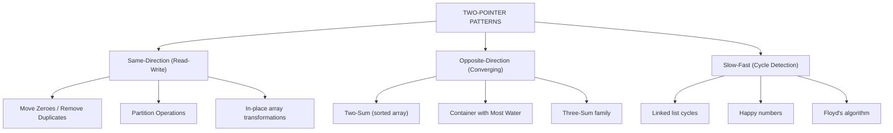


---

### Pattern 1.1: Same-Direction Pointers (Move Zeroes)

**Interactive Resource:** 🔗 [GeeksforGeeks Two-Pointers Examples](https://www.geeksforgeeks.org/dsa/two-pointers-technique/)

#### Visual 1: Array State Evolution


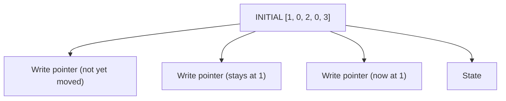


#### Visual 2: Write Pointer as Safe Zone Boundary


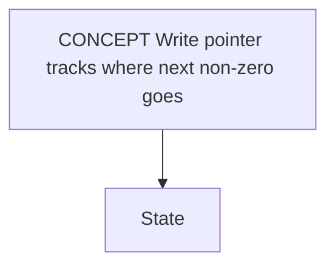


---

### Pattern 1.2: Opposite-Direction Pointers (Container with Most Water)

**Interactive Resource:** 🔗 [ByteByteGo - Two Pointers Pattern](https://bytebytego.com/courses/coding-patterns/two-pointers/introduction-to-two-pointers?fpr=javarevisited)

#### Visual 1: Greedy Pointer Movement Proof


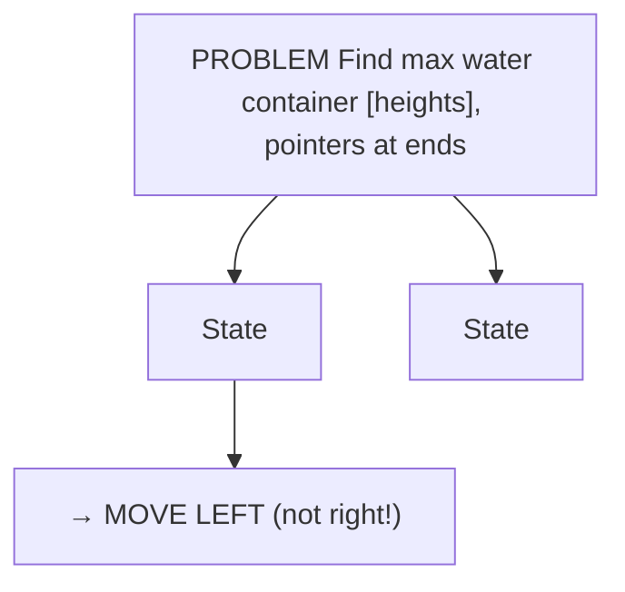


#### Visual 2: Iteration Trace


| Iteration | L | h[L] | R | h[R] | Area | Action |
| :--- | :--- | :--- | :--- | :--- | :--- | :--- |
| 0 | 0 | 1 | 8 | 7 | 8 | L<R, move L→ |
| 1 | 1 | 8 | 8 | 7 | 49 | L>R, move R← |
| 2 | 1 | 8 | 7 | 3 | 24 | L>R, move R← |
| 3 | 1 | 8 | 6 | 8 | 40 | L<R, move L→ |
| 4 | 2 | 6 | 6 | 8 | 30 | L<R, move L→ |
| 5 | 3 | 2 | 6 | 8 | 10 | L<R, move L→ |
| 6 | 4 | 5 | 6 | 8 | 8 | L<R, move L→ |
| 7 | 5 | 4 | 6 | 8 | 4 | L≥R, STOP |


---

### Common Failure Modes (Visual)

#### Failure 1: Off-by-One in Invariant

```
❌ WRONG INVARIANT (closed interval):
[0..writePos] = processed
     ↑ includes writePos

Problem: Inconsistent boundary
  - Is writePos processed? (unclear!)
  - Leads to off-by-one errors

✓ CORRECT INVARIANT (half-open interval):
[0..writePos) = processed
     ↑ excludes writePos (half-open)

Benefit: Clear boundary
  - Everything before writePos is safe
  - writePos is next position to fill
  - No ambiguity!
```

#### Failure 2: Wrong Direction Logic

```
❌ Problem: Container with water

If you move the TALLER pointer inward:
  [1, 8, 6, 2, 5, 4, 8, 3, 7]
   L(1)                    R(7)
   
   Move R ← to 3:
   Area = min(1, 3) × 7 = 7
          (from 8) ↓ WORSE!

✓ Always move SHORTER pointer:
  
  Move L → to 8:
  Area = min(8, 7) × 7 = 49  ↑ BETTER!
```

#### Failure 3: Confusing Converging with Sliding

```
❌ WRONG: Using converging logic for sliding window

Converging (Two-Sum):
  L at start, R at end
  Move INWARD based on sum comparison
  Pointers never cross

Sliding (Subarray):
  L at start, R scanning right
  Move OUTWARD to grow window
  Move L inward to shrink
  Pointers can cross multiple times

❌ Mixing them causes wrong results
✓ Know which pattern you're solving!
```

---

### Mini Review Quiz (Day 1)

**Q1:** In same-direction pointers, what invariant must hold?

```
A) [0..writePos] = processed
B) [0..writePos) = non-zeros | [writePos..end) = zeros
C) [0..i) = processed | [i..end) = unprocessed  
D) Pointers never cross
```
**✅ Answer:** B (half-open interval, explicit zones!)

**Q2:** Why do we move the shorter pointer in container water?

```
A) Alphabetically, 'L' comes before 'R'
B) Moving taller pointer guarantees worse area
C) It's always correct for two-pointer
D) Random choice works
```
**✅ Answer:** B (mathematical guarantee!)

**Q3:** What's the main benefit of write pointer?

```
A) Faster than using temporary array
B) Uses O(1) extra space (in-place)
C) Always finds lexicographically smallest result
D) Makes code shorter
```
**✅ Answer:** B (in-place transformation!)

---

## 🪟 DAY 2: SLIDING WINDOW (FIXED SIZE)

### Pattern Map: Fixed Window Family


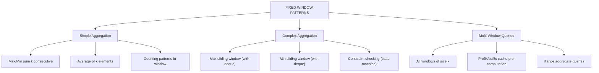


---

### Pattern 2.1: Fixed Window Mechanics & Sliding

**Interactive Resource:** 🔗 [LabulaDong - Sliding Window Framework](https://labuladong.online/algo/en/essential-technique/sliding-window-framework/) (with visualization panel!)

#### Visual 1: Window Slide Storyboard


| 1  2  3 | 4  5 |
| :--- | :--- |
| 1 | 2  3  4 |
| 1  2 | 3  4  5 |


#### Visual 2: Complexity Comparison


| for j=i to i+k-1: | ← Recalculate every time! |
| :--- | :--- |
| sum -= A[i-k] | ← 2 operations |
| sum += A[i] | ← per position |


---

### Pattern 2.2: Monotonic Deque for Max/Min Window

**Interactive Resource:** 🔗 [GeeksforGeeks Sliding Window](https://www.geeksforgeeks.org/dsa/window-sliding-technique/)

#### Visual 1: Monotonic Deque State Evolution


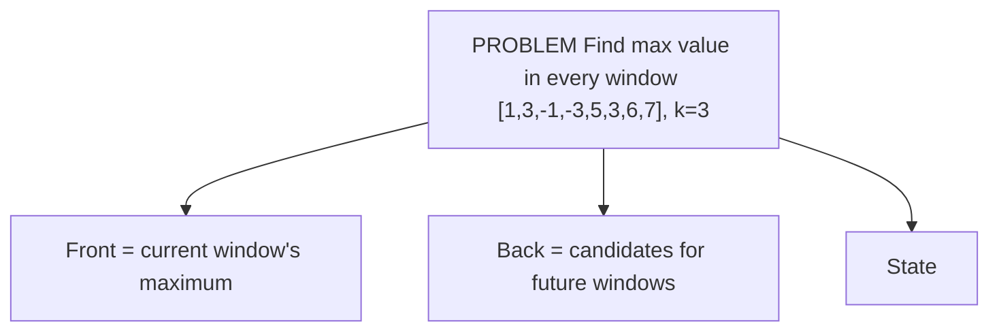


---

### Common Failure Modes (Day 2)

#### Failure 1: Not Checking Window Boundary

```
❌ WRONG:
for i=0 to n-1:
  deque.addLast(i)
  output deque.front()  ← Window not valid yet!

Result: Wrong output at beginning

✓ CORRECT:
for i=0 to n-1:
  deque.addLast(i)
  if i >= k-1:  ← Only output when window is full
    output deque.front()

Result: Correct output starting at index k-1
```

#### Failure 2: Forgetting to Remove Out-of-Window

```
❌ WRONG:
deque.addLast(i)
  (no removal of old indices)

Result: Deque grows beyond window size

✓ CORRECT:
while !deque.empty() && deque.front() <= i - k:
  deque.removeFirst()  ← Remove indices outside window
deque.addLast(i)

Result: Deque only contains current window indices
```

#### Failure 3: Wrong Pruning Condition

```
❌ WRONG:
while nums[deque.back()] < nums[i]:
  deque.removeLast()

Result: May remove elements needed for future windows

✓ CORRECT (monotonic decreasing):
while !deque.empty() && nums[deque.back()] <= nums[i]:
  deque.removeLast()

Result: Maintains strict decreasing order properly
```

---

### Performance Comparison Table (Day 2)


| Algorithm | Time | Space | Best For |
| :--- | :--- | :--- | :--- |
| Naive (recalc each) | O(n×k) | O(1) | k very small |
| Fixed window sum | O(n) | O(1) | Aggregation |
| Prefix sum + queries | O(n+q) | O(n) | Batch queries |
| Monotonic deque | O(n) | O(k) | Max/min window |
| Segment tree | O(n log n) | O(n) | Range queries |


---

## 📏 DAY 3: SLIDING WINDOW (VARIABLE SIZE)

### Pattern Map: Variable Window Family


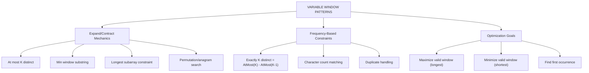


---

### Pattern 3.1: Expand-Contract Mechanics

**Interactive Resource:** 🔗 [HelloInterview - Sliding Window Patterns](https://www.hellointerview.com/learn/code/two-pointers/overview)

#### Visual 1: Two-Phase Decision Flow


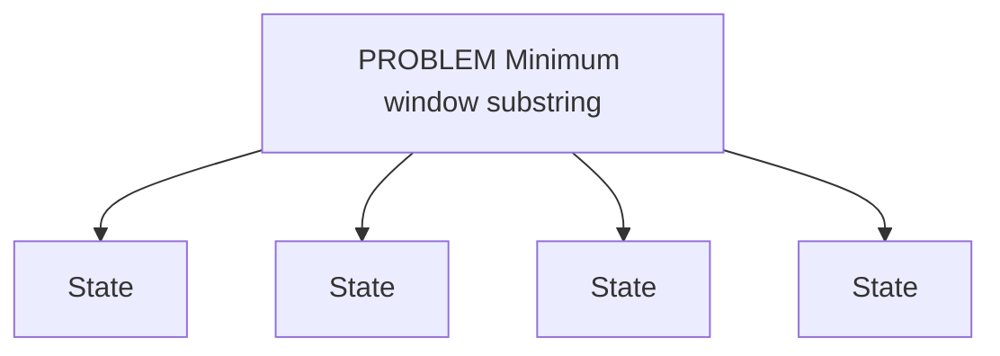


---

### Pattern 3.2: At Most K Distinct Characters

#### Visual 1: Constraint Zones


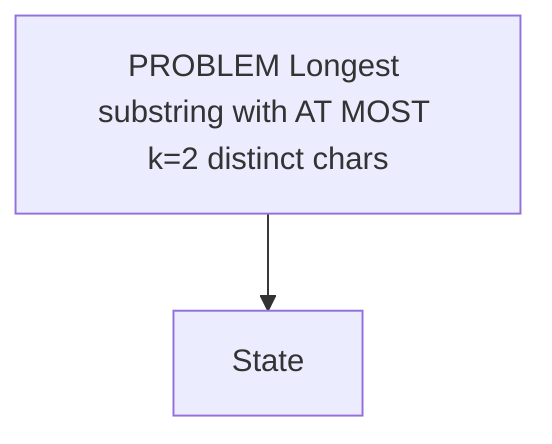


---

### Common Failure Modes (Day 3)

#### Failure 1: Not Maintaining Valid Window Properly

```
❌ WRONG: Record result before checking validity

for right in array:
  add A[right]
  record result  ← May not be valid!
  while not valid:
    shrink

Result: Invalid results recorded

✓ CORRECT: Check validity BEFORE recording

for right in array:
  add A[right]
  while not valid:
    shrink
  record result  ← Now guaranteed valid

Result: Only valid results recorded
```

#### Failure 2: Forgetting to Update Frequency Map

```
❌ WRONG: Modify sum but not frequency map

remove A[left]:
  sum -= A[left]
  left++
  (forgot to update charCount)

Result: charCount is stale, wrong decisions

✓ CORRECT: Always sync frequency map

remove A[left]:
  charCount[A[left]]--
  if charCount[A[left]] == 0:
    remove(A[left])  ← Clean up
  sum -= A[left]
  left++

Result: charCount always accurate
```

---

## ✂️ DAY 4: DIVIDE & CONQUER

### Pattern Map: D&C Family


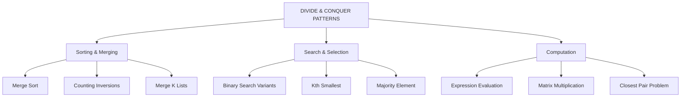


---

### Pattern 4.1: Merge Sort Recursion Tree

#### Visual 1: Tree Structure & Levels


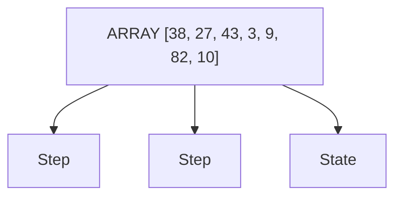


---

### Pattern 4.2: Counting Inversions via Merge

#### Visual 1: Inversion Detection


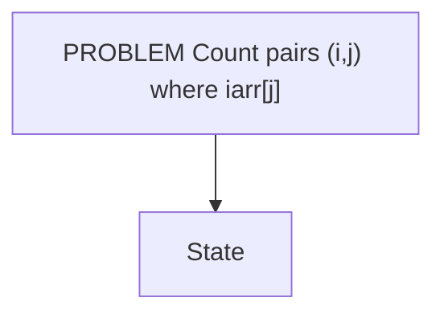


---

## 🔍 DAY 5: BINARY SEARCH AS A PATTERN

### Pattern Map: Binary Search Variants


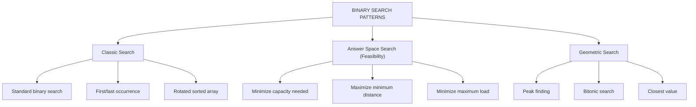


---

### Pattern 5.1: Binary Search Invariant & Overflow Safety

#### Visual 1: Range Narrows at Each Step


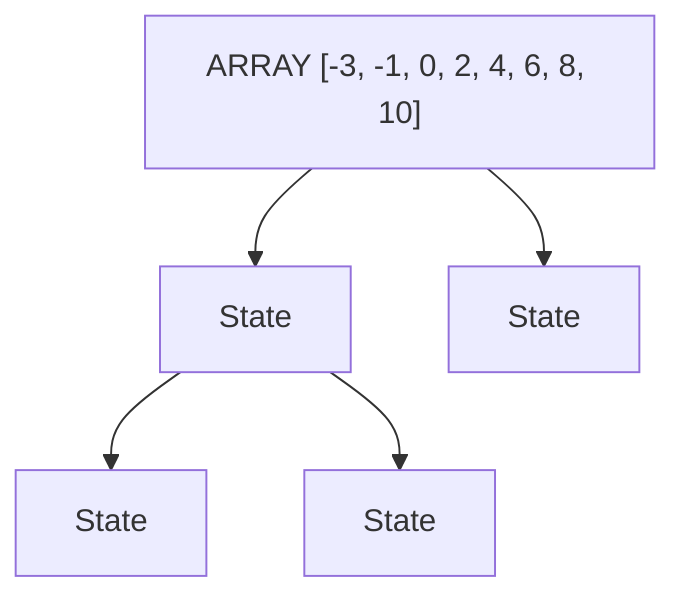


---

### Pattern 5.2: Binary Search on Answer Space

#### Visual 1: Feasibility Curve (Monotonic Property)


| Capacity | Feasible in 3 days? |
| :--- | :--- |
| 1 | ✗ (can't ship [1,2,3,4,5] at all) |
| 2 | ✗ (need multiple days for each) |
| 3 | ✗ |
| 4 | ✗ |
| 5 | ✗ |
| 6 | ✗ |
| 7 | ✗ |
| 8 | ✗ |
| 9 | ✗ |
| 10 | ✗ |
| 11 | ✗ |
| 12 | ✗ |
| 13 | ✗ |
| 14 | ✗ |
| 15 (total) | ✓  ← Can ship everything in 1 day |


---

### Pattern 5.3: Binary Search Templates & Edge Cases

#### Visual 1: First vs Last Occurrence Template

```
ARRAY: [1, 2, 2, 2, 3, 4]
TARGET: 2

FIND FIRST (leftmost 2):
Template:
  if arr[mid] >= target:
    hi = mid  (answer could be here or left)
  else:
    lo = mid + 1

Trace:
  lo=0, hi=5
  mid=2: arr[2]=2 >= 2, hi=2
  lo=0, hi=2
  mid=1: arr[1]=2 >= 2, hi=1
  lo=0, hi=1
  mid=0: arr[0]=1 < 2, lo=1
  lo=1, hi=1
  Result: arr[1] = 2 (first occurrence)

FIND LAST (rightmost 2):
Template:
  if arr[mid] <= target:
    lo = mid + 1  (answer could be here or right)
  else:
    hi = mid

Trace:
  lo=0, hi=5
  mid=2: arr[2]=2 <= 2, lo=3
  lo=3, hi=5
  mid=4: arr[4]=3 > 2, hi=4
  lo=3, hi=4
  mid=3: arr[3]=2 <= 2, lo=4
  lo=4, hi=4
  Result: arr[3] = 2 (last occurrence)
```

---

### Common Failure Modes (Day 5)

#### Failure 1: Infinite Loop from No Progress

```
❌ WRONG:
if arr[mid] < target:
  lo = mid  ← No progress! lo doesn't advance

This creates infinite loop if mid = lo

✓ CORRECT:
if arr[mid] < target:
  lo = mid + 1  ← Always make progress

This ensures lo and hi eventually converge
```

#### Failure 2: Wrong Comparison for First vs Last

```
❌ WRONG (confusing templates):
Find first: if (arr[mid] == target) hi = mid-1
  This skips the target entirely!

✓ CORRECT:
Find first: if (arr[mid] >= target) hi = mid
  This narrows to leftmost boundary

Find last: if (arr[mid] <= target) lo = mid+1
  This narrows to rightmost boundary
```

---

## 🎯 WEEK 04 VISUAL SUMMARY TABLE


| DAY | PATTERN | Key Visual Type | Complexity |
| :--- | :--- | :--- | :--- |
| 1 | Two-Pointer | Pointer zones | O(n) / O(1) |
|  | Opposite-dir/ | Convergence | space |
|  | Same-dir | diagrams |  |
|  |  |  |  |
| 2 | Sliding Window | Window slide | O(n) / O(k) |
|  | Fixed Size | storyboard | space |
|  | + Deque | Monotonic deque |  |
|  |  |  |  |
| 3 | Sliding Window | Expand-contract | O(n) / |
|  | Variable Size | Frequency map | O(charset) |
|  |  | Constraint zones | space |
|  |  |  |  |
| 4 | Divide & Conquer | Recursion tree | O(n log n) / |
|  | (Merge Sort, | Level analysis | O(n) space |
|  | Inversions) | Inversion count |  |
|  |  |  |  |
| 5 | Binary Search | Range narrowing | O(log n) / |
|  | (Classic + | Feasibility | O(1) space |
|  | Answer Space) | curve |  |
|  |  | Peak finding |  |


---

## 📋 COMMON PATTERNS QUICK REFERENCE


| Pattern | Use When | Time/Space |
| :--- | :--- | :--- |
| Two-pointer opposite | Find pair sum, container, 3-sum | O(n) / O(1) |
| Two-pointer same-dir | In-place remove/partition | O(n) / O(1) |
| Fixed window | Max/min k consecutive | O(n) / O(k) |
| Monotonic deque | Sliding max/min with all values | O(n) / O(k) |
| Variable window | At most k distinct, min window | O(n) / O(k) |
| Merge sort | Sort + count inversions | O(n logn)/O(n) |
| Partition sort | Find kth smallest, sort | O(n) avg/O(n) |
| Binary search | Search in sorted, answer space | Time O(log n), Space O(1) |
| Peak finding | Local max in unsorted array | Time O(log n), Space O(1) |


---

## 🔗 RECOMMENDED LEARNING RESOURCES

### Interactive Visualizations
1. **VisuAlgo** (https://visualgo.net) — Best for data structure visualization
2. **LabulaDong** (https://labuladong.online) — Sliding window framework with panels
3. **HelloInterview** (https://www.hellointerview.com) — Real-time coding practice
4. **ByteByteGo** (https://bytebytego.com) — Professional coding pattern courses

### Comprehensive Guides
- **GeeksforGeeks Two-Pointers** - Full technique explanations
- **GeeksforGeeks Sliding Window** - Sliding window patterns
- **USACO Guide** - Two-pointer problems and solutions

### Video Tutorials
- Sliding Window in 7 minutes (AlgoMaster) — Quick visual intro
- Binary Search visualizations — Recursion and range narrowing

---

## 📝 HOW TO USE THIS PLAYBOOK

### Quick Revision (30 mins)
1. Scan pattern maps (5 mins)
2. Read one day's main visuals (5 mins per day)
3. Answer mini quiz (3 mins per day)
4. Review failure modes (2 mins per day)

### Deep Learning (2-3 hours)
1. Read playbook + extended subtopics guide
2. Visit web resource links for interactive visualizations
3. Implement code from main instructional files
4. Solve practice problems using visuals as reference

### Interview Prep
1. Open playbook for quick pattern reminders
2. Use resource links for visual refresh
3. Mentally trace algorithm using playbook diagrams
4. Code from memory with confidence

---

**Use web resource links for interactive visualizations while studying!**

---

> 🧭 **Navigation:** [🏠 Week Overview](README.md) • [📘 Curriculum Syllabus](../COMPLETE_SYLLABUS_v13.md)
