# 🗺️ WEEK_04_PROBLEM_SOLVING_ROADMAP_EXTENDED_CSHARP

**Version:** v1.0  
**Purpose:** Week-specific C# problem-solving playbook  
**Target:** Transform pattern knowledge into C# coding fluency  
**Prerequisites:** Week 04 instructional files + standard support files complete

---

## 🎯 WEEK 04 PROBLEM-SOLVING FRAMEWORK

**Decision Tree (Week 04 Patterns):**[1]

| Problem Phrases/Signals                                                                                                | 🎯 Primary Pattern                          | C# Collection                                                 | Time/Space            |
| ---------------------------------------------------------------------------------------------------------------------- | ------------------------------------------- | ------------------------------------------------------------- | --------------------- |
| “Two numbers”, “pair”, “sorted array”, “closest”, “max area”, “merge two sorted arrays”                                | Two pointers                                | None / `List<T>`                                              | O(n)/O(1) to O(n)     |
| “Contiguous subarray”, “substring”, “window size k”, “longest/shortest subarray”, “at most K distinct”, “sum ≤ target” | Sliding window (fixed or variable)          | `Dictionaryhar,int>`, `int[] freq`, `LinkedList<int>` (deque) | O(n)/O(1) to O(k)     |
| “Find minimum X such that…”, “maximize minimum…”, “minimize maximum…”, “capacity”, “speed”, “days”, “feasible?”        | Binary search on answer space (feasibility) | None / helper method                                          | O(n log R)/O(1)       |
| “Split into halves”, “combine results”, “sort”, “count inversions”, “majority element variant”                         | Divide and conquer                          | `int[] temp`                                                  | Often O(n log n)/O(n) |

**Anti-Patterns:**[1]

-   ❌ Sorting a string/array for a contiguous substring constraint → Use sliding window instead.
-   ❌ Trying every capacity/speed linearly from 1..R → Use binary search on answer space.
-   ❌ Using nested loops for “pair in sorted array” → Use two pointers.
-   ❌ Implementing merge sort with per-merge allocations → Reuse one `temp` buffer.

---

### 📌 Visual Pattern Choice Flow (Mermaid)

```mermaid
    flowchart TD
        A[Start] --> B{Is input sorted OR can it be sorted without breaking the requirement?}
        B -->|Yes| C{Goal is element index/value in sorted structure?}
        C -->|Yes| D[Binary search on sorted array]
        C -->|No| E["Two pointers (opposite/same direction)"]
        B -->|No| F{Need contiguous subarray/substring window?}
        F -->|Yes| G{Fixed window size k?}
        G -->|Yes| H[Sliding window fixed size]
        G -->|No| I[Sliding window variable size]
        F -->|No| J{Problem asks minimize maximum / maximize minimum?}
        J -->|Yes| K[Binary search on answer space + feasibility check]
        J -->|No| L{Split into independent halves + combine?}
        L -->|Yes| M["Divide and conquer (merge sort variants)"]
        L -->|No| N[Not Week 4 core patterns → reconsider signals]
```



## High-level decision flow image:

### 📊 Complexity “Graph Chart” (Illustrative)

**Relative operation counts (illustrative for n=100k, R=1e9):**

.png)

## 💻 C# PATTERN IMPLEMENTATIONS (Week 04)

> Constraint reminder from the extended-support prompt: templates focus on implementation, not teaching.[2]
> Week 04 topics include Two Pointers, Sliding Window (fixed/variable), Divide & Conquer, Binary Search as a pattern.[1]

---

### Pattern 1: TWO POINTERS (All Variants)

**C# Mental Model:** Like moving two indices over one array buffer; one pass, invariant-driven.

**When to Use:**[1]

-   ✅ Pair constraints in sorted arrays (sum/closest)
-   ✅ In-place filtering / compaction (remove duplicates, move zeros)
-   ✅ “Meet from both ends” optimization (max container area)

#### Visual: Pointer Motion

```text
Opposite direction:
L -> .......... <- R

Same direction (reader/writer):
W -> (writes clean prefix)
R -> (reads/explores full array)
Invariant: [0..W-1] is already "final"
```

---

#### Variant 1A: Opposite direction (Converging) — Target Pair on Sorted

**Core C# Skeleton:**

```csharp
// Two pointers (opposite) - find a pair in sorted array
public int[] Solve(int[] numbers, int target)
{
    if (numbers == null || numbers.Length == 0) return Array.Empty<int>();

    int left = 0;
    int right = numbers.Length - 1;

    while (left < right)
    {
        long sum = (long)numbers[left] + numbers[right];

        if (sum == target) return new[] { left, right };
        if (sum < target) left++;
        else right--;
    }

    return Array.Empty<int>();
}
```

**C# Notes:**

-   Use `long` for sum to avoid overflow on extreme ints.
-   Return policy: empty array or nullable tuple—pick one consistently.

---

#### Variant 1B: Opposite direction — Maximize Container Area

**Core C# Skeleton:**

```csharp
// Two pointers (opposite) - maximize area
public int Solve(int[] height)
{
    if (height == null || height.Length == 0) return 0;

    int left = 0;
    int right = height.Length - 1;
    int best = 0;

    while (left < right)
    {
        int h = Math.Min(height[left], height[right]);
        int w = right - left;
        best = Math.Max(best, h * w);

        if (height[left] < height[right]) left++;
        else right--;
    }

    return best;
}
```

**C# Notes:**

-   Area fits in int for typical constraints; switch to `long` if needed.

---

#### Variant 1C: Same direction — Remove Duplicates (Sorted)

**Core C# Skeleton:**

```csharp
// Two pointers (same direction) - remove duplicates in-place
public int Solve(int[] nums)
{
    if (nums == null || nums.Length == 0) return 0;

    int write = 1;

    for (int read = 1; read < nums.Length; read++)
    {
        if (nums[read] != nums[write - 1])
        {
            nums[write] = nums[read];
            write++;
        }
    }

    return write;
}
```

**C# Notes:**

-   Invariant: `nums[0..write-1]` is unique.
-   Works only because input is sorted.

---

#### Variant 1D: Same direction — Move Zeros (Stable Compaction)

**Core C# Skeleton:**

```csharp
// Two pointers (same direction) - move zeros to end, keep relative order
public void Solve(int[] nums)
{
    if (nums == null || nums.Length == 0) return;

    int write = 0;
    for (int read = 0; read < nums.Length; read++)
    {
        if (nums[read] != 0)
        {
            nums[write] = nums[read];
            write++;
        }
    }

    while (write < nums.Length)
    {
        nums[write] = 0;
        write++;
    }
}
```

**C# Notes:**

-   Two-phase fill avoids extra allocations.

---

#### Variant 1E: Two pointers for merging sorted arrays (Same direction merge into new)

**Core C# Skeleton:**

```csharp
// Two pointers - merge two sorted arrays into a new array
public int[] Solve(int[] a, int[] b)
{
    if (a == null) a = Array.Empty<int>();
    if (b == null) b = Array.Empty<int>();

    int i = 0, j = 0;
    int[] result = new int[a.Length + b.Length];
    int k = 0;

    while (i < a.Length && j < b.Length)
    {
        if (a[i] <= b[j]) result[k++] = a[i++];
        else result[k++] = b[j++];
    }

    while (i < a.Length) result[k++] = a[i++];
    while (j < b.Length) result[k++] = b[j++];

    return result;
}
```

**C# Notes:**

-   Stable merge uses `<=`.

---

### Pattern 2: SLIDING WINDOW (Fixed + Variable Variants)

**C# Mental Model:** Like a moving frame; update state incrementally rather than recompute.

**When to Use:**[1]

-   ✅ Fixed size k (average/sum/max in each window)
-   ✅ Variable constraints (“at most K distinct”, “sum ≤ target”, “no repeats”)

#### Visual: Window Updates

```text
Fixed window (k):
[ L .... R ]  size always k
Advance by: remove nums[L], L++, R++, add nums[R]

Variable window:
Expand R -> update state
While invalid: shrink L -> update state
```

---

#### Variant 2A: Fixed Window — Max Sum / Max Average

**Core C# Skeleton:**

```csharp
// Sliding window (fixed) - max sum of subarray size k
public long Solve(int[] nums, int k)
{
    if (nums == null || nums.Length == 0) return 0;
    if (k <= 0 || k > nums.Length) throw new ArgumentException("Invalid k");

    long sum = 0;
    for (int i = 0; i < k; i++) sum += nums[i];

    long best = sum;

    for (int right = k; right < nums.Length; right++)
    {
        sum += nums[right];
        sum -= nums[right - k];
        best = Math.Max(best, sum);
    }

    return best;
}
```

**C# Notes:**

-   Use `long` for running sums.

---

#### Variant 2B: Fixed Window — Max in Each Window (Deque)

**Core C# Skeleton:**

```csharp
// Sliding window (fixed) - max in each window using deque of indices
public int[] Solve(int[] nums, int k)
{
    if (nums == null || nums.Length == 0) return Array.Empty<int>();
    if (k <= 0) throw new ArgumentException("Invalid k");

    var dq = new LinkedList<int>(); // indices
    var output = new int[nums.Length - k + 1];
    int outIndex = 0;

    for (int i = 0; i < nums.Length; i++)
    {
        // Remove out-of-window
        while (dq.Count > 0 && dq.First.Value <= i - k)
            dq.RemoveFirst();

        // Maintain decreasing order
        while (dq.Count > 0 && nums[dq.Last.Value] <= nums[i])
            dq.RemoveLast();

        dq.AddLast(i);

        if (i >= k - 1)
            output[outIndex++] = nums[dq.First.Value];
    }

    return output;
}
```

**C# Notes:**

-   `LinkedList<int>` behaves as a deque (remove/add at both ends).

---

#### Variant 2C: Variable Window — Longest Substring Without Repeating Characters (Jump Left)

**Core C# Skeleton:**

```csharp
// Sliding window (variable) - longest substring without repeating characters
public int Solve(string s)
{
    if (string.IsNullOrEmpty(s)) return 0;

    int[] lastSeen = new int[128];
    Array.Fill(lastSeen, -1);

    int left = 0;
    int best = 0;

    for (int right = 0; right < s.Length; right++)
    {
        char c = s[right];
        if (lastSeen[c] >= left)
            left = lastSeen[c] + 1;

        lastSeen[c] = right;
        best = Math.Max(best, right - left + 1);
    }

    return best;
}
```

**C# Notes:**

-   For full Unicode, use `Dictionaryhar,int>` instead of `int[128]`.

---

#### Variant 2D: Variable Window — At Most K Distinct Characters

**Core C# Skeleton:**

```csharp
// Sliding window (variable) - longest substring with at most k distinct chars
public int Solve(string s, int k)
{
    if (string.IsNullOrEmpty(s) || k <= 0) return 0;

    var freq = new Dictionaryhar, int>();
    int left = 0;
    int best = 0;

    for (int right = 0; right < s.Length; right++)
    {
        char c = s[right];
        freq.TryGetValue(c, out int count);
        freq[c] = count + 1;

        while (freq.Count > k)
        {
            char d = s[left++];
            freq[d]--;
            if (freq[d] == 0) freq.Remove(d);
        }

        best = Math.Max(best, right - left + 1);
    }

    return best;
}
```

**C# Notes:**

-   `TryGetValue` avoids double hashing.

---

#### Variant 2E: Variable Window — Minimum Size Subarray Sum (Positive Integers)

**Core C# Skeleton:**

```csharp
// Sliding window (variable) - minimum length subarray with sum >= target
public int Solve(int target, int[] nums)
{
    if (nums == null || nums.Length == 0) return 0;

    int left = 0;
    long sum = 0;
    int best = int.MaxValue;

    for (int right = 0; right < nums.Length; right++)
    {
        sum += nums[right];

        while (sum >= target)
        {
            best = Math.Min(best, right - left + 1);
            sum -= nums[left++];
        }
    }

    return best == int.MaxValue ? 0 : best;
}
```

**C# Notes:**

-   Only valid for non-negative / positive integers (monotonic sum on shrink).

---

### Pattern 3: DIVIDE AND CONQUER (Week 04)

**C# Mental Model:** Recursively solve left/right halves, then combine.

**When to Use:**[1]

-   ✅ Merge sort
-   ✅ Counting inversions (merge-based)
-   ✅ Majority element variants (split + combine)

#### Visual: Recursion Split / Merge

```text
[0..7]
 /   \
[0..3] [4..7]
 / \     / \
...      ...
merge up the tree
```

---

#### Variant 3A: Merge Sort (Single Temp Buffer)

**Core C# Skeleton:**

```csharp
// Divide and conquer - merge sort with one reusable buffer
public void Solve(int[] arr)
{
    if (arr == null || arr.Length <= 1) return;

    int[] temp = new int[arr.Length];
    Sort(arr, temp, 0, arr.Length - 1);
}

private void Sort(int[] arr, int[] temp, int low, int high)
{
    if (low >= high) return;

    int mid = low + (high - low) / 2;

    Sort(arr, temp, low, mid);
    Sort(arr, temp, mid + 1, high);

    if (arr[mid] <= arr[mid + 1]) return; // already sorted boundary

    Merge(arr, temp, low, mid, high);
}

private void Merge(int[] arr, int[] temp, int low, int mid, int high)
{
    for (int i = low; i <= high; i++) temp[i] = arr[i];

    int iLeft = low;
    int iRight = mid + 1;
    int dest = low;

    while (iLeft <= mid && iRight <= high)
    {
        if (temp[iLeft] <= temp[iRight]) arr[dest++] = temp[iLeft++];
        else arr[dest++] = temp[iRight++];
    }

    while (iLeft <= mid) arr[dest++] = temp[iLeft++];
}
```

**C# Notes:**

-   Reuse `temp` to avoid repeated allocations.
-   Skip merge when boundary already ordered.

---

### Pattern 4: BINARY SEARCH AS A PATTERN (Sorted + Answer Space)

**C# Mental Model:** Search a monotonic boolean boundary: False…False…True…True.

**When to Use:**[1]

-   ✅ Search in sorted arrays (classic)
-   ✅ “Minimum speed/capacity” (minimize maximum)
-   ✅ “Maximum minimum distance” (maximize minimum)

#### Visual: Monotonic Feasibility

```text
Answer space: 1  2  3  4  5  6  7
check(x):     F  F  F  T  T  T  T
Goal (min): find first T
Goal (max): find last  T
```

---

#### Variant 4A: Classic Binary Search (Find Index in Sorted Array)

**Core C# Skeleton:**

```csharp
// Binary search (sorted array) - find index of target
public int Solve(int[] nums, int target)
{
    if (nums == null || nums.Length == 0) return -1;

    int left = 0, right = nums.Length - 1;

    while (left <= right)
    {
        int mid = left + (right - left) / 2;

        if (nums[mid] == target) return mid;
        if (nums[mid] < target) left = mid + 1;
        else right = mid - 1;
    }

    return -1;
}
```

**C# Notes:**

-   `mid = left + (right - left)/2` avoids overflow.

---

#### Variant 4B: Binary Search on Answer Space (Minimize) — “First True”

**Core C# Skeleton:**

```csharp
// Binary search (answer space) - minimize: find first feasible
public int Solve(int low, int high, Func<int, bool> isFeasible)
{
    int ans = high;

    while (low <= high)
    {
        int mid = low + (high - low) / 2;

        if (isFeasible(mid))
        {
            ans = mid;
            high = mid - 1;
        }
        else
        {
            low = mid + 1;
        }
    }

    return ans;
}
```

**C# Notes:**

-   Always update `ans` only when feasible.

---

#### Variant 4C: Binary Search on Answer Space (Maximize) — “Last True”

**Core C# Skeleton:**

```csharp
// Binary search (answer space) - maximize: find last feasible
public int SolveMax(int low, int high, Func<int, bool> isFeasible)
{
    int ans = low;

    while (low <= high)
    {
        int mid = low + (high - low) / 2;

        if (isFeasible(mid))
        {
            ans = mid;
            low = mid + 1;
        }
        else
        {
            high = mid - 1;
        }
    }

    return ans;
}
```

**C# Notes:**

-   In maximize form, move `low` upward on feasible.

---

#### Variant 4D: Feasibility Template — “Capacity / Days” (Ship Packages)

**Core C# Skeleton:**

```csharp
// Feasibility check: can finish within D days using given capacity?
public bool CanShip(int[] weights, int days, int capacity)
{
    int usedDays = 1;
    int current = 0;

    foreach (int w in weights)
    {
        if (current + w > capacity)
        {
            usedDays++;
            current = 0;
            if (usedDays > days) return false;
        }
        current += w;
    }
    return true;
}
```

**C# Notes:**

-   Bounds: `low = max(weights)`, `high = sum(weights)`.

---

#### Variant 4E: Feasibility Template — “Speed / Hours” (Koko Eating Bananas)

**Core C# Skeleton:**

```csharp
// Feasibility check: can finish within H hours using speed k?
public bool CanFinish(int[] piles, int h, int speed)
{
    long hours = 0;
    foreach (int pile in piles)
    {
        hours += (pile + speed - 1) / speed; // ceiling division
        if (hours > h) return false;
    }
    return hours <= h;
}
```

**C# Notes:**

-   Use `long` to avoid overflow in accumulated hours.

---

## 📊 PROGRESSIVE PROBLEM LADDER (Week 04)

### 🟢 Stage 1: Canonical

| #   | LeetCode                                | Difficulty | Pattern                 | C# Focus                     |
| --- | --------------------------------------- | ---------- | ----------------------- | ---------------------------- |
| 1   | #167 Two Sum II                         | 🟢/🟡      | Two pointers (opposite) | `long` sum, pointer movement |
| 2   | #26 Remove Duplicates from Sorted Array | 🟢         | Two pointers (same)     | write/read invariant         |
| 3   | #643 Maximum Average Subarray I         | 🟢         | Sliding window (fixed)  | `long` rolling sum           |
| 4   | #704 Binary Search                      | 🟢         | Binary search (sorted)  | overflow-safe mid            |

### 🟡 Stage 2: Variations

| #   | LeetCode                                          | Difficulty | Pattern+Twist             | C# Focus                   |
| --- | ------------------------------------------------- | ---------- | ------------------------- | -------------------------- |
| 1   | #3 Longest Substring Without Repeating Characters | 🟡         | Sliding window (variable) | `int[128]` last seen       |
| 2   | #239 Sliding Window Maximum                       | 🔴/🟡      | Fixed window + deque      | `LinkedList<int>` as deque |
| 3   | #11 Container With Most Water                     | 🟡         | Two pointers greedy       | pointer move rule          |
| 4   | #875 Koko Eating Bananas                          | 🟡         | Binary search on answer   | ceiling division, `long`   |

### 🟠 Stage 3: Integration

| #   | LeetCode                                      | Difficulty | Patterns                               | C# Focus                      |
| --- | --------------------------------------------- | ---------- | -------------------------------------- | ----------------------------- |
| 1   | #410 Split Array Largest Sum                  | 🔴         | Binary search on answer + greedy split | careful bounds + feasibility  |
| 2   | #1011 Capacity To Ship Packages Within D Days | 🟡         | Binary search on answer + feasibility  | sum bounds + early exit       |
| 3   | #912 Sort an Array                            | 🟡         | Divide and conquer (merge sort)        | single temp buffer            |
| 4   | #76 Minimum Window Substring                  | 🔴         | Sliding window variable                | Dictionary counts correctness |

---

## ⚠ WEEK 04 PITFALLS & C# GOTCHAS

| Pattern                   | Common Bug                                   | C# Symptom             | Quick Fix                                 |
| ------------------------- | -------------------------------------------- | ---------------------- | ----------------------------------------- |
| Two pointers              | Overflow on `a+b`                            | Wrong comparisons      | Use `long` for sum                        |
| Sliding window (fixed)    | Wrong outgoing index                         | Off-by-one answers     | subtract `nums[right-k]` after adding new |
| Sliding window (variable) | Using `if` instead of `while` when shrinking | Window remains invalid | shrink in `while` loop                    |
| Deque window max          | Not removing out-of-window indices           | Wrong maxima           | pop front when `<= i-k`                   |
| Merge sort                | Allocating temp array inside merge           | Slow / GC pressure     | Allocate `temp` once                      |
| Binary search answer      | Wrong `low/high` bounds                      | Misses solution        | derive tight bounds (`max`, `sum`)        |
| Binary search answer      | Infinite loop (wrong updates)                | Hang                   | always do `high=mid-1` or `low=mid+1`     |
| Feasibility checks        | int overflow in accumulated work             | negative totals        | use `long` accumulators                   |

**Week 04 Collection Guide:**

-   ✅ `Dictionaryhar,int>`: variable window character frequencies.
-   ✅ `int[]` frequency/lastSeen: fastest for ASCII constraints.
-   ✅ `LinkedList<int>`: deque for max window.
-   ✅ Plain arrays + indices: two pointers and merge sort.

---

## ✅ WEEK COMPLETION CHECKLIST

**Pattern Fluency:**

-   [ ] Recall two pointers (opposite) skeleton
-   [ ] Recall two pointers (same direction) skeleton
-   [ ] Recall sliding window (fixed size) skeleton
-   [ ] Recall sliding window (variable size) skeleton
-   [ ] Recall divide and conquer merge sort skeleton
-   [ ] Recall binary search (sorted) skeleton
-   [ ] Recall binary search (answer space minimize/maximize) skeleton

**Problem Solving:**

-   [ ] Solved Stage 1 canonical (at least 4)
-   [ ] 80%+ Stage 2 variations
-   [ ] Solved at least 2 Stage 3 integration problems

**C# Implementation:**

-   [ ] Used correct collections (`Dictionary`, `LinkedList`, arrays)
-   [ ] Handled edge cases (empty, single, large sums)
-   [ ] No overflow bugs (`long` used where needed)

**Ready:** [ ] Yes

---
