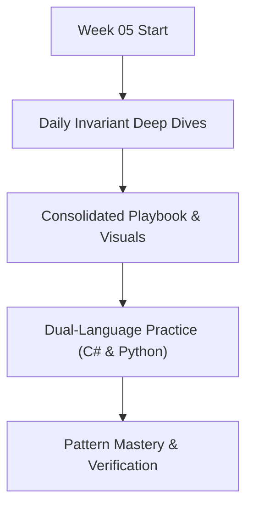

# 📘 Tier 1 Critical Patterns

> 🧭 **Navigation:** [← Previous: Week 04](../week_04_core_problem_solving_patterns_i/README.md) • [🏠 Curriculum Overview](../README.md) • [📘 Complete Syllabus](../COMPLETE_SYLLABUS.md) • [Next: Week 06 →](../week_06_string_manipulation_patterns/README.md)

---

> 💡 **Instructor Guidance Note:**  
> *Not all sections or topics are mandatory. As a learner, you can adapt your pace freely. If you are preparing on an accelerated interview timeline or already feel confident with specific foundational concepts, feel free to skip or skim optional topics and prioritize high-yield patterns based on your personal interview goals.*

---

## 🎯 Weekly Mission & Conceptual Focus

The highest-ROI interview patterns: Hash map frequency arrays, monotonic stack next-greater elements, interval merging, cyclic sort, and fast-slow pointers.

---

## 📅 Day-by-Day Learning Path

| Day | Instructional Module | Focus & Core Objective |
| :--- | :--- | :--- |
| **Day 01** | [Hash Map Hash Set Patterns Instructional EXPANDED](Week_05_Day_01_Hash_Map_Hash_Set_Patterns_Instructional_EXPANDED.md) | Core Daily Concept Deep Dive |
| **Day 02** | [Monotonic Stack Patterns](Week_05_Day_02_Monotonic_Stack_Patterns_Instructional.md) | Core Daily Concept Deep Dive |
| **Day 03** | [Merge Operations Interval Patterns](Week_05_Day_03_Merge_Operations_Interval_Patterns_Instructional.md) | Core Daily Concept Deep Dive |
| **Day 04 Part A** | [Partition Cyclic Sort](Week_05_Day_04_Part_A_Partition_Cyclic_Sort_Instructional.md) | Core Daily Concept Deep Dive |
| **Day 04 Part B** | [Kadane Algorithm](Week_05_Day_04_Part_B_Kadane_Algorithm_Instructional.md) | Core Daily Concept Deep Dive |
| **Day 05** | [Fast Slow Pointers](Week_05_Day_05_Fast_Slow_Pointers_Instructional.md) | Core Daily Concept Deep Dive |

---

## 📚 Consolidated Playbooks & Reference Guides

*   📖 **Comprehensive Week Playbook:** [WEEK_05_FULL_PLAYBOOK.md](WEEK_05_FULL_PLAYBOOK.md) — High-density synthesis of all invariants, theorems, and pattern triggers for this week.
*   📊 **Visual Concepts Playbook (Hybrid):** [Week_05_Visual_Concepts_Playbook_HYBRID.md](Week_05_Visual_Concepts_Playbook_HYBRID.md) — Compact Mermaid diagrams, state transitions, and complexity reference tables.
*   💻 **Production C# Reference (.NET 8/9):** [Week_05_Extended_CSharp_Complete.md](Week_05_Extended_CSharp_Complete.md) — Idiomatic, zero-allocation memory-aware implementations and problem ladders.
*   🐍 **Production Python Reference (Python 3.11+):** [Week_05_Extended_Python_Complete.md](Week_05_Extended_Python_Complete.md) — Clean, pythonic reference implementations for rapid whiteboard prototyping.

---

## 🛠️ The 5 Core Support Files (`support files/`)

Every week is accompanied by five dedicated support files located in the `support files/` subdirectory:

1.  📋 [Daily Progress Checklist](support%20files/Week_05_Daily_Progress_Checklist.md) — Step-by-step accountability tracker for theory, coding, and variants.
2.  🧭 [Weekly Guidelines & Mental Models](support%20files/Week_05_Guidelines.md) — Strategic roadmap, common pitfalls, and conceptual anchors.
3.  🎙️ [Interview Q&A Comprehensive Reference](support%20files/Week_05_Interview_QA_Reference.md) — High-frequency senior technical questions with verbal response frameworks.
4.  🗺️ [Problem-Solving Roadmap](support%20files/Week_05_Problem_Solving_Roadmap.md) — Tier-1 problem progression ladder from warm-up to advanced.
5.  📑 [Summary & Key Concepts Synthesis](support%20files/Week_05_Summary_Key_Concepts.md) — Fast-revision cheat sheet covering all governing invariants and system trade-offs.

---

> 🧭 **Navigation:** [← Previous: Week 04](../week_04_core_problem_solving_patterns_i/README.md) • [🏠 Curriculum Overview](../README.md) • [📘 Complete Syllabus](../COMPLETE_SYLLABUS.md) • [Next: Week 06 →](../week_06_string_manipulation_patterns/README.md)
