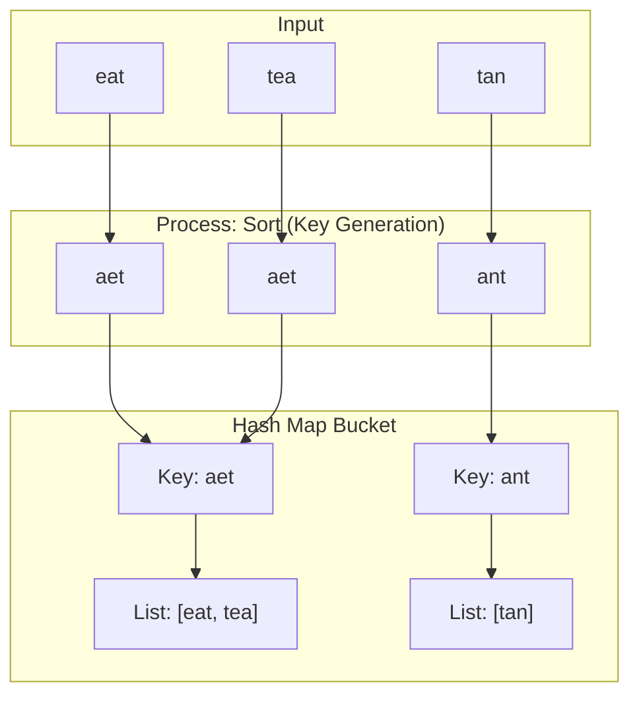

# 🎯 WEEK 5 DAY 1: HASH MAP & HASH SET PATTERNS — COMPLETE GUIDE

**Category:** Core Problem-Solving Patterns / Optimization  
**Difficulty:** 🟢 Easy to 🟡 Medium  
**Prerequisites:** Hashing & Sets (Week 3 Day 1), Arrays (Week 2 Day 1)  
**Interview Frequency:** 90% (Extremely High — the most common optimization tool)  
**Real-World Impact:** Database Indexing, Caching, Symbol Tables, Unique Constraints

---

## 🎓 LEARNING OBJECTIVES

By the end of this topic, you will be able to:

- ✅ **Identify** problems where Hash Maps reduce complexity from O(N²) to O(N).
- ✅ **Apply** the Two-Sum / K-Sum pattern to find pairs or complements in linear time.
- ✅ **Utilize** Frequency Counting to solve anagram, majority element, and permutation problems.
- ✅ **Implement** membership testing and duplicate detection using Hash Sets.
- ✅ **Differentiate** when to store indices vs. frequencies vs. boolean flags in the map.

| 🎯 Objective | 📍 Primary Section |
|:---|:---|
| Core Philosophy & Mental Model | Section 2: The What |
| Mechanical Implementation Steps | Section 3: The How |
| Worked Examples with Traces | Section 4: Visualization |
| Complexity & Performance Analysis | Section 5: Critical Analysis |
| Real-World Production Systems | Section 6: Real Systems |

---

## 🤔 SECTION 1: THE WHY — Engineering Motivation

### 🎯 Real-World Problems This Solves

#### Problem 1: Database Query Optimization (Join Operations)

**🌍 Where:** SQL Databases (PostgreSQL, MySQL), Distributed Data Engines (Spark)  
**💼 Concrete Challenge:**  
You have two massive tables: `Users` (1 million rows) and `Orders` (10 million rows). You need to find all orders belonging to a specific set of users.  

**Traditional Approach (Nested Loop Join):**  
For each user (1M), scan all orders (10M).  
Complexity: 1M × 10M = 10¹³ operations (Too slow).

**Hash Join Approach:**  
1. Build a Hash Map of the smaller table (`Users`) based on `UserID` → O(N).  
2. Scan the larger table (`Orders`) and check if `Order.UserID` exists in the map → O(M).  
Complexity: O(N + M) ≈ 11M operations.

**Impact:** Reduces query time from hours to seconds.

---

#### Problem 2: Caching & Deduplication (CDN/Browser)

**🌍 Where:** Cloudflare, Akamai, Chrome Browser Cache  
**💼 Concrete Challenge:**  
A CDN receives millions of requests per second for images. How do we ensure we only store/fetch each unique image once, even if requested by thousands of users?

**Pattern:**  
- Compute a unique **Hash** (SHA-256) of the file content.  
- Use a **Hash Set** to track "seen" hashes.  
- If `Hash` is in Set, serve from cache. If not, fetch origin and add to Set.

**Impact:**  
- Eliminates redundant network traffic.  
- Reduces storage costs by storing only unique content.

---

#### Problem 3: Spell Checking & Autocomplete

**🌍 Where:** Microsoft Word, Google Search, Grammarly  
**💼 Concrete Challenge:**  
As a user types, instantly verify if the word exists in the dictionary of 500,000 words.

**Approach:**  
- Store all valid words in a **Hash Set**.  
- Lookup is O(1) on average.  
- Linear search O(N) or Binary Search O(log N) would be slower for every keystroke.

**Impact:** Real-time feedback without UI lag.

---

### ⚖ Design Problem & Trade-offs

**Core Design Problem:**  
How do we find a specific element (or its complement) in a collection instantly, without scanning the entire collection?

#### Approach Comparison Table

| Approach | Strategy | Time Complexity | Space Complexity | Best For |
|----------|----------|-----------------|------------------|----------|
| **Brute Force** | Nested loops to find pairs/matches | O(N²) | O(1) | Small N (< 1000) |
| **Sorting** | Sort then Binary Search / Two Pointers | O(N log N) | O(1) or O(log N) | When space is tight |
| **Hash Map** | Store elements for O(1) lookup | **O(N)** | **O(N)** | **Speed is priority** |
| **Bit Manipulation** | Logic gates (XOR) | O(N) | O(1) | Specific cases (Single Number) |

**Trade-off:**  
The Hash Map pattern trades **Memory (Space)** for **Speed (Time)**. We use O(N) extra space to achieve O(1) lookup.

---

### 💼 Interview Relevance

**Common Interview Archetypes:**

| 🔴 Red Flag Keywords | Problem Type | Example |
|---------------------|--------------|---------|
| "Find pairs that sum to..." | Two Sum Pattern | Two Sum, 3Sum, 4Sum |
| "Find duplicate..." | Set Membership | Contains Duplicate |
| "Most frequent...", "Count of..." | Frequency Map | Top K Frequent, Anagrams |
| "First unique...", "First repeating..." | Order + Frequency | First Unique Character |
| "Intersection of...", "Union of..." | Set Operations | Intersection of Arrays |
| "Isomorphic", "Pattern matching" | Mapping | Isomorphic Strings |

**What Interviewers Test:**

```mermaid
graph TD
    A[Interviewer Goals] --> B[Recognition]
    A --> C[Efficiency]
    A --> D[Collision Handling]
    
    B --> B1["Do you jump to O(N) Map<br/>instead of O(N²) loops?"]
    C --> C1["Do you know Map vs Set?"]
    C --> C2["Do you handle key types correctly?"]
    D --> D1["Understanding worst-case O(N)<br/>if hash function is bad"]
    
    style A fill:#ff9999
    style B fill:#99ccff
    style C fill:#99ff99
    style D fill:#ffff99
```



---

## 📌 SECTION 2: THE WHAT — Mental Model & Core Concepts

### 🧠 Core Analogy: The Coat Check Room

Imagine a massive Coat Check at a concert with 10,000 guests.

**Scenario A (Linear Search):**  
You lost your ticket number. The attendant has to check every single coat on the rack, one by one, to see if it matches your description.  
- **Time:** Slow (O(N)).  
- **Data Structure:** List / Array.

**Scenario B (Hash Map):**  
You hand the attendant your ticket number **"543"**. The attendant goes directly to hook **#543** and grabs the coat.  
- **Time:** Instant (O(1)).  
- **Data Structure:** Hash Map.  
- **Key:** Ticket Number.  
- **Value:** The Coat.

**The Optimization:**  
In algorithmic problems, we often need to "find the coat" (find a complement, check existence). Instead of scanning the array (walking the rack), we put everything into a Hash Map first so we can "teleport" to the answer.

---

### 🖼 Visual Representation

**The Two-Sum Walkthrough:**

```text
Target = 9
Array = [2, 7, 11, 15]

Step 1:
Index 0 (Val 2).
Target - Val = 7.
Seen so far? {} No.
Add {2:0} to Map.

Step 2:
Index 1 (Val 7).
Target - Val = 2.
Seen so far? {2:0} YES!
Return indices: [0, 1].
```

---

### 🔑 Core Invariants

**Invariant 1: The "Seen" History**  
A Hash Map allows you to query the **past**. As you iterate through an array, the map contains everything to the `left` of the current index.
- *Question:* "Have I seen a number `X` before?"
- *Answer:* `map.ContainsKey(X)`

**Invariant 2: The Complement Property**  
For equation `A + B = Target`, if you have `A`, you strictly need `B = Target - A`.
- You don't need to search for "any number". You look for **exactly one** specific value.
- This turns a search problem into a lookup problem.

**Invariant 3: Frequency State**  
A Frequency Map (`Map<Item, Count>`) represents the **exact composition** of a collection, ignoring order.
- Two strings are anagrams iff their frequency maps are identical.

---

### 📋 Core Concepts & Variations (List All)

#### 1. The Two-Sum Pattern (Complement Search)
- **Concept:** Iterate `curr`. Calculate `needed = Target - curr`. Check if `needed` is in Map.
- **Store:** `Map<Value, Index>` (to return indices) or `Set<Value>` (to return true/false).
- **Complexity:** O(N) Time, O(N) Space.

#### 2. Frequency Counting (Histogram)
- **Concept:** Count occurrences of each element.
- **Store:** `Map<Item, Count>`.
- **Usage:** Valid Anagram, Top K Frequent, Majority Element.
- **Complexity:** O(N) Time, O(U) Space (U = unique elements).

#### 3. First Unique / First Repeating
- **Concept:** Two passes. Pass 1: Build counts. Pass 2: Check counts.
- **Optimization:** For "First Unique", use `Map<Item, Count>`. For "First Repeating", simple `Set` works in one pass.

#### 4. Grouping / Bucketing
- **Concept:** Group items that share a property (key).
- **Store:** `Map<Key, List<Item>>`.
- **Usage:** Group Anagrams (`Key` = sorted string), Group by Length.

#### 5. Subarray Sum Equals K (Prefix Sum Map)
- **Concept:** Store cumulative sums (Prefix Sums) in a map.
- **Equation:** `Sum[i] - Sum[j] = K`  => `Sum[j] = Sum[i] - K`.
- **Store:** `Map<PrefixSum, Count>`.
- **Usage:** Count subarrays with sum K.

---

#### 📊 Concept Summary Table

| # | 🧩 Concept / Variation | ✏️ Brief Description | ⏱ Time (Key Ops) | 💾 Space (Key) |
|---|------------------------|----------------------|------------------|----------------|
| 1 | **Two Sum** | Look for `Target - Current` in Map | O(N) | O(N) |
| 2 | **Frequency Map** | Count items `Map<Val, Count>` | O(N) | O(U) |
| 3 | **Group Anagrams** | `Map<SortedStr, List>` | O(NK log K) | O(NK) |
| 4 | **Set Check** | `Set.Contains(Item)` for dups | O(N) | O(N) |

---

## ⚙ SECTION 3: THE HOW — Mechanical Walkthrough

### 🧱 State / Data Structure

**Internal State:**
- **Dictionary/HashMap:** An array of buckets.
- **Key:** Hashed to find bucket index.
- **Value:** The data you want to retrieve.
- **Collision Handling:** Chaining (LinkedList) or Open Addressing.

### 🔧 Operation 1: Two Sum (Find Indices)

**Problem:** Given `nums = [2, 7, 11, 15]`, `target = 9`. Find indices of two numbers summing to 9.

**Pseudocode:**
```text
Operation: TwoSum
Input: Array nums, int target
Output: int[] indices

Step 1: Initialize empty Map 'seen' {Value -> Index}
Step 2: Loop i from 0 to Length-1:
    current = nums[i]
    needed = target - current
    
    If 'seen' contains key 'needed':
        Return [seen[needed], i]
    
    Else:
        Add {current -> i} to 'seen'

Result: Empty (if no solution)
```

**Why this works:**  
When we are at `7` (index 1), `2` (index 0) is already in the map. The pair is found immediately.

---

### 🔧 Operation 2: Frequency Map (Anagram Check)

**Problem:** Are `s = "anagram"`, `t = "nagaram"` anagrams?

**Pseudocode:**
```text
Operation: IsAnagram
Input: string s, string t
Output: boolean

Step 1: If length(s) != length(t), Return False.
Step 2: Initialize Map 'counts' {Char -> Int}
Step 3: Loop char c in s:
    counts[c]++
Step 4: Loop char c in t:
    counts[c]--
    If counts[c] < 0: Return False (Too many of c)
Step 5: Return True (Lengths matched, no negatives implies all zeros)
```

**Optimization:** Use array `int[26]` instead of Hash Map for lowercase English letters (faster, constant space).

---

### 🔧 Operation 3: Subarray Sum Equals K (Prefix Sum Map)

**Problem:** `nums = [1, 1, 1]`, `k = 2`. Count subarrays summing to 2.

**Pseudocode:**
```text
Operation: SubarraySum
Input: Array nums, int k
Output: int count

Step 1: Init Map 'prefixCounts' {0 -> 1} (Sum 0 seen once initially)
Step 2: currentSum = 0, count = 0
Step 3: Loop x in nums:
    currentSum += x
    needed = currentSum - k
    
    If 'prefixCounts' has 'needed':
        count += prefixCounts[needed]
        
    prefixCounts[currentSum]++

Result: count
```

**Visual State:**
- Start: Map `{0:1}`, Sum 0.
- i=0 (1): Sum 1. Need -1 (No). Map `{0:1, 1:1}`.
- i=1 (1): Sum 2. Need 0 (Yes, count 1). Result += 1. Map `{0:1, 1:1, 2:1}`.
- i=2 (1): Sum 3. Need 1 (Yes, count 1). Result += 1. Map `{...}`.
- Total: 2.

---

### 💾 Memory Behavior

- **Heap Usage:** Hash Maps allocate internal arrays and node objects on the heap.
- **Locality:** Poor. Hash Maps scatter data in memory (bucket pointers -> nodes). Iterating a map is cache-unfriendly compared to arrays.
- **Overhead:** High. Each entry has overhead (Key, Value, Next Pointer, HashCode). `Dictionary<int, int>` uses ~3-4x more memory than `int[]` + `int[]`.

### 🛡 Edge Cases

| Edge Case | Behavior / Handling |
|-----------|---------------------|
| **Collisions** | Multiple keys hash to same bucket. Degrades to O(N) if severe. |
| **Duplicate Keys** | `Two Sum` with `[3, 3]` target `6`. Map logic must handle or not overwrite if indices matter. |
| **Empty Input** | Initialize map/set correctly to avoid null pointers. |
| **Resizing** | When map fills up, it resizes (rehashes). This is O(N) amortized but expensive in that moment. |

---

## 🎨 SECTION 4: VISUALIZATION — Simulation & Examples

### 🧊 Example 1: Trace Two Sum

**Input:** `nums = [3, 2, 4]`, `target = 6`

| Step | Index `i` | Value | Complement (6-val) | Map State (Before) | Check Map | Action |
|:---:|:---:|:---:|:---:|:---|:---:|:---|
| 1 | 0 | 3 | 3 | `{}` | Contains 3? ❌ | Add `3:0` |
| 2 | 1 | 2 | 4 | `{3:0}` | Contains 4? ❌ | Add `2:1` |
| 3 | 2 | 4 | 2 | `{3:0, 2:1}` | Contains 2? ✅ | **FOUND!** Return `[1, 2]` |

---

### 📈 Example 2: Group Anagrams

**Input:** `["eat", "tea", "tan"]`

**Concept:** The **Key** must be canonical. Sorting the string makes "eat" -> "aet", "tea" -> "aet".



---

### ❌ Counter-Example: Using Array vs Map

**Problem:** Find if array has duplicates. `[1, 1000000]`.

**Wrong Approach (Frequency Array):**
- Create `int[1000001]`.
- Wasteful! We only have 2 numbers but allocated 1M slots.
- **Space:** O(MaxVal).

**Correct Approach (HashSet):**
- Create `HashSet`.
- Add `1`, Add `1000000`.
- **Space:** O(N) = O(2).

---

## 📊 SECTION 5: CRITICAL ANALYSIS — Performance & Robustness

### 📈 Complexity Table

| 📌 Operation / Variant | 🟢 Best ⏱ | 🟡 Avg ⏱ | 🔴 Worst ⏱ | 💾 Space | 📝 Notes |
|------------------------|----------|----------|-----------|---------|----------|
| **Two Sum (Map)** | O(N) | O(N) | O(N²) | O(N) | Worst case hash collisions |
| **Two Sum (Sort)** | O(N log N)| O(N log N)| O(N log N)| O(1) | Space optimized |
| **Anagram (Map)** | O(N) | O(N) | O(N²) | O(1)* | *Constant space O(26) |
| **Group Anagrams** | O(NK) | O(NK) | O(NK²) | O(NK) | K = string length |

### 🤔 Why Big-O Might Mislead Here
- **Hash Collisions:** In worst case (bad hash function), Map degenerates to Linked List (O(N) lookup). Most languages (C#, Java) use optimizations (Tree) or decent hash functions to keep avg O(1).
- **Constant Factors:** A Hash Map lookup involves hashing, modulo, and pointer dereference. It is slower than a direct array access `arr[i]`. For small N (< 20), simple loops might be faster due to cache locality.

### ⚠ Edge Cases & Failure Modes
- **Hash Flooding Attack:** Malicious user provides keys that all hash to the same bucket -> Denial of Service (CPU spikes to 100%).
- **Mutable Keys:** If you use an object as a key and then change its fields, its hash code changes. You will never find it in the map again. **Always use immutable keys.**

---

## 🏭 SECTION 6: REAL SYSTEMS — Integration in Production

### 🏭 Real System: Distributed Caches (Redis / Memcached)
- 🎯 **Problem:** Storing session data or API responses for fast retrieval.
- 🔧 **Implementation:** Distributed Hash Map. Keys are sharded across servers using `hash(key) % num_servers`.
- 📊 **Impact:** Reduces database load by 99%.

### 🏭 Real System: Inverted Index (Elasticsearch / Google Search)
- 🎯 **Problem:** Searching documents by keyword.
- 🔧 **Implementation:** `Map<Word, List<DocumentID>>`.
- 📊 **Impact:** Instant lookup of which documents contain the query term.

### 🏭 Real System: Symbol Table (Compilers like Roslyn/GCC)
- 🎯 **Problem:** Managing variable names and types during compilation.
- 🔧 **Implementation:** `Map<VariableName, TypeInfo>`.
- 📊 **Impact:** Ensures type safety and variable resolution in ms.

### 🏭 Real System: Load Balancers (Consistent Hashing)
- 🎯 **Problem:** Distributing traffic to servers.
- 🔧 **Implementation:** Hash IP address to map to a backend server ring.
- 📊 **Impact:** Sticky sessions (user stays on same server).

### 🏭 Real System: Blockchain (Merkle Trees / Hash Chains)
- 🎯 **Problem:** Verifying data integrity.
- 🔧 **Implementation:** Hash of data blocks. While not a "map" in the key-value sense, the **hashing property** (unique fingerprint) is central.
- 📊 **Impact:** Tamper-proof history.

---

## 🔗 SECTION 7: CONCEPT CROSSOVERS — Connections & Comparisons

### 📚 What It Builds On (Prerequisites)
- **Arrays:** The underlying storage for Hash Maps (buckets).
- **Linked Lists:** Used for collision resolution (chaining).
- **Modulo Operator:** Used to map HashCode to Index (`hash % capacity`).

### 🚀 What Builds On It (Successors)
- **Graph Algorithms:** `Set<Node>` for `visited` array in BFS/DFS.
- **Dynamic Programming:** Memoization (`Map<Args, Result>`) is literally caching function results.
- **LRU Cache:** Combination of Hash Map + Doubly Linked List.
- **Sliding Window:** Variable window problems often use `Map` to track window state.

### 🔄 Comparison with Alternatives

| 📌 Concept / Alternative | ⏱ Time (Search) | 💾 Space | ✅ Best For | 🔀 vs This (Key Difference) |
|-------------------------|-----------------|---------|-------------|-----------------------------|
| **Hash Map** | O(1) Avg | O(N) | Exact Match | Unordered, Fast |
| **Binary Search Tree** | O(log N) | O(N) | Range Queries | Sorted, Slower lookup |
| **Array (Direct Address)**| O(1) | O(MaxVal)| Dense Integer Keys | Fastest, but fixed size keys |
| **Trie (Prefix Tree)** | O(L) | O(N*L) | String Prefix | Better for autocomplete |

---

## 📐 SECTION 8: MATHEMATICAL & THEORETICAL PERSPECTIVE

### 📋 Formal Definition
A **Hash Function** `h: U -> {0, ..., M-1}` maps a universe of keys `U` to `M` slots.
A **Collision** occurs when `h(k1) = h(k2)` for `k1 != k2`.

### 📐 Key Theorem: Load Factor
- **Definition:** `α = N / M` where `N` is elements, `M` is buckets.
- **Theorem:** If `α` is kept constant (e.g., < 0.75) and hashing is uniform, the expected length of a chain is `O(1 + α)`.
- **Proof Sketch:** With simple uniform hashing, the probability of a key landing in any bucket is `1/M`. The expected number of keys in a bucket is `N * (1/M) = α`. Thus search time is constant.

---

## 💡 SECTION 9: ALGORITHMIC DESIGN INTUITION

### 🎯 Decision Framework

- ✅ **Use Hash Map when:**
  - You need `O(1)` Lookup / Insert / Delete.
  - You are finding relationships between elements (pairs, counts).
  - Order does NOT matter.

- ❌ **Avoid Hash Map when:**
  - You need Sorted Data (Use BST / TreeMap).
  - You need Range Queries ("Keys between X and Y").
  - Memory is extremely tight (Use Sorting or Bitsets).
  - You need "Nearest Neighbor" (Use KD-Tree or Heap).

### 🔍 Interview Pattern Recognition

- 🔴 **Red flags:** "Find pair", "Count frequency", "Check duplicate", "Intersection", "Isomorphic".
- 🔵 **Blue flags:** "Optimize from O(N²)", "Look up state", "Memoize".

---

## ❓ SECTION 10: KNOWLEDGE CHECK — Socratic Reasoning

1.  **Q:** Why does resizing a hash map take `O(N)`? Why don't we do it every time we add an element?
2.  **Q:** If `GetHashCode()` returns a constant (e.g., `return 42`), does the map still work? What is the complexity?
3.  **Q:** Can you implement a Hash Set using a Hash Map? How?
4.  **Q:** In "Two Sum", does it matter if we populate the map first (Two Pass) or during iteration (One Pass)? Why?
5.  **Q:** Why is `Dictionary<char, int>` slower than `int[256]` for counting ASCII characters?

---

## 🎯 SECTION 11: RETENTION HOOK — Memory Anchors

### 💎 One-Liner Essence
> **"If you need to find something instantly, give it a Tag (Hash) and put it in a specific Bucket."**

### 🧠 Mnemonic Device
**M.A.P.**
- **M** - **Match** (Pairs, Anagrams)
- **A** - **Access** (O(1) Lookup)
- **P** - **Previous** (Remembering what we saw)

### 🖼 Visual Cue
```text
  Key "Apple"  --> [ Hash() ] --> 123
                                   |
  [ Bucket 0 ] [ Bucket 123 ] [ Bucket 999 ]
                    |
                 ("Apple", 5)
```

### 💼 Real Interview Story
- **Context:** Candidate asked to find the "First Unique Character" in a string.
- **Problem:** `s = "leetcode"`.
- **Approach:** Candidate started with nested loops (O(N²)). Interviewer frowned. Candidate paused, said "Wait, I just need counts." Switched to Map (O(N)).
- **Outcome:** Passed. Interviewer noted "Good recovery to optimal space-time trade-off."

---

## 🧩 5 COGNITIVE LENSES

### 🖥 Computational Lens
- **Cache Misses:** Hash Maps are pointer-heavy. Searching a bucket chain causes random memory jumps (Cache Misses). Arrays are contiguous (Cache Hits).
- **Instruction Pipelining:** Hashing is arithmetic-heavy but branch-free usually.

### 🧠 Psychological Lens
- **Trap:** Thinking "Maps are magic O(1)".
- **Correction:** They are O(1) *average*. They have overhead. Don't use them for tiny arrays (N < 10) where linear scan is faster due to constants.

### 🔄 Design Trade-off Lens
- **Space vs Time:** Map uses 3x-4x more memory than raw data to buy speed.
- **Ordering:** You lose the order of elements. If you need insertion order, you must add a LinkedList (LinkedHashMap).

### 🤖 AI/ML Analogy Lens
- **Embeddings:** A Hash Code is a "1-dimensional embedding" of a complex object.
- **Classification:** A Map "classifies" keys into buckets.

### 📚 Historical Context Lens
- **Origin:** Hashing dates back to the 1950s (IBM).
- **Evolution:** From simple tables to Distributed Hash Tables (DHTs) like Chord/Kademlia powering BitTorrent and Blockchain.

---

## ⚔ SUPPLEMENTARY OUTCOMES

### ⚔ Practice Problems (8-10)

1.  **⚔ Two Sum** (Easy)
    -   🎯 Concepts: Complement search
    -   📌 Constraints: Exactly one solution

2.  **⚔ Contains Duplicate** (Easy)
    -   🎯 Concepts: Set membership

3.  **⚔ Valid Anagram** (Easy)
    -   🎯 Concepts: Frequency counting

4.  **⚔ Group Anagrams** (Medium)
    -   🎯 Concepts: Map Key generation (Sorting)

5.  **⚔ Top K Frequent Elements** (Medium)
    -   🎯 Concepts: Frequency Map + Heap

6.  **⚔ Product of Array Except Self** (Medium)
    -   🎯 Concepts: Prefix/Suffix (conceptual neighbor)

7.  **⚔ Longest Consecutive Sequence** (Medium)
    -   🎯 Concepts: Set utilization for O(1) lookups

8.  **⚔ Subarray Sum Equals K** (Medium)
    -   🎯 Concepts: Prefix Sum Map

9.  **⚔ Isomorphic Strings** (Easy)
    -   🎯 Concepts: Double Mapping

10. **⚔ Word Pattern** (Easy)
    -   🎯 Concepts: String to String Mapping

### 🎙 Interview Questions (6+)

1.  **Q: How does a Hash Map handle collisions?**
    -   🔀 **Follow-up:** What if the chain gets too long? (Treeify)

2.  **Q: Can you use a mutable object as a Key?**
    -   🔀 **Follow-up:** What happens if you modify it after insertion?

3.  **Q: Implement a Hash Map from scratch.**
    -   🔀 **Follow-up:** Handle resizing.

4.  **Q: Find all pairs summing to K.**
    -   🔀 **Follow-up:** Unique pairs only.

5.  **Q: Difference between HashMap and HashSet?**
    -   🔀 **Follow-up:** How is HashSet implemented internally? (Usually a Map with dummy values).

6.  **Q: What is the worst-case time complexity of insertion?**
    -   🔀 **Follow-up:** How do we mitigate this? (Good hash function, randomization).

### ⚠ Common Misconceptions (3-5)

1.  **❌ Misconception:** Hash Maps preserve insertion order.
    -   🧠 **Why:** Some languages (Python 3.7+) do, but standard theory says NO.
    -   ✅ **Reality:** Assume unordered unless using specialized LinkedHashMap.

2.  **❌ Misconception:** Hash Maps are always O(1).
    -   🧠 **Why:** We ignore collisions.
    -   ✅ **Reality:** Worst case O(N).

3.  **❌ Misconception:** Any object can be a key.
    -   🧠 **Why:** Libraries allow it.
    -   ✅ **Reality:** Only if it correctly implements `Equals` and `GetHashCode`.

### 🚀 Advanced Concepts (3-5)

1.  **📈 Rolling Hash (Rabin-Karp)**
    -   🎓 Prerequisite: Hashing
    -   💼 Use case: String matching in O(N).

2.  **📈 Bloom Filters**
    -   🎓 Prerequisite: Bit manipulation
    -   💼 Use case: Probabilistic "Maybe in set" checks (Space efficient).

3.  **📈 Consistent Hashing**
    -   🎓 Prerequisite: Distributed Systems
    -   💼 Use case: Adding/Removing nodes in a cluster without re-hashing everything.

### 🔗 External Resources (3-5)

1.  **🔗 VisualAlgo - Hash Table**
    -   🛠 Tool
    -   🎯 Why useful: Visualizes collision resolution steps.

2.  **🔗 C# Dictionary Source Code**
    -   📝 Source
    -   🎯 Why useful: See how Microsoft implements resizing and buckets.

3.  **🔗 "Hacking the Hash Table" (Conference Talk)**
    -   🎥 Video
    -   🎯 Why useful: Deep dive into performance hacks.

---

**End of Instructional File**  
*Output generated strictly following Template v10 and System Config v10.*