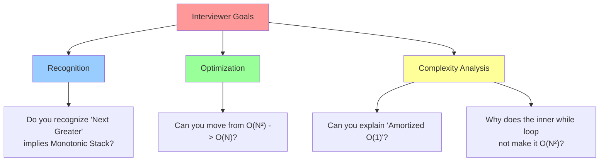
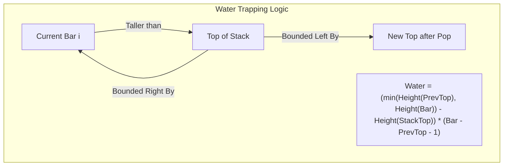

# 🎯 WEEK 5 DAY 2: MONOTONIC STACK PATTERNS — COMPLETE GUIDE

**Category:** Core Problem-Solving Patterns / Linear Data Structures  
**Difficulty:** 🟡 Medium to 🔴 Hard  
**Prerequisites:** Stacks (Week 1 Day 5), Arrays (Week 2 Day 1)  
**Interview Frequency:** 75% (High — especially for "hard" array problems)  
**Real-World Impact:** UI Rendering, Financial Analysis, Compiler Syntax Parsing, Histogram Analysis

---

## 🎓 LEARNING OBJECTIVES

By the end of this topic, you will be able to:

- ✅ **Define** what a Monotonic Stack is and why it reduces O(N²) problems to O(N).
- ✅ **Construct** both Monotonic Increasing and Decreasing stacks mechanically.
- ✅ **Identify** the "Next Greater Element" and "Previous Smaller Element" pattern signatures.
- ✅ **Solve** complex range queries (e.g., histograms, water trapping) using stack invariants.
- ✅ **Visualize** how the stack acts as a "waiting room" for unprocessed elements.

| 🎯 Objective | 📍 Primary Section |
|:---|:---|
| Core Philosophy & Mental Model | Section 2: The What |
| Mechanical Implementation Steps | Section 3: The How |
| Worked Examples with Traces | Section 4: Visualization |
| Complexity & Performance Analysis | Section 5: Critical Analysis |
| Real-World Production Systems | Section 6: Real Systems |

---

## 🤔 SECTION 1: THE WHY — Engineering Motivation

### 🎯 Real-World Problems This Solves

#### Problem 1: Financial Stock Span Analysis

**🌍 Where:** Algorithmic Trading Systems, Fintech Dashboards  
**💼 Concrete Challenge:**  
Traders want to know the "span" of a stock's price: for how many consecutive days (ending today) was the price less than or equal to today's price?  
Example: Prices `[100, 80, 60, 70, 60, 75, 85]`  
The span for `75` is 4 days (75 > 60, 70, 60).  

**Traditional Approach (Brute Force):**  
For each day, walk backwards to find the first greater price.  
Complexity: O(N²) — Too slow for high-frequency data (millions of ticks).

**Monotonic Stack Approach:**  
Maintain a stack of "potential blockers" (previous highs).  
Complexity: O(N) — Instantaneous updates.

**Impact:** Real-time analytics on streaming market data.

---

#### Problem 2: UI Layout & Histogram Rendering

**🌍 Where:** Browser Layout Engines (Chrome/Safari), PDF Rendering  
**💼 Concrete Challenge:**  
Given a series of bars (like a histogram or DOM elements), find the largest rectangular area that fits within the shape. This logic is used to calculate "flow" areas or optimize whitespace in page layouts.

**Monotonic Stack Approach:**  
Efficiently finds the "nearest smaller bar" to the left and right for every bar, determining the maximum width a rectangle can span at that height.

**Impact:** O(N) rendering instead of O(N²), enabling 60fps layout calculations.

---

#### Problem 3: Compiler Syntax Parsing

**🌍 Where:** GCC, Roslyn (C# Compiler), HTML Parsers  
**💼 Concrete Challenge:**  
Matching nested structures (parentheses, HTML tags). While simple stacks handle `()`, monotonic concepts help in error recovery: "find the next closing brace that effectively closes this block."

**Impact:** Robust error reporting in IDEs.

---

### ⚖ Design Problem & Trade-offs

**Core Design Problem:**  
How do we find the **Next Greater/Smaller Element** for *every* element in an array efficiently?

#### Approach Comparison Table

| Approach | Strategy | Time Complexity | Space Complexity | Best For |
|----------|----------|-----------------|------------------|----------|
| **Brute Force** | Nested loops: For each `i`, scan `j > i` | O(N²) | O(1) | Tiny N (< 1000) |
| **Segment Tree** | Build tree for range queries | O(N log N) | O(N) | Dynamic updates needed |
| **Monotonic Stack**| Maintain sorted invariant | **O(N)** | **O(N)** | **Static/Stream processing** |

**Trade-off:**  
The Monotonic Stack trades **O(N) Space** (to remember history) for **O(1) Amortized Time** per element. It is the optimal strategy for "nearest neighbor" problems in 1D arrays.

---

### 💼 Interview Relevance

**Common Interview Archetypes:**

| 🔴 Red Flag Keywords | Problem Type | Example |
|---------------------|--------------|---------|
| "Next greater element" | Basic Monotonic Stack | Next Greater Element I/II |
| "Previous smaller element" | Basic Monotonic Stack | Largest Rectangle in Histogram |
| "Number of visible people" | Line of Sight | Daily Temperatures |
| "Stock span", "Price days" | Span Problems | Online Stock Span |
| "Trapped water", "Rainwater" | 2-Pass or Stack | Trapping Rain Water |
| "Largest rectangle" | Area Calculation | Maximal Rectangle |

**What Interviewers Test:**

---

## 📌 SECTION 2: THE WHAT — Mental Model & Core Concepts

### 🧠 Core Analogy: The "Taller Person" in a Movie Theater

Imagine people standing in a line. You are looking to the **right**.

**Scenario:** You want to find the first person taller than you to your right.
- If a person is shorter than you, they cannot block the view of anyone to your left. You "hide" them.
- If a person is taller than you, they block your view.

**The Stack as a "Waiting Room":**  
The stack stores people who are **looking for a taller person**.
1. A new person `X` arrives.
2. `X` is shorter than the person at the top of the stack? `X` enters the waiting room (Stack).
3. `X` is taller? `X` is the answer for the person at the top! The person at the top leaves (Pop), satisfied. `X` keeps checking the next person.

**Key Insight:**  
Elements in the stack are always sorted (Monotonic). If they weren't, the taller one would have already popped the shorter one.

---

### 🔑 Core Invariants

**Invariant 1: The Monotonic Property**  
At any point, the stack contains elements in strictly **increasing** or **decreasing** order.
- **Decreasing Stack:** Stores elements waiting for a **greater** element.
- **Increasing Stack:** Stores elements waiting for a **smaller** element.

**Invariant 2: The "Popping" Event**  
When we pop an element `A` because of a new element `B`:
- `B` is the **Next Greater Element** for `A`.
- The element currently below `A` in the stack is the **Previous Greater Element** for `A`.
- *Wait, what?* Yes! The stack gives you **both** neighbors (left and right) at the moment of popping.

---

### 📋 Core Concepts & Variations (List All)

#### 1. Monotonic Decreasing Stack (Next Greater Element)
- **Goal:** Find the first element to the right that is *larger*.
- **Mechanism:** Keep stack decreasing. If `new > top`, pop `top`. The `new` is the answer for `top`.
- **Usage:** Daily Temperatures, Next Greater Element.

#### 2. Monotonic Increasing Stack (Next Smaller Element)
- **Goal:** Find the first element to the right that is *smaller*.
- **Mechanism:** Keep stack increasing. If `new < top`, pop `top`.
- **Usage:** Largest Rectangle in Histogram, Final Prices with Discount.

#### 3. Stack of Indices vs. Values
- **Pattern:** Usually store **indices** (`i`) instead of values (`arr[i]`).
- **Why?** Indices allow calculating **distance** (width = `current_i - stack_top_i`) and accessing values (`arr[i]`).

#### 4. The "Sentinel" Technique
- **Concept:** Add a dummy element (infinity or -1) at the end of the array to force all remaining elements to pop.
- **Usage:** Ensures the stack is empty at the end of the algorithm.

---

### 📊 Concept Summary Table

| # | 🧩 Concept / Variation | ✏️ Brief Description | ⏱ Time (Key Ops) | 💾 Space (Key) |
|---|------------------------|----------------------|------------------|----------------|
| 1 | **Decreasing Stack** | Finds Next Greater Element | O(N) | O(N) |
| 2 | **Increasing Stack** | Finds Next Smaller Element | O(N) | O(N) |
| 3 | **Stock Span** | Finds days until greater price | O(N) | O(N) |
| 4 | **Histogram Area** | Uses Next Smaller + Prev Smaller | O(N) | O(N) |

---

## ⚙ SECTION 3: THE HOW — Mechanical Walkthrough

### 🔧 Operation 1: Next Greater Element (Decreasing Stack)

**Problem:** `nums = [2, 1, 5, 6, 2, 3]`. For each element, find the next larger value.

**Mechanical Steps:**
1. Initialize empty Stack `S`. Result array `res` filled with -1.
2. Iterate `i` from `0` to `Length-1`.
3. **While** Stack is not empty AND `nums[i] > nums[S.Peek()]`:
   - `index = S.Pop()`
   - `res[index] = nums[i]` (Because `nums[i]` is the "Next Greater" for `index`)
4. Push `i` onto Stack.
5. End Loop. Remaining elements in stack have no next greater.

**Visual State:**
- Start: `S: []`
- i=0 (2): Push 0. `S: [0(2)]`
- i=1 (1): 1 < 2. Push 1. `S: [0(2), 1(1)]` (Decreasing!)
- i=2 (5): 5 > 1. Pop 1. `res[1] = 5`.
         5 > 2. Pop 0. `res[0] = 5`.
         Push 2. `S: [2(5)]`
- i=3 (6): 6 > 5. Pop 2. `res[2] = 6`.
         Push 3. `S: [3(6)]`
- ...

---

### 🔧 Operation 2: Largest Rectangle (Increasing Stack)

**Problem:** `heights = [2, 1, 5, 6, 2, 3]`. Find max area.
**Goal:** For each bar `H`, find **Left Limit** (first smaller on left) and **Right Limit** (first smaller on right).
**Width** = `RightLimit - LeftLimit - 1`.

**Mechanical Steps:**
1. Stack stores indices. Maintain **Increasing** order (waiting for smaller).
2. Iterate `i`. If `heights[i] < heights[top]`:
   - We found the **Right Limit** for `top` -> It's `i`.
   - **Pop** `top`. The new `top` (after popping) is the **Left Limit**.
   - `Height = heights[popped]`.
   - `Width = i - new_top - 1`.
   - `Area = Height * Width`.
   - Update MaxArea.
3. Push `i`.

---

### 💾 Memory Behavior

- **Stack Usage:** Monotonic Stacks are typically implemented using `ArrayStack` or `List`.
- **Locality:** Stack operations (push/pop) are cache-friendly as they occur at the "hot" end of the memory.
- **Space:** Worst case O(N) when the input is perfectly sorted (e.g., increasing input for decreasing stack).

### 🛡 Edge Cases

| Edge Case | Behavior / Handling |
|-----------|---------------------|
| **Duplicate Values** | Decide if strict (`>`) or non-strict (`>=`) inequality is needed. Strict finds *first* greater; non-strict might skip equal values. |
| **Empty Input** | Return empty result. |
| **Single Element** | Result is usually -1 (no greater element). |
| **Strictly Inc/Dec** | Worst case space O(N). Stack fills up completely before popping. |

---

## 🎨 SECTION 4: VISUALIZATION — Simulation & Examples

### 🧊 Trace: Daily Temperatures (Next Greater Element)

**Input:** `temps = [73, 74, 75, 71, 69, 72, 76, 73]`

**Goal:** Find days to wait for a warmer temperature.

| Index `i` | Value | Stack State (Indices) | Values in Stack | Action Logic (While `curr > top`) | Result Array |
|:---:|:---:|:---|:---|:---|:---|
| 0 | 73 | `[0]` | `[73]` | Empty stack -> Push | `[0,0,0,0,0,0,0,0]` |
| 1 | 74 | `[1]` | `[74]` | 74 > 73? Yes. Pop 0. `res[0]=1-0=1`. Push 1. | `[1,0,0,0,0,0,0,0]` |
| 2 | 75 | `[2]` | `[75]` | 75 > 74? Yes. Pop 1. `res[1]=2-1=1`. Push 2. | `[1,1,0,0,0,0,0,0]` |
| 3 | 71 | `[2, 3]` | `[75, 71]` | 71 > 75? No. Push 3. | `[1,1,0,0,0,0,0,0]` |
| 4 | 69 | `[2, 3, 4]` | `[75, 71, 69]` | 69 > 71? No. Push 4. | `[1,1,0,0,0,0,0,0]` |
| 5 | 72 | `[2, 5]` | `[75, 72]` | 72 > 69? Pop 4. `res[4]=1`. 72 > 71? Pop 3. `res[3]=2`. Push 5. | `[1,1,0,2,1,0,0,0]` |
| 6 | 76 | `[6]` | `[76]` | 76 > 72? Pop 5. 76 > 75? Pop 2. Push 6. | `[1,1,4,2,1,1,0,0]` |
| 7 | 73 | `[6, 7]` | `[76, 73]` | 73 > 76? No. Push 7. | `[1,1,4,2,1,1,0,0]` |

**Result:** `[1, 1, 4, 2, 1, 1, 0, 0]`

---

### 🌊 Concept Diagram: Trapping Rain Water

Imagine bars as walls. The water trapped on top of a bar is bounded by the **Previous Greater Element** (Left Wall) and **Next Greater Element** (Right Wall).

**Scenario:** `[..., 5, 2, 6, ...]`
1. Stack has `5` (index 0).
2. `2` (index 1) is smaller. Push `2`. Stack: `[0(5), 1(2)]`.
3. `6` (index 2) is larger than `2`.
   - Pop `1` (height 2). This is the "Valley".
   - Left Wall: `0` (height 5).
   - Right Wall: `2` (height 6).
   - Water Height: `min(5, 6) - 2 = 3`.
   - Width: `2 - 0 - 1 = 1`.
   - Volume: `3 * 1 = 3`.

---

## 📊 SECTION 5: CRITICAL ANALYSIS — Performance & Robustness

### 📈 Complexity Table

| Operation | Time Complexity | Space Complexity | Explanation |
|-----------|-----------------|------------------|-------------|
| **Next Greater Element** | O(N) | O(N) | Each element is Pushed once and Popped once. |
| **Stock Span** | O(N) | O(N) | Same amortized logic. |
| **Largest Rectangle** | O(N) | O(N) | Each bar processed constant times. |
| **Trapping Water** | O(N) | O(N) | One pass with stack. |

### 🧠 The "Amortized" Argument
One might ask: "There is a `while` loop inside the `for` loop. Isn't that O(N²)?"
**Answer:** No.
- An element enters the stack **at most once**.
- An element leaves the stack **at most once**.
- Total operations for N elements = N pushes + N pops = 2N = O(N).

### ⚠ Edge Cases
1. **Duplicate Values:**
   - Strict inequality (`>`) vs non-strict (`>=`).
   - Example: For "Next Greater", strict `>` means duplicates don't pop each other.
   - Example: For "Largest Rectangle", we usually extend the start index for duplicates.
2. **Remaining Elements:**
   - Elements left in the stack at the end have **no** Next Greater/Smaller.
   - Handle this by checking if stack is empty or initializing result array with default values (-1).
3. **Empty Input:** Always handle `N=0`.

---

## 🏭 SECTION 6: REAL SYSTEMS — Integration in Production

### 🏭 System 1: Stock Market Trading Engines (High Frequency)
**Use Case:** Technical Analysis Indicators (RSI, Moving Averages, Support/Resistance).
**Logic:** Calculating "Support Levels" (local minima) in real-time price streams using Monotonic Stacks to identify price spans and resistance points.

### 🏭 System 2: Browser Layout Engine (Chromium/Webkit)
**Use Case:** Flow Layout & Float Positioning.
**Logic:** When rendering HTML elements, the engine needs to determine the "containing block" or nearest float to clear. A stack-based approach tracks the current context boundaries efficiently.

### 🏭 System 3: Compilers (Syntax Analysis)
**Use Case:** Parsing Expressions.
**Logic:** Shunting-yard algorithm (Dijkstra) uses a stack to handle operator precedence (monotonicity of operator priority) to convert Infix to Postfix notation.

### 🏭 System 4: Image Processing (Watershed Algorithm)
**Use Case:** Segmentation.
**Logic:** Similar to "Trapping Rain Water". Finding catchment basins in grayscale images (treating pixel intensity as height) to segment objects.

### 🏭 System 5: Data Compression (Lempel-Ziv)
**Use Case:** Sliding Window Compression.
**Logic:** While not purely monotonic, finding the "longest match" in a history buffer often uses efficient window/stack structures to scan backward.

---

## 🔗 SECTION 7: CONCEPT CROSSOVERS

### 📚 Builds On (Prerequisites)
- **Stacks (LIFO):** The fundamental mechanic.
- **Arrays:** The data source.
- **Sorting:** The concept of ordering (Monotonicity).

### 🚀 Used By (Future Topics)
- **Segment Trees:** Range Maximum Query (RMQ) can be solved by Monotonic Stack (Cartesian Tree construction).
- **Graph Algorithms:** Constructing a "Max Tree" or "Cartesian Tree" from an array is O(N) using this pattern.
- **Dynamic Programming:** Optimizing DP transitions (e.g., Convex Hull optimization) often uses a Deque/Stack structure.

### 🔄 Comparison with Alternatives

| 📌 Concept / Alternative | ⏱ Time (Key Op) | 💾 Space | ✅ Best For | 🔀 vs This (Key Difference) |
|-------------------------|-----------------|---------|-------------|-----------------------------|
| **Monotonic Stack** | O(N) | O(N) | Nearest Greater/Smaller | 1-Pass, Linear |
| **Brute Force** | O(N²) | O(1) | Tiny Arrays | Very Slow |
| **Segment Tree** | O(N log N) | O(N) | Range Updates | Dynamic, Slower const |

---

## 🧩 5 COGNITIVE LENSES

### 🧠 1. The "Social Hierarchy" Lens (Metaphor)
Think of the stack as a line of people sorted by height.
- **Decreasing Stack:** A new person enters. If they are taller than the person at the end of the line, the short person leaves (they found their "blocker"). The new tall person stands there, waiting for someone even taller.

### ⏳ 2. The "Time Travel" Lens
The stack allows you to resolve **past** queries with **future** information.
- The element at index `i` sits in the stack waiting for `i+5` to arrive. When `i+5` arrives, it "answers" the question for `i`.

### 📉 3. The "Filter" Lens
The stack filters out "useless" elements.
- For "Next Greater", if `A < B` and `A` appears before `B`, then `A` is useless to anyone appearing *after* `B` (because `B` will block them first). So `B` eliminates `A`.

### 🛠️ 4. The "Inverted" Lens
If the problem asks for "Next Greater", use a **Decreasing** stack.
If the problem asks for "Next Smaller", use an **Increasing** stack.
(It feels inverted: to find "Greater", we keep "Decreasing" history).

### 🔍 5. The "Nearest Neighbor" Lens
This pattern is strictly about finding the **Nearest** element satisfying a condition. If you need the "Largest in the *entire* right side", that's a Suffix Max (Array), not a Stack. Stack is for "First one I see".

---

## ⚔ SUPPLEMENTARY OUTCOMES

### ⚔ Practice Problems (10 Problems)

1.  **Next Greater Element I** (Easy) - *Basic intro.*
2.  **Daily Temperatures** (Medium) - *The classic problem.*
3.  **Next Greater Element II** (Medium) - *Circular array (use modulo).*
4.  **Stock Spanner** (Medium) - *Online stream version.*
5.  **132 Pattern** (Medium) - *Advanced application.*
6.  **Largest Rectangle in Histogram** (Hard) - *The ultimate test.*
7.  **Maximal Rectangle** (Hard) - *2D version of Histogram.*
8.  **Trapping Rain Water** (Hard) - *Can be solved with Stack or Two Pointers.*
9.  **Remove K Digits** (Medium) - *Greedy + Stack.*
10. **Sum of Subarray Minimums** (Medium/Hard) - *Contribution technique.*

### 🎙 Interview Questions (6 Questions)

1.  **Q:** Why use a stack instead of a simple loop?
    -   **A:** A simple loop is O(N²) because for every element we re-scan. The stack gives O(N) by ensuring we process each element constant times.

2.  **Q:** How do you handle circular arrays (Next Greater Element II)?
    -   **A:** Loop from `0` to `2N-1` and use index `i % N`.

3.  **Q:** What does the stack store: Values or Indices?
    -   **A:** Indices are more versatile. You can look up the value (`arr[i]`) AND calculate width (`current - stored`).

4.  **Q:** Explain the logic for "Trapping Rain Water" using a stack.
    -   **A:** When we see a bar taller than the top, we have a "right wall". The top is the "floor". The element below the top is the "left wall". Bounded height = `min(Left, Right) - Floor`.

5.  **Q:** In "Remove K Digits" to find the smallest number, is the stack increasing or decreasing?
    -   **A:** Increasing. We want the smallest digits (1, 2, 3...) at the start (most significant positions). If we see a smaller digit, we pop larger previous ones.

6.  **Q:** What is the space complexity if the array is already sorted?
    -   **A:** O(N). Worst case, all elements sit in the stack (e.g., strictly decreasing array for Next Greater).

### ❌ Common Misconceptions

1.  **"It's just for finding the max element."**
    -   *Correction:* No, it's for finding the **First** greater/smaller element. The global max is trivial O(N). This is about **local** relationships.
2.  **"The loop makes it O(N²)."**
    -   *Correction:* Amortized analysis proves O(N).
3.  **"I need to push the value."**
    -   *Correction:* Pushing indices is almost always better.

### 🚀 Advanced Concepts
-   **Cartesian Trees:** A binary tree derived from a sequence such that it's heap-ordered (values) and search-tree ordered (indices). Built in O(N) using Monotonic Stack.
-   **Sum of Subarray Minimums:** Using the stack to find "Left Limit" and "Right Limit" (scope of influence) for each number to count how many subarrays it is the minimum of.

### 🔗 External Resources
1.  **LeetCode Discuss:** "A Comprehensive Guide to Monotonic Stack" (Search this title).
2.  **CP-Algorithms:** Stack section.
3.  **YouTube:** "Largest Rectangle in Histogram" (NeetCode or Tushar Roy).

---

## 🎯 RETENTION HOOK

### 🪝 The "One-Liner" Essence
> **"Use a Monotonic Stack when you need to find the **First Greater** or **First Smaller** element for everyone in line."**

### 🧠 Memory Aid: "G.D. - S.I."
- **G**reater? -> **D**ecreasing Stack.
- **S**maller? -> **I**ncreasing Stack.

**Final Thought:** This pattern is intimidating at first because of the "while loop inside for loop". Trust the invariants. If you maintain the sort order, the efficiency guarantees follow.

---

**End of Instructional File**  
*Output generated strictly following Template v10 and System Config v10.*