# 🎯 WEEK 5 DAY 3: MERGE OPERATIONS & INTERVAL PATTERNS — COMPLETE GUIDE

**Category:** Core Problem-Solving Patterns / Sorting & Intervals  
**Difficulty:** 🟡 Medium  
**Prerequisites:** Sorting (Week 3 Day 4), Arrays (Week 2 Day 1)  
**Interview Frequency:** 70% (Very Common — specifically "Merge Intervals" and "Merge Sorted Array")  
**Real-World Impact:** Calendar Scheduling, Memory Allocation, Log Merging, DNA Sequencing

---

## 🎓 LEARNING OBJECTIVES

By the end of this topic, you will be able to:

- ✅ **Master** the mechanics of merging sorted data structures using Two Pointers.
- ✅ **Visualize** intervals as line segments on a timeline to identify overlaps.
- ✅ **Apply** the "Sort then Sweep" strategy to solve interval problems.
- ✅ **Handle** edge cases like touching intervals `[1,2][2,3]` and contained intervals `[1,10][2,5]`.
- ✅ **Differentiate** between merging overlapping intervals vs. finding free time slots (gaps).

| 🎯 Objective | 📍 Primary Section |
|:---|:---|
| Core Philosophy & Mental Model | Section 2: The What |
| Mechanical Implementation Steps | Section 3: The How |
| Worked Examples with Traces | Section 4: Visualization |
| Complexity & Performance Analysis | Section 5: Critical Analysis |
| Real-World Production Systems | Section 6: Real Systems |

---

## 🤔 SECTION 1: THE WHY — Engineering Motivation

### 🎯 Real-World Problems This Solves

#### Problem 1: Calendar & Meeting Scheduling

**🌍 Where:** Google Calendar, Outlook, Calendly  
**💼 Concrete Challenge:**  
A user wants to find a 1-hour slot where **all** 5 team members are free. Each member has a list of busy intervals `[Start, End]`.
- Input: 5 lists of busy times.
- Goal: Merge all busy times into one consolidated list of "unavailable" blocks, then find the gaps.

**Pattern:** Merge Intervals.
- Sort all meetings by start time.
- Combine overlapping meetings (e.g., `[9:00, 10:00]` and `[9:30, 11:00]` become `[9:00, 11:00]`).
- The gaps between merged intervals are the free slots.

**Impact:** Instant scheduling without manual cross-referencing.

---

#### Problem 2: Memory Management (OS Allocators)

**🌍 Where:** Linux Kernel, Malloc implementations  
**💼 Concrete Challenge:**  
Memory is allocated in blocks. When a process frees a block `[100, 200]` and another frees `[200, 300]`, the OS should recognize this as a single continuous free block `[100, 300]` to satisfy larger allocation requests later.

**Pattern:** Insert Interval & Merge.
- Maintain a sorted list of free segments.
- When a segment is freed, merge it with adjacent segments if they touch/overlap.

**Impact:** Reduces external fragmentation, allowing larger programs to run.

---

#### Problem 3: Log Merging & Stream Processing

**🌍 Where:** Distributed Systems (Kafka, Splunk), Database LSM Trees  
**💼 Concrete Challenge:**  
You have 10 log files, each sorted by timestamp. You need to display a single chronological view of all events.

**Pattern:** Merge K Sorted Lists.
- Use a Min-Heap or iterative 2-way merge to combine sorted streams efficiently.

**Impact:** Efficient log analysis and debugging across distributed services.

---

### ⚖ Design Problem & Trade-offs

**Core Design Problem:**  
How do we efficiently combine or consolidate sorted data or ranges?

#### Approach Comparison Table

| Approach | Strategy | Time Complexity | Space Complexity | Best For |
|----------|----------|-----------------|------------------|----------|
| **Brute Force** | Compare every interval with every other | O(N²) | O(1) | Tiny inputs only |
| **Sort & Sweep** | Sort by start time, merge linearly | **O(N log N)** | **O(1)** or O(N) | **Interval Problems** |
| **Two Pointers** | Iterate two sorted arrays in parallel | **O(N + M)** | O(1) | **Merging Sorted Arrays** |
| **Segment Tree** | Tree-based range updates | O(N log N) | O(N) | Dynamic/Online updates |

**Trade-off:**  
For static interval problems, **Sort & Sweep** is the gold standard. It dominates Brute Force. Two Pointers is optimal for already-sorted data (like merging DB results).

---

### 💼 Interview Relevance

**Common Interview Archetypes:**

| 🔴 Red Flag Keywords | Problem Type | Example |
|---------------------|--------------|---------|
| "Overlapping times", "Scheduling" | Merge Intervals | Merge Intervals, Meeting Rooms II |
| "Merge two sorted..." | Two Pointers Merge | Merge Sorted Array, Merge k Sorted Lists |
| "Insert new range" | Insert Interval | Insert Interval |
| "Total time covered" | Union of Intervals | Amount of Time Covered |
| "Common free time" | Interval Intersection | Interval List Intersections |

**What Interviewers Test:**


---

## 📌 SECTION 2: THE WHAT — Mental Model & Core Concepts

### 🧠 Core Analogy: The "Painting" Metaphor

Imagine painting a strip of road.
- **Interval `[1, 5]`:** You paint from mile marker 1 to 5.
- **Interval `[3, 7]`:** You paint from 3 to 7.

**Observation:**
Since you already painted 3 to 5 during the first pass, the result is a continuous strip of paint from **1 to 7**.
- You don't have two separate strips. You have one merged strip.
- To do this efficiently, you must process the painting jobs **in order of start time**.

If you tried to process `[10, 12]` then `[1, 5]` then `[3, 7]`, you'd be jumping back and forth. Sorting by start time ensures you simply "extend" the current strip or "start" a new one.

---

### 🔑 Core Invariants

**Invariant 1: Sorted Start Times**
For almost all interval problems, **Sort by Start Time** is the first step.
- Why? It guarantees that if we iterate linearly, `Next.Start >= Current.Start`.
- This simplifies the overlap check to just: `Does Next.Start <= Current.End?`

**Invariant 2: The "Active" Interval**
We maintain a `Current` interval (or just `CurrentEnd`) that represents the merge-in-progress.
- If `Next` overlaps `Current`, we extend `Current`.
- If `Next` does not overlap, `Current` is finished. `Next` becomes the new `Current`.

**Invariant 3: Sorted Output (Merge Arrays)**
When merging two sorted arrays `A` and `B`:
- The smallest unpicked element is always at `A[i]` or `B[j]`.
- We greedily pick the smaller one to ensure the output remains sorted.

---

### 📋 Core Concepts & Variations (List All)

#### 1. Merge Sorted Arrays (Two Pointers)
- **Goal:** Combine 2 sorted arrays into 1 sorted array.
- **Logic:** Compare heads, take smaller, advance pointer.
- **Complexity:** O(N + M).

#### 2. Merge Intervals (Sort & Sweep)
- **Goal:** Consolidate overlapping intervals.
- **Logic:** Sort by start. If `overlap`, `End = max(End, Next.End)`. Else, push `Current`, start new.
- **Complexity:** O(N log N).

#### 3. Insert Interval
- **Goal:** Insert new interval into sorted non-overlapping list and merge if needed.
- **Logic:**
  1. Add all before new (non-overlapping).
  2. Merge new with all overlapping.
  3. Add all after.
- **Complexity:** O(N).

#### 4. Interval Intersection
- **Goal:** Find time slots common to both lists A and B.
- **Logic:** `Start = max(A.Start, B.Start)`, `End = min(A.End, B.End)`. If `Start <= End`, valid intersection.
- **Complexity:** O(N + M).

#### 5. Meeting Rooms (Counting Overlaps)
- **Goal:** Min rooms required.
- **Logic:** "Chronological Ordering" or "Sweep Line". Treat Start as `+1` room, End as `-1` room. Sort events and scan.
- **Complexity:** O(N log N).

---

## ⚙ SECTION 3: THE HOW — Mechanical Walkthrough

### 🔧 Operation 1: Merge Sorted Arrays (Two Pointers)

**Problem:** `A = [1, 3, 5]`, `B = [2, 4, 6]`. Merge into `C`.

**Visual Flow:**


**Mechanical Steps:**
1. Pointers `p1=0`, `p2=0`. Result `C` empty.
2. Compare `A[p1]` vs `B[p2]`:
   - `1 < 2`: Append `1`. `p1++`.
   - `3 > 2`: Append `2`. `p2++`.
   - `3 < 4`: Append `3`. `p1++`.
   - ...
3. If one array is exhausted, append remainder of the other.

---

### 🔧 Operation 2: Merge Intervals (Sort & Sweep)

**Problem:** `[[1,3], [8,10], [2,6], [15,18]]`

**Step 1: Sort**
`[[1,3], [2,6], [8,10], [15,18]]`

**Step 2: Sweep Algorithm (Flowchart)**

```mermaid
graph TD
    Start([Sort Intervals]) --> Init[Curr = First Interval]
    Init --> CheckNext{Has Next Interval?}
    CheckNext -- Yes --> Compare[Next.Start <= Curr.End?]
    CheckNext -- No --> Done([Add Curr to Output, Finish])
    
    Compare -- Yes (Overlap) --> Merge[Curr.End = max(Curr.End, Next.End)]
    Merge --> CheckNext
    
    Compare -- No (Gap) --> Commit[Add Curr to Output]
    Commit --> Update[Curr = Next]
    Update --> CheckNext
```

**Trace Execution:**
1. **Init:** `Current = [1,3]`
2. **Next:** `[2,6]`
   - `2 <= 3`? Yes (Overlap).
   - `End = max(3, 6) = 6`.
   - `Current` is `[1,6]`.
3. **Next:** `[8,10]`
   - `8 <= 6`? No (Gap).
   - Commit `[1,6]`. `Current` is `[8,10]`.
4. **Next:** `[15,18]`
   - `15 <= 10`? No.
   - Commit `[8,10]`. `Current` is `[15,18]`.
5. **End:** Commit `[15,18]`.

---

## 🎨 SECTION 4: VISUALIZATION — Simulation & Examples

### 🧊 Trace: Insert Interval

**Input:** Existing: `[[1,3], [6,9]]`, New: `[2,5]`

**Logic Flow:**
1. **Left Part:** Intervals ending *before* New starts.
   - `[1,3]` ends at 3. New starts at 2. Overlap!
   - Wait... strictly before means `End < New.Start`.
   - `3 < 2` is False.
   - So `[1,3]` is NOT strictly before. It involves merging.

   *(Correction: Standard logic is simpler)*
   - Iterate intervals.
   - If `Current.End < New.Start`: Add `Current` (Left non-overlapping).
   - If `Current.Start > New.End`: Add `New`, then all remaining (Right non-overlapping).
   - Else (Overlap): Merge `New` with `Current` (`New.Start = min`, `New.End = max`). Don't add yet.

**Correct Trace Table:**

| Step | Interval | Check Logic | Action | Result List | New Interval State |
|:---:|:---:|:---|:---|:---|:---|
| 1 | `[1,3]` | `3 < 2`? No.<br>`1 > 5`? No.<br>**Overlap!** | Merge | `[]` | `[min(1,2), max(3,5)]` = `[1,5]` |
| 2 | `[6,9]` | `9 < 1`? No.<br>`6 > 5`? Yes. | Add New,<br>then Add Curr | `[1,5], [6,9]` | - |

**Final Result:** `[[1,5], [6,9]]`

---

### 🌊 Concept Diagram: The 6 Types of Overlap

Given two intervals A and B, how can they relate? This diagram is crucial for debugging "Edge Cases".

```mermaid
gantt
    dateFormat  HH:mm
    axisFormat  %H:%M
    title Interval Overlap Scenarios
    
    section Non-Overlapping
    A Before B (Gap)     :a1, 01:00, 1h
    B After A (Gap)      :b1, 03:00, 1h
    
    section Overlapping
    Touching (Zero Gap)  :a2, 05:00, 1h
    Touching (B)         :b2, 06:00, 1h
    
    Partial Overlap      :a3, 08:00, 2h
    Partial (B)          :b3, 09:00, 2h
    
    Contained (Subset)   :a4, 12:00, 4h
    Inside (B)           :b4, 13:00, 2h
```



**Merge Logic Covers All Overlaps:**
The formula `max(EndA, EndB)` correctly handles:
- Partial Overlap
- Contained (Inside)
- Touching (if logic uses `<=`)
- Identical intervals

---

## 📊 SECTION 5: CRITICAL ANALYSIS — Performance & Robustness

### 📈 Complexity Table

| Algorithm | Time Complexity | Space Complexity | Why? |
|-----------|-----------------|------------------|------|
| **Merge Sorted Arrays** | O(N + M) | O(1) or O(N+M) | Linear pass. Space depends on if creating new array. |
| **Merge Intervals** | O(N log N) | O(N) | Sorting dominates time. Output array takes space. |
| **Insert Interval** | O(N) | O(N) | Already sorted, just one pass. |
| **Meeting Rooms II** | O(N log N) | O(N) | Sorting start/end times. |
| **Interval Intersection** | O(N + M) | O(N + M) | Two pointers pass. |

### 🧠 Trade-offs
- **In-Place Merging:** Merging sorted arrays *in-place* (e.g., A has buffer space) is tricky. You must iterate **backwards** to avoid overwriting data you haven't read yet.
- **Sorting Cost:** If data is almost sorted, `Sort()` is still O(N log N). In rare cases (e.g., timestamps from a single appended log), you might avoid full sort.

### ⚠ Edge Cases
1. **Touching Intervals:** `[1,2]` and `[2,3]`.
   - Usually merged into `[1,3]`.
   - Condition: `Current.End >= Next.Start`.
2. **Subsets:** `[1,10]` and `[2,5]`.
   - Merged into `[1,10]`.
   - Logic `max(10, 5)` handles this naturally.
3. **Empty Input:** Always handle `[]`.

---

## 🏭 SECTION 6: REAL SYSTEMS — Integration in Production

### 🏭 System 1: DNA Sequencing (Bioinformatics)
**Use Case:** Genome Assembly.
**Logic:** DNA reads are short "intervals" of the genome. Assemblers overlap these reads (Merge Intervals) to reconstruct the full sequence (Contigs).

### 🏭 System 2: Google Calendar (Free/Busy Search)
**Use Case:** "Find a Time".
**Logic:** Fetch busy intervals for all attendees. Merge them (Merge Intervals). The *gaps* between merged intervals are the available meeting slots.

### 🏭 System 3: Video Streaming (Netflix Buffer)
**Use Case:** Managing buffered chunks.
**Logic:** The player downloads chunks `[0-10s]`, `[15-20s]`.
- User seeks to 5s. Player knows `[0-10s]` covers it.
- As chunks arrive, player "Merges Intervals" to track buffered continuous play time.

### 🏭 System 4: TCP/IP Stack (Packet Reassembly)
**Use Case:** Handling out-of-order packets.
**Logic:** Packets arrive with sequence ranges `[100-200]`, `[300-400]`, `[200-300]`.
- TCP stack inserts and merges these ranges.
- When `[100-400]` is contiguous, it delivers data to the application.

### 🏭 System 5: Database Locking
**Use Case:** Range Locks.
**Logic:** A transaction locks rows `[100-200]`. Another requests `[150-250]`.
- DB checks overlap (Interval Intersection).
- If overlap, request waits.

---

## 🔗 SECTION 7: CONCEPT CROSSOVERS

### 📚 Builds On (Prerequisites)
- **Sorting:** The foundation of Sort & Sweep.
- **Two Pointers:** The mechanic for traversing two lists.
- **Greedy:** Making the local optimal choice (extend current interval) leads to global optimal.

### 🚀 Used By (Future Topics)
- **Segment Trees:** Advanced range queries are essentially hierarchical intervals.
- **Sweep Line Algorithms:** Computational geometry (e.g., skyline problem) is 2D interval merging.
- **Greedy Scheduling:** Activity Selection Problem.

---

## 🧩 5 COGNITIVE LENSES

### 🧠 1. The "Zipper" Lens (Mechanic)
Merging two sorted arrays is like zipping a jacket. You look at the teeth (elements) on both sides and pull the zipper (pointer) up, slotting the smaller tooth in first. It's a smooth, linear motion.

### 🎞️ 2. The "Video Editor" Lens (Metaphor)
Think of intervals as clips on a video timeline. Merging intervals is "flattening" the timeline. If Clip A overlaps Clip B, the final render is just one continuous block of video.

### 🧹 3. The "Sweep Line" Lens (Technique)
Imagine a vertical line moving across the number line from left to right.
- It hits a "Start" event -> Activity begins.
- It hits an "End" event -> Activity stops.
This converts static intervals into dynamic events.

### 📉 4. The "Dimension Reduction" Lens
Interval problems are 1D geometry problems. By sorting, we linearize the geometry, turning a "check everyone against everyone" (2D complexity) into "check neighbor" (1D complexity).

### 🛠️ 5. The "Buffer" Lens (In-Place Merge)
When merging into an array that already has data (Merge Sorted Array LC#88), always think **"Fill from the back"**. If you fill from the front, you overwrite data you need later. Filling from the back uses the empty space (buffer) first.

---

## ⚔ SUPPLEMENTARY OUTCOMES

### ⚔ Practice Problems (10 Problems)

1.  **Merge Sorted Array** (Easy) - *Classic backwards pointer.*
2.  **Merge Intervals** (Medium) - *Sort & Sweep core.*
3.  **Insert Interval** (Medium) - *Linear pass, no sort needed.*
4.  **Meeting Rooms** (Easy) - *Detect overlap.*
5.  **Meeting Rooms II** (Medium) - *Count max overlap (Sweep Line).*
6.  **Interval List Intersections** (Medium) - *Two pointers "And" logic.*
7.  **Non-overlapping Intervals** (Medium) - *Greedy remove.*
8.  **Teemo Attacking** (Easy) - *Simple merge logic.*
9.  **Summary Ranges** (Easy) - *Group consecutive numbers.*
10. **Range Module** (Hard) - *Dynamic tracking (Segment Tree/TreeSet).*

### 🎙 Interview Questions (6 Questions)

1.  **Q:** If intervals are already sorted, what is the complexity of merging?
    -   **A:** O(N). We just iterate once. Sorting is the bottleneck (O(N log N)), so removing it makes it linear.

2.  **Q:** How do you handle [1,2] and [2,3]? Do they overlap?
    -   **A:** Depends on problem constraints. Usually yes ("closed intervals"). Logic: `End >= Start`. If strictly open, `End > Start`.

3.  **Q:** Merge two sorted arrays in-place with O(1) space.
    -   **A:** (Assuming Array 1 has buffer): Use 3 pointers. `p1` at end of valid data in A, `p2` at end of B, `pWrite` at absolute end of A. Compare and write backwards.

4.  **Q:** How do you find the maximum number of concurrent meetings?
    -   **A:** (Meeting Rooms II). Separate Start and End times. Sort both. Walk through. Start=+1, End=-1. Track max running sum.

5.  **Q:** How to store intervals efficiently for "point queries" (Who is active at time T)?
    -   **A:** Interval Tree or Segment Tree.

6.  **Q:** Why do we sort by Start time and not End time for merging?
    -   **A:** Sorting by Start allows us to determine overlap with *just* the previous interval. Sorting by End doesn't guarantee the next interval starts after the current one starts. (Though "Non-overlapping intervals" problem sorts by End time—Greedy Strategy difference!).

### ❌ Common Misconceptions

1.  **"Sort by End Time to Merge"**
    -   *Correction:* For *merging*, sort by Start. For *removing min intervals* (Scheduling max events), sort by End.
2.  **"Intersection needs Sorting"**
    -   *Correction:* If input lists are already sorted (common in "Interval List Intersections"), you don't need to re-sort. Just use Two Pointers.
3.  **"Overlaps are complex"**
    -   *Correction:* Overlap check is just `A.Start <= B.End` AND `B.Start <= A.End`. Or simpler: `max(Starts) <= min(Ends)`.

### 🚀 Advanced Concepts
-   **Sweep Line Algorithm:** Separating "Start" and "End" events to solve complex overlap counting in O(N log N).
-   **Interval Trees:** Specialized BST for storing intervals to allow O(log N) intersection queries.

### 🔗 External Resources
1.  **LeetCode Discuss:** "A pattern to solve all Interval problems".
2.  **VisualAlgo:** Sorting visualizations (to understand the sorting step).
3.  **YouTube:** "Meeting Rooms II" explanation (Sweep Line visualization).

---

## 🎯 RETENTION HOOK

### 🪝 The "One-Liner" Essence
> **"Sort by Start, then just ask: Does the next one start before I finish?"**

### 🧠 Memory Aid: "S.S.M."
- **S**ort (Start time)
- **S**weep (Linear pass)
- **M**erge (Extend end time)

**Final Thought:** Interval problems look scary because of the "coordinates", but they almost always collapse into a simple linear scan once you sort them. Order is everything.

---

**End of Instructional File**  
*Output generated strictly following Template v10 and System Config v10.*