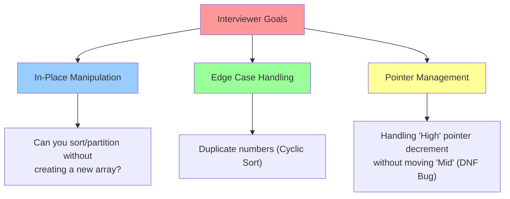

# 🎯 WEEK 5 DAY 4: PARTITION & CYCLIC SORT — COMPLETE GUIDE

**Category:** Core Problem-Solving Patterns / In-Place Manipulation  
**Difficulty:** 🟡 Medium  
**Prerequisites:** Arrays (Week 2 Day 1), Pointers (Week 2 Day 3)  
**Interview Frequency:** 65% (High — Classics like "Sort Colors" and "Missing Number")  
**Real-World Impact:** Memory Management, Garbage Collection, Data Deduplication, Packet Reassembly

---

## 🎓 LEARNING OBJECTIVES

By the end of this topic, you will be able to:

- ✅ **Master** the 3-Way Partitioning (Dutch National Flag) logic to categorize data in one pass.
- ✅ **Apply** Cyclic Sort to place numbers in their correct indices in O(N) time with O(1) space.
- ✅ **Identify** missing or duplicate numbers in a range `1` to `N` using index-mapping.
- ✅ **Visualize** how pointers (`Low`, `Mid`, `High`) enforce array invariants.
- ✅ **Differentiate** between standard sorting (O(N log N)) and range-based sorting (O(N)).

| 🎯 Objective | 📍 Primary Section |
|:---|:---|
| Core Philosophy & Mental Model | Section 2: The What |
| Mechanical Implementation Steps | Section 3: The How |
| Worked Examples with Traces | Section 4: Visualization |
| Complexity & Performance Analysis | Section 5: Critical Analysis |
| Real-World Production Systems | Section 6: Real Systems |

---

## 🤔 SECTION 1: THE WHY — Engineering Motivation

### 🎯 Real-World Problems This Solves

#### Problem 1: Memory & Garbage Collection (Partitioning)

**🌍 Where:** Java Garbage Collector (G1GC), OS Page Replacement  
**💼 Concrete Challenge:**  
Memory objects are categorized as "Young Generation" (New), "Old Generation" (Long-lived), or "Dead" (Garbage). The GC needs to group these objects efficiently to reclaim space.  

**Pattern:** Dutch National Flag (3-Way Partition).
- Partition memory blocks into `[Live Objects | Indeterminate | Dead Objects]`.
- Doing this in-place avoids allocating new memory during a memory-critical cleanup phase.

**Impact:** Efficient memory reclamation with minimal overhead.

---

#### Problem 2: Data Integrity & Error Correction (Cyclic Sort)

**🌍 Where:** Network Packet Reassembly, Database Sequence Gaps  
**💼 Concrete Challenge:**  
Packets arrive out of order: `[3, 1, 4, 2]`. You know they should be `1, 2, 3, 4`. You need to detect if any packet is missing or duplicated without using extra memory (buffer is full).

**Pattern:** Cyclic Sort.
- Since packet `3` belongs at index `2` (0-based), swap it there.
- Repeat until everything is ordered.
- Scan to find gaps.

**Impact:** Fault detection in constrained embedded systems.

---

#### Problem 3: Image Thresholding (2-Way Partition)

**🌍 Where:** Computer Vision (OpenCV), OCR  
**💼 Concrete Challenge:**  
Separate foreground pixels (Dark) from background pixels (Light) based on a threshold value.

**Pattern:** Two-Way Partition.
- Move all pixels `< Threshold` to the left.
- Move all pixels `>= Threshold` to the right.

**Impact:** Fast preprocessing for text recognition.

---

### ⚖ Design Problem & Trade-offs

**Core Design Problem:**  
How do we organize or analyze an array **in-place** (O(1) space) when we have specific knowledge about the content (e.g., range 1..N or 3 categories)?

#### Approach Comparison Table

| Approach | Strategy | Time Complexity | Space Complexity | Best For |
|----------|----------|-----------------|------------------|----------|
| **Sorting (Standard)** | Merge/Quick Sort | O(N log N) | O(log N) | Generic data |
| **Hash Set** | Store seen elements | O(N) | O(N) | Finding dups/missing |
| **Cyclic Sort** | Place `val` at `index = val - 1` | **O(N)** | **O(1)** | **Range 1 to N** |
| **DNF Partition** | 3 Pointers (Low, Mid, High) | **O(N)** | **O(1)** | **3 Categories** |

**Trade-off:**  
These patterns are **highly specialized**. Cyclic Sort *only* works if data is in a specific integer range. But when they apply, they are mathematically optimal (O(N) Time, O(1) Space).

---

### 💼 Interview Relevance

**Common Interview Archetypes:**

| 🔴 Red Flag Keywords | Problem Type | Example |
|---------------------|--------------|---------|
| "Sort 0s, 1s, and 2s" | Dutch National Flag | Sort Colors |
| "Numbers from 1 to N" | Cyclic Sort | Missing Number, Find Duplicate |
| "Rearrange positive/negative" | Partitioning | Rearrange Array Elements |
| "First missing positive" | Cyclic Sort (Advanced) | First Missing Positive |
| "Move zeroes to end" | 2-Way Partition | Move Zeroes |

**What Interviewers Test:**



---

## 📌 SECTION 2: THE WHAT — Mental Model & Core Concepts

### 🧠 Core Analogy 1: The "Traffic Cop" (Dutch National Flag)

Imagine a chaotic line of cars: **Red**, **White**, and **Blue**.
You want: All **Reds** on the left, **Whites** in the middle, **Blues** on the right.

**The Strategy:**
- You stand in the middle (`Mid` pointer).
- If you see a **Red** car: Swap it to the Left (`Low` region). Increment both `Low` and `Mid`.
- If you see a **White** car: It's already in the middle. Just move to the next (`Mid++`).
- If you see a **Blue** car: Swap it to the Right (`High` region). Decrement `High`. **Do not move Mid yet** (the swapped car needs inspection).

---

### 🧠 Core Analogy 2: The "Correct Seat" (Cyclic Sort)

Imagine students numbered 1 to N entering a classroom with seats 0 to N-1.
- Student #3 is sitting in Seat #0.
- Teacher says: "Student #3, go to Seat #2 (index 2)!"
- Student #3 swaps with whoever is in Seat #2.
- Now a new student is in Seat #0. Repeat until Seat #0 has Student #1 (or a correct student).
- Move to Seat #1.

**Key Insight:** If every student sits in their assigned seat, the array is sorted.

---

### 📋 Core Concepts & Variations (List All)

#### 1. Dutch National Flag (3-Way Partition)
- **Goal:** Sort array of 3 distinct values (0, 1, 2) in O(N).
- **Pointers:** `Low` (end of 0s), `High` (start of 2s), `Mid` (current scanner).
- **Invariant:** `[0...Low-1]` are 0s. `[High+1...End]` are 2s.

#### 2. Cyclic Sort (Range 1 to N)
- **Goal:** Sort/Find Missing in range `1` to `N`.
- **Logic:** Swap `arr[i]` with `arr[arr[i]-1]`.
- **Complexity:** O(N) (Each number is swapped at most once).

#### 3. Two-Way Partition (Move Zeroes)
- **Goal:** Move all valid elements to left, others to right.
- **Logic:** `Read` and `Write` pointers. Iterate `Read`; if valid, swap to `Write` and increment `Write`.

#### 4. First Missing Positive (Advanced Cyclic)
- **Goal:** Find smallest missing positive integer.
- **Logic:** Ignore negatives and numbers > N. Place valid positives in correct spots. First index `i` where `arr[i] != i+1` is the answer.

---

## ⚙ SECTION 3: THE HOW — Mechanical Walkthrough

### 🔧 Operation 1: Dutch National Flag (Sort Colors)

**Problem:** Sort `[2, 0, 2, 1, 1, 0]` (0=Red, 1=White, 2=Blue).

**Visual State Machine:**

```mermaid
graph LR
    subgraph "Regions"
    L[Low Pointer] -->|Stores 0s| M[Mid Pointer]
    M -->|Scans Unknown| H[High Pointer]
    H -->|Stores 2s| E[End]
    end

    subgraph "Rules"
    R1{Is arr[Mid] == 0?} -- Yes --> S1[Swap Mid & Low<br/>Low++, Mid++]
    R2{Is arr[Mid] == 1?} -- Yes --> S2[Mid++]
    R3{Is arr[Mid] == 2?} -- Yes --> S3[Swap Mid & High<br/>High--]
    end
```

**Mechanical Steps:**
1. `Low=0`, `Mid=0`, `High=N-1`.
2. Loop while `Mid <= High`.
3. Check `arr[Mid]`:
   - If `0`: Swap `arr[Low], arr[Mid]`. `Low++`, `Mid++`.
   - If `1`: `Mid++`.
   - If `2`: Swap `arr[Mid], arr[High]`. `High--`. (Notice `Mid` doesn't move!).

---

### 🔧 Operation 2: Cyclic Sort (Find Missing)

**Problem:** `[3, 0, 1]`. Range 0 to N. Find missing.

**Mechanical Steps:**
1. Iterate `i` from 0.
2. While `arr[i] < N` AND `arr[i] != arr[arr[i]]` (Not in correct spot):
   - Swap `arr[i]` with `arr[arr[i]]`.
3. After loop, scan `i`. First index where `arr[i] != i` is the answer.

---

## 🎨 SECTION 4: VISUALIZATION — Simulation & Examples

### 🧊 Trace: Dutch National Flag

**Input:** `[2, 0, 1]`  
**Init:** `L=0, M=0, H=2`

| Iteration | Array State | Mid Val | Action | Pointers Update |
|:---:|:---:|:---:|:---:|:---|
| 1 | `[2, 0, 1]` | 2 | Swap Mid/High | `High` becomes 1. Array: `[1, 0, 2]` |
| 2 | `[1, 0, 2]` | 1 | Ignore | `Mid` becomes 1. |
| 3 | `[1, 0, 2]` | 0 | Swap Mid/Low | `Low` becomes 1, `Mid` becomes 2. Array: `[0, 1, 2]` |
| 4 | `[0, 1, 2]` | - | `M > H` | **STOP** |

**Result:** `[0, 1, 2]`

---

### 🧊 Trace: Cyclic Sort (Find Duplicate)

**Input:** `[3, 1, 3, 4, 2]` (Range 1 to N, Find 3)

| i | Arr[i] | Target Index | Swap? | Array State | Note |
|:---:|:---:|:---:|:---:|:---:|:---|
| 0 | 3 | 2 | Yes | `[3, 1, 3, 4, 2]` -> `[3, 1, 3, 4, 2]` | Wait, `3` is already at `2`? Yes. Duplicate found! |

*(Correction: Standard Cyclic Sort places elements. Let's trace placement)*
**Input:** `[3, 1, 4, 2]` (Correct placement: `[1, 2, 3, 4]`)

| i | Val | Target Index (Val-1) | Action | State |
|:---:|:---:|:---:|:---:|:---|
| 0 | 3 | 2 | Swap(0, 2) | `[4, 1, 3, 2]` |
| 0 | 4 | 3 | Swap(0, 3) | `[2, 1, 3, 4]` |
| 0 | 2 | 1 | Swap(0, 1) | `[1, 2, 3, 4]` |
| 0 | 1 | 0 | Correct | `[1, 2, 3, 4]` |
| 1 | 2 | 1 | Correct | `[1, 2, 3, 4]` |
| ... | | | | |

---

## 📊 SECTION 5: CRITICAL ANALYSIS — Performance & Robustness

### 📈 Complexity Table

| Algorithm | Time Complexity | Space Complexity | Why? |
|-----------|-----------------|------------------|------|
| **Dutch National Flag** | O(N) | O(1) | Single pass (Mid pointer traverses once). |
| **Cyclic Sort** | O(N) | O(1) | Each element swapped at most once into place. |
| **Sort Colors (Std Sort)** | O(N log N) | O(1) | Standard sorting is slower. |

### 🧠 Trade-offs
- **Destructive Mutation:** Cyclic Sort and DNF **scramble** the original array order. If you need to preserve original indices (e.g., "Find indices of two numbers..."), you cannot use these without copying.
- **Range Constraints:** Cyclic Sort strictly requires values to be within `[0, N]` or `[1, N]`. It fails if numbers are `100, 200, 300`.

### ⚠ Edge Cases
1. **Duplicates (Cyclic Sort):**
   - If `arr[i] == arr[target_index]`, we found a duplicate. Do not swap (infinite loop), just move on or record duplicate.
2. **Empty Array:** Handle gracefully.
3. **Invalid Range:** If inputs are not 0, 1, 2 (for DNF), the algorithm breaks.

---

## 🏭 SECTION 6: REAL SYSTEMS — Integration in Production

### 🏭 System 1: Garbage Collection (Mark-Compact)
**Use Case:** Defragmenting Heap.
**Logic:** Uses a variation of **Partitioning**. Live objects are moved to one end of the memory space, and the pointer is bumped to free the rest.

### 🏭 System 2: Database Storage (Deduplication)
**Use Case:** Compressing data columns.
**Logic:** **Cyclic Sort** concepts help in Run-Length Encoding or finding gaps in sequence IDs (e.g., finding a missing invoice ID in a sequence).

### 🏭 System 3: Computer Vision (Thresholding)
**Use Case:** Separating background from foreground.
**Logic:** **Partitioning** pixels based on intensity (Binary Partition). Pixels < 128 go to Black bucket, > 128 go to White bucket.

### 🏭 System 4: Operating Systems (Page Replacement)
**Use Case:** LRU approximation (Clock Algorithm).
**Logic:** Uses a **Cyclic** circular buffer approach to give "second chances" to pages before eviction.

### 🏭 System 5: Network Protocols (TCP Reordering)
**Use Case:** Packet Sequencing.
**Logic:** **Cyclic Sort** logic places received packets into their sequence slots in the buffer without needing a heavy sort operation.

---

## 🔗 SECTION 7: CONCEPT CROSSOVERS

### 📚 Builds On (Prerequisites)
- **Arrays:** Direct index access is crucial.
- **Swapping:** The fundamental atomic operation for DNF and Cyclic Sort.
- **Pointers:** Managing Low/High/Mid.

### 🚀 Used By (Future Topics)
- **Quick Sort:** The partition step in Quick Sort is essentially a 2-way Dutch National Flag (Pivot Partition).
- **Introselect (Quick Select):** Uses partitioning to find K-th smallest element.

---

## 🧩 5 COGNITIVE LENSES

### 🧠 1. The "Traffic Light" Lens (DNF)
Red (Stop/Left), Yellow (Yield/Mid), Green (Go/Right). You are the traffic cop directing cars to their lanes. The key is you don't need to move the Yellow cars; you just move the Red and Green ones around them.

### 🔄 2. The "Correct Seat" Lens (Cyclic Sort)
Every number has a "home" index.
- Number `5` belongs at index `4` (0-based).
- If `5` is not at `4`, kick out whoever is at `4` and put `5` there.
- Repeat until everyone is home.

### 📉 3. The "In-Place" Lens
These algorithms are obsessed with `O(1)` space. They ask: "Can I use the input array itself as my scratchpad?"
- Cyclic Sort uses the *value* to encode the *address*.

### 🔍 4. The "Pivot" Lens
In DNF, `1` is the pivot.
In Partitioning, `0` is often the pivot.
We classify the world relative to this pivot: "Less than", "Equal to", "Greater than".

### 🛠️ 5. The "Swapping" Lens
Swapping is powerful. Instead of "moving" elements (which shifts the whole array O(N)), we "teleport" elements (Swap O(1)). We just need to know *where* to teleport them.

---

## ⚔ SUPPLEMENTARY OUTCOMES

### ⚔ Practice Problems (10 Problems)

1.  **Sort Colors** (Medium) - *Classic DNF.*
2.  **Missing Number** (Easy) - *Cyclic Sort or Math.*
3.  **Find the Duplicate Number** (Medium) - *Cyclic Sort logic (or Floyd's).*
4.  **Find All Numbers Disappeared in an Array** (Easy) - *Cyclic Sort / Index Marking.*
5.  **First Missing Positive** (Hard) - *Advanced Cyclic Sort (Ignore > N and <= 0).*
6.  **Move Zeroes** (Easy) - *2-Way Partition.*
7.  **Rearrange Array Elements by Sign** (Medium) - *Partitioning logic.*
8.  **Wiggle Sort II** (Medium) - *Partitioning / Sorting.*
9.  **Partition Array According to Given Pivot** (Medium) - *3-way logic.*
10. **Set Mismatch** (Easy) - *Cyclic Sort (Error + Dup).*

### 🎙 Interview Questions (6 Questions)

1.  **Q:** In Dutch National Flag, why don't we increment `Mid` when we swap with `High`?
    -   **A:** The element swapped from `High` is unknown (could be 0, 1, or 2). We must inspect it at `Mid` in the next iteration.

2.  **Q:** Can Cyclic Sort handle negative numbers?
    -   **A:** No, it relies on the values mapping to valid indices `0` to `N-1`.

3.  **Q:** What is the invariant for the `Low`, `Mid`, `High` pointers in DNF?
    -   **A:** `0` to `Low-1` are Reds. `High+1` to `End` are Blues. `Low` to `Mid-1` are Whites. `Mid` to `High` are Unknown.

4.  **Q:** Solve "First Missing Positive" in O(N) time and O(1) space.
    -   **A:** Use Cyclic Sort to place `1` at `0`, `2` at `1`, etc. Ignore numbers `<=0` or `>N`. First index `i` where `arr[i] != i+1` is the answer.

5.  **Q:** Difference between "Move Zeroes" and "Remove Element"?
    -   **A:** "Move Zeroes" keeps the zeroes at the end (Partition). "Remove Element" just overwrites them (pointer logic), effectively shrinking the array.

6.  **Q:** Can we solve Sort Colors using counting sort?
    -   **A:** Yes, count 0s, 1s, 2s (2-pass O(N)). But DNF is 1-pass O(N).

### ❌ Common Misconceptions

1.  **"Cyclic Sort is O(N²)"**
    -   *Correction:* It looks like nested loops, but each swap places one number correctly forever. Total swaps <= N. Complexity is O(N).
2.  **"Mid always moves"**
    -   *Correction:* In DNF, `Mid` moves ONLY when swapping with `Low` or encountering `1`. It stays put when swapping with `High`.
3.  **"Partition requires extra space"**
    -   *Correction:* Only stable partition might. Unstable partition (like DNF or QuickSort partition) is O(1) space.

### 🚀 Advanced Concepts
-   **Introselect:** A hybrid of QuickSelect (Partitioning) and Median of Medians to guarantee O(N) selection.
-   **Stable Partition:** Partitioning while keeping relative order of elements (usually O(N) space or O(N log N) time).

### 🔗 External Resources
1.  **Wikipedia:** "Dutch National Flag Problem" (Edsger Dijkstra).
2.  **VisualAlgo:** "Sorting" (Watch Quick Sort partition step).
3.  **YouTube:** "Sort Colors - LeetCode 75" (NeetCode).

---

## 🎯 RETENTION HOOK

### 🪝 The "One-Liner" Essence
> **"For 3 categories, use 3 pointers; for range 1..N, use the value as the address."**

### 🧠 Memory Aid: "D.C.P."
- **D**utch Flag (3 pointers)
- **C**yclic Sort (Value is Index)
- **P**artition (Divide & Conquer)

**Final Thought:** These are the "Physics" of arrays. They don't use fancy data structures; they exploit the raw mathematical properties of indices and values. Mastery here shows deep algorithmic intuition.

---

**End of Instructional File**  
*Output generated strictly following Template v10 and System Config v10.*