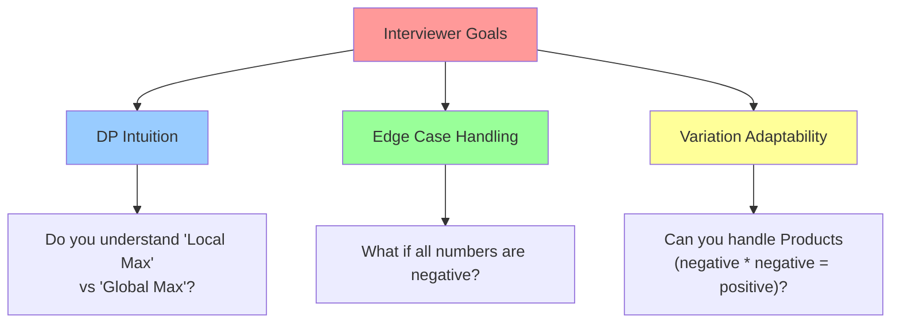
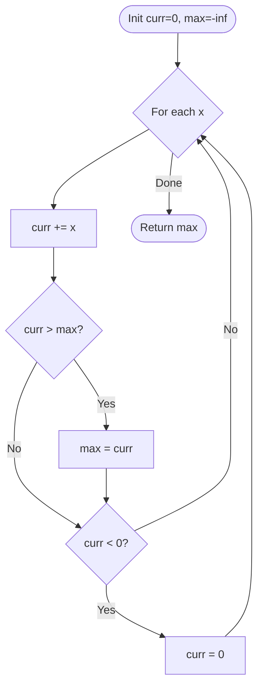

# 🎯 WEEK 5 DAY 4 (Part B): KADANE'S ALGORITHM — COMPLETE GUIDE

**Category:** Core Problem-Solving Patterns / Dynamic Programming  
**Difficulty:** 🟡 Medium  
**Prerequisites:** Arrays (Week 2 Day 1), Basic Iteration  
**Interview Frequency:** 75% (Extremely High — "Maximum Subarray" is a default screener)  
**Real-World Impact:** Financial Signal Processing, Computer Vision, Data Mining

---

## 🎓 LEARNING OBJECTIVES

By the end of this topic, you will be able to:

- ✅ **Master** the intuition behind resetting negative prefixes to maximize sums.
- ✅ **Apply** Kadane's Algorithm to find Maximum Subarray Sum in O(N).
- ✅ **Extend** the logic to Maximum Product Subarray (tracking min and max).
- ✅ **Solve** Circular Subarray problems using standard Kadane's as a subroutine.
- ✅ **Visualize** the "decision point" at every element: "Start new" vs. "Extend previous".

| 🎯 Objective | 📍 Primary Section |
|:---|:---|
| Core Philosophy & Mental Model | Section 2: The What |
| Mechanical Implementation Steps | Section 3: The How |
| Worked Examples with Traces | Section 4: Visualization |
| Complexity & Performance Analysis | Section 5: Critical Analysis |
| Real-World Production Systems | Section 6: Real Systems |

---

## 🤔 SECTION 1: THE WHY — Engineering Motivation

### 🎯 Real-World Problems This Solves

#### Problem 1: High-Frequency Trading (Profit Maximization)

**🌍 Where:** Fintech Algorithms (HFT), Stock Analysis  
**💼 Concrete Challenge:**  
You have a stream of price changes (deltas) for a stock: `[+1.2, -0.5, +3.0, -5.0, +2.0]`. You want to identify the **single continuous time window** where the profit was maximized.  
- Buying at the start of the window and selling at the end yields the max gain.

**Pattern:** Kadane's Algorithm.
- Scan the price deltas once.
- Maintain a running sum. If the running sum drops below zero, reset it (because carrying a loss hurts future profits).
- Track the maximum sum seen.

**Impact:** Instant identification of golden windows in millions of data points.

---

#### Problem 2: Computer Vision (Brightest Spot Detection)

**🌍 Where:** Astronomer Software, Object Detection  
**💼 Concrete Challenge:**  
In a 1D scanline of an image, find the brightest continuous segment (highest sum of pixel intensities, possibly adjusted by a baseline).  
- Useful for detecting stars or features in noisy signals.

**Pattern:** Kadane's Algorithm (Max Subarray).
- If pixel values are normalized (some negative, some positive relative to background), Kadane finds the "object".

**Impact:** Fast feature extraction without complex 2D convolutions.

---

#### Problem 3: DNA Sequence Analysis (GC-Content)

**🌍 Where:** Bioinformatics (Genomics)  
**💼 Concrete Challenge:**  
Identify regions in a DNA sequence that are rich in 'G' and 'C' nucleotides (associated with genes).  
- Assign `+1` for G/C and `-1` for A/T.
- Find the subarray with the maximum sum.

**Impact:** Locating genes in massive genomes efficiently.

---

### ⚖ Design Problem & Trade-offs

**Core Design Problem:**  
How do we find the "best" contiguous slice of an array without checking every possible slice?

#### Approach Comparison Table

| Approach | Strategy | Time Complexity | Space Complexity | Best For |
|----------|----------|-----------------|------------------|----------|
| **Brute Force (Naive)** | Check all `(i, j)` pairs | O(N³) | O(1) | Never (Tutorials only) |
| **Brute Force (Optimized)** | Cumulative Sum Loop | O(N²) | O(1) | Small N (< 1000) |
| **Divide & Conquer** | Split, MaxLeft, MaxRight, Cross | O(N log N) | O(log N) | Parallel Computing |
| **Kadane's Algorithm** | Dynamic Programming (Greedy) | **O(N)** | **O(1)** | **Standard Solution** |

**Trade-off:**  
Kadane's is optimal (O(N)) but only works for **contiguous** subarrays. If you can pick non-contiguous elements, you just sum all positive numbers (trivial). Kadane's specifically solves the constraint of "adjacency".

---

### 💼 Interview Relevance

**Common Interview Archetypes:**

| 🔴 Red Flag Keywords | Problem Type | Example |
|---------------------|--------------|---------|
| "Contiguous subarray" | Kadane's | Maximum Subarray |
| "Largest sum", "Max profit" | Kadane's | Best Time to Buy/Sell Stock |
| "Max Product" | Double-Variable Kadane | Maximum Product Subarray |
| "Circular array max sum" | Two-Pass Kadane | Maximum Circular Subarray Sum |
| "Max Sum Rectangle" | 2D Kadane | Max Sum of Rectangle No Larger Than K |

**What Interviewers Test:**



---

## 📌 SECTION 2: THE WHAT — Mental Model & Core Concepts

### 🧠 Core Analogy: The "Heavy Backpack"

Imagine you are walking along a trail collecting gold coins (positive numbers).
- Sometimes you find gold (`+5`). You put it in your backpack.
- Sometimes you get robbed or hit a debt trap (`-3`). This subtracts from your backpack's value.

**The Rule:**
If your backpack's total value ever drops **below zero** (you are in debt), **dump the backpack immediately**.
- Why? Because starting empty (0) is mathematically better than starting with debt (-5). Any future gold you find will be worth *more* if you start fresh than if you use it to pay off old debt.
- **Invariant:** A subarray with a negative sum is never part of the optimal solution's prefix.

---

### 🖼 Visual Representation

**Input:** `[-2, 1, -3, 4, -1, 2, 1, -5, 4]`

```text
Step 1: -2.  Backpack: -2.  DUMP! (Reset to 0). Max: -2.
Step 2:  1.  Backpack:  1.  Keep.              Max:  1.
Step 3: -3.  Backpack: -2.  DUMP! (Reset to 0). Max:  1.
Step 4:  4.  Backpack:  4.  Keep.              Max:  4.
Step 5: -1.  Backpack:  3.  Keep.              Max:  4.
Step 6:  2.  Backpack:  5.  Keep.              Max:  5.
Step 7:  1.  Backpack:  6.  Keep.              Max:  6.
```

---

### 🔑 Core Invariants

**Invariant 1: The "Clean Slate"**
If `CurrentSum < 0`, reset `CurrentSum` to `0` (or `num` itself).
- Rationale: A negative prefix reduces the sum of any subsequent sequence.

**Invariant 2: Local vs Global**
- `CurrentSum`: The maximum sum ending at the *current* position `i`.
- `GlobalMax`: The maximum sum seen *anywhere* so far.

**Invariant 3: Product Flip (For Max Product)**
- A negative number flips `Max` to `Min` and `Min` to `Max`.
- When tracking product, you must track **both** `MaxSoFar` and `MinSoFar` because a huge negative number times a negative number becomes a huge positive number.

---

### 📋 Core Concepts & Variations (List All)

#### 1. Standard Kadane (Max Sum)
- **Goal:** Max subarray sum.
- **Logic:** `curr = max(num, curr + num)`.
- **Complexity:** O(N).

#### 2. Max Product Subarray
- **Goal:** Max subarray product.
- **Logic:** Swap `max` and `min` when `num < 0`. `currMax = max(num, max*num)`.
- **Complexity:** O(N).

#### 3. Circular Subarray Sum
- **Goal:** Max sum allowing wrap-around.
- **Logic:** Result is `Max(Kadane(A), TotalSum - MinKadane(A))`.
- **Complexity:** O(N).

---

## ⚙ SECTION 3: THE HOW — Mechanical Walkthrough

### 🔧 Operation 1: Kadane's Algorithm (Max Sum)

**Problem:** `[-2, 1, -3, 4, -1, 2, 1]`

**Visual Flowchart:**



**Mechanical Steps:**
1. Initialize `currentSum = 0`, `maxSum = -Infinity`.
2. Iterate through array:
   - Add `num` to `currentSum`.
   - Update `maxSum = max(maxSum, currentSum)`.
   - If `currentSum < 0`, reset `currentSum = 0`.
3. Return `maxSum`.

*(Note: Handling "all negatives" requires a tiny tweak: strictly `curr = max(num, curr + num)` instead of `curr = 0`.)*

---

### 🔧 Operation 2: Max Product Subarray

**Problem:** `[2, 3, -2, 4]`

**Mechanical Steps:**
1. Init `currMax = 1`, `currMin = 1`, `res = max(nums)`.
2. Iterate `n` in nums:
   - If `n == 0`, reset `currMax, currMin = 1`. Continue.
   - `tmp = currMax * n`.
   - `currMax = max(n * currMax, n * currMin, n)`.
   - `currMin = min(tmp, n * currMin, n)`.
   - `res = max(res, currMax)`.
3. Return `res`.

---

## 🎨 SECTION 4: VISUALIZATION — Simulation & Examples

### 🧊 Trace: Standard Kadane

**Input:** `[-2, 1, -3, 4, -1, 2, 1, -5, 4]`

| Step | Num | CurrentSum (Before) | Action (Add) | New CurrentSum | MaxSoFar | Explanation |
|:---:|:---:|:---:|:---:|:---:|:---:|:---|
| 1 | -2 | 0 | Add -2 | -2 -> **0** | -2 | Reset (Negative) |
| 2 | 1 | 0 | Add 1 | 1 | 1 | Start fresh |
| 3 | -3 | 1 | Add -3 | -2 -> **0** | 1 | Reset |
| 4 | 4 | 0 | Add 4 | 4 | 4 | New Peak |
| 5 | -1 | 4 | Add -1 | 3 | 4 | Dip, but keep |
| 6 | 2 | 3 | Add 2 | 5 | 5 | Recover & Grow |
| 7 | 1 | 5 | Add 1 | 6 | **6** | Peak |
| 8 | -5 | 6 | Add -5 | 1 | 6 | Big Dip |
| 9 | 4 | 1 | Add 4 | 5 | 6 | Recover |

**Result:** 6

---

### 📈 Trace: Max Product (The "Negative Flip")

**Input:** `[-2, 3, -4]`

| Num | Prev Max | Prev Min | Curr Max (Calc) | Curr Min (Calc) | Global Max | Note |
|:---:|:---:|:---:|:---|:---|:---:|:---|
| -2 | 1 | 1 | -2 | -2 | -2 | Init |
| 3 | -2 | -2 | `max(3, -6, -6)` = 3 | `min(3, -6, -6)` = -6 | 3 | 3 > -2 |
| -4 | 3 | -6 | `max(-4, -12, 24)` = **24** | `min(-4, -12, 24)` = -12 | **24** | Min(-6) * Neg(-4) = Pos(24)! |

---

## 📊 SECTION 5: CRITICAL ANALYSIS — Performance & Robustness

### 📈 Complexity Table

| Algorithm | Time Complexity | Space Complexity | Why? |
|-----------|-----------------|------------------|------|
| **Kadane's (Max Sum)** | O(N) | O(1) | Single pass, 2 variables. |
| **Kadane's (Max Product)** | O(N) | O(1) | Single pass, 3 variables. |
| **Circular Kadane** | O(N) | O(1) | Two passes (Max and Min). |
| **Brute Force** | O(N²) | O(1) | Nested loops. |

### 🧠 Trade-offs
- **Overflow:** Sums can grow very large. In C#, use `long` if values are large.
- **Empty Array:** Define behavior (return 0 or throw exception).
- **All Negatives:** If the problem requires at least one element selected, standard `reset to 0` logic returns 0 (empty subarray). For "at least one", initialize `max = -Infinity` and `current = max(num, current + num)`.

### ⚠ Edge Cases
1. **All Negative Numbers:** `[-5, -2, -9]`. Result should be `-2` (max single element), not `0`.
2. **Alternating Signs:** `[1, -1, 1, -1]`. Kadane handles this naturally.
3. **Zeros:** `[0, -1, 0, 1]`. Zeros reset products but are neutral for sums.

---

## 🏭 SECTION 6: REAL SYSTEMS — Integration in Production

### 🏭 System 1: Financial Trading (Momentum Strategies)
**Use Case:** Identifying trends.
**Logic:** Use Kadane's on log-returns of stock prices to find the strongest positive momentum window for backtesting strategies.

### 🏭 System 2: Digital Signal Processing (Voice Activation)
**Use Case:** VAD (Voice Activity Detection).
**Logic:** Audio signals fluctuate around 0. Squared amplitudes are positive. Use sliding window or Kadane-like logic on energy levels to detect "speech segments" (high energy subarrays) vs "silence".

### 🏭 System 3: Data Mining (Association Rules)
**Use Case:** Finding significant sequences.
**Logic:** In a sequence of user actions (scored by value), find the "highest value session" to analyze user engagement peaks.

### 🏭 System 4: Computer Vision (Object Bounding)
**Use Case:** Finding features.
**Logic:** 2D version of Kadane's (checking all column pairs) finds the brightest rectangular region in an image (O(N³)), used for initial object proposal.

### 🏭 System 5: Compression (RLE Optimization)
**Use Case:** finding redundant blocks.
**Logic:** Analyzing delta streams to find segments where compression yields maximum gain.

---

## 🔗 SECTION 7: CONCEPT CROSSOVERS

### 📚 Builds On (Prerequisites)
- **Iteration:** Basic `for` loops.
- **Math:** `max()` and `min()` functions.
- **Greedy:** Making the local optimal decision (drop negative prefix).

### 🚀 Used By (Future Topics)
- **Dynamic Programming:** Kadane's is effectively 1D DP (`dp[i] = max(nums[i], nums[i] + dp[i-1])`).
- **2D Maximum Subarray:** Uses Kadane's as a subroutine for rows/columns.
- **Sliding Window:** Related concept (though Kadane's window size is variable).

---

## 🧩 5 COGNITIVE LENSES

### 🧠 1. The "Investment" Lens
Treat the current subarray as an investment portfolio.
- Positive numbers are gains.
- Negative numbers are market crashes.
- If your portfolio value hits zero (or negative), you "liquidate" and restart. Why keep a losing portfolio?

### 📉 2. The "Anchor" Lens
For any index `i`, the "Max Subarray ending at `i`" is either:
1. Just `nums[i]` (start fresh).
2. `nums[i] + MaxEndingAt(i-1)` (extend previous).
We pick the larger one. This is the DP recurrence relation.

### 🔋 3. The "Energy" Lens
Think of `currentSum` as battery charge.
- Positive numbers charge it.
- Negative numbers drain it.
- If charge < 0, the battery is dead. Replace it with a new one (Reset).

### 🛠️ 4. The "Two-Variable" Lens (Product)
For Product, we need two variables because `-` x `-` = `+`.
We track the "Max Positive Potential" and "Max Negative Potential" at every step.

### 🔄 5. The "Complement" Lens (Circular)
Max Circular Sum = Total Sum - Min Subarray Sum.
Why? The "wrap around" max is just the total array minus the "non-contributing" middle part (which must be the minimum subarray).

---

## ⚔ SUPPLEMENTARY OUTCOMES

### ⚔ Practice Problems (10 Problems)

1.  **Maximum Subarray** (Easy) - *Classic Kadane.*
2.  **Maximum Product Subarray** (Medium) - *Track Min and Max.*
3.  **Maximum Circular Subarray Sum** (Medium) - *Kadane + Min-Kadane.*
4.  **Best Time to Buy and Sell Stock** (Easy) - *Variation of Max Subarray.*
5.  **Longest Turbulent Subarray** (Medium) - *Kadane logic on comparison signs.*
6.  **Maximum Absolute Sum of Any Subarray** (Medium) - *Max(Kadane, |MinKadane|).*
7.  **K-Concatenation Maximum Sum** (Medium) - *Kadane on repeated array.*
8.  **Degree of an Array** (Easy) - *Frequency + Subarray logic.*
9.  **Continuous Subarray Sum** (Medium) - *Prefix sums + Modulo.*
10. **Max Sum of Rectangle No Larger Than K** (Hard) - *2D Kadane + TreeSet.*

### 🎙 Interview Questions (6 Questions)

1.  **Q:** What if the array contains all negative numbers?
    -   **A:** Standard Kadane with `reset to 0` returns 0. If "empty subarray not allowed", initialize `max` to `-inf` and `curr` to `nums[0]`.

2.  **Q:** Can you reconstruct the subarray indices (Start, End)?
    -   **A:** Yes. Maintain `tempStart`. When `curr` resets, `tempStart = i+1`. When `max` updates, `finalStart = tempStart`, `finalEnd = i`.

3.  **Q:** Solve Maximum Product Subarray. Why is it harder?
    -   **A:** Negative numbers flip signs. We must track both `max` and `min` products ending at `i`.

4.  **Q:** How do you solve the Circular Subarray problem?
    -   **A:** Case 1: Max is non-circular (Standard Kadane). Case 2: Max is circular (Total Sum - Min Subarray). Handle edge case where all numbers are negative.

5.  **Q:** Is Kadane's Algorithm Divide and Conquer?
    -   **A:** No, it's Dynamic Programming / Greedy. (Though there IS a D&C solution for Max Subarray, it's O(N log N)).

6.  **Q:** Difference between "Subarray" and "Subsequence"?
    -   **A:** Subarray is contiguous (Kadane applies). Subsequence is not (Just sum all positive numbers).

### ❌ Common Misconceptions

1.  **"Kadane works for non-contiguous"**
    -   *Correction:* No, only contiguous. Non-contiguous is trivial O(N).
2.  **"Reset when sum decreases"**
    -   *Correction:* No! Only reset when sum becomes **negative**. A dip (from 10 to 8) is fine; we might go back up to 20 later.
3.  **"Max Product is just Kadane"**
    -   *Correction:* Max Product needs 3 variables (Max, Min, Res), not just 2.

### 🚀 Advanced Concepts
-   **Kadane on Trees:** Finding the maximum path sum in a binary tree (similar logic, post-order traversal).
-   **Max Sum Submatrix:** 2D version. Fix two rows, treat column sums as 1D array, run Kadane. O(R²C).

### 🔗 External Resources
1.  **VisualAlgo:** "Dynamic Programming" (visualizes the decision process).
2.  **Wikipedia:** "Maximum Subarray Problem" (History and variations).
3.  **YouTube:** "Kadane's Algorithm - Maximum Subarray" (NeetCode).

---

## 🎯 RETENTION HOOK

### 🪝 The "One-Liner" Essence
> **"A negative past is dead weight; drop it and start fresh."**

### 🧠 Memory Aid: "P.O.S."
- **P**ositive? Keep adding.
- **O**h no (Negative sum)? Reset.
- **S**ave Max.

**Final Thought:** Kadane's is the perfect example of an O(N) optimization over a naive O(N²) approach. It teaches you to look for "invariants" that allow you to discard history safely.

---

**End of Instructional File**  
*Output generated strictly following Template v10 and System Config v10.*