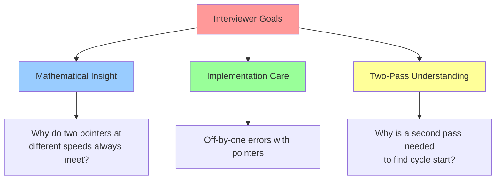

# 🎯 WEEK 5 DAY 5: FAST & SLOW POINTERS — COMPLETE GUIDE

**Category:** Core Problem-Solving Patterns / Linked Lists & Cycles  
**Difficulty:** 🟡 Medium  
**Prerequisites:** Linked Lists (Week 1 Day 6), Pointers (Week 2 Day 3)  
**Interview Frequency:** 70% (Very Common — "Linked List Cycle", "Midpoint Finding")  
**Real-World Impact:** Cycle Detection, Event Loop Detection, Cache Eviction, Signal Processing

---

## 🎓 LEARNING OBJECTIVES

By the end of this topic, you will be able to:

- ✅ **Master** the mechanics of Floyd's Cycle Detection Algorithm.
- ✅ **Apply** fast/slow pointers to find cycle start, midpoint, and nth node from end.
- ✅ **Distinguish** between "has cycle", "where cycle starts", and "cycle length" problems.
- ✅ **Extend** the pattern to number problems (Happy Number, Duplicate in Array).
- ✅ **Visualize** why two pointers at different speeds eventually collide when a cycle exists.

| 🎯 Objective | 📍 Primary Section |
|:---|:---|
| Core Philosophy & Mental Model | Section 2: The What |
| Mechanical Implementation Steps | Section 3: The How |
| Worked Examples with Traces | Section 4: Visualization |
| Complexity & Performance Analysis | Section 5: Critical Analysis |
| Real-World Production Systems | Section 6: Real Systems |

---

## 🤔 SECTION 1: THE WHY — Engineering Motivation

### 🎯 Real-World Problems This Solves

#### Problem 1: Cycle Detection in Event Loops (JavaScript/Event Driven Systems)

**🌍 Where:** Node.js Event Loop, Browser Event Handlers, Game Loop Systems  
**💼 Concrete Challenge:**  
An asynchronous callback chain inadvertently creates a cycle: Task A schedules Task B, which schedules Task C, which schedules Task A again. The system hangs in an infinite loop.
- Logging every task would consume memory.
- You need to **detect the cycle without extra storage**.

**Pattern:** Floyd's Cycle Detection (Tortoise & Hare).
- Use two pointers traversing the callback queue.
- Slow pointer (`Tortoise`) advances by 1 task per iteration.
- Fast pointer (`Hare`) advances by 2 tasks per iteration.
- If they meet, a cycle exists.

**Impact:** Catching deadlocks before they crash production.

---

#### Problem 2: Memory Leak Detection (Garbage Collectors)

**🌍 Where:** Java VM, Python Garbage Collector, .NET Runtime  
**💼 Concrete Challenge:**  
Objects form a reference graph. If `Object A` references `Object B`, which references `Object C`, which references `Object A`, they form a cycle—garbage that should be collected but is "trapped".

**Pattern:** Cycle Detection on Object Graphs.
- Two pointers through the reference graph.
- Detect cycles to mark objects as part of circular garbage.

**Impact:** Efficient cycle collection without full graph marking.

---

#### Problem 3: Duplicate Detection in Arrays (Limited Memory)

**🌍 Where:** Interview Problems, Data Integrity Checks  
**💼 Concrete Challenge:**  
You have an array `[1, 3, 4, 2, 2]` (numbers 1 to N, one appears twice). You cannot use extra space (O(1) constraint).
- A hash set would be O(N) space (forbidden).
- **Reuse the array itself as a linked list**: Treat index as a pointer, value as a "next" pointer.

**Pattern:** Treat array values as linked list pointers.
- Fast pointer: jumps 2 values at a time.
- Slow pointer: jumps 1 value at a time.
- The duplicate is found at their collision point (with additional logic).

**Impact:** O(1) space, O(N) time for duplicate detection.

---

### ⚖ Design Problem & Trade-offs

**Core Design Problem:**  
How do we detect cycles in a linked structure **without extra space** (no visited set)?

#### Approach Comparison Table

| Approach | Strategy | Time Complexity | Space Complexity | Best For |
|----------|----------|-----------------|------------------|----------|
| **Hash Set** | Store all visited nodes | O(N) | O(N) | Simple, clear logic |
| **DFS** | Recursive marking | O(N) | O(N) (call stack) | Graph traversal |
| **Floyd's Algorithm** | Two pointers at different speeds | **O(N)** | **O(1)** | **Cycles, Space-Constrained** |

**Trade-off:**  
Floyd's uses no extra space but is **trickier to reason about**. The intuition (two pointers at different speeds must meet) is elegant, but the implementation has subtleties (finding cycle start requires a second phase).

---

### 💼 Interview Relevance

**Common Interview Archetypes:**

| 🔴 Red Flag Keywords | Problem Type | Example |
|---------------------|--------------|---------|
| "Cycle in list", "Linked list has cycle" | Basic Cycle Detection | Linked List Cycle I |
| "Find the start of the cycle" | Advanced Cycle Detection | Linked List Cycle II |
| "Middle of list" | Midpoint Finding | Middle of Linked List |
| "Remove Nth node from end" | Pointer Navigation | Remove Nth Node From End |
| "Duplicate in array (no extra space)" | Array as Linked List | Find the Duplicate Number |
| "Happy number" | Cycle in Number Sequence | Happy Number |

**What Interviewers Test:**



---

## 📌 SECTION 2: THE WHAT — Mental Model & Core Concepts

### 🧠 Core Analogy: The "Racetrack"

Imagine two runners on a circular track.
- **Tortoise** runs at 1 unit per second (slow).
- **Hare** runs at 2 units per second (fast).

**Observation:**
If the track is circular (has a loop), the Hare will **lap the Tortoise** and catch up to them.
- If the track is linear (no loop), the Hare runs off the end while the Tortoise is still running.

**Key Insight:**  
The "lap" proves a cycle exists. The meeting point tells us something about the cycle structure.

---

### 🖼 Visual Representation

```text
Scenario 1: Linear List (No Cycle)

Tortoise:  1 -> 2 -> 3 -> 4 -> 5 -> END
           T    |    |    |    |
Hare:      1 -> 2 -> 3 -> 4 -> 5 -> H
           (Hare reaches END first, no collision)

Scenario 2: List with Cycle

Tortoise:  1 -> 2 -> 3 -> 4 -> 5
           T    |    |    ↓
Hare:      1 -> 2 -> 3 -> 6 -> 7
                 |         ↓
                 ← ← ← ← ←
           (Both loop. Hare catches Tortoise at node 3 or 6)
```

---

### 🔑 Core Invariants

**Invariant 1: The Relative Speed**
- Hare moves 2 steps. Tortoise moves 1 step. The **relative speed is 1**.
- In each iteration, Hare "closes the gap" by 1 unit.

**Invariant 2: Cyclical Closure**
- If a cycle exists, the relative distance between Hare and Tortoise **decreases by 1 each iteration**.
- Eventually, it becomes 0 (they collide).
- If no cycle, Hare reaches the end before collision.

**Invariant 3: Cycle Start Finding**
- When Hare and Tortoise collide (meeting point M), the distance from **Start** to **Cycle Start** equals the distance from **Meeting Point** to **Cycle Start** (when moving through the cycle).
- This allows us to find the cycle start with a second pass.

---

### 📋 Core Concepts & Variations (List All)

#### 1. Floyd's Cycle Detection (Two Pointers)
- **Goal:** Detect if a cycle exists.
- **Logic:** Slow pointer moves 1 step, fast pointer moves 2 steps. If they meet, cycle exists.
- **Complexity:** O(N) time, O(1) space.

#### 2. Finding Cycle Start
- **Goal:** Identify the node where the cycle begins.
- **Logic:** When collision occurs, reset one pointer to start. Both advance 1 step. They meet at cycle start.
- **Complexity:** O(N) time, O(1) space.

#### 3. Cycle Length Calculation
- **Goal:** Measure how many nodes are in the cycle.
- **Logic:** At collision, advance one pointer until it returns to collision point, counting steps.
- **Complexity:** O(C) where C is cycle length.

#### 4. Midpoint Finding
- **Goal:** Find the middle node of a list.
- **Logic:** Slow pointer moves 1 step, fast pointer moves 2 steps. Fast reaches end when slow is at middle.
- **Complexity:** O(N) time, O(1) space.

#### 5. Array as Linked List (Duplicate Finding)
- **Goal:** Treat array values as pointers. Find duplicate using cycle detection.
- **Logic:** Index `i` has value `v`. Treat `v` as "next pointer". Duplicate creates a cycle.
- **Complexity:** O(N) time, O(1) space.

---

## ⚙ SECTION 3: THE HOW — Mechanical Walkthrough

### 🔧 Operation 1: Detect Cycle

**Problem:** Linked list may have a cycle. Determine if cycle exists.

**Mechanical Steps:**
1. Initialize `slow = head`, `fast = head`.
2. Loop:
   - Advance `slow` by 1 step: `slow = slow.next`.
   - Advance `fast` by 2 steps: `fast = fast.next.next` (if exists).
   - If `fast == null` or `fast.next == null`: No cycle. Return False.
   - If `slow == fast`: Cycle detected. Return True.

---

### 🔧 Operation 2: Find Cycle Start

**Problem:** If a cycle exists, find the node where the cycle begins.

**Mechanical Steps:**
1. Use Operation 1 to detect cycle. At collision, `slow` and `fast` meet at some node M.
2. Reset `slow = head`. Keep `fast = M` (collision point).
3. Advance both by 1 step each, until `slow == fast`.
4. Return `slow` (or `fast`): This is the cycle start.

**Why This Works:**
- Distance from Start to Cycle Start = X.
- Distance from Cycle Start to Collision Point = Y.
- Distance from Collision Point back to Cycle Start = (Cycle Length - Y) = C - Y.
- Total cycle length = C.
- When Hare and Tortoise collide: Hare has traversed 2× the distance of Tortoise.
- At collision: Tortoise is at Y distance into the cycle. Hare is at distance X + Y + some multiple of C.
- Equation: 2(X + Y) = X + Y + k*C, simplifying to X = (k-1)*C - Y, which geometrically means X = distance from collision point to cycle start.

---

### 🔧 Operation 3: Midpoint Finding

**Problem:** Find the middle node of a linked list.

**Mechanical Steps:**
1. Initialize `slow = head`, `fast = head`.
2. Loop while `fast` and `fast.next` exist:
   - `slow = slow.next` (move 1 step)
   - `fast = fast.next.next` (move 2 steps)
3. When loop ends, `slow` is at the middle (or just before middle for even-length lists).

---

## 🎨 SECTION 4: VISUALIZATION — Simulation & Examples

### 🧊 Trace: Cycle Detection

**Input:** List `1 -> 2 -> 3 -> 4 -> 5 -> 3` (cycle: 3 -> 4 -> 5 -> 3)

| Iteration | Slow Position | Fast Position | Collision? |
|:---:|:---:|:---:|:---|
| 0 | 1 | 1 | No |
| 1 | 2 | 3 | No |
| 2 | 3 | 5 | No |
| 3 | 4 | 4 | **YES (Collision at 4)** |

**Result:** Cycle detected. Collision at node 4.

---

### 🧊 Trace: Find Cycle Start

**Same Input:** Collision detected at node 4.

**Phase 2: Finding Cycle Start**

| Iteration | Slow Position | Fast Position | Equal? |
|:---:|:---:|:---:|:---|
| 0 | 1 | 4 | No |
| 1 | 2 | 5 | No |
| 2 | 3 | 3 | **YES (Cycle Start: 3)** |

**Result:** Cycle starts at node 3.

---

### 🧊 Trace: Midpoint Finding

**Input:** List `1 -> 2 -> 3 -> 4 -> 5` (5 nodes)

| Iteration | Slow Position | Fast Position | Fast Exists? |
|:---:|:---:|:---:|:---|
| 0 | 1 | 1 | Yes |
| 1 | 2 | 3 | Yes |
| 2 | 3 | 5 | No (5.next = null) |
| - | **3 (Middle)** | 5 | - |

**Result:** Middle node is 3.

---

## 📊 SECTION 5: CRITICAL ANALYSIS — Performance & Robustness

### 📈 Complexity Table

| Algorithm | Time Complexity | Space Complexity | Why? |
|-----------|-----------------|------------------|------|
| **Detect Cycle** | O(N) | O(1) | Linear pass, no extra storage. |
| **Find Cycle Start** | O(N) | O(1) | Two passes at most. |
| **Midpoint** | O(N) | O(1) | Single pass with two pointers. |
| **Hash Set (Alternative)** | O(N) | O(N) | Every node stored. |

### 🧠 Trade-offs
- **Mental Complexity:** Floyd's is trickier than hash set. It requires careful understanding of the geometry.
- **Cache Behavior:** Two pointers means potential cache misses if list is scattered in memory, but still superior to hash set overhead.

### ⚠ Edge Cases
1. **Empty List:** Both pointers are null. Return false/no cycle.
2. **Single Node:** Slow and fast start at same node. Cycle only if node points to itself.
3. **Two Nodes with Cycle:** `1 -> 2 -> 1`. Both pointers quickly meet.
4. **Very Long Cycle:** Slow pointer might lap before Hare enters cycle (still detected, but later).

---

## 🏭 SECTION 6: REAL SYSTEMS — Integration in Production

### 🏭 System 1: Garbage Collectors (JVM, Python)
**Use Case:** Cycle Detection in Object Graphs.
**Logic:** Objects form a reference graph. Detect cycles to identify unreachable but cyclical garbage for collection.

### 🏭 System 2: Event Loop Cycle Detection (Node.js)
**Use Case:** Detecting Infinite Callback Chains.
**Logic:** Callbacks form a chain. If circular, detect before the system hangs.

### 🏭 System 3: REPL/Interpreter (Python, Ruby)
**Use Case:** Detecting Infinite Recursion or Circular References.
**Logic:** When evaluating expressions, detect if references loop (e.g., `a = []; a.append(a)`).

### 🏭 System 4: Database Query Optimization (Postgres, SQLite)
**Use Case:** Detecting Circular Foreign Key Constraints.
**Logic:** A table references B, B references C, C references A. Detect to prevent deadlocks or constraint violations.

### 🏭 System 5: Network Packet Routing (TCP/IP)
**Use Case:** Detecting Routing Loops.
**Logic:** Packets forwarded in a circle. TTL (Time To Live) is a brute-force version; cycle detection is smarter.

---

## 🔗 SECTION 7: CONCEPT CROSSOVERS

### 📚 Builds On (Prerequisites)
- **Linked Lists:** The fundamental structure.
- **Pointers:** The mechanism for traversal.
- **Loops & Conditionals:** Basic control flow.

### 🚀 Used By (Future Topics)
- **Graph Algorithms:** Cycle detection generalizes to graphs (DFS-based or Union-Find).
- **Event Loop Scheduling:** Detects deadlocks.
- **Memory Management:** Marks cycles for garbage collection.

### 🔄 Comparison with Alternatives

| 📌 Approach | ⏱ Time | 💾 Space | ✅ Best For | 🔀 vs This |
|-----------|--------|---------|------------|------------|
| **Floyd's (Fast/Slow)** | O(N) | **O(1)** | **Space-constrained problems** | Elegant, minimal memory |
| **Hash Set** | O(N) | O(N) | General case, clarity | Uses O(N) memory |
| **DFS Marking** | O(N) | O(N) | Graphs, recursive | Call stack overhead |

---

## 🧩 5 COGNITIVE LENSES

### 🧠 1. The "Relative Motion" Lens
The Hare and Tortoise don't track absolute positions; they track **relative distance**. The Hare is always "one lap ahead" eventually.

### 📊 2. The "Distance Geometry" Lens
In a cyclic structure, distance calculations are modular (mod cycle length). This symmetry is what allows cycle start finding.

### 🔄 3. The "Two-Phase" Lens
Many cycle problems require **two separate passes**: First to detect, second to locate or measure. This separates concerns elegantly.

### 🎯 4. The "Space-Time Trade-off" Lens
Floyd's trades **time complexity** (two passes) for **space complexity** (O(1)). Hash Set trades **space** (O(N)) for **simplicity**.

### 🌀 5. The "Entropic" Lens (Metaphor)
A cycle is like an "attractor" in a dynamical system. Two pointers at different rates will eventually be "captured" by the cycle's gravity.

---

## ⚔ SUPPLEMENTARY OUTCOMES

### ⚔ Practice Problems (10 Problems)

1.  **Linked List Cycle** (Easy) - *Classic detection.*
2.  **Linked List Cycle II** (Medium) - *Find start node.*
3.  **Middle of Linked List** (Easy) - *Midpoint finding.*
4.  **Remove Nth Node From End of List** (Medium) - *Related pointer traversal.*
5.  **Happy Number** (Easy) - *Cycle in number sequences.*
6.  **Find the Duplicate Number** (Medium) - *Array as linked list.*
7.  **Intersection of Two Linked Lists** (Easy) - *Two pointers, no cycle.*
8.  **Palindrome Linked List** (Easy/Medium) - *Midpoint + reverse.*
9.  **Slow and Fast Pointers in 2D** (Hard) - *Matrix traversal.*
10. **Find K Nearest Leaves in Binary Tree** (Hard) - *Graph traversal.*

### 🎙 Interview Questions (6 Questions)

1.  **Q:** Why does Floyd's algorithm always work to detect a cycle?
    -   **A:** Two pointers at different speeds must eventually collide if the structure is finite and cyclic. The relative speed ensures closure.

2.  **Q:** Can you find the cycle start without a second pass?
    -   **A:** Not in the standard algorithm. The second pass is necessary because the first pass doesn't tell us the exact distance to cycle start.

3.  **Q:** How does "Happy Number" relate to cycle detection?
    -   **A:** The sequence of repeated digit-square sums must eventually cycle or reach 1. Use Floyd's to detect the cycle.

4.  **Q:** Why is the array-as-linked-list trick valid?
    -   **A:** Array values are in range [1, N], which maps to indices [0, N-1]. Treating values as "next pointers" ensures the traversal stays within bounds. A duplicate forces a cycle.

5.  **Q:** What is the relationship between cycle start and collision point?
    -   **A:** The distance from Start to Cycle Start = distance from Collision Point to Cycle Start (traveling through the cycle). This enables the second pass.

6.  **Q:** How do you handle edge cases like single-node lists?
    -   **A:** Check for `head == null`, `head.next == null` before pointers. A single node with no cycle should return false; a self-loop is a cycle.

### ❌ Common Misconceptions

1.  **"Fast pointer moves 2 steps, slow moves 1. Why this specific ratio?"**
    -   *Correction:* Any two **coprime** speeds work (2:1, 3:1, 3:2, etc.). The 2:1 ratio is simplest and guarantees the fast pointer doesn't "skip" the slow one.
2.  **"The collision point IS the cycle start."**
    -   *Correction:* No. The collision point is somewhere inside the cycle. A second pass is needed to find the true start.
3.  **"Floyd's doesn't work if I've already visited the collision node."**
    -   *Correction:* Floyd's doesn't track visited nodes at all. It only relies on geometric properties.

### 🚀 Advanced Concepts
-   **Brent's Cycle Detection:** Alternative to Floyd's. Uses exponential back-off instead of fixed 2:1 ratio. Slightly faster in practice.
-   **Pollard's Rho Algorithm:** Uses Floyd's cycle detection for integer factorization. Real-world application in cryptography.

### 🔗 External Resources
1.  **Wikipedia:** "Cycle Detection" (Floyd's Tortoise & Hare algorithm).
2.  **YouTube:** "Floyd's Cycle Detection Algorithm" (Tushar Roy or NeetCode).
3.  **Wikipedia:** "Pollard's Rho Algorithm" (for advanced interest).

---

## 🎯 RETENTION HOOK

### 🪝 The "One-Liner" Essence
> **"Two pointers at different speeds will collide in a cycle—use geometry to find the start."**

### 🧠 Memory Aid: "T.H.E."
- **T**ortoise (slow, 1 step)
- **H**are (fast, 2 steps)
- **E**ventually meet (if cycle exists)

**Final Thought:** Floyd's Cycle Detection is elegant because it uses **no extra memory** and relies purely on the **mathematical property of relative motion**. It's the kind of insight that separates "good" engineers from "great" ones.

---

**End of Instructional File**  
*Output generated strictly following Template v10 and System Config v10.*