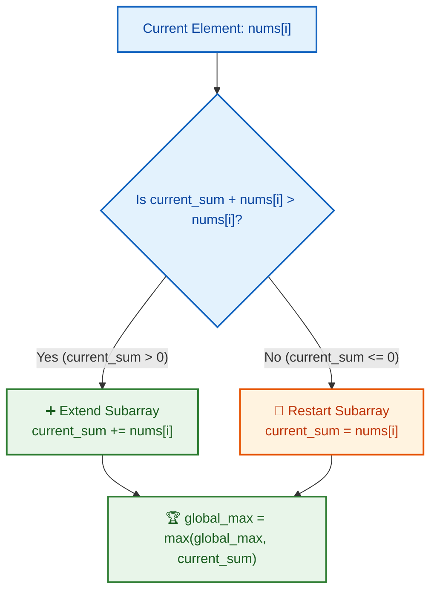
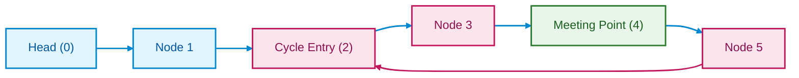

# 📊 Week 05 Visual Concepts Playbook (HYBRID)

> 🧭 **Navigation:** [🏠 Week Overview](README.md) • [📘 Curriculum Syllabus](../COMPLETE_SYLLABUS.md)
> 
> 💡 **Instructor Note:** *This Visual Playbook provides an intuitive, high-density synthesis of Tier-1 algorithmic patterns. Use it to solidify invariants, visualize state transitions, and master live interview trade-offs.*

---

## 📋 Quick Navigation

This playbook covers **five foundational pattern families** essential for Tier-1 FAANG interviews:

- **Day 1:** Hash Map & Hash Set Patterns (Complements, Frequencies, Deduplication)
- **Day 2:** Monotonic Stack (Next Greater Element, Stock Span, Boundary Spans)
- **Day 3:** Merge Operations & Interval Patterns (Merging, Insertion, Meeting Rooms)
- **Day 4:** Partition & Kadane's Algorithm (Dutch National Flag, Max Subarray, Max Product)
- **Day 5:** Fast-Slow Pointers (Cycle Detection, Midpoints, Cycle Length)

---

## 🎯 Visual Legend & Symbol Reference

| Symbol | Meaning | Example |
| :---: | :--- | :--- |
| `→` | Pointer single-step advance | `slow = slow.next` |
| `→→` | Fast pointer two-step advance | `fast = fast.next.next` |
| `[x]` | Active inspected element / window boundary | `nums[left ... right]` |
| `✓` | Valid state / invariant satisfied | `sum == target` |
| `✗` | Invalid state / candidate pruned | `current_end < next_start` |
| `L`, `R` | Left and Right boundary pointers | `L = 0, R = n - 1` |

---

# DAY 1: Hash Map & Hash Set Patterns

## Pattern Map: Hash Family Taxonomy

| Sub-Family | Core Mechanism | Canonical Problems | Big-O (Time / Space) |
| :--- | :--- | :--- | :---: |
| **Complement Lookup** | Check if `target - num` exists in seen set | Two Sum, 4Sum II, Pair with Difference | `O(N)` / `O(N)` |
| **Frequency Counting** | Bucket elements by count; compare distributions | Valid Anagram, Top-K Frequent Elements | `O(N)` / `O(K)` |
| **Prefix State Hash** | Store cumulative state to find matching sub-ranges | Subarray Sum Equals K, Contiguous Array | `O(N)` / `O(N)` |
| **Two-Pointer + Hash** | Sliding window with dynamic frequency constraint | Longest Substring Without Repeating Characters | `O(N)` / `O(min(N, Σ))` |
| **Group & Classify** | Canonical sorted string or tuple as hash key | Group Anagrams, Group Shifted Strings | `O(N * K)` / `O(N * K)` |

---

### Why Hash Patterns Matter

Hash lookups trade auxiliary memory for constant-time `O(1)` average access. Rather than re-scanning an array in nested loops (`O(N^2)`), a hash table acts as a **temporal memory bank**: as we scan forward, we record what we've seen so future elements can query past history instantly.

---

## Pattern 1.1: Two-Sum & Complement Lookup

### Concept

Given an array and a target, find two elements that sum to the target. Brute force tests every pair in `O(N^2)`. By querying `complement = target - current` against a hash set, we resolve each query in `O(1)`, achieving a single-pass `O(N)` solution.

### Visual 1: Two-Sum Execution Trace

Input: `nums = [2, 7, 11, 15]`, `target = 9`

| Step | Index | Element | Complement (`9 - x`) | In `seen` Map? | Action | `seen` Map State |
| :---: | :---: | :---: | :---: | :---: | :--- | :--- |
| **1** | `0` | `2` | `7` | ❌ No | Record `seen[2] = 0` | `{2: 0}` |
| **2** | `1` | `7` | `2` | ✅ **Yes! (at idx 0)** | **Pair Found! Return `[0, 1]`** | `{2: 0}` |

```text
[ 2 | 7 | 11 | 15 ]
  ^
  idx 0: need 7 -> not in seen -> store {2: 0}

[ 2 | 7 | 11 | 15 ]
      ^
      idx 1: need 2 -> FOUND in seen at idx 0! -> Output [0, 1]
```

### Visual 2: Hash Map Population Pattern

Finding all unique pairs summing to `target = 6` in `[3, 2, 4, 1, 5]`:

```text
Pass 1 (num = 3): need 3 -> seen empty           -> seen = {3}
Pass 2 (num = 2): need 4 -> 4 not in seen        -> seen = {3, 2}
Pass 3 (num = 4): need 2 -> 2 in seen! Pair (2,4)-> seen = {3, 2, 4}
Pass 4 (num = 1): need 5 -> 5 not in seen        -> seen = {3, 2, 4, 1}
Pass 5 (num = 5): need 1 -> 1 in seen! Pair (1,5)-> seen = {3, 2, 4, 1, 5}

Valid Pairs: (2, 4), (1, 5)
```

### Common Failure Modes: Day 1

> [!WARNING]
> **Failure 1.1: Pairing an Element With Itself**
> Never add the current element into the hash map *before* checking for its complement.
> - ❌ `seen[nums[i]] = i; if (target - nums[i] in seen) return [seen[target - nums[i]], i];` *(If `nums[i] * 2 == target`, it pairs with itself!)*
> - ✅ `if (target - nums[i] in seen) return [seen[target - nums[i]], i]; seen[nums[i]] = i;`

> [!WARNING]
> **Failure 1.2: Integer Overflow on Large Differences**
> When working with 32-bit signed integers in C# or Java, computing `target - nums[i]` can overflow if `target` is large positive and `nums[i]` is large negative.
> - ✅ Cast to `long` before subtraction: `long complement = (long)target - nums[i];`

> [!WARNING]
> **Failure 1.3: Duplicate Keys Overwriting Indices**
> When multiple identical values exist (e.g. `[3, 3]`, `target = 6`), storing only the latest index can corrupt multi-pair lookups.
> - ✅ If single-pair is required, returning on the first backward match handles duplicates naturally. If all pairs are required, map to a list of indices: `Dictionary<int, List<int>>`.

---

## Pattern 1.2: Frequency Counting & Anagrams

### Concept

Many string and collection problems boil down to: *"Do these collections share identical element frequencies?"* A frequency bucket array (`int[26]` for lowercase English) or hash map counts occurrences in `O(N)` time and `O(1)` or `O(K)` auxiliary space.

### Visual 1: Anagram Frequency Balance

Comparing `s = "listen"` and `t = "silent"`:

```text
Index:   'a' 'b' ... 'e' ... 'i' ... 'l' ... 'n' ... 's' ... 't' ... 'z'
Counts:   0   0       +1      +1      +1      +1      +1      +1      0   (After "listen")
Counts:   0   0        0       0       0       0       0       0      0   (After "silent")

All net frequencies == 0 -> Valid Anagram!
```

### Visual 2: Top-K Frequent Elements Trade-off

| Approach | Mechanism | Time Complexity | Auxiliary Space | When to Choose |
| :--- | :--- | :---: | :---: | :--- |
| **Hash + Full Sort** | Count frequencies, sort array of unique keys | `O(N log N)` | `O(N)` | Only for quick prototyping |
| **Hash + Min-Heap** | Maintain size-`k` min-heap of `(count, key)` | `O(N log k)` | `O(N + k)` | Optimal when `k << N` |
| **Bucket Sort** | Group elements into buckets indexed by frequency | `O(N)` | `O(N)` | Strictly optimal linear time |

---

## Quiz Questions: Day 1

1. **Q1 (Two Sum Variant):** If the array is already sorted, why is Two Pointers (`O(1)` space) preferred over a Hash Map (`O(N)` space)?
2. **Q2 (Space Bound):** Why is a frequency array `int[26]` considered `O(1)` space, whereas a hash map of arbitrary strings is `O(N)` space?
3. **Q3 (Streaming Invariant):** If numbers arrive as an infinite stream and you must detect if any pair sums to `k`, what cache eviction policy would you place on the hash set?

---

# DAY 2: Monotonic Stack

## Pattern Map: Monotonic Stack Taxonomy

| Stack Order | Stack Invariant | Pops When New Element Is... | Solves Queries For... | Canonical Problems |
| :--- | :--- | :--- | :--- | :--- |
| **Monotonic Decreasing** | Elements strictly decrease from bottom to top | **Greater** than stack top (`curr > top`) | **Next Greater Element**, Stock Span | Next Greater Element I/II, Daily Temperatures |
| **Monotonic Increasing** | Elements strictly increase from bottom to top | **Smaller** than stack top (`curr < top`) | **Next Smaller Element**, Boundary Spans | Largest Rectangle in Histogram, Trapping Rain Water |

---

### Why Monotonic Stacks Exist

Brute force search for the "next element satisfying property P" requires scanning rightward from each index (`O(N^2)`). A monotonic stack eliminates redundant comparisons by preserving a sorted prefix of unresolved candidates. Each element is pushed once and popped at most once, guaranteeing **amortized `O(N)` time**.

---

## Pattern 2.1: Next Greater Element

### Concept

For each element in an array, find the first element to its right that is strictly greater. Use a **monotonic decreasing stack** of indices.

### Visual 1: Decreasing Stack Execution Trace

Input: `nums = [2, 1, 2, 4, 3]`

| Step | Current Element | Stack (Indices / Values) | Comparison & Action | Resolved Next Greater |
| :---: | :---: | :--- | :--- | :--- |
| **1** | `nums[0] = 2` | `[ (0: 2) ]` | Stack empty -> Push `0` | None |
| **2** | `nums[1] = 1` | `[ (0: 2), (1: 1) ]` | `1 < 2` -> Push `1` | None |
| **3** | `nums[2] = 2` | `[ (0: 2), (2: 2) ]` | `2 > 1` -> **Pop 1** (`NGE[1] = 2`). `2 <= 2` -> Push `2` | `nums[1] -> 2` |
| **4** | `nums[3] = 4` | `[ (3: 4) ]` | `4 > 2` -> **Pop 2** (`NGE[2] = 4`). `4 > 2` -> **Pop 0** (`NGE[0] = 4`). Push `3` | `nums[2] -> 4`, `nums[0] -> 4` |
| **5** | `nums[4] = 3` | `[ (3: 4), (4: 3) ]` | `3 < 4` -> Push `4` | None |
| **End** | End of Array | Unpopped: `[3, 4]` | Remaining indices have no greater element to right | `nums[3] -> -1`, `nums[4] -> -1` |

```text
Stack State Progression:
Step 1: [ 2 ]
Step 2: [ 2, 1 ]
Step 3: [ 2 ]       <- 1 popped, NGE[1] = 2
        [ 2, 2 ]
Step 4: [ ]         <- Both 2s popped, NGE[2] = 4, NGE[0] = 4
        [ 4 ]
Step 5: [ 4, 3 ]
```

---

## Pattern 2.2: Stock Span Problem

### Concept

Given daily stock prices, calculate the span of each day: the maximum number of consecutive days (including today) where the price was `<= today's price`.

Use a **decreasing stack storing `(price, span)`**. When a higher price arrives, it pops and absorbs the spans of all lower prices.

### Visual 1: Stock Span Step Trace

Prices: `[100, 80, 60, 70, 60, 75, 85]`

| Day | Price | Stack Before | Action & Span Calculation | Stack After | Result Span |
| :---: | :---: | :--- | :--- | :--- | :---: |
| **0** | `100` | `[]` | Empty -> Push `(100, span=1)` | `[(100, 1)]` | **1** |
| **1** | `80` | `[(100, 1)]` | `80 < 100` -> Push `(80, span=1)` | `[(100, 1), (80, 1)]` | **1** |
| **2** | `60` | `[(100, 1), (80, 1)]` | `60 < 80` -> Push `(60, span=1)` | `[(100, 1), (80, 1), (60, 1)]` | **1** |
| **3** | `70` | `[(100, 1), (80, 1), (60, 1)]` | `70 > 60` -> Pop `(60, 1)`. `span = 1 + 1 = 2`. Push `(70, 2)` | `[(100, 1), (80, 1), (70, 2)]` | **2** |
| **4** | `60` | `[(100, 1), (80, 1), (70, 2)]` | `60 < 70` -> Push `(60, span=1)` | `[(100, 1), (80, 1), (70, 2), (60, 1)]` | **1** |
| **5** | `75` | `... (60, 1), (70, 2)` | `75 > 60` -> Pop `(60, 1)`. `75 > 70` -> Pop `(70, 2)`. `span = 1 + 1 + 2 = 4`. Push `(75, 4)` | `[(100, 1), (80, 1), (75, 4)]` | **4** |
| **6** | `85` | `... (80, 1), (75, 4)` | `85 > 75` -> Pop `(75, 4)`. `85 > 80` -> Pop `(80, 1)`. `span = 1 + 4 + 1 = 6`. Push `(85, 6)` | `[(100, 1), (85, 6)]` | **6** |

---

## Quiz Questions: Day 2

1. **Q1 (Invariant Check):** Why do we store array *indices* instead of raw *values* in monotonic stacks for interview problems?
2. **Q2 (Circular Variant):** In LeetCode 503 (Next Greater Element II on a circular array), how do we simulate wrapping without allocating an actual 2x array?
3. **Q3 (Histogram Intuition):** In Largest Rectangle in Histogram, what do the left and right popped boundaries represent geometrically?

---

# DAY 3: Merge Operations & Interval Patterns

## Pattern Map: Interval Processing Taxonomy

| Pattern | Key Sorting Criterion | Overlap Condition | Output Strategy |
| :--- | :--- | :--- | :--- |
| **Merge Overlapping** | Sort by `start_time` asc | `current.start <= prev.end` | Extend `prev.end = max(prev.end, current.end)` |
| **Insert Interval** | Already sorted by `start_time` | `interval.start <= new.end && new.start <= interval.end` | Add non-overlapping left, merge middle, add non-overlapping right |
| **Meeting Rooms I** | Sort by `start_time` asc | `curr.start < prev.end` | Return `false` on any overlap |
| **Meeting Rooms II** | Sort by `start_time` asc | `curr.start < min_heap.peek()` | Min-heap tracks active room end times |

---

## Pattern 3.1: Merge Overlapping Intervals

### Concept

Given an array of intervals, merge all overlapping intervals into non-overlapping spans covering the same ranges.

**Core Invariant:** If intervals are sorted by `start_time`, an interval can ONLY overlap with the interval immediately preceding it in the merged output.

### Visual 1: Timeline Interval Merge

Input: `[[1, 3], [2, 6], [8, 10], [15, 18]]`

```text
Timeline:
 0   1   2   3   4   5   6   7   8   9  10  11  12  13  14  15  16  17  18
 |---|---|---|---|---|---|---|---|---|---|---|---|---|---|---|---|---|---|
 [1 ===== 3]
     [2 ============= 6]        <- Overlaps (2 <= 3): Merge to [1 ===== 6]
                         [8 ===== 10]         <- Disjoint (8 > 6): Add [8 == 10]
                                             [15 ====== 18] <- Disjoint (15 > 10): Add [15 == 18]

Final Merged Set: [[1, 6], [8, 10], [15, 18]]
```

### Visual 2: General Overlap Detection Condition

```text
Case 1: Overlapping
Interval A: [start_A ================= end_A]
Interval B:         [start_B ================= end_B]
Condition:  max(start_A, start_B) <= min(end_A, end_B)
If sorted (start_A <= start_B): start_B <= end_A

Case 2: Disjoint (No Overlap)
Interval A: [start_A ======= end_A]
Interval B:                         [start_B ======= end_B]
Condition:  end_A < start_B
```

---

## Pattern 3.2: Insert Interval

### Concept

Insert `newInterval` into a list of non-overlapping sorted intervals, merging if necessary.

```text
Phase 1 (Before): Add all intervals where interval.end < newInterval.start
Phase 2 (Merge):  While interval.start <= newInterval.end:
                  newInterval.start = min(newInterval.start, interval.start)
                  newInterval.end   = max(newInterval.end, interval.end)
Phase 3 (After):  Add merged newInterval, then append all remaining intervals
```

---

## Pattern 3.3: Meeting Rooms II (Concurrent Allocation)

### Concept

Find the minimum number of conference rooms required to hold all scheduled meetings.

### Visual 1: Min-Heap Room Allocation Trace

Meetings: `[[0, 30], [5, 10], [15, 20]]` (Sorted by start time)

| Meeting | Min-Heap (`end_times`) | Comparison | Action | Active Rooms |
| :---: | :--- | :--- | :--- | :---: |
| `[0, 30]` | `[]` | Heap empty | Push `30` | **1** |
| `[5, 10]` | `[30]` | `5 < 30` (earliest room still busy) | Cannot reuse room. Push `10` | **2** |
| `[15, 20]` | `[10, 30]` | `15 >= 10` (room freed at 10!) | **Reuse room**: Pop `10`, Push `20` | **2** |

Max Rooms Required: **2**

---

### Common Failure Modes: Day 3

> [!WARNING]
> **Failure 3.1: Strict `<` vs `<=` in Overlap Detection**
> Clarify whether touching boundaries count as overlapping:
> - If `[1, 2]` and `[2, 3]` overlap: condition is `next.start <= prev.end`.
> - If `[1, 2]` and `[2, 3]` do NOT overlap: condition is `next.start < prev.end`.

> [!WARNING]
> **Failure 3.2: Forgetting to Sort by Start Time**
> Never assume input intervals are pre-sorted unless guaranteed by interview constraints. Sorting in `O(N log N)` guarantees the single-pass merge invariant.

---

## Quiz Questions: Day 3

1. **Q1 (Sorting Criteria):** Why must interval merging sort by `start_time` rather than `end_time`?
2. **Q2 (Sweep-Line Alternative):** How can Meeting Rooms II be solved without a min-heap using a sweep-line with `+1` and `-1` events?
3. **Q3 (Edge Case):** What happens if an interval has `start == end` (point interval `[2, 2]`)?

---

# DAY 4: Partition & Kadane's Algorithm

## Pattern Map: Partition & Subarray Optimization

| Pattern | Invariant | Pointers | Time / Space | Canonical Problems |
| :--- | :--- | :--- | :---: | :--- |
| **Lomuto Partition** | `arr[0...i] <= pivot`, `arr[i+1...j-1] > pivot` | Fast pointer `j`, boundary pointer `i` | `O(N)` / `O(1)` | QuickSort, QuickSelect (Kth Largest) |
| **Dutch National Flag** | 3 segregated regions: `[0s | 1s | Unprocessed | 2s]` | `low`, `mid`, `high` | `O(N)` / `O(1)` | Sort Colors, 3-Way Partition |
| **Kadane's Algorithm** | `dp[i] = max(nums[i], dp[i-1] + nums[i])` | Running local sum, global maximum | `O(N)` / `O(1)` | Maximum Subarray, Best Time to Buy Stock |
| **Kadane Min/Max** | Sign inversion: swap `min_prod` and `max_prod` | `max_dp`, `min_dp` | `O(N)` / `O(1)` | Maximum Product Subarray |

---

## Pattern 4.1: Dutch National Flag (3-Way Partition)

### Concept

Sort an array containing only `0`s, `1`s, and `2`s in-place in a single pass.

### Visual 1: Pointer Boundary Invariant

```text
Array Layout:
+--------------+--------------+------------------+--------------+
|     0s       |     1s       |   Unprocessed    |     2s       |
+--------------+--------------+------------------+--------------+
0            low-1           mid-1              high+1         n-1
               ^               ^                  ^
              low             mid                high

Rules at nums[mid]:
- nums[mid] == 0: swap(low, mid), low++, mid++
- nums[mid] == 1: mid++
- nums[mid] == 2: swap(mid, high), high--  (Do NOT advance mid! Newly swapped item is unknown)
```

---

## Pattern 4.2: Kadane's Algorithm (Maximum Subarray Sum)

### Concept

Find the contiguous subarray with the largest sum. At each index, decide:
1. **Extend:** Add `nums[i]` to the current running subarray.
2. **Restart:** Start a brand new subarray beginning at `nums[i]`.

### Visual 1: Kadane Decision Flowchart


```mermaid
flowchart TD
    Current["Current Element: nums[i]"]
    Check{"Is current_sum + nums[i] > nums[i]?"}
    Extend["➕ Extend Subarray<br/>current_sum += nums[i]"]
    Restart["🔄 Restart Subarray<br/>current_sum = nums[i]"]
    Update["🏆 global_max = max(global_max, current_sum)"]

    Current --> Check
    Check -->|"Yes (current_sum > 0)"| Extend
    Check -->|"No (current_sum <= 0)"| Restart
    Extend --> Update
    Restart --> Update

    classDef proc fill:#e3f2fd,stroke:#1565c0,stroke-width:2px,color:#0d47a1
    classDef warn fill:#fff3e0,stroke:#e65100,stroke-width:2px,color:#bf360c
    classDef success fill:#e8f5e9,stroke:#2e7d32,stroke-width:2px,color:#1b5e20
    class Current,Check proc
    class Restart warn
    class Extend,Update success
```

### Visual 2: Kadane Step-by-Step State Trace

Input: `[-2, 1, -3, 4, -1, 2, 1, -5, 4]`

| `i` | `nums[i]` | Choice: `max(nums[i], current + nums[i])` | `current_sum` | `global_max` | Subarray Action |
| :---: | :---: | :--- | :---: | :---: | :--- |
| `0` | `-2` | `max(-2, 0 + -2)` | `-2` | `-2` | Start at `[-2]` |
| `1` | `1` | `max(1, -2 + 1)` | `1` | `1` | Restart at `[1]` |
| `2` | `-3` | `max(-3, 1 + -3)` | `-2` | `1` | Extend `[1, -3]` |
| `3` | `4` | `max(4, -2 + 4)` | `4` | `4` | Restart at `[4]` |
| `4` | `-1` | `max(-1, 4 + -1)` | `3` | `4` | Extend `[4, -1]` |
| `5` | `2` | `max(2, 3 + 2)` | `5` | `5` | Extend `[4, -1, 2]` |
| `6` | `1` | `max(1, 5 + 1)` | `6` | **6** | Extend `[4, -1, 2, 1]` |
| `7` | `-5` | `max(-5, 6 + -5)` | `1` | `6` | Extend |
| `8` | `4` | `max(4, 1 + 4)` | `5` | `6` | Extend |

Max Subarray Sum: **6** (Subarray `[4, -1, 2, 1]`)

---

## Pattern 4.3: Maximum Product Subarray (Sign Inversion)

### Concept

Unlike addition, multiplying by a negative number turns a large minimum into a large maximum. We maintain both `max_prod` and `min_prod` at each step.

```text
When nums[i] < 0:
  swap(max_prod, min_prod)  <- Negative multiplier flips extremes!

max_prod = max(nums[i], max_prod * nums[i])
min_prod = min(nums[i], min_prod * nums[i])
global_max = max(global_max, max_prod)
```

---

### Common Failure Modes: Day 4

> [!WARNING]
> **Failure 4.1: Initializing `global_max = 0`**
> If all numbers in the array are negative (e.g. `[-3, -2, -5]`), initializing `global_max = 0` incorrectly returns `0`.
> - ❌ `int global_max = 0;`
> - ✅ `int global_max = nums[0]; int current_sum = nums[0];`

> [!WARNING]
> **Failure 4.2: Advancing `mid` After Swapping with `high` in Dutch Flag**
> When swapping `nums[mid]` with `nums[high]`, the element brought from `high` has never been examined. Advancing `mid++` skips checking it.
> - ❌ `Swap(mid, high); mid++; high--;`
> - ✅ `Swap(mid, high); high--;` *(Keep `mid` stationary to inspect the incoming value next!)*

---

## Quiz Questions: Day 4

1. **Q1 (Kadane Space Complexity):** Kadane's algorithm is mathematically a 1D DP. How is auxiliary space reduced from `O(N)` to `O(1)`?
2. **Q2 (Circular Subarray):** In Maximum Sum Circular Subarray (LeetCode 918), how do you compute the maximum wrap-around sum?
3. **Q3 (Dutch Flag Order):** What happens if the Dutch National Flag algorithm receives inputs that are already sorted?

---

# DAY 5: Fast-Slow Pointers

## Pattern Map: Pointer Speed Taxonomy

| Variant | Slow Speed | Fast Speed | Termination Condition | Core Application |
| :--- | :---: | :---: | :--- | :--- |
| **Cycle Detection (Floyd)** | `1` step | `2` steps | `slow == fast` (cycle) or `fast.next == null` (linear) | Linked List Cycle I/II, Find Duplicate Number |
| **Midpoint Finding** | `1` step | `2` steps | `fast == null || fast.next == null` | Palindrome Linked List, Merge Sort Linked List |
| **Sequence Cycle** | `f(x)` | `f(f(x))` | `slow == fast` | Happy Number |

---

## Pattern 5.1: Floyd's Cycle Detection (Tortoise and Hare)

### Concept

Move two pointers at different speeds through a linked list. If a cycle exists, the fast pointer will inevitably lap and meet the slow pointer within the cycle.

### Visual 1: Cycle Intersection & Reset to Start


```mermaid
flowchart LR
    classDef init fill:#e1f5fe,stroke:#0288d1,color:#01579b,stroke-width:2px;
    classDef cycle fill:#fce4ec,stroke:#c2185b,color:#880e4f,stroke-width:2px;
    classDef meet fill:#e8f5e9,stroke:#2e7d32,color:#1b5e20,stroke-width:2px;

    Head["Head (0)"]:::init --> N1["Node 1"]:::init
    N1 --> N2["Cycle Entry (2)"]:::cycle
    N2 --> N3["Node 3"]:::cycle
    N3 --> Meet["Meeting Point (4)"]:::meet
    Meet --> N5["Node 5"]:::cycle
    N5 --> N2

    linkStyle 0,1,2,3,4 stroke:#0288d1,stroke-width:2px;
    linkStyle 5 stroke:#c2185b,stroke-width:2px;
```

### Visual 2: Mathematical Proof of Cycle Start

```text
Let L1 = distance from Head to Cycle Entry.
Let L2 = distance from Cycle Entry to Meeting Point.
Let C  = total circumference of Cycle.

Distance(Slow) = L1 + L2
Distance(Fast) = L1 + L2 + k * C
Since Fast moves at 2x speed:
  2 * (L1 + L2) = L1 + L2 + k * C
  L1 + L2 = k * C
  L1 = k * C - L2 = (k - 1) * C + (C - L2)

Conclusion:
The distance from Head to Cycle Entry (L1) equals the distance from the Meeting Point to Cycle Entry!
Reset one pointer to Head; move both at 1 step/iteration. They collide exactly at Cycle Entry!
```

---

## Pattern 5.2: Finding the Middle of a Linked List

### Visual 1: Pointer Advance Trace

List: `1 -> 2 -> 3 -> 4 -> 5 -> null`

```text
Step 0:  [1] -> [2] -> [3] -> [4] -> [5] -> null
         S,F

Step 1:  [1] -> [2] -> [3] -> [4] -> [5] -> null
                 S             F

Step 2:  [1] -> [2] -> [3] -> [4] -> [5] -> null
                        S                    F  (fast.next == null -> STOP)

Result: slow points to 3 (exact middle node)
```

For even-length list `1 -> 2 -> 3 -> 4 -> null`:
- Condition `while (fast != null && fast.next != null)` stops with `slow` at second middle (`3`).

---

## Pattern 5.3: Happy Number Detection

### Concept

A number is happy if repeatedly replacing it with the sum of the squares of its digits reaches `1`. If it never reaches `1`, it cycles endlessly.

Input: `19`

| Step | Slow (`1` transition) | Fast (`2` transitions) | Match? |
| :---: | :---: | :---: | :---: |
| `0` | `19` | `19` | Start |
| `1` | `1^2 + 9^2 = 82` | `82 -> 8^2 + 2^2 = 68` | No |
| `2` | `68` | `68 -> 100 -> 1` | No |
| `3` | `100` | `1 -> 1` | No |
| `4` | `1` | `1` | ✅ **Match at 1 -> Happy Number!** |

---

### Common Failure Modes: Day 5

> [!WARNING]
> **Failure 5.1: Null Reference on Fast Pointer**
> Always verify BOTH `fast != null` and `fast.next != null` before advancing `fast.next.next`.
> - ❌ `while (fast.next != null)` *(Throws NullReferenceException on empty or odd-length lists!)*
> - ✅ `while (fast != null && fast.next != null)`

> [!WARNING]
> **Failure 5.2: Advancing Fast at Variable Speed in Cycle Finding**
> Once the meeting point is found, both pointers MUST advance at equal speed (`1` step per iteration) to find the cycle start.

---

## Quiz Questions: Day 5

1. **Q1 (Upper Bound):** Why is Floyd's cycle detection guaranteed to terminate in `O(N)` time even if the cycle is large?
2. **Q2 (Array as Linked List):** In LeetCode 287 (Find the Duplicate Number), how is the array interpreted as a functional linked list `i -> nums[i]`?
3. **Q3 (Midpoint Parity):** If an interviewer asks for the *first* middle of an even list instead of the *second* middle, how do you adjust the loop condition?

---

# 📊 Week 05 Complexity Reference

| Pattern | Canonical Problem | Time Complexity | Auxiliary Space | Key Invariant |
| :--- | :--- | :---: | :---: | :--- |
| **Complement Hash** | Two Sum | `O(N)` | `O(N)` | `seen` set holds elements prior to index `i` |
| **Frequency Hash** | Valid Anagram | `O(N)` | `O(1)` (for alphabet) | Net frequency array sums to zero |
| **Monotonic Stack** | Next Greater Element | `O(N)` | `O(N)` | Stack holds unresolved decreasing sequence |
| **Span Compression** | Online Stock Span | `O(N)` total | `O(N)` | Higher price absorbs spans of lower prices |
| **Interval Merge** | Merge Intervals | `O(N log N)` | `O(N)` | Sorted by start time -> overlap only with tail |
| **Interval Allocation**| Meeting Rooms II | `O(N log N)` | `O(N)` | Min-heap tracks earliest freed room |
| **3-Way Partition** | Sort Colors | `O(N)` | `O(1)` | Boundary invariant `[0s | 1s | ? | 2s]` |
| **Kadane Algorithm** | Maximum Subarray | `O(N)` | `O(1)` | `current = max(x, current + x)` |
| **Fast-Slow Cycle** | Linked List Cycle II | `O(N)` | `O(1)` | `L1 == (k-1)C + (C - L2)` |

---

## 📝 Final Note: Intuitive Pattern Selection

When facing an unseen problem in a 45-minute technical interview, determine the pattern family by asking:

1. **"Do I need instant history lookup to avoid a nested scan?"** ➡️ **Hash Map / Set**
2. **"Do I need the next/previous element matching a boundary condition?"** ➡️ **Monotonic Stack**
3. **"Are inputs defined by ranges, timelines, or calendar conflicts?"** ➡️ **Interval Patterns**
4. **"Am I optimizing a contiguous sub-segment or reorganizing in-place?"** ➡️ **Kadane / Dutch National Flag**
5. **"Do I need cycle detection or midpoint identification in `O(1)` space?"** ➡️ **Fast-Slow Pointers**

---

> 🧭 **Navigation:** [🏠 Week Overview](README.md) • [📘 Curriculum Syllabus](../COMPLETE_SYLLABUS.md)
