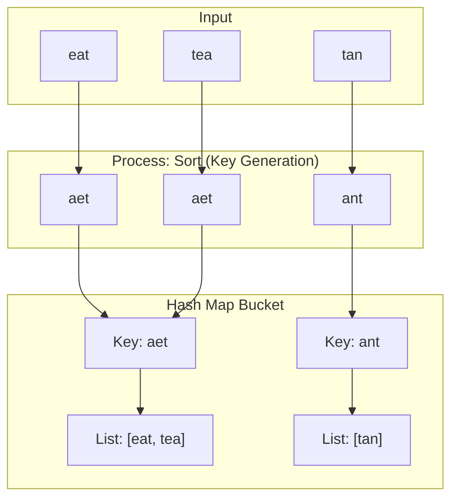

# 🎯 WEEK 5 DAY 1: HASH MAP & HASH SET PATTERNS — COMPLETE GUIDE

**Category:** Core Problem-Solving Patterns / Optimization  
**Difficulty:** 🟢 Easy to 🟡 Medium  
**Prerequisites:** Hashing & Sets (Week 3 Day 1), Arrays (Week 2 Day 1)  
**Interview Frequency:** 90% (Extremely High — the most common optimization tool)  
**Real-World Impact:** Database Indexing, Caching, Symbol Tables, Unique Constraints

---

## 🎓 LEARNING OBJECTIVES

By the end of this topic, you will be able to:

- ✅ **Identify** problems where Hash Maps reduce complexity from O(N²) to O(N).
- ✅ **Apply** the Two-Sum / K-Sum pattern to find pairs or complements in linear time.
- ✅ **Utilize** Frequency Counting to solve anagram, majority element, and permutation problems.
- ✅ **Implement** membership testing and duplicate detection using Hash Sets.
- ✅ **Differentiate** when to store indices vs. frequencies vs. boolean flags in the map.

| 🎯 Objective | 📍 Primary Section |
|:---|:---|
| Core Philosophy & Mental Model | Section 2: The What |
| Mechanical Implementation Steps | Section 3: The How |
| Worked Examples with Traces | Section 4: Visualization |
| Complexity & Performance Analysis | Section 5: Critical Analysis |
| Real-World Production Systems | Section 6: Real Systems |

---

## 🤔 SECTION 1: THE WHY — Engineering Motivation

### 🎯 Real-World Problems This Solves

#### Problem 1: Database Query Optimization (Join Operations)

**🌍 Where:** SQL Databases (PostgreSQL, MySQL), Distributed Data Engines (Spark)  
**💼 Concrete Challenge:**  
You have two massive tables: `Users` (1 million rows) and `Orders` (10 million rows). You need to find all orders belonging to a specific set of users.  

**Traditional Approach (Nested Loop Join):**  
For each user (1M), scan all orders (10M).  
Complexity: 1M × 10M = 10¹³ operations (Too slow).

**Hash Join Approach:**  
1. Build a Hash Map of the smaller table (`Users`) based on `UserID` → O(N).  
2. Scan the larger table (`Orders`) and check if `Order.UserID` exists in the map → O(M).  
Complexity: O(N + M) ≈ 11M operations.

**Impact:** Reduces query time from hours to seconds.

---

#### Problem 2: Caching & Deduplication (CDN/Browser)

**🌍 Where:** Cloudflare, Akamai, Chrome Browser Cache  
**💼 Concrete Challenge:**  
A CDN receives millions of requests per second for images. How do we ensure we only store/fetch each unique image once, even if requested by thousands of users?

**Pattern:**  
- Compute a unique **Hash** (SHA-256) of the file content.  
- Use a **Hash Set** to track "seen" hashes.  
- If `Hash` is in Set, serve from cache. If not, fetch origin and add to Set.

**Impact:**  
- Eliminates redundant network traffic.  
- Reduces storage costs by storing only unique content.

---

#### Problem 3: Spell Checking & Autocomplete

**🌍 Where:** Microsoft Word, Google Search, Grammarly  
**💼 Concrete Challenge:**  
As a user types, instantly verify if the word exists in the dictionary of 500,000 words.

**Approach:**  
- Store all valid words in a **Hash Set**.  
- Lookup is O(1) on average.  
- Linear search O(N) or Binary Search O(log N) would be slower for every keystroke.

**Impact:** Real-time feedback without UI lag.

---

### ⚖ Design Problem & Trade-offs

**Core Design Problem:**  
How do we find a specific element (or its complement) in a collection instantly, without scanning the entire collection?

#### Approach Comparison Table

| Approach | Strategy | Time Complexity | Space Complexity | Best For |
|----------|----------|-----------------|------------------|----------|
| **Brute Force** | Nested loops to find pairs/matches | O(N²) | O(1) | Small N (< 1000) |
| **Sorting** | Sort then Binary Search / Two Pointers | O(N log N) | O(1) or O(log N) | When space is tight |
| **Hash Map** | Store elements for O(1) lookup | **O(N)** | **O(N)** | **Speed is priority** |
| **Bit Manipulation** | Logic gates (XOR) | O(N) | O(1) | Specific cases (Single Number) |

**Trade-off:**  
The Hash Map pattern trades **Memory (Space)** for **Speed (Time)**. We use O(N) extra space to achieve O(1) lookup.

---

### 💼 Interview Relevance

**Common Interview Archetypes:**

| 🔴 Red Flag Keywords | Problem Type | Example |
|---------------------|--------------|---------|
| "Find pairs that sum to..." | Two Sum Pattern | Two Sum, 3Sum, 4Sum |
| "Find duplicate..." | Set Membership | Contains Duplicate |
| "Most frequent...", "Count of..." | Frequency Map | Top K Frequent, Anagrams |
| "First unique...", "First repeating..." | Order + Frequency | First Unique Character |
| "Intersection of...", "Union of..." | Set Operations | Intersection of Arrays |
| "Isomorphic", "Pattern matching" | Mapping | Isomorphic Strings |

**What Interviewers Test:**

```mermaid
graph TD
    A[Interviewer Goals] --> B[Recognition]
    A --> C[Efficiency]
    A --> D[Collision Handling]
    
    B --> B1["Do you jump to O(N) Map<br/>instead of O(N²) loops?"]
    C --> C1["Do you know Map vs Set?"]
    C --> C2["Do you handle key types correctly?"]
    D --> D1["Understanding worst-case O(N)<br/>if hash function is bad"]
    
    style A fill:#ff9999
    style B fill:#99ccff
    style C fill:#99ff99
    style D fill:#ffff99
```

---

## 📌 SECTION 2: THE WHAT — Mental Model & Core Concepts

### 🧠 Core Analogy: The Coat Check Room

Imagine a massive Coat Check at a concert with 10,000 guests.

**Scenario A (Linear Search):**  
You lost your ticket number. The attendant has to check every single coat on the rack, one by one, to see if it matches your description.  
- **Time:** Slow (O(N)).  
- **Data Structure:** List / Array.

**Scenario B (Hash Map):**  
You hand the attendant your ticket number **"543"**. The attendant goes directly to hook **#543** and grabs the coat.  
- **Time:** Instant (O(1)).  
- **Data Structure:** Hash Map.  
- **Key:** Ticket Number.  
- **Value:** The Coat.

**The Optimization:**  
In algorithmic problems, we often need to "find the coat" (find a complement, check existence). Instead of scanning the array (walking the rack), we put everything into a Hash Map first so we can "teleport" to the answer.

---

### 🔑 Core Invariants

**Invariant 1: The "Seen" History**  
A Hash Map allows you to query the **past**. As you iterate through an array, the map contains everything to the `left` of the current index.
- *Question:* "Have I seen a number `X` before?"
- *Answer:* `map.ContainsKey(X)`

**Invariant 2: The Complement Property**  
For equation `A + B = Target`, if you have `A`, you strictly need `B = Target - A`.
- You don't need to search for "any number". You look for **exactly one** specific value.
- This turns a search problem into a lookup problem.

**Invariant 3: Frequency State**  
A Frequency Map (`Map<Item, Count>`) represents the **exact composition** of a collection, ignoring order.
- Two strings are anagrams iff their frequency maps are identical.

---

### 📋 Core Concepts & Variations (List All)

#### 1. The Two-Sum Pattern (Complement Search)
- **Concept:** Iterate `curr`. Calculate `needed = Target - curr`. Check if `needed` is in Map.
- **Store:** `Map<Value, Index>` (to return indices) or `Set<Value>` (to return true/false).
- **Complexity:** O(N) Time, O(N) Space.

#### 2. Frequency Counting (Histogram)
- **Concept:** Count occurrences of each element.
- **Store:** `Map<Item, Count>`.
- **Usage:** Valid Anagram, Top K Frequent, Majority Element.
- **Complexity:** O(N) Time, O(U) Space (U = unique elements).

#### 3. First Unique / First Repeating
- **Concept:** Two passes. Pass 1: Build counts. Pass 2: Check counts.
- **Optimization:** For "First Unique", use `Map<Item, Count>`. For "First Repeating", simple `Set` works in one pass.

#### 4. Grouping / Bucketing
- **Concept:** Group items that share a property (key).
- **Store:** `Map<Key, List<Item>>`.
- **Usage:** Group Anagrams (`Key` = sorted string), Group by Length.

#### 5. Subarray Sum Equals K (Prefix Sum Map)
- **Concept:** Store cumulative sums (Prefix Sums) in a map.
- **Equation:** `Sum[i] - Sum[j] = K`  => `Sum[j] = Sum[i] - K`.
- **Store:** `Map<PrefixSum, Count>`.
- **Usage:** Count subarrays with sum K.

---

## ⚙ SECTION 3: THE HOW — Mechanical Walkthrough

### 🔧 Operation 1: Two Sum (Find Indices)

**Problem:** Given `nums = [2, 7, 11, 15]`, `target = 9`. Find indices of two numbers summing to 9.

**Mechanical Steps:**
1. Initialize empty Map `seen`: `{ Value : Index }`.
2. Iterate `i` from `0` to `Length-1`.
3. Identify `current = nums[i]`.
4. Calculate `complement = target - current`.
5. **Check:** Is `complement` in `seen`?
   - **Yes:** Return `[seen[complement], i]`.
   - **No:** Add `seen[current] = i`.

**Why this works:**  
When we are at `7` (index 1), `2` (index 0) is already in the map. The pair is found immediately.

---

### 🔧 Operation 2: Frequency Map (Anagram Check)

**Problem:** Are `s = "anagram"`, `t = "nagaram"` anagrams?

**Mechanical Steps:**
1. Check Lengths: If `s.Length != t.Length`, return False.
2. Initialize Map `counts`.
3. Iterate `s`: Increment count for each char.
4. Iterate `t`: Decrement count for each char.
   - If count goes negative, return False (too many of char).
   - If char not in map, return False.
5. (Optional) Check if all map values are 0.

**Optimization:** Use array `int[26]` instead of Hash Map for lowercase English letters (faster, constant space).

---

### 🔧 Operation 3: Subarray Sum Equals K (Prefix Sum Map)

**Problem:** `nums = [1, 1, 1]`, `k = 2`. Count subarrays summing to 2.

**Mechanical Steps:**
1. Initialize `map = {0: 1}` (Sum 0 seen once initially).
2. `currentSum = 0`, `count = 0`.
3. Iterate `x` in `nums`:
   - `currentSum += x`.
   - `needed = currentSum - k`.
   - If `needed` in map, `count += map[needed]`.
   - `map[currentSum]++`.

**Visual State:**
- Start: Map `{0:1}`, Sum 0.
- i=0 (1): Sum 1. Need -1 (No). Map `{0:1, 1:1}`.
- i=1 (1): Sum 2. Need 0 (Yes, count 1). Result += 1. Map `{0:1, 1:1, 2:1}`.
- i=2 (1): Sum 3. Need 1 (Yes, count 1). Result += 1. Map `{...}`.
- Total: 2.

---

## 🎨 SECTION 4: VISUALIZATION — Simulation & Examples

### 🧊 Trace: Two Sum

**Input:** `nums = [3, 2, 4]`, `target = 6`

| Step | Index `i` | Value | Complement (6-val) | Map State (Before) | Check Map | Action |
|:---:|:---:|:---:|:---:|:---|:---:|:---|
| 1 | 0 | 3 | 3 | `{}` | Contains 3? ❌ | Add `3:0` |
| 2 | 1 | 2 | 4 | `{3:0}` | Contains 4? ❌ | Add `2:1` |
| 3 | 2 | 4 | 2 | `{3:0, 2:1}` | Contains 2? ✅ | **FOUND!** Return `[1, 2]` |

---

### 🧊 Trace: Group Anagrams

**Input:** `["eat", "tea", "tan"]`

**Concept:** The **Key** must be canonical. Sorting the string makes "eat" -> "aet", "tea" -> "aet".

---

## 📊 SECTION 5: CRITICAL ANALYSIS — Performance & Robustness

### 📈 Complexity Table

| Pattern | Time Complexity | Space Complexity | Why? |
|-----------|-----------------|------------------|------|
| **Two Sum (Map)** | O(N) | O(N) | One pass, map stores up to N elements. |
| **Two Sum (Sort)**| O(N log N) | O(1) | Sorting dominates. Space optimized. |
| **Anagram (Map)** | O(N) | O(1) | Space is max O(26) or O(128) constant. |
| **Subarray Sum**  | O(N) | O(N) | Map stores prefix sums. |
| **Group Anagrams**| O(N * K log K) | O(N * K) | K = max str length (sorting key). |

### 🧠 Trade-offs
- **Hash Collisions:** In worst case (bad hash function), Map degenerates to Linked List (O(N) lookup). Most languages (C#, Java) use optimizations (Tree) or decent hash functions to keep avg O(1).
- **Memory Overhead:** A Hash Map entry has overhead (Key, Value, Node/Entry structure). An `int[26]` is much lighter than `Dictionary<char, int>`.
- **Order:** Hash Maps (typically) do not preserve insertion order. If order matters, use `LinkedHashMap` (Java) or maintain a separate list.

### ⚠ Edge Cases
1. **Collisions:** Multiple keys hashing to same bucket. Handled internally but good to know.
2. **Duplicate Keys:** `Two Sum` with `[3, 3]` target `6`. Map logic must handle or not overwrite if indices matter.
3. **Null Keys:** Some implementations allow null, others don't.
4. **Resizing:** When map fills up, it resizes (rehashes). This is O(N) amortized but expensive in that moment.

---

## 🏭 SECTION 6: REAL SYSTEMS — Integration in Production

### 🏭 System 1: Distributed Caches (Redis / Memcached)
**Use Case:** Storing session data or API responses.  
**Mechanism:** Distributed Hash Map.  
**Key:** `SessionID` or `RequestURL`.  
**Value:** JSON Blob / HTML.  
**Sharding:** Keys are hashed to determine which server node holds the data (`hash(key) % num_servers`).

### 🏭 System 2: Inverted Index (Elasticsearch / Google Search)
**Use Case:** Searching documents by keyword.  
**Mechanism:** `Map<Word, List<DocumentID>>`.  
**Example:**  
- Key: "apple"  
- Value: `[Doc1, Doc5, Doc99]`  
Instant lookup of which documents contain the query term.

### 🏭 System 3: Symbol Table (Compilers like Roslyn/GCC)
**Use Case:** Managing variable names and types during compilation.  
**Mechanism:** `Map<VariableName, TypeInfo>`.  
**Logic:** When parser sees `x = 5`, it looks up `x` in the Symbol Table to ensure it's declared and is a number.

### 🏭 System 4: Load Balancers (Consistent Hashing)
**Use Case:** Distributing traffic.  
**Mechanism:** Hash IP address to map to a backend server. Ensures same user always goes to same server (sticky sessions).

### 🏭 System 5: Blockchain (Merkle Trees)
**Use Case:** Verifying data integrity.  
**Mechanism:** Hash of data blocks. While not a "map" in the key-value sense, the **hashing property** (unique fingerprint) is central to identifying blocks.

---

## 🔗 SECTION 7: CONCEPT CROSSOVERS

### 📚 Builds On (Prerequisites)
- **Arrays:** The underlying storage for Hash Maps (buckets).
- **Linked Lists:** Used for collision resolution (chaining).
- **Modulo Operator:** Used to map HashCode to Index (`hash % capacity`).

### 🚀 Used By (Future Topics)
- **Graph Algorithms:** `Set<Node>` for `visited` array in BFS/DFS.
- **Dynamic Programming:** Memoization (`Map<Args, Result>`) is literally caching function results.
- **LRU Cache:** Combination of Hash Map + Doubly Linked List.
- **Sliding Window:** Variable window problems often use `Map` to track window state (e.g., "Longest substring with K distinct chars").

---

## 🧩 5 COGNITIVE LENSES

### 🧠 1. The "Locker" Lens (Metaphor)
View a Hash Map as a row of lockers. The Key is the student ID. The Hash Function tells you exactly which locker number belongs to that ID. You don't walk down the hallway checking names; you go straight to locker #42.

### 🕵️ 2. The "Detective" Lens (Pattern Recognition)
When you see "Find X", "Check if exists", "Count occurrences", or "Match pair", your detective instinct should scream **HASH MAP**. It's the ultimate tool for "What do I know?" questions.

### 📦 3. The "Space-Time" Lens (Trade-off)
Hash Maps are the purest example of "Buying Time with Space". You pay O(N) memory to buy O(1) speed. In modern computing, memory is cheap, time is expensive. This trade is almost always worth it.

### 📉 4. The "Entropy" Lens (Information Theory)
Hashing attempts to distribute data **uniformly** across buckets. High entropy (randomness) in the hash function is good; it prevents clustering (collisions) and ensures O(1) performance.

### 🛠️ 5. The "Toolbox" Lens (Implementation)
In C#, `Dictionary<K,V>` and `HashSet<T>` are your power tools. Know them.
- `ContainsKey`: O(1)
- `Add`: O(1)
- `TryGetValue`: Efficient lookup + retrieval.

---

## ⚔ SUPPLEMENTARY OUTCOMES

### ⚔ Practice Problems (10 Problems)

1.  **Two Sum** (Easy) - *The Classic.*
2.  **Contains Duplicate** (Easy) - *Set Intro.*
3.  **Valid Anagram** (Easy) - *Frequency Counting.*
4.  **Group Anagrams** (Medium) - *Map<Key, List>.*
5.  **Top K Frequent Elements** (Medium) - *Frequency Map + Heap/Bucket.*
6.  **Product of Array Except Self** (Medium) - *Prefix/Suffix (conceptual neighbor).*
7.  **Longest Consecutive Sequence** (Medium) - *Set utilization.*
8.  **Subarray Sum Equals K** (Medium) - *Prefix Sum Map.*
9.  **Isomorphic Strings** (Easy) - *Double Mapping.*
10. **Word Pattern** (Easy) - *String to String Mapping.*

### 🎙 Interview Questions (6 Questions)

1.  **Q:** How does a Hash Map handle collisions?
    -   **A:** Chaining (Linked Lists/Trees in buckets) or Open Addressing (Probing).
    -   *Follow-up:* What is the worst-case time complexity? (O(N)).

2.  **Q:** Can you use an object/class as a Key?
    -   **A:** Yes, but you MUST override `GetHashCode()` and `Equals()`.
    -   *Follow-up:* What happens if the object is mutable and you change a field after inserting it? (It gets lost).

3.  **Q:** Why is the time complexity O(1)?
    -   **A:** Because computing the hash and array indexing are constant time operations, independent of N (assuming good distribution).

4.  **Q:** What is the difference between `HashMap`, `TreeMap`, and `LinkedHashMap`?
    -   **A:** Hash (Unordered, O(1)), Tree (Sorted, O(log N)), Linked (Insertion Order, O(1)).

5.  **Q:** Implement a Hash Map from scratch.
    -   *Focus:* Array of Lists, Hash Function, Resize logic.

6.  **Q:** Find all pairs in array that sum to K. Unique pairs only.
    -   *Focus:* Handling duplicates using logic or Sets.

### ❌ Common Misconceptions

1.  **"Hash Maps are always O(1)"**
    -   *Correction:* They are O(1) **average**. Worst case O(N) if many collisions (though rare with good libraries).
2.  **"Keys are sorted"**
    -   *Correction:* Standard Hash Maps are unordered. Don't rely on iteration order.
3.  **"Any object works as a key"**
    -   *Correction:* Only immutable objects (or objects whose hash codes don't change) are safe. Using a list as a key is usually a bug.

### 🚀 Advanced Concepts
-   **Rolling Hash (Rabin-Karp):** Rolling update of hash value for string search (O(N)).
-   **Bloom Filters:** Probabilistic set (Space efficient, "Might be present" vs "Definitely not").
-   **Consistent Hashing:** For distributed systems (minimizing reshuffling when nodes change).

### 🔗 External Resources
1.  **VisualAlgo - Hash Table:** Interactive visualization of collisions and chaining.
2.  **LeetCode Tag - Hash Table:** Filter problems by tag.
3.  **C# Documentation:** `Dictionary<TKey, TValue>` internal mechanics (source code).

---

## 🎯 RETENTION HOOK

### 🪝 The "Key" Insight
> **"If you need to find something instantly, give it a Tag (Hash) and put it in a Bucket."**

### 🧠 Memory Aid: "M.A.P."
- **M** - **Match** (Pairs, Anagrams)
- **A** - **Access** (O(1) Lookup)
- **P** - **Previous** (Remembering what we saw)

**Final Thought:** The Hash Map is the single most useful data structure in your arsenal. If you are stuck on an O(N²) problem, ask yourself: *"Can I throw this data into a Map?"* 90% of the time, the answer is Yes.

---

**End of Instructional File**  
*Output generated strictly following Template v10 and System Config v10.*