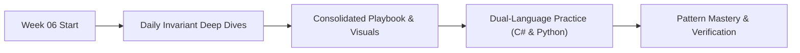

# 📘 String Manipulation Patterns

> 🧭 **Navigation:** [← Previous: Week 05](../week_05_tier_1_critical_patterns/README.md) • [🏠 Curriculum Overview](../README.md) • [📘 Complete Syllabus](../COMPLETE_SYLLABUS_v13.md) • [Next: Week 07 →](../week_07_trees_and_balanced_search_trees/README.md)

---

> 💡 **Instructor Guidance Note:**  
> *Not all sections or topics are mandatory. As a learner, you can adapt your pace freely. If you are preparing on an accelerated interview timeline or already feel confident with specific foundational concepts, feel free to skip or skim optional topics and prioritize high-yield patterns based on your personal interview goals.*

---

## 🎯 Weekly Mission & Conceptual Focus

Master palindrome expansions, substring sliding windows, balanced parenthesis parsing, StringBuilder zero-allocation design, and Rabin-Karp rolling hashes.

---

## 📅 Day-by-Day Learning Path

| Day | Instructional Module | Focus & Core Objective |
| :--- | :--- | :--- |
| **Day 01** | [Palindrome Patterns](Week_06_Day_01_Palindrome_Patterns_Instructional.md) | Core Daily Concept Deep Dive |
| **Day 02** | [Substring Sliding Window Patterns](Week_06_Day_02_Substring_Sliding_Window_Patterns_Instructional.md) | Core Daily Concept Deep Dive |
| **Day 03** | [Parentheses Bracket Matching](Week_06_Day_03_Parentheses_Bracket_Matching_Instructional.md) | Core Daily Concept Deep Dive |
| **Day 04** | [String Transformations Building](Week_06_Day_04_String_Transformations_Building_Instructional.md) | Core Daily Concept Deep Dive |
| **Day 05** | [Advanced String Matching Rabin Karp Rolling Hash](Week_06_Day_05_Advanced_String_Matching_Rabin_Karp_Rolling_Hash_Instructional.md) | Core Daily Concept Deep Dive |

---

## 📚 Consolidated Playbooks & Reference Guides

*   📖 **Comprehensive Week Playbook:** [WEEK_06_FULL_PLAYBOOK.md](WEEK_06_FULL_PLAYBOOK.md) — High-density synthesis of all invariants, theorems, and pattern triggers for this week.
*   📊 **Visual Concepts Playbook (Hybrid):** [Week_06_Visual_Concepts_Playbook_HYBRID.md](Week_06_Visual_Concepts_Playbook_HYBRID.md) — Compact Mermaid diagrams, state transitions, and complexity reference tables.
*   💻 **Production C# Reference (.NET 8/9):** [Week_06_Extended_CSharp_Complete_v13.md](Week_06_Extended_CSharp_Complete_v13.md) — Idiomatic, zero-allocation memory-aware implementations and problem ladders.
*   🐍 **Production Python Reference (Python 3.11+):** [Week_06_Extended_Python_Complete_v13.md](Week_06_Extended_Python_Complete_v13.md) — Clean, pythonic reference implementations for rapid whiteboard prototyping.

---

## 🛠️ The 5 Core Support Files (`support files/`)

Every week is accompanied by five dedicated support files located in the `support files/` subdirectory:

1.  📋 [Daily Progress Checklist](support%20files/Week_06_Daily_Progress_Checklist.md) — Step-by-step accountability tracker for theory, coding, and variants.
2.  🧭 [Weekly Guidelines & Mental Models](support%20files/Week_06_Guidelines.md) — Strategic roadmap, common pitfalls, and conceptual anchors.
3.  🎙️ [Interview Q&A Comprehensive Reference](support%20files/Week_06_Interview_QA_Reference.md) — High-frequency senior technical questions with verbal response frameworks.
4.  🗺️ [Problem-Solving Roadmap](support%20files/Week_06_Problem_Solving_Roadmap.md) — Tier-1 problem progression ladder from warm-up to advanced.
5.  📑 [Summary & Key Concepts Synthesis](support%20files/Week_06_Summary_Key_Concepts.md) — Fast-revision cheat sheet covering all governing invariants and system trade-offs.

---

> 🧭 **Navigation:** [← Previous: Week 05](../week_05_tier_1_critical_patterns/README.md) • [🏠 Curriculum Overview](../README.md) • [📘 Complete Syllabus](../COMPLETE_SYLLABUS_v13.md) • [Next: Week 07 →](../week_07_trees_and_balanced_search_trees/README.md)
