# 📚 WEEK 07 FULL PLAYBOOK
> 🧭 **Navigation:** [🏠 Week Overview](README.md) • [📘 Curriculum Syllabus](../COMPLETE_SYLLABUS.md)
> 
> 💡 **Instructor Note:** *This Comprehensive Playbook provides a high-density, integrated synthesis. Not all sections are mandatory; use it as a modular reference to solidify invariants and review pattern transitions.*

---

## Trees & Balanced Search Trees – Complete Curriculum Guide

**Curriculum Alignment:** COMPLETE_SYLLABUS.md  
**Phase:** C – Trees, Graphs, Dynamic Programming (Week 7)  

---

## 🎯 WEEK 07 OVERVIEW & LEARNING ROADMAP

### Primary Goal

**Understand tree structures, traversals, BST operations, and balanced BSTs conceptually and practically.** Master the mental models that power ordered data structures from simple binary trees to production-grade red-black trees. By week's end, you'll recognize tree patterns in new problems, trace operations from memory layout to algorithm outcome, and explain why systems like Java TreeMap chose specific balance strategies.

### Why This Week Comes Here

Trees generalize linear structures into hierarchies. BSTs and balanced BSTs are **central to ordered data**—they appear in databases, file systems, language libraries, and any system that needs fast lookups with maintained order. Without tree mastery, dynamic programming becomes disconnected from structure; graphs lose their root-level intuition.

### MIT 6.006 / 6.046 Alignment

- **6.006 Core:** Binary trees, traversals, BST operations, balance basics (AVL/Red-Black overview)  
- **6.046 Advanced:** Augmented trees, order-statistics, amortized analysis of rotations (optional Day 5)

### Learning Arc This Week

| Day | Topic | Focus | Output |
|-----|-------|-------|--------|
| **Day 1** | Binary Trees & Traversals | Foundation – structure, height, all 4 traversal orders | Hand traces, tree diagrams |
| **Day 2** | Binary Search Trees | Operations – search, insert, delete; BST invariant | Code-ready understanding |
| **Day 3** | Balanced BSTs | Balance strategy – AVL vs Red-Black; rotations | Rotation mechanics mastered |
| **Day 4** | Tree Patterns | Algorithms – diameter, LCA, path sum, serialization | Pattern recognition |
| **Day 5** | Augmented Trees (Optional) | Advanced – order-statistics, range queries | Production-level depth |

---

## 📖 CHAPTER 1: CONTEXT & MOTIVATION

### The Engineering Challenge

Imagine you're designing a **contact management system** for a smartphone with 10,000 entries. Users expect:
- **Instant search:** Type "J" → see all contacts starting with J in <100ms  
- **Sorted display:** All contacts always in alphabetical order  
- **Frequent updates:** Add/remove contacts during use, maintain order  
- **Memory efficiency:** No wasted space, fast even on older phones  

**Naive approach (sorted array):**
- Search: ✅ Binary search = O(log n) = 14 comparisons for 10,000  
- Insert/Delete: ❌ Shift elements = O(n) = 10,000 moves per operation  
- **Reality:** Typing 10 letters with 10 insert operations = 100,000 element shifts. Phone lags. Users angry.

**Naive approach (unsorted linked list):**
- Search: ❌ O(n) = 10,000 comparisons to find anything  
- Insert/Delete: ✅ O(1) if you have the position, but finding costs O(n)  
- **Reality:** Searching is glacially slow. Not viable.

**The Tree Solution:**
- Search: O(log n) = 14 comparisons  
- Insert/Delete: O(log n) = 14 repositioning operations  
- Maintain sorted order: By design through the BST invariant  
- **Reality:** Thousands of operations per second, always responsive.

### The Elegant Insight

🔑 **A tree is a sorted container that stays sorted as you modify it, with logarithmic guarantees on every operation.** It's the bridge between the speed of arrays and the flexibility of lists.

---

## 🧠 CHAPTER 2: BUILDING THE MENTAL MODEL

### 2.1 Tree Anatomy – The Foundation

#### What Is a Tree?

A **tree** is a connected, acyclic graph with a designated **root** node. Every other node has exactly one parent (except the root). The structure naturally forms a hierarchy: root at top, edges pointing downward to children, leaves at the bottom.

**Real-world analogy:**
Think of a **family genealogy tree**:
- Root = your earliest ancestor  
- Edges = parent-child relationships  
- Leaves = youngest generation  
- Height = generations from ancestor to furthest descendant  

In algorithms:

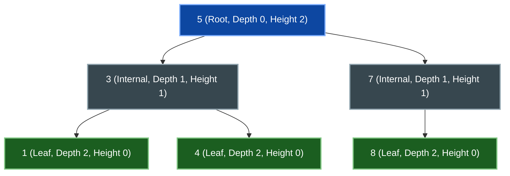

#### Key Terminology

**Height:** Longest path from node to any leaf (leaf = 0, not 1)  
- Height of node 5: 2 (path 5→3→1)  
- Height of node 3: 1 (path 3→1)  
- Height of node 1: 0 (it's a leaf)  
- **Formula:** `height(node) = 1 + max(height(left), height(right))`  

**Depth:** Distance from root to node  
- Depth of 5: 0 (it's the root)  
- Depth of 3: 1  
- Depth of 1: 2  

**Why This Matters:**
- Height determines **operation time** in tree operations: `O(height)`  
- In a balanced tree, `height ≈ log2(n)`, so operations are `O(log n)`  
- In a degenerate tree (like a linked list), `height = n`, degrading operations to `O(n)`

#### Tree Classifications

- **Full Tree:** Every node has 0 or 2 children (no single-child nodes).
- **Complete Tree:** All levels are completely filled except possibly the last, which fills strictly left-to-right.
- **Balanced Tree:** Heights of left and right subtrees differ by `<= 1` at every node (AVL definition).
- **Degenerate Tree:** Every parent has only one child, forming an effective linked list (`height = n`).

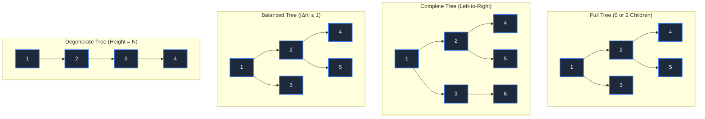

---

### 2.2 Traversals – Four Routes Through the Tree

A **traversal** visits every node in a tree exactly once, in a specific order. The order determines what data you extract.

#### Preorder (Parent → Left → Right)

Visit the parent **before** going to children. Used for **copying trees** and **serialization**.

**Mental model:** "Process parent first, then explore its left branch completely, then right branch."

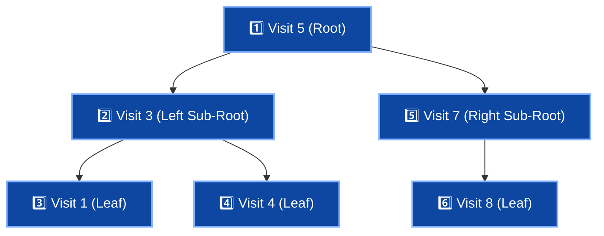

- **Output Order:** `[5, 3, 1, 4, 7, 8]`

**Pseudocode:**
```csharp
void PreOrder(Node node) {
    if (node == null) return;
    Print(node.value);        // Parent first
    PreOrder(node.left);      // Left subtree
    PreOrder(node.right);     // Right subtree
}
```

**Why it matters:** If you reconstruct a tree from preorder + structure info, you can rebuild it uniquely. Parent comes first, so you know the root immediately.

---

#### Inorder (Left → Parent → Right)

Visit children **around** the parent. For BSTs, produces **sorted order**. Used to **extract sorted data**.

**Mental model:** "Visit left family, then the parent, then right family."

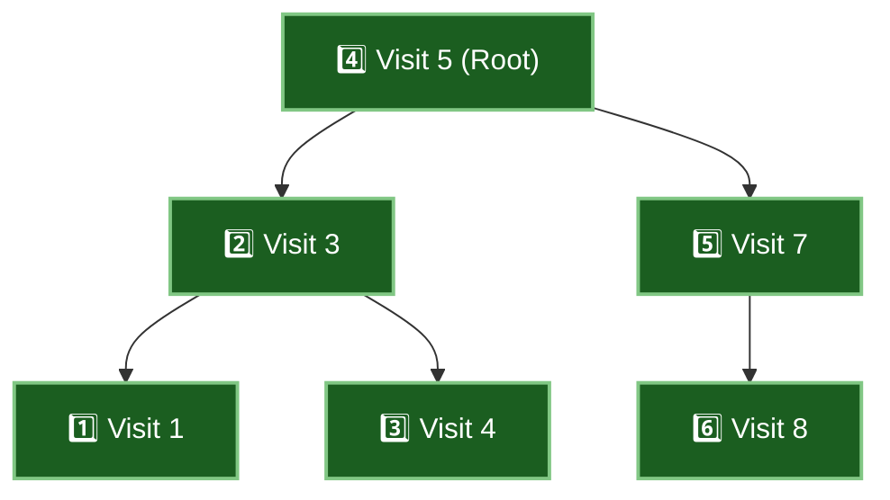

- **Output Order:** `[1, 3, 4, 5, 7, 8]` *(Monotonically ascending sorted order!)*

**Pseudocode:**
```csharp
void InOrder(Node node) {
    if (node == null) return;
    InOrder(node.left);       // Left subtree
    Print(node.value);        // Parent in middle
    InOrder(node.right);      // Right subtree
}
```

**Why BSTs produce sorted output:** For a valid BST, all left descendants `< parent <` all right descendants. Inorder respects this exact projection onto a 1D number line.

---

#### Postorder (Left → Right → Parent)

Visit children **before** the parent. Used for **deleting trees**, **computing subtree properties**, and **bottom-up dynamic programming**.

**Mental model:** "Resolve both children first, then synthesize result at parent."

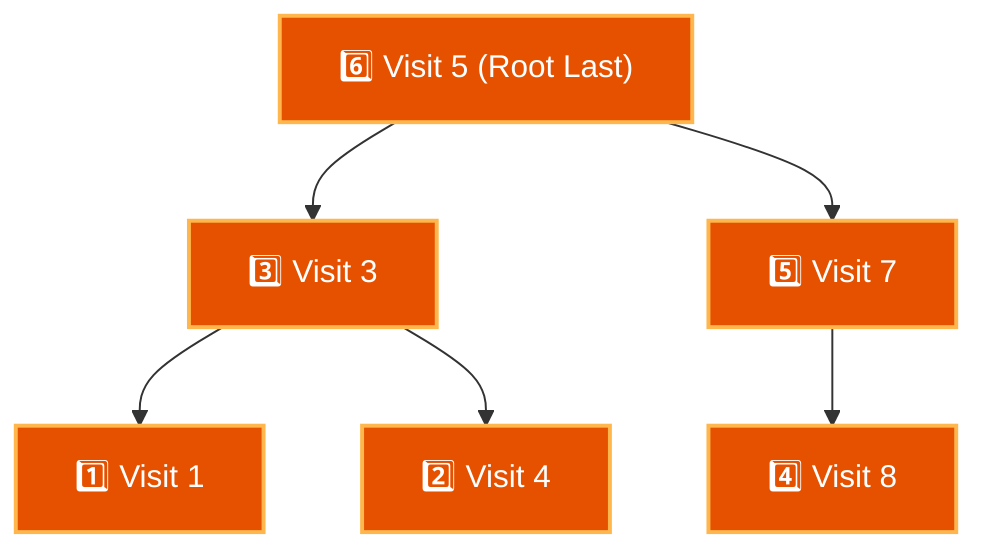

- **Output Order:** `[1, 4, 3, 8, 7, 5]`

**Pseudocode:**
```csharp
void PostOrder(Node node) {
    if (node == null) return;
    PostOrder(node.left);     // Left subtree
    PostOrder(node.right);    // Right subtree
    Print(node.value);        // Parent last
}
```

**Why it matters:** When deleting, you must delete children before parent (can't delete parent and still access children). In dynamic programming, you compute subtree properties from bottom-up.

---

#### Level-Order (BFS)

Visit nodes **layer-by-layer** left-to-right using a **FIFO Queue**. Used for **shortest path in unweighted trees** and **hierarchical serialization**.

**Mental model:** "Process everyone at depth 0, then depth 1, then depth 2."

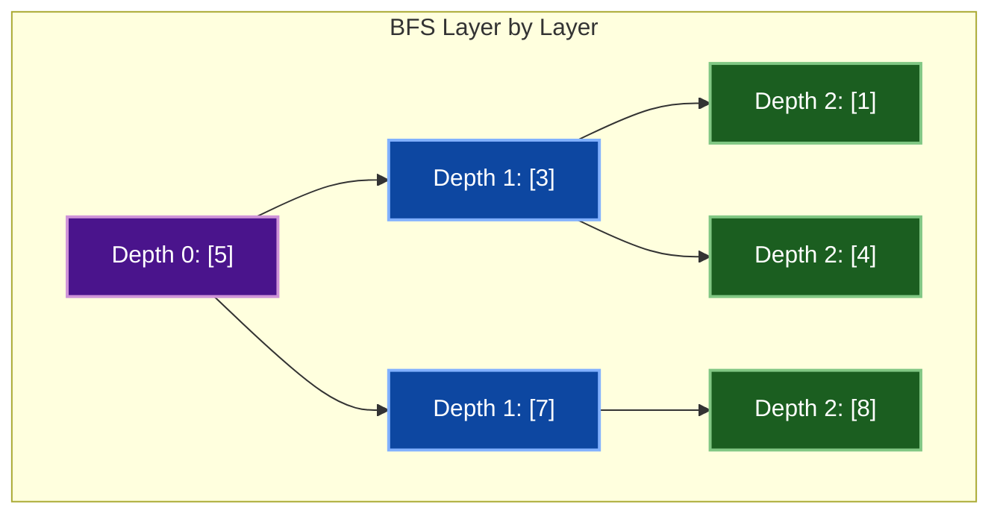

- **Output Order:** `[5, 3, 7, 1, 4, 8]`

**Pseudocode:**
```csharp
void LevelOrder(Node root) {
    var queue = new Queue<Node>();
    queue.Enqueue(root);
    
    while (queue.Count > 0) {
        Node node = queue.Dequeue();
        Print(node.value);
        if (node.left != null) queue.Enqueue(node.left);
        if (node.right != null) queue.Enqueue(node.right);
    }
}
```

---

#### Traversal Summary Table

| Order | Visit Pattern | Use Case | Result (example) |
|-------|---------------|----------|------------------|
| **Preorder** | Parent, Left, Right | Copy, serialize | 5,3,1,4,7,8 |
| **Inorder** | Left, Parent, Right | BST sorted output | 1,3,4,5,7,8 |
| **Postorder** | Left, Right, Parent | Delete, subtree calc | 1,4,3,8,7,5 |
| **Level-order** | Layer by layer | BFS, printing by level | 5,3,7,1,4,8 |

---

### 2.3 Iterative Traversals – Without Recursion

Recursive traversals are intuitive but use call stack. **Iterative traversals** use an explicit stack and mimic the recursion.

#### Inorder Iterative (Cleanest Pattern)

**Algorithm Idea:**
1. Go left as far as possible, pushing each node  
2. When you hit null, pop and process  
3. Go right from the popped node  
4. Repeat  

**Mental model:** "Keep burrowing left; when you hit a dead end, back up, process the node, then go right."

```csharp
void InOrderIterative(Node root) {
    var stack = new Stack<Node>();
    Node current = root;
    
    while (current != null || stack.Count > 0) {
        // Go left as far as possible
        while (current != null) {
            stack.Push(current);
            current = current.left;
        }
        
        // current is null, so pop
        current = stack.Pop();
        Print(current.value);  // Process
        
        // Go right
        current = current.right;
    }
}
```

**Trace (tree with root 2, left 1, right 3):**

```
Step 0: current = 2, stack = []
Step 1: push 2, current = 1
Step 2: push 1, current = null (left of 1 is null)
Step 3: pop 1, print 1, current = 1.right = null
Step 4: pop 2, print 2, current = 2.right = 3
Step 5: push 3, current = null (left of 3 is null)
Step 6: pop 3, print 3, current = 3.right = null
Result: 1, 2, 3  ✓ Correct inorder for BST!
```

---

#### Postorder Iterative (Trickier – Need Previous Pointer)

**Challenge:** Can't process a node until both children are done. Need to distinguish:
- Visiting a node for the first time (push it)  
- Returning from left child (now process right)  
- Returning from right child (now process node)  

**Solution:** Track the **previous (last processed) node**. If previous is my child, I'm returning from that child. If previous is my parent, I'm visiting for the first time.

```csharp
void PostOrderIterative(Node root) {
    var stack = new Stack<Node>();
    Node current = root;
    Node previous = null;
    
    while (stack.Count > 0 || current != null) {
        if (current != null) {
            stack.Push(current);
            current = current.left;
        } else {
            Node peek = stack.Peek();
            
            // If right child exists and hasn't been processed yet
            if (peek.right != null && peek.right != previous) {
                current = peek.right;  // Go right
            } else {
                Print(peek.value);     // Process (both children done)
                previous = stack.Pop();
            }
        }
    }
}
```

---

### 2.4 Recursive vs Iterative: When to Use Each

**Recursive Traversals:**
- ✅ Intuitive, matches algorithm description  
- ✅ Shorter code, less to manage  
- ❌ Uses call stack (max depth ≈ O(height) space)  
- ❌ Can overflow on very deep trees  

**Iterative Traversals:**
- ✅ Explicit stack control  
- ✅ Can process extremely deep trees  
- ❌ Postorder is complex (need previous pointer)  
- ❌ More code to manage  

**Rule:** Use recursive for clarity and normal trees. Use iterative if depth is extreme or you're in an embedded system.

---

## 🔧 CHAPTER 3: MECHANICS & IMPLEMENTATION

### 3.1 Binary Search Trees (BSTs) – The Ordered Container

#### The BST Invariant

🔑 **For every node:** All left descendants < node value < all right descendants

This **global constraint** (not just checking immediate children) is what enables efficient search.

**Visualize:**

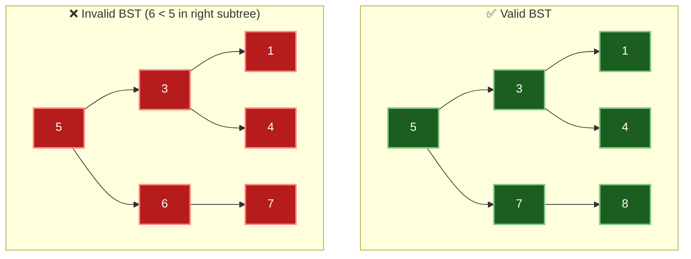

---

#### Search: Navigate the Tree

**Idea:** Compare target with current node. If smaller, go left. If larger, go right. Stop when found or reached null.

**Pseudocode:**

```csharp
Node Search(Node root, int target) {
    if (root == null) return null;      // Not found
    
    if (root.value == target) {
        return root;                     // Found!
    } else if (target < root.value) {
        return Search(root.left, target);  // Go left
    } else {
        return Search(root.right, target); // Go right
    }
}
```

**Trace (search for 4 in example tree):**

```
Call Search(5, 4)
  4 < 5, go left
  Call Search(3, 4)
    4 > 3, go right
    Call Search(4, 4)
      4 == 4, found! Return node 4
```

**Complexity:**
- **Best/Average:** `O(log N)` for balanced tree (`height ≈ log N`)  
- **Worst:** `O(N)` for degenerate tree (`height = N`)

---

#### Insert: Maintain the Invariant

**Idea:** Search for the correct position (where it should be if it existed), then create a new node there.

**Pseudocode:**

```csharp
Node Insert(Node root, int value) {
    if (root == null) {
        return new Node(value);           // Found position, create node
    }
    
    if (value < root.value) {
        root.left = Insert(root.left, value);   // Recurse left
    } else if (value > root.value) {
        root.right = Insert(root.right, value); // Recurse right
    }
    // If value == root.value, skip (handle duplicates as needed)
    
    return root;
}
```

**Trace (insert 2 into example tree):**

```
Call Insert(5, 2)
  2 < 5, recurse left
  Call Insert(3, 2)
    2 < 3, recurse left
    Call Insert(1, 2)
      2 > 1, recurse right
      Call Insert(null, 2) -> returns new Node(2)
      Set node1.right = Node(2)
```

**Resulting Structure:**

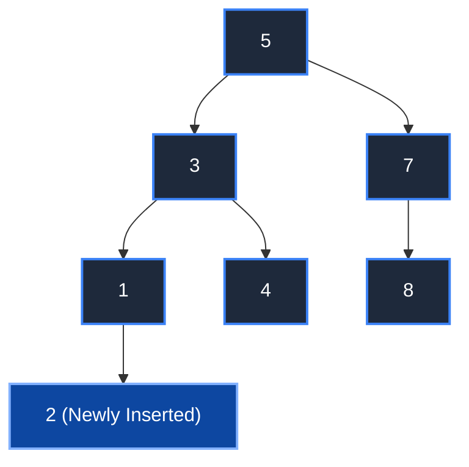

---

#### Delete: Three Cases

Deleting is trickier because you must maintain the tree structure and invariant.

**Case 1: Node is a leaf**  
Simply remove it. No restructuring needed.

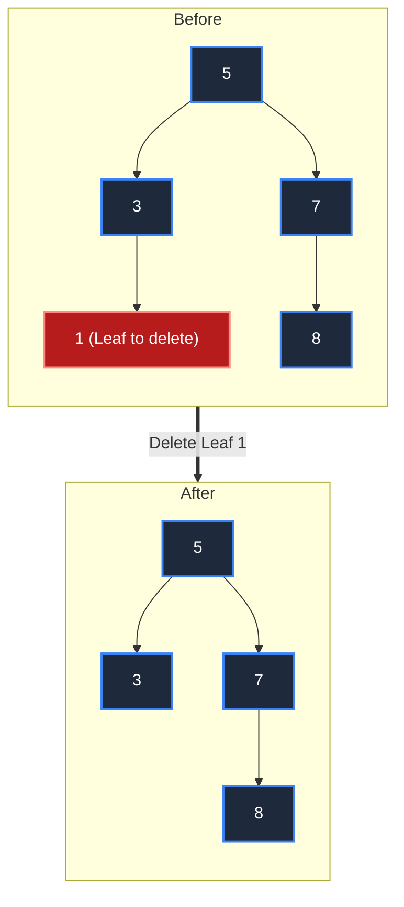

**Case 2: Node has one child**  
Bypass the node (child directly replaces parent).

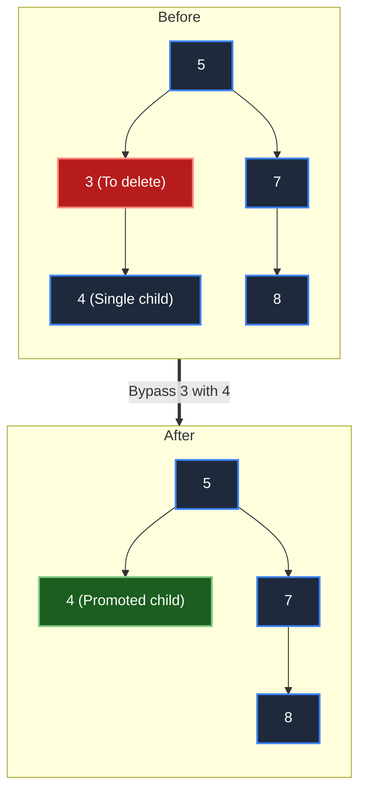

**Case 3: Node has two children**  
- **Problem:** Cannot simply sever the node; both left and right branches need a valid parent.
- **Solution:** Find the **inorder successor** (smallest value in right subtree, which is the leftmost node in that right subtree), copy its value to the target node, and recursively delete the successor from the right subtree.
- **Why successor works:** It is strictly greater than all nodes in the left subtree, and strictly less than all other nodes in the right subtree. Furthermore, the successor has at most one child (a right child), reducing its removal to Case 1 or 2!

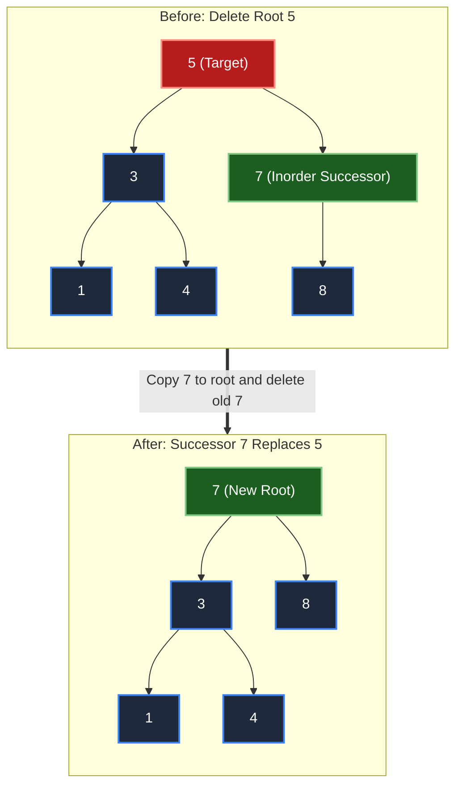

**Pseudocode (Case 3):**

```csharp
Node Delete(Node root, int value) {
    if (root == null) return null;
    
    if (value < root.value) {
        root.left = Delete(root.left, value);
    } else if (value > root.value) {
        root.right = Delete(root.right, value);
    } else {
        // Found node to delete
        if (root.left == null) {
            return root.right;  // Case 1 or 2 (no left child)
        } else if (root.right == null) {
            return root.left;   // Case 2 (no right child)
        } else {
            // Case 3: Two children
            // Find inorder successor (left-most in right subtree)
            Node successor = FindMin(root.right);
            root.value = successor.value;
            root.right = Delete(root.right, successor.value);
        }
    }
    return root;
}

Node FindMin(Node node) {
    while (node.left != null) {
        node = node.left;
    }
    return node;
}
```

---

#### Inorder Traversal Produces Sorted Output

For a valid BST, **inorder traversal gives you sorted values**. This is because:
- You visit left subtree first (all smaller)  
- Then the node itself  
- Then right subtree (all larger)  

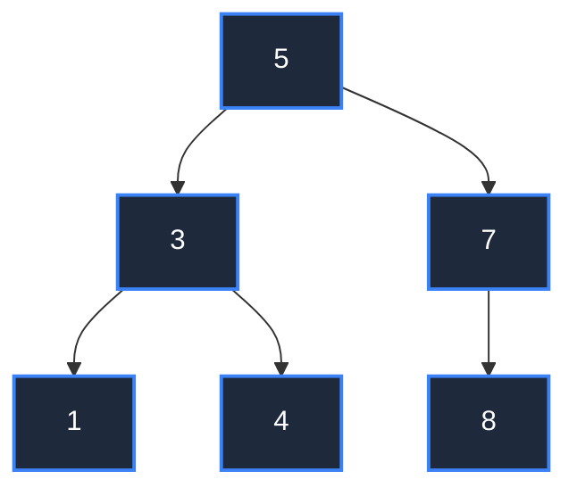

- **Inorder Sequence:** `[1, 3, 4, 5, 7, 8]` *(Monotonically sorted!)*

---

#### Degenerate BSTs – The Problem

Insert sorted input `[1, 2, 3, 4, 5]` into an unbalanced BST:

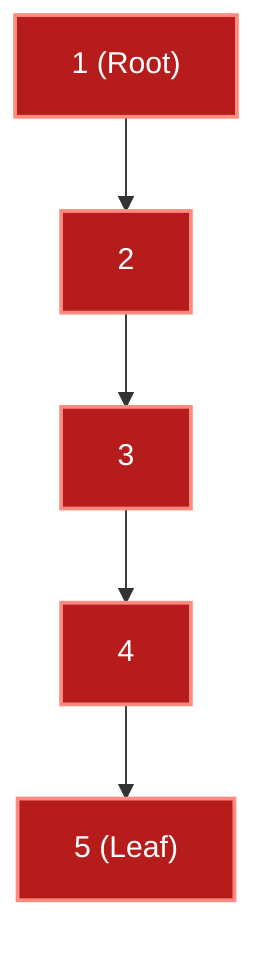

- **Height:** `5` (equal to `N`).
- **Operation Time:** Degrades from `O(log N)` to `O(N)`, behaving identically to a singly linked list.
- **Problem:** Without automated self-balancing, adversarial sorted or reverse-sorted input destroys logarithmic performance.

---

### 3.2 Balanced BSTs – The Fix

#### Why Balance?

A **balanced BST** maintains `height ≈ O(log N)` by self-rebalancing during insertion and deletion.

**Impact:**
- **Search:** `O(log N)` guaranteed  
- **Insert/Delete:** `O(log N)` guaranteed  
- **Sorted iteration:** `O(N)` (unaffected)  

Two primary self-balancing strategies:

- **AVL Trees (Strict Balance):**
  - Every node maintains `|height(left) - height(right)| <= 1`.
  - Tighter search paths (`~1.0 * log2(N)`), ideal for read-heavy workloads.
- **Red-Black Trees (Relaxed Balance):**
  - Colors nodes red or black and enforces 5 balance invariants.
  - Fewer rotations during updates, making it the de facto production standard (Java `TreeMap`, C++ `std::map`, Linux kernel CFS scheduler).

---

#### Rotations – The Rebalancing Tool

A **rotation** is a local tree restructuring that preserves the global BST invariant while adjusting subtree heights in `O(1)` time.

##### Right Rotation (Fixes Left-Heavy Trees)

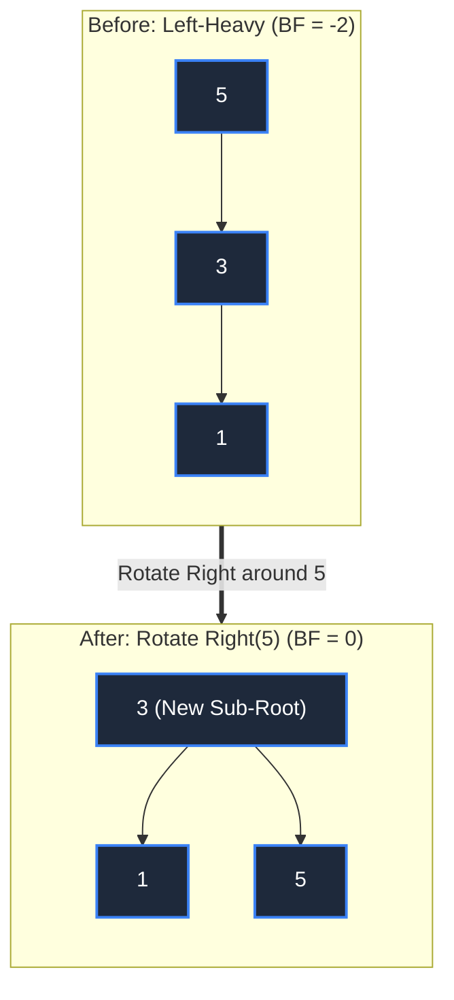

**BST Invariant Verification:**
- Before: `1 < 3 < 5`
- After: `1 < 3 < 5` (strictly preserved)
- Height: Reduced from 2 to 1!

**Implementation:** Pure pointer reassignments:
```csharp
Node RotateRight(Node root) {
    Node newRoot = root.left;
    root.left = newRoot.right;
    newRoot.right = root;
    // Update heights...
    return newRoot;
}
```

##### Left Rotation (Fixes Right-Heavy Trees)

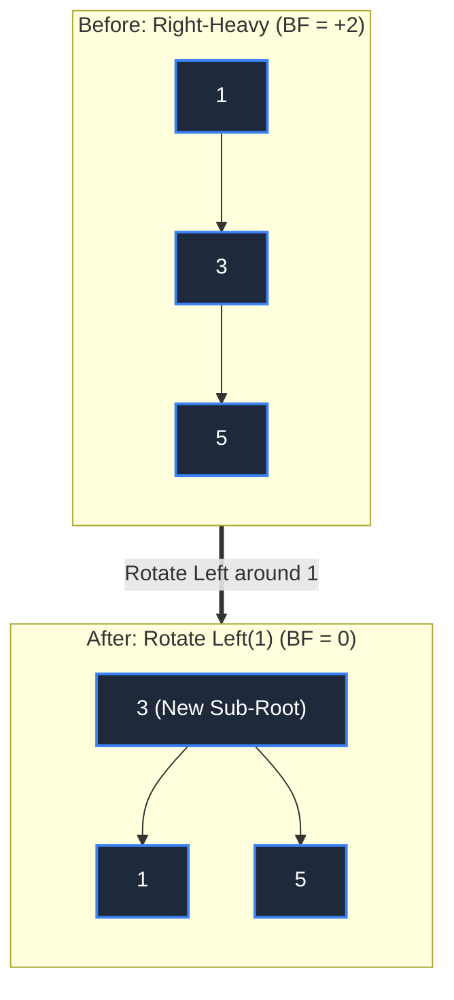

---

#### AVL Trees – Balance Factor Approach

**Balance factor:** `BF(node) = height(right) - height(left)` (or `left - right`).

For AVL, `|BF| <= 1` at every node.

**Four imbalance cases:**
1. **LL (Left-Left):** Left child is left-heavy -> Single Right rotation.
2. **RR (Right-Right):** Right child is right-heavy -> Single Left rotation.
3. **LR (Left-Right):** Left child is right-heavy (zig-zag knee) -> Left rotate on child, then Right rotate on parent.
4. **RL (Right-Left):** Right child is left-heavy (zig-zag knee) -> Right rotate on child, then Left rotate on parent.

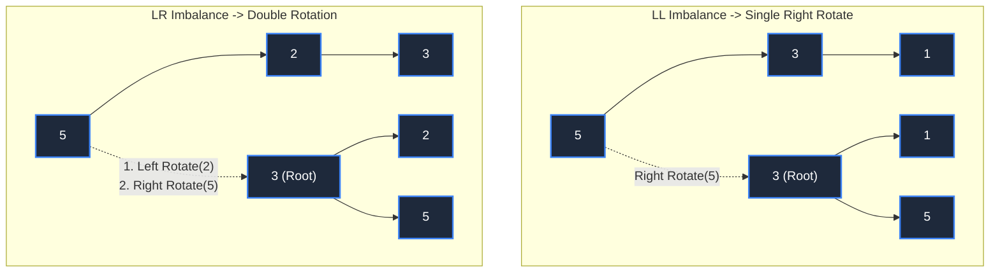

---

#### Red-Black Trees – Production Standard

Instead of strict balance, use **colors** and **5 rules**:

1. Every node is red or black  
2. Root is black  
3. Leaves (null) are black  
4. No red-red adjacent (red node's children are black)  
5. Every path from node to leaves has same number of black nodes  

**Advantage:** Fewer rebalancing operations (relaxed balance).  
**Trade-off:** Slightly deeper worst-case (but still O(log n)).

```
Production systems use red-black because:
- Fewer rotations = better performance for frequent updates
- Still O(log n) guaranteed
- Java TreeMap, C++ std::map, Linux kernel scheduler all use it
```

---

### 3.3 Traversals: Recursive Implementation

#### Preorder

```csharp
void PreOrder(Node node) {
    if (node == null) return;
    Console.WriteLine(node.value);
    PreOrder(node.left);
    PreOrder(node.right);
}
```

#### Inorder

```csharp
void InOrder(Node node) {
    if (node == null) return;
    InOrder(node.left);
    Console.WriteLine(node.value);
    InOrder(node.right);
}
```

#### Postorder

```csharp
void PostOrder(Node node) {
    if (node == null) return;
    PostOrder(node.left);
    PostOrder(node.right);
    Console.WriteLine(node.value);
}
```

---

## 📊 CHAPTER 4: TREE PATTERNS – CORE ALGORITHMS

### 4.1 Path Sum – Root-to-Leaf Paths

**Problem:** Given a tree and target sum, find all root-to-leaf paths that sum to target.

**Mental Model:** DFS with **backtracking**. Maintain current path, check at leaves, undo choice to explore other paths.

```csharp
void PathSum(Node root, int targetSum, List<int> path, 
             List<List<int>> allPaths) {
    if (root == null) return;
    
    // Add current node to path
    path.Add(root.value);
    
    // Check if it's a leaf and sum matches
    if (root.left == null && root.right == null) {
        if (path.Sum() == targetSum) {
            allPaths.Add(new List<int>(path));
        }
    } else {
        // Recurse
        PathSum(root.left, targetSum, path, allPaths);
        PathSum(root.right, targetSum, path, allPaths);
    }
    
    // Backtrack: remove current node
    path.RemoveAt(path.Count - 1);
}
```

**Why backtrack?** After exploring the left subtree, the `path` list still has nodes from that branch. Remove them to explore right subtree with clean state.

**Example:**

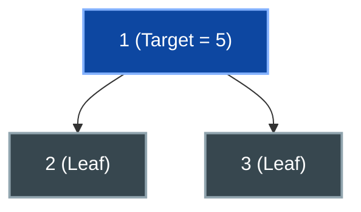

**Backtracking Trace:**
1. Call `PathSum(node=1, remaining=5, path=[])` -> Appends `1`, remaining sum = `4`.
2. Recurse left: `PathSum(node=2, remaining=4, path=[1])` -> Appends `2`, remaining sum = `2`.
   - Node `2` is a leaf, but remaining sum `2 != 0`. Path invalid.
   - **Backtrack:** Pop `2` from `path` (restores `path` to `[1]`).
3. Recurse right: `PathSum(node=3, remaining=4, path=[1])` -> Appends `3`, remaining sum = `1`.
   - Node `3` is a leaf, but remaining sum `1 != 0`. Path invalid.
   - **Backtrack:** Pop `3` from `path` (restores `path` to `[1]`).
4. Backtrack from root: Pop `1`. Returns empty result list.

---

### 4.2 Tree Diameter – Longest Path

**Problem:** Find the longest path between ANY two nodes (not necessarily passing through the root).

**Mental Model:** At each node, the diameter is determined by:
- Longest path contained entirely in left subtree
- Longest path contained entirely in right subtree
- Longest path passing through current node (`height(left) + height(right)`)

**Key insight:** Return both `(height, maxDiameter)` from DFS so the parent can compute both values in a single bottom-up pass.

```csharp
(int height, int maxDiameter) DFS(Node node) {
    if (node == null) return (0, 0);
    
    var (leftH, leftD) = DFS(node.left);
    var (rightH, rightD) = DFS(node.right);
    
    int height = 1 + Math.Max(leftH, rightH);
    int diameterThroughNode = leftH + rightH;  // Path through this node
    int maxDiameter = Math.Max(diameterThroughNode, 
                               Math.Max(leftD, rightD));
    
    return (height, maxDiameter);
}
```

**Example:**

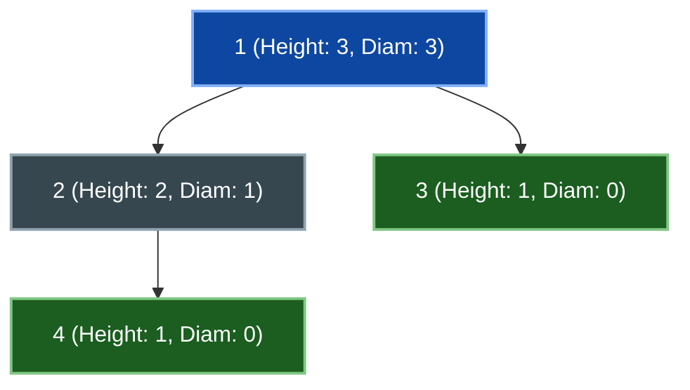

- At node `4`: `(height=1, diameter=0)`
- At node `2`: `(height=2, diameter=1)` (path through node: `1 + 0 = 1`)
- At node `3`: `(height=1, diameter=0)`
- At node `1`: `(height=3, diameter=3)` (path through node: `2 + 1 = 3`, longest path is `4 -> 2 -> 1 -> 3`)

---

### 4.3 Lowest Common Ancestor (LCA) – Binary Lifting

**Problem:** Find the deepest node that is an ancestor of both `p` and `q`.

**Approach (For BST):** If you know tree is a BST, LCA is the first node where `value` is between `p` and `q`.

**Approach (General Tree):** Use **3-case DFS:**
- Both `p` and `q` in left subtree → LCA is in left  
- Both in right subtree → LCA is in right  
- One in left, one in right → LCA is current node  

```csharp
Node LCA(Node root, Node p, Node q) {
    if (root == null) return null;
    if (root == p || root == q) return root;  // One of them is the LCA
    
    Node leftLCA = LCA(root.left, p, q);
    Node rightLCA = LCA(root.right, p, q);
    
    if (leftLCA != null && rightLCA != null) {
        // Both in different subtrees
        return root;
    }
    
    return leftLCA != null ? leftLCA : rightLCA;
}
```

---

### 4.4 Serialization & Deserialization

**Problem:** Convert tree to a string (serialization), then rebuild from string (deserialization).

**Idea:** Use **preorder + null markers**.

```csharp
// Serialization
string Serialize(Node root) {
    var result = new StringBuilder();
    SerializeDFS(root, result);
    return result.ToString();
}

void SerializeDFS(Node node, StringBuilder sb) {
    if (node == null) {
        sb.Append("null,");
        return;
    }
    
    sb.Append(node.value).Append(",");
    SerializeDFS(node.left, sb);
    SerializeDFS(node.right, sb);
}

// Deserialization
Node Deserialize(string data) {
    var values = data.Split(',').ToList();
    var queue = new Queue<string>(values);
    return DeserializeDFS(queue);
}

Node DeserializeDFS(Queue<string> queue) {
    string val = queue.Dequeue();
    if (val == "null") return null;
    
    Node node = new Node(int.Parse(val));
    node.left = DeserializeDFS(queue);
    node.right = DeserializeDFS(queue);
    return node;
}
```

**Example:**

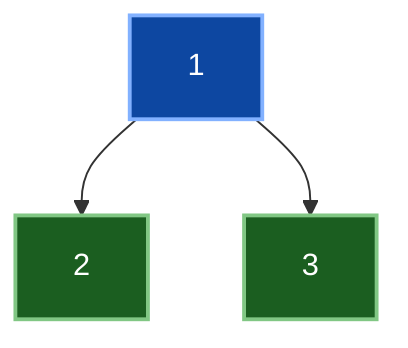

- **Serialize:** `"1,2,null,null,3,null,null,"`
  - Preorder order: `1`, then left subtree `2` (leaves `null`, `null`), then right subtree `3` (leaves `null`, `null`).
- **Deserialize:** Queue `[1, 2, null, null, 3, null, null]`
  - Dequeue `1` -> Instantiate `Node(1)`
  - Dequeue `2` -> Attach as `Node(1).left`
  - Dequeue `null`, `null` -> Children of `2` are null
  - Dequeue `3` -> Attach as `Node(1).right`
  - Dequeue `null`, `null` -> Children of `3` are null
- **Result:** Exact identical binary tree reconstructed in `O(N)` time.

---

## 🎯 CHAPTER 5: PERFORMANCE, TRADE-OFFS & REAL SYSTEMS

### 5.1 Complexity Analysis

| Operation | Best/Avg | Worst | Space |
|-----------|----------|-------|-------|
| Search | O(log n) | O(n)* | O(log n) recursion |
| Insert | O(log n) | O(n)* | O(log n) recursion |
| Delete | O(log n) | O(n)* | O(log n) recursion |
| Traversal | O(n) | O(n) | O(log n) to O(n)** |

*Worst case in degenerate (unbalanced) tree  
**Recursive uses O(height) stack; iterative uses O(height) extra space

### 5.2 Real-World Systems Using Trees

#### Java TreeMap & TreeSet

```java
TreeMap<String, Integer> map = new TreeMap<>();
// Internally: Red-Black tree
// Guarantees: O(log n) get, put, remove
map.put("Alice", 100);   // O(log n)
map.get("Alice");        // O(log n)
```

**Why Red-Black?** More balanced insertions/deletions in typical workloads. Java prioritizes update efficiency.

#### C++ std::map and std::set

```cpp
std::map<string, int> map;  // Red-Black tree under the hood
map["Alice"] = 100;         // O(log n)
auto it = map.find("Bob");  // O(log n)
```

Same reasoning as Java – production systems need reliable performance for frequent updates.

#### Linux Kernel – CFS Scheduler

The CPU scheduler maintains a **Red-Black tree of runnable processes**, keyed by virtual runtime. This allows:
- O(log n) to find next process to run  
- O(log n) to add/remove processes  
- Handles thousands of processes efficiently  

#### PostgreSQL & Databases

B-Trees (generalization of BSTs) are used for:
- Indexes on columns  
- Fast lookups by value  
- Range queries (find all rows where age between 20 and 30)  

Chosen over balanced BSTs because B-Trees minimize disk I/O (multiple keys per node).

---

### 5.3 AVL vs Red-Black: Which One?

| Aspect | AVL | Red-Black |
|--------|-----|-----------|
| Balance | Strict (|height diff| ≤ 1) | Relaxed (color rules) |
| Rotations per insert | 1 on avg | ~1 on avg |
| Rotations per delete | Up to O(log n) | ~2 on avg |
| Search time | Tighter O(log n) | Slightly looser O(log n) |
| **Production use** | Less common | Java, C++, Linux ✓ |

**Rule:** AVL is theoretically tighter; Red-Black is practically simpler. Use Red-Black unless you have mostly searches (then AVL might be better).

---

## 📚 CHAPTER 6: OPTIONAL ADVANCED (Day 5) – AUGMENTED TREES & ORDER-STATISTICS

### 6.1 Why Augment?

**Idea:** Store extra info at each node (beyond just value) to answer queries faster.

**Example: Subtree Size**

Store `subtree_size` = number of nodes in subtree rooted here.

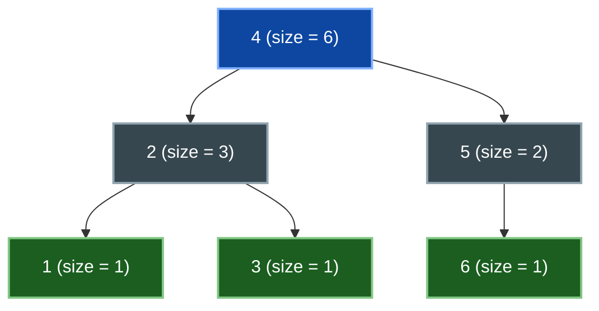

**Size Recurrence:**
- `size[node] = 1 + size[node.left] + size[node.right]`
- `size[1] = 1`, `size[3] = 1`, `size[6] = 1`
- `size[2] = 1 + 1 + 1 = 3`
- `size[5] = 1 + 0 + 1 = 2`
- `size[4] = 1 + 3 + 2 = 6`

**Benefits:**
- Find `k`-th smallest in `O(log N)`
- Count elements in range in `O(log N)`
- Rank queries (count elements `<= x`) in `O(log N)`

### 6.2 Order-Statistics: Find Kth Smallest

**Without augmentation:** Full in-order traversal takes `O(N)` time.  
**With size augmentation:** Binary search down the tree in `O(height) = O(log N)` time.

```csharp
Node KthSmallest(Node root, int k) {
    if (root == null) return null;
    int leftSize = (root.left != null) ? root.left.size : 0;
    
    if (leftSize >= k) {
        // k-th smallest lies entirely in left subtree
        return KthSmallest(root.left, k);
    } else if (leftSize + 1 == k) {
        // Current node is the exact k-th smallest element
        return root;
    } else {
        // k-th smallest lies in right subtree (subtract leftSize + 1)
        return KthSmallest(root.right, k - leftSize - 1);
    }
}
```

**Step-by-Step Search Traces on Inorder Sequence `[1, 2, 3, 4, 5, 6]`:**

1. **Find 4th Smallest (`k = 4`):**
   - At root `4`: `leftSize = 3`.
   - `leftSize + 1 = 3 + 1 = 4 == k`.
   - **Found:** Returns node `4`!

2. **Find 5th Smallest (`k = 5`):**
   - At root `4`: `leftSize = 3`, `k = 5 > 4`.
   - Recurse right with adjusted `k' = 5 - 3 - 1 = 1`.
   - At node `5`: `leftSize = 0`.
   - `leftSize + 1 = 0 + 1 = 1 == k'`.
   - **Found:** Returns node `5`!

3. **Find 2nd Smallest (`k = 2`):**
   - At root `4`: `leftSize = 3`, `k = 2 <= 3`.
   - Recurse left with `k = 2`.
   - At node `2`: `leftSize = 1`.
   - `leftSize + 1 = 1 + 1 = 2 == k`.
   - **Found:** Returns node `2`!

---

### 6.3 Maintaining Augmentation During Updates

When you insert or delete, you must update `size` values bottom-up.

```csharp
Node Insert(Node root, int value) {
    if (root == null) {
        return new Node(value, size: 1);
    }
    
    if (value < root.value) {
        root.left = Insert(root.left, value);
    } else {
        root.right = Insert(root.right, value);
    }
    
    // Update size
    root.size = 1 + (root.left?.size ?? 0) + (root.right?.size ?? 0);
    return root;
}
```

**Cost:** O(log n) per insertion (update all ancestors on path).

---

## ✅ WEEK 07 COMPREHENSIVE CHECKLIST

### Conceptual Mastery

By end of Week 7, verify:

- [ ] **Tree Anatomy:** Explain height, depth, full/complete/balanced/degenerate with examples  
- [ ] **All Traversals:** Hand-trace preorder, inorder, postorder, level-order on 5-node tree  
- [ ] **BST Invariant:** Explain global constraint and why it enables search  
- [ ] **BST Operations:** Code search, insert, delete (all 3 cases) from memory  
- [ ] **Deletion Mastery:** Explain successor finding and why it works  
- [ ] **Balance Concepts:** Explain why height matters, what balance guarantees  
- [ ] **AVL vs RB:** Compare rotations, trade-offs, production systems  
- [ ] **Tree Patterns:** Recognize and code diameter, LCA, path sum, serialization  
- [ ] **Iterative Traversals:** Code inorder iterative, understand postorder with previous pointer  

### Implementation Fluency

- [ ] **Recursive Traversals:** Preorder, inorder, postorder – clean, no bugs  
- [ ] **Iterative Inorder:** With explicit stack, < 10 minutes  
- [ ] **BST Search:** Navigate and return correct node  
- [ ] **BST Insert:** Maintain invariant, handle duplicates  
- [ ] **BST Delete:** All 3 cases, successor logic  
- [ ] **Diameter:** Return (height, max_diameter), trace on 3 trees  
- [ ] **LCA:** 3-case logic, trace through examples  
- [ ] **Path Sum:** DFS + backtracking, clean implementation  
- [ ] **Serialization:** Preorder + null, deserialize with queue  

### Problem-Solving

- [ ] **Pattern Recognition:** Given new problem, identify if it's diameter/LCA/path-sum-like  
- [ ] **Trade-off Analysis:** Explain why Red-Black used in Java, why B-Trees in databases  
- [ ] **Edge Cases:** Nulls, single nodes, degenerate trees, duplicates  
- [ ] **Complexity:** State time/space for each operation, best/avg/worst  
- [ ] **Interview Communication:** Explain not just code, but why the approach works  

### Interview Readiness

- [ ] **Mock interviews:** 30+ min session solving 2-3 tree problems  
- [ ] **Weak-point identification:** Which topics feel shaky?  
- [ ] **System explanation:** Explain why Java TreeMap uses Red-Black (not just "it does")  
- [ ] **Production awareness:** Name 3+ systems using trees, explain the choice  

---

## 🔄 WEEK 07 INTEGRATION & ROADMAP

### How Week 07 Fits Into Curriculum

**Depends On (Prior Weeks):**
- Week 1: Recursion mechanics (traversals use recursion)  
- Week 2: Arrays, linked lists (understand memory vs pointers)  
- Week 3: Sorting (understand comparison-based ordering)  

**Enables (Future Weeks):**
- Week 8: Graphs (trees are special graphs; traversals transfer)  
- Week 9: MST algorithms (use augmented trees for efficiency)  
- Week 10: DP on trees (tree structure + recurrence patterns)  
- Week 13: Advanced analysis (amortized cost of rotations)  

### Self-Scoring Rubric

For each category, rate yourself 1-5:

| Category | 1 (Lost) | 2 (Struggling) | 3 (Solid) | 4 (Strong) | 5 (Mastery) |
|----------|----------|---|---|---|---|
| **Tree Anatomy** | Can't define height | Define but confused depth/height | Define correctly | Explain why they matter | Design trees with specific properties |
| **Traversals** | Mix up orders | 50% correct on traces | 75% correct | 95%+ correct, know uses | Code all 4, explain edge cases |
| **BST Invariant** | Don't understand | Understand but can't check | Check locally only | Check with bounds | Explain why local checks fail |
| **Deletion** | Stuck on any case | Code 1-2 cases | Code all 3, some bugs | All 3 cases clean | Explain successor by heart, edge cases |
| **Balance** | Don't know why | Know it matters | Describe AVL/RB | Explain trade-offs | Design custom balance strategy |
| **Tree Patterns** | Can't recognize | Recognize but stuck | Code 2-3 patterns | Code most cleanly | Design pattern solutions from scratch |
| **Production Awareness** | Can't name systems | Name 1-2 systems | Name 3+, vague why | Explain Java TreeMap choice | Argue for/against balance strategy |

**Target:** Aim for 4+ in most categories by end of week.

---

## 📝 SELF-ASSESSMENT & NEXT STEPS

### If You're Not Ready

Spend extra time on:

1. **Weakest topic** (from rubric above)  
2. **Re-code** operations without notes (BST ops, key patterns)  
3. **Hand-trace** complex examples (10-node tree, delete with 2 children)  
4. **Interview practice** – solve 10 more tree problems, explain aloud  
5. **System research** – deep-dive on why Java chose Red-Black, how PostgreSQL uses B-Trees  

### If You're Ready for Week 08

✅ You're ready to move to **Week 08: Graphs** when:

- [ ] All daily checklists complete (Days 1-4 core, Day 5 optional)  
- [ ] You scored 4+ on most rubric categories  
- [ ] You can code all major operations without notes  
- [ ] You explained a tree concept aloud (to friend, recording, or interviewer)  
- [ ] You feel confident recognizing patterns in new problems  
- [ ] You understand why production systems chose specific balance strategies  

---

## 📊 WEEK 07 VISUAL SUMMARY TABLE

| Day | Core Topic | Complexity (Avg) | Key Mechanism | Mastery Signal |
|-----|-----------|---|---|---|
| **1** | Binary Trees & Traversals | O(n) traversal | 4 orders, recursive + iterative | Hand-trace all 4 on 10-node tree |
| **2** | Binary Search Trees | O(log n) ops* | BST invariant, 3 deletion cases | Delete node with 2 children cleanly |
| **3** | Balanced BSTs | O(log n) insert/delete | Rotations, AVL vs RB trade-offs | Rotate imbalanced tree, explain choice |
| **4** | Tree Patterns | O(log n) to O(n) | Diameter, LCA, path sum, serialize | Solve 5 pattern problems, identify quickly |
| **5** | Augmented Trees (Optional) | O(log n) queries | Subtree size, order-statistics | Find kth smallest in O(log n) |

*Best/average for balanced trees; O(n) for degenerate

---

## 🎓 RECOMMENDED LEARNING RESOURCES

### Practice & Problem Sets

1. **LeetCode (Tree Problems)** – https://leetcode.com/tag/tree/  
   - 300+ problems, difficulty ratings  
   - Discussions with explanations  

### Reading & Deep Dives

2. **MIT 6.006 Lecture Notes on Trees** – https://ocw.mit.edu/courses/introduction-to-algorithms/  
   - Official MIT course material  
   - Detailed proofs, balance analysis  

3. **CLRS (Intro to Algorithms)** – Chapters 12-13  
   - Formal definitions, proofs  
   - Augmented trees deep dive  

---

## 🏁 HOW TO USE THIS PLAYBOOK

### Scenario 1: Quick Revision (30 minutes)

1. Read **Chapter 1 (Context)** – 5 min (why trees matter)  
2. Review **Terminology** section – 5 min (height, depth, classifications)  
3. Read **Traversal Summary Table** – 5 min (all 4 orders)  
4. Hand-trace one preorder, one inorder, one postorder – 10 min  
5. Glance at **Tree Patterns** section – 5 min (pattern list)  

### Scenario 2: Deep Learning (3-4 hours)

1. **Day 1 focus:** Read Chapter 2.1-2.4 completely  
   - Understand every term  
   - Hand-trace all 4 traversals on 2-3 trees  
   - Code iterative inorder from scratch  

2. **Day 2 focus:** Read Chapter 3.1 completely  
   - Understand BST invariant deeply  
   - Code search, insert, delete  
   - Trace deletion on 3 examples (leaf, 1 child, 2 children)  

3. **Day 3 focus:** Read Chapter 3.2  
   - Understand why balance matters  
   - Learn AVL vs RB trade-offs  
   - Trace 2 rotations (LL, LR)  

4. **Day 4 focus:** Read Chapter 4 (Patterns)  
   - Code diameter, LCA, path sum  
   - Trace each on example tree  

5. **Day 5 (optional):** Read Chapter 6  
   - Understand augmentation concept  
   - Code kth smallest  

### Scenario 3: Interview Prep (1 hour intensive)

1. **Warm-up:** Hand-trace all 4 traversals – 10 min  
2. **Hot topics:** Review deletion cases (2 children focus) – 10 min  
3. **Patterns:** Code diameter + LCA without notes – 20 min  
4. **System knowledge:** Explain why Java chose Red-Black – 10 min  
5. **Speed:** Try 1 hard LeetCode tree problem – remaining time  

---

## ✨ FINAL CHECKLIST – READY FOR WEEK 08?

**Conceptual Mastery:**  
- [ ] Tree anatomy (height, depth, balance)  
- [ ] All 4 traversals  
- [ ] BST invariant enforcement  
- [ ] Deletion with successor  
- [ ] Balance purpose  

**Implementation:**  
- [ ] Recursive & iterative traversals  
- [ ] BST search, insert, delete  
- [ ] Tree patterns (diameter, LCA, path sum)  

**Interview Ready:**  
- [ ] Mock interview (30+ min, 2-3 problems)  
- [ ] Explain trade-offs (AVL vs RB, why production uses what)  
- [ ] Production awareness (Java TreeMap, Linux, PostgreSQL)  

**Progress Signal:**  
- [ ] Completed Days 1-4 core (Day 5 optional)  
- [ ] Rubric score: 4+ in most categories  
- [ ] Can code without notes  
- [ ] Explained aloud to someone  

---

## 📚 APPENDIX: COMMON MISTAKES & FIXES

### Mistake 1: Confusing Height and Depth

❌ **Wrong:** "Node 3 has height 1 because it's at depth 1"  
✅ **Right:** Height is distance to leaf; Depth is distance to root. Node 3: depth=1, height=1.

### Mistake 2: Local BST Check

❌ **Wrong:** Check only left < parent < right  
✅ **Right:** Check all left descendants < parent < all right descendants (use bounds)

### Mistake 3: Delete – Forgetting Successor Has No Left Child

❌ **Wrong:** Successor might have a left child to handle  
✅ **Right:** Successor is left-most of right subtree, so no left child; only handle right

### Mistake 4: Traversal Order Mix-up

❌ **Wrong:** Remember inorder = middle always, but confuse which subtree is which  
✅ **Right:** Inorder = LEFT, parent, RIGHT. Always left first.

### Mistake 5: Forgetting to Backtrack in DFS

❌ **Wrong:** Path list carries nodes from previous branches  
✅ **Right:** Remove from path after exploring subtree (backtrack)

---

## 🎯 CLOSING: THE BIGGER PICTURE

Trees are the **bridge between linear and graph structures**. By mastering trees, you:

1. **Understand ordered containers** – why systems use them, how they work  
2. **Build intuition for balance** – applies to hashing, segment trees, many structures  
3. **Recognize patterns** – diameter, LCA, path sum appear across problems  
4. **Read production code** – Java TreeMap, C++ std::map, databases all use these  

After this week, you're ready to:
- **Week 08:** Transfer traversals (DFS) to graphs  
- **Week 10:** Solve DP on tree problems  
- **Interviews:** Approach tree problems with confidence  
- **Production:** Understand why systems chose specific data structures  

---


### 📞 QUICK REFERENCE COMMANDS

**Find a specific topic:**  
- Binary Search Tree operations: Go to **Chapter 3.1**  
- Traversals: Go to **Chapter 2.2** (recursive) or **Chapter 3.3** (iterative)  
- Tree patterns: Go to **Chapter 4**  
- Balancing: Go to **Chapter 3.2**  
- Interview scenarios: Go to **Chapter 5**

**Practice problem recommendations:**  
- Easy: Traversals (all 4), basic BST search  
- Medium: Deletion with 2 children, path sum, diameter  
- Hard: Serialize/deserialize, augmented trees, complex patterns

---

**END OF WEEK 07 FULL PLAYBOOK**

---

> 🧭 **Navigation:** [🏠 Week Overview](README.md) • [📘 Curriculum Syllabus](../COMPLETE_SYLLABUS.md)
