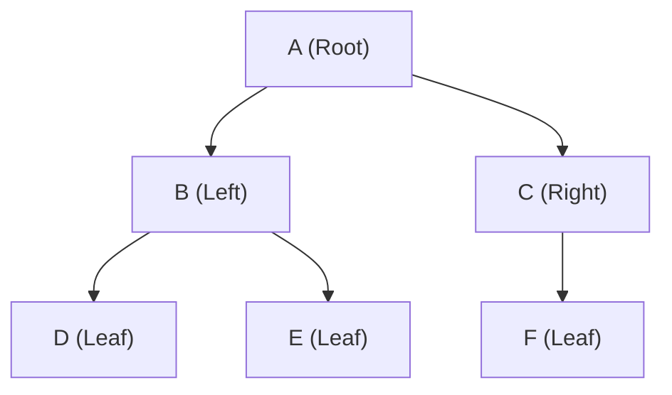
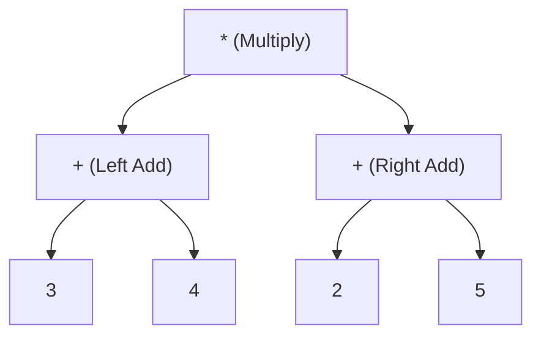

# 📘 WEEK 7 DAY 1: Binary Trees & Traversals — Engineering Guide

> 🧭 **Navigation:** [← Week Overview](README.md) • [🏠 Week Overview](README.md) • [📘 Curriculum Syllabus](../COMPLETE_SYLLABUS.md) • [Next Day →](Week_07_Day_02_Binary_Search_Trees_Instructional.md)
> 
> 💡 **Instructor Note:** *Not all sections or topics are mandatory. Feel free to adapt your pace and skim or skip sections based on your current focus and interview timeline.*

---

## 🎯 LEARNING OBJECTIVES

*By the end of this chapter, you will be able to:*

- 🎯 **Internalize** how binary trees generalize linear structures into hierarchical organizations and why this matters for real-world data.
- ⚙️ **Implement** all four major traversals (preorder, inorder, postorder, level-order) in both recursive and iterative forms without memorization.
- ⚖️ **Evaluate** trade-offs between recursive call stacks and iterative heap-allocated stacks/queues, identifying stack overflow risks on skewed trees.
- 🏭 **Connect** tree traversals to production systems: compiler AST evaluation, scene graph rendering, and breadth-first search pipelines.

---

## 📖 CHAPTER 1: CONTEXT & MOTIVATION

### The Engineering Challenge

Linear data structures (arrays, linked lists) model sequence: event logs, task queues, history stacks. But real-world data is inherently hierarchical:
- **File Systems:** Root directories contain nested subdirectories and files.
- **Compilers:** Expressions like `(3 + 4) * (2 + 5)` are parsed into Abstract Syntax Trees (ASTs) where operator precedence dictating execution order is encoded directly into node depth.
- **Scene Graphs:** In game engines, cameras, player rigs, weapons, and particle effects exist in a parent-child transform hierarchy. Moving the player model must recursively update the weapon's coordinate space before rendering muzzle flash effects.

A flat array cannot represent parent-child relationships without complex index math; a linked list restricts each node to a single successor. Binary trees solve this by providing up to two branching paths per node.

The computational challenge is **navigation**: How do you visit every node systematically when each node splits into two directions? Changing the visitation sequence—preorder, inorder, postorder, or level-order—fundamentally changes what the algorithm computes, from mathematical expression evaluation to tree deallocation.

### The Solution: Binary Trees & Their Traversals

A binary tree is recursive pointers paired with a traversal discipline. By selecting whether you process a node:
1. **Before** descending into its children (**Preorder**: Root `->` Left `->` Right),
2. **Between** visiting left and right subtrees (**Inorder**: Left `->` Root `->` Right),
3. **After** resolving both subtrees (**Postorder**: Left `->` Right `->` Root), or
4. **Level-by-level** from top to bottom (**Level-Order**: Breadth-First Search),

you control the exact order of data aggregation. Master the traversal mechanics, and every hierarchical problem decomposes into manageable subproblems.

> [!TIP]
> **Core Insight:** A binary tree is just recursive pointers plus a traversal sequence. Change the visitation moment relative to branching, and you transform your algorithm from a cloner (preorder) to a sorter (inorder) to a bottom-up evaluator (postorder).

---

## 🧠 CHAPTER 2: BUILDING THE MENTAL MODEL

### The Core Analogy

Think of a binary tree traversal as a **guided tour of a museum with branching wings**:
- You start at the main entrance (the root).
- Each gallery splits into a Left Wing and a Right Wing.
- **Preorder:** You stamp your admission ticket upon entering a gallery, then tour the wings. (Parent processed first)
- **Inorder:** You tour the Left Wing, return to record notes on the main gallery, then explore the Right Wing. (Sorted order in BSTs)
- **Postorder:** You inspect every artifact in both wings first, and only write the summary critique for the gallery on your way out. (Bottom-up evaluation / cleanup)
- **Level-Order:** You inspect every gallery on Floor 1, take the stairs to Floor 2, and inspect all galleries left-to-right. (Breadth-first exploration)

### 🖼 Visualizing the Structure, Node Anatomy & Memory Layout

#### Node Anatomy: The Core Triad
Every binary tree node is composed of three essential fields:
1. **`val` (Payload / Key):** The stored data (e.g., 32-bit `int`, 64-bit reference to a complex object).
2. **`left` (Left Child Pointer):** A 64-bit memory reference to the root of the left subtree, or `null` if empty.
3. **`right` (Right Child Pointer):** A 64-bit memory reference to the root of the right subtree, or `null` if empty.

```
                     Node Anatomy (Logical vs Physical Layout)
                     
       Logical View                           Physical 64-bit Heap Layout (e.g. .NET CLR)
    +-----------------+                     +---------------------------------------------+
    |      [Val]      |                     | 0x00: Object Header / SyncBlock (8 bytes)   |
    |      (Key)      |                     | 0x08: TypeHandle / MethodTable Pointer (8B) |
    +--------+--------+                     | 0x10: int val (4 bytes) + 4-byte padding    |
    |  Left  | Right  |                     | 0x18: TreeNode* left  (8-byte pointer)      |
    | Pointer| Pointer|                     | 0x20: TreeNode* right (8-byte pointer)      |
    +---+----+----+---+                     +---------------------------------------------+
        |         |                         Total Memory Footprint: 32 bytes per node!
        v         v
    [Left Node] [Right Node]
```

#### Contiguous Arrays vs Scattered Tree Nodes: The Cache Reality

```
Contiguous Array (High Cache Locality - Spatial Pre-fetching):
Address:   [ 0x1000 ] [ 0x1004 ] [ 0x1008 ] [ 0x100C ] [ 0x1010 ]
Elements:  |  arr[0] |  arr[1] |  arr[2] |  arr[3] |  arr[4] |
Cache:     <--------------- 64-Byte CPU Cache Line ----------------> (1 fetch brings ~16 ints)

Scattered Binary Tree (Low Cache Locality - Pointer Chasing):
Address:   0x1040                 0x4080                     0x9200
Node:      [ Node A (Root) ] ----> [ Node B (Left) ] -------> [ Node D (Leaf) ]
           (Heap Block 1)         (Heap Block 2)             (Heap Block 3)
Cache:     Each pointer dereference may trigger a separate L1/L2/L3 cache miss!
```



```
Node A (Heap @ 0x1040): val='A', left -> 0x4080 (B),    right -> 0x5100 (C)
Node B (Heap @ 0x4080): val='B', left -> 0x9200 (D),    right -> 0x9240 (E)
Node C (Heap @ 0x5100): val='C', left -> null,          right -> 0x7300 (F)
Node D (Heap @ 0x9200): val='D', left -> null,          right -> null (Leaf)
Node E (Heap @ 0x9240): val='E', left -> null,          right -> null (Leaf)
Node F (Heap @ 0x7300): val='F', left -> null,          right -> null (Leaf)
```

### Invariants & Properties

1. **Acyclic Single-Parent Rule:** Every node has exactly one parent, except the root which has none. Exactly one unique path exists from the root to any target node.
2. **Height Bounds:** For a tree with `N` nodes, the height `H` ranges from `log2(N)` (perfectly balanced) to `N` (degenerate skewed chain, equivalent to a linked list).
3. **Capacity per Level:** Level `k` (0-indexed) contains at most `2^k` nodes. A tree of height `H` contains at most `2^(H+1) - 1` nodes.
4. **Reconstruction Invariant:** Given an inorder traversal along with either a preorder or postorder sequence (with unique node keys), the exact binary tree topology can be uniquely reconstructed.

### Taxonomy of Binary Trees

| Tree Type | Structural Guarantee | Real-World Application |
| :--- | :--- | :--- |
| **Generic Binary Tree** | At most 2 children per node; unrestricted shape | Syntax trees, expression parsers, decision graphs |
| **Full Binary Tree** | Every node has either 0 or 2 children | Huffman coding trees |
| **Complete Binary Tree** | All levels filled except last, which fills left-to-right | Binary heaps (`PriorityQueue`), array-backed trees |
| **Perfect Binary Tree** | All internal nodes have 2 children, all leaves at identical depth | Theoretical lower-bound proofs, tournament trees |
| **Degenerate Tree** | Every internal node has exactly 1 child (linked-list shape) | Worst-case BST performance scenario (`O(N)` height) |

---

## ⚙️ CHAPTER 3: MECHANICS & TRAVERSAL TRACES

### Canonical Reference Tree for All Traversals
To rigorously compare traversal mechanics, we evaluate all operations against this canonical 6-node tree:

```
                 [ 1 ]
                /     \
             [ 2 ]   [ 3 ]
             /   \       \
           [ 4 ] [ 5 ]   [ 6 ]
```

---

### 🔧 Operation 1: Preorder Traversal (`Root -> Left -> Right`)

- **Intent:** Visit the parent node before recursing into left and right subtrees. Ideal for tree serialization, prefix expression generation, and cloning/copying topologies.
- **Traversal Sequence:** `[1, 2, 4, 5, 3, 6]`

#### Recursive Call Stack Trace Table
Each row traces one step in the runtime call stack:

| Step | Function Invocation | Node Examined | Action Taken | Call Stack (Top -> Bottom) | Accumulated Output |
| :---: | :--- | :---: | :--- | :--- | :--- |
| 1 | `Preorder(1)` | `1` | Visit `1`, recurse left `Preorder(2)` | `[1]` | `[1]` |
| 2 | `Preorder(2)` | `2` | Visit `2`, recurse left `Preorder(4)` | `[2, 1]` | `[1, 2]` |
| 3 | `Preorder(4)` | `4` | Visit `4`, recurse left `Preorder(null)` | `[4, 2, 1]` | `[1, 2, 4]` |
| 4 | `Preorder(null)` | `null` | Base case: return to `4` | `[2, 1]` | `[1, 2, 4]` |
| 5 | `Preorder(4)` | `4` | Recurse right `Preorder(null)` | `[4, 2, 1]` | `[1, 2, 4]` |
| 6 | `Preorder(null)` | `null` | Base case: return; `4` finishes | `[2, 1]` | `[1, 2, 4]` |
| 7 | `Preorder(2)` | `2` | Recurse right `Preorder(5)` | `[5, 2, 1]` | `[1, 2, 4]` |
| 8 | `Preorder(5)` | `5` | Visit `5`, recurse left/right null, return | `[2, 1]` | `[1, 2, 4, 5]` |
| 9 | `Preorder(2)` | `2` | Left subtree resolved; return to `1` | `[1]` | `[1, 2, 4, 5]` |
| 10 | `Preorder(1)` | `1` | Recurse right `Preorder(3)` | `[3, 1]` | `[1, 2, 4, 5]` |
| 11 | `Preorder(3)` | `3` | Visit `3`, recurse left `null`, recurse right `6` | `[6, 3, 1]` | `[1, 2, 4, 5, 3]` |
| 12 | `Preorder(6)` | `6` | Visit `6`, recurse left/right null, return | `[3, 1]` | `[1, 2, 4, 5, 3, 6]` |
| 13 | Return Root | - | Stack unwinds to caller; complete | Empty `[]` | `[1, 2, 4, 5, 3, 6]` |

#### Iterative Stack Trace Table (Push Right Before Left)
Because a stack is LIFO (Last-In, First-Out), pushing `right` before `left` guarantees that `left` will pop next:

| Step | Stack at Start of Loop | Popped Node | Push Children (Right then Left) | Output Appended | Result List |
| :---: | :--- | :---: | :--- | :---: | :--- |
| Initial | `[1]` | - | Root pushed initially | - | `[]` |
| 1 | `[1]` | `1` | Push `3`, then push `2` | `1` | `[1]` |
| 2 | `[2, 3]` | `2` | Push `5`, then push `4` | `2` | `[1, 2]` |
| 3 | `[4, 5, 3]` | `4` | Both children null; push nothing | `4` | `[1, 2, 4]` |
| 4 | `[5, 3]` | `5` | Both children null; push nothing | `5` | `[1, 2, 4, 5]` |
| 5 | `[3]` | `3` | Push `6` (right child) | `3` | `[1, 2, 4, 5, 3]` |
| 6 | `[6]` | `6` | Both children null; push nothing | `6` | `[1, 2, 4, 5, 3, 6]` |
| End | Empty `[]` | - | Loop terminates (`stack.Count == 0`) | - | `[1, 2, 4, 5, 3, 6]` |

---

### 🔧 Operation 2: Inorder Traversal (`Left -> Root -> Right`)

- **Intent:** Drill to the deepest left child before processing the node, followed by the right subtree. In a Binary Search Tree (BST), this produces elements in **strictly non-decreasing sorted order**.
- **Traversal Sequence:** `[4, 2, 5, 1, 3, 6]`

#### Recursive Call Stack Trace Table

| Step | Function Invocation | Node Examined | Action Taken | Call Stack | Accumulated Output |
| :---: | :--- | :---: | :--- | :--- | :--- |
| 1 | `Inorder(1)` | `1` | Recurse left `Inorder(2)` | `[1]` | `[]` |
| 2 | `Inorder(2)` | `2` | Recurse left `Inorder(4)` | `[2, 1]` | `[]` |
| 3 | `Inorder(4)` | `4` | Recurse left `Inorder(null)` | `[4, 2, 1]` | `[]` |
| 4 | `Inorder(null)` | `null` | Base case: return to `4` | `[2, 1]` | `[]` |
| 5 | Unwind to `4` | `4` | **Visit `4`**, recurse right `null`, return | `[2, 1]` | `[4]` |
| 6 | Unwind to `2` | `2` | **Visit `2`**, recurse right `Inorder(5)` | `[5, 2, 1]` | `[4, 2]` |
| 7 | `Inorder(5)` | `5` | Recurse left `null`, **Visit `5`**, recurse right `null`, return | `[2, 1]` | `[4, 2, 5]` |
| 8 | Unwind to `1` | `1` | **Visit `1`**, recurse right `Inorder(3)` | `[3, 1]` | `[4, 2, 5, 1]` |
| 9 | `Inorder(3)` | `3` | Recurse left `null`, **Visit `3`**, recurse right `Inorder(6)` | `[6, 3, 1]` | `[4, 2, 5, 1, 3]` |
| 10 | `Inorder(6)` | `6` | Recurse left `null`, **Visit `6`**, recurse right `null`, return | `[3, 1]` | `[4, 2, 5, 1, 3, 6]` |
| 11 | Unwind to Root | - | Traversal complete; return result | Empty `[]` | `[4, 2, 5, 1, 3, 6]` |

#### Iterative Stack Trace Table (Left Spine Descent & Pop)
Maintain a pointer `curr` and explicit stack. Drill left pushing all ancestors. When `curr` hits `null`, pop, record value, and pivot to `curr = popped.right`:

| Step | `curr` Pointer | Stack Before Drill | Stack After Left Drill | Popped Node | Next `curr` (`popped.right`) | Result List |
| :---: | :---: | :--- | :--- | :---: | :---: | :--- |
| 1 | `1` | `[]` | `[4, 2, 1]` | `4` | `null` | `[4]` |
| 2 | `null` | `[2, 1]` | `[2, 1]` (no drill) | `2` | `5` | `[4, 2]` |
| 3 | `5` | `[1]` | `[5, 1]` | `5` | `null` | `[4, 2, 5]` |
| 4 | `null` | `[1]` | `[1]` (no drill) | `1` | `3` | `[4, 2, 5, 1]` |
| 5 | `3` | `[]` | `[3]` | `3` | `6` | `[4, 2, 5, 1, 3]` |
| 6 | `6` | `[]` | `[6]` | `6` | `null` | `[4, 2, 5, 1, 3, 6]` |
| 7 | `null` | `[]` | `[]` | - | - (Terminates) | `[4, 2, 5, 1, 3, 6]` |

---

### 🔧 Operation 3: Postorder Traversal (`Left -> Right -> Root`)

- **Intent:** Process all descendant subtrees before visiting their parent. Essential for bottom-up computation (calculating tree height, subtree sizes, diameter) and safe memory deallocation.
- **Traversal Sequence:** `[4, 5, 2, 6, 3, 1]`

#### Recursive Call Stack Trace Table

| Step | Function Invocation | Node Examined | Action Taken | Call Stack | Accumulated Output |
| :---: | :--- | :---: | :--- | :--- | :--- |
| 1 | `Postorder(1)` | `1` | Recurse left `Postorder(2)` | `[1]` | `[]` |
| 2 | `Postorder(2)` | `2` | Recurse left `Postorder(4)` | `[2, 1]` | `[]` |
| 3 | `Postorder(4)` | `4` | Left/right null resolved -> **Visit `4`** | `[2, 1]` | `[4]` |
| 4 | `Postorder(2)` | `2` | Recurse right `Postorder(5)` | `[5, 2, 1]` | `[4]` |
| 5 | `Postorder(5)` | `5` | Left/right null resolved -> **Visit `5`** | `[2, 1]` | `[4, 5]` |
| 6 | Unwind to `2` | `2` | Both children resolved -> **Visit `2`** | `[1]` | `[4, 5, 2]` |
| 7 | `Postorder(1)` | `1` | Recurse right `Postorder(3)` | `[3, 1]` | `[4, 5, 2]` |
| 8 | `Postorder(3)` | `3` | Left null resolved -> Recurse right `Postorder(6)` | `[6, 3, 1]` | `[4, 5, 2]` |
| 9 | `Postorder(6)` | `6` | Left/right null resolved -> **Visit `6`** | `[3, 1]` | `[4, 5, 2, 6]` |
| 10 | Unwind to `3` | `3` | Right child resolved -> **Visit `3`** | `[1]` | `[4, 5, 2, 6, 3]` |
| 11 | Unwind to `1` | `1` | Both children resolved -> **Visit `1`** | Empty `[]` | `[4, 5, 2, 6, 3, 1]` |

#### Iterative Stack Trace Table (Single Stack with `lastVisited` Pointer)
A node can be visited only after its right child has already been visited (or if right child is null):

| Step | `curr` | Stack State | `stack.Peek()` | `lastVisited` | Action Taken | Output Appended |
| :---: | :---: | :--- | :---: | :---: | :--- | :---: |
| 1 | `1` | `[4, 2, 1]` | `4` | `null` | `4.right == null` -> Pop & Visit | `4` |
| 2 | `null` | `[2, 1]` | `2` | `4` | `2.right (5) != 4` -> Drill to `5` | - |
| 3 | `5` | `[5, 2, 1]` | `5` | `4` | `5.right == null` -> Pop & Visit | `5` |
| 4 | `null` | `[2, 1]` | `2` | `5` | `2.right == 5` -> Pop & Visit | `2` |
| 5 | `null` | `[1]` | `1` | `2` | `1.right (3) != 2` -> Drill to `3` | - |
| 6 | `3` | `[6, 3, 1]` | `6` | `2` | `6.right == null` -> Pop & Visit | `6` |
| 7 | `null` | `[3, 1]` | `3` | `6` | `3.right == 6` -> Pop & Visit | `3` |
| 8 | `null` | `[1]` | `1` | `3` | `1.right == 3` -> Pop & Visit | `1` |
| End | `null` | Empty `[]` | - | `1` | Loop terminates | Result: `[4, 5, 2, 6, 3, 1]` |

---

### 🔧 Operation 4: Level-Order Traversal (Breadth-First Search)

- **Intent:** Process nodes level-by-level, left-to-right. Used for finding shortest path in unweighted graphs, hierarchical level snapshots, and complete tree serialization.
- **Queue Batching Mechanism:** To segment nodes into levels, snapshot `int levelSize = queue.Count` at the start of each layer, and dequeue exactly that many elements in an inner loop.

#### Queue Batching Trace Table

| Level | `levelSize` Snapshot | Queue at Start of Level | Dequeued Batch | Enqueued Children | Current Level Array | Accumulated 2D Output |
| :---: | :---: | :--- | :--- | :--- | :--- | :--- |
| **0** | `1` | `[1]` | `1` | `2`, `3` | `[1]` | `[[1]]` |
| **1** | `2` | `[2, 3]` | `2`, `3` | `4`, `5` (from 2), `6` (from 3) | `[2, 3]` | `[[1], [2, 3]]` |
| **2** | `3` | `[4, 5, 6]` | `4`, `5`, `6` | None (all children null) | `[4, 5, 6]` | `[[1], [2, 3], [4, 5, 6]]` |
| End | `0` | Empty `[]` | - | - | - | Complete 3 levels |

---

### 🔧 Operation 5: Morris In-order Traversal (`O(1)` Auxiliary Space)

- **The Fundamental Challenge:** Why do recursive and iterative traversals require `O(H)` auxiliary space? Because binary tree pointers are strictly unidirectional (parent to child). Once you descend to a leaf, you cannot backtrack to its parent without an ancestor stack or parent pointers.
- **The Morris Solution (Pointer Threading):** We temporarily utilize the `right` pointer of the current node's **in-order predecessor** (which is otherwise `null`) to create a bridge ("thread") pointing directly back up to the current node!
- **Algorithmic Invariant Rules:**
  1. If `curr.left is null`: Visit `curr.val`, then advance right: `curr = curr.right`.
  2. If `curr.left is not null`: Find `curr`'s in-order predecessor (`pred = curr.left`, then walk right while `pred.right != null and pred.right != curr`):
     - **Thread Creation (First Visit):** If `pred.right is null`, set `pred.right = curr` (build the bridge) and advance `curr = curr.left`.
     - **Thread Teardown & Visit (Second Visit):** If `pred.right is curr`, the left subtree has been completely visited! Restore the tree by breaking the bridge (`pred.right = null`), visit `curr.val`, and advance `curr = curr.right`.

```
                    Morris Pointer Threading Diagram
                    
      1. Before Threading (Bridge Missing):       2. Thread Created (pred.right -> curr):
                [ 1 ]                                       [ 1 ] <----------+
               /                                           /                 |
            [ 2 ]                                       [ 2 ]                |
            /   \                                       /   \                |
          [ 4 ] [ 5 ]                                 [ 4 ] [ 5 ] ───────────+
                                                      (pred of 1)  (Thread Bridge)
```

#### Step-by-Step Morris Trace on Canonical Tree:

| Step | `curr` | `curr.left` | Predecessor `pred` | `pred.right` | Action Taken | Thread State | Output Appended | Next `curr` |
| :---: | :---: | :---: | :---: | :---: | :--- | :--- | :---: | :---: |
| 1 | `1` | `2` | `5` | `null` | Create thread `5.right = 1` | `5.right -> 1` | - | `2` |
| 2 | `2` | `4` | `4` | `null` | Create thread `4.right = 2` | `4.right -> 2` | - | `4` |
| 3 | `4` | `null` | - | - | `4.left is null` -> Visit & follow thread | Unchanged | `4` | `2` (`4.right`) |
| 4 | `2` | `4` | `4` | `2` | Thread exists! Break thread `4.right = null`, Visit `2` | Thread cut | `2` | `5` (`2.right`) |
| 5 | `5` | `null` | - | - | `5.left is null` -> Visit & follow thread | Unchanged | `5` | `1` (`5.right`) |
| 6 | `1` | `2` | `5` | `1` | Thread exists! Break thread `5.right = null`, Visit `1` | Thread cut | `1` | `3` (`1.right`) |
| 7 | `3` | `null` | - | - | `3.left is null` -> Visit `3` | Unchanged | `3` | `6` (`3.right`) |
| 8 | `6` | `null` | - | - | `6.left is null` -> Visit `6` | Unchanged | `6` | `null` |
| End | `null` | - | - | - | Tree restored to original state! Traversal ends. | All Clean | - | Result: `[4, 2, 5, 1, 3, 6]` |

### 📉 Progressive Example: Expression Tree Evaluation

Consider the arithmetic expression `(3 + 4) * (2 + 5)`:



- **Preorder:** `* + 3 4 + 2 5` (Prefix / Polish Notation)
- **Inorder:** `3 + 4 * 2 + 5` (Infix Notation; loses operator precedence without parentheses)
- **Postorder:** `3 4 + 2 5 + *` (Reverse Polish Notation / RPN; evaluated via stack with zero ambiguity)
- **Level-Order:** `* + + 3 4 2 5` (Breadth-first layer scan)

---

## 💻 CHAPTER 4: PRODUCTION-GRADE IMPLEMENTATIONS (C# & PYTHON)

### Problem 1: Binary Tree Inorder Traversal (LeetCode 94)

#### 🎙️ 45-Minute Interview Talk Track
> *"To obtain the inorder sequence, we process all nodes in the left subtree before visiting the root, followed by the right subtree. In a recursive solution, the runtime call stack maintains this path implicitly. However, for a production system or deep skewed tree with height up to 10^5, recursion risks a stack overflow (`StackOverflowException`). We implement the iterative approach using an explicit heap-allocated stack and a pointer `curr`. We drill down to the leftmost child, pushing ancestors onto the stack. Once `curr` reaches null, we pop the top node, record its value, and transition to its right child. Both methods run in O(N) time and O(H) auxiliary space. If the interviewer pushes for optimal auxiliary space, we present Morris Traversal: by temporarily threading the right pointer of each node's inorder predecessor back to the current node, we traverse the tree in O(N) time using strictly O(1) auxiliary space without altering original node structures permanently."*

#### C# Primary Implementation (.NET 8/9 — Production-Grade)
```csharp
using System;
using System.Collections.Generic;

public sealed class TreeNode
{
    public int val;
    public TreeNode? left;
    public TreeNode? right;

    public TreeNode(int val = 0, TreeNode? left = null, TreeNode? right = null)
    {
        this.val = val;
        this.left = left;
        this.right = right;
    }
}

public static class InorderTraversals
{
    /// <summary>
    /// Recursive Inorder Traversal: Left -> Root -> Right
    /// Time Complexity: O(N) | Auxiliary Space: O(H) call stack
    /// </summary>
    public static IList<int> InorderRecursive(TreeNode? root)
    {
        var result = new List<int>();
        Traverse(root, result);
        return result;

        static void Traverse(TreeNode? node, List<int> list)
        {
            if (node is null) return;
            Traverse(node.left, list);
            list.Add(node.val);
            Traverse(node.right, list);
        }
    }

    /// <summary>
    /// Iterative Inorder Traversal using an explicit Stack.
    /// Eliminates call stack overflow on deep skewed trees.
    /// Time Complexity: O(N) | Auxiliary Space: O(H) explicit stack
    /// </summary>
    public static IList<int> InorderIterative(TreeNode? root)
    {
        var result = new List<int>();
        if (root is null) return result;

        var stack = new Stack<TreeNode>();
        TreeNode? current = root;

        while (current is not null || stack.Count > 0)
        {
            // Step 1: Reach leftmost node of current subtree
            while (current is not null)
            {
                stack.Push(current);
                current = current.left;
            }

            // Step 2: Pop and process node
            current = stack.Pop();
            result.Add(current.val);

            // Step 3: Transition to right child
            current = current.right;
        }

        return result;
    }

    /// <summary>
    /// Morris Inorder Traversal using temporary pointer threading.
    /// Achieves O(1) auxiliary space without permanently mutating the tree.
    /// Time Complexity: O(N) | Auxiliary Space: O(1)
    /// </summary>
    public static IList<int> InorderMorris(TreeNode? root)
    {
        var result = new List<int>();
        TreeNode? current = root;

        while (current is not null)
        {
            if (current.left is null)
            {
                // Rule C: No left child -> visit current and pivot right
                result.Add(current.val);
                current = current.right;
            }
            else
            {
                // Find the inorder predecessor (rightmost node in left subtree)
                TreeNode predecessor = current.left;
                while (predecessor.right is not null && predecessor.right != current)
                {
                    predecessor = predecessor.right;
                }

                if (predecessor.right is null)
                {
                    // Rule A: Thread creation (first arrival at current)
                    predecessor.right = current;
                    current = current.left;
                }
                else
                {
                    // Rule B: Thread teardown & visitation (second arrival at current)
                    predecessor.right = null;
                    result.Add(current.val);
                    current = current.right;
                }
            }
        }

        return result;
    }
}
```

#### Python Secondary Implementation (3.11+ — Idiomatic)
```python
from typing import Optional

class TreeNode:
    def __init__(self, val: int = 0, left: Optional['TreeNode'] = None, right: Optional['TreeNode'] = None):
        self.val = val
        self.left = left
        self.right = right

def inorder_traversal(root: Optional[TreeNode]) -> list[int]:
    """Iterative Inorder Traversal using an explicit stack.
    
    Time Complexity: O(N) | Auxiliary Space: O(H)
    """
    result: list[int] = []
    stack: list[TreeNode] = []
    current = root

    while current is not None or stack:
        while current is not None:
            stack.append(current)
            current = current.left
        
        current = stack.pop()
        result.append(current.val)
        current = current.right

    return result

def inorder_morris(root: Optional[TreeNode]) -> list[int]:
    """Morris Inorder Traversal using pointer threading.
    
    Time Complexity: O(N) | Auxiliary Space: O(1)
    """
    result: list[int] = []
    current = root

    while current is not None:
        if current.left is None:
            # Rule C: No left child -> visit and advance right
            result.append(current.val)
            current = current.right
        else:
            # Find inorder predecessor
            predecessor = current.left
            while predecessor.right is not None and predecessor.right is not current:
                predecessor = predecessor.right

            if predecessor.right is None:
                # Rule A: Create thread bridge
                predecessor.right = current
                current = current.left
            else:
                # Rule B: Destroy thread bridge and visit current
                predecessor.right = None
                result.append(current.val)
                current = current.right

    return result
```

#### 📊 Explicit Complexity Deconstruction
- **Recursive & Iterative Stack Traversal:**
  - **Time Complexity:** `O(N)` — Every node is visited a constant number of times (pushed and popped once).
  - **Auxiliary Space:** `O(H)` — Call stack or explicit stack depth equals tree height `H` (`O(log N)` balanced, `O(N)` degenerate).
- **Morris Traversal:**
  - **Time Complexity:** `O(N)` Amortized — Each edge in the tree is traversed at most 3 times (twice when finding the predecessor to create and remove threads, once when descending). Overall time remains strictly linear `O(N)`.
  - **Auxiliary Space:** `O(1)` — No recursion, no heap stack, no queue. Only two pointer references (`current` and `predecessor`) are maintained.
- **Output Space:** `O(N)` — Required in all variants to hold the serialized result array.

---

### Problem 2: Binary Tree Preorder Traversal (LeetCode 144)

#### 🎙️ 45-Minute Interview Talk Track
> *"Preorder traversal processes the current node immediately upon arrival before descending into children. In the iterative approach, we maintain an explicit stack initialized with the root. When popping a node, we append its value to the output list. Crucially, because stacks are LIFO, we push the right child before the left child. This guarantees that the left child sits on the top of the stack and is evaluated next, preserving the Root -> Left -> Right sequence."*

#### C# Primary Implementation (.NET 8/9 — Production-Grade)
```csharp
public static class PreorderTraversals
{
    /// <summary>
    /// Iterative Preorder Traversal: Root -> Left -> Right
    /// Time Complexity: O(N) | Auxiliary Space: O(H)
    /// </summary>
    public static IList<int> PreorderIterative(TreeNode? root)
    {
        var result = new List<int>();
        if (root is null) return result;

        var stack = new Stack<TreeNode>();
        stack.Push(root);

        while (stack.Count > 0)
        {
            TreeNode node = stack.Pop();
            result.Add(node.val);

            // Push RIGHT first so LEFT is on top of stack and popped first
            if (node.right is not null) stack.Push(node.right);
            if (node.left is not null) stack.Push(node.left);
        }

        return result;
    }
}
```

#### Python Secondary Implementation (3.11+ — Idiomatic)
```python
def preorder_traversal(root: Optional[TreeNode]) -> list[int]:
    """Iterative Preorder Traversal using explicit stack.
    
    Time Complexity: O(N) | Auxiliary Space: O(H)
    """
    if not root:
        return []

    result: list[int] = []
    stack: list[TreeNode] = [root]

    while stack:
        node = stack.pop()
        result.append(node.val)
        
        if node.right:
            stack.append(node.right)
        if node.left:
            stack.append(node.left)

    return result
```

#### 📊 Explicit Complexity Deconstruction
- **Time Complexity:** `O(N)` — Exactly `N` nodes popped and processed.
- **Auxiliary Space:** `O(H)` — At most `O(H)` nodes reside in the stack at any given moment.
- **Output Space:** `O(N)` — Holds `N` node values.

---

### Problem 3: Binary Tree Postorder Traversal (LeetCode 145)

#### 🎙️ 45-Minute Interview Talk Track
> *"Postorder visits all children before the parent. Iteratively, this is trickier because we must distinguish between visiting a parent on the way down versus returning after its right subtree has finished. One robust approach uses a single stack and a `prev` pointer. A node can be processed and popped only if it is a leaf or its right child was the node visited immediately prior (`curr.right == prev`). Otherwise, we push `curr` and descend into `curr.right`."*

#### C# Primary Implementation (.NET 8/9 — Production-Grade)
```csharp
public static class PostorderTraversals
{
    /// <summary>
    /// Iterative Postorder Traversal with single stack and previous pointer.
    /// Time Complexity: O(N) | Auxiliary Space: O(H)
    /// </summary>
    public static IList<int> PostorderIterative(TreeNode? root)
    {
        var result = new List<int>();
        if (root is null) return result;

        var stack = new Stack<TreeNode>();
        TreeNode? current = root;
        TreeNode? prev = null;

        while (current is not null || stack.Count > 0)
        {
            while (current is not null)
            {
                stack.Push(current);
                current = current.left;
            }

            TreeNode peekNode = stack.Peek();

            // If right child exists and hasn't been processed yet, traverse right
            if (peekNode.right is not null && peekNode.right != prev)
            {
                current = peekNode.right;
            }
            else
            {
                // Both left and right subtrees have been processed
                stack.Pop();
                result.Add(peekNode.val);
                prev = peekNode;
            }
        }

        return result;
    }
}
```

#### Python Secondary Implementation (3.11+ — Idiomatic)
```python
def postorder_traversal(root: Optional[TreeNode]) -> list[int]:
    """Iterative Postorder Traversal using single stack and previous pointer.
    
    Time Complexity: O(N) | Auxiliary Space: O(H)
    """
    result: list[int] = []
    stack: list[TreeNode] = []
    current = root
    prev: Optional[TreeNode] = None

    while current or stack:
        while current:
            stack.append(current)
            current = current.left
        
        peek = stack[-1]
        if peek.right and peek.right is not prev:
            current = peek.right
        else:
            stack.pop()
            result.append(peek.val)
            prev = peek

    return result
```

#### 📊 Explicit Complexity Deconstruction
- **Time Complexity:** `O(N)` — Every edge is traversed at most twice.
- **Auxiliary Space:** `O(H)` — Stack depth strictly bounded by tree height.
- **Output Space:** `O(N)` — Result list.

---

### Problem 4: Binary Tree Level Order Traversal (LeetCode 102)

#### 🎙️ 45-Minute Interview Talk Track
> *"For level-order traversal, we process nodes breadth-first using a queue. To segment output into individual sublists per horizontal level, we capture `queue.Count` before the inner iteration loop. This snapshot represents the exact number of nodes present at the current depth. We dequeue exactly that many nodes, record their values into the level list, and enqueue their children for the subsequent level. This avoids mixing levels and operates in O(N) time and O(W) space."*

#### C# Primary Implementation (.NET 8/9 — Production-Grade)
```csharp
public static class LevelOrderTraversals
{
    /// <summary>
    /// Level-Order Traversal (BFS) grouping nodes by depth.
    /// Time Complexity: O(N) | Auxiliary Space: O(W) where W = max tree width
    /// </summary>
    public static IList<IList<int>> LevelOrder(TreeNode? root)
    {
        var result = new List<IList<int>>();
        if (root is null) return result;

        var queue = new Queue<TreeNode>();
        queue.Enqueue(root);

        while (queue.Count > 0)
        {
            // CRITICAL: Snapshot queue count before dequeuing
            int levelSize = queue.Count;
            var currentLevel = new List<int>(levelSize);

            for (int i = 0; i < levelSize; i++)
            {
                TreeNode node = queue.Dequeue();
                currentLevel.Add(node.val);

                if (node.left is not null) queue.Enqueue(node.left);
                if (node.right is not null) queue.Enqueue(node.right);
            }

            result.Add(currentLevel);
        }

        return result;
    }
}
```

#### Python Secondary Implementation (3.11+ — Idiomatic)
```python
from collections import deque

def level_order(root: Optional[TreeNode]) -> list[list[int]]:
    """Level-Order Traversal grouping nodes by depth.
    
    Time Complexity: O(N) | Auxiliary Space: O(W)
    """
    if not root:
        return []

    result: list[list[int]] = []
    queue: deque[TreeNode] = deque([root])

    while queue:
        level_size = len(queue)
        current_level: list[int] = []

        for _ in range(level_size):
            node = queue.popleft()
            current_level.append(node.val)

            if node.left:
                queue.append(node.left)
            if node.right:
                queue.append(node.right)

        result.append(current_level)

    return result
```

#### 📊 Explicit Complexity Deconstruction
- **Time Complexity:** `O(N)` — Each node is enqueued once and dequeued once.
- **Auxiliary Space:** `O(W)` — In a complete binary tree, the final level holds `N / 2` nodes, requiring `O(N)` queue capacity in the worst case.
- **Output Space:** `O(N)` — Holds lists containing all `N` node values.

---

## ⚖️ CHAPTER 5: PERFORMANCE, TRADE-OFFS & FAANG PATTERN SIGNALS

### Beyond Big-O: Performance Reality

1. **Call Stack vs Heap Stack:** Recursive traversal uses thread call-stack frames (~100-200 bytes per frame depending on runtime register spills). On Windows/Linux, thread stacks default to 1MB–8MB. A degenerate tree of depth 100,000 will throw `StackOverflowException`. Iterative versions allocate from heap memory, scaling to millions of nodes safely.
2. **Pointer Chasing & Cache Locality:** Tree nodes are allocated at disparate heap addresses. Unlike contiguous array traversal, navigating `node.left` and `node.right` causes CPU L1/L2 cache misses.

### 🏭 Real-World Systems Context

> [!NOTE]
> **Production Context — Compilers & Abstract Syntax Trees (AST):** Compilers (GCC, Roslyn, Clang) build ASTs from source tokens. Semantic analysis uses preorder traversal to build scoped symbol tables (parent scope declared before children), while code generation and expression evaluation use postorder traversal to ensure operand values are loaded into registers before arithmetic operators execute.

> [!NOTE]
> **Production Context — Database B-Trees & Disk Pages:** Databases (PostgreSQL, MySQL InnoDB) generalize binary trees to multi-way B+ trees. A single B+ tree page (typically 4KB–16KB) contains hundreds of keys so that tree height is restricted to 3–4 levels, transforming random disk seeks into sequential memory block operations.

> [!NOTE]
> **Production Context — Game Engines & Scene Graphs:** Game engines (Unity, Unreal) structure scene nodes hierarchically. Frustum culling utilizes postorder bounding-box aggregation: if a parent node's combined bounding volume lies completely outside the camera frustum, the engine prunes the entire subtree traversal, preventing unnecessary draw calls.

### Failure Modes & Edge Cases

| Failure Mode | Root Cause | Engineering Mitigation |
| :--- | :--- | :--- |
| **Stack Overflow** | Recursive traversal on degenerate skewed tree (`H = 10^5`) | Switch to iterative traversal with explicit heap stack |
| **Level-Order Mixing** | Querying `queue.Count` inside the loop condition rather than snapshotting | Capture `int levelSize = queue.Count;` prior to inner dequeue loop |
| **Null Pointer Crash** | Accessing `node.left` or `node.right` without null check | Guard clause: `if (node is null) return;` |
| **Memory Deallocation Leak** | Freeing parent before children in manual memory runtimes | Always utilize postorder traversal for cleanup |

### Pattern Recognition & Decision Framework

```
Hierarchical Processing Decision:
- Need to copy, clone, or serialize tree?
    └── Preorder Traversal (Root -> Left -> Right)
- Working with a Binary Search Tree and need sorted keys?
    └── Inorder Traversal (Left -> Root -> Right)
- Need bottom-up aggregation (height, diameter, memory cleanup)?
    └── Postorder Traversal (Left -> Right -> Root)
- Need shortest path, horizontal view, or layer-by-layer batching?
    └── Level-Order Traversal (BFS via Queue)
```

### 🧪 Socratic Reflection
1. *Why does Morris Traversal achieve `O(1)` auxiliary space, and what is its trade-off during multi-threaded concurrent reads?*
2. *If an interview problem asks for the "right view" of a binary tree, can you solve it using both DFS and BFS? Which is more space-efficient on a wide complete tree?*

---

## ⚔️ SUPPLEMENTARY OUTCOMES

### 🏋️ Practice Problems

| # | Problem | Source | Difficulty | Target Pattern |
| :---: | :--- | :--- | :---: | :--- |
| 1 | Binary Tree Inorder Traversal | LeetCode #94 | 🟢 Easy | Iterative stack simulation |
| 2 | Binary Tree Preorder Traversal | LeetCode #144 | 🟢 Easy | Explicit stack; push right then left |
| 3 | Binary Tree Postorder Traversal | LeetCode #145 | 🟢 Easy | Single stack with previous pointer |
| 4 | Binary Tree Level Order Traversal | LeetCode #102 | 🟡 Medium | Queue BFS with level snapshot |
| 5 | Binary Tree Zigzag Level Order | LeetCode #103 | 🟡 Medium | BFS with alternating directional inserts |
| 6 | Maximum Depth of Binary Tree | LeetCode #104 | 🟢 Easy | Postorder bottom-up height aggregation |
| 7 | Construct Tree from Preorder & Inorder | LeetCode #105 | 🟡 Medium | Divide-and-conquer index reconstruction |
| 8 | Populating Next Right Pointers | LeetCode #116 | 🟡 Medium | Level-order pointer stitching |
| 9 | Binary Tree Right Side View | LeetCode #199 | 🟡 Medium | BFS last element / DFS reverse preorder |
| 10 | Recover Binary Search Tree | LeetCode #99 | 🟡 Medium | Inorder traversal detecting swapped nodes |

### 🎙️ Interview Questions & Follow-ups
1. **Q: How would you traverse a binary tree in `O(1)` auxiliary space without altering original node definitions?**
   - *Follow-up:* Explain Morris traversal's temporary threading via inorder predecessors and why temporary mutations must be cleaned up before exiting.
2. **Q: Given preorder and inorder traversals, why can you uniquely reconstruct the tree, whereas given preorder and postorder you cannot?**
   - *Follow-up:* What additional constraint makes preorder + postorder reconstruction unique? (Full binary tree where every node has 0 or 2 children).

### ❌ Common Misconceptions
- **Myth:** "Iterative traversals are always faster than recursive ones."
  - **Reality:** Modern JIT compilers inline shallow recursion and use CPU register caching efficiently. Iterative traversals shine primarily in preventing stack overflows on deep trees, not necessarily in raw micro-benchmark speed.
- **Myth:** "Inorder traversal always yields sorted keys."
  - **Reality:** Inorder traversal yields sorted output **only** for Binary Search Trees (BSTs). On arbitrary binary trees, it simply reflects the topological left-to-right projection.

---

## 📊 COMPLEXITY RECAP

| Traversal | Algorithm Mode | Time Complexity | Auxiliary Space (Balanced) | Auxiliary Space (Skewed) | Output Space |
| :--- | :--- | :---: | :---: | :---: | :---: |
| **Preorder** | Recursive / Stack | `O(N)` | `O(log N)` | `O(N)` | `O(N)` |
| **Inorder** | Recursive / Stack | `O(N)` | `O(log N)` | `O(N)` | `O(N)` |
| **Postorder** | Recursive / Stack | `O(N)` | `O(log N)` | `O(N)` | `O(N)` |
| **Level-Order** | Iterative Queue | `O(N)` | `O(N)` (Width `W`) | `O(1)` | `O(N)` |
| **Morris Inorder** | Pointer Threading | `O(N)` | `O(1)` | `O(1)` | `O(N)` |

---

> 🧭 **Navigation:** [← Week Overview](README.md) • [🏠 Week Overview](README.md) • [📘 Curriculum Syllabus](../COMPLETE_SYLLABUS.md) • [Next Day →](Week_07_Day_02_Binary_Search_Trees_Instructional.md)
