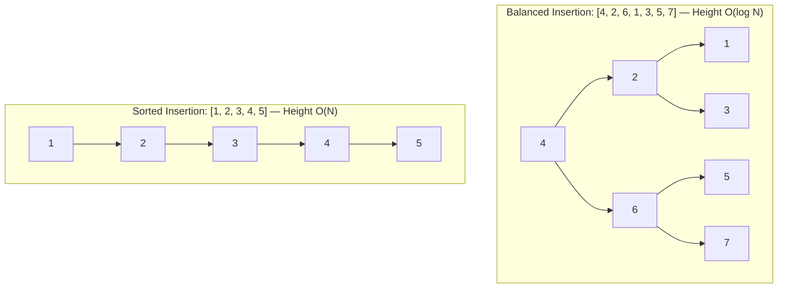

# 📘 WEEK 7 DAY 2: Binary Search Trees (BSTs) — Engineering Guide

> 🧭 **Navigation:** [← Previous Day](Week_07_Day_01_Binary_Trees_And_Traversals_Instructional.md) • [🏠 Week Overview](README.md) • [📘 Curriculum Syllabus](../COMPLETE_SYLLABUS.md) • [Next Day →](Week_07_Day_03_Balanced_BSTs_AVL_And_RedBlack_Instructional.md)
> 
> 💡 **Instructor Note:** *Not all sections or topics are mandatory. Feel free to adapt your pace and skim or skip sections based on your current focus and interview timeline.*

---

## 🎯 LEARNING OBJECTIVES

*By the end of this chapter, you will be able to:*

- 🎯 **Internalize** the BST invariant (`left.val < node.val < right.val`) as a structural contract that converts linear search into logarithmic binary decisions.
- ⚙️ **Implement** search, insert, delete (handling leaf, single-child, and two-children successor cases), and BST validation from scratch in both C# and Python.
- ⚖️ **Evaluate** why unbalanced BSTs degenerate into linked lists on sorted insertions and recognize when tree height dictates system latency.
- 🏭 **Connect** BST invariants to production systems: database secondary indexes, compiler symbol tables, and standard library sorted collections.

---

## 📖 CHAPTER 1: CONTEXT & MOTIVATION

### The Engineering Challenge

Consider the trade-offs among fundamental data structures for an in-memory key lookup system:
- **Unsorted Array / Linked List:** Fast insertions (`O(1)`), but lookups take `O(N)` linear scans.
- **Sorted Array:** Rapid lookups via binary search (`O(log N)`), but inserting or deleting elements requires shifting memory blocks, costing `O(N)` time.
- **Hash Table:** Blazing `O(1)` average lookups and mutations, but completely destroys ordering. Range queries (`WHERE price BETWEEN 20 AND 50`), finding the minimum/maximum, or extracting sorted streams require `O(N)` table scans.

We need a structure that delivers both: **dynamic logarithmic mutations** like a linked list and **logarithmic ordered searches** like a sorted array.

### The Solution: The Binary Search Tree Invariant

A Binary Search Tree (BST) organizes nodes hierarchically under a strict relational contract:
For every node `X`:
- Every key in the **left subtree** is strictly less than `X.val`.
- Every key in the **right subtree** is strictly greater than `X.val`.
- Both subtrees are themselves valid BSTs.

```
                  [ 10 ]
                 /      \
             [ 5 ]      [ 15 ]
            /     \     /    \
          [ 2 ]  [ 7 ][ 12 ] [ 20 ]
```

This structural invariant eliminates half of the candidate search space at every branching decision. Searching for a key mirrors binary search, but insertion and deletion require only local pointer updates without shifting memory.

> [!TIP]
> **Core Insight:** Inorder traversal of any valid BST visits nodes in strictly ascending sorted order. The structure of the tree directly embodies the sorted array, while the pointers provide the dynamic mutability of linked nodes.

---

## 🧠 CHAPTER 2: BUILDING THE MENTAL MODEL

### The Core Analogy

Think of a BST as a **hierarchical library card catalog**:
- You stand at the main catalog cabinet (Root: key `50`).
- If you seek book `32`, `32 < 50` immediately directs you to the Left Wing. You completely ignore thousands of books in the Right Wing (`> 50`).
- In the Left Wing, you encounter drawer `25`. Because `32 > 25`, you branch Right.
- At each step, a single comparison halves your remaining universe of books.

### 🖼 Visualizing the Structure & Pointer Navigation

```
Target Search Key: 7

Step 1: Compare 7 with Root (10)  --> 7 < 10, Branch LEFT
              [ 10 ]
             /
Step 2: Compare 7 with Node (5)   --> 7 > 5,  Branch RIGHT
         [ 5 ]
              \
Step 3: Compare 7 with Node (7)   --> 7 == 7, MATCH FOUND!
              [ 7 ]
```

Memory layout of a single BST node:

```
+-------------------------------------------------------+
|                       BST Node                        |
|  int val = 5                                          |
|  TreeNode? left  ──────────> [ All keys < 5 ]         |
|  TreeNode? right ──────────> [ All keys > 5 ]         |
+-------------------------------------------------------+
```

### Invariants & Theoretical Foundations

1. **Strict Invariant Definition:** For any node `curr`, `max(curr.left) < curr.val < min(curr.right)`. A common interview bug is checking only immediate children (`node.left.val < node.val`). The invariant must hold across the **entire subtree**.
2. **Height & Complexity Bounds:**
   - **Balanced Tree:** Height `H = O(log N)`. Search, insertion, and deletion run in `O(log N)`.
   - **Degenerate Tree (Skewed):** When keys are inserted in sorted order (`[1, 2, 3, 4, 5]`), the tree becomes a single chain of height `H = O(N)`, degrading all operations to `O(N)`.
3. **Inorder Successor & Predecessor:**
   - **Inorder Successor:** The smallest node in the right subtree (`FindMin(node.right)`).
   - **Inorder Predecessor:** The largest node in the left subtree (`FindMax(node.left)`).

---

## ⚙️ CHAPTER 3: MECHANICS & STATE MACHINE

### 🔧 Complete BST CRUD Operations

A Binary Search Tree provides the full Create, Read, Update, and Delete (CRUD) lifecycle governed by the invariant: `Left < Root < Right`.

#### 1. Create (Insert)
- **Invariant Rule:** Compare the new key against the current node. If `val < curr.val`, branch left; if `val > curr.val`, branch right.
- **Base Case:** When reaching a `null` reference, allocate the new `TreeNode(val)` and return it to link with its parent.
- **Visual Trace (Inserting `6` into Tree `[8, 3, 10, 1]`):**
```
Insert 6:
Step 1: 6 < 8  --> Branch Left to [ 3 ]
Step 2: 6 > 3  --> [ 3 ].right is null! Attach [ 6 ] here.

        [ 8 ]                         [ 8 ]
       /     \                       /     \
    [ 3 ]   [ 10 ]     ── Insert 6 ──> [ 3 ]   [ 10 ]
    /                                  /   \
  [ 1 ]                              [ 1 ] [ 6 ]
```

#### 2. Read (Search)
- **Invariant Rule:** At each node, compare `target` with `curr.val`:
  - `target == curr.val`: Target found. Return node reference.
  - `target < curr.val`: Target must reside in left subtree. Move `curr = curr.left`.
  - `target > curr.val`: Target must reside in right subtree. Move `curr = curr.right`.
  - `curr == null`: Target does not exist in the BST. Return `null`.
- **Zero-Allocation Advantage:** Done iteratively, search consumes strictly `O(1)` auxiliary memory with no call-stack overhead.

#### 3. Update (Payload vs Key Modification)
- **Payload / Satellite Data Update:** If updating associated data (e.g., student GPA given student ID), locate the node via search in `O(H)` time and overwrite the satellite field in-place.
- **Key Modification:** If modifying the indexed search key itself, **you cannot overwrite `node.val` in-place**, as doing so violates the BST invariant across ancestor and descendant nodes. Instead:
  1. `DeleteNode(root, oldKey)`
  2. `InsertIntoBST(root, newKey)`

#### 4. Delete: Visual Step-by-Step Traces of All 3 Cases

Deleting a node `Z` while preserving the ordering invariant presents three structural cases:

##### Case 1: Node Z is a Leaf (Zero Children)
The node has no descendants (`left == null && right == null`). Discard it by returning `null` to its parent.

```
Visual Trace: Delete Leaf Node 2 from Parent 5
       [ 5 ]                          [ 5 ]
      /     \       ── Delete 2 ──>  /     \
    [ 2 ]   [ 8 ]                  null    [ 8 ]
    /   \
  null  null
Action: 5.left is reassigned from reference(2) to null. Node 2 is unlinked.
```

##### Case 2: Node Z has Exactly One Child
The node has either a left child or a right child, but not both. Bypass `Z` by returning its non-null child directly to `Z`'s parent.

```
Visual Trace: Delete Node 2 (having only right child 3)
       [ 5 ]                          [ 5 ]
      /     \       ── Delete 2 ──>  /     \
    [ 2 ]   [ 8 ]                  [ 3 ]   [ 8 ]
        \
        [ 3 ]
Action: 5.left is reassigned directly to 2.right (Node 3). Node 2 is bypassed.
```

##### Case 3: Node Z has Two Children (In-Order Successor Replacement)
The node has both non-null left and right subtrees. You cannot simply unlink `Z`, because both subtrees must remain reachable and valid:
1. Locate `Z`'s **in-order successor** `S`: the minimum element in `Z`'s right subtree (`FindMin(Z.right)`).
   *(Note: Alternatively, you could use the in-order predecessor: `FindMax(Z.left)`).*
2. Copy `S.val` into `Z.val` (replacing `Z`'s payload).
3. Recursively delete `S.val` from `Z.right`. Because `S` is the minimum in the right subtree, **`S` cannot have a left child** (`S.left == null`). Thus, deleting `S` strictly reduces to Case 1 (if `S` is a leaf) or Case 2 (if `S` has a right child)!

```
Visual Step-by-Step Trace: Delete Node 5 (Two Children: left 3, right 8)

Step A: Locate Node 5 and its In-order Successor (Min of right subtree = 6)
            [ 5 ] <--- Target to delete
           /     \
        [ 3 ]   [ 8 ]
               /     \
             [ 6 ]   [ 9 ]
             (Successor: min of right subtree)

Step B: Overwrite Target's Value with Successor's Value (5 becomes 6)
            [ 6 ] <--- Overwritten with Successor val
           /     \
        [ 3 ]   [ 8 ]
               /     \
             [ 6 ]   [ 9 ] <--- Duplicate temporarily exists

Step C: Delete Successor (6) from right subtree (Reduces to Case 1 or 2)
            [ 6 ]
           /     \
        [ 3 ]   [ 8 ]
               /     \
             null    [ 9 ]
Invariant Result: 3 < 6 < 8 < 9. Structure remains a strictly valid BST!
```

---

### 🔧 Dedicated BST Navigation & Verification Operations

#### Operation 5: `FindMin` and `FindMax`
- **`FindMin(node)`:** Follow `left` pointers until `curr.left == null`. The leftmost node is guaranteed to hold the minimum key in the subtree.
- **`FindMax(node)`:** Follow `right` pointers until `curr.right == null`. The rightmost node holds the maximum key.

#### Operation 6: `InorderSuccessor(root, p)` — Finding the Next Larger Key
Given node `p`, find the node with the smallest key strictly greater than `p.val`:
- **Scenario A (`p.right != null`):** The successor is the minimum node in `p`'s right subtree: `FindMin(p.right)`.
- **Scenario B (`p.right == null`):** The successor is the deepest ancestor for which `p` lies in its **left** subtree.
  - *Algorithm:* Start at `root`. While `curr != null`:
    - If `p.val < curr.val`, record `curr` as candidate successor and branch left (`curr = curr.left`).
    - If `p.val >= curr.val`, branch right (`curr = curr.right`).

```
Inorder Successor Scenarios:
Scenario A (Right Subtree Exists):         Scenario B (No Right Subtree):
        [ 20 ]                                     [ 20 ] <--- Lowest left-turn ancestor (Successor of 15)
       /      \                                   /      \
    [ 10 ]    [ 30 ]                           [ 10 ]    [ 30 ]
             /                                     \
          [ 25 ] <--- FindMin(30.left)             [ 15 ] <--- p (No right child)
          Successor of 20 is 25!                   Successor of 15 is 20!
```

#### Operation 7: `InorderPredecessor(root, p)` — Finding the Previous Smaller Key
Given node `p`, find the node with the largest key strictly smaller than `p.val`:
- **Scenario A (`p.left != null`):** The predecessor is the maximum node in `p`'s left subtree: `FindMax(p.left)`.
- **Scenario B (`p.left == null`):** The predecessor is the deepest ancestor for which `p` lies in its **right** subtree.
  - *Algorithm:* Start at `root`. While `curr != null`:
    - If `p.val > curr.val`, record `curr` as candidate predecessor and branch right (`curr = curr.right`).
    - If `p.val <= curr.val`, branch left (`curr = curr.left`).

#### Operation 8: `ValidateBST(root)` — Subtree Bounding
- Checking only local child relationships (`node.left.val < node.val`) is a fatal interview bug.
- Correct approach: maintain a valid interval `(low, high)`.
  - For the left subtree, valid range is `(low, node.val)`.
  - For the right subtree, valid range is `(node.val, high)`.
  - Base case: `null` returns `true`. If `node.val <= low || node.val >= high`, return `false`.

### 📉 Progressive Example: Balanced vs Degenerate BST



---

## 💻 CHAPTER 4: PRODUCTION-GRADE IMPLEMENTATIONS (C# & PYTHON)

### Problem 1: Search in a Binary Search Tree (LeetCode 700)

#### 🎙️ 45-Minute Interview Talk Track
> *"To locate a target key in a BST, we exploit the ordering invariant: at any node, if the target matches the node's value, we return it immediately. If the target is strictly smaller, the invariant guarantees that any potential match must reside in the left subtree; otherwise, it must reside in the right subtree. We implement this iteratively to maintain O(1) auxiliary space, terminating when we either match the key or hit a null reference, running in O(H) time where H is tree height."*

#### C# Primary Implementation (.NET 8/9 — Iterative Zero-Allocation)
```csharp
public static class BstSearcher
{
    /// <summary>
    /// Searches for a target value in a BST iteratively.
    /// Time Complexity: O(H) | Auxiliary Space: O(1)
    /// </summary>
    public static TreeNode? SearchBST(TreeNode? root, int val)
    {
        TreeNode? current = root;

        while (current is not null)
        {
            if (current.val == val)
            {
                return current;
            }

            current = val < current.val ? current.left : current.right;
        }

        return null;
    }
}
```

#### Python Secondary Implementation (3.11+ — Idiomatic)
```python
def search_bst(root: Optional[TreeNode], val: int) -> Optional[TreeNode]:
    """Iterative search in a Binary Search Tree.
    
    Time Complexity: O(H) | Auxiliary Space: O(1)
    """
    current = root
    while current:
        if current.val == val:
            return current
        current = current.left if val < current.val else current.right
    return None
```

#### 📊 Explicit Complexity Deconstruction
- **Time Complexity:** `O(H)` — In each iteration, we descend one level. On balanced trees, this is `O(log N)`; on skewed trees, `O(N)`.
- **Auxiliary Space:** `O(1)` — Only a single reference pointer is maintained.
- **Output Space:** `O(1)` — Returns reference to existing node or `null`.

---

### Problem 2: Insert into a Binary Search Tree (LeetCode 701)

#### 🎙️ 45-Minute Interview Talk Track
> *"Inserting into a BST involves finding the unique leaf position where the new value belongs. Using recursion, our base case creates and returns a new node when reaching null. At each step, if the value is smaller than the current node, we assign the result of recursing left to `root.left`; otherwise, we assign the result of recursing right to `root.right`. Returning `root` ensures existing parent-child references remain intact throughout the unwind phase."*

#### C# Primary Implementation (.NET 8/9 — Production-Grade)
```csharp
public static class BstInserter
{
    /// <summary>
    /// Inserts a new value into the BST preserving the invariant.
    /// Time Complexity: O(H) | Auxiliary Space: O(H) recursive stack
    /// </summary>
    public static TreeNode InsertIntoBST(TreeNode? root, int val)
    {
        if (root is null)
        {
            return new TreeNode(val);
        }

        if (val < root.val)
        {
            root.left = InsertIntoBST(root.left, val);
        }
        else if (val > root.val)
        {
            root.right = InsertIntoBST(root.right, val);
        }

        return root;
    }
}
```

#### Python Secondary Implementation (3.11+ — Idiomatic)
```python
def insert_into_bst(root: Optional[TreeNode], val: int) -> TreeNode:
    """Inserts a new value into a BST recursively.
    
    Time Complexity: O(H) | Auxiliary Space: O(H)
    """
    if not root:
        return TreeNode(val)

    if val < root.val:
        root.left = insert_into_bst(root.left, val)
    elif val > root.val:
        root.right = insert_into_bst(root.right, val)

    return root
```

#### 📊 Explicit Complexity Deconstruction
- **Time Complexity:** `O(H)` — Traverses a single root-to-leaf path (`O(log N)` balanced, `O(N)` skewed).
- **Auxiliary Space:** `O(H)` — Call stack frames proportional to tree height.
- **Output Space:** `O(1)` — Exactly one new `TreeNode` allocated.

---

### Problem 3: Delete Node in a BST (LeetCode 450)

#### 🎙️ 45-Minute Interview Talk Track
> *"Deleting a node requires finding the target key and restructuring the tree across three distinct scenarios: if the node is a leaf, we return null to sever it; if it has a single child, we return that child to bypass the deleted node; if it has two children, we locate its inorder successor—the minimum element in the right subtree. We overwrite the current node's value with the successor's value, and then recursively delete that successor from the right subtree. This preserves the BST ordering across the entire tree."*

#### C# Primary Implementation (.NET 8/9 — Production-Grade)
```csharp
public static class BstDeleter
{
    /// <summary>
    /// Deletes a key from a BST, handling 0, 1, and 2-child cases.
    /// Time Complexity: O(H) | Auxiliary Space: O(H)
    /// </summary>
    public static TreeNode? DeleteNode(TreeNode? root, int key)
    {
        if (root is null) return null;

        if (key < root.val)
        {
            root.left = DeleteNode(root.left, key);
        }
        else if (key > root.val)
        {
            root.right = DeleteNode(root.right, key);
        }
        else
        {
            // Case 1 & 2: Zero or one child
            if (root.left is null) return root.right;
            if (root.right is null) return root.left;

            // Case 3: Two children
            // Find inorder successor (minimum node in right subtree)
            TreeNode successor = FindMin(root.right);
            root.val = successor.val;
            // Delete successor from right subtree
            root.right = DeleteNode(root.right, successor.val);
        }

        return root;
    }

    private static TreeNode FindMin(TreeNode node)
    {
        while (node.left is not null)
        {
            node = node.left;
        }
        return node;
    }
}
```

#### Python Secondary Implementation (3.11+ — Idiomatic)
```python
def delete_node(root: Optional[TreeNode], key: int) -> Optional[TreeNode]:
    """Deletes a node with the given key from a BST.
    
    Time Complexity: O(H) | Auxiliary Space: O(H)
    """
    if not root:
        return None

    if key < root.val:
        root.left = delete_node(root.left, key)
    elif key > root.val:
        root.right = delete_node(root.right, key)
    else:
        # Case 1 & 2: 0 or 1 child
        if not root.left:
            return root.right
        if not root.right:
            return root.left

        # Case 3: 2 children
        successor = root.right
        while successor.left:
            successor = successor.left
        
        root.val = successor.val
        root.right = delete_node(root.right, successor.val)

    return root
```

#### 📊 Explicit Complexity Deconstruction
- **Time Complexity:** `O(H)` — Finding the target node is `O(H)`. Finding the successor and deleting it also descends along a single branch, bounded by `O(H)`.
- **Auxiliary Space:** `O(H)` — Call stack depth bounded by tree height.
- **Output Space:** `O(1)` — In-place pointer modifications.

---

### Problem 4: Validate Binary Search Tree (LeetCode 98)

#### 🎙️ 45-Minute Interview Talk Track
> *"A frequent trap in BST validation is verifying only local parent-child relations. A node must actually satisfy global bounds: every element in its left subtree must be strictly less than the node, and every element in the right subtree strictly greater. We pass explicit allowable range boundaries `(min, max)` down the recursive call stack. For the left child, the upper bound tightens to `node.val`; for the right child, the lower bound tightens to `node.val`. We use 64-bit integers (`long`) to prevent integer overflow when node values match `int.MinValue` or `int.MaxValue`."*

#### C# Primary Implementation (.NET 8/9 — Range Bounded)
```csharp
public static class BstValidator
{
    /// <summary>
    /// Validates whether a binary tree satisfies the BST invariant.
    /// Time Complexity: O(N) | Auxiliary Space: O(H)
    /// </summary>
    public static bool IsValidBST(TreeNode? root)
    {
        return Validate(root, long.MinValue, long.MaxValue);

        static bool Validate(TreeNode? node, long min, long max)
        {
            if (node is null) return true;

            // Invariant violation: key outside permissible bounds
            if (node.val <= min || node.val >= max)
            {
                return false;
            }

            return Validate(node.left, min, node.val) &&
                   Validate(node.right, node.val, max);
        }
    }
}
```

#### Python Secondary Implementation (3.11+ — Idiomatic)
```python
def is_valid_bst(root: Optional[TreeNode]) -> bool:
    """Validates if binary tree satisfies the BST property.
    
    Time Complexity: O(N) | Auxiliary Space: O(H)
    """
    def validate(node: Optional[TreeNode], min_val: float, max_val: float) -> bool:
        if not node:
            return True
        if not (min_val < node.val < max_val):
            return False
        return validate(node.left, min_val, node.val) and validate(node.right, node.val, max_val)

    return validate(root, float('-inf'), float('inf'))
```

#### 📊 Explicit Complexity Deconstruction
- **Time Complexity:** `O(N)` — Every node is checked at most once. Early returns on first violation.
- **Auxiliary Space:** `O(H)` — Proportional to the height of the tree.
- **Output Space:** `O(1)` — Single boolean return.

---

### Problem 5: Inorder Successor and Predecessor in BST (LeetCode 285)

#### 🎙️ 45-Minute Interview Talk Track
> *"To find the inorder successor of node `p`, we examine two distinct structural cases. If `p` has a right child, its successor is unequivocally the minimum element in that right subtree (`FindMin(p.right)`). If `p` lacks a right child, the successor must be an ancestor. We descend from the root towards `p`: whenever `p.val < curr.val`, `curr` is a valid ancestor that lies to the right of `p`, so we record `curr` as our candidate successor and branch left; if `p.val >= curr.val`, we branch right. When the loop terminates, the recorded candidate is the lowest ancestor where a left turn occurred, which is precisely the immediate successor. Finding the predecessor is exactly symmetric. Both methods execute in O(H) time and O(1) auxiliary space without requiring parent pointers."*

#### C# Primary Implementation (.NET 8/9 — Iterative Zero-Allocation)
```csharp
public static class BstNavigation
{
    /// <summary>
    /// Finds the minimum node in a BST subtree by following left pointers.
    /// Time Complexity: O(H) | Auxiliary Space: O(1)
    /// </summary>
    public static TreeNode? FindMin(TreeNode? node)
    {
        if (node is null) return null;
        while (node.left is not null)
        {
            node = node.left;
        }
        return node;
    }

    /// <summary>
    /// Finds the maximum node in a BST subtree by following right pointers.
    /// Time Complexity: O(H) | Auxiliary Space: O(1)
    /// </summary>
    public static TreeNode? FindMax(TreeNode? node)
    {
        if (node is null) return null;
        while (node.right is not null)
        {
            node = node.right;
        }
        return node;
    }

    /// <summary>
    /// Finds the inorder successor (next larger element) of node p in a BST.
    /// Time Complexity: O(H) | Auxiliary Space: O(1)
    /// </summary>
    public static TreeNode? InorderSuccessor(TreeNode? root, TreeNode p)
    {
        // Case 1: Right subtree exists -> min of right subtree
        if (p.right is not null)
        {
            return FindMin(p.right);
        }

        // Case 2: No right subtree -> lowest ancestor where p is in left branch
        TreeNode? successor = null;
        TreeNode? current = root;

        while (current is not null)
        {
            if (p.val < current.val)
            {
                successor = current;
                current = current.left;
            }
            else if (p.val > current.val)
            {
                current = current.right;
            }
            else
            {
                break;
            }
        }

        return successor;
    }

    /// <summary>
    /// Finds the inorder predecessor (previous smaller element) of node p in a BST.
    /// Time Complexity: O(H) | Auxiliary Space: O(1)
    /// </summary>
    public static TreeNode? InorderPredecessor(TreeNode? root, TreeNode p)
    {
        // Case 1: Left subtree exists -> max of left subtree
        if (p.left is not null)
        {
            return FindMax(p.left);
        }

        // Case 2: No left subtree -> lowest ancestor where p is in right branch
        TreeNode? predecessor = null;
        TreeNode? current = root;

        while (current is not null)
        {
            if (p.val > current.val)
            {
                predecessor = current;
                current = current.right;
            }
            else if (p.val < current.val)
            {
                current = current.left;
            }
            else
            {
                break;
            }
        }

        return predecessor;
    }
}
```

#### Python Secondary Implementation (3.11+ — Idiomatic)
```python
def find_min(node: Optional[TreeNode]) -> Optional[TreeNode]:
    """Finds the minimum node by walking the leftmost spine."""
    if not node:
        return None
    while node.left:
        node = node.left
    return node

def find_max(node: Optional[TreeNode]) -> Optional[TreeNode]:
    """Finds the maximum node by walking the rightmost spine."""
    if not node:
        return None
    while node.right:
        node = node.right
    return node

def inorder_successor(root: Optional[TreeNode], p: TreeNode) -> Optional[TreeNode]:
    """Finds the inorder successor of node p in a BST.
    
    Time Complexity: O(H) | Auxiliary Space: O(1)
    """
    if p.right:
        return find_min(p.right)

    successor: Optional[TreeNode] = None
    current = root

    while current:
        if p.val < current.val:
            successor = current
            current = current.left
        elif p.val > current.val:
            current = current.right
        else:
            break

    return successor

def inorder_predecessor(root: Optional[TreeNode], p: TreeNode) -> Optional[TreeNode]:
    """Finds the inorder predecessor of node p in a BST.
    
    Time Complexity: O(H) | Auxiliary Space: O(1)
    """
    if p.left:
        return find_max(p.left)

    predecessor: Optional[TreeNode] = None
    current = root

    while current:
        if p.val > current.val:
            predecessor = current
            current = current.right
        elif p.val < current.val:
            current = current.left
        else:
            break

    return predecessor
```

#### 📊 Explicit Complexity Deconstruction
- **Time Complexity:** `O(H)` — In both cases, the algorithm traverses a single root-to-leaf or node-to-leaf spine. In balanced trees, this is `O(log N)`; in skewed trees, `O(N)`.
- **Auxiliary Space:** `O(1)` — Iterative traversal maintains only constant pointer references without stack recursion.
- **Output Space:** `O(1)` — Returns a reference to an existing tree node or `null`.

---

## ⚖️ CHAPTER 5: PERFORMANCE, TRADE-OFFS & FAANG PATTERN SIGNALS

### ⚖️ Comprehensive Data Structure Trade-Off Matrix

Understanding when to choose a dynamic array, hash table, raw BST, or balanced tree is a cornerstone of system design and algorithms:

| Dimension / Operation | Unsorted Dynamic Array | Sorted Dynamic Array | Singly Linked List | Hash Table (Chaining) | Unbalanced BST | AVL Tree (Strict) | Red-Black Tree (Relaxed) |
| :--- | :---: | :---: | :---: | :---: | :---: | :---: | :---: |
| **Random Access `arr[i]`** | `O(1)` | `O(1)` | `O(N)` | N/A | `O(H)` (augmented) | `O(log N)` (augmented) | `O(log N)` (augmented) |
| **Search Key (Average)** | `O(N)` | `O(log N)` | `O(N)` | `O(1)` | `O(log N)` | `O(log N)` | `O(log N)` |
| **Search Key (Worst-Case)**| `O(N)` | `O(log N)` | `O(N)` | `O(N)` (all collisions)| `O(N)` (skewed) | `O(log N)` | `O(log N)` |
| **Insert (Average)** | `O(1)` amortized | `O(N)` (shifting) | `O(1)` (at head) | `O(1)` amortized | `O(log N)` | `O(log N)` | `O(log N)` |
| **Insert (Worst-Case)** | `O(N)` (realloc) | `O(N)` | `O(1)` | `O(N)` (rehash) | `O(N)` | `O(log N)` | `O(log N)` |
| **Delete (Average)** | `O(N)` | `O(N)` | `O(1)` (given node)| `O(1)` amortized | `O(log N)` | `O(log N)` | `O(log N)` |
| **Delete (Worst-Case)** | `O(N)` | `O(N)` | `O(1)` | `O(N)` | `O(N)` | `O(log N)` | `O(log N)` |
| **Find Min / Max** | `O(N)` | `O(1)` | `O(N)` | `O(N)` | `O(H)` | `O(log N)` | `O(log N)` |
| **Inorder Successor** | `O(N)` | `O(log N)` | `O(N)` | `O(N)` | `O(H)` | `O(log N)` | `O(log N)` |
| **Range Query `[L, R]`** | `O(N)` | `O(log N + K)` | `O(N)` | `O(N)` | `O(H + K)` | `O(log N + K)` | `O(log N + K)` |
| **Memory Overhead** | Lowest (Dense array)| Lowest (Dense array)| Low (1 pointer/node)| High (Bucket array + entries)| Medium (2 pointers/node)| Medium (2 pointers + height)| Medium (2 pointers + 1-bit color)|
| **CPU Cache Locality** | Outstanding (L1/L2) | Outstanding (L1/L2) | Poor (Pointer chasing)| Poor (Pointer chasing)| Poor (Scattered heap nodes)| Poor (Scattered heap nodes)| Poor (Scattered heap nodes)|

### Beyond Big-O: Pointer Chasing & Degeneration

1. **The Sorted Input Achilles Heel:** Inserting `1, 2, 3, 4, 5, ..., N` into a raw BST forces every new node to become a right child. The height becomes `N`, turning binary search into linear search. Balanced trees (AVL, Red-Black) were engineered specifically to counteract this vulnerability.
2. **Memory Layout Overhead:** In .NET / C#, each object header is 16 bytes on 64-bit systems. With two 8-byte reference pointers and a 4-byte integer (padded to 8 bytes), a single `TreeNode` consumes 40 bytes to store 4 bytes of integer payload.

### 🏭 Real-World Systems Context

> [!NOTE]
> **Production Context — Language Standard Libraries (Java TreeMap & C++ std::map):** Standard libraries do not rely on unbalanced BSTs because malicious or natural sorted keys produce `O(N)` latency spikes. Java's `TreeMap` and C++ STL's `std::map` internally implement Red-Black trees to guarantee `O(log N)` operations under all insertion orders.

> [!NOTE]
> **Production Context — Database B+ Tree Secondary Indexes:** Relational engines (PostgreSQL, MySQL InnoDB) maintain B+ trees for indexed columns. Range queries such as `SELECT * FROM orders WHERE price BETWEEN 100 AND 200` jump to key `100` in `O(log N)` disk page reads, then perform sequential leaf scans across sibling pointers.

> [!NOTE]
> **Production Context — Redis Sorted Sets & Skip Lists:** Redis sorted sets (`ZADD`, `ZRANGE`) require sorted dynamic structures. Rather than balanced BSTs that necessitate complex tree rotations during concurrent mutations, Redis uses Skip Lists—a probabilistic balanced alternative that simplifies concurrent lock-free slicing.

### Failure Modes & Edge Cases

| Failure Mode | Root Cause | Engineering Mitigation |
| :--- | :--- | :--- |
| **Integer Overflow in Validation** | Testing with `int.MinValue` or `int.MaxValue` when boundary initializers are 32-bit | Initialize bounds to `long.MinValue` / `long.MaxValue` or Python `float('-inf')` |
| **Local-Only BST Check Bug** | Validating only `node.left.val < node.val` instead of whole subtree range | Propagate narrowing `(min, max)` range intervals down recursion |
| **Orphaned Subtrees during Delete** | Forgetting to assign recursive return values to `root.left` / `root.right` | Always re-link: `root.left = DeleteNode(root.left, key);` |
| **Duplicate Key Ambiguity** | Unhandled equality logic in insert/delete | Clarify business requirements: store counts in nodes or reject duplicates strictly |

### Pattern Recognition & Decision Framework

```
When to use a BST:
- Need dynamic insertions and deletions with sorted ordering preserved?
    └── Yes -> BST / Balanced BST
- Need only O(1) key-value lookups with zero range queries?
    └── No -> Use Hash Table (Dictionary / HashMap) instead
- Need to find kth smallest or rank in O(log N)?
    └── Yes -> Augmented BST (Day 5)
```

---

## ⚔️ SUPPLEMENTARY OUTCOMES

### 🏋️ Practice Problems

| # | Problem | Source | Difficulty | Target Pattern |
| :---: | :--- | :--- | :---: | :--- |
| 1 | Search in a Binary Search Tree | LeetCode #700 | 🟢 Easy | Iterative BST descent |
| 2 | Insert into a Binary Search Tree | LeetCode #701 | 🟡 Medium | Leaf position attachment |
| 3 | Delete Node in a BST | LeetCode #450 | 🟡 Medium | 3-case deletion with successor |
| 4 | Validate Binary Search Tree | LeetCode #98 | 🟡 Medium | Range-bounded DFS validation |
| 5 | Lowest Common Ancestor of a BST | LeetCode #235 | 🟡 Medium | BST directional split decision |
| 6 | Kth Smallest Element in a BST | LeetCode #230 | 🟡 Medium | Inorder traversal early termination |
| 7 | Convert Sorted Array to BST | LeetCode #108 | 🟢 Easy | Divide-and-conquer midpoint root |
| 8 | BST Iterator | LeetCode #173 | 🟡 Medium | Controlled iterative stack state |
| 9 | Trim a Binary Search Tree | LeetCode #669 | 🟡 Medium | Recursive pruning of subtrees |
| 10 | Two Sum IV - Input is a BST | LeetCode #653 | 🟢 Easy | Inorder + two-pointer / Hash set |

### 🎙️ Interview Questions & Follow-ups
1. **Q: How does finding the Lowest Common Ancestor (LCA) in a BST differ from a general Binary Tree?**
   - *Follow-up:* In a BST, we do not need postorder exploration. If both `p` and `q` are strictly smaller than root, LCA lies in left subtree; if both are larger, it lies in right subtree; the moment they diverge (or one equals root), current node is the LCA (`O(H)` time and `O(1)` space).
2. **Q: Why do we replace a deleted two-child node with its inorder successor rather than an arbitrary descendant?**
   - *Follow-up:* The inorder successor is the smallest value strictly greater than the target. Placing it at the target position guarantees it remains greater than all elements in the left subtree and smaller than all remaining elements in the right subtree.

---

## 📊 COMPLEXITY RECAP

| Operation | Average Case (Balanced) | Worst Case (Degenerate Chain) | Auxiliary Space |
| :--- | :---: | :---: | :---: |
| **Search** | `O(log N)` | `O(N)` | `O(1)` (Iterative) |
| **Insert** | `O(log N)` | `O(N)` | `O(H)` (Recursive) / `O(1)` (Iterative) |
| **Delete** | `O(log N)` | `O(N)` | `O(H)` (Recursive) / `O(1)` (Iterative) |
| **Validate BST** | `O(N)` | `O(N)` | `O(H)` |
| **Inorder Traversal** | `O(N)` | `O(N)` | `O(H)` |

---

> 🧭 **Navigation:** [← Previous Day](Week_07_Day_01_Binary_Trees_And_Traversals_Instructional.md) • [🏠 Week Overview](README.md) • [📘 Curriculum Syllabus](../COMPLETE_SYLLABUS.md) • [Next Day →](Week_07_Day_03_Balanced_BSTs_AVL_And_RedBlack_Instructional.md)
