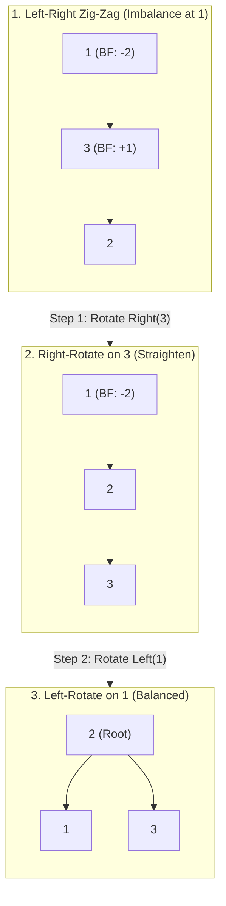

# 📘 WEEK 7 DAY 3: Balanced BSTs — AVL & Red-Black Trees — Engineering Guide

> 🧭 **Navigation:** [← Previous Day](Week_07_Day_02_Binary_Search_Trees_Instructional.md) • [🏠 Week Overview](README.md) • [📘 Curriculum Syllabus](../COMPLETE_SYLLABUS.md) • [Next Day →](Week_07_Day_04_Tree_Patterns_Instructional.md)
> 
> 💡 **Instructor Note:** *Not all sections or topics are mandatory. Feel free to adapt your pace and skim or skip sections based on your current focus and interview timeline.*

---

## 🎯 LEARNING OBJECTIVES

*By the end of this chapter, you will be able to:*

- 🎯 **Internalize** why tree self-balancing is mandatory to guarantee `O(log N)` upper bounds against adversarial or naturally sorted data.
- ⚙️ **Implement** AVL tree rotations—Left (RR), Right (LL), Left-Right (LR), and Right-Left (RL)—and height updates cleanly in C# and Python.
- ⚖️ **Evaluate** trade-offs between AVL trees (stricter balance factor `<= 1`, faster lookups) and Red-Black trees (looser balance, fewer rotations during mutations, preferred by production runtimes).
- 🏭 **Connect** self-balancing invariants to Linux kernel process scheduling (`rbtree`), C++ `std::map`, and database multi-way B-trees.

---

## 📖 CHAPTER 1: CONTEXT & MOTIVATION

### The Engineering Challenge

Yesterday we established that an unbalanced BST has an average-case search time of `O(log N)`, but its worst case degrades to `O(N)`. 

In production systems, this gap between average and worst case is hazardous:
- Consider a ride-sharing driver registry or database timestamp index where records arrive in chronological order (`timestamp1 < timestamp2 < timestamp3`).
- A standard BST turns into a 100,000-node linked list. Latency spikes from 17 CPU comparisons (`log2(100000)`) to 100,000 pointer chases per query. Under 10,000 requests/sec, the system collapses under thread pool exhaustion.
- An attacker can exploit this via Algorithmic Complexity Attacks (DoS), feeding sorted keys to force `O(N)` quadratic operations.

We cannot assume incoming data is uniformly randomized. The data structure itself must enforce an architectural guarantee: **the tree must dynamically rebalance itself upon every insertion and deletion**.

### The Solution: Self-Balancing Trees (AVL & Red-Black)

Self-balancing binary search trees maintain a strict height invariant through **tree rotations**—`O(1)` local pointer manipulations that restructure subtrees without violating the BST ordering invariant.

1. **AVL Trees (Adelson-Velsky and Landis, 1962):** Enforces strict height balance: for every node, the height difference between left and right subtrees (the **Balance Factor**) is at most 1.
2. **Red-Black Trees (Bayer, 1972 / Guibas & Sedgewick, 1978):** Enforces loose balance via node coloring rules, guaranteeing that the longest root-to-leaf path is no more than twice the length of the shortest path.

> [!TIP]
> **Core Insight:** A rotation is a localized pointer exchange taking `O(1)` time. By performing at most `O(log N)` rotations during insertion/deletion, we permanently buy guaranteed `O(log N)` lookup times.

---

## 🧠 CHAPTER 2: BUILDING THE MENTAL MODEL

### The Core Analogy

Think of a balanced BST as a **mechanical balance scale**:
- If weights are added to one pan until the arm tilts past tolerance, a mechanical escapement shifts the pivot point down one notch toward the heavier side.
- The items on the scale remain in the exact same left-to-right order, but the center of gravity is restored directly underneath the fulcrum.
- In tree terms: the pivot shift is a **rotation**, preserving BST order while reducing overall height.

### 🖼 Visualizing Rotations

#### Single Right Rotation (LL Case)
Triggered when a node becomes left-heavy (`Balance Factor > 1`) and its left child is also left-heavy (`left.BalanceFactor >= 0`):

```
       y                                x
      / \                              / \
     x   T3      ── Right-Rotate(y) ──>  T1   y
    / \                                      / \
   T1  T2                                   T2 T3

Ordering invariant strictly preserved: T1 < x < T2 < y < T3
```

#### Single Left Rotation (RR Case)
Triggered when a node becomes right-heavy (`Balance Factor < -1`) and its right child is right-heavy (`right.BalanceFactor <= 0`):

```
     x                                      y
    / \                                    / \
   T1  y         ── Left-Rotate(x) ──>    x   T3
      / \                                / \
     T2 T3                              T1 T2

Ordering invariant strictly preserved: T1 < x < T2 < y < T3
```

#### Double Rotations: Straightening the "Knee" (Zig-Zag)
A single rotation cannot fix a bent path. When inserting into the inner grandchild, we perform a double rotation:



### Invariants & Foundations

#### 1. AVL Height & Strict Balance Invariant
- **Height Calculation:** `Height(null) = 0`, `Height(node) = 1 + max(Height(node.left), Height(node.right))`.
- **Balance Factor (BF):** `BF(node) = Height(node.left) - Height(node.right)`.
- **AVL Invariant:** For every node in the tree, `BF(node) in {-1, 0, 1}`.
- **Height Bound:** For an AVL tree with `N` nodes, the maximum height `H` satisfies `H <= 1.44 * log2(N + 2)`. In practice, height closely tracks `1.01 * log2(N)`. Because the balance is so tight, lookup searches require fewer comparisons than in Red-Black trees.

#### 2. The 5 Core Red-Black Properties in Plain English
A Red-Black tree is a self-balancing binary search tree where each node carries an extra 1-bit color attribute (`Red` or `Black`). It balances the tree by strictly enforcing 5 fundamental rules:

1. **Property 1 (Color):** Every node is colored either **Red** or **Black**.
2. **Property 2 (Root):** The root of the entire tree is always **Black**.
   - *Plain English:* Anchors the tree so black-height calculations have a fixed baseline.
3. **Property 3 (Leaves):** Every leaf (`null` sentinel reference / NIL) is considered **Black**.
   - *Plain English:* Ensures every downward path terminates with a Black marker.
4. **Property 4 (Red-No-Red):** If a node is **Red**, both of its children must be **Black**. No two Red nodes can ever be directly adjacent on any root-to-leaf path.
   - *Plain English:* Places an upper limit on branch growth: you can never have two Red nodes in a row.
5. **Property 5 (Equal Black-Height):** Every simple path from any given node down to any of its descendant `null` leaves must contain the exact same number of Black nodes.
   - *Plain English:* Guarantees that every branch possesses identical "black weight."

#### The Golden Consequence: Why Red-Black Trees are Strictly `O(log N)`
Consider the shortest and longest possible paths from root to a leaf:
- **Shortest Path:** Composed entirely of Black nodes (`B` black nodes). Length = `B`.
- **Longest Path:** Alternates strictly between Red and Black nodes (Property 4 prevents consecutive Reds). To satisfy Property 5, it must contain exactly `B` black nodes, which are interleaved with at most `B` red nodes. Length <= `2B`.
- **Conclusion:** `Longest Path <= 2 * Shortest Path`. No branch can ever be more than twice as deep as any other branch. Therefore, tree height `H <= 2 * log2(N + 1)`, guaranteeing all search, insert, and delete operations execute in strictly `O(log N)` time!

### Taxonomy of Balanced Search Trees

| Data Structure | Balance Strictness | Rotations on Insert | Rotations on Delete | Primary Use Case |
| :--- | :--- | :---: | :---: | :--- |
| **AVL Tree** | `\|height(L) - height(R)\| <= 1` | At most 2 | `O(log N)` | Lookup-heavy read databases |
| **Red-Black Tree** | Longest path `<= 2 *` Shortest path | At most 2 | At most 3 | Mutation-heavy runtime libraries |
| **B-Tree / B+ Tree** | Multi-way branching (hundreds of keys/node) | Node splits | Node merges | Disk-based relational databases & file systems |
| **Treap** | Probabilistic balancing via heap priorities | `O(1)` expected | `O(1)` expected | Randomized sets, simpler concurrency |

---

## ⚙️ CHAPTER 3: MECHANICS & THE 4 ROTATION CASES

### 🔧 AVL Balance Factor & The 4 Rotation Cases

Whenever an insertion or deletion pushes a node's balance factor outside `{-1, 0, 1}`, exactly one of four rebalance operations is triggered:

---

#### Case 1: Left-Left (LL) Imbalance — Single Right Rotation
- **Trigger Condition:** `BF(node) > 1` and `BF(node.left) >= 0` (inserted into left subtree of left child).
- **Core Action:** Node `y` rotates down to become the right child of `x`. Subtree `T2` is reattached as `y`'s left child.

```
                  LL Case: Single Right Rotation on y
                  
         Before Rotation                                After Rotation
             [ y ] (BF: +2)                                 [ x ] (BF: 0)
            /     \                                        /     \
         [ x ]    T3          ── Right-Rotate(y) ──>     T1     [ y ] (BF: 0)
        /     \                                                 /     \
       T1     T2                                               T2     T3
     (T1 grew taller)
     
Invariant Preserved: T1 < x < T2 < y < T3
Code Mechanics:
  TreeNode x = y.left;
  y.left = x.right;      // T2 transfers to y
  x.right = y;           // y becomes right child of x
  UpdateHeight(y); UpdateHeight(x);
```

---

#### Case 2: Right-Right (RR) Imbalance — Single Left Rotation
- **Trigger Condition:** `BF(node) < -1` and `BF(node.right) <= 0` (inserted into right subtree of right child).
- **Core Action:** Node `x` rotates down to become the left child of `y`. Subtree `T2` is reattached as `x`'s right child.

```
                  RR Case: Single Left Rotation on x
                  
         Before Rotation                                After Rotation
             [ x ] (BF: -2)                                 [ y ] (BF: 0)
            /     \                                        /     \
           T1    [ y ]        ── Left-Rotate(x) ──>     [ x ]     T3
                /     \                                 /     \
               T2     T3                               T1     T2
                    (T3 grew taller)
                    
Invariant Preserved: T1 < x < T2 < y < T3
Code Mechanics:
  TreeNode y = x.right;
  x.right = y.left;      // T2 transfers to x
  y.left = x;            // x becomes left child of y
  UpdateHeight(x); UpdateHeight(y);
```

---

#### Case 3: Left-Right (LR) Imbalance — Double Rotation (Left then Right)
- **Trigger Condition:** `BF(node) > 1` and `BF(node.left) < 0` (inserted into inner grandchild `z` under `x.right`).
- **Core Action:** A single rotation cannot fix a bent path (knee). We first left-rotate child `x` into a straight line (LL case), then right-rotate node `y`.

```
                  LR Case: Double Rotation (Rotate Left x, Rotate Right y)
                  
  Step 1: Rotate Left on x (Straighten Knee)
            [ y ]                                         [ y ]
           /     \                                       /     \
        [ x ]    T4       ── Left-Rotate(x) ──>       [ z ]    T4
       /     \                                       /     \
      T1    [ z ]                                  [ x ]   T3
           /     \                                /     \
          T2     T3                              T1     T2

  Step 2: Rotate Right on y (Rebalance Top)
            [ y ]                                         [ z ]
           /     \                                      /       \
        [ z ]    T4       ── Right-Rotate(y) ──>     [ x ]     [ y ]
       /     \                                      /     \   /     \
     [ x ]   T3                                    T1     T2 T3     T4
     /   \
    T1   T2
    
Invariant Preserved: T1 < x < T2 < z < T3 < y < T4
Code Mechanics:
  node.left = RotateLeft(node.left);   // Straightens x-z-y knee into line
  return RotateRight(node);            // Restores AVL balance
```

---

#### Case 4: Right-Left (RL) Imbalance — Double Rotation (Right then Left)
- **Trigger Condition:** `BF(node) < -1` and `BF(node.right) > 0` (inserted into inner grandchild `z` under `y.left`).
- **Core Action:** First right-rotate child `y` into a straight line (RR case), then left-rotate node `x`.

```
                  RL Case: Double Rotation (Rotate Right y, Rotate Left x)
                  
  Step 1: Rotate Right on y (Straighten Knee)
          [ x ]                                          [ x ]
         /     \                                        /     \
        T1    [ y ]       ── Right-Rotate(y) ──>       T1    [ z ]
             /     \                                        /     \
          [ z ]    T4                                      T2    [ y ]
         /     \                                                /     \
        T2     T3                                              T3     T4

  Step 2: Rotate Left on x (Rebalance Top)
          [ x ]                                           [ z ]
         /     \                                        /       \
        T1    [ z ]       ── Left-Rotate(x) ──>      [ x ]     [ y ]
             /     \                                /     \   /     \
            T2    [ y ]                            T1     T2 T3     T4
                 /     \
                T3     T4
                
Invariant Preserved: T1 < x < T2 < z < T3 < y < T4
Code Mechanics:
  node.right = RotateRight(node.right); // Straightens x-z-y knee into line
  return RotateLeft(node);              // Restores AVL balance
```

---

### 🔧 Red-Black Tree Rotation & Recoloring Principles

When a new node `Z` is inserted into a Red-Black Tree:
1. **Always Insert as RED:** Inserting a Red node does not change the count of Black nodes on any path, preserving **Property 5 (Black-Height)** by default.
2. **If Parent `P` is Black:** We are done! Zero violations occur.
3. **If Parent `P` is Red:** We have a Red-Red violation (**Property 4**). Note: Because parent `P` is Red, grandparent `G` must exist and must be Black (by Property 4 before insertion).

To fix the Red-Red violation, we inspect the **Uncle `U`** (the sibling of parent `P`):

#### Case 1: Uncle `U` is RED — Pure Recoloring (Push Redness Upward)
When both parent `P` and uncle `U` are Red:
- **Action:** Flip colors!
  - Paint parent `P` -> **BLACK**
  - Paint uncle `U` -> **BLACK**
  - Paint grandparent `G` -> **RED**
- Move current pointer to grandparent: `Z = G`.
- Repeat the check up the tree. (At the very end, force root to Black to satisfy Property 2).
- **Zero Rotations Required!**

```
              Uncle is RED: Recoloring Only
              
      Before Recoloring:                        After Recoloring:
            [ G ] (Black)                             [ G ] (Red)  <-- Check G's parent
           /     \                                   /     \
     (Red)[ P ]   [ U ](Red)         ── Recoloring ──> (Blk)[ P ]   [ U ](Blk)
         /                                                 /
   (Red)[ Z ]                                        (Red)[ Z ]
```

#### Case 2: Uncle `U` is BLACK (or NIL) & `Z` is Inner Grandchild (Zig-Zag / Knee)
- **Action:** Rotate parent `P` in the opposite direction of `Z` to transform the bent knee into a straight line (transitions immediately into Case 3).

#### Case 3: Uncle `U` is BLACK (or NIL) & `Z` is Outer Grandchild (Straight Line)
- **Action:**
  1. Rotate Grandparent `G`.
  2. Swap colors: paint parent `P` -> **BLACK**, paint grandparent `G` -> **RED**.
- **Result:** The tree is now completely balanced and compliant with all 5 properties. Terminate immediately!

```
          Uncle is BLACK: Rotation + Recoloring (Line Case)
          
      Before Rotation:                          After Rotation + Color Swap:
            [ G ] (Black)                             [ P ] (Black)
           /     \                                   /     \
     (Red)[ P ]   [ U ](Black/NIL)  ── Rotate(G) ──> (Red)[ Z ]   [ G ] (Red)
         /                                                        /     \
   (Red)[ Z ]                                                   T2      [ U ](Black)
```

---

## 💻 CHAPTER 4: PRODUCTION-GRADE IMPLEMENTATIONS (C# & PYTHON)

### Problem 1: Complete Production-Grade AVL Tree

#### 🎙️ 45-Minute Interview Talk Track
> *"An AVL tree augments each node with a `height` field. When inserting a value, we follow standard BST recursive descent. On the unwind phase, we update the node's height as `1 + max(height(left), height(right))` and compute its balance factor. If the balance factor is greater than 1, the left subtree is too tall. We inspect the left child's balance factor: if it's non-negative, it's an LL case resolved by a single right rotation; if negative, it's an LR knee resolved by rotating left on the child first, then right on the parent. The right-heavy cases are symmetric. Every rotation updates heights in O(1) time, ensuring total insertion time remains strictly bounded by O(log N)."*

#### C# Primary Implementation (.NET 8/9 — Production AVL)
```csharp
using System;

public sealed class AVLNode
{
    public int val;
    public int height;
    public AVLNode? left;
    public AVLNode? right;

    public AVLNode(int val)
    {
        this.val = val;
        this.height = 1; // New leaf node starts with height 1
    }
}

public sealed class AVLTree
{
    public AVLNode? Root { get; private set; }

    public void Insert(int val)
    {
        Root = InsertNode(Root, val);
    }

    private AVLNode InsertNode(AVLNode? node, int val)
    {
        // Step 1: Standard BST recursive insertion
        if (node is null) return new AVLNode(val);

        if (val < node.val)
        {
            node.left = InsertNode(node.left, val);
        }
        else if (val > node.val)
        {
            node.right = InsertNode(node.right, val);
        }
        else
        {
            return node; // Duplicate keys ignored
        }

        // Step 2: Update height of current ancestor node
        node.height = 1 + Math.Max(GetHeight(node.left), GetHeight(node.right));

        // Step 3: Compute Balance Factor
        int balance = GetBalance(node);

        // Step 4: Handle 4 rebalance cases
        
        // Case 1: Left-Left (LL)
        if (balance > 1 && val < node.left!.val)
        {
            return RotateRight(node);
        }

        // Case 2: Right-Right (RR)
        if (balance < -1 && val > node.right!.val)
        {
            return RotateLeft(node);
        }

        // Case 3: Left-Right (LR)
        if (balance > 1 && val > node.left!.val)
        {
            node.left = RotateLeft(node.left);
            return RotateRight(node);
        }

        // Case 4: Right-Left (RL)
        if (balance < -1 && val < node.right!.val)
        {
            node.right = RotateRight(node.right);
            return RotateLeft(node);
        }

        return node;
    }

    private static int GetHeight(AVLNode? node) => node?.height ?? 0;

    private static int GetBalance(AVLNode? node) =>
        node is null ? 0 : GetHeight(node.left) - GetHeight(node.right);

    private static AVLNode RotateRight(AVLNode y)
    {
        AVLNode x = y.left!;
        AVLNode? T2 = x.right;

        // Perform rotation
        x.right = y;
        y.left = T2;

        // Update heights (y first, then x as x is new root)
        y.height = 1 + Math.Max(GetHeight(y.left), GetHeight(y.right));
        x.height = 1 + Math.Max(GetHeight(x.left), GetHeight(x.right));

        return x; // New root of rotated subtree
    }

    private static AVLNode RotateLeft(AVLNode x)
    {
        AVLNode y = x.right!;
        AVLNode? T2 = y.left;

        // Perform rotation
        y.left = x;
        x.right = T2;

        // Update heights (x first, then y)
        x.height = 1 + Math.Max(GetHeight(x.left), GetHeight(x.right));
        y.height = 1 + Math.Max(GetHeight(y.left), GetHeight(y.right));

        return y; // New root of rotated subtree
    }
}
```

#### Python Secondary Implementation (3.11+ — Idiomatic)
```python
from typing import Optional

class AVLNode:
    def __init__(self, val: int):
        self.val = val
        self.height: int = 1
        self.left: Optional['AVLNode'] = None
        self.right: Optional['AVLNode'] = None

class AVLTree:
    def __init__(self):
        self.root: Optional[AVLNode] = None

    def insert(self, val: int) -> None:
        self.root = self._insert(self.root, val)

    def _insert(self, node: Optional[AVLNode], val: int) -> AVLNode:
        if not node:
            return AVLNode(val)

        if val < node.val:
            node.left = self._insert(node.left, val)
        elif val > node.val:
            node.right = self._insert(node.right, val)
        else:
            return node

        node.height = 1 + max(self._get_height(node.left), self._get_height(node.right))
        balance = self._get_balance(node)

        # Case 1: Left-Left
        if balance > 1 and node.left and val < node.left.val:
            return self._rotate_right(node)

        # Case 2: Right-Right
        if balance < -1 and node.right and val > node.right.val:
            return self._rotate_left(node)

        # Case 3: Left-Right
        if balance > 1 and node.left and val > node.left.val:
            node.left = self._rotate_left(node.left)
            return self._rotate_right(node)

        # Case 4: Right-Left
        if balance < -1 and node.right and val < node.right.val:
            node.right = self._rotate_right(node.right)
            return self._rotate_left(node)

        return node

    def _get_height(self, node: Optional[AVLNode]) -> int:
        return node.height if node else 0

    def _get_balance(self, node: Optional[AVLNode]) -> int:
        return self._get_height(node.left) - self._get_height(node.right) if node else 0

    def _rotate_right(self, y: AVLNode) -> AVLNode:
        x = y.left
        assert x is not None
        T2 = x.right

        x.right = y
        y.left = T2

        y.height = 1 + max(self._get_height(y.left), self._get_height(y.right))
        x.height = 1 + max(self._get_height(x.left), self._get_height(x.right))
        return x

    def _rotate_left(self, x: AVLNode) -> AVLNode:
        y = x.right
        assert y is not None
        T2 = y.left

        y.left = x
        x.right = T2

        x.height = 1 + max(self._get_height(x.left), self._get_height(x.right))
        y.height = 1 + max(self._get_height(y.left), self._get_height(y.right))
        return y
```

#### 📊 Explicit Complexity Deconstruction
- **Time Complexity:** `O(log N)` — Insertion descends down a single path of height `<= 1.44 log2(N)`. Rotations and height recalculations require `O(1)` operations per ancestor.
- **Auxiliary Space:** `O(log N)` — Recursion stack depth strictly bounded by logarithmic tree height.
- **Output Space:** `O(1)` — Allocates exactly one `AVLNode`.

---

### Problem 2: Balanced Binary Tree Validation (LeetCode 110)

#### 🎙️ 45-Minute Interview Talk Track
> *"To verify if an arbitrary binary tree is height-balanced, a naive top-down approach computing tree depth for every node takes O(N^2) time. We optimize to O(N) using a bottom-up postorder DFS: our helper returns the true height of the subtree if it is balanced, or sentinel -1 as soon as any imbalance is detected. If either subtree returns -1 or their height difference exceeds 1, we immediately propagate -1 up the call stack, achieving early exit with zero duplicate traversals."*

#### C# Primary Implementation (.NET 8/9 — Bottom-Up DFS)
```csharp
public static class BalancedTreeChecker
{
    /// <summary>
    /// Checks if a binary tree is height-balanced in O(N) time.
    /// Time Complexity: O(N) | Auxiliary Space: O(H)
    /// </summary>
    public static bool IsBalanced(TreeNode? root)
    {
        return CheckHeight(root) != -1;

        static int CheckHeight(TreeNode? node)
        {
            if (node is null) return 0;

            int leftHeight = CheckHeight(node.left);
            if (leftHeight == -1) return -1; // Early exit: left unbalanced

            int rightHeight = CheckHeight(node.right);
            if (rightHeight == -1) return -1; // Early exit: right unbalanced

            if (Math.Abs(leftHeight - rightHeight) > 1)
            {
                return -1; // Imbalance at current node
            }

            return 1 + Math.Max(leftHeight, rightHeight);
        }
    }
}
```

#### Python Secondary Implementation (3.11+ — Idiomatic)
```python
def is_balanced(root: Optional[TreeNode]) -> bool:
    """Bottom-up verification of AVL height balance.
    
    Time Complexity: O(N) | Auxiliary Space: O(H)
    """
    def check_height(node: Optional[TreeNode]) -> int:
        if not node:
            return 0

        left_h = check_height(node.left)
        if left_h == -1:
            return -1

        right_h = check_height(node.right)
        if right_h == -1:
            return -1

        if abs(left_h - right_h) > 1:
            return -1

        return 1 + max(left_h, right_h)

    return check_height(root) != -1
```

#### 📊 Explicit Complexity Deconstruction
- **Time Complexity:** `O(N)` — Every node is visited once during postorder traversal; breaks early if any subtree is unbalanced.
- **Auxiliary Space:** `O(H)` — Call stack space bounded by tree height (`O(log N)` balanced, `O(N)` worst).
- **Output Space:** `O(1)` — Single boolean result.

---

## ⚖️ CHAPTER 5: PERFORMANCE, TRADE-OFFS & FAANG PATTERN SIGNALS

### AVL vs Red-Black Engineering Comparison

| Criterion | AVL Tree | Red-Black Tree |
| :--- | :--- | :--- |
| **Balance Rigidity** | Strict (`BF <= 1`) | Loose (`Path_max <= 2 * Path_min`) |
| **Average Search Height** | `~1.01 * log2(N)` | `~1.50 * log2(N)` |
| **Rotations per Insert** | `<= 2` | `<= 2` |
| **Rotations per Delete** | `O(log N)` | `<= 3` |
| **Metadata per Node** | Height integer (1 byte/int) | 1-bit color flag (can steal bit in pointer) |
| **Best Production Fit** | Read-heavy, static lookup sets | Write-heavy, dynamic key-value maps |

### 🏭 Real-World Systems Context

> [!NOTE]
> **Production Context — Language Standard Libraries (Java TreeMap & C++ std::map):** Standard language libraries choose Red-Black trees over AVL trees because deletion in Red-Black requires at most 3 rotations, whereas AVL deletion can trigger rotations all the way up to the root (`O(log N)`). For mutation-intensive workloads, Red-Black trees consistently deliver higher throughput.

> [!NOTE]
> **Production Context — Linux Kernel CFS Scheduler (`rbtree`):** The Completely Fair Scheduler (CFS) tracks runnable processes in a Red-Black tree keyed by `vruntime` (virtual runtime). The leftmost node represents the task most starved of CPU time. Finding the next process takes `O(1)` using a cached leftmost pointer, while inserting and updating runtimes runs in deterministic `O(log N)` without allocating heap memory.

> [!NOTE]
> **Production Context — Database Multi-Way B-Trees:** In storage engines (PostgreSQL, MySQL), nodes map directly to disk blocks. Binary tree rotations require rewriting multiple parent-child pointers across distinct disk pages. Relational databases therefore use B+ trees with branching factors of 100+ to guarantee shallow trees (3–4 levels) with localized node splits instead of rotations.

### Failure Modes & Edge Cases

| Failure Mode | Root Cause | Engineering Mitigation |
| :--- | :--- | :--- |
| **Stale Height Calculation** | Forgetting to update rotated child height before updating new root | Update rotated node `y.height` first, then new root `x.height` |
| **Incorrect Double Rotation** | Performing single rotation on a zig-zag knee imbalance | Check sign of child balance factor before choosing rotation |
| **Unwind Missing Re-link** | Not assigning rotation return value back to parent reference | Ensure `return RotateRight(node);` assigns to calling stack frame |

---

## ⚔️ SUPPLEMENTARY OUTCOMES

### 🏋️ Practice Problems

| # | Problem | Source | Difficulty | Target Pattern |
| :---: | :--- | :--- | :---: | :--- |
| 1 | Balanced Binary Tree | LeetCode #110 | 🟢 Easy | Bottom-up postorder height check |
| 2 | Convert Sorted Array to Binary Search Tree | LeetCode #108 | 🟢 Easy | Midpoint root construction |
| 3 | Convert Sorted List to Binary Search Tree | LeetCode #109 | 🟡 Medium | Fast/slow pointer or inorder simulation |
| 4 | Maximum Depth of Binary Tree | LeetCode #104 | 🟢 Easy | Postorder height calculation |
| 5 | Balance a Binary Search Tree | LeetCode #1382 | 🟡 Medium | Inorder extraction + median rebuild |
| 6 | My Calendar I | LeetCode #729 | 🟡 Medium | Interval booking via balanced BST |
| 7 | Count of Smaller Numbers After Self | LeetCode #315 | 🔴 Hard | Augmented BST / Fenwick tree |
| 8 | Data Stream as Disjoint Intervals | LeetCode #352 | 🔴 Hard | Interval merging in balanced map |

### 🎙️ Interview Questions & Follow-ups
1. **Q: Why does the Linux kernel implement Red-Black trees as an intrusive data structure?**
   - *Follow-up:* In `struct rb_node`, the node pointers are embedded directly inside the process descriptor struct (`task_struct`), eliminating separate memory allocations and cache misses.
2. **Q: If a tree has 1,000,000 nodes, what is the maximum depth difference between an AVL tree and a Red-Black tree?**
   - *Follow-up:* AVL maximum height is `~1.44 * log2(10^6) ≈ 28`, while Red-Black maximum height is `~2 * log2(10^6) ≈ 40`.

---

## 📊 COMPLEXITY RECAP

| Tree Structure | Search Time | Insert Time | Delete Time | Auxiliary Space | Rotations per Mutation |
| :--- | :---: | :---: | :---: | :---: | :---: |
| **Unbalanced BST** | `O(N)` | `O(N)` | `O(N)` | `O(H)` | `0` |
| **AVL Tree** | `O(log N)` | `O(log N)` | `O(log N)` | `O(log N)` | `<= 2` (Insert), `O(log N)` (Delete) |
| **Red-Black Tree** | `O(log N)` | `O(log N)` | `O(log N)` | `O(log N)` | `<= 2` (Insert), `<= 3` (Delete) |

---

> 🧭 **Navigation:** [← Previous Day](Week_07_Day_02_Binary_Search_Trees_Instructional.md) • [🏠 Week Overview](README.md) • [📘 Curriculum Syllabus](../COMPLETE_SYLLABUS.md) • [Next Day →](Week_07_Day_04_Tree_Patterns_Instructional.md)
