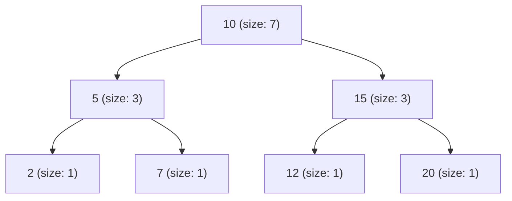

# 📘 WEEK 7 DAY 5: Augmented BSTs & Order-Statistics Trees — Engineering Guide

> 🧭 **Navigation:** [← Previous Day](Week_07_Day_04_Tree_Patterns_Instructional.md) • [🏠 Week Overview](README.md) • [📘 Curriculum Syllabus](../COMPLETE_SYLLABUS.md) • [Week Playbook →](WEEK_07_FULL_PLAYBOOK.md)
> 
> 💡 **Instructor Note:** *Not all sections or topics are mandatory. Feel free to adapt your pace and skim or skip sections based on your current focus and interview timeline.*

---

## 🎯 LEARNING OBJECTIVES

*By the end of this chapter, you will be able to:*

- 🎯 **Internalize** the augmentation principle: embedding localized subtree aggregates (such as `size` or `sum`) into nodes to enable logarithmic analytical queries.
- ⚙️ **Implement** an Order-Statistic Tree from scratch, executing `Select(k)` (find kth smallest) and `Rank(x)` (count elements `<= x`) in `O(log N)` time.
- ⚖️ **Evaluate** trade-offs between dynamic augmented trees (`O(log N)` updates + queries) versus static sorted arrays (`O(1)` select, `O(N)` insert) and Segment Trees.
- 🏭 **Connect** augmented BSTs to production systems: live gaming leaderboards, database multi-column range count indexes, and financial real-time percentile risk engines.

---

## 📖 CHAPTER 1: CONTEXT & MOTIVATION

### The Engineering Challenge

Standard search trees answer membership questions: *"Does key 42 exist?"* in `O(log N)` time.
However, analytical and financial systems frequently demand **rank-based and positional questions**:
- **Gaming Leaderboards:** *"Given my ELO score of 1850, what is my exact rank among 10 million players?"*
- **Streaming Analytics:** *"What is the current 99th percentile request latency?"*
- **Financial Compliance:** *"How many transactions occurred in the price window between 100 USD and 500 USD?"*

Let's examine how traditional structures fail to handle dynamic workloads:
1. **Sorted Array:** Lookups by rank (`k`-th smallest) are instant `O(1)` via index access, but inserting or updating a score forces shifting elements, taking `O(N)` time. Under 10,000 score updates per second, the system freezes.
2. **Hash Table:** Instant `O(1)` updates, but finding rank or percentiles requires scanning and sorting all `N` entries, costing `O(N log N)`.
3. **Standard BST:** Inserting takes `O(log N)`, but finding the `k`-th element requires an inorder traversal visiting `k` nodes—costing `O(N)` worst-case time.

We need a structure that supports both **logarithmic mutations** and **logarithmic rank/order queries**.

### The Solution: The Augmentation Principle

The solution is to **augment** the tree: store a summary aggregate at each node describing the subtree rooted at that node.

By storing `size` (the total count of nodes in the subtree) at every node:
```
node.size = 1 + size(node.left) + size(node.right)
```
we can determine in `O(1)` time how many elements are smaller than `node.val` simply by reading `node.left.size`. We can skip entire subtrees during queries without visiting individual descendant nodes.

> [!TIP]
> **The Augmentation Theorem (CLRS):** Any field `f` can be maintained at each node in `O(1)` time per rotation/update without increasing the asymptotic `O(log N)` cost of tree operations, provided `f(node)` depends **only** on `node.val` and the stored values of its immediate children `node.left` and `node.right`.

---

## 🧠 CHAPTER 2: BUILDING THE MENTAL MODEL

### The Core Analogy

Think of an Augmented BST as a **national census hierarchy**:
- Instead of counting 300 million citizens individually whenever a senator asks *"How many people live in regions with populations under threshold X?"*, every district office stores its local population total.
- The national government office holds the sum of all states; each state office holds the sum of its counties; each county holds the sum of its towns.
- When an official queries a boundary, they consult regional totals. If an entire state falls below the threshold, its precomputed total is added immediately—skipping millions of individual door-to-door checks.

### 🖼 Visualizing the Augmented Node & Tree Layout

```
Augmented Node Memory Structure:
+-------------------------------------------------------+
|                 OrderStatisticNode                    |
|  int val = 10                                         |
|  int size = 7  (= 1 + left.size + right.size)         |
|  Node? left  ──────────> [Node(val=5,  size=3)]       |
|  Node? right ──────────> [Node(val=15, size=3)]       |
+-------------------------------------------------------+
```



### Invariants & Mathematical Foundations

1. **Subtree Size Invariant:**
   `size(node) = 1 + (node.left ? node.left.size : 0) + (node.right ? node.right.size : 0)`.
   A leaf has `size = 1`. A null reference has `size = 0`.
2. **Rank Mechanics:** For any node `X`, the number of strictly smaller elements within its subtree is precisely `size(X.left)`.
3. **Range Count via Prefix Difference:**
   To count elements in range `[L, R]`:
   `CountInRange(L, R) = Rank(R) - Rank(L - 1)`.

### Taxonomy of Common Tree Augmentations

| Augmentation Field | Formula | Enabled Query | Query Time | Real-World Use Case |
| :--- | :--- | :--- | :---: | :--- |
| **Subtree Size** | `1 + left.size + right.size` | `Select(k)`, `Rank(x)` | `O(log N)` | Dynamic Leaderboards, Median Finding |
| **Subtree Sum** | `val + left.sum + right.sum` | Range Sum `[L, R]` | `O(log N)` | Dynamic Financial Balance Queries |
| **Subtree Max/Min** | `max(val, left.max, right.max)` | Range Extremum | `O(log N)` | Real-Time Latency Monitoring |
| **Subtree Interval Max** | `max(high, left.max, right.max)` | Interval Overlap Search | `O(log N)` | Calendar Booking, Memory Allocators |

---

## ⚙️ CHAPTER 3: MECHANICS & ORDER-STATISTIC OPERATIONS

### Canonical Augmented Tree for Operation Traces
To trace `Select` and `Rank`, we use this balanced 7-node Order-Statistic Tree (where each node shows `[ val (size) ]`):

```
                   [ 10 (sz:7) ]
                  /             \
           [ 5 (sz:3) ]     [ 15 (sz:3) ]
           /          \     /           \
     [ 2 (sz:1) ] [ 7 (sz:1) ] [ 12 (sz:1) ] [ 20 (sz:1) ]
```

Ascending key order: `[2, 5, 7, 10, 12, 15, 20]`.

---

### 🔧 Operation 1: `Select(k)` — Finding the k-th Smallest Element (1-Indexed)

`Select(node, k)` retrieves the element that would occupy index `k - 1` in the sorted array, executing in `O(H)` time without traversing intermediate elements.

```
Algorithm Select(node, k):
  leftSize = size(node.left)
  
  Case 1: k == leftSize + 1
    Current node IS the k-th smallest! Return node.val.
    
  Case 2: k <= leftSize
    The target lies within the left subtree.
    Recurse: Select(node.left, k).
    
  Case 3: k > leftSize + 1
    The target lies within the right subtree.
    Bypass leftSize + 1 elements already accounted for.
    Recurse: Select(node.right, k - leftSize - 1).
```

#### Step-by-Step Trace Table: `Select(k = 5)` on Canonical Tree
Target: Find the 5th smallest element (Expected Answer: `12`).

| Step | Current Node `curr` | `leftSize = size(curr.left)` | `pivotRank = leftSize + 1` | Comparison with `k` | Branch Decision & New `k` |
| :---: | :---: | :---: | :---: | :---: | :--- |
| **1** | `10 (sz:7)` | `size(5) = 3` | `3 + 1 = 4` | `k (5) > pivotRank (4)` | Case 3: Branch Right; new `k = 5 - 4 = 1` |
| **2** | `15 (sz:3)` | `size(12) = 1` | `1 + 1 = 2` | `k (1) <= leftSize (1)` | Case 2: Branch Left; `k` remains `1` |
| **3** | `12 (sz:1)` | `size(null) = 0`| `0 + 1 = 1` | `k (1) == pivotRank (1)` | Case 1: **Match found! Return 12** |

---

### 🔧 Operation 2: `Rank(x)` — Counting Elements `<= x`

`Rank(node, x)` computes how many items in the tree have keys less than or equal to `x`, executing in `O(H)` time.

```
Algorithm Rank(node, x):
  If node is null, return 0.
  
  Case 1: x == node.val
    Left subtree plus current node are all <= x.
    Return size(node.left) + 1.
    
  Case 2: x < node.val
    Target is smaller; all matching elements must reside in left subtree.
    Return Rank(node.left, x).
    
  Case 3: x > node.val
    All left subtree elements AND current node are strictly <= x.
    Accumulate (size(node.left) + 1) and explore right subtree:
    Return size(node.left) + 1 + Rank(node.right, x).
```

#### Step-by-Step Trace Table: `Rank(x = 12)` on Canonical Tree
Target: Count how many elements are `<= 12` (Expected Answer: `5` elements: `[2, 5, 7, 10, 12]`).

| Step | Current Node `curr` | `curr.val` | Comparison (`x vs curr.val`) | Accumulated Subtree Count | Next Action / Recursive Call |
| :---: | :---: | :---: | :---: | :---: | :--- |
| **1** | `10 (sz:7)` | `10` | `12 > 10` (Case 3) | `size(5) + 1 = 3 + 1 = 4` | Recurse Right: `Rank(15, 12)` |
| **2** | `15 (sz:3)` | `15` | `12 < 15` (Case 2) | `0` | Recurse Left: `Rank(12, 12)` |
| **3** | `12 (sz:1)` | `12` | `12 == 12` (Case 1) | `size(null) + 1 = 0 + 1 = 1` | Base match: Return `1` |
| **Unwind** | - | - | - | Total: `4 + 0 + 1 = 5` | **Final Rank: 5** |

---

### 🔧 Operation 3: Subtree Size Maintenance Across Mutations

Augmenting trees with subtree sizes requires strict maintenance invariants:

#### 1. Insertion Maintenance
During recursive descent, when a new leaf is attached, its size is initialized to `1`. As the recursive call stack unwinds from the leaf back up to the root, every ancestor's size is recomputed:
```
node.size = 1 + GetSize(node.left) + GetSize(node.right)
```

#### 2. Deletion Maintenance
When a node is deleted, the returned replacement reference is attached, and each ancestor's size is recomputed during the unwind phase using the exact same formula.

#### 3. Maintenance During Rotations
Tree balancing rotations (AVL or Red-Black) rewire parent-child relationships. Subtree sizes must be recalculated in strict **bottom-up dependency order**:

```
        y (size: A + B + C + 2)                   x (size: A + B + C + 2)
       / \                                       / \
      x   C       ── Rotate Right(y) ──>        A   y (size: B + C + 1)
     / \                                           / \
    A   B                                         B   C

Recalculate order is CRUCIAL:
  1. y.size = 1 + GetSize(y.left) + GetSize(y.right)   <-- Update demoted child y FIRST!
  2. x.size = 1 + GetSize(x.left) + GetSize(x.right)   <-- Update promoted parent x SECOND!
```

---

## 💻 CHAPTER 4: PRODUCTION-GRADE IMPLEMENTATIONS (C# & PYTHON)

### Problem 1: Kth Smallest Element in a BST (LeetCode 230)

#### 🎙️ 45-Minute Interview Talk Track
> *"On a standard BST without augmentation, the inorder traversal visits elements in ascending sorted order. To find the k-th smallest element, we do not need to collect all N elements into an array. We perform an iterative inorder traversal with an explicit stack: we drill down leftmost, and each time we pop a node, we decrement k. The moment k reaches zero, the current popped node is precisely the k-th smallest element. This achieves early termination in O(H + k) time and O(H) auxiliary space, bypassing the remaining N - k nodes completely."*

#### C# Primary Implementation (.NET 8/9 — Early Exit Inorder)
```csharp
public static class KthSmallestSolver
{
    /// <summary>
    /// Finds the k-th smallest element in a BST using iterative inorder traversal.
    /// Time Complexity: O(H + k) | Auxiliary Space: O(H)
    /// </summary>
    public static int KthSmallest(TreeNode? root, int k)
    {
        var stack = new Stack<TreeNode>();
        TreeNode? current = root;

        while (current is not null || stack.Count > 0)
        {
            while (current is not null)
            {
                stack.Push(current);
                current = current.left;
            }

            current = stack.Pop();
            k--;

            if (k == 0)
            {
                return current.val; // Early exit
            }

            current = current.right;
        }

        throw new ArgumentException("k is larger than the number of nodes in the tree.");
    }
}
```

#### Python Secondary Implementation (3.11+ — Idiomatic)
```python
def kth_smallest(root: Optional[TreeNode], k: int) -> int:
    """Finds the k-th smallest element in a BST with early exit.
    
    Time Complexity: O(H + k) | Auxiliary Space: O(H)
    """
    stack: list[TreeNode] = []
    current = root

    while current or stack:
        while current:
            stack.append(current)
            current = current.left

        current = stack.pop()
        k -= 1
        if k == 0:
            return current.val

        current = current.right

    raise ValueError("k exceeds tree node count")
```

#### 📊 Explicit Complexity Deconstruction
- **Time Complexity:** `O(H + k)` — Reaching the minimum node takes `O(H)` time; popping `k` items takes `O(k)` steps.
- **Auxiliary Space:** `O(H)` — Stack depth strictly bounded by tree height.
- **Output Space:** `O(1)` — Returns single integer value.

---

### Problem 2: Full Production-Grade Order-Statistic Tree (Augmented BST)

#### 🎙️ 45-Minute Interview Talk Track
> *"When frequent rank queries and mutations occur simultaneously, the unaugmented O(H + k) traversal is too slow. We augment each tree node with a `size` field representing the count of nodes in its subtree. When inserting a new value, as the recursion unwinds, we update each ancestor's size as `1 + size(left) + size(right)`. To find the k-th smallest element, we compare k with the left subtree size: if k matches `left.size + 1`, current node is our answer; if k is smaller, we descend left; if larger, we descend right while subtracting `left.size + 1` from k. Both insert, select, and rank queries execute in optimal O(H) time."*

#### C# Primary Implementation (.NET 8/9 — Production Order-Statistic Tree)
```csharp
using System;

public sealed class OrderStatisticNode
{
    public int val;
    public int size;
    public OrderStatisticNode? left;
    public OrderStatisticNode? right;

    public OrderStatisticNode(int val)
    {
        this.val = val;
        this.size = 1;
    }
}

public sealed class OrderStatisticTree
{
    public OrderStatisticNode? Root { get; private set; }

    /// <summary>
    /// Inserts a value while maintaining the subtree size invariant.
    /// Time Complexity: O(H) | Auxiliary Space: O(H)
    /// </summary>
    public void Insert(int val)
    {
        Root = InsertNode(Root, val);
    }

    private OrderStatisticNode InsertNode(OrderStatisticNode? node, int val)
    {
        if (node is null) return new OrderStatisticNode(val);

        if (val < node.val)
        {
            node.left = InsertNode(node.left, val);
        }
        else if (val > node.val)
        {
            node.right = InsertNode(node.right, val);
        }
        else
        {
            return node; // Ignore duplicate keys
        }

        // Maintain invariant: size = 1 + left.size + right.size
        node.size = 1 + GetSize(node.left) + GetSize(node.right);
        return node;
    }

    /// <summary>
    /// Finds the 1-indexed k-th smallest element.
    /// Time Complexity: O(H) | Auxiliary Space: O(H)
    /// </summary>
    public int Select(int k)
    {
        if (Root is null || k < 1 || k > Root.size)
        {
            throw new ArgumentOutOfRangeException(nameof(k), "k is out of tree bounds.");
        }

        return SelectNode(Root, k);
    }

    private static int SelectNode(OrderStatisticNode node, int k)
    {
        int leftSize = GetSize(node.left);

        if (k == leftSize + 1)
        {
            return node.val;
        }

        if (k <= leftSize)
        {
            return SelectNode(node.left!, k);
        }

        return SelectNode(node.right!, k - leftSize - 1);
    }

    /// <summary>
    /// Computes the rank of val: count of elements <= val.
    /// Time Complexity: O(H) | Auxiliary Space: O(H)
    /// </summary>
    public int Rank(int val)
    {
        return RankNode(Root, val);
    }

    private static int RankNode(OrderStatisticNode? node, int val)
    {
        if (node is null) return 0;

        if (val == node.val)
        {
            return GetSize(node.left) + 1;
        }

        if (val < node.val)
        {
            return RankNode(node.left, val);
        }

        return GetSize(node.left) + 1 + RankNode(node.right, val);
    }

    /// <summary>
    /// Counts elements in the range [low, high].
    /// Time Complexity: O(H) | Auxiliary Space: O(H)
    /// </summary>
    public int CountInRange(int low, int high)
    {
        if (low > high) return 0;
        return Rank(high) - Rank(low - 1);
    }

    private static int GetSize(OrderStatisticNode? node) => node?.size ?? 0;
}
```

#### Python Secondary Implementation (3.11+ — Idiomatic)
```python
from typing import Optional

class OrderStatisticNode:
    def __init__(self, val: int):
        self.val = val
        self.size: int = 1
        self.left: Optional['OrderStatisticNode'] = None
        self.right: Optional['OrderStatisticNode'] = None

class OrderStatisticTree:
    def __init__(self):
        self.root: Optional[OrderStatisticNode] = None

    def insert(self, val: int) -> None:
        self.root = self._insert(self.root, val)

    def _insert(self, node: Optional[OrderStatisticNode], val: int) -> OrderStatisticNode:
        if not node:
            return OrderStatisticNode(val)

        if val < node.val:
            node.left = self._insert(node.left, val)
        elif val > node.val:
            node.right = self._insert(node.right, val)
        else:
            return node

        node.size = 1 + self._get_size(node.left) + self._get_size(node.right)
        return node

    def select(self, k: int) -> int:
        if not self.root or k < 1 or k > self.root.size:
            raise IndexError("k out of valid bounds")
        return self._select(self.root, k)

    def _select(self, node: OrderStatisticNode, k: int) -> int:
        left_size = self._get_size(node.left)

        if k == left_size + 1:
            return node.val
        if k <= left_size:
            assert node.left is not None
            return self._select(node.left, k)

        assert node.right is not None
        return self._select(node.right, k - left_size - 1)

    def rank(self, val: int) -> int:
        return self._rank(self.root, val)

    def _rank(self, node: Optional[OrderStatisticNode], val: int) -> int:
        if not node:
            return 0

        if val == node.val:
            return self._get_size(node.left) + 1
        if val < node.val:
            return self._rank(node.left, val)

        return self._get_size(node.left) + 1 + self._rank(node.right, val)

    def count_in_range(self, low: int, high: int) -> int:
        if low > high:
            return 0
        return self.rank(high) - self.rank(low - 1)

    def _get_size(self, node: Optional[OrderStatisticNode]) -> int:
        return node.size if node else 0
```

#### 📊 Explicit Complexity Deconstruction
- **Time Complexity:**
  - `Insert(val)`: `O(H)` — Standard path descent followed by `O(1)` size additions per ancestor.
  - `Select(k)`: `O(H)` — Descends one branch per step by comparing `k` against `left.size`.
  - `Rank(val)`: `O(H)` — Descends one branch per step, accumulating subtree sizes.
  - `CountInRange(low, high)`: `O(H)` — Exactly two rank queries: `O(H) + O(H) = O(H)`.
- **Auxiliary Space:** `O(H)` — Recursion stack depth bounded by tree height (`O(log N)` if balanced).
- **Output Space:** `O(1)` — Direct integer return.

---

## ⚖️ CHAPTER 5: PERFORMANCE, TRADE-OFFS & FAANG PATTERN SIGNALS

### ⚖️ Comprehensive Data Structure Comparison Matrix

Understanding how Augmented Order-Statistic Trees compare against both fundamental data structures and balanced search trees is vital for high-performance system design:

| Data Structure | Search Key (Avg / Worst) | Insert / Delete (Avg / Worst) | `Select(k)` (k-th element) | `Rank(x)` (Count `<= x`) | Range Query `[L, R]` | Memory Overhead | Cache Locality |
| :--- | :---: | :---: | :---: | :---: | :---: | :--- | :--- |
| **Unsorted Dynamic Array** | `O(N) / O(N)` | `O(1)* / O(N)` | `O(N)` (Quickselect) | `O(N)` | `O(N)` | Lowest (contiguous) | Outstanding (L1/L2) |
| **Sorted Dynamic Array** | `O(log N) / O(log N)` | `O(N) / O(N)` | `O(1)` (direct index) | `O(log N)` (bsearch) | `O(log N + K)` | Lowest (contiguous) | Outstanding (L1/L2) |
| **Singly Linked List** | `O(N) / O(N)` | `O(1) / O(1)` (at head) | `O(k)` | `O(N)` | `O(N)` | Low (1 pointer/node) | Poor (pointer chasing) |
| **Hash Table (Chaining)** | `O(1)* / O(N)` | `O(1)* / O(N)` | `O(N log N)` (sort all) | `O(N)` | `O(N)` | High (buckets + entries) | Poor (pointer chasing) |
| **Unbalanced BST** | `O(log N) / O(N)` | `O(log N) / O(N)` | `O(H + k)` (inorder) | `O(N)` | `O(H + K)` | Medium (2 pointers/node) | Poor (scattered heap) |
| **AVL Tree (Strict Balance)**| `O(log N) / O(log N)`| `O(log N) / O(log N)` | `O(log N + k)` | `O(N)` | `O(log N + K)` | Medium (2 ptrs + height) | Poor (scattered heap) |
| **Red-Black Tree (Relaxed)** | `O(log N) / O(log N)`| `O(log N) / O(log N)` | `O(log N + k)` | `O(N)` | `O(log N + K)` | Medium (2 ptrs + 1 bit) | Poor (scattered heap) |
| **Augmented OST (Balanced)** | `O(log N) / O(log N)`| `O(log N) / O(log N)` | `O(log N)` | `O(log N)` | `O(log N + K)` | Medium (2 ptrs + size) | Poor (scattered heap) |

*\* Denotes amortized time complexity.*

### 🎯 Specialized Order-Statistic & Prefix Query Trade-Off Matrix

When your primary workload demands dynamic rank queries, quantile filtering, or running medians:

| Data Structure | `Select(k)` | `Rank(x)` | `Insert(x)` | `RangeCount` | Memory Footprint | Ideal Scenario |
| :--- | :---: | :---: | :---: | :---: | :--- | :--- |
| **Sorted Dynamic Array** | `O(1)` | `O(log N)` | `O(N)` | `O(log N)` | Lowest (dense buffer) | Read-heavy or write-once datasets |
| **Standard Unaugmented BST** | `O(H + k)` | `O(N)` | `O(H)` | `O(N)` | Medium (2 pointers/node) | Simple trees with rare rank queries |
| **Augmented OST (Balanced)** | `O(log N)` | `O(log N)` | `O(log N)` | `O(log N)` | Medium (2 pointers + size) | Dynamic leaderboards, live quantiles |
| **Fenwick Tree (BIT)** | `O(log M)` | `O(log M)` | `O(log M)` | `O(log M)` | Low (fixed array of universe `M`) | Bounded universe, high cache affinity |
| **Segment Tree** | `O(log M)` | `O(log M)` | `O(log M)` | `O(log M)` | High (`4M` array slots) | Range min/max combined with rank |

### 🏭 Real-World Systems Context

> [!NOTE]
> **Production Context — Gaming Leaderboards & Tier Placement:** In multiplayer games (Valorant, League of Legends), millions of player ratings fluctuate continuously. Storing ratings in an augmented balanced BST allows players to see their exact leaderboard rank (`Rank(rating)`) and percentile tier (`Select(k)`) in sub-millisecond `O(log N)` time under massive concurrent update loads.

> [!NOTE]
> **Production Context — Database Multi-Column Range Indexes:** Relational query planners utilize augmented B-Tree statistics to estimate query selectivity. Queries like `SELECT COUNT(*) WHERE age BETWEEN 25 AND 35` use B-Tree page counts to estimate row counts in `O(log N)` time, enabling the optimizer to decide between index scans and table scans without scanning rows.

> [!NOTE]
> **Production Context — Financial Real-Time Risk Analytics:** Quantitative trading platforms calculate Value-at-Risk (VaR) by tracking the 95th and 99th percentile loss across real-time order streams. Augmented order-statistic trees provide instant percentile extraction (`Select(0.95 * TotalTrades)`) without sorting full event buffers.

### Failure Modes & Edge Cases

| Failure Mode | Root Cause | Engineering Mitigation |
| :--- | :--- | :--- |
| **Stale Subtree Size After Mutation** | Forgetting to update ancestor sizes during recursive unwind | Recalculate `node.size = 1 + left.size + right.size` at every returning step |
| **Rotation Invariant Desync** | Rotating nodes without recomputing their sizes bottom-up | Recalculate the demoted child's size first, then the promoted root's size |
| **1-Index vs 0-Index Mismatch** | Confusion over whether `Select` treats minimum node as index `0` or `1` | Define and test boundary contract explicitly (`k == 1` is smallest) |
| **Range Query Boundary Error** | Using `Rank(high) - Rank(low)` instead of `Rank(high) - Rank(low - 1)` | Elements with value equal to `low` must be included; subtract `Rank(low - 1)` |

---

## ⚔️ SUPPLEMENTARY OUTCOMES

### 🏋️ Practice Problems

| # | Problem | Source | Difficulty | Target Pattern |
| :---: | :--- | :--- | :---: | :--- |
| 1 | Kth Smallest Element in a BST | LeetCode #230 | 🟡 Medium | Inorder early termination |
| 2 | Count of Smaller Numbers After Self | LeetCode #315 | 🔴 Hard | Augmented BST insertion / Fenwick |
| 3 | Reverse Pairs | LeetCode #493 | 🔴 Hard | Dynamic rank counting |
| 4 | Range Sum of BST | LeetCode #938 | 🟢 Easy | Subtree pruning search |
| 5 | Find Median from Data Stream | LeetCode #295 | 🔴 Hard | Two heaps / Order-statistic tree |
| 6 | My Calendar Three | LeetCode #732 | 🔴 Hard | Boundary count sweep line in BST |
| 7 | Create Sorted Array through Instructions | LeetCode #1649 | 🔴 Hard | Cost computation via `Rank(x)` |
| 8 | Online Majority Element In Subarray | LeetCode #1157 | 🔴 Hard | Range frequency / Segment tree |

### 🎙️ Interview Questions & Follow-ups
1. **Q: How does the GNU C++ PBDS (`policy_based_data_structures`) `tree` support order statistics?**
   - *Follow-up:* In GCC libstdc++, `__gnu_pbds::tree` supports `tree_order_statistics_node_update`, augmenting an underlying Red-Black tree with subtree sizes to provide `find_by_order(k)` and `order_of_key(x)` in `O(log N)` time out-of-the-box.
2. **Q: When would you choose a Fenwick Tree (Binary Indexed Tree) over an Augmented BST for order statistics?**
   - *Follow-up:* If the universe of values `M` is bounded (e.g., coordinates `<= 10^5` or coordinates coordinate-compressed), a Fenwick tree has much smaller memory overhead, zero pointer chasing, and superior CPU cache locality compared to pointer-based trees.

---

## 📊 COMPLEXITY RECAP

| Method | Target Goal | Time Complexity | Auxiliary Space | Key Mechanics |
| :--- | :--- | :---: | :---: | :--- |
| **Inorder Early Exit** | Unaugmented `k`-th smallest | `O(H + k)` | `O(H)` | Iterative stack decrementing `k` |
| **Augmented `Select(k)`** | `k`-th smallest | `O(H)` | `O(H)` | Branch based on `k <= left.size` |
| **Augmented `Rank(val)`** | Count `<= val` | `O(H)` | `O(H)` | Accumulate `left.size + 1` going right |
| **`CountInRange(L, R)`** | Range query | `O(H)` | `O(H)` | Prefix difference: `Rank(R) - Rank(L - 1)` |

---

> 🧭 **Navigation:** [← Previous Day](Week_07_Day_04_Tree_Patterns_Instructional.md) • [🏠 Week Overview](README.md) • [📘 Curriculum Syllabus](../COMPLETE_SYLLABUS.md) • [Week Playbook →](WEEK_07_FULL_PLAYBOOK.md)
