# 📊 WEEK 7: Trees & Balanced Search Trees — Visual Hybrid Support Guide

> 🧭 **Navigation:** [🏠 Week Overview](README.md) • [📘 Curriculum Syllabus](../COMPLETE_SYLLABUS.md)
> 
> 💡 **Instructor Note:** *This Visual Playbook provides a high-density, integrated synthesis. Not all sections are mandatory; use it as a modular reference to solidify invariants and review pattern transitions.*

---

**Purpose:** Unified visual reference spanning all five instructional files

---

## 📋 TABLE OF CONTENTS

1. **Visual Overview — Week 7 Architecture**
2. **Day 1: Tree Anatomy & Traversals — Visual Concepts**
3. **Day 2: Binary Search Trees — Visual Concepts**
4. **Day 3: Balanced Trees — Visual Concepts**
5. **Day 4: Tree Patterns — Visual Concepts**
6. **Day 5: Augmented Trees — Visual Concepts**
7. **Cross-Day Visual Comparisons**
8. **Memory Layout Diagrams**
9. **Complexity & Performance Visualizations**
10. **Interview Visual Reference**

---

## 1️⃣ VISUAL OVERVIEW — WEEK 7 ARCHITECTURE

### The Tree Evolution Diagram


### 📌 🌲 General Hierarchical Tree

- **🌿 Binary Tree (At Most 2 Children)**
  - **⚖️ Binary Search Tree (Left &lt; Root &lt; Right)**
    - 🛡️ Balanced BST: AVL Tree (Height Invariant |Δh| <= 1)
    - 🔴⚫ Balanced BST: Red-Black Tree (O(log N) Guarantee)
- 📚 Multiway Trees: Tries & B-Trees


### Week 7 Conceptual Layers


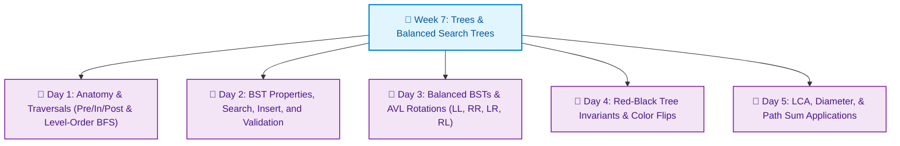


---

## 2️⃣ DAY 1: TREE ANATOMY & TRAVERSALS — VISUAL CONCEPTS

### Tree Structure Types at a Glance

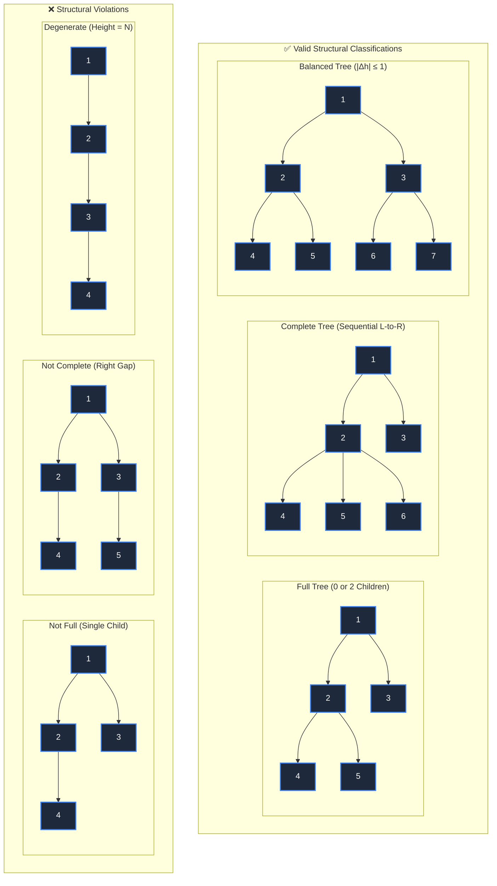

### All 4 Traversal Orders — Visual Mapping

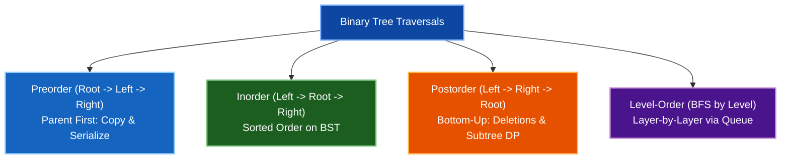

### Recursion Call Stack Visualization (Preorder)

### 📌 preorder(A)

- print A
- **preorder(B)**
  - print B
  - **preorder(D)**
    - print D
  - **preorder(E)**
    - print E
- **preorder(C)**
  - print C


### Iterative Traversal Using Explicit Stack

```
ITERATIVE PREORDER (using stack):

Stack: [A]       -> Pop A, print A, push right C, push left B
Stack: [C, B]    -> Pop B, print B, push right E, push left D
Stack: [C, E, D] -> Pop D, print D
Stack: [C, E]    -> Pop E, print E
Stack: [C]       -> Pop C, print C
Stack: []        -> Done

Output: A, B, D, E, C  (matches recursive order)
```

### Tree Anatomy Measurements

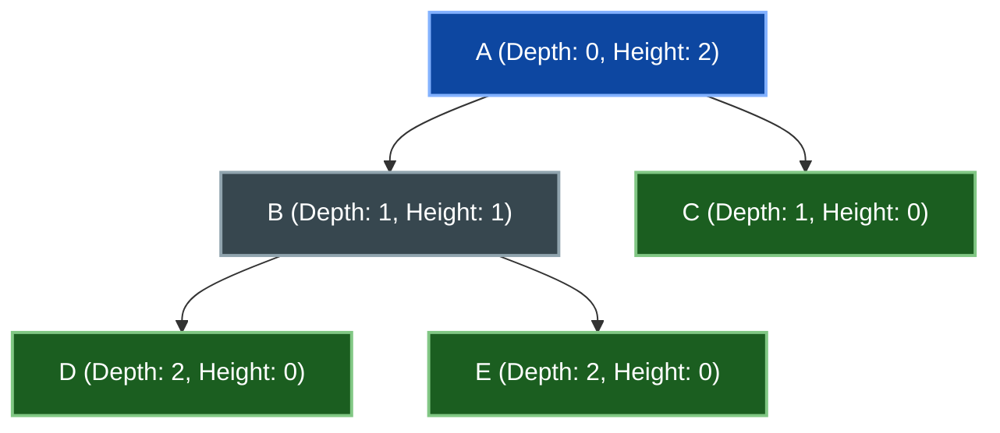

- **Height Calculation (bottom-up):**
  - `height(D) = 0`, `height(E) = 0`, `height(C) = 0` (leaves)
  - `height(B) = 1 + max(0, 0) = 1`
  - `height(A) = 1 + max(1, 0) = 2`
- **Depth Calculation (top-down):**
  - `depth(A) = 0` (root)
  - `depth(B) = 1`, `depth(C) = 1`
  - `depth(D) = 2`, `depth(E) = 2`

---

## 3️⃣ DAY 2: BINARY SEARCH TREES — VISUAL CONCEPTS

### BST Invariant — The Core Property

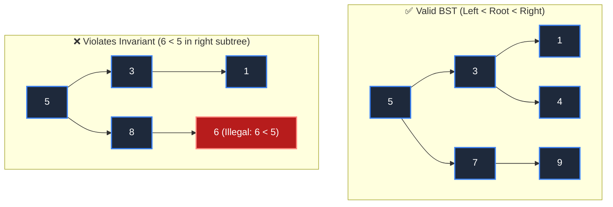

### BST Search Visualization

Searching for target key `6`:

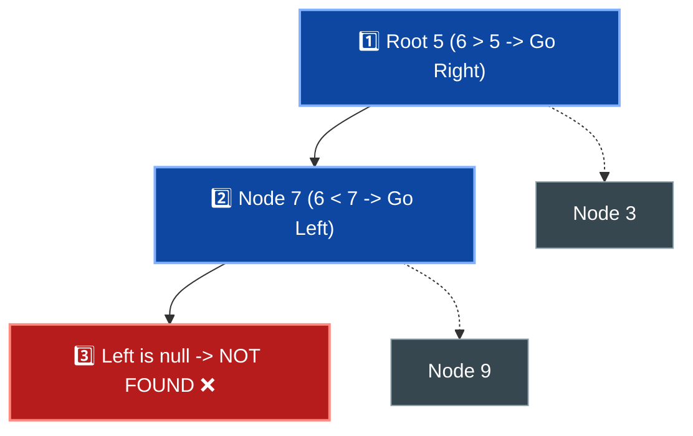

- **Search Path:** `5 -> 7 -> null`
- **Time Complexity:** `O(height)` (`O(log N)` average, `O(N)` worst case).

### BST Insertion Mechanics

Inserting key `6` into tree:

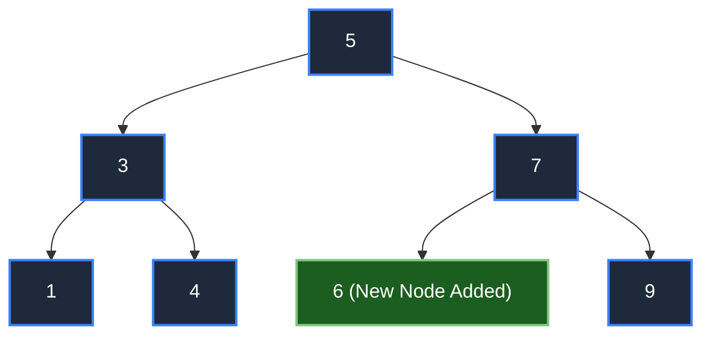

- **Insertion Steps:**
  1. Compare `6` with `5` (`6 > 5` -> go right to `7`).
  2. Compare `6` with `7` (`6 < 7` -> go left to `null`).
  3. Attach `6` as the left child of `7`.

### BST Deletion Cases

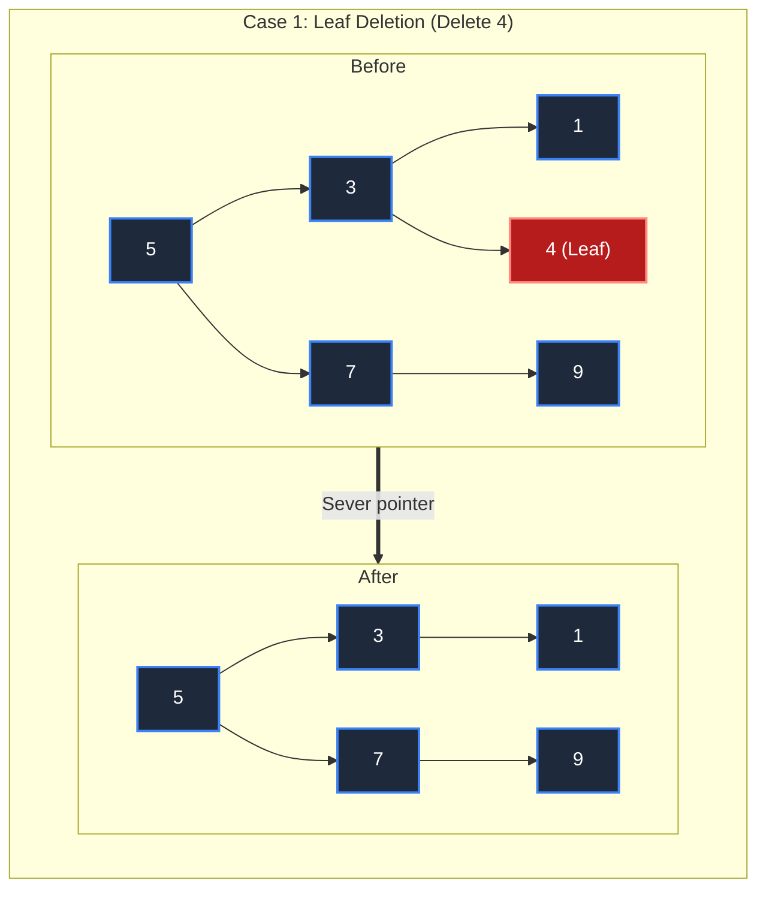

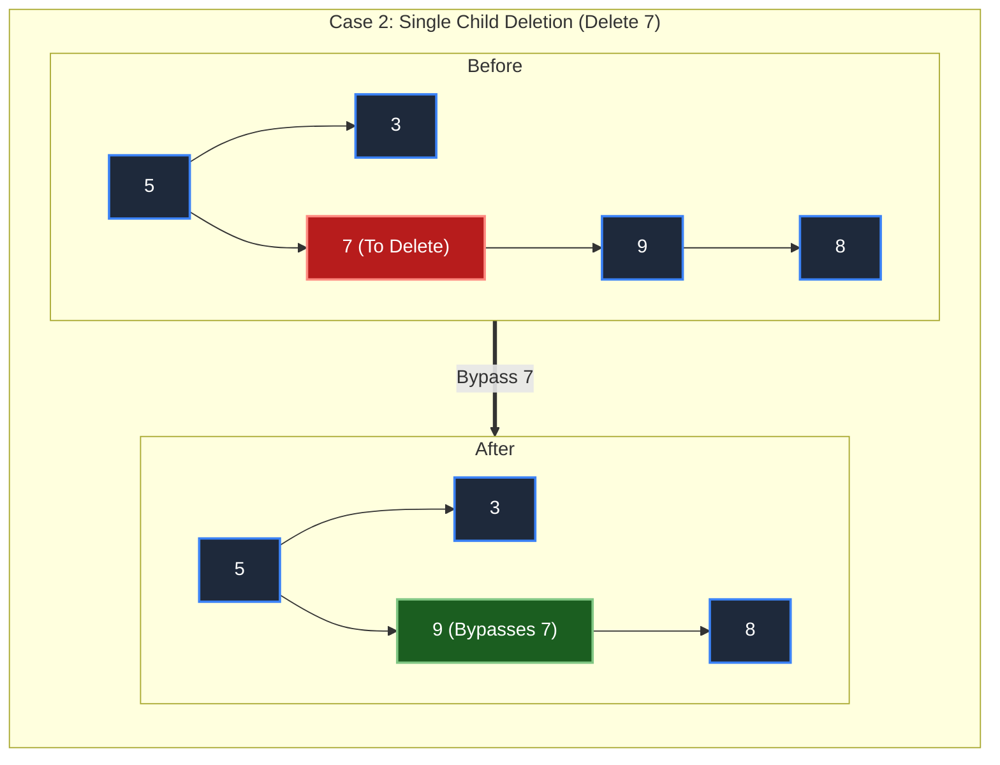

### Inorder Traversal = Sorted Order (Proof)

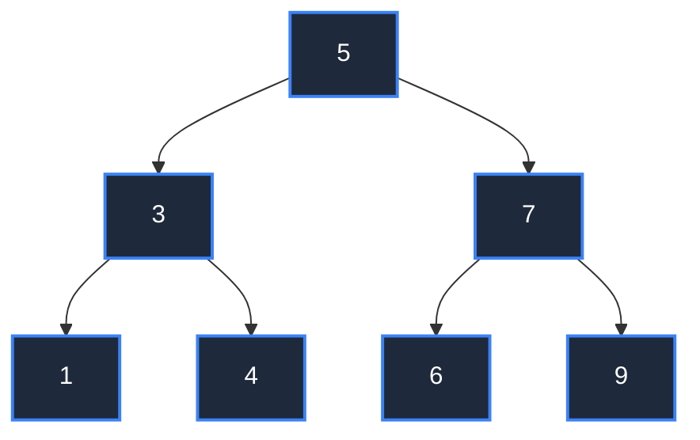

- **Inorder Visit Order:** `[1] -> [3] -> [4] -> [5] -> [6] -> [7] -> [9]`
- **Invariant Guarantee:** Left subtree (`< root`) -> Root -> Right subtree (`> root`) strictly preserves ascending numerical order.

### Degenerate Tree (Sorted Input)

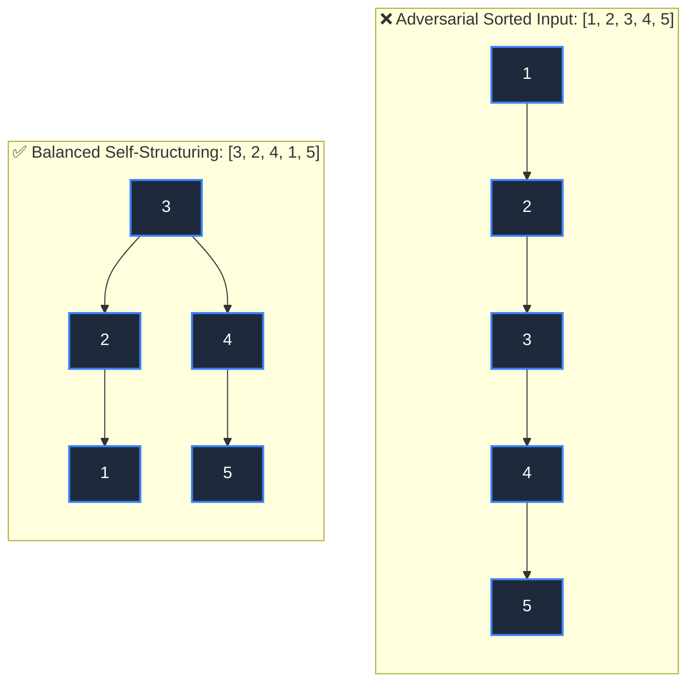

- **Unbalanced Height:** `5` (Degrades to linked list, `O(N)` search).
- **Balanced Height:** `2` (`O(log N)` search).

---

## 4️⃣ DAY 3: BALANCED TREES — VISUAL CONCEPTS

### AVL Balance Factor Calculation

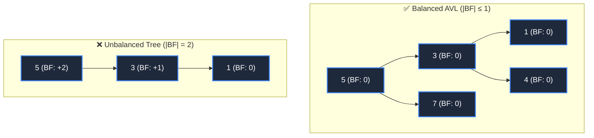

- **Balance Factor Formula:** `BF(node) = height(left) - height(right)`.
- **AVL Invariant:** Every node must strictly satisfy `BF ∈ {-1, 0, +1}`.

### AVL Rotations — 4 Cases Visualized

```mermaid
flowchart TD
    subgraph LL["Case 1: LL Imbalance -> Single Right Rotate"]
        LL_B1["1 (BF: +2)"] --> LL_B2["2 (BF: +1)"]
        LL_B2 --> LL_B3["3 (BF: 0)"]
        LL_B1 -.->|"Rotate Right(1)"| LL_A2["2 (BF: 0)"]
        LL_A2 --> LL_A3["3"]
        LL_A2 --> LL_A1["1"]
    end

    subgraph RR["Case 2: RR Imbalance -> Single Left Rotate"]
        RR_B5["5 (BF: -2)"] --> RR_B4["4 (BF: -1)"]
        RR_B4 --> RR_B3["3 (BF: 0)"]
        RR_B5 -.->|"Rotate Left(5)"| RR_A4["4 (BF: 0)"]
        RR_A4 --> RR_A5["5"]
        RR_A4 --> RR_A3["3"]
    end

    subgraph LR["Case 3: LR Imbalance -> Double Rotate"]
        LR_B1["1 (BF: +2)"] --> LR_B3["3 (BF: -1)"]
        LR_B3 --> LR_B2["2 (BF: 0)"]
        LR_B1 -.->|"1. Left(3)<br/>2. Right(1)"| LR_A2["2 (BF: 0)"]
        LR_A2 --> LR_A3["3"]
        LR_A2 --> LR_A1["1"]
    end

    subgraph RL["Case 4: RL Imbalance -> Double Rotate"]
        RL_B5["5 (BF: -2)"] --> RL_B3["3 (BF: +1)"]
        RL_B3 --> RL_B4["4 (BF: 0)"]
        RL_B5 -.->|"1. Right(3)<br/>2. Left(5)"| RL_A4["4 (BF: 0)"]
        RL_A4 --> RL_A5["5"]
        RL_A4 --> RL_A3["3"]
    end

    classDef default fill:#1e293b,stroke:#3b82f6,stroke-width:2px,color:#ffffff
```

### Red-Black Tree Coloring Rules

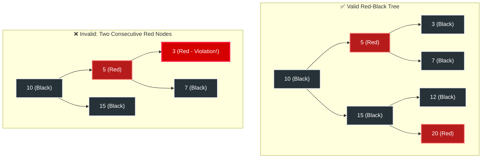

**The 5 Red-Black Invariants:**
1. Every node is colored either **Red** or **Black**.
2. The root node is always **Black**.
3. All leaf `null` pointers are considered **Black**.
4. No two consecutive **Red** nodes are permitted (a red node's children must both be black).
5. Every path from any node to its descendant `null` pointers contains an identical count of black nodes (**Black-Height Property**).

### Black-Height Property

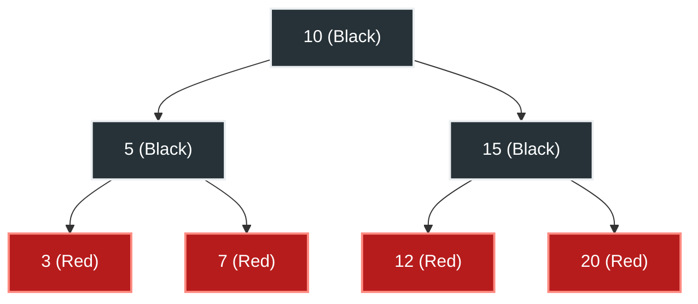

- **Path Verification to Leaves:**
  - `10 -> 5 -> 3 -> null`: 2 black nodes (`10`, `5`)
  - `10 -> 5 -> 7 -> null`: 2 black nodes (`10`, `5`)
  - `10 -> 15 -> 12 -> null`: 2 black nodes (`10`, `15`)
  - `10 -> 15 -> 20 -> null`: 2 black nodes (`10`, `15`)
- **Conclusion:** Black-height invariant is universally satisfied (`bh = 2`). Strict `O(log N)` search depth is guaranteed!

### AVL vs Red-Black Trade-offs


| Property | AVL | Red-Black |
| :--- | :--- | :--- |
| Height | ~1.0×log₂(n) | ~1.5×log₂(n) |
| Balance | Strict ±1 | Loose (colors) |
| Rotations/ins | ~1 avg | ~1 avg (fewer) |
| Worst case | ~2 rotations | ~3 rotations |
| Lookup speed | Faster (tighter) | Slightly slower |
| Insert speed | Slower (rotate) | Faster |
| Production use | Rare (LLVM) | Common (Java) |


---

## 5️⃣ DAY 4: TREE PATTERNS — VISUAL CONCEPTS

### Path Sum Visualization

Finding all root-to-leaf paths that sum to target `7`:

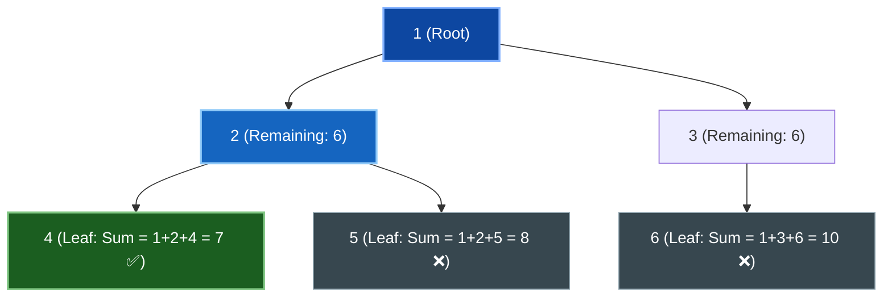

- **Candidate Path `1 -> 2 -> 4`:** Sum is `1 + 2 + 4 = 7` (Matches target, valid result).
- **Candidate Path `1 -> 2 -> 5`:** Sum is `8 != 7` (Pruned).
- **Candidate Path `1 -> 3`:** Not a leaf or sum does not match.

### Tree Diameter — Longest Path

Longest distance between any two leaf nodes:

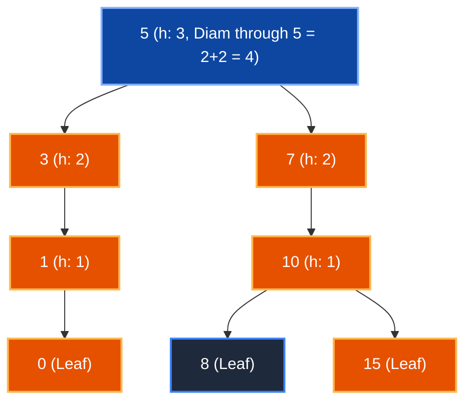

- **Longest Path:** `0 -> 1 -> 3 -> 5 -> 7 -> 10 -> 15`
- **Edges:** `6` edges (7 nodes).
- **Recurrence:** `diameter(node) = max(diam(left), diam(right), height(left) + height(right))`.

### Lowest Common Ancestor (LCA) — Visual Path

Find `LCA(1, 10)`:

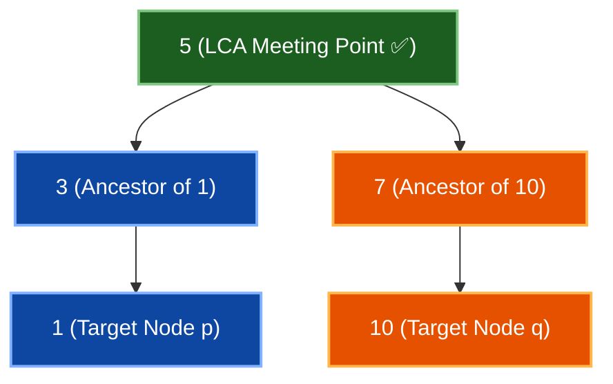

- **Left DFS Path:** Returns node `1` up through `3` to `5`.
- **Right DFS Path:** Returns node `10` up through `7` to `5`.
- **Meeting Point:** Both left and right recursive calls return non-null at root `5` -> `5` is the Lowest Common Ancestor!

### Serialization — Preorder with Null Markers

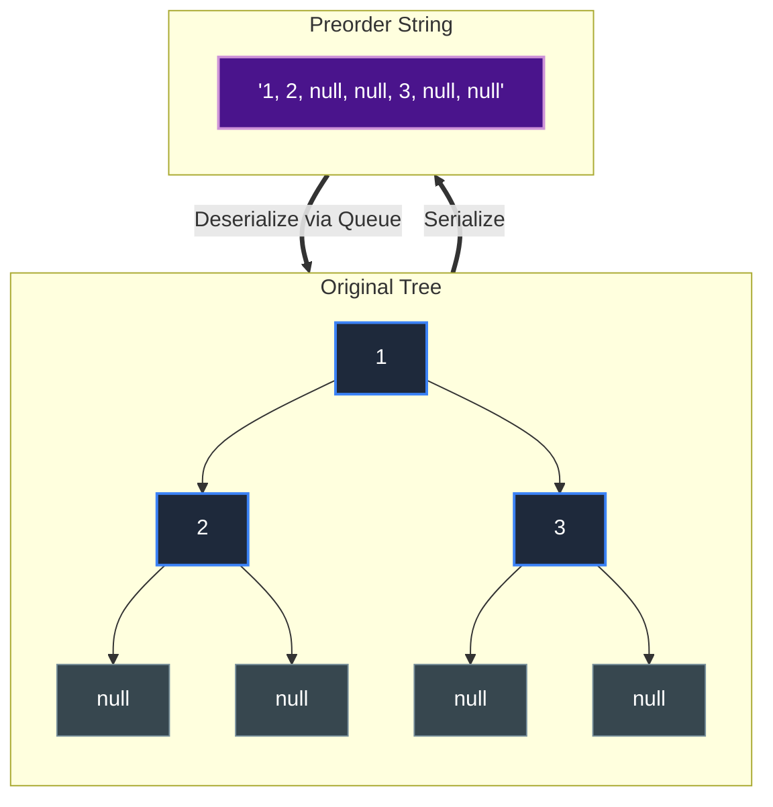

---

## 6️⃣ DAY 5: AUGMENTED TREES — VISUAL CONCEPTS

### Augmentation with Subtree Size

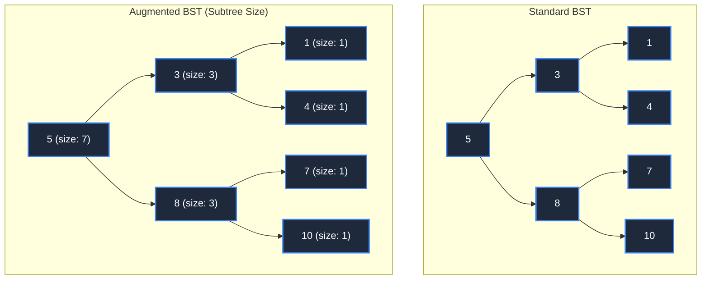

- **Subtree Size Formula:** `size(node) = 1 + size(node.left) + size(node.right)`.
- **Capabilities Unlocked:**
  - `k`-th smallest element search in `O(log N)`.
  - Rank queries (`count(x <= target)`) in `O(log N)`.
  - Range counting (`count(L <= x <= R)`) in `O(log N)`.

### Order-Statistics Query — Finding kth Smallest

Find `3`-rd smallest element (`k = 3`) in augmented tree:

```mermaid
flowchart TD
    Q5["1️⃣ Root 5 (size: 7)<br/>leftSize(3) = 3 >= k(3) -> Go Left"]:::stepNode --> Q3["2️⃣ Node 3 (size: 3)<br/>leftSize(1) = 1 &lt; k(3) -> Go Right with k'=3-1-1=1"]:::stepNode
    Q3 --> Q4["3️⃣ Node 4 (size: 1)<br/>leftSize(0) + 1 == k'(1) -> Found! ✅"]:::foundNode
    Q3 -.-> Q1["Node 1 (size: 1)"]

    classDef stepNode fill:#0d47a1,stroke:#82b1ff,stroke-width:2px,color:#ffffff
    classDef foundNode fill:#1b5e20,stroke:#81c784,stroke-width:2px,color:#ffffff
    classDef default fill:#37474f,stroke:#90a4ae,stroke-width:1px,color:#ffffff
```

- **Result:** `3rd` smallest element is `4`. Time complexity: `O(log N)`.

### Rank Query — How Many Elements ≤ X

Find the rank of `6` (count of keys `<= 6`):

```mermaid
flowchart TD
    R5["1️⃣ Node 5: 6 > 5 -> Go Right<br/>Accumulate leftSize + 1 = 3 + 1 = 4"]:::accNode --> R8["2️⃣ Node 8: 6 &lt; 8 -> Go Left<br/>No accumulation"]:::stepNode
    R8 --> R7["3️⃣ Node 7: 6 &lt; 7 -> Go Left<br/>Left is null -> Terminate"]:::stepNode

    classDef accNode fill:#1b5e20,stroke:#81c784,stroke-width:2px,color:#ffffff
    classDef stepNode fill:#0d47a1,stroke:#82b1ff,stroke-width:2px,color:#ffffff
```

- **Total Elements `<= 6`:** `4` (`{1, 3, 4, 5}`).

### Range Count [L, R]

```
Count values in [4, 8]:

rank(8) = 6 (nodes ≤ 8: 1, 3, 4, 5, 7, 8)
rank(3) = 2 (nodes ≤ 3: 1, 3)

Count in [4, 8] = rank(8) - rank(3) = 6 - 2 = 4
Actually in range: 4, 5, 7, 8 ✓
```

### Augmentation Maintenance During Insertion

```mermaid
flowchart TD
    subgraph BeforeInsert["Before: Root size = 7"]
        direction TB
        B5["5 (size: 7)"] --> B3["3 (size: 3)"]
        B5 --> B8["8 (size: 3)"]
        B8 --> B7["7 (size: 1)"]
        B8 --> B10["10 (size: 1)"]
    end

    subgraph AfterInsert["After: Insert 6 (Ancestors Updated)"]
        direction TB
        A5["5 (size: 8 ⬆️)"]:::updateNode --> A3["3 (size: 3)"]
        A5 --> A8["8 (size: 4 ⬆️)"]:::updateNode
        A8 --> A7["7 (size: 2 ⬆️)"]:::updateNode
        A8 --> A10["10 (size: 1)"]
        A7 --> A6["6 (size: 1 🆕)"]:::newNode
    end

    BeforeInsert ==>|"Insert 6 and Increment Ancestors"| AfterInsert

    classDef updateNode fill:#1565c0,stroke:#90caf9,stroke-width:2px,color:#ffffff
    classDef newNode fill:#1b5e20,stroke:#81c784,stroke-width:2px,color:#ffffff
    classDef default fill:#1e293b,stroke:#3b82f6,stroke-width:2px,color:#ffffff
```

- **Update Mechanism:** Bottom-up backpropagation adds `+1` to every ancestor along the insertion path from newly created leaf to root in `O(log N)` time.

---

## 7️⃣ CROSS-DAY VISUAL COMPARISONS

### Comparison: All 5 Tree Variants

| Tree Variant | Structural Invariant | Search Time | Insertion Time | Optimal Use Case |
| :--- | :--- | :--- | :--- | :--- |
| **Generic Tree** | Acyclic connected graph | `O(N)` | `O(1)` | Hierarchies, DOM, ASTs |
| **BST** | Left < Node < Right | `O(height)` | `O(height)` | Basic dictionary lookups |
| **AVL Tree** | Strict `\|BF\| <= 1` | `O(log N)` | `O(log N)` | Read-heavy lookups |
| **Red-Black Tree** | 5 color rules, `bh` equality | `O(log N)` | `O(log N)` | Production standard collections |
| **Augmented BST** | Subtree metadata caches | `O(log N)` | `O(log N)` | Order statistics, rank, range |

### Comparison: Insertion Scenarios

```mermaid
flowchart TD
    subgraph RandomOrder["Random Input: [1, 5, 3, 8, 2] (Naturally Balanced)"]
        R5["5"] --> R3["3"]
        R5 --> R8["8"]
        R3 --> R1["1"]
        R1 --> R2["2"]
    end

    subgraph SortedOrder["Sorted Input: [1, 2, 3, 4, 5] (Balanced via Rotations)"]
        S3["3"] --> S2["2"]
        S3 --> S4["4"]
        S2 --> S1["1"]
        S4 --> S5["5"]
    end

    classDef default fill:#1e293b,stroke:#3b82f6,stroke-width:2px,color:#ffffff
```

---

## 8️⃣ MEMORY LAYOUT DIAGRAMS

### Pointer-Based Heap Tree vs Array-Based Segment Tree

| Feature | Pointer-Based Heap Tree | Array-Based Segment / Binary Heap |
| :--- | :--- | :--- |
| **Storage Allocation** | Scattered heap allocations (`malloc`/`new`) | Contiguous 1D buffer (`T[]`) |
| **Pointer Overhead** | 16–24 bytes per node (`left`, `right`, `parent`) | **0 bytes** (implicit index arithmetic) |
| **Child Navigation** | `node.left`, `node.right` | `2 * i`, `2 * i + 1` |
| **CPU Cache Locality** | Poor (pointer chasing causes L1/L2 cache misses) | Excellent (sequential cache lines preloaded) |

---

## 9️⃣ COMPLEXITY & PERFORMANCE VISUALIZATIONS

### Big-O Complexity Matrix

| Operation | Generic Binary Tree | Unbalanced BST | AVL Tree | Red-Black Tree | Augmented Order-Stat BST |
| :--- | :--- | :--- | :--- | :--- | :--- |
| **Search** | `O(N)` | `O(N)` worst / `O(log N)` avg | `O(log N)` | `O(log N)` | `O(log N)` |
| **Insert** | `O(N)` | `O(N)` worst / `O(log N)` avg | `O(log N)` | `O(log N)` | `O(log N)` |
| **Delete** | `O(N)` | `O(N)` worst / `O(log N)` avg | `O(log N)` | `O(log N)` | `O(log N)` |
| **K-th Smallest** | `O(N)` | `O(N)` | `O(N)` | `O(N)` | **`O(log N)`** |
| **Rank Query** | `O(N)` | `O(N)` | `O(N)` | `O(N)` | **`O(log N)`** |

---

## 🔟 INTERVIEW VISUAL REFERENCE

### Red Flags & Problem Patterns

| Interview Trigger Phrase | Algorithmic Pattern | Visual Mental Hook |
| :--- | :--- | :--- |
| *"Find k-th smallest element dynamically"* | Augmented BST with subtree sizes | Subtree size counting binary search down left/right |
| *"Find rank or percentile of key"* | Order Statistics Augmented Tree | Accumulate `leftSize + 1` when navigating right |
| *"Serialize and deserialize binary tree"* | Preorder DFS with null sentinels | Root first + `null` markers for reconstructing uniquely |
| *"Lowest common ancestor"* | 3-Way recursive postorder / binary lifting | Left and right recursive calls both return non-null |
| *"Longest path between any two nodes"* | Postorder DFS subtree diameter | Pass `(height, maxDiameter)` bottom-up |
| *"Find all root-to-leaf paths summing to K"* | DFS with backtracking | Push node to path list, recurse, backtrack by popping |

### Common Interview Bugs to Avoid

> [!WARNING]
> 1. **Omitting `null` markers in serialization:** A single traversal without `null` sentinels cannot uniquely reconstruct a general binary tree.
> 2. **Forgetting to update subtree sizes after rotations:** If you perform AVL/Red-Black rotations on an augmented tree, you must recalculate `size` on the old sub-root and new sub-root!
> 3. **Rank query off-by-one errors:** When branching right, always include `leftSize + 1` (accounting for the current node itself).
> 4. **Degenerating to `O(N)` on sorted inputs:** Mention self-balancing properties (Red-Black / AVL) when an interviewer asks about worst-case inputs.

### Core Algorithmic Mechanics

```mermaid
flowchart TD
    subgraph LeftRotate["Left Rotate around x"]
        direction TB
        LX["x"] --> LY["y"]
        LY --> LB["b"]
        LY --> LC["c"]
    end
    subgraph RightRotate["After Left Rotate"]
        direction TB
        RY["y"] --> RX["x"]
        RY --> RC["c"]
        RX --> RB["b"]
    end
    LeftRotate ==>|"O(1) pointer updates"| RightRotate

    classDef default fill:#1e293b,stroke:#3b82f6,stroke-width:2px,color:#ffffff
```

---

## 📚 VISUAL ENCODING GUIDE

### Modern Visual Standards

- **Node Fills:** High-contrast dark backgrounds (`fill:#1e293b`) with clear borders (`stroke:#3b82f6`) and white text (`color:#ffffff`).
- **Success/Valid States:** Forest green fills (`fill:#1b5e20`, `stroke:#81c784`).
- **Violations/Errors:** Crimson red fills (`fill:#b71c1c`, `stroke:#ff8a80`).
- **Focus/Steps:** Deep sapphire blue fills (`fill:#0d47a1`, `stroke:#82b1ff`).
- **Labels:** Explicitly double-quoted strings preventing syntax collisions.


### Color/Emphasis Scheme

```
Algorithm steps:
  STEP 1 → STEP 2 → ... ← progression
  
Comparison:
  Table with columns | Cell highlighting key differences
  
Warnings:
  ⚠️  Important / Easy to miss
  
Facts:
  ✓ Proven / Verified
  
Complexity:
  O(log n) ← asymptotic notation
```

---

## 📋 VISUAL QUICK REFERENCE TABLE

### All Diagrams by Topic

| Day | Topic | Diagram Type | Count | Key Visual |
| :--- | :--- | :--- | :--- | :--- |
| 1 | Traversals | Tree structures + paths | 4 | All 4 orders side-by-side |
| 1 | Stack traces | Call stack visualization | 2 | Recursive vs iterative |
| 2 | BST operations | Before/after diagrams | 4 | Insert, delete (3 cases) |
| 2 | Inorder = sorted | Visual proof | 1 | Left-parent-right mapping |
| 3 | Rotations | LL, LR, RR, RL cases | 4 | All 4 rotation types |
| 3 | Balance factors | Node annotations | 2 | AVL height differences |
| 3 | RB coloring | Color diagrams | 2 | Valid/invalid colorings |
| 4 | Path sum | Root-to-leaf paths | 2 | All paths enumerated |
| 4 | LCA | Ancestor path traces | 2 | Path meeting point |
| 4 | Serialization | Array encoding | 2 | Preorder with nulls |
| 5 | Augmentation | Size annotations | 3 | Subtree size calculation |
| 5 | Order-stats | Binary search trace | 2 | kth smallest navigation |
| 5 | Rank queries | Ancestor accumulation | 2 | How many ≤ x |
| **Total** | | | **38** | |

---

## 🎓 USING THIS VISUAL GUIDE

### For Self-Study
1. Read the instructional file (narrative text)
2. Consult this visual guide when concepts feel abstract
3. Redraw diagrams yourself to internalize structure
4. Try "visual debugging" when tracing algorithms

### For Interview Preparation
1. Mentally convert problem description to tree visualization
2. Sketch the tree as you talk through the solution
3. Use these visual patterns to recognize problem types
4. Practice explaining using diagrams, not just code

### For Teaching/Mentoring
1. Use diagrams to explain key concepts clearly
2. Have students redraw diagrams from memory
3. Use visual comparisons to highlight trade-offs
4. Point to specific visual patterns for red flags

---

**End of Week 7 Visual Hybrid Support Guide**

**Diagram Count: 38 ASCII diagrams + descriptions**  
**Coverage:** All 5 days, all major concepts, comparison tables, memory layouts, complexity analysis

---

> 🧭 **Navigation:** [🏠 Week Overview](README.md) • [📘 Curriculum Syllabus](../COMPLETE_SYLLABUS.md)
