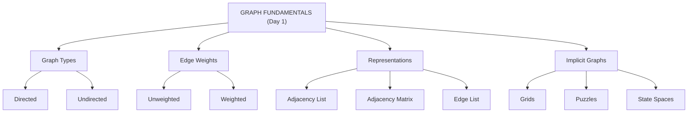
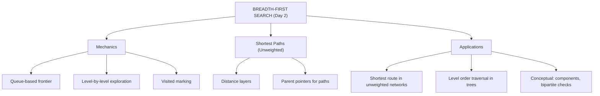
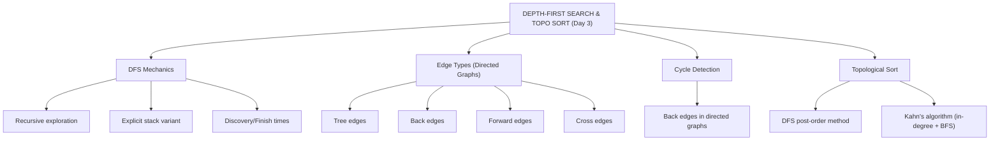
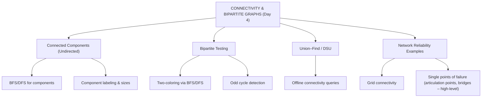
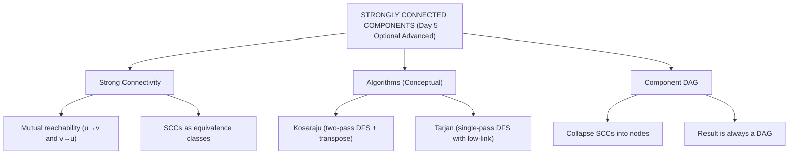
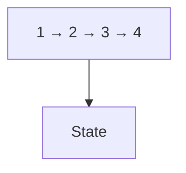

# 🌐 Week 08 Full Playbook – Graph Fundamentals: Representations, BFS, DFS & Topological Sort

> 🧭 **Navigation:** [🏠 Week Overview](README.md) • [📘 Curriculum Syllabus](../COMPLETE_SYLLABUS_v13.md)
> 
> 💡 **Instructor Note:** *This Comprehensive Playbook provides a high-density, integrated synthesis. Not all sections are mandatory; use it as a modular reference to solidify invariants and review pattern transitions.*

---

**Filename:** `WEEK_08_FULL_PLAYBOOK.md`  
**Phase:** C – Trees, Graphs & Dynamic Programming  
**Primary Goal:** Build strong intuition for graph models and basic traversals (BFS & DFS), including topological sort, connectivity, and SCC structure.

---

## 🧭 How to Use This Playbook

This playbook is your **week-long companion** for mastering graph fundamentals.

Use it in three modes:

1. **🚀 Quick Revision (30–45 minutes)**  
   - Skim the **Day headers** and **Concept Family Trees**.  
   - Look at each ASCII **diagram** to reactivate mental images.  
   - Answer the **quiz questions** mentally without writing code.

2. **📚 Deep Learning (3–4 hours)**  
   - For each day, read the **real-world problem** and **visual sections**.  
   - Trace every ASCII diagram with a finger, and re-draw it once.  
   - Write your own examples of graphs (social networks, grids, workflows).  
   - Optionally implement the key algorithms in **C#** after you fully understand them.

3. **🎯 Interview Prep (60–90 minutes)**  
   - Read the **failure modes** to avoid common traps.  
   - Use the **quiz questions** to simulate interview-style discussion.  
   - Practice explaining BFS, DFS, topological sort, connectivity, and SCCs out loud using the diagrams.

> Guiding Principle: **First build intuition, then write code.** Only after you can explain a concept in plain language should you look at the C# snippets.

---

## 🧩 Week 08 Overview – The Story of Graphs

This week answers four big questions about graphs:

1. **How do we represent real problems as graphs efficiently?** (Day 1)  
2. **How do we explore graphs layer by layer and find shortest paths when all edges are equal?** (Day 2 – BFS)  
3. **How do we explore deeply, classify edges, detect cycles, and order tasks?** (Day 3 – DFS & Topological Sort)  
4. **How do we understand global structure: components, bipartite structure, and mutual dependencies?** (Days 4 & 5)

The progression:

```
Real Problem → Graph Model → Representation → Traversal → Structure

Day 1: Models & Representations
Day 2: BFS  (breadth-wise exploration)
Day 3: DFS  (depth-wise exploration) + Topological Sort
Day 4: Connectivity & Bipartite Graphs (undirected structure)
Day 5: Strongly Connected Components (directed structure)
```

Everything later in the course—shortest paths, MSTs, advanced DP—assumes you are fluent in these ideas.

---

## 📅 Day 1 – Graph Models & Representations

### 1.1 Concept Family Tree 🌳





### 1.2 Real-World Engineering Problem 🎛️

You are designing a path-finding service for a ride-hailing app in a large city:

- Intersections are **nodes**.  
- Roads between intersections are **edges**.  
- Roads may be one-way or two-way → **directed vs undirected**.  
- Travel times differ → **weighted edges**.

The same backend also powers:

- **Estimating ETAs** for users (weighted shortest paths).  
- **Detecting isolated regions** during road closures (connectivity).  
- **Precomputing popular routes** (graph structure patterns).

If you choose a bad representation:

- Memory blows up (storing an adjacency matrix for millions of nodes).  
- Traversals become slow (scanning entire matrices instead of neighbor lists).  
- Code becomes fragile and hard to change.

Day 1 is about **choosing the right graph representation** for the scale and sparsity of your problem.

### 1.3 Visual: Graph Types & Edge Weights 🔀

```text
Undirected vs Directed vs Weighted

Undirected:                 Directed:                 Directed Weighted:

   A ----- B                  A → B                     A --5→ B
                                                        ↓2
                                                        C

- Undirected: edges have no direction (A-B == B-A).
- Directed: edges have direction (A→B different from B→A).
- Weighted: edges carry costs (time, distance, capacity).
```

Key mental model:

- Use **undirected** when relationships are symmetric (friendships, undirected roads).  
- Use **directed** when there is flow or dependency (follows, calls, imports).  
- Add **weights** when costs matter (latency, distance, risk).

### 1.4 Visual: Three Core Representations 🧱

Consider this small undirected graph:

```text
0 -- 1
|  / |
| /  |
2 -- 3
```

**Adjacency List** (good for sparse graphs):

```text
0: [1, 2]
1: [0, 2, 3]
2: [0, 1, 3]
3: [1, 2]
```

**Adjacency Matrix** (good for dense graphs):

Let `matrix[i][j] = 1` if edge i-j exists, else 0.

```text
    0 1 2 3
  ----------
0 | 0 1 1 0
1 | 1 0 1 1
2 | 1 1 0 1
3 | 0 1 1 0
```

**Edge List:**

```text
Edges:
(0, 1)
(0, 2)
(1, 2)
(1, 3)
(2, 3)
```

Trade-offs:

- **Adjacency List**  
  - Space: O(V + E)  
  - Iterate neighbors quickly  
  - Great for BFS/DFS on large sparse graphs.

- **Adjacency Matrix**  
  - Space: O(V²)  
  - Constant-time edge existence check (i, j).  
  - Natural for dense graphs and some DP on graphs.

- **Edge List**  
  - Simple input format.  
  - Often converted into lists/matrix before algorithms run.  
  - Ideal for algorithms that process edges directly (Kruskal’s MST).

### 1.5 Visual: Implicit Graph – Grids & Puzzles 🧩

```text
Grid as Graph (4x4, 4-neighbor connectivity)

Cells:
(0,0) (0,1) (0,2) (0,3)
(1,0) (1,1) (1,2) (1,3)
(2,0) (2,1) (2,2) (2,3)
(3,0) (3,1) (3,2) (3,3)

Edges:
- From (i, j) to (i±1, j) and (i, j±1) if inside grid.

You never store all edges explicitly. You compute neighbors on the fly.
```

Examples of implicit graphs:

- **Grids** (matrix problems, pathfinding).  
- **Puzzles** (8-puzzle, Sudoku states).  
- **Game states** (positions in a board game; moves are edges).

> Mental model: *implicit graphs are like infinite “virtual” graphs: you know how to move, but you don’t materialize all edges upfront.*

### 1.6 Day 1 Common Failure Modes ⚠️

1. **Using adjacency matrix for huge sparse graphs**  
   - Symptom: Memory usage explodes, timeouts scanning entire rows.  
   - Fix: Use adjacency lists for sparse graphs; matrix only when dense or when O(1) edge checks outweigh space.

2. **Treating inherently directed relationships as undirected**  
   - Symptom: You lose important dependency information (e.g., call graphs, import graphs).  
   - Fix: Ask “is this relationship symmetric?” If not, represent it as directed.

3. **Ignoring implicit structure and building enormous explicit graphs**  
   - Symptom: Time spent constructing a huge graph instead of computing neighbors on the fly.  
   - Fix: For grids, puzzles, state spaces—generate neighbors algorithmically in BFS/DFS.

### 1.7 Day 1 Quick Quiz ❓

1. You are given a social network with 1 billion users and average degree ~50. Which representation is best for traversals? Why?
2. In what situation is an adjacency matrix strictly more convenient than an adjacency list, even if it uses more memory?
3. Describe two real-world problems that naturally form **implicit graphs** rather than explicit adjacency structures.

---

## 📅 Day 2 – Breadth-First Search (BFS)

### 2.1 Concept Family Tree 🌳





### 2.2 Real-World Engineering Problem 🚍

Your team is building **friend suggestions** for a social network:

- Show “friends-of-friends” up to distance 2 or 3.  
- The graph is **unweighted**: every friendship counts as 1 hop.  
- You want to know: *who is at distance 1, 2, 3 from this user?*

BFS answers exactly this: it expands the graph **layer by layer**, discovering all nodes at distance `d` before touching distance `d+1`.

### 2.3 Visual: BFS Layers & Frontier 🎯

Example graph (unweighted, undirected):

```text
      1
     / \
    0   2
    |   |
    3 - 4 - 5
```

Run BFS from source 0.

```text
Initial:
Queue: [0]
visited: {0}
dist[0] = 0

Step 1:
Dequeue 0 → explore neighbors 1, 3
Queue: [1, 3]
visited: {0,1,3}
dist[1] = 1, dist[3] = 1

Step 2:
Dequeue 1 → neighbors 0,2
0 already visited; visit 2
Queue: [3, 2]
visited: {0,1,2,3}
dist[2] = 2

Step 3:
Dequeue 3 → neighbors 0,4
0 visited; visit 4
Queue: [2, 4]
visited: {0,1,2,3,4}
dist[4] = 2

Step 4:
Dequeue 2 → neighbors 1,4 (both visited)
Queue: [4]

Step 5:
Dequeue 4 → neighbor 5
Visit 5
Queue: [5]
visited: {0,1,2,3,4,5}
dist[5] = 3

Step 6:
Dequeue 5 → no new neighbors
Queue: [] DONE
```

Layer view by distance from 0:

```text
Layer 0: {0}
Layer 1: {1, 3}
Layer 2: {2, 4}
Layer 3: {5}
```

BFS guarantees these are the **shortest path lengths** in an unweighted graph.

### 2.4 Visual: BFS vs DFS Intuition 🔍

```text
BFS (Queue):                   DFS (Stack/Recursion):

Explore neighbors by levels.   Dive deep along one path first.

      0                             0
     / \                           / \
    1   2                         1   2
   / \                             \
  3   4                             4

BFS order from 0: 0,1,2,3,4      DFS order from 0: 0,1,4,2,3 (one possible)
```

Takeaway:

- BFS is about **distance layers** and **frontiers**.  
- DFS is about **depth** and **backtracking** (Day 3).

### 2.5 Shortest Path Reconstruction (Unweighted) 🧭

BFS can also reconstruct a shortest path by storing **parent pointers**.

```text
When visiting v from u:
parent[v] = u

After BFS, to recover path from s to t:
- Start from t, follow parent[t], parent[parent[t]], ... until s.
- Reverse this sequence.
```

Example in previous graph: shortest path from 0 to 5 is 0 → 3 → 4 → 5.

### 2.6 C# Sketch: BFS on Adjacency List (After Intuition) 💻

Now that the behavior is clear, here is a compact C# implementation using an adjacency list:

```csharp
using System;
using System.Collections.Generic;

public class BfsShortestPath
{
    private readonly List<int>[] adj;

    public BfsShortestPath(int n)
    {
        adj = new List<int>[n];
        for (int i = 0; i < n; i++)
            adj[i] = new List<int>();
    }

    public void AddEdge(int u, int v)
    {
        adj[u].Add(v);
        adj[v].Add(u); // undirected
    }

    public (int[] dist, int[] parent) RunBfs(int source)
    {
        int n = adj.Length;
        var dist = new int[n];
        var parent = new int[n];
        var visited = new bool[n];
        const int INF = int.MaxValue;

        for (int i = 0; i < n; i++)
        {
            dist[i] = INF;
            parent[i] = -1;
        }

        var queue = new Queue<int>();
        queue.Enqueue(source);
        visited[source] = true;
        dist[source] = 0;

        while (queue.Count > 0)
        {
            int u = queue.Dequeue();
            foreach (int v in adj[u])
            {
                if (!visited[v])
                {
                    visited[v] = true;
                    dist[v] = dist[u] + 1;
                    parent[v] = u;
                    queue.Enqueue(v);
                }
            }
        }

        return (dist, parent);
    }
}
```

### 2.7 Day 2 Common Failure Modes ⚠️

1. **Forgetting to mark visited when enqueuing (instead of when dequeuing)**  
   - Symptom: Nodes appear multiple times in the queue, distances get overwritten.  
   - Fix: Mark visited and set distance **immediately when you enqueue**.

2. **Using BFS on weighted graphs expecting shortest paths**  
   - Symptom: BFS returns path with fewest edges, not minimum total weight.  
   - Fix: Use BFS only when all edges have equal weight (or weights convertible to unweighted via transformations). For general weights, use Dijkstra or others (Week 9).

3. **Not handling disconnected graphs**  
   - Symptom: Distances for unreachable nodes remain garbage or default 0.  
   - Fix: Initialize distances to INF and check if `dist[v]` stayed INF to detect unreached vertices.

### 2.8 Day 2 Quick Quiz ❓

1. Why does BFS guarantee shortest paths in an **unweighted** graph but not in a weighted graph? Use the layer concept in your explanation.
2. How would you modify BFS to count the number of shortest paths from a source node to every other node?
3. In a social network graph, what are some practical reasons to limit BFS depth to at most 2 or 3 layers?

---

## 📅 Day 3 – Depth-First Search (DFS) & Topological Sort

### 3.1 Concept Family Tree 🌳





### 3.2 Real-World Engineering Problem 📦

You are designing a **build system** for a large codebase:

- Files or modules depend on others.  
- You must compile in an order that respects all dependencies.  
- You must detect illegal cycles (A depends on B, B depends on A).

This is a **directed acyclic graph (DAG)** problem, if the dependencies are well-formed. **Topological sort** gives a valid build order.

DFS is your tool for:

- Exploring the dependency graph deeply.  
- Detecting cycles via **back edges**.  
- Producing a **topological ordering** (if no cycles exist).

### 3.3 Visual: DFS vs BFS Traversal Order 🔍

Reusing the earlier graph:

```text
      0
     / \
    1   2
   / \
  3   4
```

One possible DFS order from 0 (pre-order): 0, 1, 3, 4, 2.  
BFS order: 0, 1, 2, 3, 4.

DFS mental model:

> “Follow one path as deep as possible, then backtrack and explore the next path.”

### 3.4 Visual: DFS Edge Types in Directed Graphs 🧱

Consider this directed graph:

```text
1 → 2 → 4
↓   ↓
3 → 5
```

During DFS, edges can be classified (conceptually):

- **Tree edge:** discovered during DFS tree expansion (first time you see a node).  
- **Back edge:** points from a node to an ancestor in the DFS tree → indicates a **cycle**.  
- **Forward edge:** from a node to a descendant (not tree edge).  
- **Cross edge:** between subtrees in more complex DFS scenarios.

For cycle detection in directed graphs, **back edges** are the key signal.

A common implementation uses a color scheme:

- WHITE (unvisited), GRAY (in recursion stack), BLACK (fully processed).  
- Encountering an edge GRAY → GRAY means a back edge → cycle.

### 3.5 Visual: DFS-Based Topological Sort 📐

Topological sort orders nodes so that all edges go **forward** in the ordering.

Simple DAG example:

```text
Tasks:
A: Build library
B: Build core service (depends on A)
C: Run tests (depends on B)

Graph:
A → B → C

Valid topological orders: [A, B, C]
```

DFS method:

1. Run DFS on the DAG.  
2. When a node finishes (all descendants processed), push it onto a stack or add to the front of a list.  
3. After DFS completes, the stack (or reversed list) yields a topological order.

Example (more complex):

```text
1 → 2 → 4
 \
  → 3 → 4
```

One DFS finishing-time scenario:

```text
Finish order stack top: [1, 3, 2, 4] (depends on DFS path)
Reverse: [4, 2, 3, 1] or stack-pop order yields a valid topological sort.
```

### 3.6 Kahn’s Algorithm (BFS-Based Topological Sort) 🧮

Kahn’s algorithm uses in-degrees:

1. Compute `inDegree[v]` for all vertices.  
2. Initialize a queue with all vertices of in-degree 0 (no prerequisites).  
3. While queue is not empty:  
   - Pop u, add it to topo order.  
   - For each outgoing edge u → v: decrement `inDegree[v]`.  
   - If `inDegree[v]` becomes 0, enqueue v.  
4. If processed vertices count < V, the graph has a cycle.

Visual:

```text
Example:
1 → 2 → 4
 \
  → 3 → 4

Initial in-degrees:
1:0, 2:1, 3:1, 4:2
Queue: [1]

Pop 1 → topo: [1]
  decrement in-deg(2) → 0 → enqueue 2
  decrement in-deg(3) → 0 → enqueue 3
Queue: [2, 3]

Pop 2 → topo: [1,2]
  decrement in-deg(4) → 1
Queue: [3]

Pop 3 → topo: [1,2,3]
  decrement in-deg(4) → 0 → enqueue 4
Queue: [4]

Pop 4 → topo: [1,2,3,4]
All nodes processed, no cycle.
```

### 3.7 C# Sketch: DFS Topological Sort (After Intuition) 💻

```csharp
using System;
using System.Collections.Generic;

public class DfsTopoSort
{
    private readonly List<int>[] adj;

    public DfsTopoSort(int n)
    {
        adj = new List<int>[n];
        for (int i = 0; i < n; i++)
            adj[i] = new List<int>();
    }

    public void AddEdge(int u, int v)
    {
        // Directed: u must come before v
        adj[u].Add(v);
    }

    public IList<int> TopologicalOrder()
    {
        int n = adj.Length;
        var visited = new bool[n];
        var result = new List<int>();

        void Dfs(int u)
        {
            visited[u] = true;
            foreach (int v in adj[u])
            {
                if (!visited[v])
                    Dfs(v);
            }
            // post-order append
            result.Add(u);
        }

        for (int i = 0; i < n; i++)
        {
            if (!visited[i])
                Dfs(i);
        }

        result.Reverse();
        return result;
    }
}
```

### 3.8 Day 3 Common Failure Modes ⚠️

1. **Running topological sort on graphs with cycles without checking**  
   - Symptom: DFS-based approach produces some order, but using it leads to runtime failures (because a true order doesn’t exist).  
   - Fix: Use cycle detection (e.g., color states) or rely on Kahn’s algorithm’s inability to process all nodes to detect cycles.

2. **Confusing DFS order with topological order**  
   - Symptom: Using DFS pre-order instead of post-order for topo sorting.  
   - Fix: Only the **reverse of finish order** (post-order) guarantees a valid topological order in DAGs.

3. **Treating directed edges as undirected in cycle detection**  
   - Symptom: False positives or negatives when checking for cycles.  
   - Fix: Use directed-specific logic (gray/black coloring or recursion stack) for directed graphs.

### 3.9 Day 3 Quick Quiz ❓

1. Explain why reversing the DFS finishing order yields a valid topological sort in a DAG.
2. How does Kahn’s algorithm detect cycles, and why is that detection guaranteed to work?
3. Give a real-world example where a topological ordering is required and explain why cycles are problematic there.

---

## 📅 Day 4 – Connectivity & Bipartite Graphs

### 4.1 Concept Family Tree 🌳





### 4.2 Visual: Connected Components as Islands 🏝️

```text
Graph:

 Component 1          Component 2      Component 3

  A -- B               E -- F           G
  |   |                                 H
  C -- D                               (isolated)

- {A,B,C,D} form one component.
- {E,F} form another.
- {G}, {H} are single-vertex components.
```

Connectivity question: *how many islands are there, and which vertices belong to each island?*

BFS/DFS from each unvisited node naturally reveals one component at a time.

### 4.3 Visual: Bipartite Graph & Odd Cycle ⚖️

**Bipartite example:**

```text
Left (L)           Right (R)

  u1   u2           v1   v2
   \  /             \   /
    v1               v2

All edges go from L to R; no L-L or R-R edges.
```

You can color L as Red, R as Blue: every edge crosses colors → graph is bipartite.

**Non-bipartite (odd cycle):**

```text
  1
 / \
2---3

Any 2-coloring forces at least one edge with same-colored endpoints.
```

Key theorem: **A graph is bipartite iff it has no odd-length cycle.**

Two-coloring via BFS/DFS:

- Assign color 0 to a start node.  
- Every time you traverse an edge u–v, assign `color[v] = 1 - color[u]`.  
- If you ever see an edge u–v with `color[u] == color[v]`, the graph is not bipartite.

### 4.4 Visual: Grid Connectivity (Islands) 🌊

Binary grid: 1 = land, 0 = water.

```text
1 1 0 0
1 0 0 1
0 0 1 1
0 0 0 0
1 1 0 0
```

Interpretation:

- Each land cell is a node.  
- Edges connect neighboring land cells (up/down/left/right).  
- Each **island** is a connected component of land cells.

Flood-fill using BFS/DFS from each unvisited land cell counts islands and can compute island sizes.

### 4.5 Visual: Union–Find (Disjoint Set Union) 🔗

Union–Find keeps track of which vertices belong to the same set (component).

```text
Initial (each node is its own parent):

1   2   3   4   5

Union(1,2) and Union(2,3):

1 → 2 → 3   4   5

Union(4,5):

1 → 2 → 3   4 → 5

Find(1) == Find(3)  (same component)
Find(1) != Find(4)  (different components)
```

With **path compression** and **union by rank/size**, trees stay shallow and operations become almost O(1) amortized.

### 4.6 Day 4 Common Failure Modes ⚠️

1. **Not restarting BFS/DFS for each unvisited node (missing components)**  
   - Symptom: Only the component containing the first chosen start node gets discovered.  
   - Fix: Always loop over all vertices and start a new BFS/DFS from each unvisited one.

2. **Confusing bipartiteness with “acyclic”**  
   - Symptom: Assuming any cycle makes a graph non-bipartite.  
   - Fix: Bipartite graphs can have **even cycles**; only **odd cycles** break bipartitness.

3. **Using Union–Find but forgetting path compression/union by rank**  
   - Symptom: Deep trees cause near-linear time per `Find` in worst-case.  
   - Fix: Implement both optimizations to keep operations effectively constant-time.

### 4.7 Day 4 Quick Quiz ❓

1. How would you adapt Union–Find to count the number of connected components as you union edges in an undirected graph?
2. Prove that if a graph has an odd cycle, it cannot be bipartite.
3. Outline how you would check if a given undirected graph is bipartite using BFS.

---

## 📅 Day 5 – Strongly Connected Components (SCC) (Optional Advanced)

### 5.1 Concept Family Tree 🌳





### 5.2 Visual: SCC Decomposition ♻️

Directed graph:





SCCs:

- {1,2,3,5} all mutually reachable.  
- {4}, {6}, {7}, {8} are singleton SCCs.

Component DAG (condensation graph):

```text
SCC A: {1,2,3,5}
SCC B: {4}
SCC C: {6}
SCC D: {7}
SCC E: {8}

Edges:
A → B  (via 3 → 4)
C → D  (via 6 → 7)

E is isolated.

DAG:
A → B
C → D
E
```

The condensation graph has **no directed cycles**.

### 5.3 Visual: Kosaraju’s Algorithm – Two Passes 🧭

High-level steps:

1. **First DFS (original graph):** record vertices in order of **finish time**.  
2. **Reverse all edges** to form the transpose graph.  
3. **Second DFS on transpose:** process vertices in **decreasing finish time**; each DFS tree yields one SCC.

ASCII timeline:

```text
Original Graph DFS → Finish Order Stack
Reverse Edges → Transpose Graph
Process Stack (top → bottom) with DFS on transpose → SCCs
```

Intuition:

- First DFS computes a finishing-time order that naturally lines up with SCC structure.  
- Reversing edges turns “sinks” into “sources”; processing in decreasing finish time ensures each new DFS on the transpose stays within one SCC.

### 5.4 Visual: Tarjan’s Algorithm – Low-Link Values 🧱

Tarjan’s algorithm maintains:

- `index[u]`: visitation order (0, 1, 2, …).  
- `lowLink[u]`: the smallest `index` reachable from u via DFS tree edges + at most one back edge.  
- A stack of “active” vertices.

Key pattern:

```text
When lowLink[u] == index[u],
- u is the root of an SCC.
- Pop stack until u; all popped vertices form one SCC.
```

ASCII picture:

```text
u (index 3)
↓
...
↓
v (index 5) → back edge → w (index 2, on stack)

lowLink[v] = min(lowLink[v], index[w])
lowLink[u] = min(lowLink[u], lowLink[v])
```

Low-link values “bubble up” information about reachability to earlier nodes; equal index/lowLink marks component roots.

### 5.5 C# Sketch: Kosaraju SCC (After Intuition) 💻

```csharp
using System;
using System.Collections.Generic;

public class KosarajuScc
{
    private readonly List<int>[] adj;
    private readonly List<int>[] rev;

    public KosarajuScc(int n)
    {
        adj = new List<int>[n];
        rev = new List<int>[n];
        for (int i = 0; i < n; i++)
        {
            adj[i] = new List<int>();
            rev[i] = new List<int>();
        }
    }

    public void AddEdge(int u, int v)
    {
        // Directed edge u -> v
        adj[u].Add(v);
        rev[v].Add(u); // reverse edge
    }

    public int[] ComputeSccs()
    {
        int n = adj.Length;
        var visited = new bool[n];
        var stack = new Stack<int>();

        void Dfs1(int u)
        {
            visited[u] = true;
            foreach (int v in adj[u])
                if (!visited[v]) Dfs1(v);
            stack.Push(u); // finish time
        }

        for (int i = 0; i < n; i++)
            if (!visited[i]) Dfs1(i);

        Array.Fill(visited, false);
        var comp = new int[n];
        Array.Fill(comp, -1);
        int cid = 0;

        void Dfs2(int u)
        {
            visited[u] = true;
            comp[u] = cid;
            foreach (int v in rev[u])
                if (!visited[v]) Dfs2(v);
        }

        while (stack.Count > 0)
        {
            int v = stack.Pop();
            if (!visited[v])
            {
                Dfs2(v);
                cid++;
            }
        }

        return comp;
    }
}
```

### 5.6 Day 5 Common Failure Modes ⚠️

1. **Forgetting that SCCs only make sense for directed graphs**  
   - Symptom: Running SCC on undirected graphs and expecting new information; each connected component is trivially one SCC.  
   - Fix: Use SCCs when **direction matters** (dependencies, flows, implications).

2. **Incorrect ordering in Kosaraju’s second pass**  
   - Symptom: Wrong SCC partition when processing vertices in arbitrary order.  
   - Fix: Always process vertices in **decreasing finish time** from the first DFS.

3. **Mismanaging `index`/`lowLink` or stack state in Tarjan**  
   - Symptom: Components merged incorrectly or split incorrectly.  
   - Fix: Follow the algorithm strictly—update lowLink after recursion and handle `onStack` carefully.

### 5.7 Day 5 Quick Quiz ❓

1. Why does the condensation graph (graph of SCCs) have to be a DAG? Provide a brief argument.
2. Compare Kosaraju and Tarjan’s algorithms from a practical perspective: when might you prefer one over the other?
3. Explain how SCCs can be used to detect contradictions in a 2-SAT implication graph (high-level).

---

## 📊 Week 08 Summary Tables

### 6.1 Day-by-Day Topic Summary

| Day | Topic | Focus | Core Pattern |
| --- | --- | --- | --- |
| 1 | Graph Models & Representations | Modeling, representations, implicit graphs | Choose right representation (list/matrix/edge list) |
| 2 | BFS | Layered exploration, shortest paths (unweighted) | Queue-based frontier, distance layers |
| 3 | DFS & Topological Sort | Deep exploration, edge types, DAG ordering | Recursion/stack, finish times, topo order |
| 4 | Connectivity & Bipartite Graphs | Components, 2-coloring, offline connectivity | Multi-source BFS/DFS, coloring, Union–Find |
| 5 | SCC (Optional) | Mutual reachability in digraphs | Kosaraju / Tarjan, condensation DAG |

### 6.2 Complexity Reference Table

(All complexities assume adjacency list representation.)

| Algorithm / Task | Graph Type | Time | Space (extra) | Notes |
| --- | --- | --- | --- | --- |
| BFS from one source | Undirected/Directed | O(V + E) | O(V) | Shortest paths in unweighted graphs |
| DFS (single pass) | Undirected/Directed | O(V + E) | O(V) | Basis for cycle detection, topo sort, SCC |
| Topological Sort (DFS) | DAG | O(V + E) | O(V) | Reverse of finish order |
| Topological Sort (Kahn) | DAG | O(V + E) | O(V) | Uses in-degrees, queue |
| Connected Components (undirected) | Undirected | O(V + E) | O(V) | BFS/DFS from each unvisited node |
| Bipartite Check (2-coloring) | Undirected | O(V + E) | O(V) | BFS/DFS with color array |
| Union–Find (E unions + Q finds) | Undirected | ~O((E+Q) α(V)) | O(V) | α(V) ≪ 5 for any realistic V |
| SCC – Kosaraju | Directed | O(V + E) | O(V + E) | 2 DFS + transpose |
| SCC – Tarjan | Directed | O(V + E) | O(V) | Single DFS, low-link |

---

## 🔗 Cross-Week Connections

### 7.1 Prior Weeks Enabling Week 08

- **Week 1 – RAM Model & Recursion**  
  - You learned about memory, call stacks, and recursion mechanics. DFS recursion, recursion depth, and stack overflows all build directly on this.

- **Week 2 – Arrays & Linked Structures**  
  - Graph adjacency lists are essentially **arrays of vectors/lists**. Understanding cache locality and pointer chasing matters for graph performance.

- **Week 3 – Heaps & Hash Tables**  
  - Many graph algorithms manage **priority queues** (heaps) and **hash maps/sets** (for visited sets, mapping node IDs). While Week 9 will emphasize this more with Dijkstra, the mental model appears here.

### 7.2 Future Weeks Depending on Week 08

- **Week 9 – Graphs II: Shortest Paths & MSTs**  
  - BFS intuition extends to understanding why Dijkstra is a “weighted BFS”.  
  - Connectivity ideas underpin MSTs and DSU usage.

- **Week 10–11 – Dynamic Programming on Trees & DAGs**  
  - Topological sort and condensation DAGs are prerequisites for DP on DAGs and tree-based DP.

- **Week 13+ – Advanced Graphs & Flow**  
  - SCC and connectivity notions appear in flow networks, residual graphs, and strongly connected regions in more complex algorithms.

Visual progression:

```text
Week 1-2: Arrays, recursion, cost model
       ↓
Week 3: Fundamental DS (heaps, hashes)
       ↓
Week 8: Graph representations + BFS/DFS + topo + SCC
       ↓
Week 9: Weighted shortest paths, MSTs
       ↓
Week 10-11: DP on trees, DAGs (using topo/SCC)
```

---

## 📚 Recommended Resources

Use these to deepen Week 08 topics:

- **MIT 6.006 – Lectures on Graphs, BFS, and DFS**  
  Video lectures that mirror this week’s content, with whiteboard traces of BFS/DFS and topological sort.

- **CLRS – Chapters on Graph Algorithms**  
  Formal treatments of BFS, DFS, topological sort, SCCs, and their proofs.

- **cp-algorithms.com – Graph Algorithms Section**  
  Implementation-focused notes on BFS/DFS, topological sort, bipartite testing, SCC, and Union–Find, oriented toward competitive programming.

- **Graph Theory Texts (e.g., West, Diestel)**  
  For a deeper theoretical perspective on connectivity, bipartite graphs, and strongly connected digraphs.

---

## 🧪 Practice Strategy for Week 08

1. **Day 1 (Models & Representations)**  
   - Take 3 real systems (social network, microservice mesh, maze/grid) and write down their graph models and chosen representations.

2. **Day 2 (BFS)**  
   - Implement BFS on adjacency lists and on grids.  
   - Solve classic unweighted shortest path problems and friends-of-friends / island counting tasks.

3. **Day 3 (DFS & Topological Sort)**  
   - Implement DFS-based and Kahn-based topological sort.  
   - Practice detecting cycles and explaining why a given graph is or isn’t a DAG.

4. **Day 4 (Connectivity & Bipartite)**  
   - Solve problems about counting components, checking bipartiteness, and using Union–Find for offline connectivity.

5. **Day 5 (SCC – Optional)**  
   - Implement Kosaraju or Tarjan for SCCs.  
   - Try problems where you must compress SCCs into a DAG and then perform some DP or counting.

> By the end of Week 08, your mental picture of graphs should be crystal clear: how to represent them, how to traverse them, and how to read their global structure.

---

> 🧭 **Navigation:** [🏠 Week Overview](README.md) • [📘 Curriculum Syllabus](../COMPLETE_SYLLABUS_v13.md)
