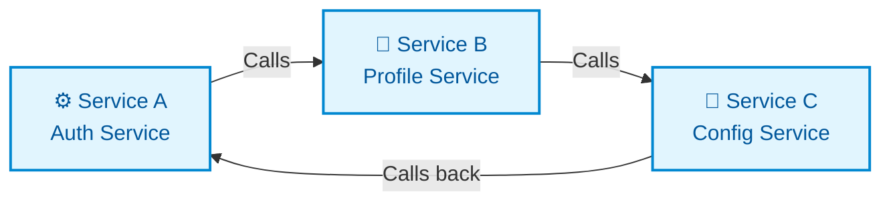
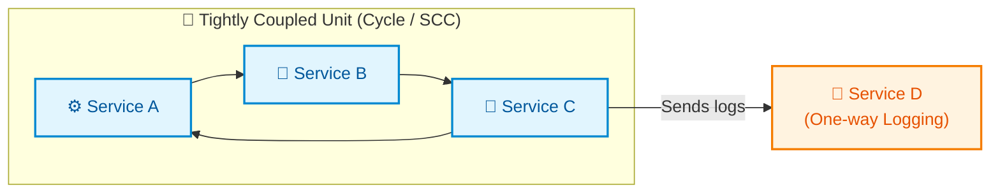
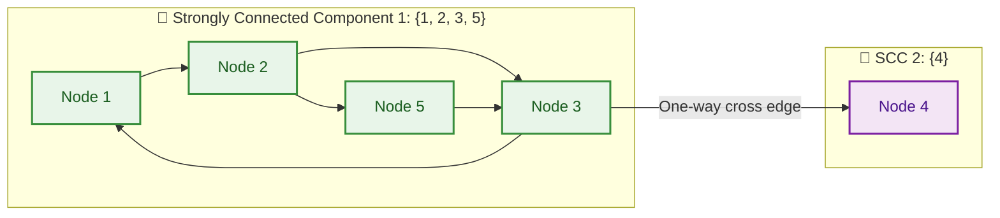
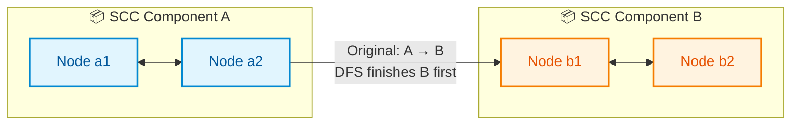

# 📘 Week 8 Day 5: Strongly Connected Components (SCC) — Engineering Guide


> 🧭 **Navigation:** [← Previous Day](Week_08_Day_04_Connectivity_and_Bipartite_Graphs_Instructional.md) • [🏠 Week Overview](README.md) • [📘 Curriculum Syllabus](../COMPLETE_SYLLABUS.md) • [Week Playbook →](WEEK_08_FULL_PLAYBOOK.md)
> 
> 💡 **Instructor Note:** *Not all sections or topics are mandatory. Feel free to adapt your pace and skim or skip sections based on your current focus and interview timeline.*

---

## 🎯 LEARNING OBJECTIVES

*By the end of this chapter, you will be able to:*

- 🎯 **Define** strongly connected components formally and intuitively, and distinguish them from undirected connected components.
- ♻️ **Explain** why SCCs partition a directed graph and why the component graph is always a DAG.
- 🧭 **Describe** the core ideas behind Kosaraju’s and Tarjan’s algorithms for SCCs, including finishing times, graph reversal, discovery indices, and low-link values.
- 🧱 **Construct** the condensation graph (component DAG) and reason about running DP, topological sort, and other algorithms on it.
- 🧩 **Recognize** problem patterns where SCCs are the right tool (2-SAT, dependency analysis, circular constraints, web graph clustering).
- 🏭 **Connect** SCCs to real-world systems: build tools, package managers, compilers, service meshes, and recommendation/crawling on the web graph.

---

## 📖 CHAPTER 1: CONTEXT & MOTIVATION

### 1.1 The Problem of Cycles in Directed Systems

By Day 4, connectivity in **undirected** graphs felt comfortable: you can tell whether a network stays in one piece and how many islands it has. But most production systems aren’t purely undirected—they have **direction**:

- A service **calls** another service (A → B).
- A module **imports** another module (X → Y).
- A web page **links to** another page (P → Q).

Edges now encode *dependencies* or *flows*.

Consider a microservice architecture:

- Service A calls B for authentication.  
- B calls C for profile information.  
- C calls A for configuration.

In graph form:





A, B, and C form a **cycle**: each can eventually reach the others. They behave like a tightly coupled cluster. If you try to reason about deployments, failures, or refactors, you cannot treat them as independent components.

Meanwhile, maybe D is a logging service used by C only:





D is not in the same mutual cycle: C can reach D, but D cannot reach back to C. Intuitively, A–B–C are one tightly interlocked unit; D hangs off the side.

We want a formal way to capture exactly this: groups of vertices where **everyone can reach everyone else following edge directions**.

### 1.2 Why SCCs Matter in Engineering

**Build systems & package managers.**

Package managers like npm, Maven, or pip must ensure there are no illegal cycles in certain dependency graphs (e.g., between libraries that are required to be acyclic). When cycles are allowed, they must still identify **dependency clusters** that must be compiled or loaded together.

**Compilers & program analysis.**

Compilers represent control-flow and call relationships as directed graphs. SCCs identify loops and mutually recursive functions—regions where control can circulate indefinitely. Many dataflow analyses work by first collapsing SCCs and running algorithms on the resulting DAG.

**Web graph & ranking.**

On the web, link structure forms a giant directed graph. Strongly connected components correspond to groups of pages that richly interlink—communities of sites or sections of a site that form tight navigational clusters.

**Constraint systems & logic.**

In 2-SAT problems (covered in later weeks), constraints are encoded as implications in a directed graph. SCCs tell you whether a variable and its negation are mutually implied—revealing unsatisfiable systems.

### 1.3 The Insight

We need an abstraction that:

- Groups vertices into **maximal sets** where every vertex can reach every other (via directed paths).  
- Treats each group as a single **super-node**, such that the resulting “component graph” has **no cycles**.

> 💡 **Insight:** *Strongly connected components compress a messy directed graph into a clean DAG of “mutual reachability clusters,” enabling simpler reasoning, dynamic programming, and detection of impossible constraints.*

SCC algorithms answer: *“Which nodes are fundamentally entangled together, and what is the acyclic structure between those entangled blocks?”*

---

## 🧠 CHAPTER 2: BUILDING THE MENTAL MODEL

### 2.1 Strong vs Weak Connectivity

In an **undirected** graph, connectivity is symmetric: if u can reach v via edges, v can reach u as well.

In a **directed** graph, direction breaks symmetry. There are two natural notions:

- **Strong connectivity:** u and v are strongly connected if there exists a **path from u to v and a path from v to u** (respecting directions).  
- **Weak connectivity:** if you ignore edge directions and treat them as undirected, u and v land in the same component.

For SCCs, we care about **strong connectivity**.

### 2.2 Formal Definition

Let G = (V, E) be a directed graph.

Two vertices u and v are **strongly connected** if:

- There exists a directed path u → … → v, and  
- There exists a directed path v → … → u.

A **strongly connected component (SCC)** is a **maximal** set of vertices C ⊆ V such that every pair of vertices in C is strongly connected to each other.

“Maximal” means you cannot add any other vertex to C while preserving this property.

### 2.3 Visualizing SCCs

Consider this directed graph:





Let’s identify SCCs:

- Between 1, 2, 3, 5:  
  - 1 reaches 2, 3, 5.  
  - 2 reaches 3, 5, 1 (via 3 → 1).  
  - 3 reaches 1, 2, 5.  
  - 5 reaches 3 and thus 1, 2 as well.  
  So {1, 2, 3, 5} is an SCC.

- Vertex 4:  
  - 3 → 4 exists, but there is no path back from 4 to 3 (or to the others).  
  So {4} is its own SCC.

- 6 and 7:  
  - 6 → 7 exists, but no path 7 → 6.  
  So {6} and {7} are separate SCCs.

- 8 has no edges; it is a trivial SCC {8}.

We can group them as:

- SCC A: {1, 2, 3, 5}  
- SCC B: {4}  
- SCC C: {6}  
- SCC D: {7}  
- SCC E: {8}

### 2.4 The Component DAG (Condensation Graph)

Now **contract** each SCC into a single super-node:

- A = {1,2,3,5}  
- B = {4}  
- C = {6}  
- D = {7}  
- E = {8}

Add edges between super-nodes if there exists at least one original edge from a vertex in one SCC to a vertex in another SCC.

Original cross-SCC edges:

- 3 → 4   ⇒ A → B  
- 6 → 7   ⇒ C → D

No edges to or from E.

Component DAG:

```
A → B

C → D

E (isolated)
```

**Theorem (Key Property):** The condensation graph (component DAG) is always a **DAG**—it has **no directed cycles**.

Intuition:

- If there were a cycle among SCCs, say X → Y → … → X, then all vertices in X and Y (and others on the cycle) would be mutually reachable, contradicting the maximality of each SCC—they should actually be fused into a single SCC.

This is powerful: we turned an arbitrary directed graph (possibly full of cycles) into a clean **DAG of components**, on which we can safely run **topological sort** and **dynamic programming**.

### 2.5 Equivalence Relation View

Strong connectivity is an **equivalence relation** on vertices:

- **Reflexive:** Every vertex reaches itself via a path of length 0.  
- **Symmetric:** If u can reach v and v can reach u, the relation is symmetric.  
- **Transitive:** If u and v are mutually reachable, and v and w are mutually reachable, then u and w are also mutually reachable.

Equivalence relations partition a set into **equivalence classes**. SCCs are exactly those classes under “mutually reachable” in a directed graph.

This abstraction helps you remember:

> SCCs **partition** V. No vertex belongs to two different SCCs; every vertex belongs to exactly one.

### 2.6 Naïve Algorithm: BFS/DFS from Every Vertex

Before exploring optimal algorithms, imagine a brute-force approach:

1. For each vertex v:  
   a. Run a DFS/BFS from v to find all vertices reachable from v (call this set R(v)).  
   b. Run DFS/BFS on the **reversed graph** from v to find all vertices that can reach v (call this set L(v)).

2. The intersection S(v) = R(v) ∩ L(v) gives the vertices mutually reachable with v.

3. Partition vertices according to S(v).

Time complexity: each BFS/DFS is O(V + E). We do it 2V times (forward and reverse), so O(V·(V + E)) — too slow for large graphs.

We can do better: **O(V + E)** total time, just like BFS/DFS and topological sort, using **Kosaraju’s** or **Tarjan’s** algorithm.

---

## ⚙️ CHAPTER 3: MECHANICS & IMPLEMENTATION

This chapter focuses on **how** SCC algorithms work. We will explain the mechanisms conceptually first, then show C# implementations where needed.

### 3.1 Kosaraju’s Algorithm — Two-Pass DFS

Kosaraju’s algorithm is elegant and conceptually simple. It uses two DFS passes and the notion of **finish times** from Day 3.

#### 3.1.1 Core Idea

1. Run DFS on the original graph, recording the **finish time** for each vertex. This is exactly what you did for topological sort.  
2. Build the **transpose graph** (also called the reversed graph): reverse the direction of every edge.  
3. Process vertices in **decreasing order of finish time** (from step 1). For each vertex not yet assigned to a component, run DFS on the **reversed graph** and assign all vertices reached to a new SCC.

Why does this work?

- The first DFS pass computes an order where we will always discover **source SCCs** (in the component DAG of the reversed graph) at the right times during the second pass.  
- Intuitively, finishing times act like a gravitational ordering pulling us “from sinks backwards.” When we then reverse edges, that order starts at sources and cleanly isolates each SCC.

#### 3.1.2 Step-by-Step Example

Consider a graph with two SCCs A and B, with an edge A → B.

ASCII sketch:





- First DFS on original graph:  
  - Starting from some node in A, DFS will fully explore SCC A before finishing those nodes (thanks to mutual reachability).  
  - From A, it can go to B (via 3 → 4), then fully explore SCC B.  
  - Nodes in B will finish **before** nodes in A (because DFS goes into B and returns, then finishes A’s roots).  
- Thus, in decreasing finish time, we see **A’s vertices before B’s** roots.

When we reverse edges:

- The cross-edge becomes B → A.  
- In the reversed graph, SCCs A and B are arranged with edge B → A, so **B is a source SCC**.

Running DFS on the reversed graph in decreasing finish time from the first pass:

- We will start with a vertex from A (since A’s finish times are larger). But in the reversed graph, there is no edge A → B; only B → A.  
- Therefore, the DFS from A in the reversed graph *stays within SCC A*. We label A as one SCC.  
- Later, we visit B and label it as a separate SCC.

This generalizes: the finishing-time order ensures that when we run DFS on the reversed graph, we always start at “top-level” SCCs that cannot reach any unvisited SCCs, isolating them cleanly.

#### 3.1.3 Memory Layout & State

What state do we track?

- `adj`: adjacency list for the original graph.  
- `rev`: adjacency list for the reversed graph.  
- `visited`: boolean array to mark visited vertices.  
- `stack` or list to store vertices in order of completion time during the first DFS.  
- `componentId`: array mapping each vertex to its SCC id.

The **state machine** for each DFS is standard: mark visited, recurse on neighbors, then push to stack on finish.

#### 3.1.4 C# Implementation Sketch — Kosaraju

Explanation first, then a C# example that captures the algorithm directly.

- First pass: DFS on `adj` to fill a stack with vertices ordered by finishing time (top of stack = largest finish time).  
- Second pass: DFS on `rev` in that stack order, assigning component IDs.

```csharp
using System;
using System.Collections.Generic;

public class KosarajuSCC
{
    private readonly int vertices;
    private readonly List<int>[] adj;   // original graph
    private readonly List<int>[] rev;   // reversed graph

    public KosarajuSCC(int v)
    {
        vertices = v;
        adj = new List<int>[v];
        rev = new List<int>[v];

        for (int i = 0; i < v; i++)
        {
            adj[i] = new List<int>();
            rev[i] = new List<int>();
        }
    }

    public void AddEdge(int u, int v)
    {
        // Edge u -> v
        adj[u].Add(v);
        rev[v].Add(u); // reverse edge for transpose graph
    }

    public int[] ComputeSCCs()
    {
        var visited = new bool[vertices];
        var stack = new Stack<int>();

        // 1) DFS on original graph to fill stack with vertices
        for (int i = 0; i < vertices; i++)
        {
            if (!visited[i])
            {
                DfsFirstPass(i, visited, stack);
            }
        }

        // 2) DFS on reversed graph in order of decreasing finish time
        Array.Fill(visited, false);
        var componentId = new int[vertices];
        Array.Fill(componentId, -1);

        int currentComponent = 0;

        while (stack.Count > 0)
        {
            int v = stack.Pop();
            if (!visited[v])
            {
                DfsSecondPass(v, visited, componentId, currentComponent);
                currentComponent++;
            }
        }

        return componentId; // componentId[i] = SCC index containing vertex i
    }

    private void DfsFirstPass(int u, bool[] visited, Stack<int> stack)
    {
        visited[u] = true;

        foreach (int v in adj[u])
        {
            if (!visited[v])
            {
                DfsFirstPass(v, visited, stack);
            }
        }

        // All descendants of u are processed; push u to stack
        stack.Push(u);
    }

    private void DfsSecondPass(int u, bool[] visited, int[] componentId, int currentComponent)
    {
        visited[u] = true;
        componentId[u] = currentComponent;

        foreach (int v in rev[u])
        {
            if (!visited[v])
            {
                DfsSecondPass(v, visited, componentId, currentComponent);
            }
        }
    }
}
```

This implementation mirrors the mental model precisely:

- First pass **records finish order** on the original graph.  
- Second pass runs DFS on the **transpose** in that order, assigning component IDs.

Time complexity: O(V + E) — two DFS passes plus O(E) to build the reverse adjacency lists.

### 3.2 Tarjan’s Algorithm — Single-Pass DFS with Low-Link Values

Tarjan’s algorithm is more intricate but runs SCC detection in **one DFS pass**, without explicitly building the reversed graph.

#### 3.2.1 High-Level Idea

Tarjan’s algorithm maintains, for each vertex u:

- `index[u]`: the time (DFS order) when u was first visited (0, 1, 2, …).  
- `lowLink[u]`: the smallest `index` of any vertex reachable from u, including u itself and via any number of tree edges and at most one back edge.

It also maintains a **stack** of vertices currently in the recursion stack (“active” vertices in the current DFS subtree) and a boolean flag `onStack[u]`.

The key insight:

- When the DFS finishes exploring u, if `lowLink[u] == index[u]`, then u is the **root of an SCC**.  
- All vertices above u on the stack up to u belong to this SCC; popping them off yields one strongly connected component.

#### 3.2.2 Intuition for lowLink

Imagine you start DFS at u and it grows a subtree of visited nodes.

- `index[u]` is when we first arrive.  
- As you explore descendants, if you ever find a **back edge** to an ancestor w (already on the stack), then there exists a cycle u → … → v → w where w’s `index[w]` is smaller.  
- `lowLink[u]` captures the minimum index among u and all vertices reachable from u **via zero or more tree edges + at most one back edge**.

Visually:

```
   w (index 1)
   ↑
   |
  ...
   |
   u (index 5) → ... → v → w
```

Because u can reach w, and w started earlier in this DFS subtree, u is part of the same SCC as w (or one contained within). The `lowLink` bubbling mechanism ensures this information propagates up the recursion.

#### 3.2.3 DFS State Machine

For each vertex u:

1. Assign `index[u] = currentIndex` and `lowLink[u] = currentIndex`. Increment `currentIndex`.  
2. Push u onto the stack and mark `onStack[u] = true`.  
3. For each outgoing edge u → v:
   - If `v` is unvisited (`index[v]` undefined): recursively DFS(v), then set `lowLink[u] = min(lowLink[u], lowLink[v])`.  
   - Else if `v` is onStack: set `lowLink[u] = min(lowLink[u], index[v])` (a back edge).  
4. After exploring all neighbors, if `lowLink[u] == index[u]`, then u is the root of an SCC:
   - Pop vertices from the stack until you pop u; all popped vertices belong to the same SCC.

ASCII trace for a small component is helpful:


```mermaid
flowchart TD
    classDef visit fill:#e1f5fe,stroke:#0288d1,color:#01579b,stroke-width:2px;
    classDef back fill:#f3e5f5,stroke:#7b1fa2,color:#4a148c,stroke-width:2px;
    classDef root fill:#e8f5e9,stroke:#388e3c,color:#1b5e20,stroke-width:2px;

    A["Node A: index=0, lowLink=0 (SCC Root)"]:::root
    B["Node B: index=1, lowLink=1"]:::visit
    C["Node C: index=2, lowLink=2"]:::visit

    A -->|Tree Edge| B
    B -->|Tree Edge| C
    C -->|Back Edge to B (on stack)| B
    C -.->|lowLink updated to min(2, index[B]=1)| B
```


DFS might visit A (index 0), then B (index 1), then C (index 2). From C, there is an edge back to B (onStack with index 1), so lowLink[C] = 1, then lowLink[B] = min(1, lowLink[C]=1) = 1, and lowLink[A] = min(0, lowLink[B]=1) = 0. If there are no additional connections, each vertex could become its own SCC depending on connections. Where `lowLink[u] == index[u]` marks SCC roots.

In a full SCC such as a cycle, the smallest-index vertex in that cycle will serve as the root, and all cycle members will share that lowLink value; they are popped together.

#### 3.2.4 C# Implementation Sketch — Tarjan

Now that the logic is clear, here is a C# implementation that follows it closely.

```csharp
using System;
using System.Collections.Generic;

public class TarjanSCC
{
    private readonly int vertices;
    private readonly List<int>[] adj;

    private int indexCounter = 0;
    private int[] index;      // discovery index
    private int[] lowLink;    // low-link values
    private bool[] onStack;
    private Stack<int> stack;
    private int currentComponent = 0;
    private int[] componentId; // result

    public TarjanSCC(int v)
    {
        vertices = v;
        adj = new List<int>[v];
        for (int i = 0; i < v; i++)
            adj[i] = new List<int>();

        index = new int[v];
        lowLink = new int[v];
        onStack = new bool[v];
        stack = new Stack<int>();
        componentId = new int[v];

        // Use -1 to denote unvisited
        for (int i = 0; i < v; i++)
        {
            index[i] = -1;
            lowLink[i] = -1;
            componentId[i] = -1;
        }
    }

    public void AddEdge(int u, int v)
    {
        // Directed edge u -> v
        adj[u].Add(v);
    }

    public int[] ComputeSCCs()
    {
        for (int i = 0; i < vertices; i++)
        {
            if (index[i] == -1)
            {
                StrongConnect(i);
            }
        }

        return componentId; // componentId[i] = SCC index containing vertex i
    }

    private void StrongConnect(int u)
    {
        // Set the depth index for u to the smallest unused index
        index[u] = indexCounter;
        lowLink[u] = indexCounter;
        indexCounter++;

        stack.Push(u);
        onStack[u] = true;

        // Consider successors of u
        foreach (int v in adj[u])
        {
            if (index[v] == -1)
            {
                // Successor v has not yet been visited; recurse on it
                StrongConnect(v);
                lowLink[u] = Math.Min(lowLink[u], lowLink[v]);
            }
            else if (onStack[v])
            {
                // Successor v is in stack and hence in the current SCC
                // Update lowLink based on v's index
                lowLink[u] = Math.Min(lowLink[u], index[v]);
            }
        }

        // If u is a root node, pop the stack and generate an SCC
        if (lowLink[u] == index[u])
        {
            while (true)
            {
                int v = stack.Pop();
                onStack[v] = false;
                componentId[v] = currentComponent;

                if (v == u)
                    break;
            }

            currentComponent++;
        }
    }
}
```

This implementation is a direct transcription of Tarjan’s algorithm:

- Each vertex gets a discovery `index` and `lowLink`.  
- Active vertices live on a stack.  
- When `lowLink[u] == index[u]`, u is the root of an SCC; we pop all vertices up to u.

Time complexity: O(V + E), since each edge is examined once and each vertex is pushed/popped at most once.

### 3.3 Comparing Kosaraju and Tarjan

| Aspect | Kosaraju | Tarjan |
| :--- | :--- | :--- |
| **Passes** | 2 DFS passes (original, reversed) | 1 DFS pass |
| **Graph Requirements** | Needs transpose graph | Uses only original graph |
| **Implementation Complexity** | Conceptually simpler (build reverse + 2 DFS) | More intricate (index, lowLink, stack) |
| **Space Overhead** | Stores both adj and rev | Stores index, lowLink, stack, onStack |
| **Use Case** | Great when building reversed graph is cheap and acceptable | Great when you want a single sweep, or graph is changing slightly |

In practice:

- Many textbooks and competitive programmers use **Kosaraju** first due to its simplicity and clarity.  
- **Tarjan** is favored in some libraries where the transpose graph is inconvenient or when you want to integrate SCC detection tightly with other DFS-based analyses.

### 3.4 Building the Component DAG (Condensation Graph)

Once we have `componentId[v]` for each vertex v, constructing the condensation graph is straightforward:

1. Let `numComponents` be the number of distinct SCC IDs.  
2. Create a new adjacency list `dag` of size `numComponents`.  
3. For each directed edge u → v in the original graph:  
   - Let cu = componentId[u], cv = componentId[v].  
   - If cu != cv, add an edge cu → cv to `dag[cu]`, avoiding duplicates if desired.

The resulting graph is a DAG. We can then:

- Run **topological sort** on it.  
- Apply **DP on DAGs** to compute quantities that depend on SCC-level structure (e.g., longest path over SCCs, reachable sets, etc.).

This pattern shows up repeatedly in advanced algorithms: **compress strongly connected regions, then solve on the DAG.**

---

## ⚖️ CHAPTER 4: PERFORMANCE, TRADE-OFFS & REAL SYSTEMS

### 4.1 Complexity & Practical Considerations

Both Kosaraju’s and Tarjan’s algorithms run in **O(V + E)** time:

- Kosaraju:  
  - O(V + E) for the first DFS.  
  - O(V + E) for the second DFS.  
  - O(E) to build the reversed graph (if not already built incrementally).  
  - Overall O(V + E).

- Tarjan:  
  - Single DFS pass exploring each edge once.  
  - Each vertex pushed/popped from the stack at most once.  
  - Overall O(V + E).

Space complexity is also linear:

- O(V + E) for adjacency structures.  
- O(V) for arrays and stacks.

In production, the main trade-offs are:

- **Memory locality:** adjacency lists should be stored contiguously when possible for better cache behavior.  
- **Recursion depth:** deep graphs can cause stack overflows; iterative DFS variants or tail-call optimizations may be needed.  
- **Graph form:** if you naturally maintain both forward and reverse edges (e.g., for other algorithms), Kosaraju is trivial to plug in.

### 4.2 Real System 1: Build Systems & Package Managers

Build systems (e.g., `make`, Gradle, Bazel) and package managers (npm, Maven) operate over **dependency graphs**:

- Nodes: modules, targets, or packages.  
- Edges: X → Y means “X depends on Y” (Y must be built/installed before X).

For many ecosystems, **cycles are illegal** (e.g., mutual dependency between two npm packages). But in others, limited cycles may be allowed (mutually recursive modules, or plugin systems).

SCCs provide:

- A way to **detect illegal cycles**: if the system requires acyclicity, any SCC with more than one vertex (or a self-loop) is a violation.  
- A way to **treat cyclic groups as single units**: if allowed, you can collapse each SCC into a super-node and run **topological sort** on the condensation DAG to establish a valid build order among SCCs.

Example:

- Suppose modules A, B, C form mutual dependencies.  
- Modules D and E each depend on C.  
- Building the SCC DAG gives: `[A,B,C] → D`, `[A,B,C] → E`.  
- Build systems can compile or link A–B–C together, then proceed to D and E.

### 4.3 Real System 2: Compilers & Program Analysis

Compilers represent control flow as a directed graph of **basic blocks** (CFG: control-flow graph). SCCs correspond to **loops** and **recursive regions**:

- A `while` loop, `for` loop, or a set of mutually recursive functions will form an SCC in the CFG or call graph.  
- Dataflow analyses (e.g., reaching definitions, liveness) sometimes work SCC-by-SCC: process each SCC until its local state converges, then propagate along the DAG.

In advanced compilers:

- SCCs are used to identify **strongly connected regions** where certain optimizations (like loop-invariant code motion, strength reduction, or induction variable analysis) apply.  
- The condensation graph organizes the program into a DAG of regions, enabling clear optimization passes.

### 4.4 Real System 3: Web Crawlers & Ranking

The web graph is enormous:

- Nodes: pages or hosts.  
- Edges: hyperlinks from one page to another.

SCCs reveal **tightly interlinked communities**:

- A group of pages that all link to each other often represent a cohesive site section, navigation cluster, or a community of related sites.  
- Ranking algorithms can treat SCCs as units, aggregating link metrics or spam scores at the component level.

For example:

- Suppose a crawler identifies a cluster of pages where every page links to many others in the cluster, but there is only one edge in from the wider web.  
- This might indicate a “link farm” or spam network; SCC analysis plus other signals can help detect such structures.

### 4.5 Real System 4: 2-SAT and Constraint Systems (Preview)

2-SAT (2-satisfiability) problems ask whether there is an assignment of boolean variables that satisfies a conjunction of clauses, each clause being the OR of two literals (variables or their negations).

A classic reduction encodes these constraints in an **implication graph**:

- For each clause (a ∨ b), add edges ¬a → b and ¬b → a.  
- The resulting graph’s SCC structure decides satisfiability:  
  - If for any variable x, x and ¬x belong to the **same SCC**, the formula is unsatisfiable.  
  - Otherwise, a satisfying assignment can be extracted by considering the condensation DAG.

Even though full 2-SAT is beyond Week 8, this example underscores how SCCs become the **core primitive** of advanced constraint solvers.

### 4.6 Failure Modes & Robustness

Common failure modes when implementing SCC algorithms:

1. **Forgetting that SCCs are about directed graphs:**  
   - Applying SCC logic on undirected graphs is redundant; in an undirected graph, every connected component is trivially one SCC.  
   - Always clarify whether edges are directed.

2. **Mismanaging visited/stack status in Tarjan:**  
   - Mixing up `index` and `lowLink` updates or forgetting to clear `onStack` when popping leads to incorrect SCC grouping.  
   - Always follow the exact state machine: visit → recurse → update lowLink → check root condition.

3. **Stack overflow due to deep recursion:**  
   - Very deep or adversarial graphs (long chains) can cause recursive DFS to overflow the call stack.  
   - In production, consider iterative DFS or limit recursion depth with fallbacks.

4. **Not deduplicating edges in condensation graph:**  
   - When many edges exist between the same pair of SCCs, naive condensation can create many duplicate edges, wasting memory.  
   - Use sets or deduplication strategies if needed.

5. **Incorrect ordering assumptions:**  
   - In Kosaraju, you must use **decreasing finish time** from the first pass; using discovery time or arbitrary ordering will break correctness.

Robust SCC implementations need careful handling of these details.

---

## 🔗 CHAPTER 5: INTEGRATION & MASTERY

### 5.1 Connections to Earlier Days in Week 8

By now you have:

- Represented graphs via adjacency lists/matrices/edge lists (Day 1).  
- Traversed graphs with **BFS** for shortest paths in unweighted graphs (Day 2).  
- Traversed with **DFS** for cycle detection and **topological sort** in DAGs (Day 3).  
- Understood **connectivity** and **bipartiteness** in undirected graphs, plus high-level articulation points and Union–Find (Day 4).

SCCs extend these ideas to **directed graphs**:

- SCCs are to directed graphs what **connected components** are to undirected graphs—but with direction respected.  
- The condensation graph is always a **DAG**, which ties back to topological sort and DAG DP.  
- Tarjan and Kosaraju are essentially **clever DFS orchestrations** that leverage finishing times and low-link values.

### 5.2 Future Topics Enabled by SCCs

SCCs are a gateway to:

- **2-SAT and advanced constraint solvers** (Week 11+).  
- **Advanced DP on DAGs** derived from condensation graphs (longest paths, reachability summaries).  
- **Flow networks** and residual graph structure (later weeks on max-flow/min-cut).  
- **Program analysis** techniques that treat SCCs as indivisible regions.

### 5.3 Pattern Recognition: When to Think “SCC”

Look for these signals in problems:

- “Given a directed graph, find groups of vertices where every vertex can reach every other.”  
- “Detect cycles of mutual dependencies between modules/services.”  
- “Find all strongly connected components and then do X on the resulting DAG.”  
- “In this implication graph, determine if there is a contradiction (x and ¬x mutually imply each other).”  
- “Compress the graph by collapsing strongly connected subgraphs.”

Decision framework:

- If you only care whether the graph is acyclic → use **cycle detection / topological sort**.  
- If you care about **mutual reachability clusters** in a **directed** graph → use **SCC** algorithms.  
- After SCC compression, if you see a DAG and need to aggregate information from dependencies → think **DP on DAG**.

### 5.4 Socratic Reflection

Reflect on these questions to test deep understanding:

1. Why is it impossible for the condensation graph of SCCs to contain a directed cycle? Provide a careful argument based on the definition of SCCs and maximality.

2. In practice, when might building an explicit reversed graph (Kosaraju) be better than using Tarjan, even though Tarjan uses only one DFS pass?

3. Suppose you have a large codebase with thousands of modules and complex dependency relationships. How would you use SCC decomposition to:  
   - a) detect illegal circular dependencies, and  
   - b) produce a safe build/initialization order for the remaining modules?

### 5.5 Retention Hook

> **The Essence:** *“Strongly connected components carve a directed graph into minimal ‘mutual reachability’ blocks. Collapse each block into a node, and the messy cycles vanish—what remains is always a clean DAG you can sort, reason about, and optimize over.”*

---

## 🧠 5 COGNITIVE LENSES

### 1. 💻 The Hardware Lens

SCC algorithms are DFS-based and thus share the same hardware considerations as DFS:

- **Cache locality:** Good adjacency list layouts (arrays of vectors, vertices stored contiguously) make DFS and SCC passes more cache-friendly. Scattered allocations and linked-list-based adjacency can hurt performance due to pointer chasing.

- **Stack usage:** Both Kosaraju and Tarjan as written use recursion; deep graphs can exhaust the call stack. For very large graphs (millions of nodes), iterative DFS or frameworks specifically designed for large-scale graph processing (e.g., graph engines with explicit stacks) are preferable.

- **Memory footprint:** Storing both the original and reversed graphs (Kosaraju) doubles edge storage, which may be significant for huge graphs. Tarjan avoids this but uses additional arrays and a stack. For many real systems, O(V + E) memory with small constants is acceptable.

### 2. 📉 The Trade-Off Lens

Key trade-offs between SCC approaches:

- **Simplicity vs. single-pass efficiency:**  
  Kosaraju is conceptually simpler, mirroring topological sort. Tarjan is slightly more complex but avoids building the reversed graph and uses a single DFS.

- **Pre-existing data structures:**  
  If your system already stores both incoming and outgoing edges (e.g., for PageRank or other analyses), Kosaraju piggybacks easily. If not, Tarjan saves memory and a preprocessing step.

- **Integration with other passes:**  
  Tarjan’s low-link computation dovetails with other DFS-based metrics (e.g., articulation points, bridges in undirected graphs). In systems where multiple DFS-based analyses are chained, it can be natural to embed SCC detection into a larger pass.

Choosing between them is less about asymptotic complexity (both are O(V + E)) and more about **engineering fit**.

### 3. 👶 The Learning Lens

Common misconceptions around SCCs:

- **“SCCs are just like connected components in undirected graphs.”**  
  Not quite: SCCs respect *direction*. Two nodes might be in the same undirected component but in different SCCs (if reachability is one-way).

- **“If a directed graph has no cycles, it has no SCCs.”**  
  Even a DAG has SCCs—each individual vertex forms a trivial SCC. “No cycles” just means all SCCs are singletons.

- **“Any cycle is an SCC.”**  
  A simple directed cycle is an SCC, but cycles can be part of bigger SCCs if there are additional edges that create more mutual reachability.

- **“You can just run DFS from every node to find SCCs efficiently.”**  
  The naïve O(V·(V + E)) approach looks correct but is too slow on large graphs; linear-time algorithms exist and should be preferred.

Understanding these subtleties moves you from “I can run code I copied” to “I know exactly what structure SCCs capture.”

### 4. 🤖 The AI/ML Lens

Graph-based ML and analysis often exploit SCC structure:

- **Graph clustering and community detection:** While SCCs are a strong notion (mutual reachability), they sometimes serve as a preprocessing step to reduce a graph before running heavier clustering algorithms.

- **Markov chains & ergodic components:** In stochastic processes, strongly connected components can correspond to recurrent classes in Markov chains—states that communicate with each other. Analyzing long-term behavior often starts by identifying these.

- **Neural networks over program graphs:** When learning over code, SCCs in call graphs or data-flow graphs highlight tightly coupled code regions. Models may aggregate features per SCC to provide higher-level representations.

### 5. 📜 The Historical Lens

SCC algorithms emerged from foundational work in graph theory and algorithms:

- **1960s–1970s:** Strong components and related concepts were formalized; Tarjan introduced his linear-time algorithm in 1972, a landmark result in algorithm design.

- SCCs quickly became essential tools in **compiler design** and **network analysis**, powering early program optimization techniques and routing algorithms.

- Over time, SCCs have appeared everywhere from **formal verification** (checking properties of state transition systems) to **game theory** (analyzing strongly connected subgames) and **logic** (2-SAT, model checking).

Their persistence across decades of systems and theory shows how deeply structural this concept is.

---

## ⚔️ SUPPLEMENTARY OUTCOMES

### 🏋️ Practice Problems (10–12)

| # | Problem | Source | Difficulty | Key Concept |
| :---: | :--- | :--- | :---: | :--- |
| 1 | Strongly Connected Components | Classic / CP sites | 🟡 | Kosaraju/Tarjan implementation |
| 2 | Mother Vertex in a Graph | GeeksForGeeks-style | 🟡 | Reachability & SCC intuition |
| 3 | Count Strongly Connected Components | Custom | 🟡 | SCC count, component labeling |
| 4 | Minimum Edges to Make Graph Strongly Connected | Advanced (CP) | 🔴 | SCC condensation DAG reasoning |
| 5 | 2-SAT Satisfiability | Classic | 🔴 | SCCs on implication graph |
| 6 | Dominoes (strong connectivity variant) | UVA / SPOJ | 🔴 | SCC + DAG source components |
| 7 | Flight Routes | CSES | 🟡 | Reachability, sometimes SCC + path |
| 8 | Find Bottom/Top of SCC DAG (nodes that cannot reach others or be reached) | Custom | 🔴 | Component DAG analysis |
| 9 | Webpage Clustering via SCC | Custom | 🟡 | Applied SCC grouping |
| 10 | Strong Components in Functional Graphs | Custom | 🔴 | SCCs where outdegree = 1 per node |
| 11 | Detect Cycles and Compress SCCs for Topological DP | Custom | 🔴 | SCC + DAG DP integration |
| 12 | Dynamic SCC (conceptual) | Custom | 🔴 | Incremental SCC reasoning |

### 🎙️ Interview Questions (15+)

1. **Q:** Define a strongly connected component in a directed graph. How is it different from a connected component in an undirected graph?
   - **Follow-up:** Why do SCCs always partition the vertex set?

2. **Q:** Explain Kosaraju’s algorithm for finding SCCs. Why do we need to process vertices in decreasing order of finish time on the reversed graph?
   - **Follow-up:** What could go wrong if we used discovery order instead?

3. **Q:** Describe Tarjan’s algorithm for SCCs. What are `index` and `lowLink`, and how do they interact?
   - **Follow-up:** Why is the condition `lowLink[u] == index[u]` sufficient to detect an SCC root?

4. **Q:** Prove that the condensation graph (graph of SCCs) is a DAG.
   - **Follow-up:** How does this property enable topological sorting and DP over SCCs?

5. **Q:** Given a large set of modules with directed dependencies, how would you identify groups that must be built together and cycles that violate acyclicity constraints?
   - **Follow-up:** How would you present this information to a developer to help them refactor?

6. **Q:** How can SCCs be used to solve 2-SAT?
   - **Follow-up:** Why does having a variable and its negation in the same SCC imply unsatisfiability?

7. **Q:** When would you choose Kosaraju over Tarjan in a real application, given both are O(V + E)?
   - **Follow-up:** How would the availability of the reversed graph influence your decision?

8. **Q:** Consider a graph that is already a DAG. What are its SCCs? How would Tarjan or Kosaraju behave on such a graph?
   - **Follow-up:** Is running SCC overkill on a known DAG?

9. **Q:** In the context of a web graph, what could SCCs represent? How might they influence crawling or ranking strategies?
   - **Follow-up:** How would you handle extremely large SCCs spanning many pages?

10. **Q:** What are typical sources of bugs when implementing Tarjan’s algorithm?
    - **Follow-up:** How would you debug a misbehaving SCC implementation?

11. **Q:** How could you modify SCC algorithms or use their output to detect “almost strongly connected” structures (e.g., a DAG plus a few back edges)?
    - **Follow-up:** Can you leverage SCCs to simplify reasoning about feedback loops?

12. **Q:** How would you compress a graph into its SCC DAG and then compute the longest path from any SCC to any other?
    - **Follow-up:** Why is this easy on the condensation DAG but hard on the original graph if it has cycles?

13. **Q:** Are SCCs meaningful in undirected graphs? What do they reduce to?
    - **Follow-up:** Is there ever a reason to run an SCC algorithm on an undirected graph?

14. **Q:** Suppose you run SCC decomposition on a control-flow graph. How could this help in optimizing loops or detecting unreachable states?
    - **Follow-up:** How might SCCs interact with dataflow analyses?

15. **Q:** Can you maintain SCCs dynamically as edges are added and deleted? Why is this substantially harder than static SCC computation?
    - **Follow-up:** What high-level strategies exist for dynamic SCC maintenance?

### ❌ Common Misconceptions (7–8)

| Misconception | Why It Seems Right | Reality | Memory Aid |
| :--- | :--- | :--- | :--- |
| **“SCCs and connected components are basically the same thing.”** | Both talk about “components.” | SCCs respect edge **direction**; two nodes can be connected but not strongly connected. | *Strong = both ways.* |
| **“If a graph has no cycles, it has no SCCs.”** | SCCs are often introduced via cycles. | Every vertex forms a trivial SCC; DAGs still have SCCs, they’re just all size 1. | *No cycles ≠ no SCCs; only trivial SCCs.* |
| **“Any directed cycle is exactly one SCC.”** | Simple examples show this. | Cycles may share vertices via extra edges, forming larger SCCs. | *Cycles can merge into bigger clusters.* |
| **“Running DFS from every node is a fine SCC algorithm.”** | It’s conceptually straightforward. | It’s O(V·(V + E)), too slow for large graphs; linear-time algorithms exist. | *Don’t brute-force mutual reachability.* |
| **“Kosaraju and Tarjan give different SCCs depending on traversal order.”** | Different DFS orders feel like different results. | They may label components in different **orders**, but the **partition** is identical. | *Same partition, different naming.* |
| **“You can pick any vertex ordering for the second pass of Kosaraju.”** | DFS always explores something. | Correctness requires **decreasing finish time** from the first pass. | *Finish times are the compass.* |
| **“SCCs only matter in theory/contests.”** | Many textbooks emphasize theory. | SCCs underlie build tools, compilers, web analysis, and SAT solvers. | *SCCs are in your toolchain.* |

### 🚀 Advanced Concepts (5–6)

1. **Dynamic SCC Maintenance**  
   - Maintaining SCCs under edge insertions and deletions is challenging.  
   - Advanced data structures (e.g., incremental algorithms, sparsification techniques) are active research topics.

2. **Strong Components in Markov Chains**  
   - Recurrent classes in Markov chains correspond to strongly connected sets of states.  
   - Long-term behavior analysis often decomposes chains into these classes and studies transition structure among them.

3. **SCC-Based Model Checking**  
   - In formal verification, systems are modeled as state-transition graphs.  
   - SCCs help detect accepting cycles, fairness constraints, and infinite behaviors.

4. **2-SAT and Implication Graphs (Deep Dive)**  
   - Full SCC-based 2-SAT solvers assign truth values based on topological order of SCCs in the condensation DAG, respecting that if x and ¬x are separated, their SCC order picks consistent assignments.

5. **Component-Based DP on Graphs**  
   - Many hard problems on general directed graphs become easier when solved on the condensation DAG of SCCs (e.g., longest path, counting paths, computing reachability closure per SCC).

6. **Parallel & Distributed SCC Algorithms**  
   - Scaling SCC detection to web-scale graphs requires distributed and parallel strategies, often using multi-phase BFS/DFS hybrids and partitioning techniques.

### 📚 External Resources

- **CLRS (Introduction to Algorithms), Chapter on Strong Components**  
  Rigorous yet accessible explanation of SCCs, Kosaraju’s algorithm, and applications.

- **MIT 6.006 / 6.046J Lecture Notes on SCCs and 2-SAT**  
  Connect SCCs directly to satisfiability, with well-crafted examples.

- **Competitive Programming Resources (cp-algorithms SCC page)**  
  Implementation-focused descriptions of Kosaraju and Tarjan with code templates and typical problem patterns.

- **Graph Theory Texts (e.g., Diestel, West)**  
  Deeper exploration of strongly connected digraphs, condensation graphs, and theoretical properties.

---

## 🎓 FINAL REFLECTION

Strongly connected components complete your Week 8 journey through the fundamentals of graph structure and traversal.

- Day 1 taught you how to **represent** graphs.  
- Day 2 showed how to **explore outward** with BFS, discovering distances.  
- Day 3 showed how to **dive deep** with DFS, uncovering cycles and topological order.  
- Day 4 generalized connectivity to **undirected** graphs and simple constraints.  
- Day 5, today, generalizes connectivity to **directed** graphs, revealing the hidden architecture of mutual dependencies.

SCCs are not an isolated trick; they are a fundamental lens for understanding any directed system. Once you see a directed graph, you should instinctively ask:

- What are its **SCCs**?  
- What does the **condensation DAG** look like?  
- Which problems become easier once I collapse SCCs and work on the DAG?

With this, your mental model of graphs now covers the full 6.006-style foundation: representations, basic traversals, topological structure, connectivity, and strongly connected components. You are ready to step into Week 9, where weights enter the picture and paths gain cost—shortest paths and minimum spanning trees build directly on the intuition you’ve developed here.
---

> 🧭 **Navigation:** [← Previous Day](Week_08_Day_04_Connectivity_and_Bipartite_Graphs_Instructional.md) • [🏠 Week Overview](README.md) • [📘 Curriculum Syllabus](../COMPLETE_SYLLABUS.md) • [Week Playbook →](WEEK_08_FULL_PLAYBOOK.md)
