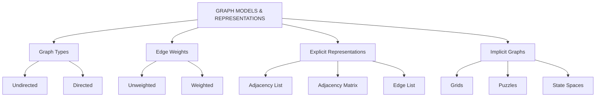
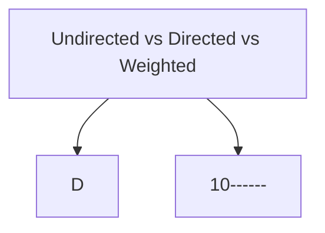
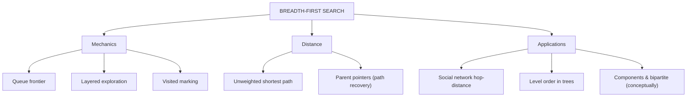
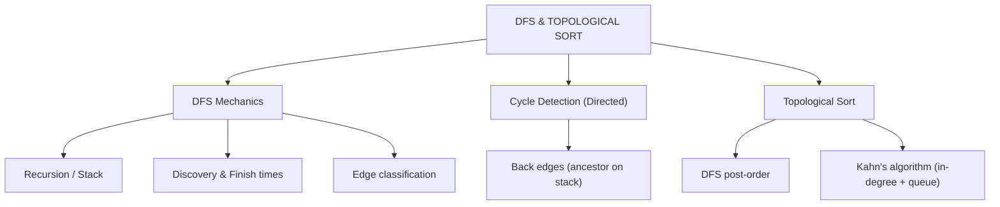
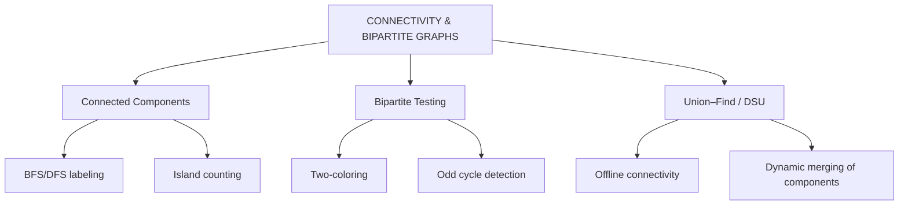
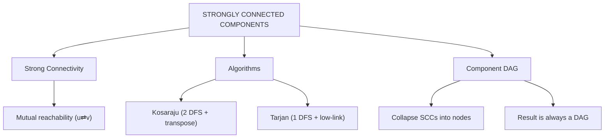
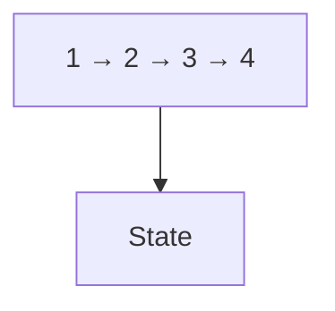

# WEEK 08 VISUAL CONCEPTS PLAYBOOK HYBRID

> 🧭 **Navigation:** [🏠 Week Overview](README.md) • [📘 Curriculum Syllabus](../COMPLETE_SYLLABUS.md)
> 
> 💡 **Instructor Note:** *This Visual Playbook provides a high-density, integrated synthesis. Not all sections are mandatory; use it as a modular reference to solidify invariants and review pattern transitions.*

---

**Filename:** `Week_08_Visual_Concepts_Playbook_HYBRID.md`  
**Syllabus Source:** `COMPLETE_SYLLABUS.md`  
**Primary Goal:** Build **visual, structural intuition** for graph models, BFS, DFS, topological sort, connectivity, bipartite graphs, and SCCs.

---

## 🎛 Visual Legend

Use this legend to interpret all diagrams consistently.

| Symbol | Meaning |
| ------ | ------- |
| `A, B, C` | Graph vertices (nodes) |
| `A - B` | Undirected edge between A and B |
| `A → B` | Directed edge from A to B |
| `(u, v, w)` | Edge from u to v with weight w |
| `[ ]` | Queue (front on the left, back on the right) |
| `{ }` | Set of vertices or components |
| `⟂` | Impossible / contradiction |
| `dist[x]` | Distance (in edges) from source to x |
| `color[x]` | Color/partition of vertex x in bipartite tests |
| `onStack[x]` | Whether vertex x is active in Tarjan-style SCC |

All diagrams are pure ASCII so they work in any Markdown viewer or terminal.

---

## 🌐 Professional Visualization Resources (for Online Enhancement)

These tools are optional but highly recommended for deeper exploration:

1. **Graph Animator (BFS/DFS/Topo)** – Visualize traversals step-by-step.  
   - Use for: seeing BFS layers, DFS recursion, and topological order on sample graphs.  
2. **Tree & Graph Visualizer** – Interactive editor for trees and general graphs.  
   - Use for: building sample inputs and seeing adjacency representations.  
3. **Algorithm Animation Library** – General-purpose visualizer for standard algorithms.  
   - Use for: cross-checking your mental model of BFS/DFS against standard animations.  
4. **Competitive Programming Graph Archive** – Problem sets with diagrams and editorials.  
   - Use for: seeing graph patterns in real contest problems.  
5. **Geometric Grid / Maze Visualizer** – Grid-based pathfinding demos.  
   - Use for: understanding implicit graphs and BFS in grids/mazes.  
6. **SCC / Strong Components Demo** – Interactive SCC decomposition on directed graphs.  
   - Use for: experimenting with condensation DAGs and SCC algorithms.

When using these tools: always **recreate** at least one ASCII diagram from this playbook inside the tool to strengthen transfer between mental and visual models.

---

## 📅 Day 1 – Graph Models & Representations

**Syllabus Topics:**  
- Adjacency matrix vs adjacency list vs edge list  
- Memory usage and performance trade-offs  
- Implicit graphs: grids, puzzles, state spaces  
- Translating real problems into graphs (nodes and edges)  
- 🌐 Graph Types: directed vs undirected; weighted vs unweighted

### 1.1 Pattern Map – Graph Representation Family Tree 🌳





Key idea: **representation choice depends on density (sparse vs dense), operations (lookups vs traversal), and memory constraints.**

### 1.2 Visual 1 – Graph Types & Directions 🔀





- In undirected graphs, edges **do not have direction** and connectivity is symmetric.  
- In directed graphs, arrows encode **dependencies or flow**.  
- Weights carry **costs** (distance, time, capacity) on edges.

### 1.3 Visual 2 – Representation Side-by-Side 🧱

Use this canonical example:

```text
Graph G:

0 -- 1
|  / |
| /  |
2 -- 3
```

**Adjacency List** (sparse-friendly):

```text
0: [1, 2]
1: [0, 2, 3]
2: [0, 1, 3]
3: [1, 2]
```

**Adjacency Matrix** (dense-friendly):

```text
    0 1 2 3
  ----------
0 | 0 1 1 0
1 | 1 0 1 1
2 | 1 1 0 1
3 | 0 1 1 0
```

**Edge List:**

```text
(0, 1)
(0, 2)
(1, 2)
(1, 3)
(2, 3)
```

Visual takeaway:

- Adjacency **list** is like “neighbors per node”.  
- Adjacency **matrix** is like “big friendship table” marking any connection.  
- **Edge list** is pure list of relationships; compact but not traversal-optimized.

### 1.4 Visual 3 – Sparse vs Dense Memory Heatmap 💾

```text
Vertices: V, Edges: E

Sparsity spectrum:

Sparse (E ≈ V)                    Dense (E ≈ V²)

[  few edges   ] -------------- [   many edges   ]

Memory usage:

Adjacency List  ~ O(V + E)
Adjacency Matrix ~ O(V²)

Heatmap intuition:

V = 10^5, E ≈ 3·10^5 (road network) →  list good, matrix impossible.
V = 1,000, E ≈ 5·10^5 (dense social club) → matrix can be acceptable.
```

### 1.5 Visual 4 – Implicit Graph (Grid) 🧩

```text
Grid (4x4) – Nodes are cells, edges are N/E/S/W moves

(0,0) (0,1) (0,2) (0,3)
(1,0) (1,1) (1,2) (1,3)
(2,0) (2,1) (2,2) (2,3)
(3,0) (3,1) (3,2) (3,3)

Neighbors of (i, j):
- (i-1, j), (i+1, j), (i, j-1), (i, j+1) if within bounds.

No adjacency matrix stored; neighbors computed on-the-fly.
```

### 1.6 Day 1 Failure Modes ⚠️

1. **Using adjacency matrix for huge sparse graphs**  
   - Problem: O(V²) memory explodes; most entries are zero.  
   - Correct: Use adjacency list for traversal, matrix only when needed for dense connectivity or constant-time membership.

2. **Treating directed relations as undirected**  
   - Problem: You lose ordering/causality (e.g., `A imports B` ≠ `B imports A`).  
   - Correct: Preserve direction for call graphs, import graphs, web links, and dependencies.

3. **Materializing implicit graphs explicitly**  
   - Problem: Building a node for every game state where states are combinatorial.  
   - Correct: Generate neighbors procedurally in BFS/DFS.

### 1.7 Day 1 Quiz 🎯

1. Sketch adjacency list and matrix for a graph with 4 nodes in a line: `0-1-2-3`.  
2. For a 1000×1000 grid, which representation is best and why?  
3. Give an example where **edge list** is the most convenient starting representation.

---

## 📅 Day 2 – Breadth-First Search (BFS)

**Syllabus Topics:**  
- 🚍 BFS mechanics & queue-based frontier expansion  
- 🧭 Shortest path in unweighted graphs (layers)  
- 🧩 Applications: unweighted networks, level order in trees, social networks

### 2.1 Pattern Map – BFS Family Tree 🌳





### 2.2 Visual 1 – BFS Frontier & Layers 🎯

Graph:

```text
      1
     / \
    0   2
    |   |
    3 - 4 - 5
```

BFS from `0`:

```text
Initial:
Queue: [0]
Visited: {0}
Layer 0: {0}

Process 0:
Queue: [1, 3]
Visited: {0,1,3}
Layer 1: {1, 3}

Process 1:
Queue: [3, 2]
Visited: {0,1,2,3}
Layer 2 (so far): {2}

Process 3:
Queue: [2, 4]
Visited: {0,1,2,3,4}
Layer 2 (full): {2, 4}

Process 2:
Queue: [4]
(no new nodes)

Process 4:
Queue: [5]
Visited: {0,1,2,3,4,5}
Layer 3: {5}

Process 5: Queue empty → DONE
```

Layer interpretation:

```text
Distance from 0:
- 0: 0
- 1, 3: 1
- 2, 4: 2
- 5: 3
```

### 2.3 Visual 2 – BFS vs DFS Order 🔍

```text
      0
     / \
    1   2
   / \
  3   4

BFS order (from 0): 0, 1, 2, 3, 4
DFS order (one possible): 0, 1, 3, 4, 2
```

BFS sees nodes **by distance**, DFS sees nodes **by depth of exploration**.

### 2.4 Visual 3 – BFS Parent Pointers (Path Recovery) 🧭

Using earlier graph, parent pointers from BFS starting at 0:

```text
parent[0] = -1
parent[1] = 0
parent[3] = 0
parent[2] = 1
parent[4] = 3
parent[5] = 4
```

To find path 0 → 5:

```text
5 → parent[5] = 4
4 → parent[4] = 3
3 → parent[3] = 0
0 → parent[0] = -1 (stop)

Reversed: 0 → 3 → 4 → 5
```

### 2.5 Visual 4 – BFS on a Grid (Maze) 🧱

```text
Grid legend:
S = start, G = goal, # = wall, . = empty

Row/Col indices shown on top/left.

    0 1 2 3 4
  -------------
0 | S . . # .
1 | # # . # .
2 | . . . . .
3 | . # # # G

BFS wavefront expands equally in all directions
around S, navigating around # cells.
```

You can imagine a “water fill” from S; BFS finds the **shortest number of steps** to G.

### 2.6 Day 2 Failure Modes ⚠️

1. **Marking visited too late (on dequeue)**  
   - Problem: duplicates in queue, inconsistent distances.  
   - Correct: mark `visited[v] = true` **when enqueuing** v.

2. **Using BFS for weighted shortest paths**  
   - Problem: BFS counts hops, ignores edge weights.  
   - Correct: Only use BFS for **unweighted** or equal-weight edges.

3. **Ignoring disconnected components**  
   - Problem: assume nodes you never visit are distance 0 or undefined.  
   - Correct: initialize `dist[v]` as `INF` and treat `INF` as “unreachable”.

### 2.7 Day 2 Quiz 🎯

1. In an unweighted graph, explain why BFS layers correspond exactly to shortest path distances.  
2. How would you modify BFS to compute the number of **distinct shortest paths** to each node?  
3. Why is BFS suitable for finding the shortest path in a maze but not for flight networks with varying flight times?

---

## 📅 Day 3 – Depth-First Search (DFS) & Topological Sort

**Syllabus Topics:**  
- 🔎 DFS mechanics (recursive vs stack-based)  
- 🧱 DFS tree & edge types (tree, back, forward, cross)  
- ♻️ Cycle detection in directed graphs  
- 🧮 Topological sort: DFS post-order & Kahn’s algorithm  
- Use-cases: task scheduling, dependency resolution

### 3.1 Pattern Map – DFS & Topo Sort 🌳





### 3.2 Visual 1 – DFS Recursion Tree 🌲

Graph:

```text
0 → 1 → 3
 \
  → 2
```

DFS from 0 (one possible):

```text
Call stack evolution:

DFS(0)
  DFS(1)
    DFS(3)
      (3 has no unvisited neighbors) → finish 3
    finish 1
  DFS(2)
    finish 2
finish 0

Pre-order: 0, 1, 3, 2
Post-order (finish times): 3, 1, 2, 0
```

### 3.3 Visual 2 – Edge Types in Directed DFS 🧱

Example directed graph:

```text
1 → 2 → 4
↓   ↓
3 → 5
```

During DFS starting at 1 (one possible classification):

- 1 → 2: tree edge  
- 1 → 3: tree edge  
- 2 → 4: tree edge  
- 2 → 5: tree edge  
- 3 → 5: forward / cross edge depending on order

If there is a back edge like `5 → 2` while 2 is active (GRAY), that indicates a **cycle**.

Color scheme (conceptual):

```text
WHITE: not visited
GRAY: in recursion stack (currently exploring)
BLACK: completely processed

Back edge: GRAY → GRAY
```

### 3.4 Visual 3 – DFS Topological Sort 📐

DAG example (task dependencies):

```text
A → B → D
A → C → D
```

DFS timeline (one possible):

```text
DFS(A)
  DFS(B)
    DFS(D)
      finish D
    finish B
  DFS(C)
    (D already visited)
    finish C
finish A

Finish order: D, B, C, A
Topological order: A, C, B, D (reverse of finish order)
```

Crucial rule: **reverse of finishing times (post-order) yields a valid topological sort in a DAG.**

### 3.5 Visual 4 – Kahn’s Algorithm (In-Degree + BFS) 🧮

Same DAG:

```text
A → B → D
A → C → D
```

Compute in-degrees:

```text
inDeg(A) = 0
inDeg(B) = 1 (A→B)
inDeg(C) = 1 (A→C)
inDeg(D) = 2 (B→D, C→D)
```

Kahn’s steps:

```text
Queue: [A]
Topo: []

Pop A → Topo: [A]
  Decrease inDeg(B) → 0 → enqueue B
  Decrease inDeg(C) → 0 → enqueue C
Queue: [B, C]

Pop B → Topo: [A, B]
  Decrease inDeg(D) → 1
Queue: [C]

Pop C → Topo: [A, B, C]
  Decrease inDeg(D) → 0 → enqueue D
Queue: [D]

Pop D → Topo: [A, B, C, D]
All processed; no cycle.
```

If at the end some vertices remain with non-zero in-degree, the graph has a **cycle**.

### 3.6 Day 3 Failure Modes ⚠️

1. **Using DFS pre-order instead of post-order for topo sort**  
   - Problem: Edges may go backwards in the supposed order.  
   - Correct: Only **reverse of finish times** is safe.

2. **Ignoring directedness in cycle detection**  
   - Problem: Using undirected cycle logic for directed graphs leads to false positives or negatives.  
   - Correct: Use recursion stack/GRAY state for directed cycles.

3. **Assuming topological order exists for any graph**  
   - Problem: Applying topo sort without verifying acyclicity.  
   - Correct: Expect topological order only for DAGs; detect cycles via DFS or Kahn’s in-degree count.

### 3.7 Day 3 Quiz 🎯

1. Why does a back edge (u → ancestor) in a directed DFS indicate a cycle?  
2. Explain how DFS finishing times capture dependency structure in a DAG.  
3. In a build system, why is it dangerous if your dependency graph has cycles? What would a topological sort tell you?

---

## 📅 Day 4 – Connectivity & Bipartite Graphs

**Syllabus Topics:**  
- 🔗 Connected components in undirected graphs via BFS/DFS  
- ⚖️ Bipartite testing via two-coloring  
- Cycle detection in undirected vs directed graphs  
- Connected components & articulation points (high-level)  
- Union–Find/Disjoint Set for offline connectivity  
- Network connectivity examples

### 4.1 Pattern Map – Connectivity & Bipartite 🌳





### 4.2 Visual 1 – Components as Islands 🏝️

```text
Graph:

Component 1:
 A -- B
 |   |
 C -- D

Component 2:
 E -- F

Component 3:
 G

Component 4:
 H -- I -- J
```

Running BFS/DFS from each unvisited node identifies each component:

```text
Start at A → {A,B,C,D}
Next unvisited: E → {E,F}
Next unvisited: G → {G}
Next unvisited: H → {H,I,J}
```

Each set is a **connected component**.

### 4.3 Visual 2 – Bipartite Graph 2-Coloring ⚖️

```text
Example bipartite graph:

Left (L)       Right (R)

  u1   u2       v1   v2
   \  /         |   /
    v1          v2

Coloring:
- Color(L) = Red
- Color(R) = Blue

All edges cross Red ↔ Blue.
```

**Two-coloring algorithm:**

1. Pick a starting vertex; color it Red (0).  
2. BFS/DFS: when you visit neighbor v of u, set `color[v] = 1 - color[u]`.  
3. If you ever see an edge (u, v) with `color[u] == color[v]`, it’s **not bipartite**.

### 4.4 Visual 3 – Odd Cycle = Not Bipartite 🚫

```text
Triangle graph:

  1
 / \
2---3

Attempt two-coloring:
- Color(1) = Red
- Color(2) = Blue (neighbor of 1)
- Color(3) = Blue (neighbor of 1)
Now edge (2,3) connects Blue–Blue → conflict.

Any 2-coloring will fail due to odd cycle length = 3.
```

Key theorem: **Graph is bipartite iff it has no odd cycle.**

### 4.5 Visual 4 – Grid Connectivity (Islands in Matrix) 🌊

```text
1 = land, 0 = water

1 1 0 0
1 0 0 1
0 0 1 1
0 0 0 0
1 1 0 0
```

Each land cell is a node; edges connect neighbor land cells (4-directional).

Islands (components) visually:

```text
Island A:
1 1
1

Island B:
      1
    1 1

Island C:
1 1
```

BFS/DFS flood-fill from each unvisited `1` discovers each island.

### 4.6 Visual 5 – Union–Find Trees 🔗

```text
Initial sets (1..5):
1   2   3   4   5

After Union(1,2):
1 → 2   3   4   5

After Union(2,3):
1 → 2 → 3   4   5

After Union(4,5):
1 → 2 → 3   4 → 5

With path compression,
Find(1) flattens chain: 1,2,3 all directly point to same root.
```

Union–Find answers “are these in the same component?” quickly without traversing the entire graph.

### 4.7 Day 4 Failure Modes ⚠️

1. **Not restarting BFS/DFS on new components**  
   - Problem: You only explore one connected region.  
   - Correct: Loop through all nodes; start BFS/DFS when you see `visited[v] == false`.

2. **Misinterpreting bipartite check**  
   - Problem: Assuming **any** cycle breaks bipartiteness, forgetting even cycles are allowed.  
   - Correct: Only **odd cycles** break bipartiteness; 4-cycle, 6-cycle, etc. are fine.

3. **Union–Find without path compression / rank**  
   - Problem: Deep trees lead to near-linear `Find` times.  
   - Correct: Use both optimizations for near-constant amortized time.

### 4.8 Day 4 Quiz 🎯

1. How would you adapt BFS/DFS to label each node with its component ID?  
2. Explain how two-coloring via BFS detects odd cycles.  
3. Describe when Union–Find is preferable to BFS/DFS for connectivity queries.

---

## 📅 Day 5 – Strongly Connected Components (SCC) – Optional Advanced

**Syllabus Topics:**  
- ♻️ SCC definition & intuition  
- 🧭 Kosaraju/Tarjan (conceptual)  
- 🧱 Component DAG (condensation graph)

### 5.1 Pattern Map – SCC & Component DAG 🌳





### 5.2 Visual 1 – SCC Decomposition ♻️

Directed graph:





SCCs:

```text
SCC A: {1, 2, 3, 5}
SCC B: {4}
SCC C: {6}
SCC D: {7}
SCC E: {8}
```

### 5.3 Visual 2 – Condensation DAG 📐

Collapse SCCs into single nodes:

```text
A (1,2,3,5) → B (4)
C (6)       → D (7)
E (8)       (isolated)

No cycles between components → DAG.
```

Any directed cycle in the condensation graph would mean its SCCs were not maximally merged.

### 5.4 Visual 3 – Kosaraju’s Two-Pass Intuition 🧭

Steps:

1. **DFS 1 on original graph** → produce finish-time stack.  
2. **Reverse edges** → transpose graph.  
3. **DFS 2 on transpose** in order of decreasing finish time.

ASCII flow:

```text
Original DFS:
- Explore whole SCCs before backing out.
- Finishing times stack nodes so that SCCs with
  edges to others finish later.

Transpose:
- Reverses edge directions.
- DFS in decreasing finish time discovers
  each SCC as an isolated region.
```

### 5.5 Visual 4 – Tarjan’s Low-Link Idea 🧱

Conceptual state per node u:

```text
index[u] = discovery time (0,1,2,...)
lowLink[u] = lowest index reachable from u
stack: active nodes
onStack[u]: is u in stack?

If lowLink[u] == index[u] → u is root of an SCC.
Pop stack until u to form that SCC.
```

Intuition diagram:

```text
u (index 3)
 ↓
 v (index 4)
  ↘
   w (index 2, on stack)

lowLink[v] = min(index[v], index[w]) = 2
lowLink[u] = min(index[u], lowLink[v]) = 2

Eventually, node with index == lowLink
becomes SCC root.
```

### 5.6 Day 5 Failure Modes ⚠️

1. **Applying SCC logic to undirected graphs**  
   - Problem: Redundant; each connected component is already strongly connected.  
   - Correct: SCCs are for **directed** graphs.

2. **Wrong order in second pass of Kosaraju**  
   - Problem: Incorrect SCC grouping.  
   - Correct: Use **decreasing finish time** from first DFS strictly.

3. **Mismanaging stack and low-link in Tarjan**  
   - Problem: Merged or split SCCs incorrectly.  
   - Correct: Follow algorithm steps precisely; each vertex pushed once, popped at SCC creation.

### 5.7 Day 5 Quiz 🎯

1. Why must SCC condensation graphs always be DAGs?  
2. Compare the high-level differences between Kosaraju and Tarjan algorithms.  
3. Describe a real-world system where collapsing SCCs into a DAG simplifies reasoning.

---

## 📊 Week 08 Visual Summary Table

| Day | Topic | Core Visual Focus | Key Mental Image |
| --- | ----- | ----------------- | ----------------- |
| 1 | Graph Models & Representations | Lists vs matrices vs edge lists; implicit graphs | Graph as islands & roads; storage heatmap |
| 2 | BFS | Frontier layers, queues, grid waves | Expanding “wave” of discovery from source |
| 3 | DFS & Topo | Recursion tree, edge types, topo order | Deep path exploration and task ordering |
| 4 | Connectivity & Bipartite | Islands, 2-coloring, Union–Find trees | Graph broken into islands and red/blue sets |
| 5 | SCC (Advanced) | Strongly connected clusters & condensation DAG | Clusters of mutual reachability compressed into a DAG |

---

## ⏱ Complexity Reference (Visual Cheat Sheet)

| Concept | Typical Representation | Time | Space | Visual Anchor |
| ------- | ---------------------- | ---- | ----- | ------------- |
| BFS (unweighted) | Adjacency List | O(V + E) | O(V) | Expanding frontier queue |
| DFS | Adjacency List | O(V + E) | O(V) | Recursion tree & finish times |
| Connected Components | Adjacency List | O(V + E) | O(V) | Separate islands |
| Bipartite Check | Adjacency List | O(V + E) | O(V) | Red/Blue 2-color graph |
| Union–Find (E unions) | DSU arrays | ~O(E α(V)) | O(V) | Forest of shallow trees |
| SCC (Kosaraju/Tarjan) | Adjacency List | O(V + E) | O(V + E) | Components collapsed into DAG |

---

## 📘 How to Use This Visual Playbook

1. **Quick Revision (30 minutes)**  
   - For each day, scan the **pattern map** and **2–3 diagrams**.  
   - Redraw one diagram per day from memory.

2. **Deep Learning (3–4 hours)**  
   - Walk through all diagrams slowly, simulating BFS/DFS/SCC steps by hand.  
   - Use an online graph visualizer to rebuild 2–3 diagrams and animate traversals.  
   - Explain each diagram to an imaginary junior engineer.

3. **Interview Prep (1 hour)**  
   - Use the per-day **Quiz** sections to drive discussion.  
   - For BFS/DFS/topo, practice sketching a small graph and narrating how the algorithm moves.

> If you can *draw* the graph concept and *trace* the algorithm on paper, you are far more likely to implement it correctly under pressure.

---

## 🌉 Week 08 in the Bigger Picture

- **Feeds into Week 09:** Weighted shortest paths (Dijkstra, Bellman–Ford) and MSTs rely on your comfort with graph representations and basic traversals.  
- **Feeds into Weeks 10–11:** DP on trees and DAGs depends on DFS, tree structures, and topological order.  
- **Feeds into SCC-based topics later:** 2-SAT, advanced program analysis, and strongly connected region reasoning begin from Day 5.

Think of Week 08 as the **visual operating system** for all graph algorithms you learn later.

---

> 🧭 **Navigation:** [🏠 Week Overview](README.md) • [📘 Curriculum Syllabus](../COMPLETE_SYLLABUS.md)
