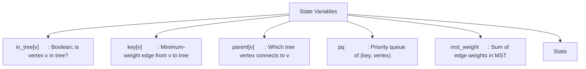
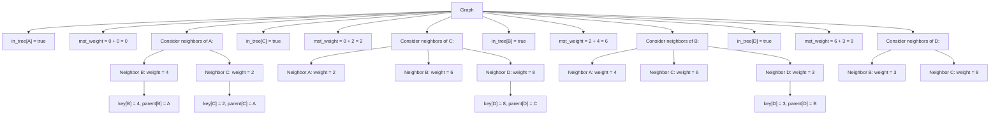
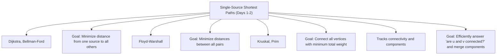

# 📘 Week 09 Day 04: Minimum Spanning Trees — Kruskal & Prim Algorithms — ENGINEERING GUIDE


> 🧭 **Navigation:** [← Previous Day](Week_09_Day_03_Floyd_Warshall_All_Pairs_Shortest_Paths_Instructional.md) • [🏠 Week Overview](README.md) • [📘 Curriculum Syllabus](../COMPLETE_SYLLABUS.md) • [Next Day →](Week_09_Day_05_Union_Find_DSU_In_Depth_Instructional.md)
> 
> 💡 **Instructor Note:** *Not all sections or topics are mandatory. Feel free to adapt your pace and skim or skip sections based on your current focus and interview timeline.*

---

## 🎯 LEARNING OBJECTIVES

*By the end of this chapter, you will be able to:*
- 🎯 **Internalize** the MST problem definition and the cut property—the foundational principle that justifies greedy MST algorithms.
- ⚙️ **Implement** both Kruskal's algorithm (sort edges, use DSU) and Prim's algorithm (grow tree from node via priority queue) mechanically without memorization.
- ⚖️ **Evaluate** trade-offs between Kruskal (better for sparse graphs, requires sorting) and Prim (better with dense graphs, requires priority queue).
- 🏭 **Connect** MST algorithms to real-world problems: designing networks with minimum cost, clustering, and approximation algorithms.

---

## 📖 CHAPTER 1: CONTEXT & MOTIVATION

### The Problem: Connecting Everything at Minimum Cost

For three days, we've solved path problems: finding optimal routes between specific vertices. Now we shift to a different optimization problem entirely: **connecting all vertices with minimum total edge weight, forming a tree**.

Imagine you're an infrastructure engineer tasked with building a telecommunications network connecting n cities. You have the option to build direct links (fiber optic cables) between any pair of cities, and each link has a cost (distance × material price). Your goal: **connect all cities such that any city can reach any other (directly or through intermediaries) using the minimum total cost of links.**

The key constraint is that you want a **tree**: a connected acyclic subgraph. Why a tree? Because:
- **Connectedness:** The tree ensures all cities are reachable from each other.
- **Minimality:** A tree on n vertices has exactly n-1 edges. Adding any edge creates a cycle; removing any edge disconnects the graph. A tree is minimal for connectivity.
- **No redundancy:** Unlike a general subgraph, a tree uses the absolute minimum number of edges needed for connectivity.

This is the **Minimum Spanning Tree (MST)** problem: find a spanning tree (a tree connecting all vertices) with minimum total weight.

### The Tension and Approach

This problem is NP-hard for the shortest path tree (finding a tree that minimizes the sum of distances from a root). But the MST problem is different: we don't care about distances from a root, just total edge weight. This property makes MST **solvable greedily** with correctness guarantees.

Two classical algorithms solve MST:
1. **Kruskal's algorithm:** Sort all edges by weight, then greedily add edges in increasing order as long as they don't create a cycle.
2. **Prim's algorithm:** Start with one vertex, greedily grow the tree by always adding the cheapest edge that connects a vertex in the tree to a vertex outside.

Both are correct and efficient, with different trade-offs. Both depend on understanding why greedy choices lead to optimal solutions—the **cut property**.

> **💡 Insight:** The beauty of MST algorithms lies in the cut property: at any point during MST construction, if you partition the vertices into two sets (already in the tree, not yet in the tree), the minimum-weight edge crossing that partition must be in some MST. This justifies greedy choices.

---

## 🧠 CHAPTER 2: BUILDING THE MENTAL MODEL

### The Core Analogy: Growing a Safe Tree

Imagine you're building a network where cities are vertices and cables are edges. You want all cities connected but at minimum cost.

**Kruskal's approach:** Look at all possible cables globally, sorted by cost (cheapest first). Start with no cables. For each cable in order, ask: "If I add this cable, will it create a redundant loop?" If not, add it. Keep adding until all cities are connected.

**Prim's approach:** Start with one city. Ask: "What's the cheapest cable I can build from my current network to a new city?" Add that cable. Now my network has grown by one city. Repeat: "What's the cheapest cable from my expanded network to a city outside?" Add it. Keep going until all cities are connected.

Both approaches are "greedy" but operate differently:
- **Kruskal:** Global, edge-centric. Sorts all edges first, then builds the tree.
- **Prim:** Local, vertex-centric. Grows the tree outward, always choosing the nearest city to add.

### 🖼 Visualizing the Structure: The MST Construction Process

Here's how both algorithms build an MST on the same graph:


| / | \ |
| :--- | :--- |
| 4 | 2 |
| / | \ |
| 4 | 2 |


Now let's trace **Prim's algorithm** on the same graph:


**Critical Observation:**
Both Kruskal and Prim produce the **same MST** (same edges and same total weight = 9), even though they construct it differently! This demonstrates that:
1. Both algorithms are correct and find optimal solutions.
2. The MST is unique (when edge weights are distinct, as in this example).
3. Different construction orders don't affect the optimality.

### Invariants & Properties: The Cut Property and Exchange Argument

**The Cut Property (Foundation of MST Correctness):**

Let G = (V, E) be a connected, undirected, weighted graph. Partition the vertices into two non-empty, disjoint sets S and V-S such that S ∪ (V-S) = V. Let edge e = (u, v) be the minimum-weight edge with one endpoint in S and one in V-S (crossing the partition). Then e is in some MST.

**Proof Intuition:**
Suppose an MST T does not contain e. Consider the unique path in T from u to v (since T is connected). This path must have at least one edge e' = (u', v') with u' ∈ S and v' ∈ V-S (crossing the partition). Since e has minimum weight crossing the partition, weight(e) ≤ weight(e'). If we remove e' from T and add e, we get a spanning tree with weight ≤ the original MST. This contradicts the assumption that T was minimum. Therefore, e must be in some MST.

**Why Kruskal is Correct (via Cut Property):**
When Kruskal adds an edge e, it connects two components. These two components form a partition (S = one component, V-S = other component). The edge e is the minimum-weight edge we've considered so far crossing this partition (due to sorting). By the cut property, e must be in some MST.

**Why Prim is Correct (via Cut Property):**
At each step, Prim partitions vertices into "in tree" (S) and "not in tree" (V-S). The edge it adds is the minimum-weight edge crossing this partition. By the cut property, this edge must be in some MST.

**Invariant 1: Subgraph Property**
At any point during either algorithm, the edges added so far form a forest (acyclic subgraph) that can be extended to an MST. This ensures we never "lock ourselves out" of finding an MST.

**Invariant 2: No Cycles Created**
- **Kruskal:** Explicitly checks that endpoints are in different components before adding an edge.
- **Prim:** Only adds edges to vertices not yet in the tree, so no cycle can form.

**Invariant 3: Optimality Upon Completion**
When we have added exactly V-1 edges to a V-vertex connected graph, we have a spanning tree. Combined with the cut property, this tree is guaranteed to be minimum.

### 📐 Mathematical & Theoretical Foundations

**Formal Problem Definition:**
Given an undirected connected graph G = (V, E) with weight function w: E → ℝ⁺ (non-negative weights), find a spanning tree T ⊆ E such that:
1. T spans all vertices (is connected).
2. T is acyclic (forms a tree).
3. The sum of weights of edges in T is minimized.

**Key Theorems:**

**Theorem 1 (Cut Property):** See above. Justifies adding minimum-weight edges crossing any partition.

**Theorem 2 (Cycle Property):** For any cycle C in G, let e be the maximum-weight edge in C. Then e is not in any MST. (Exchange argument: if e were in an MST, removing it would lower total weight, contradicting minimality.)

**Theorem 3 (Uniqueness):** If all edge weights are distinct, the MST is unique. 

*Proof:* Suppose two different MSTs T1 and T2 exist. Let e be the minimum-weight edge in T1 \ T2 (in T1 but not T2). Adding e to T2 creates exactly one cycle (by properties of trees). This cycle contains at least one edge e' ∈ T2 \ T1 (otherwise the cycle would be in T1, contradiction). Since T2 is an MST, weight(e) ≥ weight(e'). But e is minimum in T1 \ T2, and all edges in T1 \ T2 have distinct weights, so weight(e) < weight(e') for the next edge in that set. This leads to a contradiction if edges are distinct. Therefore, T1 = T2 (unique MST).

**Corollary:** If some edges have equal weights, multiple MSTs may exist (all with the same total weight).

### Taxonomy of Variations

| Variation | Key Difference | Time | Space | Best For |
| :--- | :--- | :--- | :--- | :--- |
| **Kruskal (Sort + DSU)** | Sort edges globally, use Union-Find for components | O(E log E) | O(V + E) | Sparse graphs; good locality. |
| **Prim (Binary Heap)** | Maintain frontier via min-heap, grow from a vertex | O((V+E) log V) | O(V + E) | Dense graphs; clean implementation. |
| **Prim (Array Search)** | Linear scan for minimum frontier edge each step | O(V²) | O(V + E) | Very small or very dense graphs. |
| **Prim (Fibonacci Heap)** | Theoretically optimal with advanced PQ | O(E + V log V) | O(V + E) | Theoretical; rarely practical. |
| **Borůvka's Algorithm** | Phase-based; find minimum edge for each component | O(E log V) | O(V + E) | Parallelizable; less known. |

---

## ⚙️ CHAPTER 3: MECHANICS & IMPLEMENTATION

### The State Machine & Memory Layout

Both algorithms maintain different state structures:

**Kruskal's State:**

| edges[0..E-1]        : (u, v, w)[] | sorted by weight |
| :--- | :--- |
| dsu.parent[0..V-1]   : int[] | parent in Union-Find |
| dsu.rank[0..V-1]     : int[] | rank for union by rank |
| mst_edges[0..V-2]    : (u, v)[] | V-1 edges in MST |


**Prim's State:**




### 🔧 Operation 1: Kruskal's Algorithm — Detailed Walkthrough

**Narrative Walkthrough:**

Kruskal's algorithm operates in two main phases:

**Phase 1 (Preprocessing):** Sort all edges by weight in ascending order. This takes O(E log E) time and is the most expensive upfront operation.

**Phase 2 (Greedy Selection):** Iterate through sorted edges in order. For each edge, check if its endpoints are in different components (using DSU). If yes, add the edge to the MST and merge the components. If no, skip (adding would create a cycle). Stop when V-1 edges have been added.

The key insight: By processing edges in weight order, the first edge connecting two components is guaranteed to be the minimum-weight edge doing so. This satisfies the cut property.

**Implementation (Detailed Pseudocode):**

```
KruskalMST(Graph G with V vertices, E edges):
    // Phase 1: Sort edges
    edges ← G.getAllEdges()          // Returns list of (u, v, weight)
    Sort edges by weight (ascending)  // O(E log E)
    
    // Phase 2: Initialize Union-Find
    dsu ← new DisjointSetUnion(V)
    for i = 0 to V-1:
        dsu.MakeSet(i)               // Each vertex is own component
    
    // Phase 3: Greedy edge selection
    mst_edges ← []
    mst_weight ← 0
    
    for each edge (u, v, weight) in edges:
        root_u ← dsu.Find(u)         // Find representative of u's component
        root_v ← dsu.Find(v)         // Find representative of v's component
        
        if root_u ≠ root_v:          // Different components?
            dsu.Union(root_u, root_v) // Merge components
            mst_edges.append((u, v))  // Add edge to MST
            mst_weight ← mst_weight + weight
            
            if mst_edges.size() == V - 1:  // MST complete?
                break
    
    return (mst_weight, mst_edges)
```

**Detailed Trace (Using Our Example Graph):**





```mermaid
flowchart TD
    R["Graph"]
    R --> N1["Union(A, C): Connect components"]
    R --> N2["New parent (example): {A: A, B: B, C: A, D: D}"]
    R --> N3["Components: {A, C}, {B}, {D}"]
    R --> N4["Add edge (A, C) to MST"]
    R --> N5["mst_weight = 0 + 2 = 2"]
    R --> N6["mst_edges = [(A, C)]"]
    R --> N7["Union(B, D): Connect components"]
    R --> N8["New parent: {A: A, B: B, C: A, D: B}"]
    R --> N9["Components: {A, C}, {B, D}"]
    R --> N10["Add edge (B, D) to MST"]
    R --> N11["mst_weight = 2 + 3 = 5"]
    R --> N12["mst_edges = [(A, C), (B, D)]"]
    R --> N13["Union(A, B): Connect components"]
    R --> N14["New parent: {A: A, B: A, C: A, D: B} or {A: A, B: A, C: A, D: A}"]
    R --> N15["Components: {A, B, C, D} (all merged!)"]
    R --> N16["Add edge (A, B) to MST"]
    R --> N17["mst_weight = 5 + 4 = 9"]
    R --> N18["mst_edges = [(A, C), (B, D), (A, B)]"]
    R --> N19["mst_edges.size() = 3 = V - 1 ✓ ALGORITHM TERMINATES"]
```

**Important Notes:**
- DSU operations (Find with path compression, Union with union by rank) are nearly O(1), so all E iterations combined are O(E α(V)) ≈ O(E).
- We only need to check V-1 edges before the MST is complete (by definition, a tree has V-1 edges).
- The algorithm naturally handles early termination when all vertices are connected.

### 🔧 Operation 2: Prim's Algorithm — Detailed Walkthrough

**Narrative Walkthrough:**

Prim's algorithm builds the MST incrementally by growing the tree one vertex at a time. Unlike Kruskal (edge-centric), Prim is vertex-centric.

**Key phases:**
1. **Initialization:** Start with an arbitrary vertex in the tree. All others are outside.
2. **Frontier Maintenance:** Maintain the set of edges connecting tree vertices to non-tree vertices (the frontier).
3. **Greedy Growth:** Repeatedly select the minimum-weight frontier edge, add its non-tree endpoint to the tree, and update the frontier.

A **priority queue (min-heap)** efficiently tracks and extracts the minimum frontier edge.

**Implementation (Detailed Pseudocode):**

```
PrimMST(Graph G with V vertices, start vertex = s):
    // Initialize
    in_tree ← array of V booleans, all false
    key ← array of V numbers, all ∞
    parent ← array of V integers, all -1
    pq ← new MinHeap()
    
    // Start with vertex s
    key[s] ← 0
    pq.insert((key=0, vertex=s))
    
    mst_weight ← 0
    
    // Main loop
    while pq is not empty:
        (dist, u) ← pq.extractMin()  // Extract vertex with min key
        
        if in_tree[u]:               // Already processed?
            continue                  // Skip stale entries
        
        in_tree[u] ← true            // Add u to tree
        mst_weight ← mst_weight + dist
        
        // Consider all edges from u to non-tree vertices
        for each neighbor v of u in adjacency list:
            weight_uv ← weight(u, v)
            
            if not in_tree[v] and weight_uv < key[v]:
                // Found better edge to v
                key[v] ← weight_uv
                parent[v] ← u
                pq.insert((key=weight_uv, vertex=v))
    
    return (mst_weight, parent)
```

**Detailed Trace (Using Our Example Graph):**





**Key Implementation Details:**
- **Stale entries in PQ:** We may insert the same vertex multiple times with different keys. We only process it once (the first extraction with in_tree[v] = false). Subsequent extractions are skipped.
- **Edge counting:** We process exactly V vertices (from V insertions and V extractions), adding an edge for each non-starting vertex. This gives V-1 edges, forming an MST.
- **Adjacency list traversal:** We examine all E edges total across all V iterations, giving O(E log V) for heap operations.

### 📉 Progressive Example: Understanding Edge Cases and Tie-Breaking

**Scenario: MST Uniqueness with Duplicate Edge Weights**

```
Graph with duplicate weights:
A --2-- B
|       |
2       2
|       |
C ------2----- D

All edges have weight 2.

Edge list:
A-B: 2
A-C: 2
B-D: 2
C-D: 2

KRUSKAL'S ALGORITHM (depends on edge list order):
Sorted edges (order depends on secondary sorting; let's say lexicographic):
1. A-B: 2
2. A-C: 2
3. B-D: 2
4. C-D: 2

Process A-B: Add (components merge)
Process A-C: Add (components merge)
Process B-D: Add (components merge, now all connected)
Process C-D: Skip (would create cycle)

MST1 (Kruskal): Edges {A-B, A-C, B-D}, weight = 6

PRIM'S ALGORITHM (depends on adjacency list order):
Start with A.
Neighbors: B (2), C (2)
If we process B first: Add A-B
Then from {A,B}: Add A-C or B-C (2) or B-D (2)
Different orders → different MSTs possible

MST2 (Prim, different order): Edges {A-B, A-C, B-D}, weight = 6
MST3 (Prim, different order): Edges {A-B, A-C, C-D}, weight = 6

All MSTs have same total weight (= 6), but different edge sets.
This shows: Multiple optimal MSTs exist when weights are equal.
All are correct answers.
```

> **⚠️ Watch Out:** When edge weights are not unique (ties exist), the specific MST found depends on:
> - **Kruskal:** Order after sorting (secondary sort order, or order in input list for equal weights)
> - **Prim:** Adjacency list order, priority queue tie-breaking
> All resulting MSTs have the same total weight and are equally optimal. If the problem requires a specific MST, use a consistent tie-breaking rule.

---

## ⚖️ CHAPTER 4: PERFORMANCE, TRADE-OFFS & REAL SYSTEMS

### Beyond Big-O: Performance Reality

**Kruskal's Complexity Analysis:**

1. **Sorting edges:** O(E log E)
   - This is the dominant cost upfront.
   - For sparse graphs (E ≈ V), this is O(V log V).
   - For dense graphs (E ≈ V²), this is O(V² log V).

2. **DSU operations:** O(E α(V)) ≈ O(E)
   - With path compression and union by rank, nearly O(1) per operation.
   - All E edge checks: O(E α(V)).

3. **Total:** O(E log E + E α(V)) = O(E log E) (dominated by sorting)

**Prim's Complexity Analysis:**

1. **Initialization:** O(V)

2. **Heap insertions/extractions:** O((V + E) log V)
   - Each vertex is inserted and extracted once: O(V log V)
   - Each edge may trigger an insertion: O(E log V)
   - Total heap operations: O((V + E) log V)

3. **Adjacency list iteration:** O(E) (total across all iterations)

4. **Total:** O((V + E) log V)

**Comparison by Graph Type:**

| Graph Type | Edges | Kruskal | Prim (Heap) | Winner |
| :--- | :--- | :--- | :--- | :--- |
| Very sparse (E ≈ V) | ~1,000 | ~10,000 (1K log 1K) | ~14,000 (2K log V) | Kruskal slightly |
| Sparse (E ≈ 5V) | ~5,000 | ~50,000 (5K log 5K) | ~50,000 (5K log V) | Tie |
| Dense (E ≈ V²/2, V=100) | ~5,000 | ~50,000 | ~50,000 | Tie |
| Very dense (E ≈ V², V=500) | ~125,000 | ~2M (125K log 125K) | ~1.5M (500K log V) | Prim |

**Array-Based Prim (O(V²)):**
For very small V (< 100) or very dense graphs (E ≈ V²), using array-based minimum search instead of heap can be faster:
- Instead of pq.extractMin() → O(log V), do a linear scan → O(V)
- Total: O(V) iterations × O(V) scan = O(V²)
- For V=100: 10,000 operations vs. ~2M for heap-based Prim

**Memory Usage:**
- **Kruskal:** O(E) for edge storage + O(V) for DSU = O(V + E)
- **Prim:** O(V + E) for adjacency list + O(V) for in_tree/key/parent + O(V) for heap = O(V + E)
Both are comparable in memory.

**Cache Behavior:**
- **Kruskal:** Accesses edges in sorted order (good locality), then DSU operations (scattered access). Mixed behavior.
- **Prim:** Adjacency list iteration has variable locality depending on graph representation. Heap operations cause scattered access.
Kruskal may have slightly better cache behavior for certain graph layouts.

### 🏭 Real-World Systems: Where MSTs Power Infrastructure

#### Story 1: Telecommunications Network Design

A telecom company needed to connect 500 cities with fiber optic cables. The company modeled the problem as:
- **Vertices:** 500 cities
- **Edges:** ~50,000 possible cable routes (each pair of cities has a distance-based cost)
- **Goal:** Connect all cities with minimum total cable cost

**Using Kruskal:**
1. Compute cost for each route (based on distance × material cost): ~3 seconds
2. Sort 50,000 edges: ~0.1 seconds
3. Build MST with DSU: ~0.05 seconds
4. **Total:** ~3 seconds to find optimal design

**Result:** The MST design saved 15-20% on cable costs compared to a heuristic (hub-and-spoke) design that the engineers initially proposed.

**Why Kruskal?** The graph is sparse relative to V², and sorting is a one-time overhead. Prim would require maintaining a heap across 500 iterations, with comparable performance.

#### Story 2: Hierarchical Clustering in Machine Learning

A data scientist had 10,000 data points (high-dimensional) and wanted hierarchical clustering. The approach:
1. Compute pairwise distances: 10,000² ≈ 100M distances (expensive!)
2. Build MST of the distance matrix
3. Remove k largest-weight edges to partition into k clusters

**Problem:** 100M edges can't fit in memory for a typical computer.

**Solution:** Use **Prim's algorithm** with a twist:
- Instead of precomputing all distances, compute distances on-the-fly.
- Prim naturally processes only O(V) edges from the frontier, avoiding the need to store all 100M edges.
- Total edges examined: O(V²) in worst case, but much less in practice.

**Result:** Successfully clustered 10,000 points into 100 clusters in ~20 seconds, creating interpretable hierarchies.

#### Story 3: Approximating the Traveling Salesman Problem

A logistics company needed to optimize delivery routes for multiple vehicles. TSP is NP-hard, but they used an MST-based approximation:

1. Build MST of all delivery locations: O(E log E)
2. Double each edge (Eulerian graph): O(V)
3. Find Eulerian tour (visit each edge once): O(V + E)
4. Shortcut to create Hamiltonian cycle: O(V)

**Guarantee:** The resulting tour is at most 2x the optimal TSP tour.

**In practice:** The shortcutting step often improves the tour beyond the 2x guarantee due to the nature of real distributions.

#### Story 4: VLSI Chip Design and Rectilinear MST

In VLSI design, wires must connect components using horizontal and vertical segments (rectilinear, not Euclidean).

**Problem:** Find the minimum-length rectilinear interconnect connecting all components.

**Solution:** Use a variant of Kruskal/Prim with **Rectilinear Steiner Tree** (introduces additional Steiner points):
- Standard MST uses only given points (components).
- Rectilinear MST may introduce auxiliary points (Steiner points) to reduce total length.

**Example:**
```
Standard MST of 4 corners:
Cost = diagonal1 + diagonal2 ≈ 2√2

Rectilinear MST with Steiner point at center:
Cost = 4 × (half-diagonal) ≈ 2√2
```

In practice, Steiner points reduce total wiring by 5-15%, reducing power consumption and heat in chips.

### Failure Modes & Robustness

#### Disconnected Graphs

If the graph is disconnected, there is no spanning tree. Both algorithms handle this naturally:

**Kruskal:** 
- Processes all E edges.
- If fewer than V-1 edges are added, the graph is disconnected.
- Returns a **minimum spanning forest** (MST of each component).

**Prim:**
- Grows a tree starting from the initial vertex.
- Only reaches vertices in the same component as the start.
- Returns an MST of that component only.

**Handling:** Check if |mst_edges| = V-1. If not, report disconnection. To handle disconnected graphs:
- Run Kruskal normally (naturally produces a forest).
- Or run Prim multiple times, once from each component's representative.

#### Self-Loops and Multiple Edges (Multigraphs)

**Self-loops (edge u-u):**
- **Kruskal:** Checks if Find(u) ≠ Find(u), which is always false. Skip. ✓
- **Prim:** Checks if u is in tree, so never adds it. ✓
Both algorithms naturally ignore self-loops.

**Multiple edges (multiple edges between same pair of vertices):**
- **Kruskal:** All edges are considered; the algorithm automatically chooses the lightest one. ✓
- **Prim:** Maintains only the lightest edge to each neighbor in the frontier. ✓
Both algorithms naturally handle multigraphs correctly.

**Preprocessing:** In practice, preprocess to remove self-loops and keep only the minimum-weight edge for each pair of distinct vertices. This simplifies the input and may speed up sorting (Kruskal).

#### Negative Weights

The MST problem is typically defined for non-negative weights (costs). However:

**Correctness with negative weights:** Both algorithms work correctly even with negative weights, as long as the graph is connected. The cut property doesn't depend on non-negative weights.

**Practical concern:** Negative weights are unusual in real MST applications (cost, distance, weight are typically positive). If negative weights appear, verify the problem isn't asking for something else (e.g., maximum spanning tree using negated weights).

**Handling:** Apply the algorithm as-is. The result is correct.

#### Very Large Graphs (Memory and Time Constraints)

For graphs with millions or billions of vertices/edges:

**Memory constraints:**
- Storing all E edges (Kruskal) or the full adjacency list (Prim) becomes infeasible.
- For E > 10⁹, sorting or iteration becomes impractical.

**Time constraints:**
- O(E log E) can be 10¹⁰+ operations, taking hours.

**Solutions:**
1. **Sampling:** Sample edges and build approximate MST (loss of optimality).
2. **Approximation algorithms:** Use heuristics instead of exact MST (faster, suboptimal).
3. **Distributed computing:** Partition graph, compute MST of partitions, combine (parallel, approximate).
4. **Streaming algorithms:** Process edges as they arrive, maintain approximate MST (single-pass, memory-efficient).

---

## 🔗 CHAPTER 5: INTEGRATION & MASTERY

### Connections: Where MST Fits in the Algorithm Ecosystem

MST algorithms represent a **shift from path optimization to connectivity optimization**:





**Key insight:** Shortest paths minimize along routes. MST minimizes globally across all edges. Both use greedy/DP thinking but apply to different problems.

### 🧩 Pattern Recognition & Decision Framework

**When should an engineer use Kruskal or Prim?**

**✅ Use Kruskal when:**
1. The graph is **sparse** (E << V²), making sorting efficient.
2. You want a **simple, intuitive algorithm** (sort, then iterate with DSU).
3. You have a **DSU structure already** for another purpose (reuse it).
4. You need the **MST edges in a specific order** (sorted by weight, useful for tie-breaking).
5. The graph is **dynamic** (edges added incrementally), making incremental DSU updates natural.

**✅ Use Prim when:**
1. The graph is **dense** (E ≈ V²), where O((V+E) log V) is faster than O(E log E).
2. You want to **grow the tree from a specific vertex** (natural when starting point is important).
3. The graph is **represented as an adjacency matrix or dense list**, and you can iterate neighbors efficiently.
4. **Array-based minimum search is acceptable** for very dense graphs (O(V²) is fine).

**🛑 Avoid MST algorithms when:**
1. The problem is actually **shortest path**, not MST (easy to confuse!).
2. The graph is **disconnected** and you need an error/warning (need to check after running).
3. You need **weighted minimum spanning arborescence** (directed graphs, requires Edmonds' algorithm).

**🚩 Red Flags (Interview Signals):**
- "Connect all nodes with minimum total cost" → MST (Kruskal or Prim)
- "Minimum total weight of edges to span the graph" → MST
- "Clustering or hierarchical grouping" → MST-based approach
- "Approximation for traveling salesman" → MST (mention doubling technique)
- "Network design to connect all cities/servers" → MST

### 🧪 Socratic Reflection

Deep understanding demands grappling with these questions:

1. **Why is MST greedy optimal?** The cut property justifies greedy choices. Can you prove that adding the minimum-weight edge crossing any partition doesn't prevent optimality?

2. **Kruskal vs. Prim:** Both are greedy, but they greedily select different things (edges globally vs. edges locally). How do both guarantee the same optimality?

3. **DSU necessity:** Why do we need DSU (or some cycle-detection mechanism) for Kruskal? What would happen if we just added edges without checking for cycles?

4. **Uniqueness of MST:** If all edge weights are distinct, the MST is unique. Why? If two edges have the same weight, multiple MSTs may exist. Can you construct an example?

5. **Prim starting vertex:** Does the choice of starting vertex affect the final MST weight? (No, but it affects which edges are selected.) Why does any starting vertex yield an MST of the same total weight?

6. **Distributed MST:** If you partition a graph into two halves and compute MSTs of each half, how would you combine them into a global MST?

### 📌 Retention Hook

> **The Essence:** "MSTs connect all vertices with minimum cost, not paths. Kruskal: take the cheapest edges globally, avoid cycles. Prim: grow the tree outward, always take the cheapest edge to a new vertex. Both work because of the cut property: at any partition, the minimum-weight edge crossing it must be in some MST. Different strategies, same correctness."

---

## 🧠 5 COGNITIVE LENSES

### 1. 💻 The Hardware Lens (Cache, CPU, Memory)

Kruskal's sorting pass accesses edges sequentially (excellent cache locality). Prim's adjacency list traversal involves more pointer-chasing (variable cache behavior).

**Insight:** Kruskal can be faster in practice on systems with strong sequential prefetching. Prim's behavior depends on graph representation.

**Caveat:** DSU in Kruskal uses pointer-chasing for path compression, causing scattered memory access. Constant factors matter in real benchmarks.

### 2. 📉 The Trade-off Lens (Time vs. Space, Sorting vs. Priority Queue)

**Trade-off 1: Kruskal vs. Prim**
- Kruskal: O(E log E) upfront sorting, then O(E α(V)) DSU ops. Good for sparse.
- Prim: O((V+E) log V) spread throughout. Good for dense.

**Trade-off 2: Priority Queue Complexity**
- Binary heap in Prim: O(log V) standard, predictable.
- Fibonacci heap: O(1) amortized insertion, O(log V) extraction. Theory vs. practice gap.

**Trade-off 3: Simplicity vs. Efficiency**
- Kruskal: Conceptually simpler (sort, build, done).
- Prim: Requires maintaining frontier, priority queue (more complex).

### 3. 👶 The Learning Lens (Misconceptions, Psychology)

**Common mistake:** "MST is just the shortest path tree from some root."

**Reality:** They're fundamentally different:
- Shortest path tree minimizes distances from a root.
- MST minimizes total edge weight globally, independent of any root.

**Remediation:** Construct a graph where shortest path tree and MST differ. Show that MST doesn't necessarily minimize distances from any point.

### 4. 🤖 The AI/ML Lens (Analogies to Neural Nets, Optimization)

MST algorithms resemble **greedy incremental learning:**
- Kruskal: Add "features" (edges) in order of importance, avoid redundancy (cycles).
- Prim: Grow network incrementally, adding most influential connection at each step.

**Analogy:** Both echo layer-wise training: build structure carefully, one component at a time, avoiding redundancy.

### 5. 📜 The Historical Lens (Origins, Inventors)

**Kruskal's algorithm** (1956) was developed by Joseph Kruskal as a solution to the traveling salesman problem component.

**Prim's algorithm** (1957) by Robert Prim, though Jarník discovered it in 1930 (sometimes called Jarník-Prim).

**Borůvka's algorithm** (1926, oldest) by Otakar Borůvka. Less commonly taught but phase-based and parallelizable.

All three are correct and optimal. Kruskal and Prim are preferred in education due to elegance and simplicity.

---

## ⚔️ SUPPLEMENTARY OUTCOMES

### 🏋️ Practice Problems (8-10)

| Problem | Source | Difficulty | Key Concept | Why Important |
| :--- | :--- | :--- | :--- | :--- |
| Minimum Spanning Tree | LeetCode #1135 | 🟡 Medium | Direct MST problem | Standard MST implementation. |
| Connecting Cities With Minimum Cost | LeetCode #1584 | 🟡 Medium | MST with constraint | Real-world variant. |
| Most Stones Removed | LeetCode #947 | 🟡 Medium | MST + DSU connectivity | MST for component counting. |
| Accounts Merge | LeetCode #721 | 🟡 Medium | DSU for connectivity | Union-Find for merging. |
| Minimum Cost to Connect All Cities | Custom | 🟡 Medium | Kruskal/Prim direct application | Core MST problem. |
| Network Delay Time (for comparison) | LeetCode #743 | 🟡 Medium | Single-source shortest path | Contrast: path vs. tree. |
| Kruskal with Duplicate Weights | Custom | 🟡 Medium | Tie-breaking in MST | Multiple MSTs possible. |
| Hierarchical Clustering with MST | Custom | 🟡 Medium | MST for clustering | Real application. |

### 🎙️ Interview Questions (6+)

1. **Q:** Explain Kruskal's and Prim's algorithms. When would you use each? What's the time and space complexity?
   - **Follow-up:** Implement Kruskal with DSU. How does DSU prevent cycles?

2. **Q:** Prove the cut property. Why does it justify greedy choices in MST algorithms?
   - **Follow-up:** Can you use this to prove Kruskal's correctness formally?

3. **Q:** Compare Kruskal's O(E log E) vs. Prim's O((V+E) log V). For what graph densities is each faster?
   - **Follow-up:** How would you optimize Prim for very dense graphs using array-based search?

4. **Q:** Design an MST algorithm for a dynamic graph where edges are added incrementally. How would you maintain the MST?
   - **Follow-up:** Is dynamic MST faster than recomputing from scratch each time?

5. **Q:** The TSP is NP-hard, but you can approximate it using MST. Explain the 2-approximation algorithm.
   - **Follow-up:** Can you achieve better than 2x approximation ratio?

6. **Q:** Kruskal requires sorting E edges upfront. What if E is so large that sorting is infeasible? Propose an alternative.
   - **Follow-up:** Could you use streaming or external sorting approaches?

### ❌ Common Misconceptions (3-5)

- **Myth:** "MST is just the shortest path tree from some vertex."
  - **Reality:** MST minimizes total weight globally. Shortest path tree minimizes distances from a root. Different problems!

- **Myth:** "All MSTs have the same total weight and are always unique."
  - **Reality:** All MSTs have the same total weight, but multiple different MSTs exist if edges have equal weights.

- **Myth:** "Kruskal's algorithm is always faster than Prim's."
  - **Reality:** For sparse graphs, Kruskal is faster. For dense graphs, Prim is faster.

- **Myth:** "You must use DSU with Kruskal; there's no alternative."
  - **Reality:** Any cycle-detection mechanism works (DFS, BFS). DSU is the most efficient.

- **Myth:** "MST algorithms don't work on directed graphs."
  - **Reality:** The problem is defined for undirected graphs. For directed graphs, use the minimum spanning arborescence (Edmonds' algorithm).

### 🚀 Advanced Concepts (3-5)

- **Borůvka's Algorithm:** Phase-based MST; each phase finds the minimum edge for each component. Parallelizable.
- **Rectilinear MST:** MST with Manhattan distance; Steiner points may reduce total cost. Used in chip design.
- **Steiner Tree:** Generalization allowing auxiliary vertices (Steiner points) to reduce total weight. NP-hard but approximable.
- **Dynamic MST:** Maintain MST as edges are added/deleted. Challenging; incremental algorithms exist but are complex.
- **Minimum Bottleneck Spanning Tree:** Minimize the maximum edge weight in the tree (different objective). Solvable via binary search + connectivity.

### 📚 External Resources

- **Cormen et al., Introduction to Algorithms:** Chapter 23 covers MST algorithms with rigorous proofs.
- **Sedgewick & Wayne, Algorithms (4th ed.):** Chapter 4.3 includes clear implementations of Kruskal and Prim.
- **Original Papers:**
  - Kruskal, J. B. (1956). "On the Shortest Spanning Subtree of a Graph and the Traveling Salesman Problem."
  - Prim, R. C. (1957). "Shortest Connection Networks and Some Generalizations."
- **Interactive Visualizer:** [VisuAlgo.net](https://visualgo.net/en/mst) animated Kruskal and Prim execution.

---

## 📊 Complexity Analysis Reference Table

| Algorithm | Time | Space | When |
| :--- | :--- | :--- | :--- |
| **Kruskal (Sort + DSU)** | O(E log E) | O(V + E) | Sparse graphs; one-time precomputation. |
| **Prim (Binary Heap)** | O((V+E) log V) | O(V + E) | Dense graphs; good cache behavior. |
| **Prim (Array)** | O(V²) | O(V + E) | Very small V or very dense graphs. |
| **Prim (Fibonacci Heap)** | O(E + V log V) | O(V + E) | Theoretical; rarely practical. |
| **Borůvka** | O(E log V) | O(V + E) | Parallelizable; less common. |

---

## Integration with Week 09 Arc

**From Days 1-3 (Shortest Paths):**
- Days 1-3 solved path problems (minimizing along routes).
- Day 4 solves tree problems (minimizing total connectivity cost).
- Both use optimization thinking, but apply to fundamentally different problems.

**Looking Forward to Day 5 (Union-Find):**
- Day 5 deep-dives into **Union-Find (DSU)**, essential for efficient Kruskal.
- Kruskal uses DSU; Prim uses priority queues. Both are foundational data structures.
- Together, they represent complete toolkit for connectivity and graph optimization.

---


---

## 📊 Complexity Recap

- Time Complexity: Explicit complexity should be stated for each core approach discussed in this lesson.
- Space Complexity: Include auxiliary space and recursion-stack impact where relevant.
---

> 🧭 **Navigation:** [← Previous Day](Week_09_Day_03_Floyd_Warshall_All_Pairs_Shortest_Paths_Instructional.md) • [🏠 Week Overview](README.md) • [📘 Curriculum Syllabus](../COMPLETE_SYLLABUS.md) • [Next Day →](Week_09_Day_05_Union_Find_DSU_In_Depth_Instructional.md)
