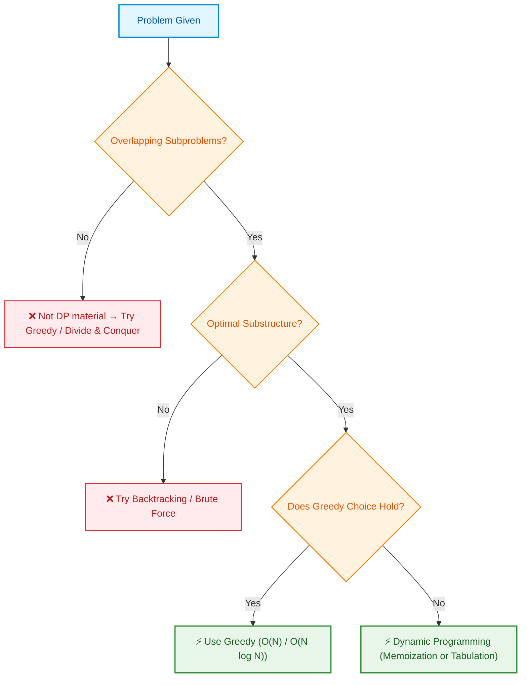
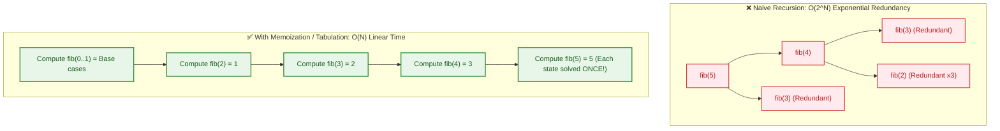
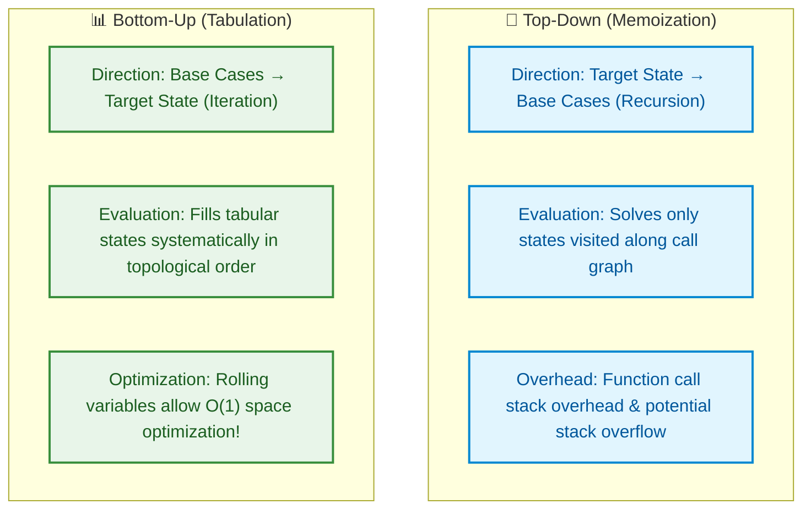
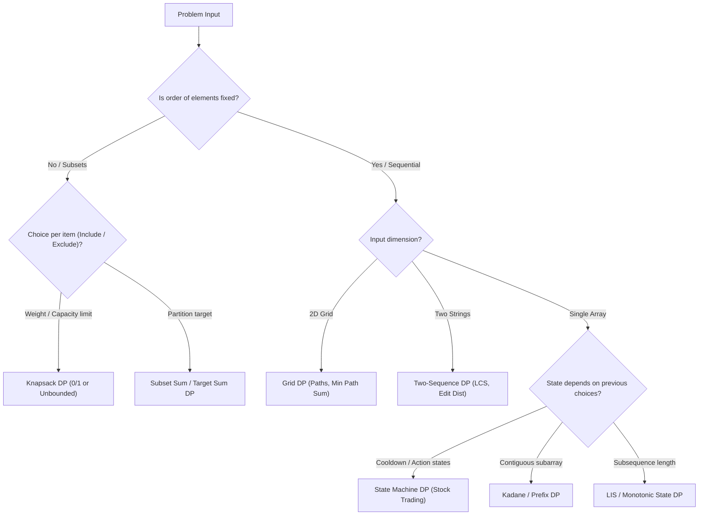
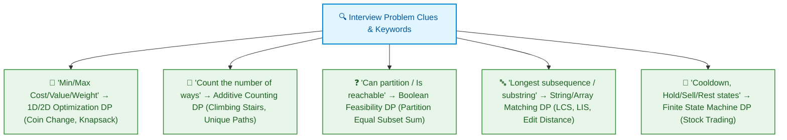
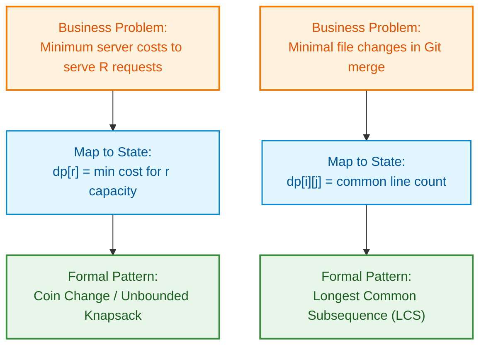

# 📊 WEEK 10: DYNAMIC PROGRAMMING I - VISUAL CONCEPTS PLAYBOOK (HYBRID)

> 🧭 **Navigation:** [🏠 Week Overview](README.md) • [📘 Curriculum Syllabus](../COMPLETE_SYLLABUS.md)
> 
> 💡 **Instructor Note:** *This Visual Playbook provides a high-density, integrated synthesis. Not all sections are mandatory; use it as a modular reference to solidify invariants and review pattern transitions.*

---

**Document Type:** Visual Learning Resource & Reference Guide
**Scope:** Week 10 (Days 01-05) — Dynamic Programming Fundamentals
**Target:** Visual learners, quick reference, concept reinforcement

---

## 📑 TABLE OF CONTENTS

1. **Visual Concept Maps** — Big-picture relationships
2. **Algorithm Flow Diagrams** — Step-by-step execution
3. **DP Table Visualizations** — State evolution
4. **Comparison Charts** — Trade-offs and patterns
5. **Decision Trees** — Problem-solving pathways
6. **Complexity Cheat Sheets** — Time/Space reference
7. **Pattern Recognition Guide** — Visual signatures
8. **Real-World Application Maps** — Where DP applies

---

## 🗺️ PART 1: VISUAL CONCEPT MAPS

### 1.1 The DP Landscape — Week 10 Overview


### 📌 🗺️ Week 10: Dynamic Programming Fundamentals

- 📅 Day 1: Recursion & Memoization (Top-Down vs Bottom-Up)
- 📅 Day 2: 1D Dynamic Programming (House Robber, Coin Change)
- 📅 Day 3: 2D Grid DP (Unique Paths, Minimum Path Sum)
- 📅 Day 4: Subsequence & Knapsack (LIS, 0/1 Knapsack)
- 📅 Day 5: State Machine DP (Stock Trading with Cooldown)


### 1.2 The Four Pillars of DP (Conceptual Foundation)


### 📌 🏛️ The Four Pillars of Dynamic Programming

- 1️⃣ Optimal Substructure<br/>Global optimal solution can be constructed from optimal sub-solutions
- 2️⃣ Overlapping Subproblems<br/>Same state sub-problems are evaluated multiple times across recursion
- 3️⃣ Precise State Definition<br/>dp[i][j] uniquely captures minimal parameters needed to make decisions
- 4️⃣ Transition & Base Cases<br/>Mathematical recurrence relation and terminating base cases


### 1.3 DP Approach Selection Tree





---

## 🔄 PART 2: ALGORITHM FLOW DIAGRAMS

### 2.1 Fibonacci — Exponential to Polynomial Transformation





### 2.2 Climbing Stairs — DP Progression Visualization

```
Problem: n=4 stairs, can take 1 or 2 steps

DP Table Evolution:

Step 0: Initialize
        dp = [0, 0, 0, 0, 0]
        Meaning: dp[i] = ways to reach stair i

Step 1: Base cases
        dp[0] = 1  (one way: be at start)
        dp[1] = 1  (one way: take 1 step)
        dp = [1, 1, 0, 0, 0]

Step 2: Fill i=2
        Can come from: stair 0 (take 2 steps) or stair 1 (take 1 step)
        dp[2] = dp[1] + dp[0] = 1 + 1 = 2
        Paths: {1+1, 2}
        dp = [1, 1, 2, 0, 0]

Step 3: Fill i=3
        Can come from: stair 1 (take 2 steps) or stair 2 (take 1 step)
        dp[3] = dp[2] + dp[1] = 2 + 1 = 3
        Paths: {1+1+1, 1+2, 2+1}
        dp = [1, 1, 2, 3, 0]

Step 4: Fill i=4
        Can come from: stair 2 (take 2 steps) or stair 3 (take 1 step)
        dp[4] = dp[3] + dp[2] = 3 + 2 = 5
        Paths: {1+1+1+1, 1+1+2, 1+2+1, 2+1+1, 2+2}
        dp = [1, 1, 2, 3, 5]

Answer: dp[4] = 5 ways to climb 4 stairs
```

### 2.3 0/1 Knapsack — Decision Tree & DP Table

```
Problem: Items = [(weight:2, value:3), (weight:3, value:4)], Capacity = 5

Decision Tree (Exhaustive):

                        Root (cap=5)
                         /        \
                    Take Item 0  Skip Item 0
                     /              \
                (w=2, v=3)        (cap=5)
                cap=3              /        \
                /      \       Take Item 1  Skip Item 1
            Take Item 1  Skip   (w=3,v=4)   (no items left)
            (w=3,v=4)  Item 1  cap=2          value=0
            cap=0      (cap=3)   /    \
          (can't)      /    \  Take  Skip
                   Take  Skip Item 1 Item 1
                   ...   ...   (w=3)   (no cap)
                                (impossible)
                                value=4

              Paths (subsets):
              Path 1: Take both → total weight=5, value=7 ✓
              Path 2: Take item 0 only → weight=2, value=3 ✓
              Path 3: Take item 1 only → weight=3, value=4 ✓
              Path 4: Take neither → weight=0, value=0 ✓

DP Table (Bottom-Up):

        capacity →  0   1   2   3   4   5
        items ↓
           0        0   0   3   3   3   3   (item 0: w=2, v=3)
           1        0   0   3   4   4   7   (item 1: w=3, v=4)

Explanation:
- dp[0][0:2] = 0 (item 0 doesn't fit)
- dp[0][2:] = 3 (item 0 fits; value=3)
- dp[1][0:3] = previous row (item 1 doesn't fit)
- dp[1][3] = max(dp[0][3], 4 + dp[0][0]) = max(3, 4) = 4
- dp[1][5] = max(dp[0][5], 4 + dp[0][2]) = max(3, 4+3) = 7 ✓

Answer: dp[1][5] = 7 (take both items)
```

---

## 📊 PART 3: DP TABLE VISUALIZATIONS

### 3.1 Edit Distance (Levenshtein) — Complete State Evolution

```
Transform "CAT" → "DOG"  (Minimum edits needed)

Initial DP Table (with base cases):

         ""  D   O   G
    ""   0   1   2   3    (insert all of DOG)
    C    1   ?   ?   ?
    A    2   ?   ?   ?
    T    3   ?   ?   ?

Filling Row by Row:

Row 1 (C):
    (1,1): C≠D, so min(0+1, 1+1, 1+1) = 1  (replace C→D)
    (1,2): C≠O, so min(1+1, 2+1, 1+1) = 2  
    (1,3): C≠G, so min(2+1, 3+1, 2+1) = 3

         ""  D   O   G
    C    1   1   2   3

Row 2 (A):
    (2,1): A≠D, so min(1+1, 1+1, 1+1) = 2
    (2,2): A≠O, so min(1+1, 2+1, 2+1) = 2
    (2,3): A≠G, so min(2+1, 3+1, 2+1) = 3

         ""  D   O   G
    A    2   2   2   3

Row 3 (T):
    (3,1): T≠D, so min(2+1, 2+1, 2+1) = 3
    (3,2): T≠O, so min(2+1, 2+1, 2+1) = 3
    (3,3): T≠G, so min(2+1, 3+1, 2+1) = 3

Final:   ""  D   O   G
    C    1   1   2   3
    A    2   2   2   3
    T    3   3   3   3

Answer: 3 edits (replace C→D, A→O, T→G)
```

### 3.2 Longest Common Subsequence (LCS) — Diagonal Propagation

```
Find LCS of "AGGTAB" and "GXTXAYB"

DP Table with Matching Propagation:

           ""  G   X   T   X   A   Y   B
      ""   0   0   0   0   0   0   0   0
      A    0   0 ↗ 0   0   0 ↘ 1   1   1
      G    0 ↘ 1   1   1   1   1   1   1
      G    0   1   1   1   1   1   1   1
      T    0   1   1 ↘ 2   2   2   2   2
      A    0   1   1   2   2 ↘ 3   3   3
      B    0   1   1   2   2   3   3 ↘ 4

Legend:
  ↘ = Match found: add 1 to diagonal value
  → = No match: take max from left or above

Path Reconstruction (Backtrack from dp[6][7]=4):
Start: (6, 7) = 4
- B==B? YES → came from (5, 6) = 3, include 'B'
- A==A? YES → came from (4, 4) = 2, include 'A'
- T==T? YES → came from (3, 2) = 1, include 'T'
- G==G? YES → came from (1, 0) = 1, include 'G'
- (1, 0): can't go further

LCS: "GTAB" (length 4)
```

### 3.3 Longest Increasing Subsequence (LIS) — Two Approaches

```
Array: [3, 10, 2, 1, 20]

APPROACH 1: O(n²) DP — Position-based

    Index:  0   1   2   3   4
    Array: [3, 10,  2,  1, 20]
    dp:    [1,  2,  1,  1,  3]

Building:
    dp[0] = 1 (just [3])
    dp[1] = max(dp[0]+1) = 2  (for 3<10; [3,10])
    dp[2] = 1 (just [2]; 2<3, 2<10 but 2<3 is earlier)
    dp[3] = 1 (just [1]; all predecessors are larger)
    dp[4] = max(
        dp[0]+1 = 2  (3<20),
        dp[1]+1 = 3  (10<20) ✓ Best,
        dp[2]+1 = 2  (2<20),
        dp[3]+1 = 2  (1<20)
    ) = 3

Answer: 3  |  LIS: [3, 10, 20] or [3, 20] or other length-3

APPROACH 2: O(n log n) Binary Search — Tails Array

    Process: [3, 10, 2, 1, 20]
    
    Step 1: Process 3
        tails = []
        Binary search: insert at position 0
        tails = [3]
    
    Step 2: Process 10
        tails = [3]
        Binary search: 10 > 3, insert at position 1
        tails = [3, 10]
    
    Step 3: Process 2
        tails = [3, 10]
        Binary search: 2 should replace 3 (smaller tail for length 1)
        tails = [2, 10]
    
    Step 4: Process 1
        tails = [2, 10]
        Binary search: 1 should replace 2
        tails = [1, 10]
    
    Step 5: Process 20
        tails = [1, 10]
        Binary search: 20 > 10, insert at position 2
        tails = [1, 10, 20]

Answer: Length = tails.length = 3  |  LIS tail ends with 20
```

---

## ⚖️ PART 4: COMPARISON & TRADE-OFF CHARTS

### 4.1 DP Approaches: Top-Down vs Bottom-Up





### 4.2 DP Patterns at a Glance (Time/Space Comparison)


| Pattern | Time | Space | When Use |
| :--- | :--- | :--- | :--- |
| Fibonacci | O(n) | O(n) / O(1) | Teaching DP |
| Climbing Stairs | O(n) | O(n) / O(1) | Route finding |
| House Robber | O(n) | O(1) | Selections |
| Coin Change | O(n×C) | O(n) | Optimization |
| 0/1 Knapsack | O(n×W) | O(W) | Constraints |
| Unbounded Knapsack | O(W×items) | O(W) | Selections |
| Grid Paths | O(m×n) | O(n) | 2D navigation |
| Min Path Sum | O(m×n) | O(n) | Path finding |
| Edit Distance | O(m×n) | O(n) | String sim |
| LCS | O(m×n) | O(n) | String match |
| LIS O(n²) | O(n²) | O(n) | Subsequence |
| LIS O(n log n) | O(n log n) | O(n) | Large inputs |
| Kadane | O(n) | O(1) | Subarrays |
| Weighted Intervals | O(n log n) | O(n) | Scheduling |


---

## 🎯 PART 5: DECISION TREES & PROBLEM-SOLVING PATHWAYS

### 5.1 "Which DP Pattern Applies?" Decision Tree




### 5.2 Problem Type to Pattern Mapping

```
PROBLEM TYPE                    PATTERN                   EXAMPLE
-------------------------------------------------------------------
"How many ways?"         → Counting/Summing             Coin ways,
                           State: count                 Paths
-------------------------------------------------------------------
"Minimum/Maximum"        → Optimization                 Min cost,
                           State: best value            Max profit
-------------------------------------------------------------------
"Subarray/Substring"     → Kadane / Pattern            Max sum,
                           State: ending position       Min window
-------------------------------------------------------------------
"Subsequence"            → LIS / String alignment       LCS,
                           State: position in           Edit dist
-------------------------------------------------------------------
"Grid navigation"        → 2D DP                        Unique paths,
                           State: (row, col)            Min path sum
-------------------------------------------------------------------
"Selection problem"      → Knapsack                     0/1 Knapsack,
                           State: item, capacity        Unbounded
-------------------------------------------------------------------
"Sequence matching"      → 2D string DP                 LCS,
                           State: (i, j) in strings     Edit distance
-------------------------------------------------------------------
"Ordering problem"       → Interval / Greedy + DP       Activity sched,
                           State: position/interval     Weighted interv
-------------------------------------------------------------------
```

---

## 📈 PART 6: COMPLEXITY CHEAT SHEETS

### 6.1 Time & Space Complexity Reference (Week 10)

| Algorithm / Problem | Naive Time | Optimized DP Time | Auxiliary Space | Space Optimization Technique |
| :--- | :--- | :--- | :--- | :--- |
| **Fibonacci Numbers** | `O(2^N)` | `O(N)` | `O(1)` | Keep only two state variables (`prev1`, `prev2`) |
| **Climbing Stairs** | `O(2^N)` | `O(N)` | `O(1)` | Two running state variables |
| **House Robber** | `O(2^N)` | `O(N)` | `O(1)` | Rolling `rob` vs `skip` state variables |
| **Coin Change (Min Coins)** | `O(coins^Amount)` | `O(Amount * coins)` | `O(Amount)` | 1D DP array from `1` to `Amount` |
| **0/1 Knapsack** | `O(2^N)` | `O(N * W)` | `O(W)` | 1D array traversed in reverse (`W down to w_i`) |
| **Unbounded Knapsack** | Exponential | `O(N * W)` | `O(W)` | 1D array traversed forward (`w_i up to W`) |
| **Unique Grid Paths** | Exponential | `O(M * N)` | `O(N)` | Keep single row buffer |
| **Minimum Path Sum** | Exponential | `O(M * N)` | `O(N)` | In-place or 1D rolling buffer |
| **Edit Distance (Levenshtein)**| `O(3^(M+N))` | `O(M * N)` | `O(N)` | Two rolling rows (`prev_row`, `curr_row`) |
| **Longest Common Subsequence** | `O(2^(M+N))` | `O(M * N)` | `O(N)` | Two rolling rows |
| **Longest Increasing Subsequence** | `O(2^N)` | `O(N log N)` | `O(N)` | Patience sorting / Binary search (`tails` array) |
| **Maximum Subarray (Kadane)**| `O(N^2)` | `O(N)` | `O(1)` | Single running prefix accumulation variable |
| **Weighted Interval Scheduling**| `O(2^N)` | `O(N log N)` | `O(N)` | Sort by end times + Binary Search (`bisect`) |

> [!TIP]
> **Space Optimization Rules of Thumb:**
> - **1D recurrence (`dp[i] = f(dp[i-1], dp[i-2])`):** Always compress from `O(N)` to `O(1)` using 2 scalar variables.
> - **2D grid/string recurrence (`dp[i][j] = f(dp[i-1][j], dp[i][j-1], dp[i-1][j-1])`):** Compress from `O(M * N)` to `O(min(M, N))` by allocating only one or two rows.
> - **0/1 Knapsack (`dp[i][w]` depends only on `dp[i-1][w]` and `dp[i-1][w - weight]`):** Iterate capacity backwards to update in-place within a single 1D array of size `W + 1`.

### 6.2 When Each Algorithm is Optimal

```
ALGORITHM          BEST CASE           WORST CASE        WHEN TO USE
----------------------------------------------------------------------
Fibonacci O(n)    n=1,2 (base)         n=100,000         Always for Fib
LIS O(n²)         n<1,000              n>5,000           Small sequences
LIS O(n log n)    n>1,000              n=10^6            Large sequences
Kadane O(n)       All problem sizes    Same as best      Always for subarray
Coin Change        Few coins            Many coins        Complete search
0/1 Knapsack       W small (<1000)      W large (10^9)    W bounded problem
Grid DP O(m×n)    m,n small (<500)     m,n large         Dense grid
Edit Distance      Short strings        Long strings      String similarity

Trade-off Summary:
  • Speed vs Clarity: LIS O(n log n) is faster but harder to understand
  • Space vs Time: Optimizations save space at cost of complexity
  • All subproblems vs Needed only: Bottom-up computes all; top-down computes as needed
```

---

## 🎨 PART 7: PATTERN RECOGNITION VISUAL SIGNATURES

### 7.1 Problem Statement Keywords → DP Pattern





### 7.2 DP Pattern Visual Flowchart


| Problem Shape | Primary Decision | Core Transition Sketch |
| :--- | :--- | :--- |
| Sequence / 1D | Include or Skip element i | `dp[i] = max(dp[i-1], dp[i-2] + val[i])` |
| Grid / 2D Matrix | Move Right or Move Down | `dp[r][c] = grid[r][c] + min(dp[r-1][c], dp[r][c-1])` |
| Two Strings | Match, Insert, Delete, Replace | `dp[i][j] = (s[i]==t[j]) ? dp[i-1][j-1] : 1 + min(...)` |
| Knapsack / Capacity | Take item with weight w or skip | `dp[w] = max(dp[w], dp[w - weight] + val)` |


---

## 🌍 PART 8: REAL-WORLD APPLICATION MAPS

### 8.1 DP Applications Across Industries


### 📌 🏢 Industrial Applications of Dynamic Programming

- **🧬 Bioinformatics: DNA / RNA Sequence Alignment (Smith-Waterman / LCS)**
  - Aligning genomic sequences with edit distance penalties
- **💻 Software Dev: Git Diff, Auto-correct & Spell Check (Edit Distance)**
  - Minimal insertions, deletions, and replacements between text revisions
- **☁️ Cloud Computing: VM & Resource Bin Packing (0/1 & Multi-Knapsack)**
  - Maximizing compute density across fixed physical servers
- **📈 Quantitative Finance: Multi-Period Portfolio Optimization & Option Pricing**
  - State-machine transitions over price and time horizons


### 8.2 Real-World Problem Translation Example





---

## 📋 PART 9: QUICK REFERENCE SUMMARY TABLES

### 9.1 State Definition at a Glance

```
PROBLEM TYPE              STATE DEFINITION            RECURRENCE SKETCH
----------------------------------------------------------------------
Climbing Stairs          dp[i]=ways to reach i       dp[i]=dp[i-1]+dp[i-2]
House Robber             dp[i]=max value til i       dp[i]=max(skip,rob)
Coin Change              dp[i]=min coins for i       dp[i]=min(dp[i-c]+1)
0/1 Knapsack             dp[w]=max value,            dp[w]=max(take,skip)
                         weight w
Grid Paths               dp[i][j]=ways to (i,j)      dp[i][j]=dp[i-1][j]+...
Min Path Sum             dp[i][j]=min cost to        dp[i][j]=cost[i][j]+
                         (i,j)                       min(up,left)
Edit Distance            dp[i][j]=min edits,         if match: dp[i-1][j-1]
                         s1[0..i], s2[0..j]          else: min(3 options)+1
LCS                      dp[i][j]=LCS length,        if match: dp[i-1][j-1]+1
                         s1[0..i], s2[0..j]          else: max(up,left)
LIS                      dp[i]=longest ending        dp[i]=max(dp[j]+1
                         at i                        for j<i, arr[j]<arr[i])
Kadane                   dp[i]=max sum ending        dp[i]=max(arr[i],
                         at i                        dp[i-1]+arr[i])
----------------------------------------------------------------------
```

### 9.2 Problem→Solution Mapping

```
PROBLEM                     SOLUTION OUTLINE              TYPICAL TIME
---------------------------------------------------------------------
Find "k-th smallest"       Binary search + DP            O(n log n)
Find "maximum subarray"    Kadane (one pass)             O(n)
Count "distinct ways"      Counting DP (summing)         O(n^d)
Minimize "editing cost"    String DP (edit dist)         O(m×n)
Maximize "profit"          Optimization DP (knapsack)    O(n×W)
Find "longest sequence"    LIS or string DP              O(n^2) or O(n log n)
Navigate "2D grid"         Grid DP                       O(m×n)
Schedule "non-overlapping" Weighted intervals + binary   O(n log n)
---------------------------------------------------------------------
```

---

## 🎓 PART 10: STUDY GUIDE & VISUAL LEARNING TIPS

### 10.1 Recommended Visual Learning Progression


### 📌 Week 10 Learning Path (Visual Approach)

- WATCH: Exponential tree vs memoization diagram (Part 2.1)
- TRACE: Fibonacci table build (manually on paper)
- DRAW: Recursive call tree for fib(5) with cache hits
- PRACTICE: Hand-trace climbing stairs for n=5
- STUDY: Comparison chart (Part 4.2)
- TRACE: House robber DP table
- DRAW: Decision tree for knapsack (take vs skip)
- PRACTICE: Build coin change table step-by-step
- WATCH: Edit distance state propagation (Part 3.1)
- TRACE: LCS diagonal matching (Part 3.2)
- DRAW: Grid navigation with obstacles
- PRACTICE: Fill edit distance table by hand
- STUDY: LIS comparison (both approaches, Part 3.3)
- TRACE: Binary search optimization
- DRAW: Kadane progression
- PRACTICE: Find LIS length manually
- TRANSLATE: Story problem to DP state (Part 8.2)
- DESIGN: Custom state for novel problem
- DRAW: Problem decomposition tree
- PRACTICE: Formulate recurrence for new scenario


### 10.2 Visual Debugging Checklist

```
When your DP isn't working, check these (in order):

□ PROBLEM UNDERSTANDING
  □ Do I understand what's being optimized? (max, min, count?)
  □ What are the constraints?
  □ What are the decision points?

□ STATE DEFINITION
  □ Is state sufficient? Can I compute next state from it?
  □ Is state minimal? Can I remove any variable?
  □ Can I order states to compute dependencies first?

□ BASE CASES
  □ Are base cases correctly initialized?
  □ Do base cases represent the simplest subproblems?
  □ Is boundary handling correct (empty sets, zero capacity, etc.)?

□ RECURRENCE
  □ Do all choices at each decision point appear in recurrence?
  □ Is the recurrence correctly implemented in code?
  □ Have I handled all edge cases (no match, out of bounds)?

□ ANSWER EXTRACTION
  □ Is the answer in the expected cell? (dp[n], dp[m][n], max(dp)?)
  □ Do I need post-processing after DP computation?

□ TEST WITH SMALL EXAMPLES
  □ Trace through a tiny input by hand
  □ Compare hand trace with code output
  □ Identify where they diverge
```

---

## 🔗 CROSS-REFERENCES & INTEGRATION MAP

### 10.3 How Week 10 Connects to Rest of Curriculum

| Next Module | Core Prerequisite from Week 10 | Evolution in Advanced Topics |
| :--- | :--- | :--- |
| **Week 11 (Advanced DP)** | State definitions & DAG transitions | Tree DP, DAG DP, Bitmask DP, Digit DP |
| **Week 12 (Greedy & Paradigms)** | Overlapping subproblems vs greedy choice | Exchange arguments & matroid greedy proofs |
| **Week 13 (Backtracking & B&B)** | State space tree formulation | Pruning, bounding functions, branch-and-bound |


---

## 📌 CONCLUSION: Visual DP Mastery Roadmap

```text
Level 1: Recognize Subproblems  ───► Recurrence Relation + Base Cases
Level 2: Memoized Recursion     ───► Top-Down Call Tree + Cache Lookup
Level 3: Tabulation Table       ───► Bottom-Up State Evolution Order
Level 4: Space Optimization     ───► Rolling Arrays / Variable State Drops
```


---

## 📚 APPENDIX: QUICK REFERENCE & TRACING

### Printable Quick Reference Guides
- **State Definition Table:** Part 9.1 for quick pattern lookup
- **Complexity Reference:** Part 4.1 for interview bounds
- **Keyword Spotting:** Part 7.1 for immediate problem categorization
- **Kinesthetic Tracing:** Hand-trace 1D/2D DP tables to solidify base-case propagation

---

**End of Week 10 Visual Concepts Playbook**

**This playbook complements the 5 detailed instructional files (Days 01-05) and provides visual-first learning for kinesthetic and visual learners.**

---

> 🧭 **Navigation:** [🏠 Week Overview](README.md) • [📘 Curriculum Syllabus](../COMPLETE_SYLLABUS.md)
