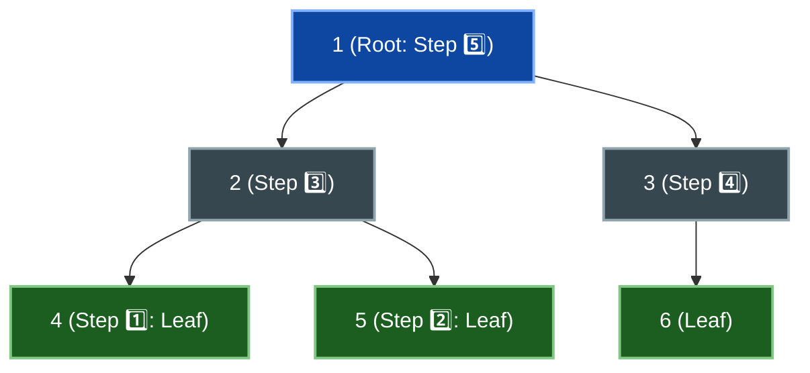

# 📘 WEEK 11: DAY 01 — DYNAMIC PROGRAMMING ON TREES

> 🧭 **Navigation:** [← Week Overview](README.md) • [🏠 Week Overview](README.md) • [📘 Curriculum Syllabus](../COMPLETE_SYLLABUS.md) • [Next Day →](Week_11_Day_02_DP_On_DAGs_Instructional.md)
> 
> 💡 **Instructor Note:** *Tree DP is the gateway to graph DP. Master the post-order bottom-up aggregation pattern first: solve children independently, then synthesize the parent state in `O(1)` per node.*

---

## 📋 TABLE OF CONTENTS

1. [Context & Motivation: Why Trees Trivialize DP](#-chapter-1-context--motivation)
2. [Mental Model & State Design](#-chapter-2-mental-model--state-design)
3. [Production Implementations (C# .NET 8/9 & Python 3.11+)](#-chapter-3-mechanics--production-implementations)
   - [Problem 1: Tree Diameter (LeetCode 543)](#problem-1-tree-diameter-leetcode-543)
   - [Problem 2: Binary Tree Maximum Path Sum (LeetCode 124)](#problem-2-binary-tree-maximum-path-sum-leetcode-124)
   - [Problem 3: House Robber III / Maximum Independent Set (LeetCode 337)](#problem-3-house-robber-iii--maximum-independent-set-leetcode-337)
   - [Problem 4: Tree Rerooting Technique (Sum of Distances)](#problem-4-tree-rerooting-technique-sum-of-distances)
4. [Performance, Trade-offs & Systems Reality](#-chapter-4-performance-trade-offs--systems-reality)
5. [Explicit Complexity Deconstruction](#-chapter-5-explicit-complexity-deconstruction)
6. [45-Minute Interview Verbal Walkthrough Script](#-chapter-6-45-minute-interview-verbal-walkthrough-script)
7. [Practice Matrix & Interview Traps](#-chapter-7-practice-matrix--interview-traps)

---

## 🎯 LEARNING OBJECTIVES

*By the end of this chapter, you will be able to:*
- 🎯 **Internalize** why acyclicity and unique paths eliminate cyclic state dependencies in trees.
- ⚙️ **Formulate** two-state tuple returns `(include, exclude)` and branch-extension returns in single-pass DFS.
- 🧩 **Implement** Tree Diameter, Binary Tree Maximum Path Sum, House Robber III, and Tree Rerooting in production-grade C# (.NET 8/9) and Python (3.11+).
- ⚖️ **Evaluate** recursion stack risks (`O(N)` call stack on skewed chains) and contrast DFS with iterative post-order traversal.
- 🎙️ **Articulate** the post-order DP invariant in a 45-minute FAANG/Tier-1 interview with zero hesitation.

---

## 📖 CHAPTER 1: CONTEXT & MOTIVATION

### Why Trees Trivialize Dynamic Programming

In general graphs, dynamic programming breaks down immediately if directed or undirected cycles exist. A cycle creates circular reasoning: state `A` depends on `B`, which depends on `C`, which depends back on `A`.

Trees are **connected acyclic graphs**. This structural guarantee delivers three mathematical superpowers:
1. **Unique Path Property**: Exactly one simple path connects any two nodes `u` and `v`.
2. **Subtree Independence**: Removing node `u` splits the tree into completely disconnected subtrees. Subtree solutions never share hidden state.
3. **Natural Topological Order**: A post-order Depth-First Search (DFS) provides an exact bottom-up topological processing order without needing cycle checks.

```
Cycle in General Graph:             Acyclic Subtree Tree:
       (A) <----> (B)                        (Root)
         ^        /                          /    \
          \      v                       (Sub L)  (Sub R)
           \    /                           |        |
            (C)                         [Solved] [Solved]
   Circular Dependency!              Completely Independent!
```

> [!NOTE]
> **Interview Context & Production Systems**
> In production backends, tree DP powers hierarchical aggregation engines: calculating rollup budgets in corporate reporting org-charts, optimizing Abstract Syntax Tree (AST) evaluation in compilers (e.g., Roslyn, LLVM), layout reflow calculation in browser DOM rendering engines, and routing packet costs across minimum spanning tree topologies in software-defined networks.

---

## 🧠 CHAPTER 2: MENTAL MODEL & STATE DESIGN

### The Post-Order Traversal Invariant

Every tree DP problem obeys one core invariant: **compute children before the parent**.

```
Post-Order Execution Timeline:
     (1)                  Call: 1 -> 2 -> 4 (leaf, return)
    /   \                       1 -> 2 -> 5 (leaf, return)
  (2)   (3)                     1 -> 2 (synthesize 4 & 5, return)
  / \     \                     1 -> 3 -> 6 (leaf, return)
(4) (5)   (6)                   1 -> 3 (synthesize 6, return)
                                1 (synthesize 2 & 3, finalize global answer)
```



### The Three Critical State Design Questions

1. **What must the recursion return to its direct parent?**
   - The returned value must be a *single branch* or *extendable subproblem* (e.g., maximum depth from this node down into its subtree).
2. **What global answer is updated during the visit?**
   - The global answer often *combines multiple child branches* that cannot be extended upward together (e.g., path passing through `node` combining `left + right + node.val`).
3. **What is the base case?**
   - When `node == null`: return `0`, `-infinity`, or `(0, 0)` depending on identity element semantics.

---

## ⚙️ CHAPTER 3: MECHANICS & PRODUCTION IMPLEMENTATIONS

### Problem 1: Tree Diameter (LeetCode 543)

**Problem Statement:** Given the root of a binary tree, return the length of the diameter. The diameter is the length of the longest path between any two nodes in a tree. This path may or may not pass through the root. Length is measured in edges.

#### Physical Intuition & Diagram
At each node, the longest path that uses this node as its "peak" (highest point) consists of the longest path down into its left child plus the longest path down into its right child. But to its own parent, this node can only offer **one** path downward (the longer of the two).

```
          (Peak Node U)
          /           \
     Left Branch   Right Branch
      (Depth L)     (Depth R)
         |             |
      [Leaf]        [Leaf]
  Path through U = L + R (edges)
  Returned to parent of U = 1 + max(L, R)
```

#### Production C# (.NET 8/9) Implementation
```csharp
namespace Week11.TreeDP;

public sealed class TreeNode
{
    public int Val { get; set; }
    public TreeNode? Left { get; set; }
    public TreeNode? Right { get; set; }

    public TreeNode(int val = 0, TreeNode? left = null, TreeNode? right = null)
    {
        Val = val;
        Left = left;
        Right = right;
    }
}

public sealed class TreeDiameterSolution
{
    public int DiameterOfBinaryTree(TreeNode? root)
    {
        int maxDiameter = 0;

        int MaxDepth(TreeNode? node)
        {
            if (node is null)
            {
                return 0; // 0 edges below null
            }

            int leftDepth = MaxDepth(node.Left);
            int rightDepth = MaxDepth(node.Right);

            // Path through current node connects left branch + right branch
            maxDiameter = Math.Max(maxDiameter, leftDepth + rightDepth);

            // Return longest single branch extending downward to parent
            return 1 + Math.Max(leftDepth, rightDepth);
        }

        MaxDepth(root);
        return maxDiameter;
    }
}
```

#### Idiomatic Python (3.11+) Implementation
```python
from typing import Optional


class TreeNode:
    def __init__(self, val: int = 0, left: Optional['TreeNode'] = None, right: Optional['TreeNode'] = None):
        self.val = val
        self.left = left
        self.right = right


class Solution:
    def diameterOfBinaryTree(self, root: Optional[TreeNode]) -> int:
        max_diameter = 0

        def dfs(node: Optional[TreeNode]) -> int:
            nonlocal max_diameter
            if not node:
                return 0

            left_depth = dfs(node.left)
            right_depth = dfs(node.right)

            # Update the longest path where current node is the apex
            max_diameter = max(max_diameter, left_depth + right_depth)

            # Return max depth extending downward to caller
            return 1 + max(left_depth, right_depth)

        dfs(root)
        return max_diameter
```

---

### Problem 2: Binary Tree Maximum Path Sum (LeetCode 124)

**Problem Statement:** A path in a binary tree is a sequence of nodes where each pair of adjacent nodes has an edge. A node can only appear at most once. The path sum is the sum of the node values in the path. Return the maximum path sum of any non-empty path.

#### Physical Intuition
Node values can be negative! If a child subtree returns a negative sum, extending into that child only decreases our total. We greedily clamp negative child contributions to `0` (`Math.Max(0, childSum)`).

```
            (-10)  <-- Apex: -10 + 9 + 35 = 34
           /     \
         (9)     (20)  <-- Local Apex: 20 + 15 + 7 = 42
                 /  \
               (15)  (7)
   Child return from (20) to (-10) = 20 + max(15, 7) = 35
```

#### Production C# (.NET 8/9) Implementation
```csharp
namespace Week11.TreeDP;

public sealed class MaxPathSumSolution
{
    public int MaxPathSum(TreeNode? root)
    {
        int globalMax = int.MinValue;

        int Dfs(TreeNode? node)
        {
            if (node is null)
            {
                return 0;
            }

            // Clamp negative subtree sums to 0 (prune suboptimal paths)
            int leftGain = Math.Max(0, Dfs(node.Left));
            int rightGain = Math.Max(0, Dfs(node.Right));

            // Price of the path turning around at this apex node
            int currentPathSum = node.Val + leftGain + rightGain;
            globalMax = Math.Max(globalMax, currentPathSum);

            // Return maximum single branch to parent
            return node.Val + Math.Max(leftGain, rightGain);
        }

        Dfs(root);
        return globalMax;
    }
}
```

#### Idiomatic Python (3.11+) Implementation
```python
from typing import Optional


class Solution:
    def maxPathSum(self, root: Optional[TreeNode]) -> int:
        global_max = float('-inf')

        def dfs(node: Optional[TreeNode]) -> int:
            nonlocal global_max
            if not node:
                return 0

            # Prune branches with negative net gain
            left_gain = max(0, dfs(node.left))
            right_gain = max(0, dfs(node.right))

            # Full inverted-U path using node as peak
            apex_sum = node.val + left_gain + right_gain
            global_max = max(global_max, apex_sum)

            # Return best single branch extending upward
            return node.val + max(left_gain, right_gain)

        dfs(root)
        return int(global_max)
```

---

### Problem 3: House Robber III / Maximum Independent Set (LeetCode 337)

**Problem Statement:** A thief wants to rob houses organized as a binary tree. If two directly-linked houses are broken into on the same night, the security system alarms. Return the maximum amount of money the thief can rob without alerting the police.

#### State Formulation & Recurrence
For every node `u`, define a 2-state tuple:
- `Rob(u)`: Maximum money robbed from `u`'s subtree if house `u` **is robbed**.
- `Skip(u)`: Maximum money robbed from `u`'s subtree if house `u` **is skipped**.

**Recurrence Relations:**
```
Rob(u)  = u.val + Skip(left) + Skip(right)
Skip(u) = max(Rob(left), Skip(left)) + max(Rob(right), Skip(right))
```

```
           [Node U]
          /        \
     (Rob U)     (Skip U)
      /    \       /    \
Skip(L) Skip(R)  max(Rob,Skip)_L + max(Rob,Skip)_R
```

#### Production C# (.NET 8/9) Implementation
```csharp
namespace Week11.TreeDP;

public sealed class HouseRobberIIISolution
{
    public readonly record struct RobResult(int RobThis, int SkipThis);

    public int Rob(TreeNode? root)
    {
        var result = Dfs(root);
        return Math.Max(result.RobThis, result.SkipThis);
    }

    private static RobResult Dfs(TreeNode? node)
    {
        if (node is null)
        {
            return new RobResult(0, 0);
        }

        var left = Dfs(node.Left);
        var right = Dfs(node.Right);

        // Case 1: Rob current node -> must skip children
        int robThis = node.Val + left.SkipThis + right.SkipThis;

        // Case 2: Skip current node -> children can be robbed or skipped independently
        int skipThis = Math.Max(left.RobThis, left.SkipThis) +
                       Math.Max(right.RobThis, right.SkipThis);

        return new RobResult(robThis, skipThis);
    }
}
```

#### Idiomatic Python (3.11+) Implementation
```python
from typing import Optional, Tuple


class Solution:
    def rob(self, root: Optional[TreeNode]) -> int:
        def dfs(node: Optional[TreeNode]) -> Tuple[int, int]:
            """Returns (rob_this, skip_this) for the subtree."""
            if not node:
                return (0, 0)

            left_rob, left_skip = dfs(node.left)
            right_rob, right_skip = dfs(node.right)

            # If we rob this house, children cannot be robbed
            rob_this = node.val + left_skip + right_skip

            # If we skip this house, take the optimal choice for each child
            skip_this = max(left_rob, left_skip) + max(right_rob, right_skip)

            return (rob_this, skip_this)

        rob_root, skip_root = dfs(root)
        return max(rob_root, skip_root)
```

---

### Problem 4: Tree Rerooting Technique (Sum of Distances)

**Problem Statement (LeetCode 834):** Given an undirected connected tree with `N` nodes numbered `0` to `N-1` and `N-1` edges, return an array `ans` of length `N` where `ans[i]` is the sum of the distances between the `i`-th node and all other nodes in the tree.

#### Mathematical Subtree Shift Intuition
Running an `O(N)` BFS from each node yields `O(N^2)` time, which timeouts for `N = 3 * 10^4`.
Notice what happens when we move the root from parent `u` to adjacent child `v`:
- `v` and all `count[v]` nodes in its subtree move **1 step closer** to the root (`- count[v]`).
- All other `N - count[v]` nodes outside `v`'s subtree move **1 step farther** (`+ (N - count[v])`).

```
Equation: ans[v] = ans[u] - count[v] + (N - count[v])
                 = ans[u] + N - 2 * count[v]
```

```
     [Parent U]                    [Child V]
     /        \                    /       \
 (Subtree)   [Child V]         [Parent U]  (V Subtree)
                 |                 |
            (V Subtree)       (U Other Subs)
    Distance shifts by: + (N - count[v]) - count[v]
```

#### Production C# (.NET 8/9) Implementation
```csharp
namespace Week11.TreeDP;

public sealed class SumOfDistancesInTreeSolution
{
    public int[] SumOfDistancesInTree(int n, int[][] edges)
    {
        var adj = new List<int>[n];
        for (int i = 0; i < n; i++)
        {
            adj[i] = new List<int>();
        }

        foreach (var edge in edges)
        {
            adj[edge[0]].Add(edge[1]);
            adj[edge[1]].Add(edge[0]);
        }

        var count = new int[n];
        var ans = new int[n];

        // Pass 1: Post-order DFS from root 0 to compute subtree sizes and root 0 answer
        void PostOrder(int node, int parent)
        {
            count[node] = 1;
            foreach (int child in adj[node])
            {
                if (child == parent) continue;
                PostOrder(child, node);
                count[node] += count[child];
                ans[node] += ans[child] + count[child];
            }
        }

        // Pass 2: Pre-order DFS to shift root answer down to all children
        void PreOrder(int node, int parent)
        {
            foreach (int child in adj[node])
            {
                if (child == parent) continue;
                // Transition: child gets closer to its own subtree, farther from rest
                ans[child] = ans[node] - count[child] + (n - count[child]);
                PreOrder(child, node);
            }
        }

        PostOrder(0, -1);
        PreOrder(0, -1);
        return ans;
    }
}
```

#### Idiomatic Python (3.11+) Implementation
```python
from collections import defaultdict
from typing import List


class Solution:
    def sumOfDistancesInTree(self, n: int, edges: List[List[int]]) -> List[int]:
        adj = defaultdict(list)
        for u, v in edges:
            adj[u].append(v)
            adj[v].append(u)

        count = [1] * n
        ans = [0] * n

        # Pass 1: Bottom-up post-order DFS rooted at 0
        def post_order(node: int, parent: int) -> None:
            for neighbor in adj[node]:
                if neighbor == parent:
                    continue
                post_order(neighbor, node)
                count[node] += count[neighbor]
                ans[node] += ans[neighbor] + count[neighbor]

        # Pass 2: Top-down pre-order DFS rerooting transitions
        def pre_order(node: int, parent: int) -> None:
            for neighbor in adj[node]:
                if neighbor == parent:
                    continue
                ans[neighbor] = ans[node] - count[neighbor] + (n - count[neighbor])
                pre_order(neighbor, node)

        post_order(0, -1)
        pre_order(0, -1)
        return ans
```

---

## ⚖️ CHAPTER 4: PERFORMANCE, TRADE-OFFS & SYSTEMS REALITY

### Recursion Stack Overhead vs Deep Linear Chains

In standard recursive Tree DP, call stack depth equals tree height `H`.

| Tree Topology | Height `H` | Recursion Stack Memory | Stack Overflow Risk |
| :--- | :--- | :--- | :--- |
| **Balanced Tree** | `O(log N)` | Negligible (`~20` frames for `10^6` nodes) | Zero |
| **Skewed Chain / Degenerate** | `O(N)` | `O(N)` stack frames (`10^5` frames) | **Critical**: C# stack overflow (`>1MB`), Python `RecursionError` (`limit=1000`) |

```
Balanced Binary Tree:               Degenerate Skewed Chain:
        (1)                               (1)
       /   \                                \
     (2)   (3)                              (2)
     / \   / \                                \
   (4) (5)(6) (7)                             (3)
Height = O(log N)                              \
Stack Frames = 3                              Height = O(N) -> Stack Overflow!
```

> [!WARNING]
> In production environments with untrusted input graphs (e.g., deep ASTs or unconstrained user graphs), always raise Python's recursion limit (`sys.setrecursionlimit(200_000)`) or rewrite the DFS using an explicit heap-allocated stack with two-state iterative post-order traversal (`(node, visited)`).

---

## 📊 CHAPTER 5: EXPLICIT COMPLEXITY DECONSTRUCTION

| Problem | Time Complexity | Auxiliary Space | Recursion Stack Space | State Space & Transitions |
| :--- | :--- | :--- | :--- | :--- |
| **Tree Diameter** | `O(N)` | `O(1)` | `O(H)` where `H in [log N, N]` | `1` scalar return; `2` child comparisons per node |
| **Max Path Sum** | `O(N)` | `O(1)` | `O(H)` where `H in [log N, N]` | `1` branch sum return; clamped with `max(0, val)` |
| **House Robber III** | `O(N)` | `O(1)` | `O(H)` where `H in [log N, N]` | `(rob, skip)` 2-tuple return; `O(1)` synthesis |
| **Tree Rerooting** | `O(N)` | `O(N)` arrays | `O(H)` call stack | 2 DFS passes: post-order down, pre-order up |

---

## 🎙️ CHAPTER 6: 45-MINUTE INTERVIEW VERBAL WALKTHROUGH SCRIPT

When facing a Tree DP problem in an interview, deliver your thoughts using this structured template:

```
[Minute 00-05] Clarification & Structural Observation
"Before writing code, let me verify properties. We have N nodes and N-1 edges forming an acyclic tree.
Because a tree has unique paths and no cycles, any node u partitions the graph into independent subtrees.
This optimal substructure means we can use Dynamic Programming via post-order traversal."

[Minute 05-12] State & Return Signature Formulation
"I'll define a recursive helper dfs(node).
At each node, we have two distinct responsibilities:
1. What value must be returned to the parent? (e.g., the longest single branch extending downward).
2. What value updates our global state? (e.g., the turnaround path connecting left and right branches through this apex node).
This decoupling ensures our time complexity remains strictly linear O(N)."

[Minute 12-25] Implementation & Dual Language Mechanics
"I will write the post-order DFS.
First, base case: if node is null, return 0.
Next, recurse on left and right children.
For negative sums, we clamp negative subtree gains to 0 using max(0, childGain).
Then, we update globalMax with node.val + leftGain + rightGain.
Finally, we return node.val + max(leftGain, rightGain) to the parent."

[Minute 25-35] Trace & Edge Case Verification
"Let's trace this on three test cases:
1. Standard balanced tree.
2. All negative values: globalMax correctly initializes to int.MinValue or -inf and picks the single least negative node.
3. Skewed linear chain: ensures no null reference exceptions."

[Minute 35-45] Complexity Deconstruction & Scaling
"Time Complexity: O(N) because every node and edge is visited exactly once with O(1) operations.
Space Complexity: O(H) auxiliary space for the call stack, which is O(log N) for balanced trees and O(N) worst-case.
If the tree can be arbitrarily deep in production, I would use an iterative post-order traversal with an explicit heap-allocated stack to prevent thread stack overflow."
```

---

## 📚 CHAPTER 7: PRACTICE MATRIX & INTERVIEW TRAPS

### Problem Ladder

| Problem | LeetCode | Difficulty | Core Technique | State Return |
| :--- | :--- | :--- | :--- | :--- |
| **Diameter of Binary Tree** | LC 543 | 🟢 Easy | Post-order DFS | `1 + max(left, right)` |
| **Binary Tree Maximum Path Sum** | LC 124 | 🔴 Hard | Branch Clamping DP | `val + max(0, max(L, R))` |
| **House Robber III** | LC 337 | 🟡 Medium | 2-State Tuple DP | `(rob, skip)` |
| **Sum of Distances in Tree** | LC 834 | 🔴 Hard | 2-Pass Rerooting | Subtree Size + Delta Shift |
| **Distribute Coins in Binary Tree** | LC 979 | 🟡 Medium | Balance Flow Aggregation | `val - 1 + L + R` |

### Critical Traps to Avoid
1. **Undirected Tree Double Traversal**: When representing trees as undirected adjacency lists `adj[u]`, always pass `parent` to the DFS (`if (child == parent) continue;`) to avoid infinite cycles.
2. **Double Counting Branch Returns**: In path sum / diameter problems, never return `left + right + node.val` to the parent; a path cannot fork into two subtrees and then also extend to an ancestor!
3. **Re-sorting Children**: In N-ary tree diameter, finding the two largest child branches takes `O(degree)` with two variables (`max1`, `max2`), not `O(degree * log(degree))` via array sorting.

---

> 🧭 **Navigation:** [← Week Overview](README.md) • [🏠 Week Overview](README.md) • [📘 Curriculum Syllabus](../COMPLETE_SYLLABUS.md) • [Next Day →](Week_11_Day_02_DP_On_DAGs_Instructional.md)
