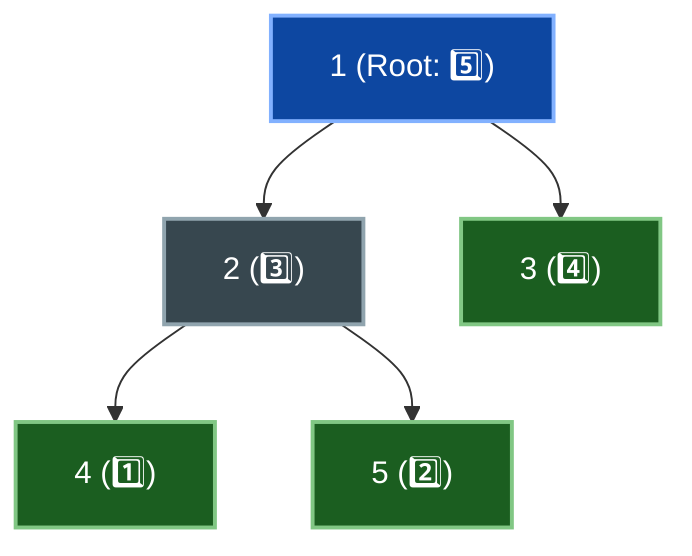
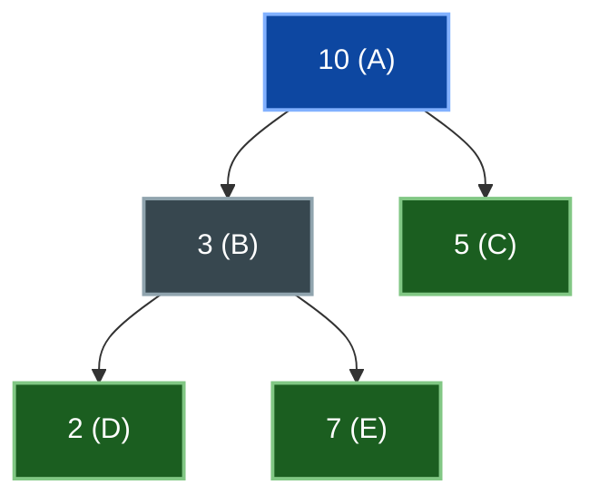
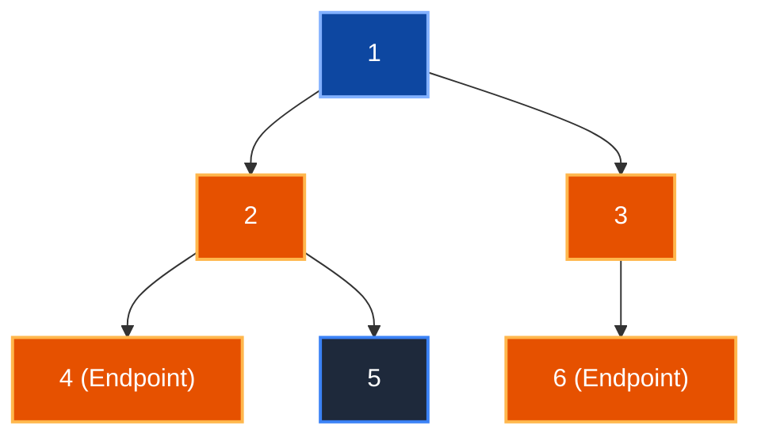
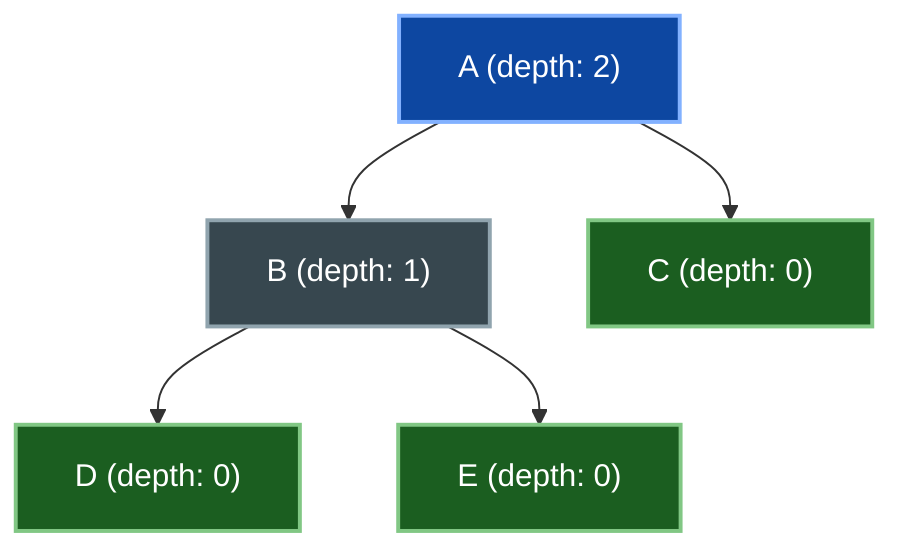
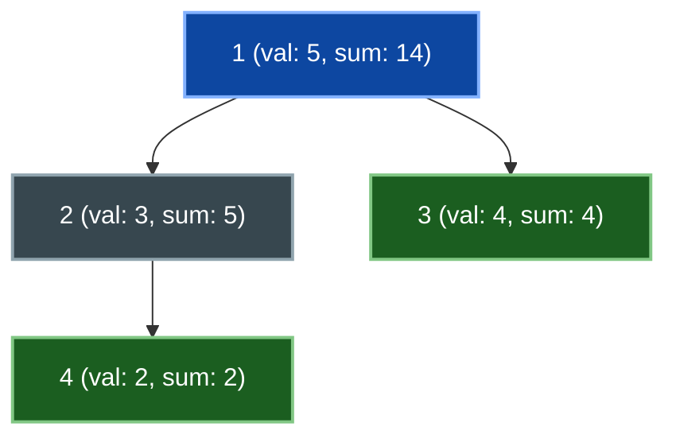
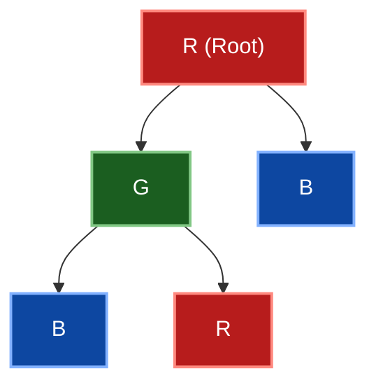
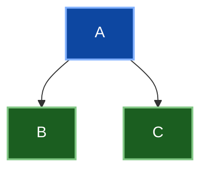
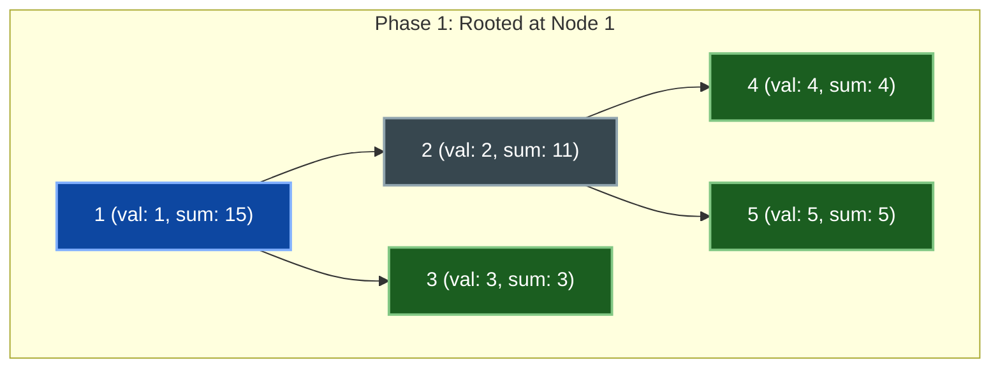

# 📘 WEEK 11: DAY 01 — DYNAMIC PROGRAMMING ON TREES


> 🧭 **Navigation:** [← Week Overview](README.md) • [🏠 Week Overview](README.md) • [📘 Curriculum Syllabus](../COMPLETE_SYLLABUS.md) • [Next Day →](Week_11_Day_02_DP_On_DAGs_Instructional.md)
> 
> 💡 **Instructor Note:** *Not all sections or topics are mandatory. Feel free to adapt your pace and skim or skip sections based on your current focus and interview timeline.*

---
## 📋 TABLE OF CONTENTS

1. **Introduction to Tree DP**
2. **Tree DP Framework & Mindset**
3. **Maximum Independent Set Problem**
4. **Tree Diameter Computation**
5. **Subtree Problems & Aggregation**
6. **Tree Coloring Problems**
7. **Tree Rerooting Technique**
8. **Advanced Tree DP Patterns**
9. **Common Pitfalls & Debugging**
10. **Practice Problems & Challenges**

---

## 🎯 LEARNING OBJECTIVES

By the end of this day, students will:

✅ **Understand** the foundational concepts of DP on trees
✅ **Apply** tree DP framework to solve independent set and diameter problems
✅ **Recognize** tree structure properties that enable DP solutions
✅ **Implement** efficient tree traversal and state computation
✅ **Optimize** space and time complexity for tree problems
✅ **Debug** tree DP solutions systematically
✅ **Extend** basic patterns to advanced tree problems

---

## 📖 CHAPTER 1: CONTEXT & MOTIVATION

## 🌳 INTRODUCTION TO TREE DP

### What Makes Trees Special for DP?

Trees are **acyclic connected graphs**. This simple property makes them ideal for dynamic programming because:

1. **Unique Path Property**: There's exactly one path between any two nodes
2. **Recursive Structure**: Subtrees are independent subproblems
3. **Natural Ordering**: Post-order traversal gives computation order
4. **Linear Space**: Can solve many problems in O(n) space

### The Key Insight

> **Trees decompose into independent subproblems naturally.**

When solving a problem on a tree:
- You solve for smaller subtrees first
- Combine subtree solutions into the parent
- The answer for the whole tree combines all solutions

This is fundamentally different from general graphs where cycles create dependencies.

### Example: Why Trees Enable DP

```
Without cycles, we can:
1. Pick a root
2. Solve for each subtree independently
3. Combine solutions bottom-up

With cycles (general graph):
1. Cycles create circular dependencies
2. Can't separate into independent subproblems
3. Need different algorithms (e.g., Bellman-Ford)
```

---

## 🧠 CHAPTER 2: MENTAL MODEL & STATE DESIGN

## 🏗️ TREE DP FRAMEWORK & MINDSET

### The Three Critical Questions for Tree DP

Just like all DP problems, tree DP requires clear thinking:

**Question 1: What Does the State Represent?**

State definition must capture:
- Which subtree we're considering
- What information is relevant for combining solutions
- What "partial answer" looks like

Example: In maximum independent set:
- State: `dp[node][0]` = maximum value when node is NOT included
- State: `dp[node][1]` = maximum value when node IS included

**Question 2: How Do We Combine Subtree Solutions?**

Transitions describe how to build up from children:
- What operations connect parent to children?
- How do child answers influence parent?
- What constraints exist between parent and children?

Example: In maximum independent set:
- If node IS included: can't include children
- If node NOT included: can include any children optimally

**Question 3: What Are Base Cases?**

Base cases are leaves (no children):
- Leaf answers are usually obvious (single node, no children)
- Foundation for building up the tree

Example: For a leaf node in maximum independent set:
- `dp[leaf][0]` = 0 (not including leaf, no value)
- `dp[leaf][1]` = value[leaf] (including leaf)

### Tree DP Computation Order

**Post-Order Traversal Pattern:**



- **Bottom-up Evaluation Order:** `4 -> 5 -> 2 -> 3 -> 1`
- **Why?** When processing node `N`, all children are guaranteed to have computed their optimal DP states, completely eliminating circular dependencies!

### Template Structure

```
Function TreeDP(node, parent):
  // 1. Base case: leaf node
  if node is leaf:
    dp[node] = base_case_value
    return dp[node]
  
  // 2. Process all children (post-order)
  for child in children of node:
    if child != parent:
      TreeDP(child, node)
  
  // 3. Combine children's solutions
  result = 0
  for child in children of node:
    if child != parent:
      result += combine(dp[child], ...)
  
  dp[node] = finalize(result, node_value)
  return dp[node]
```

---

## 🔧 CHAPTER 3: MECHANICS & IMPLEMENTATION

## 🎯 MAXIMUM INDEPENDENT SET PROBLEM

### Problem Definition

**Given:** A tree with node values  
**Find:** A set of nodes such that:
- No two nodes in the set are adjacent (connected by an edge)
- The sum of node values is maximized

**Example:**



- **Possible Independent Sets:**
  - `{10}`: value = `10`
  - `{3, 5}`: value = `8`
  - `{2, 7, 5}`: value = `14`
  - `{10, 2, 7}`: value = `19` (Optimal maximum: no two selected nodes share an edge!)

### DP State Definition

**Two states per node:**

```
dp[node][0] = Maximum value in subtree when node is NOT included
dp[node][1] = Maximum value in subtree when node IS included
```

**Why two states?** Because the optimal solution for a subtree depends on whether the root of that subtree is included.

### Transitions & Logic

**Case 1: Node IS included (dp[node][1])**

```
If node is included:
- Children CANNOT be included
- Get dp[child][0] for each child
- Maximum value = node.value + sum(dp[child][0])

Reason: If parent is in set, children can't be (adjacent)
```

**Case 2: Node is NOT included (dp[node][0])**

```
If node is NOT included:
- Children CAN be included or not
- Choose optimally for each child
- Maximum value = sum(max(dp[child][0], dp[child][1]))

Reason: If parent not in set, children are independent
```

### Algorithm

```
Algorithm MaximumIndependentSet(node, parent):
  
  // Base case: leaf node
  if node has no children:
    dp[node][0] = 0
    dp[node][1] = value[node]
    return
  
  // Initialize
  include_value = value[node]
  exclude_value = 0
  
  // Process each child
  for child in children of node:
    if child != parent:
      MaximumIndependentSet(child, node)
      
      // If node is included: take children excluded
      include_value += dp[child][0]
      
      // If node is excluded: take children optimally
      exclude_value += max(dp[child][0], dp[child][1])
  
  dp[node][0] = exclude_value
  dp[node][1] = include_value

Answer = max(dp[root][0], dp[root][1])
```

### Step-by-Step Example


**Node values:** `A=10, B=3, C=5, D=2, E=7`

**Step-by-step DP Evaluation:**

1. **Step 1: Process leaf D**
   - `dp[D][0] = 0` (exclude D)
   - `dp[D][1] = 2` (include D)
2. **Step 2: Process leaf E**
   - `dp[E][0] = 0` (exclude E)
   - `dp[E][1] = 7` (include E)
3. **Step 3: Process node B (children D, E)**
   - Include B: `include_val = 3 + dp[D][0] + dp[E][0] = 3 + 0 + 0 = 3` -> `dp[B][1] = 3`
   - Exclude B: `exclude_val = max(dp[D][0], dp[D][1]) + max(dp[E][0], dp[E][1]) = max(0, 2) + max(0, 7) = 9` -> `dp[B][0] = 9`
4. **Step 4: Process leaf C**
   - `dp[C][0] = 0`
   - `dp[C][1] = 5`
5. **Step 5: Process root A (children B, C)**
   - Include A: `include_val = 10 + dp[B][0] + dp[C][0] = 10 + 9 + 0 = 19` -> `dp[A][1] = 19`
   - Exclude A: `exclude_val = max(dp[B][0], dp[B][1]) + max(dp[C][0], dp[C][1]) = max(9, 3) + max(0, 5) = 14` -> `dp[A][0] = 14`

- **Final Answer:** `max(dp[A][0], dp[A][1]) = max(14, 19) = 19`
- **Selected Independent Set:** `{A, D, E}` (sum: `10 + 2 + 7 = 19`).

### C# Implementation

```csharp
public class MaximumIndependentSet
{
    private List<int>[] adjacencyList;
    private int[] nodeValues;
    private int[][] dp;
    
    public int FindMaxIndependentSet(int n, int[] values, List<(int, int)> edges)
    {
        nodeValues = values;
        adjacencyList = new List<int>[n];
        dp = new int[n][];
        
        // Build adjacency list
        for (int i = 0; i < n; i++)
        {
            adjacencyList[i] = new List<int>();
            dp[i] = new int[2];
        }
        
        foreach (var (u, v) in edges)
        {
            adjacencyList[u].Add(v);
            adjacencyList[v].Add(u);
        }
        
        // Run DP from root 0
        DFS(0, -1);
        
        return Math.Max(dp[0][0], dp[0][1]);
    }
    
    private void DFS(int node, int parent)
    {
        // Base case: leaf
        if (adjacencyList[node].Count == 1 && adjacencyList[node][0] == parent)
        {
            dp[node][0] = 0;
            dp[node][1] = nodeValues[node];
            return;
        }
        
        int includeNode = nodeValues[node];
        int excludeNode = 0;
        
        // Process children
        foreach (int child in adjacencyList[node])
        {
            if (child != parent)
            {
                DFS(child, node);
                
                // If node included: children must be excluded
                includeNode += dp[child][0];
                
                // If node excluded: take optimal for each child
                excludeNode += Math.Max(dp[child][0], dp[child][1]);
            }
        }
        
        dp[node][0] = excludeNode;
        dp[node][1] = includeNode;
    }
}
```

### Complexity Analysis

```
Time Complexity:  O(n)
- Visit each node once (DFS)
- Process each edge once
- Constant work per node

Space Complexity: O(n)
- DP table: O(n)
- Recursion stack: O(h) where h = height
- Adjacency list: O(n + edges)

Total: O(n) space
```

---

## 📏 TREE DIAMETER COMPUTATION

### Problem Definition

**Given:** A tree with weighted edges
**Find:** The longest path between any two nodes (diameter)

**Visual Example:**



- **Diameter Path:** `4 -> 2 -> 1 -> 3 -> 6` (Longest distance = 4 edges, 5 nodes).

### Why DP Works for Diameter

The key insight:
- **Diameter of tree** = maximum of (longest path through node X)
- **Longest path through X** = deepest child + 2nd deepest child

We can compute for each node: "What's the deepest subtree rooted here?"

### Algorithm: Diameter via DP

**Two-Pass Approach:**

**Pass 1: Compute Depth for Each Node**

```
For each node, compute:
dp[node] = maximum distance down from node to any leaf

Post-order traversal:
- For leaf: dp[node] = 0
- For internal node: dp[node] = 1 + max(dp[child])
```

**Pass 2: Compute Diameter Through Each Node**

```
For each node as a potential "highest" point on diameter:
- Find two deepest subtrees
- Diameter through this node = depth1 + depth2 + 2

Track maximum across all nodes
```

### Algorithm Details

```
Algorithm TreeDiameter(node, parent):
  
  // Step 1: Compute depths
  if node is leaf:
    depths[node] = 0
  else:
    depths[node] = 1 + max(depths[child] for all children)
  
  // Step 2: Find diameter through this node
  Sort children by depths (descending)
  if len(children) >= 2:
    candidate_diameter = depths[children[0]] + depths[children[1]] + 2
  else if len(children) == 1:
    candidate_diameter = depths[children[0]] + 1
  else:
    candidate_diameter = 0
  
  global_diameter = max(global_diameter, candidate_diameter)
  
  // Recurse to children
  for child in children:
    if child != parent:
      TreeDiameter(child, node)
```

### Step-by-Step Example



**Step-by-step Execution:**

1. **Step 1: Compute depths (distance to farthest leaf)**
   - `D`: depth = `0` (leaf)
   - `E`: depth = `0` (leaf)
   - `B`: depth = `1 + max(0, 0) = 1`
   - `C`: depth = `0` (leaf)
   - `A`: depth = `1 + max(1, 0) = 2`
2. **Step 2: Find diameter through each node**
   - Through `A`: Children `B` (depth 1), `C` (depth 0) -> `diameter = 1 + 0 + 2 = 3` edges (`D-B-A-C` or `E-B-A-C`)
   - Through `B`: Children `D` (depth 0), `E` (depth 0) -> `diameter = 0 + 0 + 2 = 2` edges (`D-B-E`)
   - Through `C, D, E`: Leaves -> `diameter = 0`

- **Maximum Tree Diameter:** `3` edges (4 nodes: `D-B-A-C` or `E-B-A-C`).

### C# Implementation

```csharp
public class TreeDiameter
{
    private List<int>[] adjacencyList;
    private int[] depths;
    private int maxDiameter;
    
    public int FindDiameter(int n, List<(int, int)> edges)
    {
        adjacencyList = new List<int>[n];
        depths = new int[n];
        maxDiameter = 0;
        
        // Build adjacency list
        for (int i = 0; i < n; i++)
            adjacencyList[i] = new List<int>();
        
        foreach (var (u, v) in edges)
        {
            adjacencyList[u].Add(v);
            adjacencyList[v].Add(u);
        }
        
        // Run DFS from node 0
        DFS(0, -1);
        
        return maxDiameter;
    }
    
    private int DFS(int node, int parent)
    {
        // Get depths of all children
        var childDepths = new List<int>();
        
        foreach (int child in adjacencyList[node])
        {
            if (child != parent)
            {
                int childDepth = DFS(child, node);
                childDepths.Add(childDepth);
            }
        }
        
        // Compute diameter through this node
        if (childDepths.Count >= 2)
        {
            childDepths.Sort((a, b) => b.CompareTo(a)); // Descending
            maxDiameter = Math.Max(maxDiameter, childDepths[0] + childDepths[1] + 2);
        }
        else if (childDepths.Count == 1)
        {
            maxDiameter = Math.Max(maxDiameter, childDepths[0] + 1);
        }
        
        // Return depth of this node
        int nodeDepth = (childDepths.Count > 0) ? childDepths[0] + 1 : 0;
        depths[node] = nodeDepth;
        return nodeDepth;
    }
}
```

### Complexity Analysis

```
Time Complexity:  O(n)
- Single DFS pass
- Each node visited once
- Sorting children: O(k log k) where k = degree
- Sum of all degrees = O(n)

Space Complexity: O(n)
- Adjacency list: O(n)
- Recursion stack: O(h)
- DP arrays: O(n)
```

---

## 🔄 SUBTREE PROBLEMS & AGGREGATION

### Category: Aggregation Problems

Many tree problems involve computing something for each subtree:

**Common patterns:**
1. Sum of all nodes in subtree
2. Count of nodes matching condition
3. Product of all values
4. Maximum/minimum in subtree

### Problem: Subtree Sum

**Definition:** For each node, compute the sum of all values in its subtree.



**Subtree Sum Accumulation:**
- `sum[4] = 2` (leaf)
- `sum[2] = 3 + 2 = 5` (itself + child 4)
- `sum[3] = 4` (leaf)
- `sum[1] = 5 + 5 + 4 = 14` (root + both child subtrees)

### Algorithm

```
Algorithm SubtreeSum(node, parent):
  
  total = value[node]
  
  for child in children of node:
    if child != parent:
      SubtreeSum(child, node)
      total += subtree_sum[child]
  
  subtree_sum[node] = total
```

**Key insight:** This is linear because each node is visited once.

### Problem: Count Nodes with Value ≥ Threshold

```
For each node, count how many nodes in subtree have value ≥ T

Algorithm:
  count = 1 if value[node] >= T else 0
  
  for child in children:
    count += subtree_count[child]
```

### C# Example: Subtree Aggregation

```csharp
public class SubtreeAggregation
{
    private List<int>[] adjacencyList;
    private long[] subtreeSum;
    private int[] subtreeCount;
    
    public long[] ComputeSubtreeSums(int n, int[] values, List<(int, int)> edges)
    {
        adjacencyList = new List<int>[n];
        subtreeSum = new long[n];
        
        for (int i = 0; i < n; i++)
            adjacencyList[i] = new List<int>();
        
        foreach (var (u, v) in edges)
        {
            adjacencyList[u].Add(v);
            adjacencyList[v].Add(u);
        }
        
        DFS(0, -1, values);
        return subtreeSum;
    }
    
    private void DFS(int node, int parent, int[] values)
    {
        subtreeSum[node] = values[node];
        
        foreach (int child in adjacencyList[node])
        {
            if (child != parent)
            {
                DFS(child, node, values);
                subtreeSum[node] += subtreeSum[child];
            }
        }
    }
}
```

---

## 🎨 TREE COLORING PROBLEMS

### Problem: Color Tree with K Colors

**Definition:** Color each node with one of K colors such that:
- Adjacent nodes have different colors
- Count the total number of valid colorings

**Visual Example (K=3):**



- Total valid colorings vary dynamically by structure.

### DP State

```
dp[node][color] = number of ways to color subtree where:
- node has the given color
- all descendants properly colored
- no two adjacent nodes same color
```

### Transitions

For a node with color C:
- Parent must NOT have color C
- All children must NOT have color C
- Each child can have any of (K-1) colors

```
Transition logic:
  dp[node][color] = ∏(sum of dp[child][other_colors])
                    for all children
  
  where other_colors = all K colors except color
```

### Algorithm

```
Algorithm TreeColoring(node, parent, color):
  
  ways = 1
  
  for child in children of node:
    if child != parent:
      child_ways = 0
      
      for child_color in all colors except color:
        child_ways += TreeColoring(child, node, child_color)
      
      ways *= child_ways
  
  return ways

Total = sum of TreeColoring(root, -1, c) for all c in K colors
```

### Example with K=2 (Bipartite Coloring)



Valid colorings:
1. `A = 0, B = 1, C = 1`
2. `A = 1, B = 0, C = 0`

- **Total:** `2` (Satisfies closed-form formula `K * (K - 1)^(N - 1) = 2 * (1)^2 = 2`).

### C# Implementation

```csharp
public class TreeColoring
{
    private List<int>[] adjacencyList;
    private int K; // number of colors
    
    public long CountColorings(int n, List<(int, int)> edges, int numColors)
    {
        K = numColors;
        adjacencyList = new List<int>[n];
        
        for (int i = 0; i < n; i++)
            adjacencyList[i] = new List<int>();
        
        foreach (var (u, v) in edges)
        {
            adjacencyList[u].Add(v);
            adjacencyList[v].Add(u);
        }
        
        long total = 0;
        
        // Try each color for root
        for (int rootColor = 0; rootColor < K; rootColor++)
        {
            total += CountWays(0, -1, rootColor);
        }
        
        return total;
    }
    
    private long CountWays(int node, int parent, int nodeColor)
    {
        long ways = 1;
        
        foreach (int child in adjacencyList[node])
        {
            if (child != parent)
            {
                long childWays = 0;
                
                // Try all colors except parent's color
                for (int color = 0; color < K; color++)
                {
                    if (color != nodeColor)
                    {
                        childWays += CountWays(child, node, color);
                    }
                }
                
                ways *= childWays;
            }
        }
        
        return ways;
    }
}
```

---

## 🔄 TREE REROOTING TECHNIQUE

### Motivation: Dynamic Root Changes

Some problems ask: "For each node as root, what's the answer?"

**Naive approach:** Run entire DP algorithm n times (once for each possible root)
- Time: O(n²) or worse
- Acceptable for small n, but inefficient

**Smart approach: Rerooting**
- First pass: DP from one root
- Second pass: Reroot and combine answers
- Time: O(n)

### Rerooting Algorithm Structure

**Phase 1: Down-Pass (DP from original root)**

```
Compute all values relative to root 0
Store answers that will be needed for rerooting
```

**Phase 2: Up-Pass (Reroot through tree)**

```
For each node:
  Compute answer when this node becomes root
  Use parent's answer from previous step
  Combine with subtree answers
```

### Simple Example: Subtree Sum (Rooted at Each Node)

**Phase 1: DP from root 0**



**Subtree Sums computed relative to root 1:**
- `subtree_sum[4] = 4`
- `subtree_sum[5] = 5`
- `subtree_sum[2] = 2 + 4 + 5 = 11`
- `subtree_sum[3] = 3`
- `subtree_sum[1] = 1 + 11 + 3 = 15`

**Phase 2: Reroot**

```
When rerooting to node 2:
- Subtree sum of 2's original subtree: 11
- Sum of nodes NOT in subtree of 2: 1 + 3 = 4
  (nodes in 1, and 3 - reached via 1)
- Total when rooted at 2: 11 + 4 = 15
```

### C# Template for Rerooting

```csharp
public class TreeRerooting
{
    private List<int>[] adjacencyList;
    private int[] values;
    private long[] downValue;  // Phase 1: DP from root 0
    private long[] rerooted;   // Phase 2: Answers when each node is root
    
    public long[] RecomputeForAllRoots(int n, int[] vals, List<(int, int)> edges)
    {
        values = vals;
        adjacencyList = new List<int>[n];
        downValue = new long[n];
        rerooted = new long[n];
        
        for (int i = 0; i < n; i++)
            adjacencyList[i] = new List<int>();
        
        foreach (var (u, v) in edges)
        {
            adjacencyList[u].Add(v);
            adjacencyList[v].Add(u);
        }
        
        // Phase 1: DP from root 0
        DownPass(0, -1);
        
        // Phase 2: Reroot
        UpPass(0, -1);
        
        return rerooted;
    }
    
    private void DownPass(int node, int parent)
    {
        downValue[node] = values[node];
        
        foreach (int child in adjacencyList[node])
        {
            if (child != parent)
            {
                DownPass(child, node);
                downValue[node] += downValue[child];
            }
        }
    }
    
    private void UpPass(int node, int parent)
    {
        // Compute answer for subtree rooted at node
        rerooted[node] = downValue[node];
        
        // If this isn't the original root, add value from parent
        if (parent != -1)
        {
            // Value from parent's other subtrees
            long parentContribution = rerooted[parent] - downValue[node] - values[parent];
            rerooted[node] += parentContribution;
        }
        
        // Continue to children
        foreach (int child in adjacencyList[node])
        {
            if (child != parent)
            {
                UpPass(child, node);
            }
        }
    }
}
```

---

## 🎯 ADVANCED TREE DP PATTERNS

### Pattern 1: Multiple States

Some problems need more than 2 states per node.

**Example: Tree Painting with 3 States**

```
dp[node][0] = best if node painted red
dp[node][1] = best if node painted blue
dp[node][2] = best if node painted green

With constraints like: adjacent nodes have different colors
```

### Pattern 2: Vertex Weight vs Edge Weight

**Vertex weight:** Value at each node
**Edge weight:** Cost of traversal

```
Maximum weight path may need:
- Node weight from every node in path
- Edge weight for every edge in path

Different state definition required
```

### Pattern 3: Path Problems on Trees

**Problem:** Find path with maximum weight between any two nodes

```
For each node as "highest" point on path:
- Find best path going down-left
- Find best path going down-right
- Combine them through the node
```

---

## 📈 CHAPTER 4: PERFORMANCE, TRADE-OFFS & SYSTEMS

### Performance and Trade-Off Summary

- Maximum Independent Set on tree
  - Time Complexity: O(n)
  - Space Complexity: O(n)
  - Trade-off: recursive DFS is concise; iterative stack is safer for deep skewed trees.
- Tree Diameter
  - Time Complexity: O(n)
  - Space Complexity: O(h) recursion stack (plus adjacency storage)
  - Trade-off: maintain top-2 child depths instead of sorting child list to reduce constants.
- Tree Rerooting
  - Time Complexity: O(n)
  - Space Complexity: O(n)
  - Trade-off: higher implementation complexity to avoid O(n^2) recomputation.

### Systems Integration Notes

- Tree DP patterns appear in ownership hierarchies, compiler AST transforms, and aggregation rollups.
- Rerooting enables fast "evaluate at every pivot" analytics over hierarchical structures.
- Production systems should guard recursion depth for worst-case chains.

---

## ⚠️ COMMON PITFALLS & DEBUGGING

### Pitfall 1: Parent-Child Confusion

**Error:** Treating tree as undirected when should be directed

```csharp
// ❌ WRONG: Process parent again in children
foreach (int next in adjacencyList[node])
{
    DFS(next, node);  // Forgot to check if next == parent
}

// ✅ CORRECT:
foreach (int next in adjacencyList[node])
{
    if (next != parent)
        DFS(next, node);
}
```

### Pitfall 2: Wrong Base Case

**Error:** Base case doesn't match problem requirements

```csharp
// ❌ WRONG for maximum independent set
if (node is leaf)
    dp[node][0] = 0;  // Both states should exist
    // Missing: dp[node][1] = ...

// ✅ CORRECT:
if (node is leaf)
{
    dp[node][0] = 0;           // Not including: no value
    dp[node][1] = value[node]; // Including: node value
}
```

### Pitfall 3: Forgot to Traverse

**Error:** Computing answer but not recursing to children

```csharp
// ❌ WRONG
private void DFS(int node, int parent)
{
    dp[node] = compute_something();
    // Forgot to recurse!
}

// ✅ CORRECT
private void DFS(int node, int parent)
{
    foreach (int child in adjacencyList[node])
    {
        if (child != parent)
            DFS(child, node);  // Recurse first
    }
    dp[node] = compute_something();
}
```

### Pitfall 4: Integer Overflow

**Error:** Sum exceeds int range

```csharp
// ❌ WRONG: May overflow
int total = 0;
foreach (int val in subtree_values)
    total += val;

// ✅ CORRECT: Use long
long total = 0;
foreach (int val in subtree_values)
    total += val;
```

### Debugging Checklist

```
✓ Is parent check included (if next != parent)?
✓ Are all base cases defined?
✓ Are children processed before parent (post-order)?
✓ Is return type appropriate (int vs long)?
✓ Are all DP states initialized?
✓ Is the final answer correct location (dp[root])?
```

---

## 🌍 CHAPTER 5: INTEGRATION & MASTERY

### Pattern Selection Rules

- Use subtree aggregation when values are descendant-local and composable.
- Use include/exclude state DP for adjacency-constrained choices.
- Use rerooting when answers are required for every possible root.

### Interview Communication Cues

- Declare state semantics first, then transitions, then base cases.
- Justify post-order traversal as dependency-safe evaluation order.
- Call out complexity and implementation risks (overflow, parent checks, recursion depth).

### Progression Path

- Basic: subtree sums, depth, and counts.
- Intermediate: independent set and diameter.
- Advanced: rerooting, multi-state coloring, hybrid node-edge weighted DP.

---

## 📚 PRACTICE PROBLEMS & CHALLENGES

### Tier 1: Foundation

**Problem 1.1: Subtree Value Sum**
- Given tree with node values
- For each node, compute sum of its subtree
- **Expected time:** O(n)
- **Difficulty:** ⭐

**Problem 1.2: Path from Root**
- For each node, find maximum value path from root to that node
- **Expected time:** O(n)
- **Difficulty:** ⭐

**Problem 1.3: Leaf Count**
- Count total leaves in subtree for each node
- **Expected time:** O(n)
- **Difficulty:** ⭐

### Tier 2: Core Patterns

**Problem 2.1: Maximum Path Sum (Node Weights)**
- Find maximum weight path between any two nodes
- Path must connect through some node
- **Expected time:** O(n)
- **Difficulty:** ⭐⭐
- **Hint:** For each node, find two best descending paths

**Problem 2.2: Minimum Subtree Value**
- For each node, find minimum value node in its subtree
- **Expected time:** O(n)
- **Difficulty:** ⭐⭐

**Problem 2.3: Diameter with Weights**
- Find longest weighted path in tree
- **Expected time:** O(n)
- **Difficulty:** ⭐⭐
- **Hint:** Similar to unweighted diameter

### Tier 3: Advanced

**Problem 3.1: Tree DP with Constraint**
- Select nodes such that no two are adjacent (independent set)
- Maximize value
- **Expected time:** O(n)
- **Difficulty:** ⭐⭐⭐

**Problem 3.2: Tree Rerooting**
- For each node as root, compute answer
- Example: maximum subtree sum
- **Expected time:** O(n)
- **Difficulty:** ⭐⭐⭐

**Problem 3.3: All Subtree Paths**
- For each node, count paths in subtree with specific property
- Example: sum ≥ K
- **Expected time:** O(n²) or O(n) with optimization
- **Difficulty:** ⭐⭐⭐

### Challenge Problem

**Multi-Concept Integration:**
- Given tree with node values and edge weights
- Find maximum weighted path
- Optimize with rerooting for dynamic updates
- **Expected time:** O(n) per query
- **Difficulty:** ⭐⭐⭐⭐

---

## 📊 COMPLEXITY SUMMARY TABLE


| Problem | Time | Space |
| :--- | :--- | :--- |
| Subtree Sum | O(n) | O(n) |
| Maximum Independent Set | O(n) | O(n) |
| Tree Diameter | O(n) | O(h) |
| Tree Coloring (K colors) | O(n × K) | O(n) |
| Maximum Path Sum | O(n) | O(h) |
| Tree Rerooting | O(n) | O(n) |
| Leaf Count per Subtree | O(n) | O(h) |


---

## 🎓 KEY CONCEPTS RECAP

**1. Tree Structure Advantage**
- No cycles = independent subproblems
- Natural recursion via parent-child
- Post-order traversal gives correct order

**2. DP State Design**
- Clearly define what state represents
- Multiple states if needed (include/exclude, etc.)
- Base cases for leaves

**3. Transition Logic**
- Combine children's answers
- Respect constraints (adjacency, parent-child, etc.)
- Accumulate or optimize based on problem

**4. Implementation Details**
- Use adjacency list for sparse graphs
- Check parent to avoid cycles
- Post-order traversal (children before parent)
- Watch integer overflow with sums

**5. Advanced Techniques**
- Rerooting for dynamic roots
- Multiple DP tables for complex states
- Path reconstruction via parent pointers
- Optimization through observation

---

## 🚀 NEXT STEPS

**Before Next Session:**
1. Implement maximum independent set from scratch
2. Solve tree diameter problem
3. Practice rerooting on simple subtree sum
4. Debug one solution thoroughly

**Preparation for Day 02:**
- Review acyclic graphs
- Understand topological sorting
- Think about longest paths without cycles

---

**End of Week 11 Day 01 — Dynamic Programming on Trees**

*Duration: ~120 minutes of guided learning + practice*
*Difficulty: Intermediate to Advanced*
*Prerequisites: Basic tree knowledge, DP fundamentals from Week 10*
---

> 🧭 **Navigation:** [← Week Overview](README.md) • [🏠 Week Overview](README.md) • [📘 Curriculum Syllabus](../COMPLETE_SYLLABUS.md) • [Next Day →](Week_11_Day_02_DP_On_DAGs_Instructional.md)
