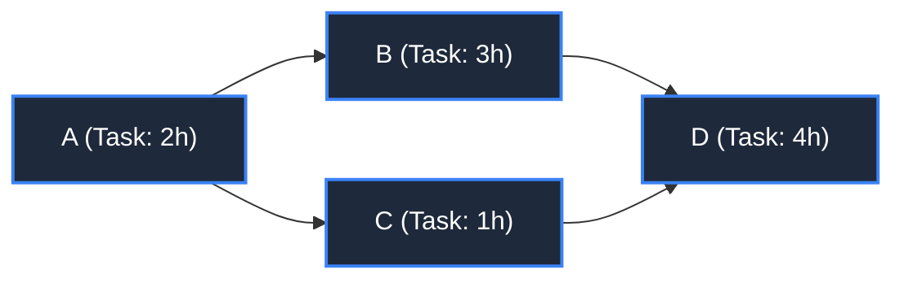

# 📘 WEEK 11: DAY 02 — DYNAMIC PROGRAMMING ON DIRECTED ACYCLIC GRAPHS (DAGs)

> 🧭 **Navigation:** [← Previous Day](Week_11_Day_01_DP_on_Trees_Instructional.md) • [🏠 Week Overview](README.md) • [📘 Curriculum Syllabus](../COMPLETE_SYLLABUS.md) • [Next Day →](Week_11_Day_03_Bitmask_And_Subset_DP_Instructional.md)
> 
> 💡 **Instructor Note:** *DAG DP is the theoretical bridge between graph theory and dynamic programming. Topological sort linearizes the partial ordering of the DAG, enabling `O(V + E)` shortest/longest path calculations even in the presence of negative edge weights.*

---

## 📋 TABLE OF CONTENTS

1. [Context & Motivation: Why Acyclicity Unlocks Linear DP](#-chapter-1-context--motivation)
2. [Mental Model & Topological Ordering Invariants](#-chapter-2-mental-model--topological-ordering-invariants)
3. [Production Implementations (C# .NET 8/9 & Python 3.11+)](#-chapter-3-mechanics--production-implementations)
   - [Problem 1: Kahn's Algorithm & Topological Ordering](#problem-1-kahns-algorithm--topological-ordering)
   - [Problem 2: Longest Path in a DAG](#problem-2-longest-path-in-a-dag)
   - [Problem 3: Single-Source Shortest Path (Negative Weights Allowed)](#problem-3-single-source-shortest-path-negative-weights-allowed)
   - [Problem 4: Number of Distinct Paths (Path Counting DP)](#problem-4-number-of-distinct-paths-path-counting-dp)
   - [Problem 5: Critical Path Method (CPM) & Slack Analysis](#problem-5-critical-path-method-cpm--slack-analysis)
4. [Performance, Trade-offs & Systems Reality](#-chapter-4-performance-trade-offs--systems-reality)
5. [Explicit Complexity Deconstruction](#-chapter-5-explicit-complexity-deconstruction)
6. [45-Minute Interview Verbal Walkthrough Script](#-chapter-6-45-minute-interview-verbal-walkthrough-script)
7. [Practice Matrix & Interview Traps](#-chapter-7-practice-matrix--interview-traps)

---

## 🎯 LEARNING OBJECTIVES

*By the end of this chapter, you will be able to:*
- 🎯 **Internalize** why any DP problem with state transitions is fundamentally a shortest/longest path problem on a topological DAG.
- ⚙️ **Linearize** any DAG in `O(V + E)` time using Kahn's in-degree BFS or DFS post-order traversal.
- 🧩 **Implement** longest path, shortest path with negative weights, and path counting in production-grade C# (.NET 8/9) and Python (3.11+).
- ⚖️ **Evaluate** why Dijkstra's algorithm is unnecessary overhead (`O((V + E) log V)`) on DAGs where topological relaxation runs in pure `O(V + E)`.
- 🎙️ **Deliver** an airtight critical path and dependency resolution verbal walkthrough in a 45-minute technical interview.

---

## 📖 CHAPTER 1: CONTEXT & MOTIVATION

### The Unification: Every DP is a Path on a DAG

The most profound realization in dynamic programming is that **every discrete DP problem is secretly a Directed Acyclic Graph**:
- Each DP subproblem state `dp[state]` is a **node** in the graph.
- Each state transition `dp[state] -> dp[next_state]` is a **directed edge**.
- The absence of infinite recurrence loops is guaranteed because the dependency graph contains **no cycles** (it is a DAG).

When given an explicit graph that is guaranteed to be a DAG, we can bypass complex shortest-path priority queues (Dijkstra) or negative cycle detection iterations (Bellman-Ford). By simply visiting vertices in **topological order**, every predecessor of vertex `u` is guaranteed to have reached its final, optimal value before `u` is relaxed.

```
Arbitrary General Graph (Cycles):      Directed Acyclic Graph (DAG):
         (A) ---> (B)                             (A) ------> (C)
          ^        |                               |           |
          |        v                               v           v
         (D) <--- (C)                             (B) ------> (D)
    Cycles prevent linear DP!            Topological Order: A -> B -> C -> D
```

> [!NOTE]
> **Interview Context & Production Systems**
> Production scheduling engines rely entirely on DAG DP: build automation tools (Bazel, Make, MSBuild) calculate incremental compilation dependency sets, orchestrators (Apache Airflow, Kubernetes Workflow, Temporal) compute Critical Path SLAs and maximum bottleneck latencies, and modern package managers (npm, NuGet, Cargo) prune incompatible dependency graphs.

---

## 🧠 CHAPTER 2: MENTAL MODEL & TOPOLOGICAL ORDERING INVARIANTS

### Topological Order as the Execution Guarantee

A **topological sort** of a directed graph is a linear ordering of its vertices such that for every directed edge `u -> v`, vertex `u` appears strictly before `v` in the ordering.

```
Visualizing In-Degree Reduction (Kahn's Algorithm):

Initial DAG:
      (A) ---------> (B)
       |              |
       v              v
      (C) ---------> (D)

In-degrees:
  A: 0  [Queue: {A}]
  B: 1
  C: 1
  D: 2

Step 1: Pop A -> emit A -> decrement B, C
  In-degrees: B: 0, C: 0, D: 2  [Queue: {B, C}]

Step 2: Pop B -> emit B -> decrement D
  In-degrees: C: 0, D: 1        [Queue: {C}]

Step 3: Pop C -> emit C -> decrement D
  In-degrees: D: 0              [Queue: {D}]

Step 4: Pop D -> emit D
  Topological Order: [A, B, C, D]
```



### The Relaxation Invariant
Once nodes are sorted into topological array `[T[0], T[1], ..., T[V-1]]`:
- For forward DP (e.g. shortest/longest path from source):
  - Iterate `u` from `T[0]` to `T[V-1]`.
  - For each outgoing edge `(u, v, weight)`:
    `dp[v] = min/max(dp[v], dp[u] + weight)`.
- Because all edges point forward in topological order, `dp[u]` can never be updated again after node `u` has been processed!

---

## ⚙️ CHAPTER 3: MECHANICS & PRODUCTION IMPLEMENTATIONS

### Problem 1: Kahn's Algorithm & Topological Ordering

**Problem Statement:** Given `V` vertices and a list of directed edges `(u, v)`, return a valid topological order. If the graph contains a directed cycle, detect it and return an empty list.

#### Production C# (.NET 8/9) Implementation
```csharp
namespace Week11.DagDP;

public sealed class KahnTopologicalSort
{
    public static (bool HasCycle, List<int> Order) ComputeTopologicalOrder(int numNodes, List<(int From, int To)> edges)
    {
        var adj = new List<int>[numNodes];
        var inDegree = new int[numNodes];

        for (int i = 0; i < numNodes; i++)
        {
            adj[i] = new List<int>();
        }

        foreach (var (from, to) in edges)
        {
            adj[from].Add(to);
            inDegree[to]++;
        }

        var queue = new Queue<int>();
        for (int i = 0; i < numNodes; i++)
        {
            if (inDegree[i] == 0)
            {
                queue.Enqueue(i);
            }
        }

        var order = new List<int>(numNodes);
        while (queue.Count > 0)
        {
            int u = queue.Dequeue();
            order.Add(u);

            foreach (int v in adj[u])
            {
                inDegree[v]--;
                if (inDegree[v] == 0)
                {
                    queue.Enqueue(v);
                }
            }
        }

        // Cycle check: If processed count < numNodes, a cycle exists
        bool hasCycle = order.Count != numNodes;
        return (hasCycle, hasCycle ? new List<int>() : order);
    }
}
```

#### Idiomatic Python (3.11+) Implementation
```python
from collections import deque
from typing import List, Tuple


def compute_topological_order(num_nodes: int, edges: List[Tuple[int, int]]) -> Tuple[bool, List[int]]:
    """Returns (has_cycle, topological_order)."""
    adj = [[] for _ in range(num_nodes)]
    in_degree = [0] * num_nodes

    for u, v in edges:
        adj[u].append(v)
        in_degree[v] += 1

    queue = deque([i for i in range(num_nodes) if in_degree[i] == 0])
    order = []

    while queue:
        u = queue.popleft()
        order.append(u)

        for v in adj[u]:
            in_degree[v] -= 1
            if in_degree[v] == 0:
                queue.append(v)

    has_cycle = len(order) != num_nodes
    return (has_cycle, [] if has_cycle else order)
```

---

### Problem 2: Longest Path in a DAG

**Problem Statement:** Given a weighted DAG and a designated `source` vertex, find the maximum path length from `source` to all reachable vertices.

#### Recurrence Relation
```
dp[v] = max over all incoming edges (u, v) of (dp[u] + weight(u, v))
Base Case: dp[source] = 0, dp[all other nodes] = -infinity
```

#### Production C# (.NET 8/9) Implementation
```csharp
namespace Week11.DagDP;

public sealed class DagLongestPathSolution
{
    public static int[] FindLongestPaths(int numNodes, List<(int From, int To, int Weight)> edges, int source)
    {
        var adj = new List<(int To, int Weight)>[numNodes];
        var inDegree = new int[numNodes];

        for (int i = 0; i < numNodes; i++)
        {
            adj[i] = new List<(int, int)>();
        }

        foreach (var (from, to, weight) in edges)
        {
            adj[from].Add((to, weight));
            inDegree[to]++;
        }

        // 1. Compute Topological Sort
        var queue = new Queue<int>();
        for (int i = 0; i < numNodes; i++)
        {
            if (inDegree[i] == 0)
                queue.Enqueue(i);
        }

        var topoOrder = new List<int>(numNodes);
        while (queue.Count > 0)
        {
            int u = queue.Dequeue();
            topoOrder.Add(u);
            foreach (var (v, _) in adj[u])
            {
                if (--inDegree[v] == 0)
                    queue.Enqueue(v);
            }
        }

        // 2. DP Relaxation
        var dist = new int[numNodes];
        Array.Fill(dist, int.MinValue);
        dist[source] = 0;

        foreach (int u in topoOrder)
        {
            if (dist[u] == int.MinValue) continue; // Unreachable from source

            foreach (var (v, weight) in adj[u])
            {
                if (dist[u] + weight > dist[v])
                {
                    dist[v] = dist[u] + weight;
                }
            }
        }

        return dist;
    }
}
```

#### Idiomatic Python (3.11+) Implementation
```python
from collections import deque
from typing import List, Tuple


def find_longest_paths_dag(
    num_nodes: int,
    edges: List[Tuple[int, int, int]],
    source: int
) -> List[int | float]:
    adj = [[] for _ in range(num_nodes)]
    in_degree = [0] * num_nodes

    for u, v, weight in edges:
        adj[u].append((v, weight))
        in_degree[v] += 1

    queue = deque([i for i in range(num_nodes) if in_degree[i] == 0])
    topo_order = []
    while queue:
        u = queue.popleft()
        topo_order.append(u)
        for v, _ in adj[u]:
            in_degree[v] -= 1
            if in_degree[v] == 0:
                queue.append(v)

    dist: List[int | float] = [float('-inf')] * num_nodes
    dist[source] = 0

    for u in topo_order:
        if dist[u] == float('-inf'):
            continue
        for v, weight in adj[u]:
            if dist[u] + weight > dist[v]:
                dist[v] = dist[u] + weight

    return dist
```

---

### Problem 3: Single-Source Shortest Path (Negative Weights Allowed)

**Problem Statement:** Given a weighted DAG where edge weights may be **negative**, compute the shortest path from `source` to all nodes in `O(V + E)` time.

> [!IMPORTANT]
> Dijkstra fails on graphs with negative weights because its greedy assumption is violated. However, on a DAG, topological order guarantees that all incoming paths to node `u` have been evaluated before relaxing `u`, making negative edge weights trivial to handle in `O(V + E)`.

#### Production C# (.NET 8/9) Implementation
```csharp
namespace Week11.DagDP;

public sealed class DagShortestPathSolution
{
    public static int[] FindShortestPaths(int numNodes, List<(int From, int To, int Weight)> edges, int source)
    {
        var adj = new List<(int To, int Weight)>[numNodes];
        var inDegree = new int[numNodes];
        for (int i = 0; i < numNodes; i++) adj[i] = new List<(int, int)>();

        foreach (var (from, to, weight) in edges)
        {
            adj[from].Add((to, weight));
            inDegree[to]++;
        }

        var queue = new Queue<int>();
        for (int i = 0; i < numNodes; i++)
            if (inDegree[i] == 0) queue.Enqueue(i);

        var topoOrder = new List<int>(numNodes);
        while (queue.Count > 0)
        {
            int u = queue.Dequeue();
            topoOrder.Add(u);
            foreach (var (v, _) in adj[u])
                if (--inDegree[v] == 0) queue.Enqueue(v);
        }

        var dist = new int[numNodes];
        Array.Fill(dist, int.MaxValue);
        dist[source] = 0;

        foreach (int u in topoOrder)
        {
            if (dist[u] == int.MaxValue) continue;

            foreach (var (v, weight) in adj[u])
            {
                if (dist[u] + weight < dist[v])
                {
                    dist[v] = dist[u] + weight;
                }
            }
        }

        return dist;
    }
}
```

#### Idiomatic Python (3.11+) Implementation
```python
from collections import deque
from typing import List, Tuple


def find_shortest_paths_dag(
    num_nodes: int,
    edges: List[Tuple[int, int, int]],
    source: int
) -> List[int | float]:
    adj = [[] for _ in range(num_nodes)]
    in_degree = [0] * num_nodes

    for u, v, weight in edges:
        adj[u].append((v, weight))
        in_degree[v] += 1

    queue = deque([i for i in range(num_nodes) if in_degree[i] == 0])
    topo_order = []
    while queue:
        u = queue.popleft()
        topo_order.append(u)
        for v, _ in adj[u]:
            in_degree[v] -= 1
            if in_degree[v] == 0:
                queue.append(v)

    dist: List[int | float] = [float('inf')] * num_nodes
    dist[source] = 0

    for u in topo_order:
        if dist[u] == float('inf'):
            continue
        for v, weight in adj[u]:
            if dist[u] + weight < dist[v]:
                dist[v] = dist[u] + weight

    return dist
```

---

### Problem 4: Number of Distinct Paths (Path Counting DP)

**Problem Statement:** Given a DAG, count the total number of distinct directed paths from a designated `source` to a `destination` node (modulo `10^9 + 7`).

#### Recurrence
```
dp[v] = sum over all incoming edges (u, v) of (dp[u])
Base Case: dp[source] = 1, dp[all other nodes] = 0
```

#### Production C# (.NET 8/9) Implementation
```csharp
namespace Week11.DagDP;

public sealed class DagPathCountSolution
{
    private const int Mod = 1_000_000_007;

    public static int CountPaths(int numNodes, List<(int From, int To)> edges, int source, int destination)
    {
        var adj = new List<int>[numNodes];
        var inDegree = new int[numNodes];
        for (int i = 0; i < numNodes; i++) adj[i] = new List<int>();

        foreach (var (from, to) in edges)
        {
            adj[from].Add(to);
            inDegree[to]++;
        }

        var queue = new Queue<int>();
        for (int i = 0; i < numNodes; i++)
            if (inDegree[i] == 0) queue.Enqueue(i);

        var topoOrder = new List<int>(numNodes);
        while (queue.Count > 0)
        {
            int u = queue.Dequeue();
            topoOrder.Add(u);
            foreach (int v in adj[u])
                if (--inDegree[v] == 0) queue.Enqueue(v);
        }

        var dp = new int[numNodes];
        dp[source] = 1;

        foreach (int u in topoOrder)
        {
            if (dp[u] == 0) continue;

            foreach (int v in adj[u])
            {
                dp[v] = (dp[v] + dp[u]) % Mod;
            }
        }

        return dp[destination];
    }
}
```

#### Idiomatic Python (3.11+) Implementation
```python
from collections import deque
from typing import List, Tuple


def count_paths_dag(
    num_nodes: int,
    edges: List[Tuple[int, int]],
    source: int,
    destination: int
) -> int:
    MOD = 1_000_000_007
    adj = [[] for _ in range(num_nodes)]
    in_degree = [0] * num_nodes

    for u, v in edges:
        adj[u].append(v)
        in_degree[v] += 1

    queue = deque([i for i in range(num_nodes) if in_degree[i] == 0])
    topo_order = []
    while queue:
        u = queue.popleft()
        topo_order.append(u)
        for v in adj[u]:
            in_degree[v] -= 1
            if in_degree[v] == 0:
                queue.append(v)

    dp = [0] * num_nodes
    dp[source] = 1

    for u in topo_order:
        if dp[u] == 0:
            continue
        for v in adj[u]:
            dp[v] = (dp[v] + dp[u]) % MOD

    return dp[destination]
```

---

### Problem 5: Critical Path Method (CPM) & Slack Analysis

**Problem Statement:** In a project scheduling graph, each node represents a task with a specific `duration`. Directed edges represent prerequisites.
1. Compute the **Earliest Start Time (EST)** for all tasks (Forward Pass).
2. Compute the **Latest Start Time (LST)** for all tasks without delaying project completion (Backward Pass).
3. Compute the **Slack** (`LST - EST`). Tasks with `Slack == 0` form the **Critical Path**.

```
Forward Pass (EST):     EST[v] = max over preds (EST[u] + duration[u])
Backward Pass (LST):    LFT[u] = min over succs (LST[v]), where LST[u] = LFT[u] - duration[u]
Slack:                  Slack[u] = LST[u] - EST[u]
```

#### Production C# (.NET 8/9) Implementation
```csharp
namespace Week11.DagDP;

public sealed class CriticalPathMethod
{
    public readonly record struct TaskSchedule(
        int TaskId,
        int Duration,
        int EarliestStart,
        int LatestStart,
        int Slack,
        bool IsCritical
    );

    public static List<TaskSchedule> ComputeSchedule(
        int numTasks,
        int[] durations,
        List<(int Prereq, int Task)> dependencies)
    {
        var adj = new List<int>[numTasks];
        var revAdj = new List<int>[numTasks];
        var inDegree = new int[numTasks];

        for (int i = 0; i < numTasks; i++)
        {
            adj[i] = new List<int>();
            revAdj[i] = new List<int>();
        }

        foreach (var (u, v) in dependencies)
        {
            adj[u].Add(v);
            revAdj[v].Add(u);
            inDegree[v]++;
        }

        // Topo Sort
        var queue = new Queue<int>();
        for (int i = 0; i < numTasks; i++)
            if (inDegree[i] == 0) queue.Enqueue(i);

        var topoOrder = new List<int>(numTasks);
        while (queue.Count > 0)
        {
            int u = queue.Dequeue();
            topoOrder.Add(u);
            foreach (int v in adj[u])
                if (--inDegree[v] == 0) queue.Enqueue(v);
        }

        // 1. Forward Pass: Earliest Start Time
        var est = new int[numTasks];
        foreach (int u in topoOrder)
        {
            foreach (int v in adj[u])
            {
                est[v] = Math.Max(est[v], est[u] + durations[u]);
            }
        }

        // Total project duration is max completion time
        int projectDuration = 0;
        for (int i = 0; i < numTasks; i++)
        {
            projectDuration = Math.Max(projectDuration, est[i] + durations[i]);
        }

        // 2. Backward Pass: Latest Start Time
        var lst = new int[numTasks];
        Array.Fill(lst, projectDuration);

        // Process in reverse topological order
        for (int i = topoOrder.Count - 1; i >= 0; i--)
        {
            int u = topoOrder[i];
            if (adj[u].Count == 0)
            {
                lst[u] = projectDuration - durations[u];
            }
            else
            {
                int minSuccessorStart = int.MaxValue;
                foreach (int v in adj[u])
                {
                    minSuccessorStart = Math.Min(minSuccessorStart, lst[v]);
                }
                lst[u] = minSuccessorStart - durations[u];
            }
        }

        // 3. Synthesize Slack
        var result = new List<TaskSchedule>(numTasks);
        for (int i = 0; i < numTasks; i++)
        {
            int slack = lst[i] - est[i];
            result.Add(new TaskSchedule(i, durations[i], est[i], lst[i], slack, slack == 0));
        }

        return result;
    }
}
```

#### Idiomatic Python (3.11+) Implementation
```python
from collections import deque
from typing import Dict, List, NamedTuple, Tuple


class TaskSchedule(NamedTuple):
    task_id: int
    duration: int
    earliest_start: int
    latest_start: int
    slack: int
    is_critical: bool


def compute_critical_path(
    num_tasks: int,
    durations: List[int],
    dependencies: List[Tuple[int, int]]
) -> List[TaskSchedule]:
    adj = [[] for _ in range(num_tasks)]
    in_degree = [0] * num_tasks

    for u, v in dependencies:
        adj[u].append(v)
        in_degree[v] += 1

    queue = deque([i for i in range(num_tasks) if in_degree[i] == 0])
    topo_order = []
    while queue:
        u = queue.popleft()
        topo_order.append(u)
        for v in adj[u]:
            in_degree[v] -= 1
            if in_degree[v] == 0:
                queue.append(v)

    # 1. Forward Pass (Earliest Start Time)
    est = [0] * num_tasks
    for u in topo_order:
        for v in adj[u]:
            est[v] = max(est[v], est[u] + durations[u])

    project_finish = max(est[i] + durations[i] for i in range(num_tasks))

    # 2. Backward Pass (Latest Start Time)
    lst = [project_finish] * num_tasks
    for u in reversed(topo_order):
        if not adj[u]:
            lst[u] = project_finish - durations[u]
        else:
            min_succ_start = min(lst[v] for v in adj[u])
            lst[u] = min_succ_start - durations[u]

    # 3. Slack Calculation
    return [
        TaskSchedule(
            task_id=i,
            duration=durations[i],
            earliest_start=est[i],
            latest_start=lst[i],
            slack=lst[i] - est[i],
            is_critical=(lst[i] - est[i] == 0)
        )
        for i in range(num_tasks)
    ]
```

---

## ⚖️ CHAPTER 4: PERFORMANCE, TRADE-OFFS & SYSTEMS REALITY

### Algorithmic Comparison: Dijkstra vs Bellman-Ford vs DAG DP

| Algorithm | Graph Type | Negative Edges? | Negative Cycles? | Time Complexity | Auxiliary Space |
| :--- | :--- | :--- | :--- | :--- | :--- |
| **Dijkstra** | General Graphs | ❌ No | ❌ Forbidden | `O((V + E) log V)` | `O(V)` (Min-Heap) |
| **Bellman-Ford** | General Graphs | ✅ Yes | ✅ Detects cycles | `O(V * E)` | `O(V)` |
| **Topological DAG DP** | **DAGs Only** | ✅ **Yes** | 🚫 **Impossible** | **`O(V + E)`** | `O(V + E)` |

> [!TIP]
> **Production Optimization Insight**
> If your graph domain guarantees acyclicity (e.g. financial transaction settlement timestamps, forward build trees), **never use Dijkstra**. Sorting the graph once via Kahn's algorithm and relaxing edges in topological order provides zero-overhead, linear `O(V + E)` execution and handles arbitrary negative weights effortlessly.

---

## 📊 CHAPTER 5: EXPLICIT COMPLEXITY DECONSTRUCTION

| Operation | Step | Time Complexity | Space Complexity | Why? |
| :--- | :--- | :--- | :--- | :--- |
| **Topological Sort** | Kahn's In-Degree BFS | `O(V + E)` | `O(V + E)` | Every vertex is enqueued once; every edge is decremented once. |
| **Longest Path in DAG** | Topo Sort + 1D Array Relaxation | `O(V + E)` | `O(V)` | Single pass through sorted vertices and outgoing edges. |
| **Shortest Path with Negatives** | Topo Sort + 1D Array Relaxation | `O(V + E)` | `O(V)` | Exact topological order eliminates the need for repeated relaxation passes. |
| **Distinct Path Counting** | Forward In-Degree Summation | `O(V + E)` | `O(V)` | Each node aggregates incoming path counts in `O(in_degree)`. |
| **Critical Path Method (CPM)** | Forward Pass + Backward Pass | `O(V + E)` | `O(V)` | One forward topological traversal and one reverse topological traversal. |

---

## 🎙️ CHAPTER 6: 45-MINUTE INTERVIEW VERBAL WALKTHROUGH SCRIPT

```
[Minute 00-05] Clarification & Graph Topology Confirmation
"The problem requires finding the longest path / critical path in a task dependency network.
First question: Can dependencies contain circular deadlocks?
If cycles are possible, this problem reduces to the NP-hard Longest Path problem.
However, because this is an acyclic dependency graph (a DAG), we have a natural partial ordering.
This means we can linearize the graph in O(V + E) using Topological Sort and solve this with Dynamic Programming."

[Minute 05-12] Algorithm Selection & Recurrence Design
"Instead of running a heavy priority queue like Dijkstra, I will use Kahn's algorithm for topological ordering.
Once we have the topological sequence:
dp[v] will denote the maximum path distance from the source to node v.
For every edge u -> v, when we process u, we know its distance is finalized because all predecessors of u
have already been processed.
The transition is simply: dp[v] = max(dp[v], dp[u] + weight(u, v))."

[Minute 12-25] Implementation Details & Cycle Safety
"I will build the adjacency list and in-degree array.
Next, initialize a queue with all nodes where in-degree is 0.
As we dequeue, we append to topoOrder and decrement each neighbor's in-degree.
If the resulting topoOrder has fewer than V elements, we immediately throw an exception or return indicating a cycle.
Then, initialize our DP array with -infinity for all nodes and 0 for the source, and perform forward edge relaxations."

[Minute 25-35] Tracing & Dry Running
"Let's trace a sample with multiple parallel paths and varying task durations.
Tasks A (2h) and B (3h) both point to C (4h).
Topological order evaluates A and B first.
At C, EST is max(0 + 2, 0 + 3) = 3.
Then C completes at 3 + 4 = 7.
The trace confirms our maximum bottleneck path is calculated without redundant re-evaluation."

[Minute 35-45] Complexity Deconstruction & Real-World Follow-ups
"Time Complexity: Exactly O(V + E). Kahn's BFS visits each vertex and edge once. The DP loop visits each vertex and iterates over outgoing edges once.
Space Complexity: O(V + E) to store the adjacency graph, plus O(V) for the in-degree array, queue, and DP table.
Follow-up: If asked to find tasks that can be delayed, I would explain CPM: run a backward pass from project completion to compute Latest Start Time (LST).
Tasks where LST - EST == 0 have zero slack and form the critical path."
```

---

## 📚 CHAPTER 7: PRACTICE MATRIX & INTERVIEW TRAPS

### Problem Ladder

| Problem | LeetCode | Difficulty | Key Concept |
| :--- | :--- | :--- | :--- |
| **Course Schedule II** | LC 210 | 🟡 Medium | Kahn's Topo Sort + Cycle Detection |
| **Longest Increasing Path in Matrix** | LC 329 | 🔴 Hard | Implicit 2D DAG DP with Memoization |
| **All Paths From Source to Target** | LC 797 | 🟡 Medium | DAG Path Enumeration |
| **Cheapest Flights Within K Stops** | LC 787 | 🟡 Medium | Layered DAG / Bellman-Ford Variant |
| **Alien Dictionary** | LC 269 | 🔴 Hard | Constructing DAG from Prefix Rules + Topo Sort |

### Critical Traps to Avoid
1. **Unreachable Nodes Relaxing Neighbors**: In longest/shortest path from a designated source, if `dp[u] == -infinity` (or `int.MaxValue`), do **not** relax its outgoing neighbors (`dp[u] + weight`), otherwise arithmetic overflow will corrupt unreachable distances!
2. **Ignoring Cycle Detection**: Kahn's algorithm naturally detects cycles when `topoOrder.Count != numNodes`. Never assume the input is strictly acyclic unless explicitly verified.
3. **Using Dijkstra for DAGs with Negative Weights**: Never pull Dijkstra for DAGs. Topological order relaxation is faster (`O(V + E)` vs `O((V + E) log V)`) and completely immune to negative weights.

---

> 🧭 **Navigation:** [← Previous Day](Week_11_Day_01_DP_on_Trees_Instructional.md) • [🏠 Week Overview](README.md) • [📘 Curriculum Syllabus](../COMPLETE_SYLLABUS.md) • [Next Day →](Week_11_Day_03_Bitmask_And_Subset_DP_Instructional.md)
