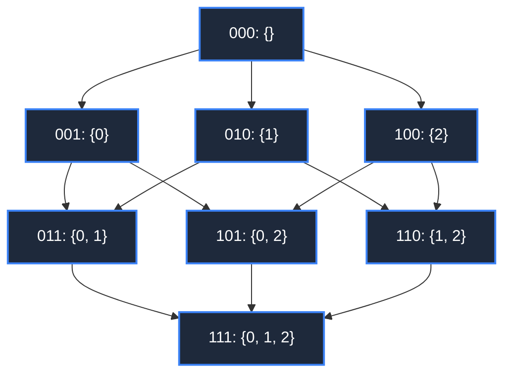

# 📘 WEEK 11: DAY 03 — BITMASK & SUBSET DYNAMIC PROGRAMMING

> 🧭 **Navigation:** [← Previous Day](Week_11_Day_02_DP_On_DAGs_Instructional.md) • [🏠 Week Overview](README.md) • [📘 Curriculum Syllabus](../COMPLETE_SYLLABUS.md) • [Next Day →](Week_11_Day_04_State_Compression_And_Optimizations_Instructional.md)
> 
> 💡 **Instructor Note:** *Bitmask DP compresses a boolean subset of `N` items into the bits of a single primitive integer. It transforms factorial brute force `O(N!)` into manageable exponential time `O(2^N * N^2)` or `O(2^N * N)`. The universal interview boundary is `N <= 20`.*

---

## 📋 TABLE OF CONTENTS

1. [Context & Motivation: Compressing Sets into Integers](#-chapter-1-context--motivation)
2. [Mental Model & Bitwise Primitives](#-chapter-2-mental-model--bitwise-primitives)
3. [Production Implementations (C# .NET 8/9 & Python 3.11+)](#-chapter-3-mechanics--production-implementations)
   - [Problem 1: Traveling Salesman Problem (TSP / Held-Karp Algorithm)](#problem-1-traveling-salesman-problem-tsp--held-karp)
   - [Problem 2: Minimum Cost Worker-to-Task Assignment](#problem-2-minimum-cost-worker-to-task-assignment)
   - [Problem 3: Maximum Weight Independent Set on Small Graphs](#problem-3-maximum-weight-independent-set-on-small-graphs)
   - [Problem 4: Submask Enumeration (SOS DP Foundation)](#problem-4-submask-enumeration-sos-dp-foundation)
4. [Performance, Trade-offs & The `N <= 20` Feasibility Boundary](#-chapter-4-performance-trade-offs--the-n--20-feasibility-boundary)
5. [Explicit Complexity Deconstruction](#-chapter-5-explicit-complexity-deconstruction)
6. [45-Minute Interview Verbal Walkthrough Script](#-chapter-6-45-minute-interview-verbal-walkthrough-script)
7. [Practice Matrix & Interview Traps](#-chapter-7-practice-matrix--interview-traps)

---

## 🎯 LEARNING OBJECTIVES

*By the end of this chapter, you will be able to:*
- 🎯 **Internalize** how an integer's binary representation represents subset membership with `O(1)` CPU cycle operations.
- ⚙️ **Master** bit manipulation primitives: setting, clearing, toggling, popcount, and iterating submasks via `(sub - 1) & mask`.
- 🧩 **Implement** the Held-Karp TSP algorithm (`O(2^N * N^2)`) and Minimum Cost Assignment (`O(2^N * N)`) with path reconstruction in C# (.NET 8/9) and Python (3.11+).
- ⚖️ **Evaluate** the hard limits of exponential complexity: why `N = 20` executes in milliseconds while `N = 30` exhausts server memory.
- 🎙️ **Articulate** subset state transitions and prune dead branches in a 45-minute FAANG/Tier-1 interview.

---

## 📖 CHAPTER 1: CONTEXT & MOTIVATION

### The Factorial Catastrophe

Consider problems that require ordering or partitioning `N` distinct entities:
- Finding the shortest round-trip visiting `N` delivery destinations (TSP).
- Matching `N` software engineers to `N` projects according to preference matrices.
- Finding the largest conflict-free subset of nodes in a network.

Brute-force permutation enumeration requires checking `N!` configurations. 
For `N = 16`, `16! ≈ 2.09 * 10^13` operations. Even on a modern 4.0 GHz CPU executing 1 billion iterations per second, brute force takes over **5.8 hours**.

```
Growth Comparison for N = 16:
  Factorial Brute Force: N!           = 20,922,789,888,000 ops (5.8 hours)
  Held-Karp Bitmask DP:  2^N * N^2    = 65,536 * 256 = 16,777,216 ops (0.016 seconds!)
```

Bitmask DP replaces **orderings** with **subsets**:
Instead of remembering the exact sequence of 10 visited cities, we only need to know:
1. **Which subset** of cities has been visited? (Captured by `mask`).
2. **Where** are we currently standing? (Captured by `last_city`).

This insight reduces the search space from `O(N!)` permutations down to `O(2^N * N)` distinct states.

> [!NOTE]
> **Interview Context & Production Systems**
> Bitmask DP solves real-world combinatorial optimization problems where `N` is naturally small: flight crew scheduling pairings in airline dispatch engines, vehicle routing fleet dispatch for localized delivery clusters, optimal register allocation in compiler backends (e.g. coloring variables across 16 hardware registers), and FPGA hardware logic synthesis.

---

## 🧠 CHAPTER 2: MENTAL MODEL & BITWISE PRIMITIVES

### Bitmask Representation of Subsets

An integer is fundamentally an array of bits. If item `i` is included in our subset, the `i`-th bit is set to `1`.

```
Representing Subset {0, 2, 3} from Universe of 5 Elements:

Bit Index:     4   3   2   1   0
Bit Value:     0   1   1   0   1   =  (1 << 3) | (1 << 2) | (1 << 0)
                                   =  8 + 4 + 1 = 13
```

### Bitwise Operation Reference Card

| Goal | Bitwise Formula | Explanation | CPU Cycles |
| :--- | :--- | :--- | :--- |
| **Check if item `i` is in mask** | `(mask & (1 << i)) != 0` | Isolates bit `i` | 1 |
| **Add item `i` to mask** | `mask | (1 << i)` | Sets bit `i` to 1 | 1 |
| **Remove item `i` from mask** | `mask & ~(1 << i)` | Clears bit `i` to 0 | 1 |
| **Toggle item `i`** | `mask ^ (1 << i)` | Inverts bit `i` | 1 |
| **Count elements in subset** | `BitOperations.PopCount(mask)` | Counts set bits | 1 (Hardware instruction `POPCNT`) |
| **Get lowest set bit** | `mask & -mask` | Isolates lowest 1-bit | 1 |
| **Full set of `N` items** | `(1 << N) - 1` | `N` ones in binary | 1 |

### Subset Transition Lattice



Notice that standard outer loop iteration `for mask in range(1 << N)` visits masks in strictly non-decreasing order of subset size, automatically guaranteeing that all subproblems are computed before larger supersets!

---

## ⚙️ CHAPTER 3: MECHANICS & PRODUCTION IMPLEMENTATIONS

### Problem 1: Traveling Salesman Problem (TSP / Held-Karp)

**Problem Statement:** Given an `N x N` distance matrix, find the minimum cost to start at city `0`, visit every other city exactly once, and return to city `0`. Also reconstruct the optimal tour.

#### State Formulation & Recurrence
- **State:** `dp[mask][u]` = minimum cost of visiting the subset of cities in `mask`, ending at city `u`.
- **Base Case:** `dp[1 << 0][0] = 0` (only city 0 visited, cost is 0). All others initialized to `infinity`.
- **Transition:** For every unvisited city `v` (`(mask & (1 << v)) == 0`):
  `dp[mask | (1 << v)][v] = min(dp[mask | (1 << v)][v], dp[mask][u] + dist[u][v])`.
- **Tour Closure:** When `mask == (1 << N) - 1`, close the cycle:
  `ans = min over u in [1, N-1] of (dp[(1 << N) - 1][u] + dist[u][0])`.

#### Production C# (.NET 8/9) Implementation
```csharp
namespace Week11.BitmaskDP;

public sealed class TravelingSalesmanSolution
{
    private const int Infinity = 1_000_000_000;

    public readonly record struct TspResult(int MinCost, List<int> Tour);

    public static TspResult SolveTsp(int[,] dist)
    {
        int n = dist.GetLength(0);
        int totalStates = 1 << n;

        var dp = new int[totalStates, n];
        var parent = new int[totalStates, n];

        for (int mask = 0; mask < totalStates; mask++)
        {
            for (int u = 0; u < n; u++)
            {
                dp[mask, u] = Infinity;
                parent[mask, u] = -1;
            }
        }

        // Base case: Start at city 0
        dp[1 << 0, 0] = 0;

        for (int mask = 1; mask < totalStates; mask++)
        {
            for (int u = 0; u < n; u++)
            {
                if (dp[mask, u] >= Infinity) continue;
                if ((mask & (1 << u)) == 0) continue;

                for (int v = 0; v < n; v++)
                {
                    if ((mask & (1 << v)) != 0) continue; // Already visited

                    int nextMask = mask | (1 << v);
                    int candidateCost = dp[mask, u] + dist[u, v];

                    if (candidateCost < dp[nextMask, v])
                    {
                        dp[nextMask, v] = candidateCost;
                        parent[nextMask, v] = u;
                    }
                }
            }
        }

        // Close tour back to city 0
        int fullMask = totalStates - 1;
        int minCost = Infinity;
        int lastCity = -1;

        for (int u = 1; u < n; u++)
        {
            int totalCost = dp[fullMask, u] + dist[u, 0];
            if (totalCost < minCost)
            {
                minCost = totalCost;
                lastCity = u;
            }
        }

        // Reconstruct path
        var tour = new List<int>();
        int currMask = fullMask;
        int currCity = lastCity;

        while (currCity != -1)
        {
            tour.Add(currCity);
            int prev = parent[currMask, currCity];
            currMask ^= (1 << currCity);
            currCity = prev;
        }

        tour.Reverse();
        tour.Add(0); // Complete round-trip

        return new TspResult(minCost, tour);
    }
}
```

#### Idiomatic Python (3.11+) Implementation
```python
from typing import List, Tuple


def solve_tsp(dist: List[List[int]]) -> Tuple[int, List[int]]:
    """Returns (min_cost, reconstructed_tour)."""
    n = len(dist)
    total_states = 1 << n
    INF = float('inf')

    dp = [[INF] * n for _ in range(total_states)]
    parent = [[-1] * n for _ in range(total_states)]

    # Base case: start at city 0
    dp[1 << 0][0] = 0

    for mask in range(1, total_states):
        for u in range(n):
            if dp[mask][u] == INF:
                continue
            if not (mask & (1 << u)):
                continue

            for v in range(n):
                if mask & (1 << v):
                    continue  # Already in subset

                next_mask = mask | (1 << v)
                cost = dp[mask][u] + dist[u][v]
                if cost < dp[next_mask][v]:
                    dp[next_mask][v] = cost
                    parent[next_mask][v] = u

    full_mask = total_states - 1
    min_cost = INF
    last_city = -1

    for u in range(1, n):
        tour_cost = dp[full_mask][u] + dist[u][0]
        if tour_cost < min_cost:
            min_cost = tour_cost
            last_city = u

    # Reconstruct Tour
    tour = []
    curr_mask = full_mask
    curr_city = last_city

    while curr_city != -1:
        tour.append(curr_city)
        prev = parent[curr_mask][curr_city]
        curr_mask ^= (1 << curr_city)
        curr_city = prev

    tour.reverse()
    tour.append(0)  # Close cycle back to origin

    return int(min_cost), tour
```

---

### Problem 2: Minimum Cost Worker-to-Task Assignment

**Problem Statement:** You have `N` workers and `N` tasks. A matrix `cost[i][j]` represents the cost of assigning worker `i` to task `j`. Each worker must be assigned to exactly one unique task. Return the minimum total assignment cost.

#### Elegant Dimension Reduction
Notice: If a subset `mask` has `k` set bits, exactly `k` tasks have been assigned. By convention, those `k` tasks **must belong to workers `0` through `k-1`**!
Therefore, we do not need a 2D table `dp[worker][mask]`. The worker index is simply `PopCount(mask)`.
- **State:** `dp[mask]` = minimum cost to assign the first `PopCount(mask)` workers to the tasks in `mask`.
- **Size:** Exactly `2^N` states (eliminating a factor of `N` from storage!).

#### Production C# (.NET 8/9) Implementation
```csharp
using System.Numerics;

namespace Week11.BitmaskDP;

public sealed class AssignmentSolution
{
    public static int MinCostAssignment(int[][] cost)
    {
        int n = cost.Length;
        int totalStates = 1 << n;
        var dp = new int[totalStates];
        Array.Fill(dp, int.MaxValue / 2);

        dp[0] = 0; // 0 tasks assigned to 0 workers = cost 0

        for (int mask = 0; mask < totalStates; mask++)
        {
            if (dp[mask] == int.MaxValue / 2) continue;

            // Worker index equals number of tasks already assigned
            int worker = BitOperations.PopCount((uint)mask);
            if (worker >= n) continue;

            for (int task = 0; task < n; task++)
            {
                if ((mask & (1 << task)) == 0) // Task not yet assigned
                {
                    int nextMask = mask | (1 << task);
                    dp[nextMask] = Math.Min(dp[nextMask], dp[mask] + cost[worker][task]);
                }
            }
        }

        return dp[totalStates - 1];
    }
}
```

#### Idiomatic Python (3.11+) Implementation
```python
from typing import List


def min_cost_assignment(cost: List[List[int]]) -> int:
    n = len(cost)
    total_states = 1 << n
    INF = float('inf')
    dp = [INF] * total_states
    dp[0] = 0

    for mask in range(total_states):
        if dp[mask] == INF:
            continue

        # Current worker is the number of tasks already selected
        worker = mask.bit_count()
        if worker >= n:
            continue

        for task in range(n):
            if not (mask & (1 << task)):
                next_mask = mask | (1 << task)
                candidate = dp[mask] + cost[worker][task]
                if candidate < dp[next_mask]:
                    dp[next_mask] = candidate

    return int(dp[total_states - 1])
```

---

### Problem 3: Maximum Weight Independent Set on Small Graphs

**Problem Statement:** Given an undirected graph with `N <= 20` vertices and vertex weights, find a subset of vertices with maximum total weight such that no two chosen vertices share an edge.

#### Production C# (.NET 8/9) Implementation
```csharp
namespace Week11.BitmaskDP;

public sealed class MaxWeightIndependentSet
{
    public static int FindMaxWeightIndependentSet(int n, int[] weights, List<(int U, int V)> edges)
    {
        // 1. Build adjacency bitmasks for each vertex
        var adjMask = new int[n];
        foreach (var (u, v) in edges)
        {
            adjMask[u] |= (1 << v);
            adjMask[v] |= (1 << u);
        }

        int totalStates = 1 << n;
        var dp = new int[totalStates];
        Array.Fill(dp, -1);
        dp[0] = 0;

        int maxWeight = 0;

        for (int mask = 0; mask < totalStates; mask++)
        {
            if (dp[mask] == -1) continue;
            maxWeight = Math.Max(maxWeight, dp[mask]);

            // Find lowest available candidate to avoid duplicate permutations
            for (int v = 0; v < n; v++)
            {
                if ((mask & (1 << v)) == 0)
                {
                    // Check if candidate v is adjacent to any vertex already in mask
                    if ((adjMask[v] & mask) == 0)
                    {
                        int nextMask = mask | (1 << v);
                        dp[nextMask] = Math.Max(dp[nextMask], dp[mask] + weights[v]);
                    }
                }
            }
        }

        return maxWeight;
    }
}
```

#### Idiomatic Python (3.11+) Implementation
```python
from typing import List, Tuple


def max_weight_independent_set(
    n: int,
    weights: List[int],
    edges: List[Tuple[int, int]]
) -> int:
    adj_mask = [0] * n
    for u, v in edges:
        adj_mask[u] |= (1 << v)
        adj_mask[v] |= (1 << u)

    total_states = 1 << n
    dp = [-1] * total_states
    dp[0] = 0
    max_weight = 0

    for mask in range(total_states):
        if dp[mask] == -1:
            continue
        if dp[mask] > max_weight:
            max_weight = dp[mask]

        for v in range(n):
            if not (mask & (1 << v)):
                # If v shares no edge with existing vertices in mask
                if (adj_mask[v] & mask) == 0:
                    next_mask = mask | (1 << v)
                    if dp[mask] + weights[v] > dp[next_mask]:
                        dp[next_mask] = dp[mask] + weights[v]

    return max_weight
```

---

### Problem 4: Submask Enumeration (SOS DP Foundation)

To iterate over all submasks of a given mask efficiently without iterating from `0` to `2^N`:

```csharp
// Iterates strictly over submasks of 'mask' in O(2^(popcount(mask))) time
for (int sub = mask; sub > 0; sub = (sub - 1) & mask)
{
    // Process submask
}
```

> [!TIP]
> Iterating all submasks of all `2^N` masks takes `O(3^N)` total operations (by the Binomial Theorem: `sum of C(N, k) * 2^k = (1 + 2)^N = 3^N`), vastly faster than the naive `O(4^N)`.

---

## ⚖️ CHAPTER 4: PERFORMANCE, TRADE-OFFS & THE `N <= 20` FEASIBILITY BOUNDARY

| Subset Size `N` | States `2^N` | Operations (`2^N * N^2`) | Memory Footprint (4 bytes per state) | Feasibility Verdict |
| :--- | :--- | :--- | :--- | :--- |
| **`N = 10`** | `1,024` | `~10^5` | `4 KB` | 🟢 Instantaneous (`< 1 ms`) |
| **`N = 16`** | `65,536` | `~1.6 * 10^7` | `256 KB` | 🟢 Standard Interview Target (`~20 ms`) |
| **`N = 20`** | `1,048,576` | `~4.2 * 10^8` | `4 MB` | 🟡 Strict Upper Limit (`~200 ms`) |
| **`N = 25`** | `33,554,432` | `~2.1 * 10^10` | `128 MB` | 🔴 TLE in competitive programming |
| **`N = 30`** | `1,073,741,824` | `~9.6 * 10^11` | `4 GB` | ⛔ Infeasible: Out of Memory & TLE |

> [!WARNING]
> If a problem input specifies `N > 25`, **do not attempt Bitmask DP**. Look for Greedy properties, Meet-in-the-Middle (`O(2^(N/2))`), or Network Flow (e.g. Hungarian Algorithm for assignment in `O(N^3)`).

---

## 📊 CHAPTER 5: EXPLICIT COMPLEXITY DECONSTRUCTION

| Algorithm | State Dimensions | Time Complexity | Space Complexity | Why? |
| :--- | :--- | :--- | :--- | :--- |
| **TSP (Held-Karp)** | `dp[mask][last_city]` | `O(2^N * N^2)` | `O(2^N * N)` | `2^N` subsets, `N` endpoints, each transitions to `N` candidate next cities. |
| **Min Cost Assignment** | `dp[mask]` | `O(2^N * N)` | `O(2^N)` | `2^N` subsets; worker index is implicitly `PopCount(mask)`. |
| **Max Independent Set** | `dp[mask]` | `O(2^N * N)` | `O(2^N)` | Validates edge conflict with bitwise AND in `O(1)` per vertex. |
| **All Submasks Iteration** | All submasks of all masks | `O(3^N)` | `O(2^N)` | Every element is either not in mask, in mask and submask, or in mask but not submask (3 choices). |

---

## 🎙️ CHAPTER 6: 45-MINUTE INTERVIEW VERBAL WALKTHROUGH SCRIPT

```
[Minute 00-05] Constraint Spotting & Paradigm Identification
"Looking at the constraints, N is small: N is at most 16.
Problems with N <= 20 that ask for optimal ordering, subset partitioning, or visiting all nodes
strongly signal Bitmask Dynamic Programming.
A brute force permutation search would take O(N!), which is over 20 trillion iterations for N=16.
By representing the visited nodes as a bitmask, we collapse identical subproblems into O(2^N * N^2)."

[Minute 05-12] State Formulation & Space Optimization
"For TSP, order matters only for the current boundary.
I'll define dp[mask][u] as the minimum cost to visit all cities in mask, ending at city u.
The integer mask acts as an array of booleans where bit i indicates whether city i has been visited.
Base case: dp[1 << 0][0] = 0.
Transitions: for every unvisited city v where (mask & (1 << v)) == 0,
dp[mask | (1 << v)][v] = min(dp[mask | (1 << v)][v], dp[mask][u] + dist[u][v])."

[Minute 12-25] Implementation & Bitwise Safety
"I will allocate a 2D array of size (1 << n) by n, initialized to infinity.
Notice the outer loop simply increments mask from 1 to (1 << n) - 1.
Because adding an element always increases the numerical value of the mask,
evaluating masks in standard integer order guarantees all smaller subsets are computed first.
To reconstruct the tour, I'll maintain a parent[mask][u] table."

[Minute 25-35] Tracing Sample & Cycle Closure
"Let's trace a 4-city example.
Starting from mask 0001 (city 0), we transition to 0011 (cities 0 and 1), 0101 (cities 0 and 2), etc.
Once we reach the full mask 1111, we evaluate the cost to return to city 0 from each possible endpoint u.
The minimum sum gives our optimal Hamiltonian cycle cost."

[Minute 35-45] Complexity & Edge Case Verification
"Time Complexity: Exactly O(2^N * N^2) operations. For N=16, this is ~1.6 * 10^7 operations, well within the 1-second 10^8 budget.
Space Complexity: O(2^N * N) integers, which is 65,536 * 16 * 4 bytes ≈ 4 MB of memory.
Follow-up: If N were up to 30, bitmask DP would exceed memory limits. In that case, I would explore Meet-in-the-Middle
to divide the problem into two 2^(N/2) subsets, or heuristics like Simulated Annealing."
```

---

## 📚 CHAPTER 7: PRACTICE MATRIX & INTERVIEW TRAPS

### Problem Ladder

| Problem | LeetCode | Difficulty | Key Concept |
| :--- | :--- | :--- | :--- |
| **Can I Win** | LC 292 | 🟡 Medium | Game Theory + Bitmask Memoization |
| **Partition to K Equal Sum Subsets** | LC 698 | 🟡 Medium | Bitmask Subset Packing |
| **Find the Shortest Superstring** | LC 943 | 🔴 Hard | Traveling Salesman on String Overlaps |
| **Minimum Cost to Connect Two Groups** | LC 1595 | 🔴 Hard | Bipartite Bitmask DP with Precomputations |
| **Number of Squareful Arrays** | LC 996 | 🔴 Hard | Hamiltonian Path Enumeration with Bitmask |

### Critical Traps to Avoid
1. **Operator Precedence Pitfall**: In C# and Python, bitwise operators (`&`, `|`, `^`) have **lower precedence** than comparison operators (`==`, `!=`). Always write `(mask & (1 << i)) != 0`, never `mask & (1 << i) != 0`!
2. **Bit Shift Overflow**: Shifting beyond 31 bits with an `int` causes silent overflow or undefined behavior. For `N > 31`, use `1L << i` in C# or native arbitrarily-large integers in Python.
3. **Redundant Worker Dimensions**: When matching `N` items to `N` slots, remember that `PopCount(mask)` uniquely identifies the current step. Never add an extra dimension for `worker_index`.

---

> 🧭 **Navigation:** [← Previous Day](Week_11_Day_02_DP_On_DAGs_Instructional.md) • [🏠 Week Overview](README.md) • [📘 Curriculum Syllabus](../COMPLETE_SYLLABUS.md) • [Next Day →](Week_11_Day_04_State_Compression_And_Optimizations_Instructional.md)
