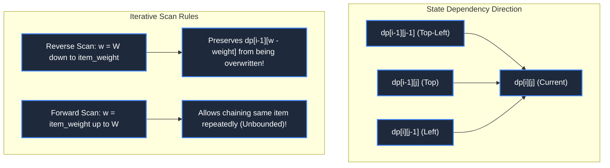

# 📘 WEEK 11: DAY 04 — STATE COMPRESSION & OPTIMIZATION TECHNIQUES

> 🧭 **Navigation:** [← Previous Day](Week_11_Day_03_Bitmask_And_Subset_DP_Instructional.md) • [🏠 Week Overview](README.md) • [📘 Curriculum Syllabus](../COMPLETE_SYLLABUS.md) • [Next Day →](Week_11_Day_05_Mixed_DP_Problems_Instructional.md)
> 
> 💡 **Instructor Note:** *Space optimization is the hallmark of a senior algorithm engineer. When a DP state only depends on the immediately preceding row or subproblem, storing the full matrix wastes memory and evicts CPU cache lines. We reduce space from `O(M * N)` to `O(min(M, N))` or `O(1)`.*

---

## 📋 TABLE OF CONTENTS

1. [Context & Motivation: The Memory & Cache Bottleneck](#-chapter-1-context--motivation)
2. [Mental Model & Rolling Buffer Mechanics](#-chapter-2-mental-model--rolling-buffer-mechanics)
3. [Production Implementations (C# .NET 8/9 & Python 3.11+)](#-chapter-3-mechanics--production-implementations)
   - [Problem 1: Longest Common Subsequence (2D to 1D Array + Diagonal)](#problem-1-longest-common-subsequence-lcs)
   - [Problem 2: 0/1 Knapsack Space Compression (Reverse Iteration Invariant)](#problem-2-01-knapsack-space-compression)
   - [Problem 3: Unbounded Knapsack / Coin Change (Forward Iteration Invariant)](#problem-3-unbounded-knapsack--coin-change)
   - [Problem 4: Branch-and-Bound Pruning (Optimistic Fractional Knapsack)](#problem-4-branch-and-bound-pruning)
4. [Performance, Trade-offs & Systems Reality](#-chapter-4-performance-trade-offs--systems-reality)
5. [Explicit Complexity Deconstruction](#-chapter-5-explicit-complexity-deconstruction)
6. [45-Minute Interview Verbal Walkthrough Script](#-chapter-6-45-minute-interview-verbal-walkthrough-script)
7. [Practice Matrix & Interview Traps](#-chapter-7-practice-matrix--interview-traps)

---

## 🎯 LEARNING OBJECTIVES

*By the end of this chapter, you will be able to:*
- 🎯 **Identify** spatial dependency horizons: determine whether a DP recurrence depends on `O(1)`, `O(N)`, or `O(M * N)` history.
- ⚙️ **Compress** 2D tables into 2 alternating rows (`prev` and `curr`), and further into a single 1D array.
- 🧩 **Distinguish** between reverse iteration (0/1 Knapsack, preventing reuse) and forward iteration (Unbounded Knapsack, enabling reuse).
- ⚖️ **Evaluate** the space-reconstruction trade-off: why compressing to `O(N)` space destroys straightforward `O(1)` path back-pointers and how Hirschberg's algorithm recovers them.
- 🎙️ **Proactively propose** space optimization in a 45-minute technical interview without prompting from the interviewer.

---

## 📖 CHAPTER 1: CONTEXT & MOTIVATION

### The Cache Line Reality

In textbook computer science, a 2D table `dp[10000][10000]` has time complexity `O(M * N)` and space complexity `O(M * N)`.
In production systems, that table requires `10,000 * 10,000 * 4 bytes = 400 MB` of RAM.
Allocating 400 MB causes:
1. **L1/L2/L3 Cache Thrashing**: A modern CPU L3 cache is typically 16 MB to 32 MB. A 400 MB table cannot fit in cache, forcing the processor to stall on high-latency DRAM reads (200 CPU cycles per miss).
2. **Memory Allocation Latency**: Garbage collection (GC) pressure in .NET or Python causes thread pauses and memory fragmentation.
3. **Out-of-Memory (OOM) Crashes**: Embedded systems, mobile apps, or high-concurrency microservices processing 1,000 requests/sec will crash instantly under 400 MB per request.

```
Memory Hierarchy vs DP Table Footprint:
  L1 Cache: ~48 KB       (0.5 ns latency)  <-- Fits 1D array of 10,000 ints (40 KB)!
  L2 Cache: ~1.25 MB     (3 ns latency)
  L3 Cache: ~32 MB       (12 ns latency)
  DRAM RAM: ~32 GB+      (60-100 ns latency) <-- 2D table of 400 MB thrashes here!
```

By compressing the state from `O(M * N)` to `O(N)`, our working memory drops from **400 MB down to 40 KB**—fitting entirely inside ultra-fast **L1 CPU Cache**!

> [!NOTE]
> **Interview Context & Production Systems**
> State compression is standard in high-throughput engines: genomic DNA alignment pipelines (BLAST, NCBI) compressing gigabyte pairwise edit matrices, HFT risk engines calculating real-time portfolio VaR across thousands of assets, ML frameworks (PyTorch, TensorFlow) using gradient activation checkpointing to train 70B parameter models within GPU VRAM, and mobile navigation route recalculation.

---

## 🧠 CHAPTER 2: MENTAL MODEL & ROLLING BUFFER MECHANICS

### From 2D Matrix to 1D In-Place Buffer

```
Evolution of DP Table Storage:

Stage 1: Full 2D Grid Storage (Space: O(M * N))
Row 0: [ . . . . . . . . ] (Never needed after Row 1!)
Row 1: [ . . . . . . . . ] (Never needed after Row 2!)
Row 2: [ . . . . . . . . ] 
...
Row M: [ . . . . . . . . ]

Stage 2: 2-Row Alternating Ping-Pong Buffer (Space: O(2 * N))
prev:  [ . . . . . . . . ]  <-- Read only
curr:  [ . . . . . . . . ]  <-- Write only
(At end of outer loop, swap(prev, curr))

Stage 3: Single 1D In-Place Buffer (Space: O(N))
dp:    [ . . . . . . . . ]  <-- Overwritten in-place
```



---

## ⚙️ CHAPTER 3: MECHANICS & PRODUCTION IMPLEMENTATIONS

### Problem 1: Longest Common Subsequence (LCS)

**Problem Statement (LeetCode 1143):** Given two strings `text1` and `text2`, return the length of their longest common subsequence.

#### Space Evolution
- **Naive 2D:** `dp[m + 1][n + 1]` requires `O(m * n)` space.
- **2-Row Rolling Buffer:** `prev[n + 1]` and `curr[n + 1]` requires `O(n)` space.
- **Single 1D Array + Diagonal Variable:** Maintaining `dp[j]` with a temporary scalar `prevDiagonal` tracking `dp[i-1][j-1]` achieves single-array `O(min(m, n))` space!

#### Production C# (.NET 8/9) Implementation
```csharp
namespace Week11.StateCompression;

public sealed class LcsOptimizedSolution
{
    public static int LongestCommonSubsequence(string text1, string text2)
    {
        // Optimization: Ensure text2 is always the shorter string to minimize space
        if (text1.Length < text2.Length)
        {
            (text1, text2) = (text2, text1);
        }

        int m = text1.Length;
        int n = text2.Length;

        // Space: O(min(m, n))
        var dp = new int[n + 1];

        for (int i = 1; i <= m; i++)
        {
            int prevDiagonal = 0; // Represents dp[i - 1][j - 1]

            for (int j = 1; j <= n; j++)
            {
                int temp = dp[j]; // Save dp[i - 1][j] before it gets overwritten

                if (text1[i - 1] == text2[j - 1])
                {
                    dp[j] = prevDiagonal + 1;
                }
                else
                {
                    dp[j] = Math.Max(dp[j], dp[j - 1]);
                }

                prevDiagonal = temp; // Set up diagonal for the next column (j + 1)
            }
        }

        return dp[n];
    }
}
```

#### Idiomatic Python (3.11+) Implementation
```python
def longest_common_subsequence(text1: str, text2: str) -> int:
    # Ensure text2 is the shorter string
    if len(text1) < len(text2):
        text1, text2 = text2, text1

    m, n = len(text1), len(text2)
    dp = [0] * (n + 1)

    for i in range(1, m + 1):
        prev_diagonal = 0  # Represents dp[i - 1][j - 1]
        for j in range(1, n + 1):
            temp = dp[j]  # Current dp[j] is dp[i - 1][j] from previous row
            if text1[i - 1] == text2[j - 1]:
                dp[j] = prev_diagonal + 1
            else:
                dp[j] = max(dp[j], dp[j - 1])
            prev_diagonal = temp

    return dp[n]
```

---

### Problem 2: 0/1 Knapsack Space Compression

**Problem Statement:** Given `N` items with weights and values, and capacity `W`, choose items to maximize value such that total weight `<= W`. Each item can be chosen **at most once**.

#### Why Reverse Iteration Prevents Reuse
In 2D: `dp[i][w] = max(dp[i - 1][w], dp[i - 1][w - weight] + value)`.
Notice that `dp[i][w]` needs values from the **previous row** `i - 1` at a **smaller weight** `w - weight`.
- If we scan **left-to-right (forward)**: `dp[w - weight]` gets updated with item `i` before we compute `dp[w]`. Then `dp[w]` uses the newly updated value, accidentally using item `i` **twice**!
- If we scan **right-to-left (reverse)**: `dp[w]` uses the old value of `dp[w - weight]` before `w - weight` has been modified. This strictly preserves the 0/1 constraint!

#### Production C# (.NET 8/9) Implementation
```csharp
namespace Week11.StateCompression;

public sealed class Knapsack01Compressed
{
    public static int SolveKnapsack(int[] weights, int[] values, int capacity)
    {
        var dp = new int[capacity + 1];

        for (int i = 0; i < weights.Length; i++)
        {
            int w_i = weights[i];
            int v_i = values[i];

            // CRITICAL: Reverse loop down to w_i
            for (int w = capacity; w >= w_i; w--)
            {
                dp[w] = Math.Max(dp[w], dp[w - w_i] + v_i);
            }
        }

        return dp[capacity];
    }
}
```

#### Idiomatic Python (3.11+) Implementation
```python
from typing import List


def solve_01_knapsack(weights: List[int], values: List[int], capacity: int) -> int:
    dp = [0] * (capacity + 1)

    for w_i, v_i in zip(weights, values):
        # Reverse loop down to w_i prevents multi-use
        for w in range(capacity, w_i - 1, -1):
            if dp[w - w_i] + v_i > dp[w]:
                dp[w] = dp[w - w_i] + v_i

    return dp[capacity]
```

---

### Problem 3: Unbounded Knapsack / Coin Change

**Problem Statement (LeetCode 322):** Given coin denominations and total `amount`, return the fewest coins needed to make up that amount. Each denomination is available in **unlimited quantities**.

#### Forward Iteration Enabler
Because we have infinite supply of each coin, we **want** the current coin's choice to be available immediately for the next capacity in the same row!
- Recurrence: `dp[w] = min(dp[w], dp[w - coin] + 1)`.
- Scanning **left-to-right (forward)** naturally allows `dp[w]` to chain on top of `dp[w - coin]`, modeling infinite reuse in `O(amount)` space!

#### Production C# (.NET 8/9) Implementation
```csharp
namespace Week11.StateCompression;

public sealed class CoinChangeSolution
{
    public static int CoinChange(int[] coins, int amount)
    {
        var dp = new int[amount + 1];
        Array.Fill(dp, amount + 1); // Sentinel for infinity
        dp[0] = 0;

        foreach (int coin in coins)
        {
            // CRITICAL: Forward loop from coin up to amount enables unbounded reuse
            for (int w = coin; w <= amount; w++)
            {
                dp[w] = Math.Min(dp[w], dp[w - coin] + 1);
            }
        }

        return dp[amount] > amount ? -1 : dp[amount];
    }
}
```

#### Idiomatic Python (3.11+) Implementation
```python
from typing import List


def coin_change(coins: List[int], amount: int) -> int:
    INF = amount + 1
    dp = [INF] * (amount + 1)
    dp[0] = 0

    for coin in coins:
        # Forward scan from coin to amount enables unbounded reuse
        for w in range(coin, amount + 1):
            if dp[w - coin] + 1 < dp[w]:
                dp[w] = dp[w - coin] + 1

    return -1 if dp[amount] > amount else dp[amount]
```

---

### Problem 4: Branch-and-Bound Pruning

**Problem Statement:** When `capacity` is astronomical (e.g. `W = 10^9`) but item count is small (`N <= 40`), tabulation `O(N * W)` will OOM. We apply Branch-and-Bound with an optimistic fractional upper bound.

#### Pruning Metric: Fractional Knapsack Upper Bound
Sort items by value-to-weight density `v_i / w_i`.
At any branch in our search, we calculate an optimistic upper bound by assuming we can fractionally take the next item. If `currentValue + upperBound <= bestKnownValue`, we prune the entire subtree!

#### Production C# (.NET 8/9) Implementation
```csharp
namespace Week11.StateCompression;

public sealed class BranchAndBoundKnapsack
{
    public static int SolveKnapsack(int[] weights, int[] values, int capacity)
    {
        int n = weights.Length;
        var items = new (int Weight, int Value)[n];
        for (int i = 0; i < n; i++)
        {
            items[i] = (weights[i], values[i]);
        }

        // Sort descending by value-to-weight density
        Array.Sort(items, (a, b) => ((long)b.Value * a.Weight).CompareTo((long)a.Value * b.Weight));

        int globalBest = 0;

        void Dfs(int idx, int remCapacity, int currValue)
        {
            globalBest = Math.Max(globalBest, currValue);
            if (idx == n || remCapacity == 0) return;

            // Compute optimistic upper bound using fractional knapsack
            double upperBound = currValue;
            int tempCap = remCapacity;
            for (int i = idx; i < n; i++)
            {
                if (items[i].Weight <= tempCap)
                {
                    upperBound += items[i].Value;
                    tempCap -= items[i].Weight;
                }
                else
                {
                    upperBound += (double)items[i].Value * tempCap / items[i].Weight;
                    break;
                }
            }

            // PRUNING: Can this branch beat our known best?
            if (upperBound <= globalBest) return;

            // Choice 1: Include item (if it fits)
            if (items[idx].Weight <= remCapacity)
            {
                Dfs(idx + 1, remCapacity - items[idx].Weight, currValue + items[idx].Value);
            }

            // Choice 2: Exclude item
            Dfs(idx + 1, remCapacity, currValue);
        }

        Dfs(0, capacity, 0);
        return globalBest;
    }
}
```

#### Idiomatic Python (3.11+) Implementation
```python
from typing import List


def knapsack_branch_and_bound(weights: List[int], values: List[int], capacity: int) -> int:
    items = sorted(zip(weights, values), key=lambda x: x[1] / x[0], reverse=True)
    n = len(items)
    global_best = 0

    def dfs(idx: int, rem_cap: int, curr_val: int) -> None:
        nonlocal global_best
        global_best = max(global_best, curr_val)
        if idx == n or rem_cap == 0:
            return

        # Fractional knapsack upper bound
        upper_bound = float(curr_val)
        temp_cap = rem_cap
        for i in range(idx, n):
            w, v = items[i]
            if w <= temp_cap:
                upper_bound += v
                temp_cap -= w
            else:
                upper_bound += v * (temp_cap / w)
                break

        if upper_bound <= global_best:
            return  # Prune branch

        # Branch 1: Include item
        w, v = items[idx]
        if w <= rem_cap:
            dfs(idx + 1, rem_cap - w, curr_val + v)

        # Branch 2: Exclude item
        dfs(idx + 1, rem_cap, curr_val)

    dfs(0, capacity, 0)
    return global_best
```

---

## ⚖️ CHAPTER 4: PERFORMANCE, TRADE-OFFS & SYSTEMS REALITY

### The Space-Reconstruction Dilemma

| Approach | Space Complexity | L1 Cache Friendly? | Path Reconstruction Feasibility |
| :--- | :--- | :--- | :--- |
| **Full 2D Grid** | `O(M * N)` | ❌ No (Triggers cache misses) | 🟢 Trivial: Walk back-pointers in `O(M + N)` |
| **2-Row Rolling Buffer** | `O(min(M, N))` | ✅ Yes (Fits in cache) | ❌ Broken: Intermediate rows discarded |
| **Hirschberg's Algorithm** | `O(min(M, N))` | ✅ Yes | 🟢 Possible via Divide-and-Conquer DP in `O(M * N)` time |

> [!IMPORTANT]
> In an interview, always ask: **"Do you need only the optimal scalar value, or do you need to reconstruct the chosen path/items?"**
> If only the scalar is required, compress immediately to `O(N)`. If reconstruction is required, explain that standard compression loses history, and justify keeping the 2D table or invoking Hirschberg's divide-and-conquer strategy.

---

## 📊 CHAPTER 5: EXPLICIT COMPLEXITY DECONSTRUCTION

| Problem | Naive Space | Compressed Space | Scan Direction | Invariant Preserved |
| :--- | :--- | :--- | :--- | :--- |
| **LCS** | `O(M * N)` | `O(min(M, N))` | Forward + Diagonal Var | `dp[i-1][j-1]` preserved in scalar register |
| **0/1 Knapsack** | `O(N * W)` | `O(W)` | **Reverse** (`W -> weight`) | Guarantees item used **at most once** |
| **Unbounded Knapsack** | `O(N * W)` | `O(W)` | **Forward** (`weight -> W`) | Enables item to be used **unlimited times** |
| **Edit Distance** | `O(M * N)` | `O(min(M, N))` | Forward + Diagonal Var | Only current and previous character edit costs |
| **Branch & Bound** | `O(2^N)` | `O(N)` (call stack) | Pruned Depth-First | Fractional greedy bound cuts subtrees |

---

## 🎙️ CHAPTER 6: 45-MINUTE INTERVIEW VERBAL WALKTHROUGH SCRIPT

```
[Minute 00-05] Clarification & Problem Modeling
"We want to solve the 0/1 Knapsack problem with capacity W and N items.
The canonical formulation uses a 2D table dp[i][w] representing the max value using a subset of the first i items.
However, before writing code, I notice that computing row i only depends on values from row i - 1.
We never look back at row i - 2 or earlier.
Therefore, storing an N x W matrix wastes memory. I propose optimizing the auxiliary space from O(N * W) down to O(W)."

[Minute 05-12] Directional Invariant Explanation
"If we compress the 2D table into a single 1D array dp[w], loop direction becomes critical.
The recurrence is: dp[w] = max(dp[w], dp[w - weight] + value).
If we scan w forward from 0 to W, we overwrite dp[w - weight] with the current item's contribution,
which would allow the current item to be picked multiple times (unbounded knapsack).
To enforce the 0/1 constraint (each item picked at most once), we must iterate w in reverse, from W down to weight.
This guarantees that when computing dp[w], dp[w - weight] still holds the value from the previous item."

[Minute 12-25] Implementation & Dual Language Syntax
"I will write the compressed solution.
Initialize an array dp of size capacity + 1 with 0.
Outer loop iterates through each item (weight, value).
Inner loop counts backwards: for w = capacity down to weight.
Update dp[w] = Math.Max(dp[w], dp[w - weight] + value).
Finally, return dp[capacity]."

[Minute 25-35] Tracing & Dry Run
"Let's trace: Item with weight 3, value 10, capacity 5.
Before item: dp = [0, 0, 0, 0, 0, 0].
Inner loop w = 5: dp[5] = max(0, dp[2] + 10) = 10.
Inner loop w = 4: dp[4] = max(0, dp[1] + 10) = 10.
Inner loop w = 3: dp[3] = max(0, dp[0] + 10) = 10.
Notice dp[2], dp[1], dp[0] remained 0 because we evaluated in reverse. No item was duplicated."

[Minute 35-45] Complexity & Trade-offs
"Time Complexity: O(N * W), exactly identical to the 2D approach.
Space Complexity: O(W) auxiliary space instead of O(N * W).
For W = 10,000, this takes 40 KB, fitting directly into L1 cache for maximum memory bandwidth.
Follow-up: If asked to output the exact items chosen, I'd explain that 1D compression discards the decision tree.
We can either retain the 2D table if memory permits, or use Hirschberg's divide-and-conquer algorithm in O(N * W) time and O(W) space."
```

---

## 📚 CHAPTER 7: PRACTICE MATRIX & INTERVIEW TRAPS

### Problem Ladder

| Problem | LeetCode | Difficulty | Space Optimization |
| :--- | :--- | :--- | :--- |
| **Minimum Path Sum** | LC 64 | 🟡 Medium | 2D Grid -> 1D Row (`O(N)`) |
| **Coin Change II** | LC 518 | 🟡 Medium | 1D Forward Iteration (`O(Amount)`) |
| **Target Sum** | LC 494 | 🟡 Medium | 1D Reverse 0/1 Subset Sum |
| **Edit Distance** | LC 72 | 🔴 Hard | 2-Row or 1D Array + Diagonal |
| **Burst Balloons** | LC 312 | 🔴 Hard | Interval DP (Diagonal scan) |

### Critical Traps to Avoid
1. **Looping Forward on 0/1 Knapsack**: Forgetting to reverse the inner loop in 0/1 Knapsack turns your solution into Unbounded Knapsack, silently returning incorrect values for test cases with repeatable items.
2. **Forgetting Array Swap in 2-Row DP**: When using `prev` and `curr` arrays, remember to swap references at the end of each outer loop iteration (`(prev, curr) = (curr, prev)`), or zero out `curr` before reusing.
3. **Overwriting Diagonal Values**: In LCS/Edit Distance with a single 1D array, you must save `dp[j]` in a temporary variable before updating `dp[j]`, otherwise `prevDiagonal` (`dp[i-1][j-1]`) is permanently lost.

---

> 🧭 **Navigation:** [← Previous Day](Week_11_Day_03_Bitmask_And_Subset_DP_Instructional.md) • [🏠 Week Overview](README.md) • [📘 Curriculum Syllabus](../COMPLETE_SYLLABUS.md) • [Next Day →](Week_11_Day_05_Mixed_DP_Problems_Instructional.md)
