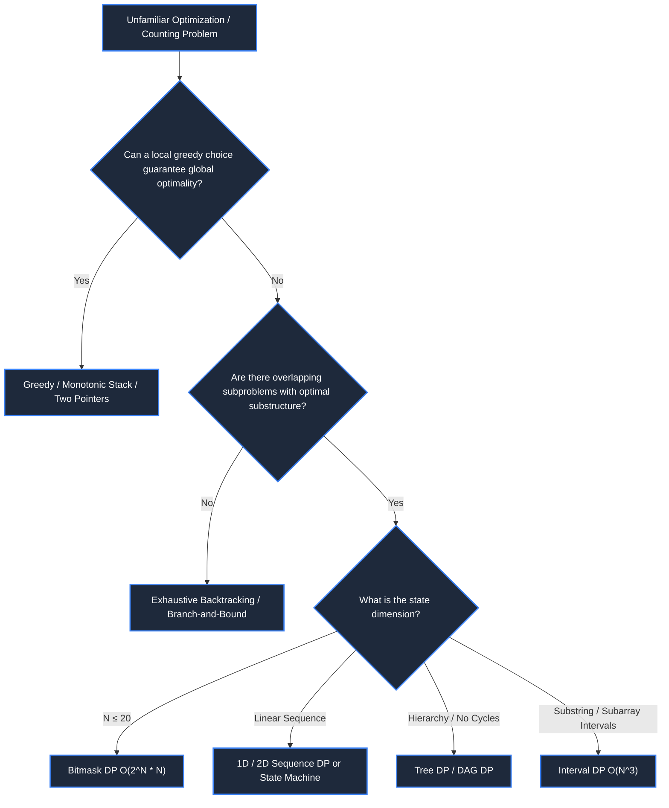

# 📘 WEEK 11: DAY 05 — MIXED DP PROBLEMS & SYNTHESIS MASTERY

> 🧭 **Navigation:** [← Previous Day](Week_11_Day_04_State_Compression_And_Optimizations_Instructional.md) • [🏠 Week Overview](README.md) • [📘 Curriculum Syllabus](../COMPLETE_SYLLABUS.md) • [Week Playbook →](WEEK_11_FULL_PLAYBOOK.md)
> 
> 💡 **Instructor Note:** *The capstone of Week 11. In senior interviews, problems rarely announce themselves as "Dynamic Programming". Master the 3-question recognition filter, combine DP with Binary Search, Greedy, and State Machines, and execute under 45-minute live interview constraints.*

---

## 📋 TABLE OF CONTENTS

1. [Context & Motivation: The Disguised DP Problem](#-chapter-1-context--motivation)
2. [Mental Model & Master Decision Framework](#-chapter-2-mental-model--master-decision-framework)
3. [Production Implementations (C# .NET 8/9 & Python 3.11+)](#-chapter-3-mechanics--production-implementations)
   - [Problem 1: Longest Increasing Subsequence (O(N^2) DP to O(N log N) Patience Sort)](#problem-1-longest-increasing-subsequence-lis)
   - [Problem 2: Jump Game II (O(N^2) DP to O(N) Greedy Window)](#problem-2-jump-game-ii-min-jumps-to-reach-end)
   - [Problem 3: Russian Doll Envelopes (2D Sort + LIS)](#problem-3-russian-doll-envelopes)
   - [Problem 4: Stock Trading with Cooldown (Finite State Machine DP)](#problem-4-stock-trading-with-cooldown)
4. [Performance, Trade-offs & Anti-Patterns](#-chapter-4-performance-trade-offs--anti-patterns)
5. [Explicit Complexity Deconstruction](#-chapter-5-explicit-complexity-deconstruction)
6. [45-Minute Interview Verbal Walkthrough Script](#-chapter-6-45-minute-interview-verbal-walkthrough-script)
7. [Practice Matrix & Interview Traps](#-chapter-7-practice-matrix--interview-traps)

---

## 🎯 LEARNING OBJECTIVES

*By the end of this chapter, you will be able to:*
- 🎯 **Diagnose** disguised DP problems instantly by applying the 3-question test (Overlapping Subproblems, Optimal Substructure, Bounded State Space).
- ⚙️ **Combine** DP with complementary paradigms: Binary Search (Patience Sort), Greedy interval scans, and 2D comparator sorting.
- 🧩 **Formulate** Finite State Machine (FSM) dynamic programming where each node represents a system operational state (`Hold`, `Sold`, `Rest`).
- ⚖️ **Evaluate** when an `O(N^2)` DP solution should be superseded by an `O(N log N)` or `O(N)` greedy/binary search algorithm.
- 🎙️ **Execute** the universal 5-step problem-solving strategy within a 45-minute live interview.

---

## 📖 CHAPTER 1: CONTEXT & MOTIVATION

### The Interview Dilemma: Problem Recognition

In technical interviews at Google, Meta, or Microsoft, interviewers rarely present canonical textbook prompts like *"Compute the knapsack value"*. Instead, they wrap the problem in elaborate domain dressing:
- *"Calculate the maximum solar power collected across a skyline of irregular rooftops with adjacent battery discharge restrictions."*
- *"Schedule container shipments across maritime routes with mandatory 24-hour maintenance layovers."*

Under 45-minute time pressure, candidates often suffer **analysis paralysis**:
- Is this a Greedy problem?
- Is it Backtracking?
- Is it a Graph Shortest Path?
- Is it Dynamic Programming?

The secret to senior mastery is recognizing that **underlying state transitions never change**, regardless of the narrative disguise.

> [!NOTE]
> **Interview Context & Production Systems**
> Mixed DP patterns run critical enterprise subsystems: automated ad-auction bid pacing (state machine DP tracking budget constraints across time intervals), airline route booking engines with compulsory layover laydays, CPU instruction pipeline scheduling avoiding hazard stalls, and parcel consolidation in logistics distribution centers.

---

## 🧠 CHAPTER 2: MENTAL MODEL & MASTER DECISION FRAMEWORK

### The 3-Question Recognition Filter

```
                         [Unfamiliar Optimization Problem]
                                        |
                 1. Can greedy choice always make local guarantees?
                                  /            \
                              YES                NO
                              /                    \
                     [Greedy Paradigm]     2. Does decision at step i
                                              depend on subproblems
                                              of smaller size?
                                                    /         \
                                                 YES            NO
                                                 /                \
                                    3. Is state space bounded?   [Backtracking]
                                              /          \
                                         YES                NO
                                         /                    \
                             [Dynamic Programming]    [Branch & Bound / Heuristic]
```



---

## ⚙️ CHAPTER 3: MECHANICS & PRODUCTION IMPLEMENTATIONS

### Problem 1: Longest Increasing Subsequence (LIS)

**Problem Statement (LeetCode 300):** Given an integer array `nums`, return the length of the longest strictly increasing subsequence.

#### Comparison: O(N^2) DP vs O(N log N) Patience Sorting
- **O(N^2) Tabulation:** `dp[i]` = length of LIS ending at index `i`. For each `j < i` where `nums[j] < nums[i]`, `dp[i] = max(dp[i], dp[j] + 1)`.
- **O(N log N) Patience Sorting:** Maintain array `tails` where `tails[len]` is the smallest tail of all increasing subsequences of length `len + 1`. For each `x in nums`, binary search for the first element in `tails` `>= x`. If found, replace it; if none found, append `x`.

```
Patience Sorting Visualization:
  nums = [10, 9, 2, 5, 3, 7, 101, 18]

Card 10:  [10]
Card 9:   [9]       (replaces 10)
Card 2:   [2]       (replaces 9)
Card 5:   [2, 5]    (appends 5)
Card 3:   [2, 3]    (replaces 5)
Card 7:   [2, 3, 7] (appends 7)
Card 101: [2, 3, 7, 101]
Card 18:  [2, 3, 7, 18] (replaces 101)

Final tails length = 4  -> LIS = 4
```

#### Production C# (.NET 8/9) Implementation
```csharp
namespace Week11.MixedDP;

public sealed class LisSolution
{
    // O(N^2) Tabulation Baseline
    public static int LengthOfLisQuadratic(int[] nums)
    {
        if (nums.Length == 0) return 0;
        var dp = new int[nums.Length];
        Array.Fill(dp, 1);
        int maxLen = 1;

        for (int i = 1; i < nums.Length; i++)
        {
            for (int j = 0; j < i; j++)
            {
                if (nums[j] < nums[i])
                {
                    dp[i] = Math.Max(dp[i], dp[j] + 1);
                }
            }
            maxLen = Math.Max(maxLen, dp[i]);
        }

        return maxLen;
    }

    // O(N log N) Patience Sorting via Binary Search
    public static int LengthOfLisOptimal(int[] nums)
    {
        if (nums.Length == 0) return 0;
        var tails = new List<int>(nums.Length);

        foreach (int x in nums)
        {
            int idx = tails.BinarySearch(x);
            if (idx < 0)
            {
                idx = ~idx; // Bitwise complement gives insertion index
            }

            if (idx == tails.Count)
            {
                tails.Add(x);
            }
            else
            {
                tails[idx] = x;
            }
        }

        return tails.Count;
    }
}
```

#### Idiomatic Python (3.11+) Implementation
```python
from bisect import bisect_left
from typing import List


def length_of_lis_optimal(nums: List[int]) -> int:
    """O(N log N) Patience Sorting using binary search."""
    if not nums:
        return 0

    tails = []
    for x in nums:
        idx = bisect_left(tails, x)
        if idx == len(tails):
            tails.append(x)
        else:
            tails[idx] = x

    return len(tails)
```

---

### Problem 2: Jump Game II (Min Jumps to Reach End)

**Problem Statement (LeetCode 45):** Given a 0-indexed array `nums` of length `n`, return the minimum number of jumps to reach `nums[n - 1]`.

#### Comparison: O(N^2) DP vs O(N) Greedy BFS Window
- **O(N^2) DP:** `dp[i] = min over j < i where j + nums[j] >= i of (dp[j] + 1)`.
- **O(N) Greedy Window:** Maintain `currentIntervalEnd` and `farthestReachable`. When index reaches `currentIntervalEnd`, we must take another jump, updating `currentIntervalEnd = farthestReachable`.

#### Production C# (.NET 8/9) Implementation
```csharp
namespace Week11.MixedDP;

public sealed class JumpGameIISolution
{
    // O(N) Optimal Greedy BFS Window
    public static int Jump(int[] nums)
    {
        if (nums.Length <= 1) return 0;

        int jumps = 0;
        int currentIntervalEnd = 0;
        int farthest = 0;

        // Iterate up to nums.Length - 1 because we don't need to jump from the last index
        for (int i = 0; i < nums.Length - 1; i++)
        {
            farthest = Math.Max(farthest, i + nums[i]);

            if (i == currentIntervalEnd)
            {
                jumps++;
                currentIntervalEnd = farthest;

                if (currentIntervalEnd >= nums.Length - 1)
                {
                    break;
                }
            }
        }

        return jumps;
    }
}
```

#### Idiomatic Python (3.11+) Implementation
```python
from typing import List


def jump(nums: List[int]) -> int:
    """O(N) Greedy interval window."""
    if len(nums) <= 1:
        return 0

    jumps = 0
    current_end = 0
    farthest = 0

    for i in range(len(nums) - 1):
        farthest = max(farthest, i + nums[i])
        if i == current_end:
            jumps += 1
            current_end = farthest
            if current_end >= len(nums) - 1:
                break

    return jumps
```

---

### Problem 3: Russian Doll Envelopes

**Problem Statement (LeetCode 354):** You are given a 2D array of integers `envelopes` where `envelopes[i] = [w_i, h_i]`. One envelope fits inside another if both its width and height are strictly smaller. Return the maximum number of envelopes you can Russian doll.

#### The 2D Sorting Invariant
If we sort widths ascending, can two envelopes with the **same width** nest inside each other? **No!**
If width is identical, they cannot nest. 
**The Trick:** Sort width **ascending**, and for ties, sort height **descending**!
- By sorting height descending for identical widths, the LIS on height will **never** select two envelopes of the same width (since decreasing heights cannot form an increasing subsequence)!
- This reduces the 2D problem to standard 1D LIS on heights in `O(N log N)`!

```
Envelopes: [ [5,4], [6,4], [6,7], [2,3] ]

Sorted:    [2,3],  [5,4],  [6,7],  [6,4]  (Notice [6,7] before [6,4]!)
Heights:     3,      4,      7,      4
LIS on H:    3 -> 4 -> 7  (Length 3)
```

#### Production C# (.NET 8/9) Implementation
```csharp
namespace Week11.MixedDP;

public sealed class RussianDollSolution
{
    public static int MaxEnvelopes(int[][] envelopes)
    {
        if (envelopes.Length == 0) return 0;

        // Sort: Width ascending; if width tie, Height descending
        Array.Sort(envelopes, (a, b) =>
        {
            if (a[0] != b[0]) return a[0].CompareTo(b[0]);
            return b[1].CompareTo(a[1]);
        });

        // Run O(N log N) LIS on Heights
        var tails = new List<int>(envelopes.Length);
        foreach (var env in envelopes)
        {
            int h = env[1];
            int idx = tails.BinarySearch(h);
            if (idx < 0) idx = ~idx;

            if (idx == tails.Count)
            {
                tails.Add(h);
            }
            else
            {
                tails[idx] = h;
            }
        }

        return tails.Count;
    }
}
```

#### Idiomatic Python (3.11+) Implementation
```python
from bisect import bisect_left
from typing import List


def max_envelopes(envelopes: List[List[int]]) -> int:
    if not envelopes:
        return 0

    # Sort width asc, height desc
    envelopes.sort(key=lambda x: (x[0], -x[1]))

    tails = []
    for _, h in envelopes:
        idx = bisect_left(tails, h)
        if idx == len(tails):
            tails.append(h)
        else:
            tails[idx] = h

    return len(tails)
```

---

### Problem 4: Stock Trading with Cooldown

**Problem Statement (LeetCode 309):** You are given an array `prices`. Find the maximum profit. You may complete as many transactions as you like, but after selling stock, you must cooldown for 1 day before buying again.

#### Finite State Machine (FSM) Formulation
Define 3 states for day `i`:
- **`Hold`**: Currently holding 1 share of stock.
- **`Sold`**: Just sold stock today (must enter Cooldown/Rest tomorrow).
- **`Rest`**: Not holding stock, ready to buy.

```
State Machine Transitions:

        [Rest] <-------- [Sold]
        |    ^              ^
   Buy  |    | Rest         | Sell
        v    |              |
        [Hold] -------------+
          |
     Hold |
          v
        [Hold]
```

**Recurrence Equations:**
```
Hold[i] = max(Hold[i-1], Rest[i-1] - price[i])
Sold[i] = Hold[i-1] + price[i]
Rest[i] = max(Rest[i-1], Sold[i-1])
```
Space reduces to `O(1)` with three scalar registers!

#### Production C# (.NET 8/9) Implementation
```csharp
namespace Week11.MixedDP;

public sealed class StockWithCooldownSolution
{
    public static int MaxProfit(int[] prices)
    {
        if (prices.Length == 0) return 0;

        int hold = -prices[0]; // Bought day 0
        int sold = 0;
        int rest = 0;

        for (int i = 1; i < prices.Length; i++)
        {
            int prevHold = hold;
            int prevSold = sold;
            int prevRest = rest;

            hold = Math.Max(prevHold, prevRest - prices[i]);
            sold = prevHold + prices[i];
            rest = Math.Max(prevRest, prevSold);
        }

        return Math.Max(sold, rest);
    }
}
```

#### Idiomatic Python (3.11+) Implementation
```python
from typing import List


def max_profit_cooldown(prices: List[int]) -> int:
    if not prices:
        return 0

    hold = -prices[0]
    sold = 0
    rest = 0

    for price in prices[1:]:
        prev_hold = hold
        prev_sold = sold
        prev_rest = rest

        hold = max(prev_hold, prev_rest - price)
        sold = prev_hold + price
        rest = max(prev_rest, prev_sold)

    return max(sold, rest)
```

---

## ⚖️ CHAPTER 4: PERFORMANCE, TRADE-OFFS & ANTI-PATTERNS

### Common DP Anti-Patterns in Live Coding

1. **Anti-Pattern 1: Premature Optimization to 1D Array**:
   - Don't start your code in `O(N)` 1D space if the 2D recurrence isn't crystal clear. Write the clean 2D or recursive memoized state first, state the space optimization verbally, and compress only after correctness is verified.
2. **Anti-Pattern 2: Ignoring Binary Searchable Subproblems**:
   - When seeing `O(N^2)` sequence transitions `dp[i] = max(dp[j] + 1)`, ask: *"Are the target candidate values monotonic?"* If yes, substitute the linear scan with Binary Search (Patience Sort) to drop complexity to `O(N log N)`.
3. **Anti-Pattern 3: State Machine Entanglement**:
   - In multi-state problems (like Stock with Cooldown), candidates often attempt to pack flags into a single variable. Define explicit state variables (`hold`, `sold`, `rest`) to make transitions mathematically obvious.

---

## 📊 CHAPTER 5: EXPLICIT COMPLEXITY DECONSTRUCTION

| Problem | Brute Force | Naive DP | Optimal Paradigm | Optimal Time | Optimal Space |
| :--- | :--- | :--- | :--- | :--- | :--- |
| **LIS** | `O(2^N)` | `O(N^2)` | Patience Sort + Binary Search | `O(N log N)` | `O(N)` |
| **Jump Game II** | `O(N!)` | `O(N^2)` | Greedy Interval Window | `O(N)` | `O(1)` |
| **Russian Doll** | `O(2^N)` | `O(N^2)` | 2D Comparator + LIS | `O(N log N)` | `O(N)` |
| **Stock w/ Cooldown** | `O(2^N)` | `O(N)` table | 3-State FSM | `O(N)` | `O(1)` |

---

## 🎙️ CHAPTER 6: 45-MINUTE INTERVIEW VERBAL WALKTHROUGH SCRIPT

```
[Minute 00-05] Clarification & Structural Mapping
"Let's dissect the problem constraints.
We have an array of envelopes with width and height. One envelope fits into another strictly if both dimensions are strictly smaller.
If this were 1D, it would be the canonical Longest Increasing Subsequence problem.
With 2 dimensions, a naive approach would compare all pairs, yielding an O(N^2) DAG DP.
Let's analyze if we can sort along one dimension to linearize the subproblems into O(N log N)."

[Minute 05-12] The Crucial Sorting Invariant Formulation
"If we sort by width ascending, any valid sequence of envelopes automatically satisfies width[i] < width[i+1].
However, what happens when widths are identical? Two envelopes with width 6 cannot nest.
If we sort height ascending for identical widths, standard LIS might pick both [6, 4] and [6, 7].
The critical insight: Sort width ascending, and for width ties, sort height DESCENDING!
This ensures that among envelopes with identical width, only at most one can ever be chosen by an increasing subsequence on height."

[Minute 12-25] Optimal Implementation (Binary Search / Patience Sort)
"Now the problem reduces to 1D LIS on the heights.
Instead of an O(N^2) DP table, I will implement Patience Sorting using a tails array.
For each height h, we use binary search (bisect_left in Python, Array.BinarySearch in C#)
to find the earliest tail >= h.
If h is larger than all elements, we append it. Otherwise, we overwrite tails[idx] with h.
The length of tails at the end is our answer."

[Minute 25-35] Trace & Dry Run
"Let's trace: [[5,4], [6,4], [6,7], [2,3]].
Sorted array: [2,3], [5,4], [6,7], [6,4].
Heights extracted: [3, 4, 7, 4].
Processing 3: tails = [3].
Processing 4: tails = [3, 4].
Processing 7: tails = [3, 4, 7].
Processing 4: overwrites index 1 (replaces 4 with 4). tails remains [3, 4, 7].
Final length is 3: [2,3] -> [5,4] -> [6,7]. The tie-breaker cleanly prevented [6,4] and [6,7] from nesting!"

[Minute 35-45] Complexity Deconstruction & Robustness
"Time Complexity: O(N log N). Sorting takes O(N log N). Binary search runs in O(log N) for each of the N envelopes.
Space Complexity: O(N) auxiliary space to store the sorted array and the tails list.
This scaling handles N = 10^5 in ~50 ms, whereas O(N^2) would take 10 seconds and TLE."
```

---

## 📚 CHAPTER 7: PRACTICE MATRIX & INTERVIEW TRAPS

### Problem Ladder

| Problem | LeetCode | Difficulty | Mixed Paradigm |
| :--- | :--- | :--- | :--- |
| **Longest Increasing Subsequence** | LC 300 | 🟡 Medium | DP + Binary Search |
| **Jump Game II** | LC 45 | 🟡 Medium | DP -> Greedy Window |
| **Russian Doll Envelopes** | LC 354 | 🔴 Hard | 2D Comparator + LIS |
| **Best Time to Buy Stock with Cooldown** | LC 309 | 🟡 Medium | Finite State Machine DP |
| **Maximum Profit in Job Scheduling** | LC 1235 | 🔴 Hard | Interval Sort + DP + Binary Search |
| **Super Egg Drop** | LC 887 | 🔴 Hard | DP with Binary Search / Math |

### Critical Traps to Avoid
1. **Wrong Comparator Direction on Ties**: In Russian Doll Envelopes, sorting width ascending and height ascending is fatal; it allows multiple identical-width envelopes to enter the LIS. Height must sort **descending** on ties!
2. **Missing State Transitions in FSMs**: In Stock with Cooldown, forgetting that `Hold` can transition from `Rest - price` (rather than `Sold - price`) creates invalid transactions that bypass mandatory cooldowns.
3. **Using O(N^2) DP When N = 10^5**: If `N >= 10^5`, any `O(N^2)` DP will fail with Time Limit Exceeded. You must identify binary search, monotonic queues, or segment tree optimizations.

---

> 🧭 **Navigation:** [← Previous Day](Week_11_Day_04_State_Compression_And_Optimizations_Instructional.md) • [🏠 Week Overview](README.md) • [📘 Curriculum Syllabus](../COMPLETE_SYLLABUS.md) • [Week Playbook →](WEEK_11_FULL_PLAYBOOK.md)
