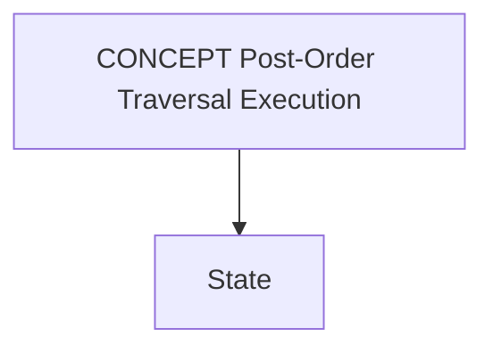
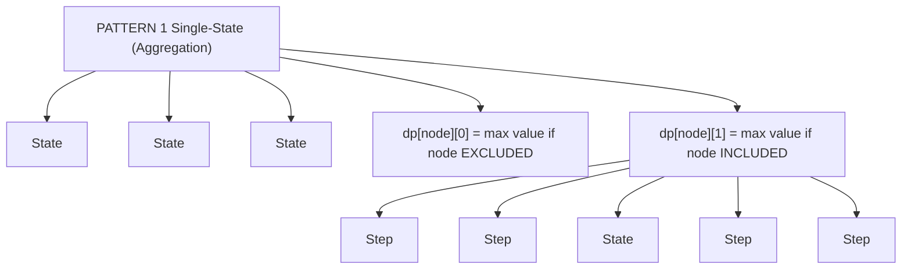
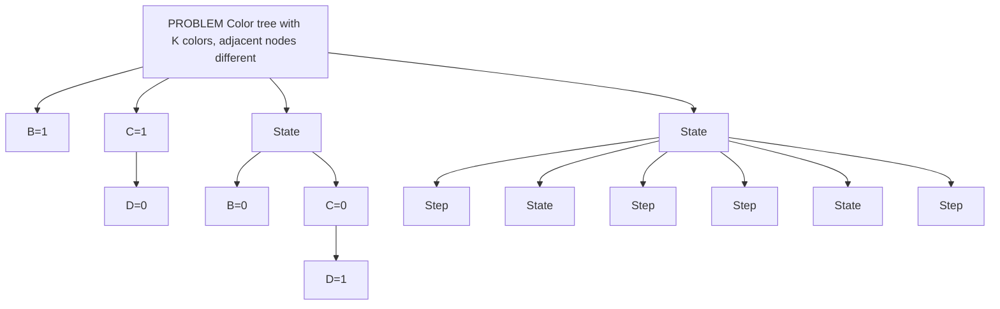
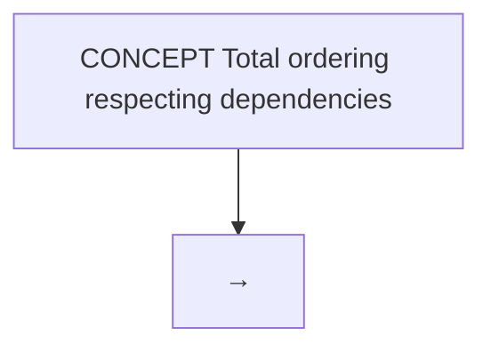

# 📊 WEEK 11: VISUAL CONCEPTS PLAYBOOK — HYBRID LEARNING GUIDE

> 🧭 **Navigation:** [🏠 Week Overview](README.md) • [📘 Curriculum Syllabus](../COMPLETE_SYLLABUS_v13.md)
> 
> 💡 **Instructor Note:** *This Visual Playbook provides a high-density, integrated synthesis. Not all sections are mandatory; use it as a modular reference to solidify invariants and review pattern transitions.*

---

**Document Type:** Visual Learning Reference & Concept Mapping
**Scope:** Week 11 (Days 01-05) — DP on Trees, DAGs, Bitmask, and Advanced Patterns
**Format:** Markdown with ASCII diagrams, flowcharts, and visual representations
**Target:** Visual learners, concept mapping, quick reference

---

## 📋 TABLE OF CONTENTS

1. **Visual Framework Overview**
2. **Day 01: Tree DP Visual Concepts**
3. **Day 02: DAG DP Visual Concepts**
4. **Day 03: Bitmask DP Visual Concepts**
5. **Day 04-05: Optimization & Advanced Patterns**
6. **Comparative Analysis Charts**
7. **Algorithm Decision Flowcharts**
8. **Visual Pattern Library**

---

## 🎯 VISUAL FRAMEWORK OVERVIEW

### The DP Paradigm Hierarchy


| / | \ |
| :--- | :--- |
| / | \ |
| +------|------+ | +----|----+ |
| 1D Array      2D Grid | Shortest   DAG DP |


### Key Characteristics Matrix


| Property | Linear DP | Tree DP | DAG DP | Bitmask |
| :--- | :--- | :--- | :--- | :--- |
| Time Complexity | O(n²-n³) | O(n) | O(V+E) | O(2^n·n²) |
| Space | O(n) | O(n) | O(n) | O(2^n) |
| Input Type | Array | Tree | Graph | Subset |
| Cycles? | No | No | No | N/A |
| State Space | Bounded | Bounded | Bounded | Finite |
| Typical n | 1000-500K | 100K | 1000 | 20 |


---

## 📊 DAY 01: TREE DP VISUAL CONCEPTS

### 1.1 Tree DP Execution Model





### 1.2 State Design Patterns





### 1.3 Maximum Independent Set Visual Trace


| [exc:0] | [inc:2] |
| :--- | :--- |
| [exc:0] | [inc:7] |
| [exc:9] | [inc:3] |
| [exc:0] | [inc:5] |
| [exc:14] | [inc:19] |


### 1.4 Tree Diameter Visual Algorithm


| D | depth=0 (leaf) |
| :--- | :--- |
| E | depth=0 (leaf) |
| B | depth = 1 + max(0,0) = 1 |
| C | depth=0 (leaf) |
| A | depth = 1 + max(1,0) = 2 |


### 1.5 Tree Coloring Visualization





### 1.6 Tree Rerooting Strategy


| Pass 1 |  | Pass 2 |
| :--- | :--- | :--- |
| Down DP | → | Up DP |
| From A |  | Reroot |


---

## 📈 DAY 02: DAG DP VISUAL CONCEPTS

### 2.1 DAG Structure vs Tree vs General Graph


| / | \ |
| :--- | :--- |
| \ | / |
| / |  |
| \ |  |
| Structure | Acyclic? |
| Tree | Yes |
| DAG | Yes |
| General | No |


### 2.2 Topological Ordering Visualization





### 2.3 Longest Path in DAG


| / | \ |
| :--- | :--- |
| 2 / 3 | 1 \ |
| / | \ |
| \  / | / |
| 4 2 | 3 / |
| \ | / |


### 2.4 DAG DP Problem Template

```
GENERIC DAG DP FRAMEWORK
========================

1. Build DAG from input
2. Check it's acyclic (optional validation)
3. Topological sort
4. Define DP state: what does dp[node] represent?
5. Determine transition: combine what?
6. Process in topo order

Example: Shortest path in DAG with negative weights
---------------------------------------------------

Can't use Dijkstra (negative edges)
Can use Bellman-Ford O(VE)
But DAG DP is faster: O(V + E)

Algorithm:
  For each node in topo order:
    For each outgoing edge (u, v) with weight w:
      dist[v] = min(dist[v], dist[u] + w)

Why it works:
  Topo order ensures dist[u] finalized before processing outgoing edges
  No need for iteration (unlike Bellman-Ford which needs V-1 passes)

Tree:
      S(dist=0)
     /  \2
   1/    \
   /      v
  A -3--→ B
   \      |
    \6    |5
     \    |
      \   v
       \→ C

Topo order: S → A → B → C

Process S:
  Update A: dist[A] = min(∞, 0+1) = 1
  Update B: dist[B] = min(∞, 0+2) = 2

Process A:
  Update B: dist[B] = min(2, 1+3) = 2
  Update C: dist[C] = min(∞, 1+6) = 7

Process B:
  Update C: dist[C] = min(7, 2+5) = 7

Process C:
  No outgoing edges

Result: dist[C] = 7 via S→A→B→C
```

---

## 📊 DAY 03: BITMASK DP VISUAL CONCEPTS

### 3.1 Bitmask Representation and Subset Enumeration

```
CONCEPT: Representing sets as integers
=======================================

Universe: {A, B, C} (3 elements)

Subset representation:
  ∅       → 000 → 0
  {A}     → 001 → 1
  {B}     → 010 → 2
  {A,B}   → 011 → 3
  {C}     → 100 → 4
  {A,C}   → 101 → 5
  {B,C}   → 110 → 6
  {A,B,C} → 111 → 7

Bit meaning:
  Bit i = 1 if element i in subset
  Bit i = 0 if element i not in subset

Operations:
----------

Check if element i in mask:
  if (mask & (1 << i)) ...

Add element i to mask:
  mask | (1 << i)

Remove element i from mask:
  mask & ~(1 << i)

Number of elements in mask:
  __builtin_popcount(mask)

All subsets of n elements:
  for (int mask = 0; mask < (1 << n); mask++)
    Process subset represented by mask

ENUMERATION VISUALIZATION:
--------------------------

n=3 elements {A,B,C}
2^3 = 8 subsets

Counter sequence: 0 → 1 → 2 → 3 → 4 → 5 → 6 → 7

000 (0)   001 (1)   010 (2)   011 (3)
 ∅        {A}       {B}       {A,B}

100 (4)   101 (5)   110 (6)   111 (7)
 {C}      {A,C}     {B,C}     {A,B,C}

Subset chain (by size):
  Size 0: {∅}
  Size 1: {A}, {B}, {C}
  Size 2: {A,B}, {A,C}, {B,C}
  Size 3: {A,B,C}

Time complexity to enumerate all:
  O(2^n) subsets × O(n) work per subset = O(n × 2^n)
```

### 3.2 TSP with Bitmask DP Visualization


| mask | 0 | 1 | 2 | 3 |
| :--- | :--- | :--- | :--- | :--- |
| 0001 | 0 | ∞ | ∞ | ∞ |
| 0011 | ∞ | 1 | ∞ | ∞ |
| 0101 | ∞ | ∞ | 4 | ∞ |
| 1001 | ∞ | ∞ | ∞ | 9 |
| 0111 | ∞ | ∞ | 3 | 4 |
| 1011 | ∞ | 4 | ∞ | 4 |
| 1101 | ∞ | 6 | 5 | ∞ |
| 1111 | ? | ? | ? | ? |


### 3.3 Subset Sum with Bitmask


| mask | Items | Sum | Value | Valid? |
| :--- | :--- | :--- | :--- | :--- |
| 000 | ∅ | 0 | 0 | No |
| 001 | {1} | 1 | 2 | No |
| 010 | {2} | 2 | 3 | No |
| 011 | {1,2} | 3 | 5 | No |
| 100 | {5} | 5 | 7 | No |
| 101 | {1,5} | 6 | 9 | YES ✓ |
| 110 | {2,5} | 7 | 10 | No |
| 111 | {1,2,5} | 8 | 12 | No |


### 3.4 Maximum Weight Independent Set (Small Graph)


| mask | Nodes | Weight | Valid? | Reason |
| :--- | :--- | :--- | :--- | :--- |
| 00000 | ∅ | 0 | ✓ | (empty is valid) |
| 00001 | {0} | 10 | ✓ | No edges |
| 00010 | {1} | 7 | ✓ | No edges |
| 00100 | {2} | 5 | ✓ | No edges |
| 01000 | {3} | 8 | ✓ | No edges |
| 10000 | {4} | 6 | ✓ | No edges |
| 00011 | {0,1} | 17 | ✗ | Edge 0-1 |
| 00101 | {0,2} | 15 | ✗ | Edge 0-2 |
| 01001 | {0,3} | 18 | ✗ | Edge 0-3? (check) No edge 0-3? Wait... |
|  |  |  | (0-1? Yes) Actually 1 not in mask |  |
|  |  |  | (0-2? Yes) But 2 not in mask. |  |
|  |  |  | (0-other?) No. |  |
|  |  | ✓ | Valid! weight=18 but... |  |
|  |  |  | Wait, let me recheck... |  |
| 01010 | {1,3} | 15 | ✗ | Edge 1-3 |
| 10001 | {0,4} | 16 | ✓ | No edge 0-4 |
| 10010 | {1,4} | 13 | ✓ | No edge 1-4 |
| 10100 | {2,4} | 11 | ✓ | No edge 2-4 |


---

## 📊 DAY 04-05: OPTIMIZATION & ADVANCED PATTERNS

### 4.1 State Compression Visualization

```
TECHNIQUE: Reduce dimensionality of DP state
=============================================

Example 1: 2D Grid DP → 1D
-------------------------

Problem: Minimum path sum from top-left to bottom-right

Full 2D DP:
  dp[i][j] = minimum cost to reach (i,j)

Grid:
    1  2  3
    4  5  6
    7  8  9

Standard 2D DP table:
    dp[0][0]=1  dp[0][1]=3  dp[0][2]=6
    dp[1][0]=5  dp[1][1]=10 dp[1][2]=16
    dp[2][0]=12 dp[2][1]=20 dp[2][2]=29

Space: O(m × n)

Observation: When computing row i, we only need:
  - Current row (being computed)
  - Previous row (dp[i-1][...])

We don't need rows 0 to i-2!

Space-optimized version:
  prev[] = previous row
  curr[] = current row

for i = 0 to m-1:
  for j = 0 to n-1:
    curr[j] = grid[i][j] + min(prev[j], curr[j-1])
  swap(prev, curr)

Space: O(n) instead of O(m × n)

Visual evolution:
Initial: prev = [0, ∞, ∞]

Row 0:
  curr[0] = 1 + min(0, ∞) = 1
  curr[1] = 2 + min(∞, 1) = 3
  curr[2] = 3 + min(∞, 3) = 6
  curr = [1, 3, 6]
  swap: prev = [1, 3, 6]

Row 1:
  curr[0] = 4 + min(1, ∞) = 5
  curr[1] = 5 + min(3, 5) = 8
  curr[2] = 6 + min(6, 8) = 12
  curr = [5, 8, 12]
  swap: prev = [5, 8, 12]

Row 2:
  curr[0] = 7 + min(5, ∞) = 12
  curr[1] = 8 + min(8, 12) = 16
  curr[2] = 9 + min(12, 16) = 21
  curr = [12, 16, 21]

Answer: 21 (same as full 2D, but used O(n) space)

Example 2: 3D DP → 2D
--------------------

Problem: DP[day][item][state] → reduce 3D

If "state" is independent across items, might compress.
If transitions only need current day, can use rolling array.

General principle:
  Only keep what you need for transitions
  Discard older states
```

### 4.2 Algorithm Decision Flowchart

```
DECISION TREE: Choosing the Right DP Variant
==============================================

    Start Problem
         |
    Is input a TREE?
    /            \
   YES            NO
   |              |
   v              v
TREE DP      Is input a DAG?
             /          \
           YES           NO
           |             |
           v             v
         DAG DP     Is input SEQUENCE/GRID?
                    /            \
                  YES            NO
                  |              |
                  v              v
            LINEAR DP        Is n ≤ 20?
         (1D, 2D, etc)      /        \
                           YES        NO
                           |          |
                           v          v
                      BITMASK DP  OTHER
                    (Subset DP)  (Heuristics,
                                  Approximation)

Once chosen:

TREE DP Path:
  1. Define state: dp[node][state_var]
  2. Post-order traversal (children before parent)
  3. Combine children's answers
  4. Time: O(n)

DAG DP Path:
  1. Topological sort
  2. Define state: dp[node]
  3. Process in topo order
  4. Time: O(V + E)

LINEAR DP Path:
  1. Define state: dp[i] or dp[i][j]
  2. Define transitions
  3. Bottom-up iteration
  4. Optimize space if needed
  5. Time: O(n) to O(n²)

BITMASK DP Path:
  1. Represent state as bitmask
  2. Iterate all 2^n subsets
  3. For each, check validity and compute answer
  4. Time: O(n × 2^n) to O(n² × 2^n)
```

### 4.3 Complexity and Feasibility Chart


| DP Type | Time Complex | Max n | Examples |
| :--- | :--- | :--- | :--- |
| Tree DP | O(n) | 100K+ | Max IS |
| DAG DP | O(V+E) | 1K-10K | Longest path |
| Linear DP | O(n²) to O(n) | 1K-100K | LIS, Edit |
| 2D Grid DP | O(m×n) | 100×100 to | Path sum |
|  |  | 1000×1000 |  |
| Bitmask DP | O(n×2^n) | 10-20 | TSP, subsets |
| Bitmask DP | O(n²×2^n) | 10-15 | TSP variant |
| 3D DP | O(n³) | 100-500 | Matrix mult |


---

## 📌 VISUAL PATTERN LIBRARY

### Problem Recognition Guide

```mermaid
flowchart TD
    R["Pattern recognition based on problem statement"]
    R --> N1["Hierarchical structure (org chart, filesystem)"]
    R --> N2["Parent-child relationships"]
    R --> N3["Binary tree structure"]
    R --> N4["Forest or subtree processing"]
    R --> N5["Directed edges (one-way relationships)"]
    R --> N6["Dependencies between tasks"]
    R --> N7["No cycles explicitly mentioned"]
    R --> N8["Process order matters"]
    R --> N9["Precedence constraints"]
    R --> N10["Array or sequence input"]
    R --> N11["String matching/manipulation"]
    R --> N12["Grid navigation"]
    R --> N13["2D matrix operations"]
    R --> N14["Bottom-up building"]
    R --> N15["Small n (≤20)"]
    R --> N16["2^n possibilities"]
    R --> N17["Subset enumeration"]
    R --> N18["All-pairs something"]
    R --> N19["Permutation-like problems"]
    R --> N20["Only current/previous layer needed"]
    R --> N21["Only last k values matter"]
    R --> N22["Current state independent of old states"]
    R --> N23["Rolling window pattern"]
```





### Transition Pattern Diagrams


| Take | Skip |
| :--- | :--- |
| 1 | 0 |


---

## 📚 SUMMARY & QUICK REFERENCE

### One-Page Cheat Sheet

```
WEEK 11 DP PATTERNS — QUICK REFERENCE
======================================

1. TREE DP
   Time: O(n)
   Pattern: Post-order traversal
   State: dp[node][state_var]
   Combine: Children's answers + Node's value
   
   Common: Max IS, Diameter, Coloring, Rerooting

2. DAG DP
   Time: O(V+E)
   Pattern: Topological sort
   State: dp[node]
   Combine: Neighbors in topo order
   
   Common: Longest path, Scheduling, Dependencies

3. LINEAR DP
   Time: O(n) to O(n²)
   Pattern: Iteration
   State: dp[i] or dp[i][j]
   Combine: Previous states
   
   Common: LIS, Edit distance, Coin change

4. BITMASK DP
   Time: O(n × 2^n) to O(n² × 2^n)
   Pattern: Enumerate all subsets
   State: dp[mask][...] or dp[mask]
   Combine: Add/remove elements
   
   Common: TSP, Subset problems, Assignments

5. OPTIMIZATION
   Technique: Space compression (rolling array)
   Reduce: O(n²) → O(n) space
   When: Only adjacent states needed
   
   Common: Grid DP, Sequential processing

STATE DEFINITION CHECKLIST:
  ✓ What does the state represent?
  ✓ What are the state variables?
  ✓ What's the range of each variable?
  ✓ What's the total number of states?
  
TRANSITION CHECKLIST:
  ✓ How do we move from one state to another?
  ✓ What are the dependencies?
  ✓ Are transitions valid/feasible?
  ✓ What's the order of computation?
  
BASE CASE CHECKLIST:
  ✓ What's the simplest case?
  ✓ What values for the base case?
  ✓ Is there only one or multiple?
  ✓ Are they correct?
  
COMPLEXITY CHECKLIST:
  ✓ How many states total?
  ✓ Work per state?
  ✓ Total time complexity?
  ✓ Space needed?
  ✓ Is it feasible for n?

DEBUGGING SIGNALS:
  ⚠ Wrong answer: Check transitions and base cases
  ⚠ TLE (timeout): Optimize complexity or prune
  ⚠ MLE (memory): Compress state space
  ⚠ Segfault: Check array bounds and base cases
  ⚠ Off-by-one: Verify indexing carefully
```

---

**End of Week 11 Visual Concepts Playbook**

*Complete visual learning guide for Days 01-05*
*Diagrams, flowcharts, and conceptual maps throughout*
*Quick reference and pattern library included*

---

> 🧭 **Navigation:** [🏠 Week Overview](README.md) • [📘 Curriculum Syllabus](../COMPLETE_SYLLABUS_v13.md)
