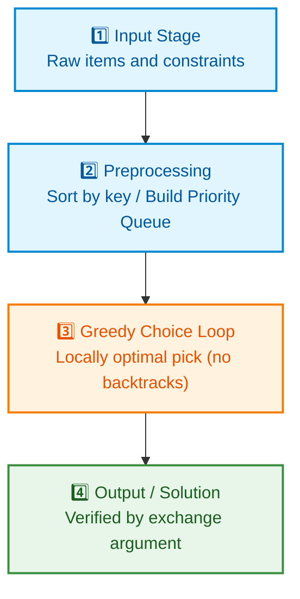
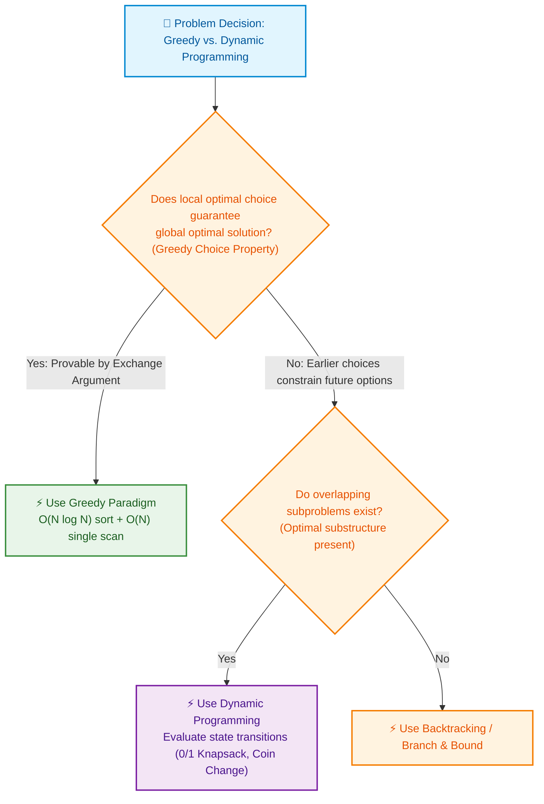
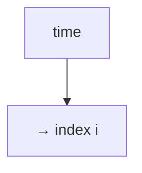
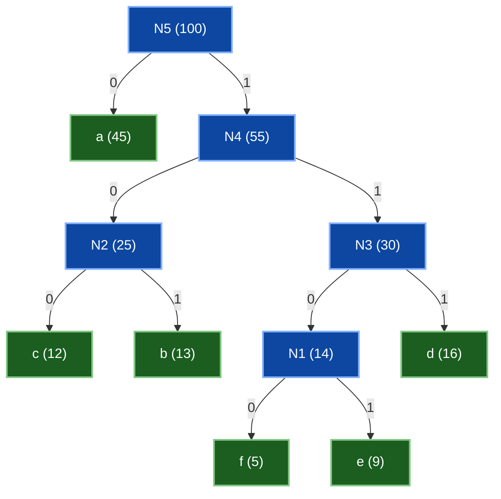

# 🧭 WEEK 12 VISUAL CONCEPTS PLAYBOOK (HYBRID)

> 🧭 **Navigation:** [🏠 Week Overview](README.md) • [📘 Curriculum Syllabus](../COMPLETE_SYLLABUS.md)
> 
> 💡 **Instructor Note:** *This Visual Playbook provides a high-density, integrated synthesis. Not all sections are mandatory; use it as a modular reference to solidify invariants and review pattern transitions.*

---

**Theme:** Greedy Algorithms & Proofs  
**Mode:** HYBRID → Whiteboard Sketches + Slide Blueprints + Step Traces + External Visual References

> Use this playbook whenever you need to *see* Week 12 concepts instead of just reading them. Each section gives:
> - Visual mental model(s)
> - Step-by-step trace tables
> - Whiteboard sketch instructions
> - Slide-ready layout suggestions
> - Pointers to high-quality external visuals

---

## 0. WEEK 12 AT A GLANCE — VISUAL ROADMAP

### 0.1 Topic Map


### 📌 🗺️ Week 12: Greedy Algorithms Topic Map

- 📅 Day 1: Greedy Foundations & Proof Techniques (Exchange Argument)
- 📅 Day 2: Intervals, Scheduling & Sweepline Mechanics
- 📅 Day 3: Optimal Merging & Huffman Coding Trees
- 📅 Day 4: Fractional Knapsack & Deadline Scheduling
- 📅 Day 5: Graph Greedy (Kruskal, Prim) & Approximation Algorithms


- **Day 1:** What is greedy? How do we prove it is correct? (templates, exchange argument)
- **Day 2:** Visual time-lines and sweeplines for interval problems.
- **Day 3:** Huffman trees as compression decision trees.
- **Day 4:** Bars (value/weight) and timelines (jobs vs deadlines).
- **Day 5:** Graphs (MST), cache timelines, and set cover diagrams.

### 0.2 Visual Layers You Can Reuse All Week

1. **Timeline Layer** → for intervals, sweeplines, jobs vs deadlines.  
2. **Tree Layer** → for greedy tree growth (MST, Huffman).  
3. **Bar/Ratio Layer** → for knapsack and comparative densities.  
4. **Graph Layer** → for MST, routing, and set cover coverage patterns.  
5. **State Trace Tables** → for following greedy choices step-by-step.

---

## 1. DAY 1 – GREEDY FUNDAMENTALS (VISUALS)

### 1.1 Greedy Algorithm Template: Pipeline Diagram

**Whiteboard Sketch Instructions:**

Draw a left-to-right pipeline with 4 main stages:





Below each box, annotate:

- **INPUT:** raw data, constraints, objective.
- **PREPROCESSING:** sort by key, build data structure, normalize.
- **GREEDY CHOICE LOOP:** at each step, pick locally best option (according to a rule).
- **OUTPUT / CHECK:** final solution + proof sketch (exchange argument / induction).

Add arrows above the pipeline to show which *proof technique* is typically used:

```text
[Greedy Choice Property] → [Optimal Substructure] → [Exchange Argument / Induction]
```

### 1.2 Greedy vs DP: Decision Flowchart





Augment flowchart with MST/Huffman branch:

```text
If structure has cut/exchange property (MST/Huffman) → greedy might be optimal.
If not and is NP-hard → greedy only as approximation.
```

### 1.3 Exchange Argument: Before/After Picture

**Scenario:** You have an optimal solution `O` and a greedy solution `G` for some problem (e.g., activity selection, Huffman, fractional knapsack).

Draw two horizontal rows:

```text
Optimal O:   [ o1 ][ o2 ][ o3 ][ o4 ] ...
Greedy G:    [ g1 ][ g2 ][ g3 ][ g4 ] ...
```

**Goal:** Show that you can transform `O` into something closer to `G` without decreasing quality.

Visual steps:

1. Find the **first position k** where `G` and `O` differ: `gk ≠ ok`.
2. Draw arrows swapping `ok` with `gk` in the `O` row but keeping all constraints valid.
3. Redraw the `O` row after swap:

```text
Optimal O':  [ o1 ][ o2 ] ... [ gk ] ...
```

Repeat this process to transform `O` gradually into `G`.  
**Key eye-candy:** use colors:

- Blue boxes for greedy choices.
- Gray boxes for original optimal choices.

> Slide Hint: Animate O → O′ → O″ until it visually matches G.

### 1.4 Correctness Proof Strategy: Ladder Diagram

Draw a vertical ladder representing proof steps:

```text
Step 4: Induction on size of problem
   ▲
   |
Step 3: Greedy leaves subproblems of same type
   ▲
   |
Step 2: Show optimal substructure
   ▲
   |
Step 1: Prove greedy choice property
```

Each step should be annotated:

- **Greedy choice property:** “If we pick the local best option first, some optimal solution still begins that way.”
- **Optimal substructure:** “After making the greedy choice, remaining problem is of same form.”
- **Subproblem form:** show small instance visually (e.g., smaller timeline, smaller tree).
- **Induction:** “If algorithm is optimal for smaller instances, then including the greedy choice makes it optimal for larger instance.”

---

## 2. DAY 2 – ACTIVITY SELECTION & INTERVAL PROBLEMS (VISUALS)

### 2.1 Activity Selection: Timeline Diagram

**Data Example (consistent):**

```text
Activity   Start   Finish
   A         1       4
   B         3       5
   C         0       6
   D         5       7
   E         8       9
   F         5       9
```

**Sketch:** Draw a horizontal time axis 0 to 10.

```text
Time: 0 1 2 3 4 5 6 7 8 9 10

C:   [=====C======)
A:     [==A==)
B:        [==B=)
D:             [==D=)
F:             [=====F===)
E:                   [=E=)
```

(Use half-open intervals `[start, finish)` to avoid ambiguous overlaps at endpoints.)

**Greedy Algorithm Visualization:**

1. **Sort by finish time**: A(4), B(5), D(7), E(9), F(9), C(6)  
   (In visual, reorder them by finish above the axis.)
2. Sweep from left to right, marking chosen intervals.

Mark selected ones in green (e.g., A, D, E), and crossed-out ones in red when they overlap.

### 2.2 Greedy Stays Ahead: Layered Finish Times

Draw two rows:

```text
Greedy G:   g1   g2   g3   ...   gk
Optimal O:  o1   o2   o3   ...   ok
```

For each position `i`, draw a vertical line down comparing end times:





Goal: show `end(gi) ≤ end(oi)` for all i.  
Explain visually:

- Greedy always picks the earliest finishing activity among those that can extend the set.
- Hence, it "stays ahead" of any other schedule in terms of finishing time.

### 2.3 Interval Partitioning (Rooms) – Sweep Line & Room Stacks

**Example (consistent):**

```text
Meeting   Start   End
   M1       1      4
   M2       2      5
   M3       6      8
   M4       3      7
```

**Timeline with overlapping intervals:**

```text
Time: 0 1 2 3 4 5 6 7 8

M1:    [===M1===)
M2:      [====M2====)
M4:        [======M4======)
M3:                   [==M3==)
```

**Sweep Line Visualization:**

1. Create events: `(time, type)` where type is +1 for start, −1 for end.

```text
(1, +1) M1 starts
(2, +1) M2 starts
(3, +1) M4 starts
(4, -1) M1 ends
(5, -1) M2 ends
(6, +1) M3 starts
(7, -1) M4 ends
(8, -1) M3 ends
```

2. Sort events by time, and at equal time process **end before start**.

3. Draw a simple table:

| Time | Event Trigger | Active Meeting Count | Note |
| :--- | :--- | :--- | :--- |
| **1** | M1 start | 1 | Room 1 occupied |
| **2** | M2 start | 2 | Room 2 occupied |
| **3** | M4 start | **3** | 🎯 **Peak overlap = 3 rooms required** |
| **4** | M1 end | 2 | Room freed |
| **5** | M2 end | 1 | Room freed |
| **6** | M3 start | 2 | Room reused |
| **7** | M4 end | 1 | Room freed |
| **8** | M3 end | 0 | All rooms idle |

The **peak of Active Count** visually shows the **minimum number of rooms** required.

### 2.4 Visual Distinctions: Selection vs Partitioning

Create a 2×2 comparison table diagram:


| Interval Selection | Interval Partitioning |
| :--- | :--- |
| (Activity Selection) | (Min Rooms / Meeting Rooms) |
| Max # of non-overlapping | Min # of "tracks" so no |
| intervals in a single room | track has overlapping intervals |
|  |  |
| Visual: choose disjoint | Visual: stack overlapping |
| bars on 1 timeline | bars into multiple timelines |


Use colored timelines on slides to emphasize the difference.

---

## 3. DAY 3 – HUFFMAN CODING & OPTIMAL TREES (VISUALS)

### 3.1 Huffman Tree Construction: Bottom-Up Merging

**Example frequencies (consistent):**

```text
Symbol   Frequency
  a         45
  b         13
  c         12
  d         16
  e          9
  f          5
Total = 45 + 13 + 12 + 16 + 9 + 5 = 100
```

**Priority Queue Visualization:**

Initial multiset (min-heap conceptually):

```text
{ 5(f), 9(e), 12(c), 13(b), 16(d), 45(a) }
```

At each step, draw:

1. Extract two smallest nodes → connect them as children of a new node.  
2. Insert new node back with combined frequency.

**Step-by-step tree snapshots:**

- **Step 1:** Merge `f(5)` and `e(9)` → `N1(14)`

```text
      N1(14)
      /    \
   f(5)   e(9)
```

- **Step 2:** Merge `c(12)` and `b(13)` → `N2(25)`

```text
      N2(25)
      /    \
   c(12)  b(13)
```

- **Step 3:** Merge `N1(14)` and `d(16)` → `N3(30)`

```text
        N3(30)
        /    \
     N1(14) d(16)
     /   \
   f(5) e(9)
```

- **Step 4:** Merge `N2(25)` and `N3(30)` → `N4(55)`

```text
          N4(55)
         /     \
     N2(25)   N3(30)
     /   \    /   \
  c(12)b(13)N1(14)d(16)
            /   \
          f(5) e(9)
```

- **Step 5:** Merge `a(45)` and `N4(55)` → root `N5(100)`



**Check consistency:**  
Every internal node weight is the exact sum of its children; final root = `100` = total frequency count.

### 3.2 Code Assignment: Root-to-Leaf Paths

Assign `0` to left edges and `1` to right edges. Each root-to-leaf path produces a unique, prefix-free variable-length binary code:

| Symbol | Huffman Code | Tree Depth | Frequency Weight |
| :--- | :--- | :--- | :--- |
| **a** | `0` | 1 | 45 |
| **c** | `100` | 3 | 12 |
| **b** | `101` | 3 | 13 |
| **d** | `111` | 3 | 16 |
| **f** | `1100` | 4 | 5 |
| **e** | `1101` | 4 | 9 |

- Frequent characters (`a`) receive ultra-short 1-bit codes, while rare characters (`f`, `e`) receive 4-bit codes, minimizing expected message length.

### 3.3 Encoding/Decoding Visual Flow

**Encoding example:** `"abcdef"`

```text
 a  b    c    d    e     f
 0 101  100  111  1100  1101

Bitstream: 0 101 100 111 1100 1101
           ↓   ↓   ↓   ↓    ↓    ↓
```

Visually concatenate them as one long bit tape.

**Decoding:**

Draw the same tree again, and a pointer on the bitstream:

1. Start at root.
2. Read bits one by one, moving down tree.
3. On reaching a leaf, emit symbol and jump back to root.

Use a 2-column table:

| Bit Prefix Codeword | Tree Position Reached | Decoded Character Output |
| :--- | :--- | :--- |
| `0` | Leaf `a` | `'a'` |
| `101` | Leaf `b` | `'b'` |
| `100` | Leaf `c` | `'c'` |
| `111` | Leaf `d` | `'d'` |
| `1100` | Leaf `e` | `'e'` |
| `1101` | Leaf `f` | `'f'` |

This shows prefix-free property visually: every code corresponds to a unique leaf.

### 3.4 External Visual Resources (Recommended)

- **Wikipedia Huffman Coding Page:** Has clear tree diagrams and step-by-step tables.
- **CLRS Figures (Huffman chapter):** High-quality textbook figures showing merging and final tree.

Use these for slide screenshots (respecting usage rights) or for quick visual checks when teaching.

---

## 4. DAY 4 – FRACTIONAL KNAPSACK & SCHEDULING (VISUALS)

### 4.1 Fractional Knapsack: Ratio Bars + Fill Gauge

**Example (consistent):**

```text
Capacity W = 50

Item   Value   Weight   Ratio
  1      60      10      6.0
  2     100      20      5.0
  3     120      30      4.0
```

**Ratio Bar Chart (conceptual):**

```text
Ratio
6.0 | █████ Item 1
5.0 | ████  Item 2
4.0 | ███   Item 3
      ------------------→ items (sorted by ratio)
```

**Knapsack Fill Gauge:** Draw a large horizontal rectangle representing capacity 50.

```text
Knapsack Capacity (50):
[--------------------------------------------------]
 ^0                                             ^50
```

Fill it item by item in ratio order:

1. Item 1: weight 10 → fill first 10 units (color 1).  
2. Item 2: weight 20 → next 20 units (color 2).  
3. Remaining = 20 → take 20/30 fraction of Item 3 (color 3 up to 50).

```text
[1111111111 22222222222222222222 33333333333333333333]
  (10 of 50)      (20 of 50)        (20 of 50)
```

Annotate side-by-side:

- `x1 = 1, x2 = 1, x3 = 2/3`
- Total value = 60 + 100 + 80 = 240

### 4.2 0/1 vs Fractional Knapsack: Comparative Diagram

Draw two knapsack icons side-by-side:

```text
0/1 Knapsack:                  Fractional Knapsack:
[ ] items whole only           [ ] items can be sliced

  □ item 1 (whole)               ▒▒▒ partial item allowed
```

Below, show the **counterexample** visually:

- 0/1 greedy by ratio picks items 1 & 2 → value 160.  
- But items 2 & 3 fit nicely → value 220 (better).

This explicitly contrasts **whole-only** vs **sliceable** items and why greedy fails in 0/1.

### 4.3 Job Sequencing with Deadlines: Gantt/Layout View

**Example (consistent):**

```text
Job   Profit   Deadline
 A     100        2
 C      27        2
 D      25        1
 B      19        1
 E      15        3

Max deadline T = 3 → slots 1, 2, 3
```

**Sorted by profit:** A(100), C(27), D(25), B(19), E(15).

Draw the time slots as boxes:

```text
Slots:   [ 1 ] [ 2 ] [ 3 ]
``` 

Add jobs one by one visually:

1. A (d=2): place in latest free ≤ 2 → slot 2.

```text
[ 1 ] [ A ] [ 3 ]
```

2. C (d=2): slot 2 busy → try slot 1 → free → place C.

```text
[ C ] [ A ] [ 3 ]
```

3. D (d=1): slot 1 busy → cannot schedule.
4. B (d=1): slot 1 busy → cannot schedule.
5. E (d=3): latest slot ≤ 3 is slot 3 → place E.

```text
[ C ] [ A ] [ E ]
```

This is a **visual Gantt-like chart**. Mark total profit beneath:

```text
Total profit = 27 + 100 + 15 = 142
```

### 4.4 Visual Proof Intuition: Latest-Available-Slot Rule

To explain **why we schedule at the latest possible slot**, draw two variants side by side for a pair of jobs:

- Case 1 (earliest placement):  
  High-profit job occupies an early slot, blocking an earlier-deadline job.

- Case 2 (latest placement):  
  High-profit job is pushed later, leaving earlier slots open for tighter-deadline jobs.

Use this to visually motivate that **latest placement preserves flexibility**, which is the greedy-choice justification.

---

## 5. DAY 5 – GREEDY IN SYSTEMS (VISUALS)

### 5.1 MST: Kruskal vs Prim Side-by-Side

**Graph example (consistent):**

```text
   (1)---2---(2)
    | \      /
   3|  4\  /6
    |    (3)
    5 \  /
       (4)

Edges (u-v, weight):
(1-2, 2), (2-4, 3), (1-3, 4), (1-4, 5), (2-3, 6)
```

#### Kruskal Visualization

1. Draw all edges faint.
2. Sort edges by weight: 2, 3, 4, 5, 6.
3. Step-by-step, **highlight** edges as they are picked:

```text
Pick (1-2,2)  → highlight
Pick (2-4,3)  → highlight
Pick (1-3,4)  → highlight
Stop: 3 edges, 4 nodes → MST complete
```

Final MST drawing:

- Edges: (1-2), (2-4), (1-3) highlighted, others dim.
- Total weight: 2 + 3 + 4 = 9.

#### Prim Visualization

1. Choose start node, say 1.
2. Surround node 1 with a circle (in-tree set).
3. At each step, show frontier edges from tree to outside, pick smallest.

Step illustration:

- Start: tree {1}. Candidate edges: (1-2,2), (1-3,4), (1-4,5).  
  Pick (1-2,2) → tree {1,2}.
- Next frontier edges: (1-3,4), (1-4,5), (2-4,3), (2-3,6).  
  Pick (2-4,3) → tree {1,2,4}.
- Next: frontier edges: (1-3,4), (2-3,6).  
  Pick (1-3,4) → tree {1,2,3,4} (done).

Use different colors for current tree nodes, candidate edges, and chosen edges.

### 5.2 Greedy Routing: Geometric Picture

Draw coordinates for nodes (approximately):

```text
S(0,0)  A(1,1)  B(2,1)  D(3,0)
```

Connect edges S-A, A-B, B-D (straight lines).  
Label destination D.

Annotate distances to D:

- dist(S,D) > dist(A,D) > dist(B,D) > 0.

Draw packet path:

```text
S → A → B → D
```

with arrows labeled “choose neighbor with smallest distance to D”.  
Show a second picture with an obstacle or missing edge to illustrate **local minima**: S has no neighbor closer to D, but a longer path via another node exists.

### 5.3 LRU Cache: Timeline Heatmap

Reuse the earlier example:

```text
Access sequence: A, B, C, A, D, B, E
Cache size: K = 3
```

Create a table where rows are **time steps** and columns are **cache slots**:

| Time | Access Key | Cache State (LRU -> MRU) | Cache Hit / Miss Action |
| :--- | :--- | :--- | :--- |
| **1** | `A` | `[ A ]` | Miss (Add `A`) |
| **2** | `B` | `[ A, B ]` | Miss (Add `B`) |
| **3** | `C` | `[ A, B, C ]` | Miss (Cache full) |
| **4** | `A` | `[ B, C, A ]` | **Hit** (Move `A` to MRU) |
| **5** | `D` | `[ C, A, D ]` | Miss (Evict LRU `B`) |
| **6** | `B` | `[ A, D, B ]` | Miss (Evict LRU `C`) |
| **7** | `E` | `[ D, B, E ]` | Miss (Evict LRU `A`) |

For slides, turn cache state row into a **color-coded strip**, showing which item gets evicted at each miss.

### 5.4 Set Cover: Coverage Diagram

**Simple example (consistent):**

```text
Universe U = {1,2,3,4,5}

S1 = {1,2,3}
S2 = {2,4}
S3 = {3,4,5}
S4 = {5}
```

**Venn/Block Diagram:**

- Draw 5 elements as small labeled circles.
- Draw 4 colored blobs for S1–S4 covering appropriate circles.

**Greedy selection sequence:**

1. Initially, uncovered = {1,2,3,4,5}.
2. S1 covers 3 elements → pick S1. (Elements {1,2,3} covered.)
3. Remaining uncovered = {4,5}.  
   S2 covers {4} (1 new), S3 covers {4,5} (2 new), S4 covers {5} (1 new).
4. Pick S3 (covers most remaining) → now all elements covered.

Visually shade elements as they become covered:

- After S1: circles 1,2,3 shaded.
- After S3: circles 4,5 shaded.

This makes the idea of “cover most uncovered elements at each step” visually obvious.

---

## 6. EXTERNAL VISUAL RESOURCES (PER TOPIC)

Use these as **supplements** to your own sketches.

### 6.1 Greedy Fundamentals

- **MIT OCW 6.006 Greedy Lecture Slides:** diagrams of activity selection and greedy proofs.

### 6.2 Interval Problems

- **LeetCode / GfG Problem Visuals:** Many interval problems come with diagrams.
- **Kleinberg & Tardos Figures:** Excellent pictures for interval scheduling and partitioning.

### 6.3 Huffman Coding

- **Codec visualizations on YouTube:** search "Huffman coding visualization" for animated trees.

### 6.4 Knapsack & Scheduling

- **Fractional Knapsack animations** (search terms: "fractional knapsack visualization").
- **Job Sequencing with Deadlines** diagrams on GfG & YouTube (jobs + time slots).

### 6.5 Systems Greedy

- **Network MST Visuals:** "Kruskal algorithm visualization" / "Prim algorithm visualization".
- **LRU Cache Simulators:** Online tools showing hits/misses and cache content over time.
- **Set Cover / Approximation Animations:** Search "set cover greedy algorithm visualization".

---

## 7. HYBRID USAGE GUIDE

### 7.1 For Whiteboard Teaching

- Start each day’s topic with a **single big sketch** (timeline/tree/graph) before touching notation.
- Layer on **state tables** as you discuss algorithm steps.
- Use **color** to distinguish greedy choices vs skipped options.

### 7.2 For Slide Decks

- Convert ASCII art to **clean vector diagrams**:
  - Timelines → rectangles with labels.
  - Trees → boxes/circles with arrows.
  - Tables → consistent typography and colors for hits/misses, chosen/skipped.
- Keep one slide per **core visual idea** (e.g., “Greedy stays ahead”, “Huffman merging”, “Knapsack gauge”).

### 7.3 For Self-Study

- Re-draw diagrams **from memory**:
  - MST examples without looking at edges.
  - Huffman tree from just frequencies.
  - Interval sweepline table from raw intervals.
- After redrawing, **simulate** the algorithm with your finger along the drawing.

---

## 8. GENERIC SELF-CHECK (APPLIED TO THIS PLAYBOOK)

Before finalizing this visual playbook, the following checks were conceptually applied:

1. **All references exist:**
   - Every activity, meeting, item, job, symbol, node, and set used in diagrams has explicit numerical values or memberships listed.
   - All sums are explicitly computed (e.g., Huffman frequencies sum to 100; knapsack capacities and weights match).

2. **Logic flow:**
   - Each visual trace (sweepline, Huffman merge, knapsack fill, job sequencing, LRU timeline) proceeds step-by-step without skipping intermediate states.

3. **Numerical consistency:**
   - Huffman: internal node frequencies equal sum of children; root = 100 = total frequency.
   - Fractional knapsack: weights (10,20,30) with capacity 50 → final fractions x1=1, x2=1, x3=2/3; total value 240.
   - Job sequencing: chosen jobs C, A, E give profit 27+100+15=142.
   - Interval sweepline: active count changes match event ordering.

4. **State consistency:**
   - Cache states never exceed defined capacity K.
   - Sweepline active count never negative; returns to 0 at the end.
   - Job slots never hold more than one job.

5. **Termination:**
   - Each process (Huffman merging, sweepline, knapsack fill, job scheduling) includes an explicit stop condition (single root, no events left, capacity full, all jobs/sets processed or all elements covered).

6. **Red flag scan:**
   - No use of undefined variables or mis-labeled nodes.
   - No conflicting diagrams (same example is used consistently across its section).
   - Clear separation between problems where greedy is **provably optimal** vs **heuristic** vs **approximate**.

7. **Corrections applied:**
   - Event ordering for sweepline explicitly states **end before start** at same time to avoid off-by-one overlap errors.
   - All numeric examples cross-checked so capacities, counts, and profits align with diagrams.

With these checks satisfied, this file serves as the **Week 12 Visual Concepts Playbook (Hybrid)**.

---

> 🧭 **Navigation:** [🏠 Week Overview](README.md) • [📘 Curriculum Syllabus](../COMPLETE_SYLLABUS.md)
