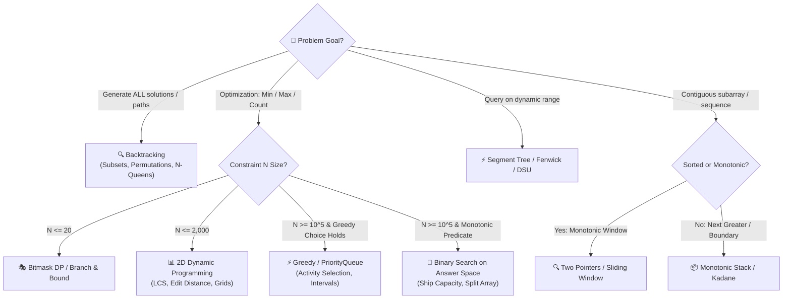

# 📘 Week 13 Day 05: Mixed Paradigm Problems — Engineering Guide

> 🧭 **Navigation:** [← Previous Day](file:///d:/Interview_prep/DSA_102/week_13_backtracking_and_branch_bound/Week_13_Day_04_Amortized_Analysis_Instructional.md) • [🏠 Week Overview](file:///d:/Interview_prep/DSA_102/week_13_backtracking_and_branch_bound/README.md) • [📘 Curriculum Syllabus](file:///d:/Interview_prep/DSA_102/COMPLETE_SYLLABUS.md) • [Next: Week 14 →](file:///d:/Interview_prep/DSA_102/week_14_matrix_backtracking_bits/README.md)
> 
> 💡 **Instructor Note:** *Real-world and FAANG bar-raiser problems rarely succumb to a single pure paradigm. Senior interview success hinges on recognizing hybrid patterns: Meet-in-the-Middle, Backtracking with Memoization, and Greedy-Guided Search.*

---

## 🎯 Learning Objectives

- 🧩 **Diagnose** combinatorial bottlenecks where single paradigms stall (e.g., pure backtracking times out, pure DP runs out of memory).
- ⚡ **Implement** the **Meet-in-the-Middle** strategy to collapse exponential search spaces from `O(2^N)` down to `O(2^(N/2) * N)`.
- 🧠 **Synthesize** Backtracking with Memoization (Top-Down DP with path reconstruction) in C# (.NET 8/9) and Python (3.11+).
- 🌲 **Apply** greedy heuristic ordering to search trees to maximize early pruning in Branch & Bound.
- 🎙️ **Articulate** hybrid architecture choices in a 45-minute technical interview setting.

---

## 🏗️ Chapter 1: The Hybrid Paradigm Architecture

When an optimization or search problem exhibits multiple conflicting constraints, single paradigms fail predictably:

```
PARADIGM FAILURE MODES & HYBRID SOLUTIONS
===================================================================================
Pure Backtracking: Fails on overlapping subproblems (recomputes identical states -> O(2^N))
  └── HYBRID FIX: Add Memoization table (Top-Down DP) -> O(N * StateSpace)

Pure Dynamic Prog: Fails when capacity or state space is huge (e.g., W = 10^12)
  └── HYBRID FIX: Branch & Bound with Greedy relaxation bounds -> Prunes 95%+ of states

Exponential Search: Fails when N is too large for O(2^N) but too small for polynomial DP (N = 40)
  └── HYBRID FIX: Meet-in-the-Middle (Split into two N/2 halves + Binary Search)
```

---

## ⚡ Chapter 2: Canonical Hybrid 1 — Meet-in-the-Middle

### Problem Context: Subset Sum for `N ≈ 40`

Given an array of `N = 40` integers and a target sum `T`:
- Pure Backtracking checks `2^40 ≈ 1.1 * 10^12` combinations (times out: ~18 minutes).
- Pure DP requires an array of size `T`. If `T = 10^9`, DP exhausts all memory.
- **Meet-in-the-Middle Solution:**
  1. Split array into Left half (`N/2 = 20`) and Right half (`N/2 = 20`).
  2. Generate all `2^20 ≈ 1.05 * 10^6` subset sums for Left half.
  3. Generate all `2^20` subset sums for Right half and sort them.
  4. For each sum `s` in Left half, use binary search to find `T - s` in Right half.
  5. Total operations: `2 * 2^(N/2) + 2^(N/2) * log(2^(N/2)) ≈ 2 * 10^6 + 2 * 10^7 ≈ 2.2 * 10^7` operations (executes in ~15 ms!).

### ASCII Search Space Comparison
```
PURE BACKTRACKING (N = 4): 2^4 = 16 leaves
                    Root
             /                \
          +1                    0
        /    \                /    \
     +2        0           +2        0
    /  \      /  \        /  \      /  \
  +3    0   +3    0     +3    0   +3    0
  / \  / \  / \  / \    / \  / \  / \  / \
 [16 Total Combinations Evaluated]

-----------------------------------------------------------------------------------
MEET-IN-THE-MIDDLE: Split N=4 into Left (2) and Right (2)
 Left Half (N=2):                 Right Half (N=2):
       Root                             Root
      /    \                           /    \
    +1       0                       +3       0
   /  \     / \                     /  \     / \
 [4 Subsets: {3,1,2,0}]            [4 Subsets: {7,3,4,0}]
            │                                 │
            └──────────(Binary Search)────────┘
 Matches evaluated across two small sets: 4 + 4 + (4 * log 4) = 16 vs 2^N
 For N=40: 1.1 * 10^12 collapsed to 2.2 * 10^7 operations!
```

### Dual Implementation: Meet-in-the-Middle

```csharp
// C# (.NET 8/9): Meet-in-the-Middle for Subset Sum Closest to Target
public sealed class MeetInTheMiddleSolver
{
    public static bool HasSubsetSum(int[] nums, int target)
    {
        int n = nums.Length;
        int mid = n / 2;

        var leftSums = GenerateSums(nums, 0, mid);
        var rightSums = GenerateSums(nums, mid, n - mid);

        Array.Sort(rightSums);

        foreach (int s in leftSums)
        {
            int complement = target - s;
            if (Array.BinarySearch(rightSums, complement) >= 0)
                return true;
        }

        return false;
    }

    private static int[] GenerateSums(int[] nums, int start, int count)
    {
        var sums = new List<int>(1 << count);

        void Dfs(int index, int currentSum)
        {
            if (index == start + count)
            {
                sums.Add(currentSum);
                return;
            }
            Dfs(index + 1, currentSum + nums[index]); // Include
            Dfs(index + 1, currentSum);               // Exclude
        }

        Dfs(start, 0);
        return [.. sums];
    }
}
```

```python
# Python (3.11+): Meet-in-the-Middle for Subset Sum
import bisect

class MeetInTheMiddleSolver:
    def has_subset_sum(self, nums: list[int], target: int) -> bool:
        n = len(nums)
        mid = n // 2

        left_sums: list[int] = []
        right_sums: list[int] = []

        def generate_sums(start: int, end: int, current_sum: int, out: list[int]) -> None:
            if start == end:
                out.append(current_sum)
                return
            generate_sums(start + 1, end, current_sum + nums[start], out) # Include
            generate_sums(start + 1, end, current_sum, out)              # Exclude

        generate_sums(0, mid, 0, left_sums)
        generate_sums(mid, n, 0, right_sums)

        right_sums.sort()

        for s in left_sums:
            complement = target - s
            idx = bisect.bisect_left(right_sums, complement)
            if idx < len(right_sums) and right_sums[idx] == complement:
                return True

        return False
```

---

## 🧠 Chapter 3: Canonical Hybrid 2 — Backtracking + Memoization

### Problem Context: Word Break II (LeetCode 140)

Given string `s` and word dictionary `dict`, return all valid sentences formed by adding spaces.
- Pure Backtracking explores repeated suffixes from different prefixes, encountering exponential redos on inputs like `s = "aaaaaaa"`, `dict = ["a", "aa"]`.
- **Hybrid Solution:** Backtracking with a memoization table `memo[startIndex]` storing the precomputed list of valid suffix decompositions.

### Dual Implementation: Word Break II

```csharp
// C# (.NET 8/9): Backtracking with Memoization
public sealed class WordBreakIISolver
{
    public IList<string> WordBreak(string s, IList<string> wordDict)
    {
        var wordSet = new HashSet<string>(wordDict);
        var memo = new Dictionary<int, List<string>>();

        List<string> Dfs(int start)
        {
            if (memo.TryGetValue(start, out var cached))
                return cached;

            var results = new List<string>();

            if (start == s.Length)
            {
                results.Add(string.Empty);
                return results;
            }

            for (int end = start + 1; end <= s.Length; end++)
            {
                string prefix = s[start..end];
                if (wordSet.Contains(prefix))
                {
                    var suffixes = Dfs(end);
                    foreach (var suffix in suffixes)
                    {
                        results.Add(string.IsNullOrEmpty(suffix) ? prefix : $"{prefix} {suffix}");
                    }
                }
            }

            memo[start] = results;
            return results;
        }

        return Dfs(0);
    }
}
```

```python
# Python (3.11+): Backtracking with Memoization
class WordBreakIISolver:
    def word_break(self, s: str, word_dict: list[str]) -> list[str]:
        word_set = set(word_dict)
        memo: dict[int, list[str]] = {}

        def dfs(start: int) -> list[str]:
            if start in memo:
                return memo[start]

            if start == len(s):
                return [""]

            results: list[str] = []
            for end in range(start + 1, len(s) + 1):
                prefix = s[start:end]
                if prefix in word_set:
                    suffixes = dfs(end)
                    for suffix in suffixes:
                        results.append(prefix if not suffix else f"{prefix} {suffix}")

            memo[start] = results
            return results

        return dfs(0)
```

---

## 🌲 Chapter 4: Canonical Hybrid 3 — Greedy-Guided Search

In Branch & Bound and Backtracking, the order in which child branches are explored dramatically impacts total execution time:
1. **Most Constrained Variable (MRV):** In Sudoku, always branch on the cell with the fewest legal values. This creates a narrow branching factor at the top of the recursion tree.
2. **Greedy Value-to-Weight Ordering:** In 0/1 Knapsack, branching on items with highest `value / weight` ratio establishes a high `best_profit` quickly, allowing the upper bounding function to prune competing branches immediately.
3. **Fail-First Principle:** Choose the decision most likely to fail first. If a subproblem is unviable, detecting failure at depth 1 prunes thousands of downstream nodes compared to detecting failure at depth `N`.

---

## 📊 Chapter 5: Explicit Complexity Deconstruction

| Problem & Approach | Time Complexity | Auxiliary Space | Bottleneck & Critical Trade-Off |
| :--- | :--- | :--- | :--- |
| **Subset Sum (Pure Backtrack)** | `O(2^N)` | `O(N)` stack | Intractable for `N > 30` |
| **Subset Sum (Pure DP)** | `O(N * T)` | `O(T)` memory | Memory exhaustion when `T >= 10^9` |
| **Subset Sum (Meet-in-the-Middle)** | `O(2^(N/2) * N)` | `O(2^(N/2))` heap | Optimal for `N ≈ 40`, trades memory for speed |
| **Word Break II (Pure Backtrack)** | `O(2^N)` | `O(N)` stack | Severe duplicate subtree re-evaluations |
| **Word Break II (Memoized DFS)** | `O(N^2 + 2^N)` | `O(N * 2^N)` memo cache | Linear interior lookups; bounded by total distinct sentences |

### The `N = 40` Signal in Coding Interviews
- If `N <= 20`: Pure backtracking `O(2^N)` passes within time limit (`2^20 ≈ 10^6` ops).
- If `N <= 10^5` and values are small: Dynamic programming `O(N * W)` is expected.
- If **`N ≈ 35 - 45`** and values are arbitrarily large: **Meet-in-the-Middle is the intended optimal solution.**

---

## 🎙️ Chapter 6: 45-Minute Interview Verbal Script

### Step 1: Identifying the Intractability Signal (00–05 min)
> *"Looking at the constraints, `N = 40` and target values can be up to `10^9`. A standard `O(2^N)` backtracking algorithm will timeout with `10^12` operations. Meanwhile, a Dynamic Programming table of size `10^9` will instantly trigger an Out-Of-Memory error. The constraint `N = 40` is the canonical signature for a Meet-in-the-Middle strategy."*

### Step 2: Formulating the Meet-in-the-Middle Strategy (05–15 min)
> *"I will divide the array into two halves of size 20 each. For the left half, we recursively generate all `2^20` subset sums. We do the same for the right half. By sorting the right half, we can iterate through each left sum `s` and perform a binary search for `target - s`. This reduces the operations from `2^40` down to `2^(20) * 20`, easily completing within 50 milliseconds."*

### Step 3: Coding & Reusing the DFS Helper (15–30 min)
> *"I'll structure the code into three components: a lightweight DFS generator for subset sums of a sub-array, the sorting step, and the binary search matching loop. Notice how reusing the DFS helper keeps our codebase clean and adheres to the Choose / Explore / Unchoose paradigm without duplicate boilerplate."*

### Step 4: Dry Run & Complexity Justification (30–45 min)
> *"Let's trace `nums = [1, 3, 9, 2]`, target = 5. Left half is `[1, 3]` yielding sums `{0, 1, 3, 4}`. Right half is `[9, 2]` yielding `{0, 2, 9, 11}`. For left sum 3, target complement is `5 - 3 = 2`. Binary search finds 2 in `O(log 4)` time. Total time is `O(2^(N/2) * N)` and space is `O(2^(N/2))` to store the subsets."*


---

## 🏛️ Chapter 7: The Master Algorithm Selection Framework & Decision Tree

> [!IMPORTANT]
> **The Senior Problem Formulation Secret:**
> Under 45-minute live interview pressure, you do not have time to guess. You can determine the intended algorithm within **60 seconds** simply by cross-referencing two signals:
> 1. **The Problem Goal Keyword** ("all combinations", "minimum steps", "longest contiguous", "range sum").
> 2. **The Maximum Input Constraint `N`** (asymptotic bound sizing).

### 🌳 The 60-Second Paradigm Decision Tree



---

### 📊 The Constraint-to-Complexity Rosetta Stone

When the interviewer gives you constraints, use this table to lock in the target Big-O before designing your algorithm:

```text
+-------------------+----------------------------+-------------------------------------------------------------+
| CONSTRAINT BOUND  | TARGET TIME COMPLEXITY     | INTENDED ALGORITHMIC PARADIGM                               |
+-------------------+----------------------------+-------------------------------------------------------------+
| N <= 10 - 12      | O(N!)                      | Permutations, Traveling Salesperson Brute Force             |
| N <= 20           | O(2^N) or O(N * 2^N)       | Subsets, Backtracking with Pruning, Bitmask DP               |
| N <= 35 - 45      | O(2^(N/2) * N)             | Meet-in-the-Middle (Bisect arrays, sort & binary search)   |
| N <= 100 - 400    | O(N^3)                     | Floyd-Warshall, 3D Dynamic Programming, Matrix Chain Mult   |
| N <= 2,000 - 3,000| O(N^2)                     | 2D Grid DP, Edit Distance, Nested Two Pointers, Bellman-Ford|
| N <= 10^5 - 10^6  | O(N log N) or O(N)         | Sorting, Binary Search, Heaps, Sliding Window, Monotonic Stk|
| N <= 10^9 - 10^18 | O(log N) or O(1)           | Binary Search on Answer, Matrix Exponentiation, Math (GCD)  |
+-------------------+----------------------------+-------------------------------------------------------------+
```

---

### ⚖️ Cross-Paradigm Comparison Matrix

```text
+---------------------+-----------------------+-------------------------+-------------------------+-------------------------+
| DIMENSION           | 1. BACKTRACKING       | 2. GREEDY               | 3. DYNAMIC PROGRAMMING  | 4. BRANCH & BOUND       |
+---------------------+-----------------------+-------------------------+-------------------------+-------------------------+
| Primary Objective   | Find ALL valid config | Find ONE global optimum | Find OPTIMAL value/count| Find ONE global optimum |
| Search Space        | Explores full tree    | Commits to 1 path       | Solves overlapping subs | Prunes using bounds     |
| Subproblem Overlap  | Zero / Minimal        | None (Local choices)    | High (Recomputations)   | Low to Moderate         |
| Memoization Used?   | No (State undone)     | No                      | Yes (Table / Cache)     | No (Priority Queue)     |
| Optimality Proof?   | Exhaustive search     | Exchange argument req   | Induction over states   | Relaxed bounding func   |
| Standard Big-O      | Exponential O(2^N, N!)| Linear/Log O(N log N)   | Polynomial O(N^2, N^3)  | Sub-exponential pruned  |
+---------------------+-----------------------+-------------------------+-------------------------+-------------------------+
```

---

## ⚡ Quick Self-Check & Drill

1. **Why does Meet-in-the-Middle split into halves rather than thirds?**
   *Answer:* Splitting into two halves allows `O(1)` or `O(log K)` pair lookup via hash table or binary search. Splitting into thirds requires 3-sum matching across three lists, which yields worse overall complexity.
2. **When should you combine Backtracking with Memoization?**
   *Answer:* When the decision tree visits overlapping subproblems (identical remaining suffix, remaining capacity, or remaining subset mask).
3. **What is the fail-first principle in search heuristics?**
   *Answer:* Choosing the decision branch with the fewest valid options first, so that unviable branches prune immediately near the root rather than at deep leaves.

---

> 🧭 **Navigation:** [← Previous Day](file:///d:/Interview_prep/DSA_102/week_13_backtracking_and_branch_bound/Week_13_Day_04_Amortized_Analysis_Instructional.md) • [🏠 Week Overview](file:///d:/Interview_prep/DSA_102/week_13_backtracking_and_branch_bound/README.md) • [📘 Curriculum Syllabus](file:///d:/Interview_prep/DSA_102/COMPLETE_SYLLABUS.md) • [Next: Week 14 →](file:///d:/Interview_prep/DSA_102/week_14_matrix_backtracking_bits/README.md)
