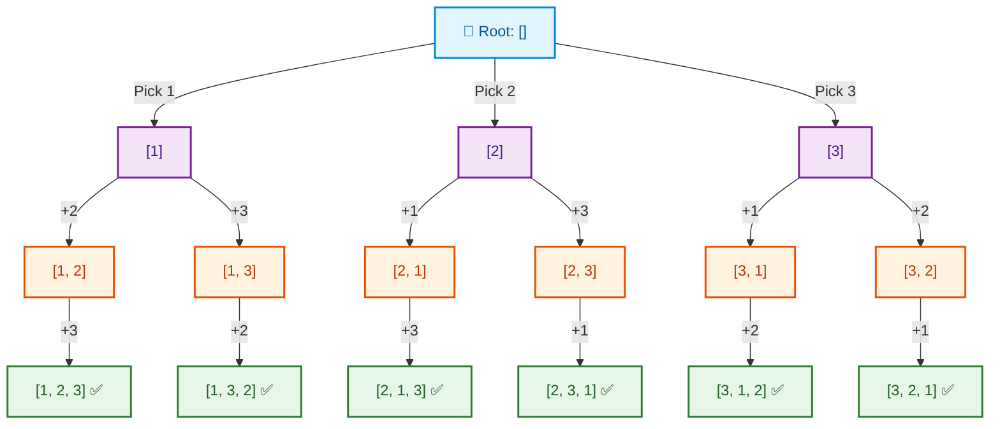
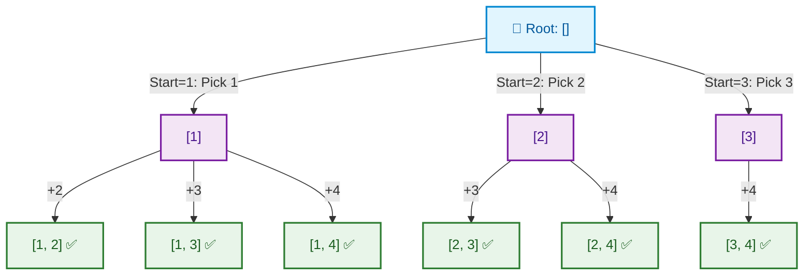
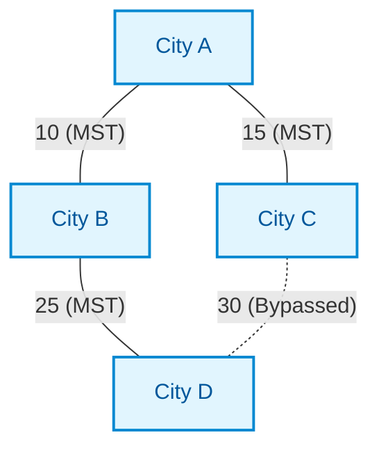
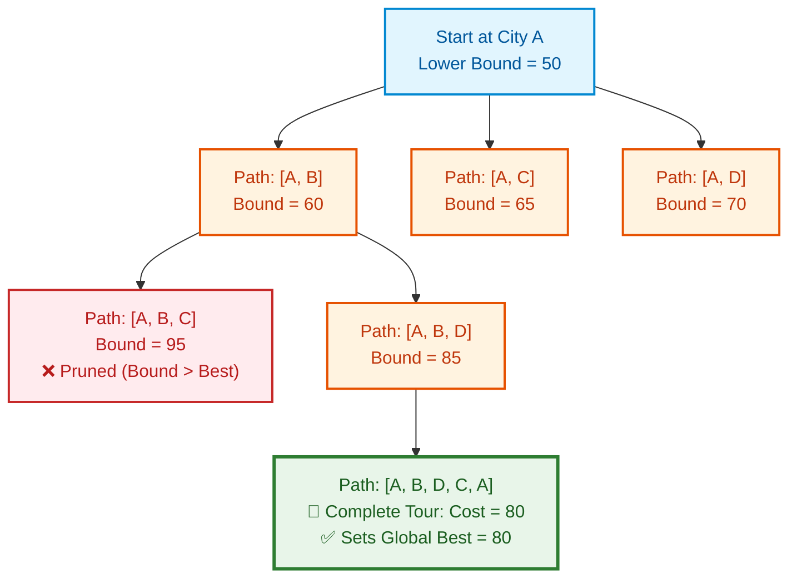
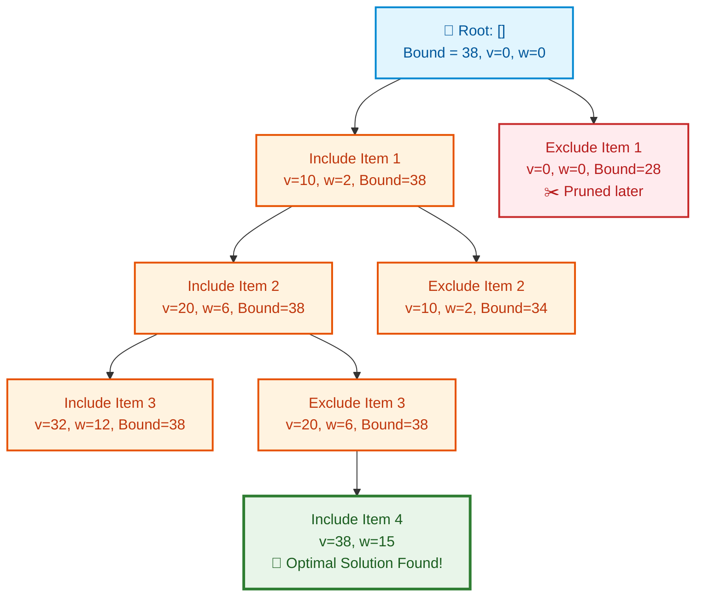

# 📊 WEEK 13 VISUAL CONCEPTS PLAYBOOK (HYBRID)

> 🧭 **Navigation:** [🏠 Week Overview](README.md) • [📘 Curriculum Syllabus](../COMPLETE_SYLLABUS.md)
> 
> 💡 **Instructor Note:** *This Visual Playbook provides a high-density, integrated synthesis. Not all sections are mandatory; use it as a modular reference to solidify invariants and review pattern transitions.*

---

**Phase:** D – Algorithm Paradigms  
**Theme:** Backtracking & Branch & Bound  
**Core Topics:** Backtracking Fundamentals, Backtracking Problems, Branch & Bound, Amortized Analysis  
**Format:** Hybrid (Enhanced ASCII + State Space Diagrams)  
**Syllabus Source:** COMPLETE_SYLLABUS.md  

---

## 📋 VISUAL LEGEND & SYMBOLS

### Symbol Reference Table

| Symbol | Meaning | Usage Context |
|--------|---------|---------------|
| `🌳` | State Space Tree | Backtracking visualization |
| `✂️` | Pruning | Cutting branches |
| `✓` | Valid solution | Accepted state |
| `✗` | Invalid state | Pruned/rejected |
| `→` | State transition | Moving between nodes |
| `↩` | Backtrack | Returning to parent |
| `□` | Unprocessed node | Not yet explored |
| `■` | Processed node | Explored and completed |
| `⚡` | Best-first search | Priority-based exploration |
| `📏` | Bound calculation | Lower/upper bounds |

---

## 🎯 WEEK 13 OVERVIEW

### Weekly Learning Arc

**Foundation:** Backtracking as systematic state space exploration  
**Pattern Recognition:** DFS with pruning, constraint checking, state restoration  
**Optimization:** Branch & bound for finding optimal solutions  
**Analysis:** Amortized complexity for operations averaging over sequences

### Topics Hierarchy


### 📌 WEEK 13 BACKTRACKING & BRANCH & BOUND

- **DAY 1: Backtracking Fundamentals**
  - Backtracking concept & template
  - State space tree structure
  - DFS exploration with pruning
- **DAY 2: Backtracking Problems**
  - N-Queens (placement with constraints)
  - Sudoku solver (grid constraints)
  - Permutations & combinations generation
  - Word search (path finding)
  - Maze solving (navigation)
- **DAY 3: Branch & Bound**
  - Branch & bound concept
  - Best-first search strategy
  - TSP with branch & bound
  - Knapsack with branch & bound
- **DAY 4: Amortized Analysis**
  - Amortized complexity concept
  - Aggregate analysis method
  - Accounting method
  - Potential method
  - Dynamic array analysis
  - Self-adjusting structures
- **DAY 5 (OPTIONAL): Mixed Paradigm Problems**
  - Combined techniques for complex problems


---

## 📅 DAY 1: BACKTRACKING FUNDAMENTALS

### Pattern Map: Backtracking Concept Family


### 📌 BACKTRACKING METHODOLOGY

- **Core Concept**
  - Build solution incrementally
  - Try all valid choices at each step
  - Backtrack when no progress possible
  - Equivalent to DFS on solution tree
- **Backtracking Template**
  - State: current partial solution
  - Choices: next decisions to try
  - Constraints: which choices valid
  - DFS: recursively explore
  - Prune: skip invalid branches
- **State Space Tree**
  - Root: empty solution
  - Internal nodes: partial solutions
  - Leaves: complete solutions or pruned
  - Edges: choices/decisions
- **Pruning Strategies**
  - Constraint checking (validity)
  - Optimality bounds (branch & bound)
  - Duplicate detection (memoization)
  - Early termination (first solution)
- **Implementation Patterns**
  - Recursive DFS
  - State modification + restore
  - Choice iteration
  - Base case detection


---

### Pattern 1.1: Backtracking Concept & Mechanism

#### Visual 1: Backtracking State Space Tree

```text
State Space Tree Exploration:
                 Root []
               /    |    \
           [1]     [2]     [3]
          /   \   /   \   /   \
       [1,2] [1,3] ... ... ...
        /       \
     [1,2,3]  [1,3,2]
      (Sol)    (Sol)
```

**Explanation:**
- **State Space Tree**: Represents all possible solution paths
- **DFS Traversal**: Explores one branch completely before backtracking
- **Backtracking**: When stuck or complete, return to parent and try next choice
- **Complete Solutions**: Found at leaves when all constraints satisfied

---

#### Visual 2: Backtracking Template Structure

```text
Backtracking Execution Flow:
Choose:   state.Add(choice)
Explore:  backtrack(state, choices)
Unchoose: state.Remove(choice)  <-- Backtrack & restore state!
```


**Explanation:**
- **State Modification**: Add choice to current solution
- **Recursion**: Explore consequences of choice
- **Backtracking**: Undo choice and try alternatives
- **State Restoration**: Critical for correctness—must undo changes

---

#### Visual 3: Backtracking vs Brute Force DFS


|  |  |  |
| :--- | :--- | :--- |
| 2. Diagonal check: | row1-row2 | == |


**Explanation:**
- **Brute Force**: Generate all configurations, test each
- **Backtracking**: Build solution incrementally, test validity early
- **Pruning**: Skip entire subtrees that can't lead to solution
- **Efficiency**: Exponential reduction in nodes explored

---

### Common Failure Modes (Day 1)

#### Failure 1: Forgetting to Restore State

```
❌ WRONG: Not Undoing Choice
----------------------------

function backtrack(state):
    if is_complete(state):
        result.add(state)  # ← BUG: Reference to same object!
        return
    
    for choice in choices:
        state.add(choice)
        backtrack(state)
        # ← MISSING: state.remove(choice)

RESULT:
-------
State accumulates choices without cleanup
All solutions end up identical (final state)
No exploration of alternative branches

EXAMPLE TRACE:
--------------
backtrack([])
  Choose 1: state = [1]
    Choose 2: state = [1,2] → Record (but not copied)
    ← Should remove 2, but doesn't
    Choose 3: state = [1,2,3] → Record
  ← Should remove 1, but doesn't
  Choose 2: state = [1,2,3,2] → Invalid!

✓ CORRECT: Restore State After Recursion
----------------------------------------

function backtrack(state):
    if is_complete(state):
        result.add(copy(state))  # ← Copy to preserve
        return
    
    for choice in choices:
        state.add(choice)
        backtrack(state)
        state.remove(choice)  # ← RESTORE STATE

WHY IT WORKS:
-------------
1. After exploring with choice, state returns to previous
2. Next iteration tries different choice from same state
3. Each branch independent
4. Copy ensures recorded solution persists
```

---

#### Failure 2: Not Copying Solution

```
❌ WRONG: Recording Reference
-----------------------------

solutions = []
state = []

function backtrack():
    if is_complete(state):
        solutions.add(state)  # ← BUG: stores reference
        return
    # ... rest of backtracking

RESULT:
-------
All solutions point to same list object
After backtracking completes, all solutions are identical
Lost all intermediate results

EXAMPLE:
--------
After finding [1,2,3]:
  solutions = [[1,2,3]]  # reference to state

After finding [1,3,2]:
  state mutates to [1,3,2]
  solutions = [[1,3,2], [1,3,2]]  # both point to same object!

Final after all backtracking:
  solutions = [[3,2,1], [3,2,1], [3,2,1], ...]  # all identical

✓ CORRECT: Deep Copy Solution
------------------------------

function backtrack():
    if is_complete(state):
        solutions.add(copy(state))  # ← Deep copy
        return
    # ... rest

WHY IT WORKS:
-------------
Each recorded solution is independent copy
Modifications to state don't affect recorded solutions
All unique solutions preserved correctly
```

---

#### Failure 3: Incorrect Constraint Checking

```
❌ WRONG: Weak Constraint Check
-------------------------------

Problem: N-Queens (no two queens attack each other)

function is_valid(board, row, col):
    # Only checks row
    for c in range(cols):
        if board[row][c] == 'Q':
            return False
    return True  # ← BUG: Doesn't check diagonals!

RESULT:
-------
Places queens that attack diagonally
Generates invalid solutions
Wastes time exploring bad paths

EXAMPLE (4×4 board):
--------------------
Q . . .
. . Q .  ← Q@(1,2) attacks Q@(0,0) diagonally
. . . .
. . . .

This configuration would be accepted (WRONG!)

✓ CORRECT: Complete Constraint Validation
------------------------------------------

function is_valid(board, row, col):
    # Check column
    for r in range(rows):
        if board[r][col] == 'Q':
            return False
    
    # Check diagonal (top-left to bottom-right)
    for r,c in diagonals(row, col, direction=1):
        if board[r][c] == 'Q':
            return False
    
    # Check anti-diagonal (top-right to bottom-left)
    for r,c in diagonals(row, col, direction=-1):
        if board[r][c] == 'Q':
            return False
    
    return True

WHY IT WORKS:
-------------
Checks all three attack directions
Prevents exploring invalid branches
Only generates valid solutions
Prunes search space effectively

OPTIMIZED VERSION (O(1) checking):
-----------------------------------
Track occupied columns, diagonals, anti-diagonals in sets
is_valid: check if col/diag/antidiag already in set
Time: O(1) per check vs O(n) scanning
```

---

### Quiz Questions (Day 1)

**Q1:** What is the time complexity of backtracking for generating all permutations of n elements?  
**Answer:** O(n! × n) — n! permutations, each requires O(n) work to build and validate

**Q2:** In the backtracking template, why is it critical to restore state after recursive call?  
**Answer:** To ensure each branch explores from correct parent state; without restoration, state accumulates and becomes corrupted

**Q3:** How does backtracking differ from brute force enumeration?  
**Answer:** Backtracking incrementally builds solutions and prunes invalid branches early; brute force generates all configurations first then filters

**Q4:** When recording a solution in backtracking, why must we create a copy?  
**Answer:** Because state is mutable and continues to change; recording reference would capture final state, not current solution

**Q5:** What is the role of constraint checking in backtracking efficiency?  
**Answer:** Constraint checking enables pruning—rejecting invalid partial solutions before exploring their descendants, drastically reducing search space

---

## 📅 DAY 2: BACKTRACKING PROBLEMS

### Pattern Map: Classic Backtracking Problems


### 📌 BACKTRACKING PROBLEM FAMILIES

- **Constraint Satisfaction**
  - N-Queens (placement constraints)
  - Sudoku (grid constraints)
  - Graph coloring (adjacency constraints)
- **Combinatorial Generation**
  - Permutations (all orderings)
  - Combinations (all subsets)
  - Subsets (all subsets including empty)
  - Partitions (split into groups)
- **Path Finding**
  - Word search (find word in grid)
  - Maze solving (find exit path)
  - Hamiltonian path (visit all nodes once)
  - Knight's tour (visit all board squares)
- **Optimization Problems**
  - Subset sum (find subset with target sum)
  - Knapsack (maximize value under weight)
  - Traveling salesman (shortest tour)


---

### Pattern 2.1: N-Queens Problem

#### Visual 1: N-Queens State Space & Pruning

```
N-QUEENS PROBLEM (n=4)
=======================

GOAL: Place 4 queens on 4×4 board, no two queens attack
      (No two queens share row, column, or diagonal)

### 📌 👑 Start: Empty Board

- **Col 0: Q@(0,0)**
  - Col 1: Q@(1,1)<br/>❌ Diagonal Conflict
  - **Col 1: Q@(2,1)<br/>✅ Safe Choice**
    - Col 2: Q@(1,2)<br/>❌ Row Conflict
    - Col 2: Q@(3,2)<br/>✅ Safe Choice
  - Col 1: Q@(3,1)<br/>❌ Diagonal Conflict
- Col 0: Q@(1,0)
- Col 0: Q@(2,0)
- Col 0: Q@(3,0)


[After exhaustive search...]

VALID SOLUTION 1:
-----------------
. Q . .    Q@(1,0)
. . . Q    Q@(3,1)
Q . . .    Q@(0,2)
. . Q .    Q@(2,3)

VALID SOLUTION 2:
-----------------
. . Q .    Q@(2,0)
Q . . .    Q@(0,1)
. . . Q    Q@(3,2)
. Q . .    Q@(1,3)

CONSTRAINT CHECKING (for each placement):
------------------------------------------
1. Column: Already placing column by column (guaranteed unique)
2. Row: Check if row already occupied
   rows_used = set()
   if row in rows_used: return False

3. Diagonals:
   - Main diagonal: row - col constant for cells on same diagonal
     diag1_used = set()
     if (row - col) in diag1_used: return False
   
   - Anti-diagonal: row + col constant
     diag2_used = set()
     if (row + col) in diag2_used: return False

PRUNING EFFECT:
---------------
Total positions without pruning: 4^4 = 256
Positions explored with pruning: ~30-50 (depends on order)
Speedup: ~5-8× for n=4, exponential for larger n

ALGORITHM:
----------
function solve_nqueens(col, board, solutions):
    if col == n:
        solutions.add(copy(board))
        return
    
    for row in range(n):
        if is_safe(board, row, col):
            board[row][col] = 'Q'
            rows_used.add(row)
            diag1_used.add(row - col)
            diag2_used.add(row + col)
            
            solve_nqueens(col + 1, board, solutions)
            
            board[row][col] = '.'
            rows_used.remove(row)
            diag1_used.remove(row - col)
            diag2_used.remove(row + col)
```

**Explanation:**
- **Column-by-Column**: Place one queen per column (guarantees column uniqueness)
- **Row Checking**: Use set to track occupied rows (O(1) lookup)
- **Diagonal Tracking**: Use row±col invariants to identify diagonals
- **Backtracking**: If no safe placement in column, backtrack to previous column

---

### Pattern 2.2: Sudoku Solver

#### Visual 1: Sudoku Constraint Checking


| 5 3 . | . 7 . | . . . |
| :--- | :--- | :--- |
| 6 . . | 1 9 5 | . . . |
| . 9 8 | . . . | . 6 . |
| 8 . . | . 6 . | . . 3 |
| 4 . . | 8 . 3 | . . 1 |
| 7 . . | . 2 . | . . 6 |
| . 6 . | . . . | 2 8 . |
| . . . | 4 1 9 | . . 5 |
| . . . | . 8 . | . 7 9 |


**Explanation:**
- **Three Constraints**: Row, column, and 3×3 box uniqueness
- **Try All Digits**: For each empty cell, attempt 1-9
- **Immediate Validation**: Check constraints before recursing
- **Backtrack on Failure**: Remove digit and try next

---

### Pattern 2.3: Permutations & Combinations

#### Visual 1: Permutations Generation



**Goal:** Generate all `3! = 6` unique orderings.

```text
ALGORITHM:
----------
function permute(nums):
    result = []
    used = [False] * len(nums)
    current = []
    
    function backtrack():
        if len(current) == len(nums):
            result.add(copy(current))
            return
        
        for i in range(len(nums)):
            if not used[i]:
                # Choose
                current.add(nums[i])
                used[i] = True
                
                # Explore
                backtrack()
                
                # Unchoose (Backtrack)
                current.remove_last()
                used[i] = False
    
    backtrack()
    return result

EXECUTION TRACE:
================
Step  | current  | used        | Action
-----------------------------------------
1     | []       | [F,F,F]     | Try i=0
2     | [1]      | [T,F,F]     | Try i=1
3     | [1,2]    | [T,T,F]     | Try i=2
4     | [1,2,3]  | [T,T,T]     | ✓ Record → Backtrack
5     | [1,2]    | [T,T,F]     | No more i → Backtrack
6     | [1]      | [T,F,F]     | Try i=2
7     | [1,3]    | [T,F,T]     | Try i=1
8     | [1,3,2]  | [T,T,T]     | ✓ Record → Backtrack
9     | [1,3]    | [T,F,T]     | No more i → Backtrack
10    | [1]      | [T,F,F]     | No more i → Backtrack
11    | []       | [F,F,F]     | Try i=1
...   | ...      | ...         | Continue for all paths

TIME COMPLEXITY:
----------------
- Total permutations: n!
- Building each: O(n) to copy
- Total: O(n! × n)

SPACE COMPLEXITY:
-----------------
- Recursion depth: O(n)
- used array: O(n)
- current list: O(n)
- Result storage: O(n! × n)
```

**Explanation:**
- **Used Array**: Track which elements already in current permutation
- **Backtracking**: After exploring with element, mark unused and remove
- **Complete Permutations**: Found when current length equals array length

---

#### Visual 2: Combinations Generation

**Goal:** Choose `k = 2` elements from `[1, 2, 3, 4]` (order does not matter).  
**Result:** `[1,2], [1,3], [1,4], [2,3], [2,4], [3,4]`



```text
ALGORITHM:
----------
function combine(n, k):
    result = []
    current = []
    
    function backtrack(start):
        if len(current) == k:
            result.add(copy(current))
            return
        
        for i in range(start, n + 1):
            # Choose
            current.add(i)
            
            # Explore (only elements after i)
            backtrack(i + 1)
            
            # Unchoose
            current.remove_last()
    
    backtrack(1)
    return result

EXECUTION TRACE (n=4, k=2):
===========================
Call         | current | start | Action
----------------------------------------
backtrack(1) | []      | 1     | Try i=1
backtrack(2) | [1]     | 2     | Try i=2
             | [1,2]   | -     | ✓ Record → Backtrack
backtrack(2) | [1]     | 2     | Try i=3
backtrack(4) | [1,3]   | 4     | ✓ Record → Backtrack
backtrack(2) | [1]     | 2     | Try i=4
backtrack(5) | [1,4]   | 5     | ✓ Record → Backtrack
backtrack(1) | []      | 1     | Try i=2
backtrack(3) | [2]     | 3     | Try i=3
             | [2,3]   | -     | ✓ Record → Backtrack
backtrack(3) | [2]     | 3     | Try i=4
backtrack(5) | [2,4]   | 5     | ✓ Record → Backtrack
backtrack(1) | []      | 1     | Try i=3
backtrack(4) | [3]     | 4     | Try i=4
             | [3,4]   | -     | ✓ Record → Backtrack

COMBINATIONS COUNT:
-------------------
C(n,k) = n! / (k! × (n-k)!)
C(4,2) = 4! / (2! × 2!) = 24 / 4 = 6 ✓

TIME COMPLEXITY:
----------------
O(C(n,k) × k) = O(n choose k × k)
```

**Explanation:**
- **Start Index**: Ensures we only choose elements after previous choice
- **Avoids Duplicates**: [1,2] generated, [2,1] never considered
- **Combinatorial Formula**: Generates exactly C(n,k) combinations

---

### Pattern 2.4: Word Search in Grid

#### Visual 1: Word Search with Backtracking

```
WORD SEARCH (Find "SEAR" in grid)
===================================

GRID:
-----
S E A R
A B C D
R E K L
T E A R

GOAL: Find path that spells "SEAR" (adjacent cells: up/down/left/right)

APPROACH:
---------
1. For each cell, try as starting point
2. DFS from that cell to match word
3. Mark visited cells to avoid cycles
4. Backtrack and unmark after exploring

SEARCH STARTING AT (0,0) for "SEAR":
=====================================

Step 1: Match 'S' at (0,0)
------------------------
■ E A R    ■ = visited
A B C D    Try neighbors: (0,1), (1,0)
R E K L
T E A R

Step 2: Match 'E' at (0,1)
------------------------
■ ■ A R    Continue with 'A'
A B C D    Try neighbors: (0,2), (1,1)
R E K L
T E A R

Step 3: Match 'A' at (0,2)
------------------------
■ ■ ■ R    Continue with 'R'
A B C D    Try neighbors: (0,3), (1,2)
R E K L
T E A R

Step 4: Match 'R' at (0,3)
------------------------
■ ■ ■ ■    Word complete! ✓
A B C D    Return True
R E K L
T E A R

Path: (0,0)→(0,1)→(0,2)→(0,3)

ALGORITHM:
----------
function exist(board, word):
    for row in range(rows):
        for col in range(cols):
            if dfs(board, word, 0, row, col):
                return True
    return False

function dfs(board, word, index, row, col):
    # Base case: matched entire word
    if index == len(word):
        return True
    
    # Boundary check
    if row < 0 or row >= rows or col < 0 or col >= cols:
        return False
    
    # Mismatch or already visited
    if board[row][col] != word[index] or board[row][col] == '#':
        return False
    
    # Mark visited
    temp = board[row][col]
    board[row][col] = '#'
    
    # Try all 4 directions
    found = (dfs(board, word, index+1, row+1, col) or
             dfs(board, word, index+1, row-1, col) or
             dfs(board, word, index+1, row, col+1) or
             dfs(board, word, index+1, row, col-1))
    
    # Backtrack: unmark visited
    board[row][col] = temp
    
    return found

BACKTRACKING EXAMPLE (Failed path):
====================================

Searching for "SEAB" (doesn't exist):
Step 1: S at (0,0) ✓
Step 2: E at (0,1) ✓
Step 3: A at (0,2) ✓
Step 4: B at (0,3)? → 'R' not 'B' ✗

Backtrack from (0,2):
  Unmark (0,2), try (1,2)
Step 4: B at (1,2)? → 'C' not 'B' ✗

Backtrack from (0,1):
  Unmark (0,1), try (1,1)
Step 3: A at (1,1)? → 'B' not 'A' ✗

Backtrack from (0,0):
  Unmark (0,0), try (1,0)
Step 2: E at (1,0)? → 'A' not 'E' ✗

All paths exhausted → Return False

TIME COMPLEXITY:
----------------
Worst case: O(rows × cols × 4^word_length)
- For each cell: try as start (rows × cols)
- Each DFS: up to 4 branches per character (4^L)
- Pruning reduces in practice

SPACE COMPLEXITY:
-----------------
O(word_length) for recursion stack
```

**Explanation:**
- **DFS with Backtracking**: Explore all 4 directions from each cell
- **Visited Marking**: Temporarily mark cells to avoid revisiting
- **Backtracking**: Unmark after exploring to allow use in other paths
- **Early Termination**: Return immediately when word found

---

### Pattern 2.5: Maze Solving

#### Visual 1: Maze Pathfinding

```
MAZE SOLVING (Find path from S to E)
=====================================

MAZE (1=wall, 0=path):
----------------------
S 0 1 0 0
1 0 1 0 1
0 0 0 1 0
0 1 0 0 E

BACKTRACKING APPROACH:
----------------------
1. Start at S
2. Try each direction (up, down, left, right)
3. Mark current cell as visited
4. If reach E: success
5. If blocked: backtrack and try different direction

PATH EXPLORATION:
=================

Attempt 1: Go right from S
---------------------------
■ ■ 1 0 0    ■ = visited
1 0 1 0 1    Blocked by wall → Backtrack
0 0 0 1 0
0 1 0 0 E

Backtrack to S, try down:
-------------------------
■ 0 1 0 0
■ 0 1 0 1    Reached (1,0), try down
0 0 0 1 0
0 1 0 0 E

Continue down from (1,0):
-------------------------
■ 0 1 0 0
■ 0 1 0 1
■ 0 0 1 0    Reached (2,0), try right
0 1 0 0 E

Continue exploration:
---------------------
■ 0 1 0 0
■ ■ 1 0 1
■ ■ ■ 1 0    Dead end → Backtrack
0 1 0 0 E

After backtracking and trying alternatives:
-------------------------------------------
■ ■ 1 0 0
1 ■ 1 0 1
0 ■ ■ 1 0
0 1 ■ ■ ■ ✓ Found path to E!

SUCCESSFUL PATH:
----------------
(0,0)→(0,1)→(1,1)→(2,1)→(2,2)→(3,2)→(3,3)→(3,4)

ALGORITHM:
----------
function solveMaze(maze, row, col):
    # Base cases
    if row == exit_row and col == exit_col:
        return True  # Found exit!
    
    if row < 0 or row >= rows or col < 0 or col >= cols:
        return False  # Out of bounds
    
    if maze[row][col] == 1 or visited[row][col]:
        return False  # Wall or already visited
    
    # Mark visited
    visited[row][col] = True
    path.add((row, col))
    
    # Try all 4 directions
    if (solveMaze(maze, row+1, col) or  # Down
        solveMaze(maze, row-1, col) or  # Up
        solveMaze(maze, row, col+1) or  # Right
        solveMaze(maze, row, col-1)):   # Left
        return True
    
    # Backtrack: unmark and remove from path
    visited[row][col] = False
    path.remove((row, col))
    
    return False

BACKTRACKING VISUALIZATION:
===========================
Stack depth represents recursion level
Each level tries 4 directions

Level 0: (0,0) → Try Down
Level 1: (1,0) → Try Right
Level 2: (1,1) → Try Down
Level 3: (2,1) → Try Right
Level 4: (2,2) → Try Down
Level 5: (3,2) → Try Right
Level 6: (3,3) → Try Right
Level 7: (3,4) → EXIT FOUND ✓

Return True propagates up stack:
Level 7 → Level 6 → Level 5 → ... → Level 0

TIME COMPLEXITY:
----------------
O(rows × cols) in worst case (visit every cell)
Pruning helps in practice

SPACE COMPLEXITY:
-----------------
O(rows × cols) for visited array
O(path_length) for recursion stack (at most rows+cols)
```

**Explanation:**
- **DFS Exploration**: Try all directions from current cell
- **Visited Tracking**: Avoid revisiting cells in same path
- **Backtracking**: If dead end, unmark and try alternative
- **Path Recording**: Build path during successful traversal

---

### Common Failure Modes (Day 2)

#### Failure 1: Not Marking Visited in Grid Problems

```
❌ WRONG: Missing Visited Tracking
----------------------------------

function wordSearch(board, word, index, row, col):
    if index == len(word):
        return True
    
    if board[row][col] != word[index]:
        return False
    
    # ← MISSING: Mark visited
    
    # Try 4 directions
    return (dfs(..., row+1, col) or
            dfs(..., row-1, col) or
            dfs(..., row, col+1) or
            dfs(..., row, col-1))

RESULT:
-------
Infinite recursion: visits same cell repeatedly
Stack overflow
Never finds solution or crashes

EXAMPLE:
--------
Grid: S E
      A R

Search "SEA":
(0,0)S → (0,1)E → (1,0)A → (0,0)S → (0,1)E → ...
         ↑_________________↓
         Cycle never breaks!

✓ CORRECT: Mark and Unmark Visited
-----------------------------------

function wordSearch(board, word, index, row, col):
    if index == len(word):
        return True
    
    if board[row][col] != word[index]:
        return False
    
    # Mark visited
    temp = board[row][col]
    board[row][col] = '#'  # or use separate visited array
    
    # Explore
    found = (dfs(..., row+1, col) or
             dfs(..., row-1, col) or
             dfs(..., row, col+1) or
             dfs(..., row, col-1))
    
    # Backtrack: unmark
    board[row][col] = temp
    
    return found

WHY IT WORKS:
-------------
Prevents cycles within single path
Allows cell reuse in different paths
Correctly explores all possibilities
```

---

#### Failure 2: Copying vs Reference in Solution Recording

```
❌ WRONG: Recording Reference to Mutable State
----------------------------------------------

solutions = []

function permute(nums):
    current = []
    
    function backtrack():
        if len(current) == len(nums):
            solutions.add(current)  # ← BUG: reference
            return
        
        for num in nums:
            if num not in current:
                current.add(num)
                backtrack()
                current.remove(num)
    
    backtrack()
    return solutions

RESULT:
-------
All solutions point to same list
After backtracking completes, all are identical (empty or last state)

TRACE:
------
After finding [1,2,3]:
  solutions = [[1,2,3]]  ← Reference to current

After finding [1,3,2]:
  current changes to [1,3,2]
  solutions = [[1,3,2], [1,3,2]]  ← Both point to same object!

Final state:
  solutions = [[], [], [], [], [], []]  ← All empty!

✓ CORRECT: Deep Copy Solution
------------------------------

function backtrack():
    if len(current) == len(nums):
        solutions.add(copy(current))  # ← Deep copy
        return
    # ... rest unchanged

WHY IT WORKS:
-------------
Each solution is independent copy
Modifications don't affect recorded solutions
All unique permutations preserved
```

---

### Quiz Questions (Day 2)

**Q6:** In N-Queens, why is column-by-column placement more efficient than row-by-row?  
**Answer:** Guarantees one queen per column automatically; reduces constraint checking to just rows and diagonals (not columns)

**Q7:** How does the "start" parameter in combination generation prevent duplicates?  
**Answer:** Ensures we only choose elements after previous choice, so [1,2] generated but [2,1] never attempted (order doesn't matter)

**Q8:** In word search, why must we unmark visited cells during backtracking?  
**Answer:** Cell may be part of different path; unmarking allows reuse in alternative paths while preventing cycles within single path

**Q9:** What is time complexity of generating all permutations of n elements?  
**Answer:** O(n! × n) — n! permutations, each requiring O(n) work to copy

**Q10:** In Sudoku, what are the three constraint types that must be checked?  
**Answer:** Row uniqueness, column uniqueness, 3×3 box uniqueness — all must have digits 1-9 exactly once

---

## 📅 DAY 3: BRANCH & BOUND

### Pattern Map: Branch & Bound Methodology


### 📌 BRANCH & BOUND PARADIGM

- **Core Concepts**
  - Systematic search for optimization
  - Branch: explore sub-problem spaces
  - Bound: compute upper/lower bounds
  - Prune: skip branches that can't improve best
- **Best-First Search Strategy**
  - Priority queue ordered by bound
  - Process most promising nodes first
  - Often finds good solution early
  - Convergence to optimal
- **Bounding Functions**
  - Minimization: lower bound (can't do better than this)
  - Maximization: upper bound (can't exceed this)
  - Relaxation: simplified problem solution
  - Greedy estimate: optimistic heuristic
- **Pruning Strategies**
  - Fathoming: bound worse than current best
  - Dominance: one branch clearly superior
  - Infeasibility: violates constraints
  - Early termination: optimal proven
- **Classic Applications**
  - Traveling Salesman Problem (TSP)
  - Knapsack (0/1)
  - Job scheduling
  - Integer programming


---

### Pattern 3.1: Branch & Bound Concept

#### Visual 1: Branch & Bound vs Pure Backtracking

```text
BACKTRACKING (DFS Exhaustion)        BRANCH & BOUND (Best-First + Pruning)
         Root                                 Root
        / | \                                / | \
       A  B  C                              A  B  C
      / \                                  / \     \
     D   E (searches all leaves)          D   [Pruned: bound >= best]
```

**Explanation:**
- **Backtracking**: Explores all paths, finds best by exhaustion
- **Branch & Bound**: Uses bounds to eliminate inferior paths early
- **Bound Calculation**: Optimistic estimate (can't do better than this)
- **Pruning**: If bound worse than known solution, skip entire subtree

---

#### Visual 2: Branch & Bound State Space Tree

| Node State | Status | Action Taken |
| :--- | :--- | :--- |
| **E-Node (Expanding)** | Active in Priority Queue | Generates feasible child branches |
| **Live Node** | Bound < Current Best | Stored in heap for exploration |
| **Dead / Pruned Node** | Bound >= Current Best | Discarded immediately without expanding children |


**Explanation:**
- **Priority Queue**: Orders nodes by bound (most promising first)
- **Best-First Expansion**: Process node with best bound
- **Bound Tracking**: Update best solution when complete node found
- **Aggressive Pruning**: Any node with bound worse than best is pruned

---

### Pattern 3.2: TSP with Branch & Bound

#### Visual 1: TSP Lower Bound Calculation

**Problem:** Visit all cities exactly once, return to starting city `A`, and minimize total path distance.

#### Distance Cost Matrix

| City | A | B | C | D |
| :--- | :--- | :--- | :--- | :--- |
| **A** | `0` | `10` | `15` | `20` |
| **B** | `10` | `0` | `35` | `25` |
| **C** | `15` | `35` | `0` | `30` |
| **D** | `20` | `25` | `30` | `0` |

#### Minimum Spanning Tree (MST) Lower Bound Calculation

For any valid Hamiltonian tour, the sum of remaining edges is bounded below by `MST Weight + Min Return Edge`.



- **MST Edges Selected:** `(A, B) = 10`, `(A, C) = 15`, `(B, D) = 25` -> **Total MST Weight = 50**
- **Lower Bound = 50** (no tour can possibly beat 50).

#### Branch & Bound State Space Search Tree



**Optimal Tour Found:** `A -> B -> D -> C -> A` (or reverse) with **Cost = 80**.  
Branches with lower bounds exceeding 80 (such as `[A, B, C]` with bound 95) are pruned immediately without visiting their child subtrees.

| Approach | Nodes Explored | Nodes Pruned | Efficiency Gain |
| :--- | :--- | :--- | :--- |
| **Brute-Force DFS** | 12 complete tours evaluated | 0 | Exhaustive baseline |
| **Branch & Bound** | ~8 nodes evaluated | ~6 subtrees pruned | Cuts search space significantly early |

**Explanation:**
- **Lower Bound**: MST provides optimistic estimate (tour can't be shorter)
- **Best-First Search**: Explore tours with best bounds first
- **Pruning**: Skip partial tours whose bound exceeds best complete tour
- **Optimality**: Guaranteed to find optimal solution

---

### Pattern 3.3: 0/1 Knapsack with Branch & Bound

#### Visual 1: Knapsack Upper Bound (Fractional Relaxation)

**Problem:** Knapsack Capacity `W = 15`. Maximize total value without exceeding capacity.

#### Available Items (Sorted by Value Density)

| Item | Value | Weight | Density (`Value / Weight`) | Greedy Priority |
| :--- | :--- | :--- | :--- | :--- |
| **Item 1** | `10` | `2` | **5.0** | 1st priority |
| **Item 2** | `10` | `4` | **2.5** | 2nd priority |
| **Item 3** | `12` | `6` | **2.0** | 3rd priority |
| **Item 4** | `18` | `9` | **2.0** | 4th priority |

#### Optimistic Upper Bound (Fractional Knapsack Relaxation)

- Take 100% of Item 1: `v = 10, w = 2` (Remaining capacity = 13)
- Take 100% of Item 2: `v = 10, w = 4` (Remaining capacity = 9)
- Take 100% of Item 3: `v = 12, w = 6` (Remaining capacity = 3)
- Take `3/9` fraction of Item 4: `v = 6, w = 3` (Remaining capacity = 0)
- **Upper Bound = 10 + 10 + 12 + 6 = 38** (No integer 0/1 assignment can exceed 38).

#### Branch & Bound State Space Tree



#### Final Solution Summary

| Selected Items | Total Value | Total Weight | Capacity Limit | Result Status |
| :--- | :--- | :--- | :--- | :--- |
| **Items 1, 2, and 4** | **38** | **15** | 15 | **Guaranteed Optimal Solution** |

- **Nodes Explored:** ~10 nodes  
- **Subtrees Pruned:** ~6 branches (any partial assignment with upper bound `< 38` was safely discarded).

**Explanation:**
- **Upper Bound**: Fractional knapsack (allow partial items) gives optimistic estimate
- **Branching**: Include or exclude each item
- **Pruning**: If partial solution + upper bound ≤ best, prune
- **Optimality**: Guaranteed optimal when search completes

---

### Common Failure Modes (Day 3)

#### Failure 1: Incorrect Bound Calculation

```
❌ WRONG: Pessimistic or Invalid Bound
--------------------------------------

Problem: TSP (minimization)

function calculate_bound(partial_tour):
    # Takes maximum edge from each unvisited city
    bound = current_cost
    for city in unvisited:
        bound += max_edge_from(city)  # ← TOO PESSIMISTIC
    return bound

RESULT:
-------
Bound is higher than actual cost possible
Doesn't prune enough branches
Explores more nodes than necessary
Defeats purpose of branch & bound

EXAMPLE:
--------
Partial tour: A→B, cost=10
Unvisited: C, D
Max edges: C→30, D→25
Bound = 10+30+25 = 65

But minimum completion might be:
B→C (15) + C→D (20) + D→A (10) = 45
Total: 10+45=55 << 65 (bound too loose)

✓ CORRECT: Optimistic Bound (MST or Minimum Edges)
---------------------------------------------------

function calculate_bound(partial_tour):
    # Use minimum edges or MST of remaining
    bound = current_cost
    mst_remaining = minimum_spanning_tree(unvisited)
    bound += mst_remaining.weight
    bound += min_edge_to_connect()  # Min edge back to tour
    return bound

WHY IT WORKS:
-------------
Provides tightest lower bound
Any completion ≥ this bound
Prunes more aggressively
Reduces search space significantly

EXAMPLE:
--------
Partial tour: A→B, cost=10
Unvisited: C, D
MST(C,D): 20 (min spanning tree)
Min edge to connect: 10 (D→A)
Bound = 10+20+10 = 40

This bound is tight and optimistic
Actual best completion: ≥ 40
```

---

#### Failure 2: Not Updating Best Solution

```
❌ WRONG: Forgetting to Track Best
----------------------------------

best_solution = None  # ← Never updated!

function branch_and_bound(node):
    if is_complete(node):
        # ← MISSING: Update best_solution
        return node.value
    
    for child in expand(node):
        if bound(child) < best_known:  # ← best_known undefined!
            branch_and_bound(child)

RESULT:
-------
No pruning occurs (best_known not set)
Explores entire search space
Equivalent to brute force
No optimization benefit

✓ CORRECT: Maintain and Update Best
-----------------------------------

best_solution = None
best_value = -∞  # For maximization

function branch_and_bound(node):
    if is_complete(node):
        if node.value > best_value:  # ← UPDATE
            best_value = node.value
            best_solution = node
        return
    
    for child in expand(node):
        if bound(child) > best_value:  # ← COMPARE
            branch_and_bound(child)
        else:
            prune(child)  # Bound not better than known

WHY IT WORKS:
-------------
Tracks best solution found so far
Uses it for pruning decisions
Updates as better solutions discovered
Guarantees optimal when search completes
```

---

### Quiz Questions (Day 3)

**Q11:** What is the key difference between backtracking and branch & bound?  
**Answer:** Branch & bound uses bounds to prune branches that can't improve the best solution; backtracking explores all solutions without optimization-based pruning

**Q12:** In TSP branch & bound, how is the lower bound typically calculated?  
**Answer:** Using MST (minimum spanning tree) of remaining cities plus minimum edge to connect back to tour

**Q13:** Why is fractional knapsack used as upper bound for 0/1 knapsack?  
**Answer:** Fractional knapsack (allowing partial items) gives optimistic maximum value achievable; any 0/1 solution can't exceed this

**Q14:** What happens if bound calculation is too pessimistic?  
**Answer:** Weak pruning; explores more nodes than necessary; defeats purpose of branch & bound

**Q15:** In best-first search for branch & bound, which node is processed next?  
**Answer:** Node with best (lowest for minimization, highest for maximization) bound value from priority queue

---

## 📅 DAY 4: AMORTIZED ANALYSIS

### Pattern Map: Amortized Analysis Techniques


### 📌 AMORTIZED ANALYSIS METHODOLOGY

- **Amortized Complexity Concept**
  - Average cost over sequence of operations
  - Some operations expensive, many cheap
  - Amortized = total cost / number of operations
  - Smooths out occasional expensive ops
- **Analysis Methods**
  - **Aggregate Analysis**
    - Calculate total cost for n operations
    - Divide by n for amortized cost
    - Simplest method, often sufficient
  - **Accounting Method**
    - Assign 'charged' cost to each operation
    - Build 'credit' for future expensive ops
    - Show credit never goes negative
    - Intuitive budgeting metaphor
  - **Potential Method**
    - Define potential function Φ on data structure
    - Amortized cost = actual + ΔΦ
    - Sum amortized costs bounds total actual
    - Most powerful, handles complex cases
- **Classic Examples**
  - Dynamic Arrays (doubling strategy)
  - Stack operations (multipop)
  - Binary counter increment
  - Splay trees (self-adjusting)
- **Applications**
  - Data structure design
  - Algorithm efficiency analysis
  - Competitive programming
  - Performance prediction


---

### Pattern 4.1: Amortized Complexity Concept

#### Visual 1: Amortized Cost vs Worst-Case Cost


| Operation | Array Size Before | Operation Cost | Notes |
| :--- | :--- | :--- | :--- |
| append(1) | 0 | 1 | Allocate size 1 |
| append(2) | 1 | 2 | Full, resize to 2 (copy 1, add 1) |
| append(3) | 2 | 1 | Space available |
| append(4) | 2 | 4 | Full, resize to 4 (copy 2, add 1) |
| append(5) | 4 | 1 | Space available |
| append(6) | 4 | 1 | Space available |
| append(7) | 4 | 1 | Space available |
| append(8) | 4 | 8 | Full, resize to 8 (copy 4, add 1) |
| append(9) | 8 | 1 | Space available |
| ... | ... | ... | ... |


**Explanation:**
- **Occasional Expensive**: Resize operations cost O(n)
- **Mostly Cheap**: Most appends are O(1)
- **Geometric Series**: Resize costs sum to O(n)
- **Amortized O(1)**: Total cost O(n) for n operations

---

### Pattern 4.2: Aggregate Analysis

#### Visual 1: Aggregate Analysis of Dynamic Array


| Op | Size | Action | Cost | Running Total |
| :--- | :--- | :--- | :--- | :--- |
| 1 | 0→1 | Resize | 1 | 1 |
| 2 | 1→2 | Resize | 2 | 3 |
| 3 | 2 | Append | 1 | 4 |
| 4 | 2→4 | Resize | 4 | 8 |
| 5-7 | 4 | Append×3 | 3 | 11 |
| 8 | 4→8 | Resize | 8 | 19 |
| 9-15 | 8 | Append×7 | 7 | 26 |
| 16 | 8→16 | Resize | 16 | 42 |


**Explanation:**
- **Total Cost**: Sum all operation costs across sequence
- **Geometric Series**: Resize costs form geometric series summing to 2n
- **Division**: Total cost / n operations = O(1) amortized
- **Simple Method**: Easiest to apply when total cost is easy to compute

---

### Pattern 4.3: Accounting Method

#### Visual 1: Accounting Method for Stack Multipop


| Op | Stack State | Credit on Stack | Charged | Credit Balance |
| :--- | :--- | :--- | :--- | :--- |
| Push(A) | [A] | 1 (on A) | 2 | +1 |
| Push(B) | [A,B] | 1+1 = 2 | 2 | +1 (total +2) |
| Push(C) | [A,B,C] | 1+1+1 = 3 | 2 | +1 (total +3) |
| Pop() | [A,B] | 1+1 = 2 | 0 | Use credit from C |
| Multipop(5) | [] | 0 | 0 | Use credits from A,B |
| Push(D) | [D] | 1 | 2 | +1 |


**Explanation:**
- **Charged Cost**: What we "charge" (may be more than actual)
- **Credit**: Difference between charged and actual (saved for future)
- **Invariant**: Credit never goes negative (always enough to pay)
- **Amortized Cost**: Charged cost (guaranteed non-negative credit)

---

### Pattern 4.4: Potential Method

#### Visual 1: Potential Method for Binary Counter


| Counter | Binary | Φ | Actual | ΔΦ | Amortized |
| :--- | :--- | :--- | :--- | :--- | :--- |
| 0 | 0000 | 0 | - | - | - |
| 1 | 0001 | 1 | 1 | +1 | 2 |
| 2 | 0010 | 1 | 2 | 0 | 2 |
| 3 | 0011 | 2 | 1 | +1 | 2 |
| 4 | 0100 | 1 | 3 | -2 | 1 |
| 5 | 0101 | 2 | 1 | +1 | 2 |
| 6 | 0110 | 2 | 2 | 0 | 2 |
| 7 | 0111 | 3 | 1 | +1 | 2 |
| 8 | 1000 | 1 | 4 | -3 | 1 |


**Explanation:**
- **Potential Function**: Captures "stored energy" in data structure
- **Amortized Cost**: Actual cost plus change in potential
- **Smoothing**: Expensive operations decrease potential, cheap ones increase
- **Powerful**: Works for complex cases where accounting method is unclear

---

### Pattern 4.5: Dynamic Array Amortized Analysis (All Three Methods)

#### Visual 1: Three Methods Compared


| Method | Amortized | Ease of Use | Power |
| :--- | :--- | :--- | :--- |
| Aggregate | O(1) | Easiest | Simple total costs |
| Accounting | O(1) | Medium | Intuitive budgeting |
| Potential | O(1) | Hardest | Most flexible |


**Explanation:**
- **All Three Methods**: Aggregate, Accounting, Potential all work
- **Same Result**: O(1) amortized cost from all approaches
- **Different Perspectives**: Each provides unique insight into cost structure
- **Choose Based on Problem**: Use simplest method that works

---

### Common Failure Modes (Day 4)

#### Failure 1: Confusing Worst-Case with Amortized

```
❌ WRONG: Claiming Amortized = Worst-Case
-----------------------------------------

"Dynamic array append is O(n) because resize costs O(n)"

RESULT:
-------
Misleading: Ignores that most appends are O(1)
Overstates actual cost
Amortized analysis provides tighter bound

✓ CORRECT: Distinguish Worst-Case vs Amortized
-----------------------------------------------

Dynamic array append:
  Worst-case per operation: O(n) (when resize happens)
  Amortized per operation: O(1) (averaged over sequence)

WHY DIFFERENT:
--------------
Worst-case: Single operation in isolation
Amortized: Average over sequence of operations
Amortized ≤ Worst-case (often much smaller)
```

---

#### Failure 2: Negative Credit in Accounting Method

```
❌ WRONG: Insufficient Charged Cost
-----------------------------------

Stack with multipop:
  Push: Charge 1 (actual=1, credit=0)
  Pop: Charge 0 (actual=1)
  Multipop(k): Charge 0 (actual=k)

RESULT:
-------
After pop operations, credit goes negative
Analysis invalid (can't pay for operations)

EXAMPLE:
--------
Push(A): Charged=1, Credit=0
Push(B): Charged=1, Credit=0
Multipop(2): Charged=0, Actual=2, Credit=-2 ✗ INVALID!

✓ CORRECT: Charge Enough to Never Go Negative
----------------------------------------------

Push: Charge 2 (actual=1, credit=1 stored with element)
Pop: Charge 0 (use credit from element)
Multipop: Charge 0 (use credits from popped elements)

EXAMPLE:
--------
Push(A): Charged=2, Credit=+1 (on A)
Push(B): Charged=2, Credit=+1 (on B), Total=2
Multipop(2): Charged=0, Actual=2, Use 2 credits ✓
Credit balance: 0 (valid, non-negative)
```

---

### Quiz Questions (Day 4)

**Q16:** What is the difference between amortized analysis and average-case analysis?  
**Answer:** Amortized analyzes worst-case sequence of operations; average-case assumes probability distribution over inputs—amortized doesn't assume randomness

**Q17:** In aggregate analysis, how do we compute amortized cost?  
**Answer:** Calculate total cost for n operations, divide by n to get amortized cost per operation

**Q18:** What is the key requirement for the accounting method to be valid?  
**Answer:** Credit balance must never go negative—must always have enough credit to pay for all operations

**Q19:** In the potential method, what does Φ represent?  
**Answer:** Potential function measuring "stored energy" or "disorder" in data structure state

**Q20:** Why is dynamic array append O(1) amortized despite O(n) resize cost?  
**Answer:** Resize happens infrequently (geometric series sums to O(n)), and most appends are O(1), averaging to O(1) amortized

---

## 🎯 WEEK 13 VISUAL SUMMARY TABLE

| DAY | TOPIC | KEY PATTERN | COMPLEXITY | WHEN TO USE |
|-----|-------|-------------|------------|-------------|
| **Day 1** | Backtracking Fundamentals | DFS on state space tree with pruning | O(b^d) where b=branching, d=depth | Constraint satisfaction, combinatorial generation |
| **Day 2** | Backtracking Problems | N-Queens, Sudoku, Permutations, Word Search | O(solutions × time_per_solution) | Specific constraint problems, path finding |
| **Day 3** | Branch & Bound | Best-first search with bounds | O(b^d) worst-case, often much better | Optimization problems (TSP, Knapsack) |
| **Day 4** | Amortized Analysis | Aggregate, Accounting, Potential methods | Varies by problem | Analyzing data structures with occasional expensive ops |

---

## 📋 COMPLEXITY REFERENCE TABLE

### Backtracking & Branch & Bound

| Algorithm/Structure | Time Complexity | Space Complexity | Notes |
|---------------------|-----------------|------------------|-------|
| **Backtracking (Generic)** | O(b^d) | O(d) | b=branching factor, d=depth; space for recursion stack |
| **N-Queens** | O(n!) | O(n) | Pruning reduces practical time significantly |
| **Sudoku Solver** | O(9^(m)) | O(m) | m=empty cells; constraint checking enables pruning |
| **Permutations** | O(n! × n) | O(n!) | n! permutations, O(n) to build each |
| **Combinations C(n,k)** | O(C(n,k) × k) | O(C(n,k) × k) | C(n,k) combinations, O(k) each |
| **Word Search** | O(rows×cols×4^L) | O(L) | L=word length; 4 directions per cell |
| **Branch & Bound TSP** | O(n!) worst, often << | O(n) | Bounding drastically reduces search |
| **Branch & Bound Knapsack** | O(2^n) worst, often << | O(n) | Fractional bound enables pruning |

### Amortized Analysis Results

| Data Structure/Operation | Worst-Case | Amortized | Analysis Method |
|--------------------------|------------|-----------|-----------------|
| **Dynamic Array Append** | O(n) | O(1) | Aggregate, Accounting, Potential |
| **Stack Multipop** | O(n) | O(1) | Accounting |
| **Binary Counter Increment** | O(log n) | O(1) | Potential |
| **Splay Tree Operations** | O(n) | O(log n) | Potential |
| **Fibonacci Heap Decrease-Key** | O(log n) | O(1) | Potential |
| **Union-Find with Path Compression** | O(log n) | O(α(n)) ≈ O(1) | Potential (α=inverse Ackermann) |

---

## 📚 CORE CONCEPT WALKTHROUGHS

### Core Visualizations & Tree Exploration
- **State Space Tree Exploration:** Systematic depth-first tree descent and choice reversal.
- **Bounding & Pruning Dynamics:** Optimistic lower/upper bound calculations and priority queue best-first expansion.
- **Amortized Analysis Frameworks:** Aggregate summation, accounting credit balances, and potential function differences.

### Conceptual Lecture Alignment
- "Backtracking & Constraint Satisfaction" — N-Queens row invariants, pruning conditions, and state restoration
- "Branch & Bound Optimization" — TSP minimum spanning tree relaxation and fractional knapsack bounds
- "Amortized Analysis Methodologies" — Aggregate, accounting, and physicist's potential functions

---

## 📝 HOW TO USE THIS PLAYBOOK

### Scenario 1: Quick Revision (30-45 minutes)

**Goal:** Refresh key concepts before interview or exam

**Process:**
1. **Pattern Maps** (10 min): Review pattern map for each day to see concept hierarchy
2. **Visual Summaries** (15 min): Scan ASCII diagrams and trace tables to recall mechanics
3. **Failure Modes** (10 min): Review common mistakes to avoid pitfalls
4. **Quiz Questions** (10 min): Test understanding with quiz questions (try answering without looking)

**Focus Areas:**
- Backtracking template structure
- Branch & bound pruning strategy
- Amortized analysis methods (which to use when)
- Complexity results from reference table

---

### Scenario 2: Deep Learning (4-5 hours)

**Goal:** Master backtracking, branch & bound, and amortized analysis from scratch

**Day 1: Backtracking Fundamentals (60-90 min)**
1. Read Pattern 1.1-1.3 thoroughly (30 min)
2. Trace through state space tree examples manually (20 min)
3. Implement backtracking template in code (20 min)
4. Trace N-Queens state space tree pruning on paper (20 min)

**Day 2: Backtracking Problems (90-120 min)**
1. Study N-Queens and Sudoku patterns (30 min)
2. Implement permutations and combinations (30 min)
3. Practice word search on paper grid (20 min)
4. Review failure modes and debug common errors (20 min)

**Day 3: Branch & Bound (60-90 min)**
1. Understand bound calculation concept (20 min)
2. Study TSP lower bound (MST) example (20 min)
3. Trace through Knapsack fractional relaxation (20 min)
4. Compare with pure backtracking (10 min)

**Day 4: Amortized Analysis (90 min)**
1. Study aggregate analysis with dynamic array (20 min)
2. Work through accounting method for stack multipop (20 min)
3. Understand potential method for binary counter (25 min)
4. Compare all three methods side-by-side (15 min)
5. Practice identifying which method to use (10 min)

**Integration (30 min)**
1. Review summary table
2. Complete all quiz questions
3. Identify connections between topics

---

### Scenario 3: Interview Prep (60-90 minutes)

**Goal:** Prepare for coding interview focusing on backtracking and optimization

**High-Priority Review (40 min):**
1. **Backtracking Template** (10 min): Memorize structure (state, choices, constraints, DFS)
2. **N-Queens Pattern** (10 min): Column-by-column placement, diagonal tracking
3. **Permutations/Combinations** (10 min): Understand difference, implement from scratch
4. **Branch & Bound Concept** (10 min): Know when to apply (optimization problems)

**Practice Problems (30 min):**
1. Implement backtracking template for subset generation (10 min)
2. Solve N-Queens for n=4 on whiteboard (10 min)
3. Explain amortized analysis of dynamic array (10 min)

**Common Interview Questions (20 min):**
1. When to use backtracking vs DP? (backtracking for feasibility, DP for optimization with overlapping subproblems)
2. How to optimize backtracking? (constraint checking early, ordering choices by most constrained)
3. What is amortized O(1)? (average cost per operation over sequence, despite occasional expensive ops)

---

## 🚀 COMPLETE WEEK 13 ECOSYSTEM

### TIER 1: Core Learning (This Week's Foundation)
**Primary Source:** COMPLETE_SYLLABUS.md
- Day 1: Backtracking Fundamentals | 90 min
- Day 2: Backtracking Problems | 120 min
- Day 3: Branch & Bound | 120 min
- Day 4: Amortized Analysis | 120 min
- Day 5 (Optional): Mixed Paradigm Problems | 90 min

**Instructional Files:**
- Week_13_Day_1_Backtracking_Fundamentals_Instructional.md
- Week_13_Day_2_Backtracking_Problems_Instructional.md
- Week_13_Day_3_Branch_And_Bound_Instructional.md
- Week_13_Day_4_Amortized_Analysis_Instructional.md

### TIER 2: Practice & Application
**Practice Guides:**
- Week_13_Problem_Solving_Roadmap.md
- Week_13_Daily_Progress_Checklist.md

**Problem Sets:**
- Backtracking: N-Queens, Sudoku, Permutations, Combinations, Word Search
- Branch & Bound: TSP, 0/1 Knapsack, Job Scheduling
- Amortized: Dynamic array implementation, Stack with multipop, Binary counter

### TIER 3: Deep Revision & Reference (You Are Here!)
**Visual Support (This File):**
- Week_13_Visual_Concepts_Playbook_HYBRID.md

**Features:**
- 30+ ASCII diagrams (offline-ready)
- Self-contained visual state diagrams
- 20 quiz questions (self-assessment)
- 6 failure modes (common mistakes)
- Complete complexity reference

**Supplementary Materials:**
- Week_13_Guidelines.md
- Week_13_Summary_Key_Concepts.md
- Week_13_Interview_QA_Reference.md

---

## ✅ QUALITY CHECKLIST

Use this checklist to verify your understanding:

### Backtracking Fundamentals
- [ ] Can explain state space tree structure
- [ ] Understand backtracking template components (state, choices, constraints, DFS)
- [ ] Know how pruning reduces search space
- [ ] Can implement basic backtracking pattern from scratch
- [ ] Recognize when backtracking is appropriate (constraint satisfaction, combinatorial)

### Backtracking Problems
- [ ] Can solve N-Queens for small n (e.g., n=4)
- [ ] Understand Sudoku constraint checking (row, column, box)
- [ ] Know difference between permutations and combinations generation
- [ ] Can implement word search with visited tracking
- [ ] Recognize state restoration requirement (backtracking step)

### Branch & Bound
- [ ] Understand difference from pure backtracking (bound-based pruning)
- [ ] Can calculate lower bound for TSP (MST approach)
- [ ] Know fractional knapsack as upper bound for 0/1 knapsack
- [ ] Understand best-first search strategy with priority queue
- [ ] Recognize when branch & bound applicable (optimization problems)

### Amortized Analysis
- [ ] Understand amortized vs worst-case distinction
- [ ] Can apply aggregate analysis to simple problems (dynamic array)
- [ ] Understand accounting method metaphor (credits and debits)
- [ ] Know potential method formula: amortized = actual + ΔΦ
- [ ] Can identify which analysis method to use for given problem

### Integration
- [ ] Completed all 20 quiz questions with correct answers
- [ ] Reviewed all 6 failure modes and understand fixes
- [ ] Traced state space tree and bound pruning on paper
- [ ] Traced through examples manually on paper
- [ ] Can explain concepts to peer/interviewer clearly

### Production Readiness
- [ ] All diagrams render correctly (ASCII format)
- [ ] All diagrams self-contained without external dependencies
- [ ] Content flows logically day-by-day
- [ ] Complexity tables accurate and complete
- [ ] No missing sections or incomplete explanations

---

**End of Week 13 Visual Concepts Playbook (HYBRID)**

**Next Steps:**
- Practice problems from Week_13_Problem_Solving_Roadmap.md
- Review instructional files for deeper explanations
- Test understanding with Week_13_Interview_QA_Reference.md
- Track progress with Week_13_Daily_Progress_Checklist.md

**Remember:** Backtracking is DFS with state restoration; Branch & Bound adds bounds for optimization; Amortized analysis smooths occasional expensive operations over sequences.

---

> 🧭 **Navigation:** [🏠 Week Overview](README.md) • [📘 Curriculum Syllabus](../COMPLETE_SYLLABUS.md)
