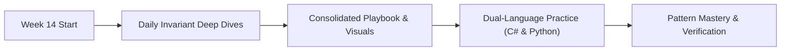

# 📘 Coordinate Transformations, Bit Manipulation & Number Theory

> 🧭 **Navigation:** [← Previous: Week 13](../week_13_backtracking_and_branch_bound/README.md) • [🏠 Curriculum Overview](../README.md) • [📘 Complete Syllabus](../COMPLETE_SYLLABUS.md) • [Next: Week 15 →](../week_15_advanced_strings_flow/README.md)

---

> 💡 **Instructor Guidance Note:**  
> *Not all sections or topics are mandatory. As a learner, you can adapt your pace freely. If you are preparing on an accelerated interview timeline or already feel confident with specific foundational concepts, feel free to skip or skim optional topics and prioritize high-yield patterns based on your personal interview goals.*

---

## 🎯 Weekly Mission & Conceptual Focus

In-place matrix rotations, spiral boundary scans, bitwise register manipulation, Euclidean GCD/LCM, Sieve of Eratosthenes, and modular exponentiation.

---

## 📅 Day-by-Day Learning Path

| Day | Instructional Module | Focus & Core Objective |
| :--- | :--- | :--- |
| **Day 01** | [Matrix Operations](Week_14_Day_01_Matrix_Operations_Instructional.md) | Core Daily Concept Deep Dive |
| **Day 02** | [Bitwise Operations](Week_14_Day_02_Bitwise_Operations_Instructional.md) | Core Daily Concept Deep Dive |
| **Day 03** | [Number Theory Basics](Week_14_Day_03_Number_Theory_Basics_Instructional.md) | Core Daily Concept Deep Dive |
| **Day 04** | [Advanced Strings](Week_14_Day_04_Advanced_Strings_Instructional.md) | Core Daily Concept Deep Dive |
| **Day 05** | [Advanced Number Theory](Week_14_Day_05_Advanced_Number_Theory_Instructional.md) | Core Daily Concept Deep Dive |

---

## 📚 Consolidated Playbooks & Reference Guides

*   📖 **Comprehensive Week Playbook:** [WEEK_14_FULL_PLAYBOOK.md](WEEK_14_FULL_PLAYBOOK.md) — High-density synthesis of all invariants, theorems, and pattern triggers for this week.
*   📊 **Visual Concepts Playbook (Hybrid):** [Week_14_Visual_Concepts_Playbook_HYBRID.md](Week_14_Visual_Concepts_Playbook_HYBRID.md) — Compact Mermaid diagrams, state transitions, and complexity reference tables.
*   💻 **Production C# Reference (.NET 8/9):** [Week_14_Extended_CSharp_Complete.md](Week_14_Extended_CSharp_Complete.md) — Idiomatic, zero-allocation memory-aware implementations and problem ladders.
*   🐍 **Production Python Reference (Python 3.11+):** [Week_14_Extended_Python_Complete.md](Week_14_Extended_Python_Complete.md) — Clean, pythonic reference implementations for rapid whiteboard prototyping.

---

## 🛠️ The 5 Core Support Files (`support files/`)

Every week is accompanied by five dedicated support files located in the `support files/` subdirectory:

1.  📋 [Daily Progress Checklist](support%20files/Week_14_Daily_Progress_Checklist.md) — Step-by-step accountability tracker for theory, coding, and variants.
2.  🧭 [Weekly Guidelines & Mental Models](support%20files/Week_14_Guidelines.md) — Strategic roadmap, common pitfalls, and conceptual anchors.
3.  🎙️ [Interview Q&A Comprehensive Reference](support%20files/Week_14_Interview_QA_Reference.md) — High-frequency senior technical questions with verbal response frameworks.
4.  🗺️ [Problem-Solving Roadmap](support%20files/Week_14_Problem_Solving_Roadmap.md) — Tier-1 problem progression ladder from warm-up to advanced.
5.  📑 [Summary & Key Concepts Synthesis](support%20files/Week_14_Summary_Key_Concepts.md) — Fast-revision cheat sheet covering all governing invariants and system trade-offs.

---

> 🧭 **Navigation:** [← Previous: Week 13](../week_13_backtracking_and_branch_bound/README.md) • [🏠 Curriculum Overview](../README.md) • [📘 Complete Syllabus](../COMPLETE_SYLLABUS.md) • [Next: Week 15 →](../week_15_advanced_strings_flow/README.md)
