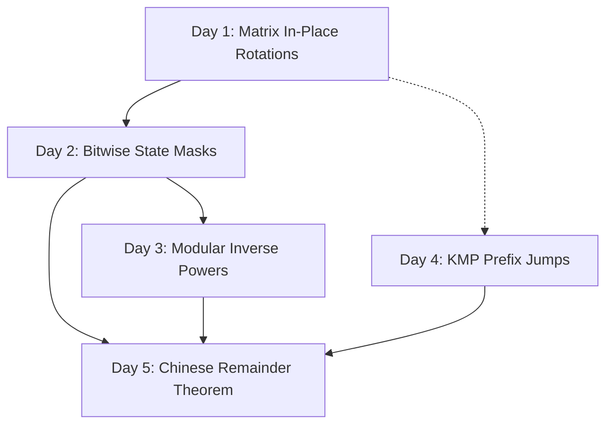

# 🗺️ Week 14 Roadmap v13: Matrices, Bitmasks & Number Theory

```text
+------------------------------------------------------------+
|                       WEEK 14 ROADMAP                      |
+------------------------------------------------------------+
                               |
                               v
                     +-------------------+
                     | Day 1: Matrices   |
                     | - spiral travel   |
                     | - in-place rotate |
                     +-------------------+
                               |
                               v
                     +-------------------+
                     | Day 2: Bitwise    |
                     | - logic properties|
                     | - submask loops   |
                     +-------------------+
                               |
                               v
                     +-------------------+
                     | Day 3: Primes/Mod |
                     | - Euclidean GCD   |
                     | - modular power   |
                     +-------------------+
                               |
                               v
                     +-------------------+
                     | Day 4: KMP & Trie |
                     | - fallback jumps  |
                     | - prefix trees    |
                     +-------------------+
                               |
                               v
                     +-------------------+
                     | Day 5: Totient/CRT|
                     | - coprime counts  |
                     +-------------------+
```

---

## 🎯 Weekly Objectives
This week is an integration checkpoint where we bridge geometric transformations, machine-level bit manipulation, algebraic structures, and advanced string pattern matching. By the end of this week, you will be able to:
1.  Solve complex 2D matrix transformations and boundary-safe walks with zero off-by-one errors.
2.  Use efficient registers over heap allocation to make state-searching algorithms run in constant space.
3.  Implement modular arithmetic and prime-based algorithms to solve algebraic problems.
4.  Compile patterns into non-backtracking state machines to process string streams in linear time.

---

## 📅 Daily Milestones & Focus Area

### 🧮 Day 1: Coordinate Transformations & Walks
*   **Focus Area**: In-place reflection transformations (Transpose) and boundary-pointer tracking (Spiral Traversal).
*   **Key Skills**: Swapping coordinate values symmetrically without data corruption, and managing nested bounds pointer updates safely.
*   **Study Objective**: Implement clockwise 90-degree rotations in-place without auxiliary arrays.
*   **Prerequisites**: Basic multi-dimensional array indices.

---

### 🔌 Day 2: Register-Level Bit Operations & States
*   **Focus Area**: Manipulating raw bits, counting bits efficiently, and executing nested submask loops.
*   **Key Skills**: Masking (`&`), enabling (`|`), toggling (`^`), using Two's Complement arithmetic (`n & -n`), and clearing trailing bits.
*   **Study Objective**: Implement Brian Kernighan popcounting and write an optimized submask loop.
*   **Prerequisites**: Binary bases representation.

---

### 📐 Day 3: Number Theory & Modular Properties
*   **Focus Area**: Divisibility, Greatest Common Divisors, modular multiplication, fast exponentiation, and multiplicative inverses.
*   **Key Skills**: Sieve of Eratosthenes, Euclidean subtraction chains, binary base decomposition, and Fermat's Little Theorem.
*   **Study Objective**: Implement fast modular exponentiation and find modular multiplicative inverses.
*   **Prerequisites**: Modular arithmetic remainders.

---

### 🧵 Day 4: Non-Backtracking String Matching
*   **Focus Area**: Longest Prefix Suffix (LPS) tables, character Tries, and Aho-Corasick multi-pattern state machines.
*   **Key Skills**: Precalculating pattern fallback indexes, merging shared prefixes into trees, and traversing tries with failure links.
*   **Study Objective**: Implement KMP string search and a standard Trie.
*   **Prerequisites**: String indexing operations.

---

### 🪐 Day 5: Advanced Number Theory (Optional)
*   **Focus Area**: Coprime integers count, solving systems of congruence equations, and Chinese Remainder Theorem (CRT) solvers.
*   **Key Skills**: Factorizing primes using trial division, and calculating modular inverses for non-prime moduli.
*   **Study Objective**: Build a generic CRT solver for K modular equations.
*   **Prerequisites**: Day 3 Modular Arithmetic.

---

## 🧗 Recommended Progression Pathway


---

## 🛡️ Common Pitfalls & Invariants
*   **The Overwriting Trap**: Attempting to rotate matrix elements directly inside a single loop moves values to incorrect coordinates. Always compose rotations using Transpose + Row Reverse operations.
*   **Signed Bitwise Shift Overflow**: In standard 32-bit signed integers, shifting a bit into index 31 alters the sign of the value because of Two's Complement. Always use unsigned integer types (`uint` or `ulong` in C#) for high-order bit operations.
*   **Decimal Division Modulo Error**: Never perform standard division `(A / B) % M` inside modular expressions. Modern hardware cannot preserve float modular remainders. Always multiply the numerator by the modular multiplicative inverse of the denominator instead.
