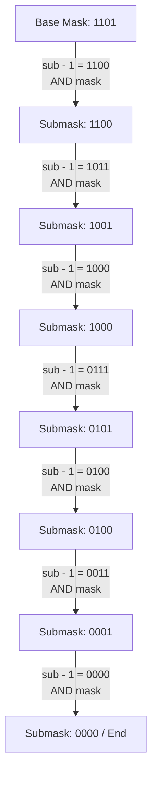

# 🎨 Week 14 Visual Concepts Playbook (Hybrid): Matrices, Bitmasks & Number Theory

This playbook provides high-fidelity visual maps, step-by-step trace diagrams, and ASCII art representations of coordinate transformations, bit-register filters, modular arithmetic wrapping, and prefix state fallbacks. Use this guide to build structural models of Week 14's core mechanics.

---

## 🧮 1. Matrix Transformations & Traversals

### A. Symmetrical Transposition (Square Grid)
Transposing a matrix swaps elements along the primary diagonal (from top-left to bottom-right). Symmetrically swap elements at `(i, j)` and `(j, i)` strictly where j > i.

#### 🗺️ Visual Scheme of Transpose Swaps
```text
          (j > i) : SWAP                         RESULTING MATRIX
      [ 0,0 | 0,1 | 0,2 ]                    [ 0,0 | 1,0 | 2,0 ]
        \      ^     ^                         \     |     |
         \    /     /                           \    |     |
      [ 1,0 | 1,1 | 1,2 ]                    [ 0,1 | 1,1 | 2,1 ]
              \     ^                                \     |
               \   /                                  \    |
      [ 2,0 | 2,1 | 2,2 ]                    [ 0,2 | 1,2 | 2,2 ]
```

---

### B. Matrix Clockwise 90° Rotation Block
By composing a Transpose operation with a Horizontal Row Reversal, you rotate a square grid clockwise without complex multi-point projection mapping.

#### 🔄 Step-by-Step Composition Trace
```text
  INPUT MATRIX              1. TRANSPOSE SWAP          2. REVERSE ROWS (CLOCKWISE)
  [ 1 | 2 | 3 ]               [ 1 | 4 | 7 ]              [ 7 | 4 | 1 ]
  [ 4 | 5 | 6 ]     ===>      [ 2 | 5 | 8 ]     ===>     [ 8 | 5 | 2 ]
  [ 7 | 8 | 9 ]               [ 3 | 6 | 9 ]              [ 9 | 6 | 3 ]
```

---

### C. Spiral Traversal Boundary Walk
Avoid nested loops with complex index formulas. Instead, track the matrix grid boundaries using four dynamic pointers: `top` (T), `bottom` (B), `left` (L), and `right` (R). Move your pointer sequentially and step the bounding margins inward.

#### 🚶 Spiral Tracking Trace
```text
  L                         R
T [  1  ->  2 ->  3  ->  4  ]    Step 1: Traverse Right from L to R along T. Then increment T.
  [  5  ->  6 ->  7      8  ]    Step 2: Traverse Down from T to B along R. Then decrement R.
  [  9      10 <- 11 <- 12  ]    Step 3: Traverse Left from R to L along B. Then decrement B.
B [ 13  -> 14 -> 15     16  ]    Step 4: Traverse Up from B to T along L. Then increment L.
```

---

## 🔌 2. Bitwise Registers & Submask Enumerations

### A. Two's Complement Negative Representation
Computers store negative numbers using Two's Complement. Negating an integer reverses every bit (the NOT operation) and adds 1:
-X = ~X + 1

#### ⚙️ Isolate Lowest Set Bit via `X & -X`
When you intersect a positive value with its negative counterpart, you isolate the rightmost set bit because of Two's Complement carry propagation.

```text
  Value (X)       =  12  ==>  0 0 0 0 1 1 0 0
  Invert (~X)     =  -13 ==>  1 1 1 1 0 0 1 1
  Add One (-X)    =  -12 ==>  1 1 1 1 1 1 0 0   (Carry propagates through trailing zeros)
  -------------------------------------------
  AND (X & -X)    =   4  ==>  0 0 0 0 0 1 0 0   (Isolates the rightmost 1-bit)
```

---

### B. Submask Iteration Logic (`(sub - 1) & mask`)
This loop systematically clearing trailing bits and re-activates sub-bits that match your original filter mask, enumerating all valid submasks in decreasing order.



---

## 📐 3. Sieve of Eratosthenes Marking
Instead of dividing each element to check for primality, the Sieve of Eratosthenes eliminates composites globally. Prime numbers find and eliminate all their multiple steps in a single pass.

#### ❌ Sieve Elimination Walkthrough (N = 15)
```text
  Index Array:  [0] [1] [2] [3] [4] [5] [6] [7] [8] [9] [10] [11] [12] [13] [14] [15]
  Init State:    F   F   T   T   T   T   T   T   T   T    T    T    T    T    T    T
  
  Process P=2:   F   F   T   T  [X]  T  [X]  T  [X]  T   [X]   T   [X]   T   [X]   T   (Mark multiples of 2)
  Process P=3:   F   F   T   T  [X]  T  [X]  T  [X] [X]  [X]   T   [X]   T   [X]  [X]  (Mark multiples of 3)
  
  Survivor Primes: { 2, 3, 5, 7, 11, 13 }
```

---

## 🧵 4. Advanced String State Preprocessing

### A. KMP Fallback Architecture & LPS Pointers
The Longest Prefix Suffix (LPS) table serves as a fallback index mapping for the pattern matching pointer. If a character mismatch occurs, the pattern pointer jumps back to the length of the longest matching prefix proper suffix, avoiding backtracking the main text pointer.

#### 🌉 KMP Match Path and Fallback Jumps
```text
  Text Scan Vector:
  [ A | B | A | B | A | B | X | C | D ]
    |   |   |   |   |   |   X  <-- Mismatch at Index 6 of Text (expected 'C', got 'B')
  [ A | B | A | B | A | C ]
    0   1   2   3   4   5  <-- Pattern match fails at index 5 of pattern
                        |
                        +===> Jumps pattern pointer to LPS[4] = 3 ("A B A")
                              Scanning continues without backing up Text pointer!
```

---

### B. Trie Structure & Prefix Collapsing Nodes
A Trie merges shared prefixes into common nodes, minimizing dictionary storage and speeding up search routines.

#### 🌳 Prefix Node Compression
When storing the words **"CAT"**, **"CAB"**, and **"CAR"**, they share the common prefix **"CA"**:

```text
                     ( Root )
                        |
                       [C]   - Node C
                        |
                       [A]   - Shared Prefix Node "CA"
                      / | \
                    [T][B][R] - Child Leaf word pointers
```

---

### C. Aho-Corasick Multi-Pattern Tree
The Aho-Corasick automaton extends a normal prefix Trie by adding **Failure Pointers** (dashed arrows) and **Output Pointers** to redirect searches dynamically.

```text
                     ROOT
                    /    \
                  [a]     [H]
                  /         \
                [s]        [i] -------+ (Match Output: "Hi")
                /             \       | (Failure Link)
    match: "as" @              [s] <--+
                                 \
                                 [h] -- (Match Output: "ish")
```

The dashed failure link connects node `i` to node `s` (since "H" is not a suffix match, but a path suffix of "i" exists at another state). This allows multi-pattern search in a single pass.
