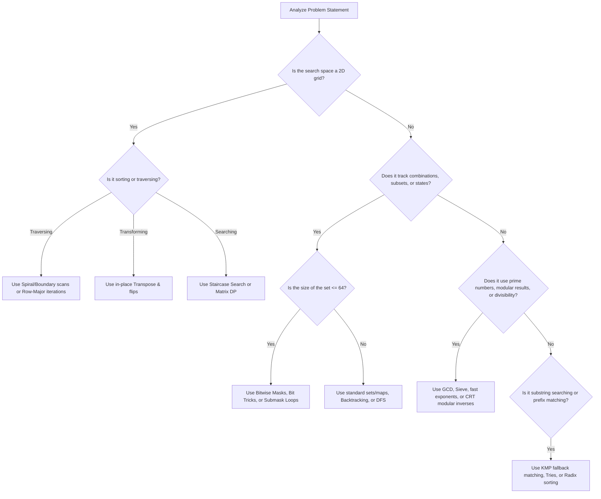

# 🗺️ Week 14 Problem Solving Roadmap

Use this guide to determine which specialized technique applies to a given problem.

---

## 🧭 Decision Matrix

---

## 🎯 Quick Reference Selection Guide

*   *If the problem is "Rotate square grid in-place"*: Use transposition followed by axial flips (O(N^2) time, O(1) space).
*   *If the problem is "Check power of 2"*: Use `n > 0 &&_ (n & (n - 1)) == 0`.
*   *If the problem is "Enumerate all subset states"*: Loop through masks using submask algebraic decrements (`(sub - 1) & mask`).
*   *If the problem is "Find modular inverse of a prime modulus"*: Use fast exponentiation with Fermat's exponent: `ModPow(A, P-2, P)`.
*   *If the problem is "Find single pattern in stream without backtracking"*: Precompute the LPS table and run a KMP search (O(N + M) time).
*   *If the problem is "Solve systems of simultaneous mod equations"*: Verify that the moduli are coprime, then use the Chinese Remainder Theorem.
