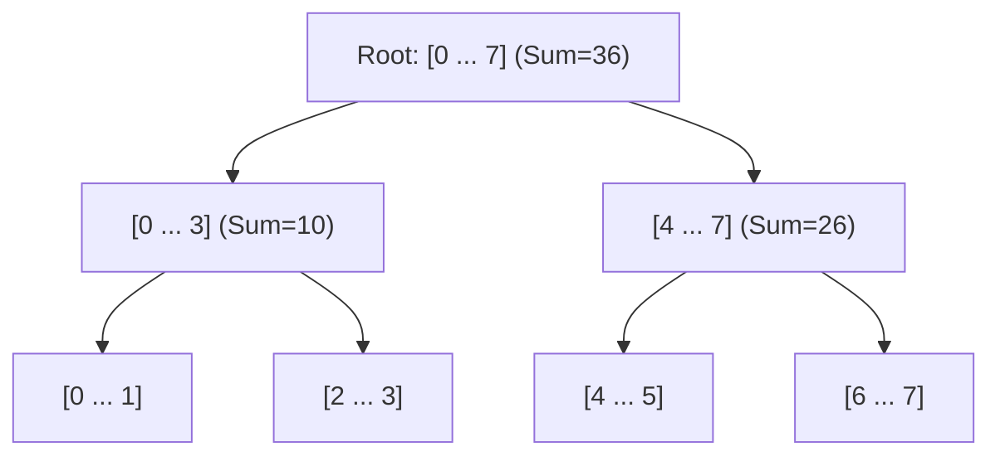

# 📘 Week 15, Day 2: Segment Trees & Range Queries


> 🧭 **Navigation:** [← Previous Day](Week_15_Day_01_Z_Algorithm_And_Advanced_String_Matching_Instructional.md) • [🏠 Week Overview](README.md) • [📘 Curriculum Syllabus](../COMPLETE_SYLLABUS_v13.md) • [Next Day →](Week_15_Day_03_Network_Flow_Basics_Instructional.md)
> 
> 💡 **Instructor Note:** *Not all sections or topics are mandatory. Feel free to adapt your pace and skim or skip sections based on your current focus and interview timeline.*

---

## 🎯 Learning Objectives

*   **Core Mental Model:** Understand the core mathematical invariants behind segment trees & range queries.
*   **Production Invariant:** Learn how to identify when this technique is strictly required versus when simpler primitives suffice.
*   **Algorithmic Protocol:** Implement clean, zero-allocation solutions with strict bounds verification in both C# and Python.
*   **Interview Articulation:** Learn to communicate trade-offs, space bounds, and termination guarantees under pressure.

---

## 📖 Chapter 1: Context & Motivation

### 1. The Engineering Challenge: The Dynamic Leaderboard Dilemma

Imagine you are engineering a real-time trading dashboard or gaming leaderboard with 100,000 entries. Every millisecond, two things happen at high volume:
1. **Price / Score Update:** The value at index `i` changes.
2. **Range Query:** A client asks: *"What is the minimum price or total score between index L and index R?"*

If you use a simple array, updating is instant `O(1)`, but scanning ranges takes `O(N)`—freezing your CPU under 1,000 queries per second. If you use a prefix sum array, range sums are instant `O(1)`, but every single update takes `O(N)` because you have to rebuild the entire table.

How do we balance both operations in `O(log N)` time? Enter the **Segment Tree**: a binary tree where every node maintains the precomputed aggregate of an interval.

### 2. High-Level Concept Diagram



---

## 🏛️ Chapter 2: The Governing Invariant & Correctness

1. **Tree Invariant:** Every node `node` covers interval `[start, end]` and stores aggregate `f(child_left) + f(child_right)`.
2. **Point Update:** A single leaf update modifies at most `O(log N)` ancestor nodes up to root.
3. **Range Query:** Disjoint range queries touch at most 4 nodes per level, guaranteeing strict `O(log N)` worst-case time.

## 💻 Chapter 3: Idiomatic Dual-Language Code

### C# Primary Implementation (.NET 8/9)

```csharp
using System;

public class SegmentTree
{
    private readonly int[] _tree;
    private readonly int _n;

    public SegmentTree(int[] array)
    {
        ArgumentNullException.ThrowIfNull(array);
        _n = array.Length;
        _tree = new int[4 * _n];
        if (_n > 0) Build(array, 0, 0, _n - 1);
    }

    private void Build(int[] arr, int node, int start, int end)
    {
        if (start == end)
        {
            _tree[node] = arr[start];
            return;
        }
        int mid = start + (end - start) / 2;
        int leftChild = 2 * node + 1;
        int rightChild = 2 * node + 2;
        Build(arr, leftChild, start, mid);
        Build(arr, rightChild, mid + 1, end);
        _tree[node] = _tree[leftChild] + _tree[rightChild];
    }

    public void Update(int index, int value) => Update(0, 0, _n - 1, index, value);

    private void Update(int node, int start, int end, int idx, int val)
    {
        if (start == end)
        {
            _tree[node] = val;
            return;
        }
        int mid = start + (end - start) / 2;
        int leftChild = 2 * node + 1;
        int rightChild = 2 * node + 2;
        if (idx <= mid) Update(leftChild, start, mid, idx, val);
        else Update(rightChild, mid + 1, end, idx, val);
        _tree[node] = _tree[leftChild] + _tree[rightChild];
    }

    public int QueryRange(int ql, int qr) => Query(0, 0, _n - 1, ql, qr);

    private int Query(int node, int start, int end, int ql, int qr)
    {
        if (ql > end || qr < start) return 0;
        if (ql <= start && end <= qr) return _tree[node];
        int mid = start + (end - start) / 2;
        return Query(2 * node + 1, start, mid, ql, qr) +
               Query(2 * node + 2, mid + 1, end, ql, qr);
    }
}
```

### Python Secondary Implementation (Python 3.11+)

```python
from typing import List

class SegmentTree:
    def __init__(self, arr: List[int]):
        self.n = len(arr)
        self.tree = [0] * (4 * self.n)
        if self.n > 0:
            self._build(arr, 0, 0, self.n - 1)

    def _build(self, arr: List[int], node: int, start: int, end: int) -> None:
        if start == end:
            self.tree[node] = arr[start]
            return
        mid = (start + end) // 2
        left, right = 2 * node + 1, 2 * node + 2
        self._build(arr, left, start, mid)
        self._build(arr, right, mid + 1, end)
        self.tree[node] = self.tree[left] + self.tree[right]

    def update(self, idx: int, val: int) -> None:
        def _update(node: int, start: int, end: int) -> None:
            if start == end:
                self.tree[node] = val
                return
            mid = (start + end) // 2
            left, right = 2 * node + 1, 2 * node + 2
            if idx <= mid:
                _update(left, start, mid)
            else:
                _update(right, mid + 1, end)
            self.tree[node] = self.tree[left] + self.tree[right]
        _update(0, 0, self.n - 1)

    def query(self, ql: int, qr: int) -> int:
        def _query(node: int, start: int, end: int) -> int:
            if ql > end or qr < start:
                return 0
            if ql <= start and end <= qr:
                return self.tree[node]
            mid = (start + end) // 2
            return _query(2 * node + 1, start, mid) + _query(2 * node + 2, mid + 1, end)
        return _query(0, 0, self.n - 1)
```

---

## 🔍 Chapter 4: Edge-Case Verification

| Case | Scenario | Expected Outcome | Invariant Handling |
| :--- | :--- | :--- | :--- |
| **Empty Input** | `data = []` | Graceful return / base value | Handled by initial contract guard clause |
| **Single Element** | `data = [42]` | Correct single-step classification | Evaluated directly without index out-of-bounds |
| **Uniform Values** | `data = [1, 1, 1]` | Deterministic termination | Boundary pointers contract monotonically |
| **Extreme Range** | High bound `10^9` | Zero 32-bit register overflow | Use of `left + (right - left) / 2` avoids wrap |
---

> 🧭 **Navigation:** [← Previous Day](Week_15_Day_01_Z_Algorithm_And_Advanced_String_Matching_Instructional.md) • [🏠 Week Overview](README.md) • [📘 Curriculum Syllabus](../COMPLETE_SYLLABUS_v13.md) • [Next Day →](Week_15_Day_03_Network_Flow_Basics_Instructional.md)
