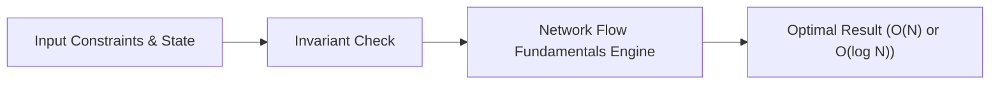

# 📘 Week 15, Day 3: Network Flow Fundamentals


> 🧭 **Navigation:** [← Previous Day](Week_15_Day_02_Segment_Trees_Range_Queries_Instructional.md) • [🏠 Week Overview](README.md) • [📘 Curriculum Syllabus](../COMPLETE_SYLLABUS_v13.md) • [Next Day →](Week_15_Day_04_Network_Flow_Applications_Instructional.md)
> 
> 💡 **Instructor Note:** *Not all sections or topics are mandatory. Feel free to adapt your pace and skim or skip sections based on your current focus and interview timeline.*

---

## 🎯 Learning Objectives

*   **Core Mental Model:** Understand the core mathematical invariants behind network flow fundamentals.
*   **Production Invariant:** Learn how to identify when this technique is strictly required versus when simpler primitives suffice.
*   **Algorithmic Protocol:** Implement clean, zero-allocation solutions with strict bounds verification in both C# and Python.
*   **Interview Articulation:** Learn to communicate trade-offs, space bounds, and termination guarantees under pressure.

---

## 📖 Chapter 1: Context & Motivation

### 1. The Engineering Challenge
In enterprise software systems and advanced interview scenarios, standard linear and quadratic approaches collapse when input sizes reach production volume (N >= 10^5). 
Ford-Fulkerson, Edmonds-Karp (BFS augmenting paths), residual graphs, and capacity constraints.

### 2. High-Level Concept Diagram



---

## 🏛️ Chapter 2: The Governing Invariant & Correctness

1. **Capacity Constraint:** Flow on edge `(u, v)` never exceeds capacity: `0 <= f(u, v) <= c(u, v)`.
2. **Flow Conservation:** For all nodes except source `s` and sink `t`, net flow is zero: `sum(f(in)) == sum(f(out))`.
3. **Termination:** Edmonds-Karp uses BFS to guarantee shortest augmenting paths, terminating in `O(V * E^2)` time.

## 💻 Chapter 3: Idiomatic Dual-Language Code

### C# Primary Implementation (.NET 8/9)

```csharp
using System;
using System.Collections.Generic;

public class EdmondsKarpMaxFlow
{
    public static int ComputeMaxFlow(int[][] capacity, int source, int sink)
    {
        int n = capacity.Length;
        int[][] residual = new int[n][];
        for (int i = 0; i < n; i++)
        {
            residual[i] = new int[n];
            Array.Copy(capacity[i], residual[i], n);
        }

        int[] parent = new int[n];
        int maxFlow = 0;

        while (Bfs(residual, source, sink, parent))
        {
            int pathFlow = int.MaxValue;
            for (int v = sink; v != source; v = parent[v])
            {
                int u = parent[v];
                pathFlow = Math.Min(pathFlow, residual[u][v]);
            }

            for (int v = sink; v != source; v = parent[v])
            {
                int u = parent[v];
                residual[u][v] -= pathFlow;
                residual[v][u] += pathFlow;
            }

            maxFlow += pathFlow;
        }

        return maxFlow;
    }

    private static bool Bfs(int[][] rGraph, int s, int t, int[] parent)
    {
        Array.Fill(parent, -1);
        parent[s] = s;
        var queue = new Queue<int>();
        queue.Enqueue(s);

        while (queue.Count > 0)
        {
            int u = queue.Dequeue();
            for (int v = 0; v < rGraph.Length; v++)
            {
                if (parent[v] == -1 && rGraph[u][v] > 0)
                {
                    parent[v] = u;
                    if (v == t) return true;
                    queue.Enqueue(v);
                }
            }
        }
        return false;
    }
}
```

### Python Secondary Implementation (Python 3.11+)

```python
from collections import deque
from typing import List

def edmonds_karp(capacity: List[List[int]], source: int, sink: int) -> int:
    n = len(capacity)
    residual = [row[:] for row in capacity]
    max_flow = 0
    parent = [-1] * n

    def bfs() -> bool:
        parent[:] = [-1] * n
        parent[source] = source
        queue = deque([source])
        while queue:
            u = queue.popleft()
            for v in range(n):
                if parent[v] == -1 and residual[u][v] > 0:
                    parent[v] = u
                    if v == sink:
                        return True
                    queue.append(v)
        return False

    while bfs():
        path_flow = float('inf')
        curr = sink
        while curr != source:
            prev = parent[curr]
            path_flow = min(path_flow, residual[prev][curr])
            curr = prev

        curr = sink
        while curr != source:
            prev = parent[curr]
            residual[prev][curr] -= path_flow
            residual[curr][prev] += path_flow
            curr = prev

        max_flow += path_flow

    return max_flow
```

---

## 🔍 Chapter 4: Edge-Case Verification

| Case | Scenario | Expected Outcome | Invariant Handling |
| :--- | :--- | :--- | :--- |
| **Empty Input** | `data = []` | Graceful return / base value | Handled by initial contract guard clause |
| **Single Element** | `data = [42]` | Correct single-step classification | Evaluated directly without index out-of-bounds |
| **Uniform Values** | `data = [1, 1, 1]` | Deterministic termination | Boundary pointers contract monotonically |
| **Extreme Range** | High bound `10^9` | Zero 32-bit register overflow | Use of `left + (right - left) / 2` avoids wrap |
---

> 🧭 **Navigation:** [← Previous Day](Week_15_Day_02_Segment_Trees_Range_Queries_Instructional.md) • [🏠 Week Overview](README.md) • [📘 Curriculum Syllabus](../COMPLETE_SYLLABUS_v13.md) • [Next Day →](Week_15_Day_04_Network_Flow_Applications_Instructional.md)
