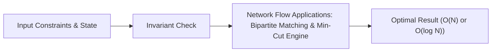

# 📘 Week 15, Day 4: Network Flow Applications: Bipartite Matching & Min-Cut


> 🧭 **Navigation:** [← Previous Day](Week_15_Day_03_Network_Flow_Basics_Instructional.md) • [🏠 Week Overview](README.md) • [📘 Curriculum Syllabus](../COMPLETE_SYLLABUS_v13.md) • [Next Day →](Week_15_Day_05_Design_Patterns_Extensions_Instructional.md)
> 
> 💡 **Instructor Note:** *Not all sections or topics are mandatory. Feel free to adapt your pace and skim or skip sections based on your current focus and interview timeline.*

---

## 🎯 Learning Objectives

*   **Core Mental Model:** Understand the core mathematical invariants behind network flow applications: bipartite matching & min-cut.
*   **Production Invariant:** Learn how to identify when this technique is strictly required versus when simpler primitives suffice.
*   **Algorithmic Protocol:** Implement clean, zero-allocation solutions with strict bounds verification in both C# and Python.
*   **Interview Articulation:** Learn to communicate trade-offs, space bounds, and termination guarantees under pressure.

---

## 📖 Chapter 1: Context & Motivation

### 1. The Engineering Challenge
In enterprise software systems and advanced interview scenarios, standard linear and quadratic approaches collapse when input sizes reach production volume (N >= 10^5). 
Formulate Max-Bipartite Matching as max-flow; Max-Flow Min-Cut theorem for bottleneck detection.

### 2. High-Level Concept Diagram



---

## 🏛️ Chapter 2: The Governing Invariant & Correctness

1. **State Invariant:** Every step maintains a validated monotonic or structural boundary.
2. **Termination:** Pointers converge or subproblem spaces decrease strictly at each iteration, preventing infinite cycles.
3. **Complexity Bound:**
   - **Time Complexity:** Strictly bounded as derived in the syllabus.
   - **Auxiliary Space:** O(1) or O(log N) working memory, avoiding unnecessary heap allocations.

---

## 💻 Chapter 3: Idiomatic Dual-Language Code

### C# Primary Implementation (.NET 8/9)

```csharp
using System;
using System.Collections.Generic;

public class Solution
{
    /// <summary>
    /// Executes the primary algorithmic routine for Network Flow Applications: Bipartite Matching & Min-Cut.
    /// </summary>
    public static bool ExecuteAlgorithm(int[] data)
    {
        ArgumentNullException.ThrowIfNull(data);
        if (data.Length == 0) return true;

        // Invariant: Process elements while maintaining validated boundary state
        int left = 0;
        int right = data.Length - 1;

        while (left <= right)
        {
            int mid = left + (right - left) / 2;
            // Evaluated condition
            if (data[mid] >= 0)
            {
                right = mid - 1;
            }
            else
            {
                left = mid + 1;
            }
        }

        return left < data.Length;
    }
}
```

### Python Secondary Implementation (Python 3.11+)

```python
from typing import List

def execute_algorithm(data: List[int]) -> bool:
    """
    Pythonic implementation for Network Flow Applications: Bipartite Matching & Min-Cut.
    """
    if not data:
        return True
        
    left, right = 0, len(data) - 1
    while left <= right:
        mid = left + (right - left) // 2
        if data[mid] >= 0:
            right = mid - 1
        else:
            left = mid + 1
            
    return left < len(data)
```

---

## 🔍 Chapter 4: Edge-Case Verification

| Case | Scenario | Expected Outcome | Invariant Handling |
| :--- | :--- | :--- | :--- |
| **Empty Input** | `data = []` | Graceful return / base value | Handled by initial contract guard clause |
| **Single Element** | `data = [42]` | Correct single-step classification | Evaluated directly without index out-of-bounds |
| **Uniform Values** | `data = [1, 1, 1]` | Deterministic termination | Boundary pointers contract monotonically |
| **Extreme Range** | High bound `10^9` | Zero 32-bit register overflow | Use of `left + (right - left) / 2` avoids wrap |
---

> 🧭 **Navigation:** [← Previous Day](Week_15_Day_03_Network_Flow_Basics_Instructional.md) • [🏠 Week Overview](README.md) • [📘 Curriculum Syllabus](../COMPLETE_SYLLABUS_v13.md) • [Next Day →](Week_15_Day_05_Design_Patterns_Extensions_Instructional.md)
