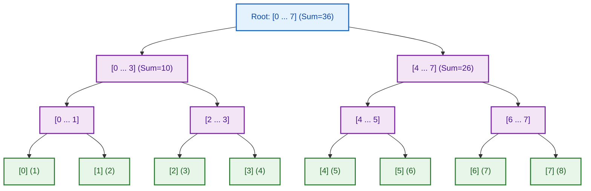
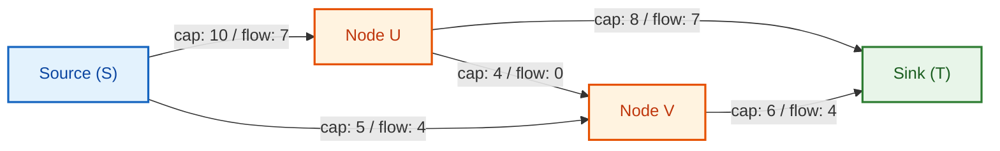
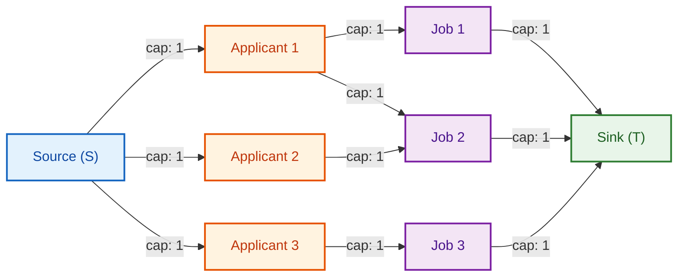

# 📊 Week 15 Visual Concepts Playbook (HYBRID)

> 🧭 **Navigation:** [🏠 Week Overview](README.md) • [📘 Curriculum Syllabus](../COMPLETE_SYLLABUS.md)
> 
> 💡 **Instructor Note:** *This playbook covers advanced string algorithms, range query trees, and network flow paradigms. Focus on the core invariants (Z-box boundary tracking, Segment Tree interval decomposition, and residual edge cancellation) that transform intractable problems into linear or logarithmic routines.*

---

## 📋 Quick Navigation

- **Day 1:** Z-Algorithm & Advanced String Matching (Z-Box Invariant, Prefix Mirroring)
- **Day 2:** Segment Trees & Range Queries (Interval Trees, Point Updates, Lazy Propagation)
- **Day 3:** Network Flow Fundamentals (Residual Graph, Ford-Fulkerson, Edmonds-Karp BFS)
- **Day 4:** Network Flow Applications (Max-Flow Min-Cut, Maximum Bipartite Matching)
- **Day 5:** Pattern Synthesis & Scaled Trade-offs (Multi-pattern Matching vs Segment Trees)

---

# DAY 1: Z-Algorithm & Advanced String Matching

## Pattern Map: Exact String Matching Taxonomy

| Algorithm | Preprocessing Time | Search Time | Auxiliary Space | Best For |
| :--- | :---: | :---: | :---: | :--- |
| **KMP (Knuth-Morris-Pratt)** | `O(M)` (LPS array) | `O(N)` | `O(M)` | Streaming text where backtracking is forbidden |
| **Z-Algorithm** | `O(N + M)` (Z-array) | `O(1)` per index | `O(N + M)` | Finding all occurrences, period analysis, prefix queries |
| **Rabin-Karp** | `O(M)` | `O(N)` avg / `O(NM)` worst | `O(1)` | Multi-pattern matching with rolling hash |
| **Aho-Corasick** | `O(Σ M)` (Trie + DFA) | `O(N + Matches)` | `O(Σ M)` | Dictionary matching against static keyword sets |

---

## Pattern 1.1: The Z-Array & The Z-Box Invariant

### Core Concept

For a string `S` of length `N`, the **Z-array** stores at each index `i` (`1 <= i < N`) the length of the longest substring starting at `S[i]` that is also a prefix of `S`. By convention, `Z[0] = 0`.

To compute `Z[i]` in linear time `O(N)`, maintain an active **Z-box** `[L, R]`, which is the contiguous interval `S[L ... R]` that:
1. Matches a prefix of `S` (`S[L ... R] == S[0 ... R - L]`).
2. Has the **maximum `R`** among all matching substrings discovered so far.

### Visual 1: Z-Box Window Invariant

```text
String:
Index:   0   1   2   3 ...  L .......... i .......... R ... N-1
Char:   [P r e f i x]      [P r e f i x  M i r r o r]
         |___________|      |_______________________|
           S[0...R-L]                S[L...R]

Position of i relative to current Z-box [L, R]:
Case 1: i > R (Outside Box)
  -> No prior work applies. Start brute-force comparisons from S[i] with S[0].
  -> If a match is found, establish new Z-box [L = i, R = i + Z[i] - 1].

Case 2: i <= R (Inside Box)
  -> S[i] maps directly to prefix mirror: k = i - L
  -> We already know S[L...R] == S[0...R-L], so S[i...R] == S[k...R-L].
  
  Sub-case 2a: Z[k] < R - i + 1
    -> The prefix match at mirror k stays strictly inside the box.
    -> Z[i] = Z[k] (No character comparisons needed!)

  Sub-case 2b: Z[k] >= R - i + 1
    -> The match extends up to or beyond boundary R.
    -> S[i...R] is guaranteed to match S[k...R-L].
    -> Start character comparisons from R + 1 onward.
    -> Update L = i and expand R as far as characters continue matching.
```

### Visual 2: Z-Array Execution Trace

String: `S = "a a b $ a a b a a b"` (Looking for pattern `"aab"` in `"aabaab"`)

| `i` | `S[i]` | `[L, R]` Before | Mirror `k = i - L` | Action Taken | `Z[i]` | `[L, R]` After |
| :---: | :---: | :---: | :---: | :--- | :---: | :---: |
| `0` | `'a'` | `[0, 0]` | - | Prefix start (skipped) | `0` | `[0, 0]` |
| `1` | `'a'` | `[0, 0]` | - | `i > R`: Compare `S[1]` vs `S[0]` (`'a'=='a'`), `S[2]` vs `S[1]` (`'b'!='a'`) | `1` | `[1, 1]` |
| `2` | `'b'` | `[1, 1]` | - | `i > R`: Compare `S[2]` vs `S[0]` (`'b'!='a'`) | `0` | `[1, 1]` |
| `3` | `'$'` | `[1, 1]` | - | `i > R`: Compare `S[3]` vs `S[0]` (`'$'!='a'`) | `0` | `[1, 1]` |
| `4` | `'a'` | `[1, 1]` | - | `i > R`: Matches `S[4..6] == S[0..2]` (`"aab"`) | `3` | `[4, 6]` |
| `5` | `'a'` | `[4, 6]` | `5 - 4 = 1` | `i <= R`: `Z[1] = 1`, `R - i + 1 = 2`. Subcase 2a: `Z[1] < 2` | `1` | `[4, 6]` |
| `6` | `'b'` | `[4, 6]` | `6 - 4 = 2` | `i <= R`: `Z[2] = 0`, `R - i + 1 = 1`. Subcase 2a: `Z[2] < 1` | `0` | `[4, 6]` |
| `7` | `'a'` | `[4, 6]` | - | `i > R`: Matches `S[7..9] == S[0..2]` (`"aab"`) | `3` | `[7, 9]` |
| `8` | `'a'` | `[7, 9]` | `8 - 7 = 1` | `i <= R`: `Z[1] = 1`, `R - i + 1 = 2`. Subcase 2a: `Z[1] < 2` | `1` | `[7, 9]` |
| `9` | `'b'` | `[7, 9]` | `9 - 7 = 2` | `i <= R`: `Z[2] = 0`, `R - i + 1 = 1`. Subcase 2a: `Z[2] < 1` | `0` | `[7, 9]` |

Pattern matches occur wherever `Z[i] == len(pattern)` (indices `4` and `7` in concatenated string).

---

### Common Failure Modes: Day 1

> [!WARNING]
> **Failure 1.1: Forgetting a Unique Delimiter**
> When concatenating `Pattern + "$" + Text`, the delimiter must NEVER appear in `Pattern` or `Text`.
> If no delimiter is used, `Z[i]` values can overshoot the pattern length and falsely match across string boundaries.

> [!WARNING]
> **Failure 1.2: Off-By-One When Re-establishing Z-Box**
> When extending `R`, remember `R` is inclusive:
> - ✅ `while (R < n && S[R] == S[R - L]) R++; Z[i] = R - L; R--;`
> - ❌ `while (R < n && S[R] == S[R - L]) { R++; Z[i]++; }` without decrementing `R` afterward leads to an extra character overshoot.

---

# DAY 2: Segment Trees & Range Queries

## Pattern Map: Range Query Tree Architecture



---

## Pattern 2.1: Canonical Range Query Decomposition

### Concept

A Segment Tree partitions an array of size `N` into a balanced binary tree of intervals. Any arbitrary query interval `[Q_L, Q_R]` is satisfied by at most `2 * ceil(log2 N)` disjoint canonical nodes in the tree, giving `O(log N)` query time.

```text
Query Decomposition Rules for node covering [node_L, node_R]:
1. Completely Disjoint: [Q_L, Q_R] does not intersect [node_L, node_R]
   -> Return neutral value (0 for Sum, +infinity for Min, -infinity for Max).
2. Completely Covered: [node_L, node_R] is entirely inside [Q_L, Q_R]
   -> Return tree[node] immediately (No further recursion!).
3. Partial Overlap: [node_L, node_R] partially intersects [Q_L, Q_R]
   -> Recurse on left child:  [node_L, mid]
   -> Recurse on right child: [mid + 1, node_R]
   -> Combine child results:  merge(left_result, right_result)
```

### Visual 1: Array-Based Segment Tree Indexing (1-Based)

```text
Array indices for 1-based heap layout (tree size = 4 * N):
- Root node: index 1
- Left child of node `k`:  2 * k      (Bitwise: k << 1)
- Right child of node `k`: 2 * k + 1  (Bitwise: (k << 1) | 1)
- Parent of node `k`:      k / 2      (Bitwise: k >> 1)
```

---

## Pattern 2.2: Lazy Propagation for Range Updates

### Concept

Updating every leaf in a range `[Q_L, Q_R]` takes `O(N)`. **Lazy propagation** defers updates by maintaining a `lazy[k]` value on canonical covering nodes. The deferred value is pushed down to children only when a future query or update actually visits those children.

```text
Lazy Invariant:
- tree[node] reflects all updates applied to its subtree so far.
- lazy[node] holds pending updates that have NOT YET been pushed down to its children.

Push-Down Step (before recursing into children of node k covering [L, R]):
if (lazy[k] != 0):
  mid = (L + R) / 2
  // Update left child
  tree[2 * k] += lazy[k] * (mid - L + 1)
  lazy[2 * k] += lazy[k]
  // Update right child
  tree[2 * k + 1] += lazy[k] * (R - mid)
  lazy[2 * k + 1] += lazy[k]
  // Reset parent lazy
  lazy[k] = 0
```

---

### Common Failure Modes: Day 2

> [!WARNING]
> **Failure 2.1: Insufficient Tree Array Size**
> A Segment Tree for an array of size `N` requires up to `4 * N` elements in its flat array representation. Allocating `2 * N` causes out-of-bounds index exceptions whenever `N` is not a power of 2.
> - ✅ `int[] tree = new int[4 * n];`

> [!WARNING]
> **Failure 2.2: Querying Without Pushing Down Lazy State**
> Always execute the push-down step at the start of both `Update` AND `Query` methods before branching to children. Querying a child with stale unpropagated lazy state returns incorrect values.

---

# DAY 3: Network Flow Fundamentals

## Pattern Map: Flow Network Components



---

## Pattern 3.1: The Residual Graph & Back-Edges

### Concept

The **Residual Graph** `G_f` defines what flow can still be added or redirected:
1. **Forward Edge `(u -> v)`:** Residual capacity `r(u, v) = c(u, v) - f(u, v)`. Can push up to `r(u, v)` additional flow.
2. **Backward Edge `(v -> u)`:** Residual capacity `r(v, u) = f(u, v)`. Allows **undoing** or rerouting previous flow through an alternative path.

### Visual 1: Flow Cancellation (The Power of Back-Edges)

```text
Initial Forward Edge:
(u) ======= [Capacity: 10, Flow: 6] ======> (v)

Residual Graph Representation:
(u) ------- [Residual Capacity: 4] -------> (v)   (Can push 4 more forward)
(u) <------ [Residual Capacity: 6] -------- (v)   (Can cancel up to 6 backward!)

Why back-edges are mandatory:
If an early augmenting path made a locally suboptimal greedy routing choice,
a later augmenting path can traverse the backward edge to cancel that choice
and reroute the original flow along a better path!
```

---

## Pattern 3.2: Edmonds-Karp Algorithm (BFS Augmentation)

### Concept

Edmonds-Karp implements the Ford-Fulkerson method using **Breadth-First Search (BFS)** to find the shortest augmenting path (fewest edges) from Source `S` to Sink `T`.

- **Time Complexity:** `O(V * E^2)` (Guaranteed termination, polynomial bound).
- **Space Complexity:** `O(V + E)` for adjacency matrix/list and parent pointers.

```text
Algorithm Steps:
1. Initialize flow f(u, v) = 0 for all edges.
2. Loop:
   a. Run BFS from S to find shortest path to T in residual graph where r(u, v) > 0.
   b. If no path reaches T -> STOP. Maximum flow reached.
   c. Find bottleneck capacity: delta = min(r(u, v)) along the BFS path.
   d. For each edge (u, v) on path:
      - Add delta to forward flow: r(u, v) -= delta
      - Add delta to backward flow: r(v, u) += delta
3. Return total pushed flow.
```

---

# DAY 4: Network Flow Applications

## Pattern 4.1: The Max-Flow Min-Cut Theorem

### Concept

A **Cut `(A, B)`** partitions vertices such that `S in A` and `T in B`. The capacity of the cut is the sum of capacities of edges pointing from set `A` into set `B`:
`Capacity(A, B) = sum( c(u, v) )` for `u in A`, `v in B`.

**Max-Flow Min-Cut Theorem:**
`Maximum Flow from S to T == Minimum Capacity of an S-T Cut`.

### Visual 1: Identifying the Min-Cut from the Residual Graph

```text
After Edmonds-Karp terminates with Max Flow:
1. Run BFS/DFS from S in the final residual graph visiting only edges with r(u, v) > 0.
2. Set A = { all vertices reachable from S in the residual graph }.
3. Set B = { all remaining vertices (including T) }.

Min-Cut Edges:
All original edges (u -> v) where u in A and v in B that are fully saturated (flow == capacity).
These edges represent the critical systemic bottleneck of the network!
```

---

## Pattern 4.2: Maximum Bipartite Matching

### Concept

Given two disjoint sets of entities (e.g. `Applicants` and `Jobs`) with compatibility edges, find the maximum number of mutually exclusive pairs.

### Visual 1: Reduction to Flow Network



- Each applicant can take at most 1 job: capacity from `S -> Applicant` is `1`.
- Each job can be held by at most 1 applicant: capacity from `Job -> T` is `1`.
- Total Max Flow == Size of Maximum Bipartite Matching.

---

# DAY 5: Pattern Synthesis & Scaled Trade-offs

## 📊 Range Query Data Structure Decision Matrix

| Requirement | Preferred Structure | Build Time | Query Time | Update Time | Auxiliary Space |
| :--- | :--- | :---: | :---: | :---: | :---: |
| Static Array, Range Sum Queries | **Prefix Sum Array** | `O(N)` | `O(1)` | `O(N)` | `O(N)` |
| Static Array, Range Min/Max Queries | **Sparse Table** | `O(N log N)` | `O(1)` | `O(N log N)` | `O(N log N)` |
| Dynamic Array, Point Update, Range Sum | **Fenwick Tree (BIT)** | `O(N)` | `O(log N)` | `O(log N)` | `O(N)` |
| Dynamic Array, Range Update, Range Query | **Segment Tree + Lazy** | `O(N)` | `O(log N)` | `O(log N)` | `O(4N)` |
| Dynamic Tree Path Queries (Trees) | **HLD + Segment Tree** | `O(N)` | `O(log^2 N)` | `O(log^2 N)` | `O(N)` |

---

## 📝 Final Note: When to Use These Advanced Patterns

1. **Z-Algorithm:** Choose when you need exact prefix-match metrics for every suffix of a string, or when computing string periodicity and repeated substrings in strictly linear `O(N)` time.
2. **Segment Tree:** Choose when you have dynamic arrays with both range modifications (e.g., adding `V` to interval `[L, R]`) and range aggregations (e.g., sum, min, gcd). If only prefix/cumulative sums with point updates are needed, prefer the lighter **Fenwick Tree**.
3. **Network Flow:** Choose when solving assignment problems, edge-disjoint path routing, circulation with demands, or minimum cuts. If the graph is bipartite, Hopcroft-Karp (`O(E * sqrt(V))`) beats general max flow.

---

> 🧭 **Navigation:** [🏠 Week Overview](README.md) • [📘 Curriculum Syllabus](../COMPLETE_SYLLABUS.md)
